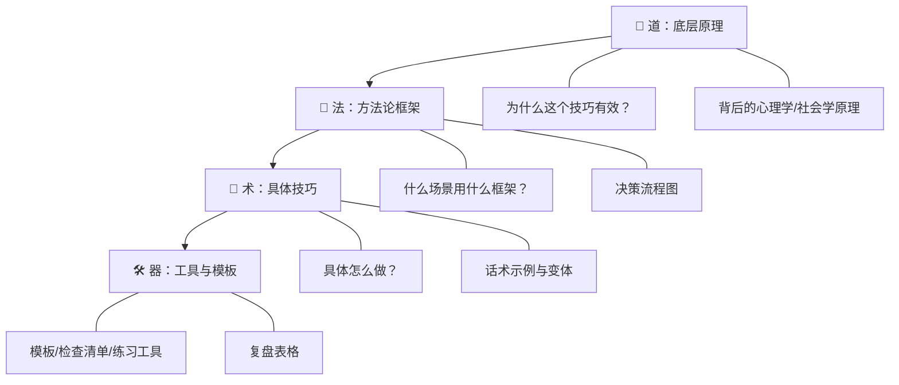
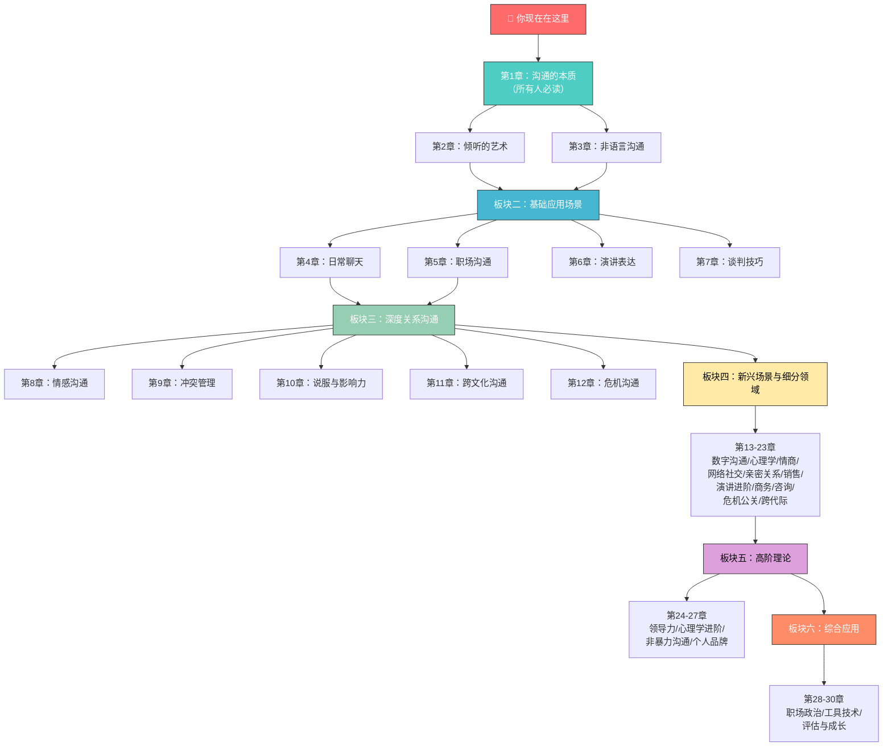
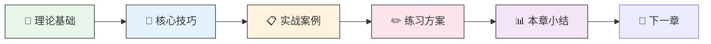

# 前言与导读

## 一个真实的故事

2012年，两位心理学家在斯坦福大学做了一项实验。他们招募了200名志愿者，每人被要求向陌生人推销一件商品。实验结果令人震惊——**销售业绩排名前10%的人，和排名后10%的人，在产品知识、价格策略、甚至话术模板上几乎没有差异。** 真正拉开差距的，是他们在前30秒内建立信任感的能力、倾听客户真实需求的敏锐度、以及根据对方反应实时调整表达方式的灵活性。

换句话说，决定成败的不是"说什么"，而是"怎么说"和"怎么听"。

如果你正在翻看这本书，大概率你也经历过类似的困惑：明明自己能力不差，却总是表达不清楚；明明是好意，说出来却得罪了人；明明想好好沟通，最后却变成了争吵。这些不是你的性格缺陷，不是你"天生不会说话"——它们只是**你还没有系统学习过沟通这门技能**。

这本书要做的，就是把这门技能拆解成可学习、可练习、可掌握的完整体系，交到你手上。

## 为什么沟通值得你专门花时间学

### 一个被严重低估的能力

大多数人对沟通有一个根深蒂固的误解：沟通是"自然而然"的事，不需要专门学习。人们愿意花几个月学一门编程语言、考一个专业证书、甚至研究股票投资，却从不认为沟通值得投入系统性的时间。

这个认知偏差的代价是巨大的。哈佛大学的一项长期追踪研究（Grant Study，持续75年）发现，**决定人生幸福感的第一因素不是财富、不是成就，而是人际关系的质量。** 而人际关系的核心载体，正是沟通。

### 沟通能力的经济回报

从纯功利的角度看，沟通能力的回报率也远超多数"硬技能"：

| 沟通能力的影响维度 | 具体数据 |
|---|---|
| 薪资差异 | 善于沟通的员工平均薪资比同岗位高12%-15%（LinkedIn 2023职场技能报告） |
| 晋升速度 | 具备优秀表达能力的管理者晋升速度是平均水平的1.8倍 |
| 创业成功率 | 投资人最看重的创始团队特质中，"沟通能力"排在前三 |
| 客户满意度 | 客服沟通质量每提升1个标准差，客户留存率提升7% |

这些数字背后是一个朴素的道理：**在信息时代，几乎所有价值创造都需要人与人的协作，而协作的质量取决于沟通的质量。**

### 沟通影响你生活的每一个角落

沟通不是一项"职场技能"，它渗透在你生活的方方面面：

- **亲密关系**：John Gottman的研究表明，伴侣间沟通模式能以93.6%的准确率预测关系是否会走向破裂
- **亲子教育**：父母与孩子的沟通方式，直接影响孩子的安全感建立和情绪调节能力
- **心理健康**：无法有效表达情感是抑郁症和焦虑症的重要诱因之一
- **社交圈层**：你的社交网络质量和你的沟通能力高度正相关
- **自我认知**：你能清晰地表达自己，才真正理解自己

## 这本书的定位：不是鸡汤，是武器

市面上关于沟通的书很多，但大多数存在两个极端：要么是抽象的理论堆砌，读完感觉"有道理"但完全不知道怎么做；要么是简单的话术罗列，当时觉得"有用"但换个场景就失灵。

这本书走的是第三条路——**道法术器贯通**。

### 四层知识体系

- **道（理论层）**：每个技巧都有理论支撑，告诉你"为什么有效"。理解了原理，你才能灵活变通，而不是死记硬背
- **法（方法层）**：提供经过验证的方法论框架，帮你在面对具体场景时知道"该走哪条路"
- **术（技巧层）**：拆解为具体可操作的步骤，附带真实场景的话术示例，拿来就能用
- **器（工具层）**：提供模板、检查清单、练习方案，让你的学习有章可循

每一章都贯穿这四个层次，确保你不仅"知道"，还能"做到"，更理解"为什么这样做"。

## 这本书包含什么：30章完整体系

全书分为六大板块，共30章，从基础理论到高阶应用，构建完整的沟通能力图谱。

### 板块一：理论根基（第1-3章）

这三章是整本书的地基。无论你是初学者还是老手，都建议完整阅读——很多沟通问题的根源，恰恰在于基础理论的缺失。

| 章节 | 核心内容 | 你会获得什么 |
|---|---|---|
| 第1章：沟通的本质 | 沟通模型、信息编码解码、噪声理论、反馈回路 | 理解沟通"到底在发生什么"，建立正确的认知框架 |
| 第2章：倾听的艺术 | 主动倾听、同理心倾听、反馈式倾听、倾听障碍 | 80%的沟通问题出在"不会听"，这章解决这个问题 |
| 第3章：非语言沟通 | 微表情、肢体语言、空间距离、副语言 | 理解那些"没有说出口的话"，读懂言外之意 |

### 板块二：基础应用场景（第4-7章）

日常生活和工作中最频繁的沟通场景。学完这四章，你能在大多数日常情境中应对自如。

| 章节 | 核心内容 | 你会获得什么 |
|---|---|---|
| 第4章：日常聊天 | 开场白、话题延伸、幽默感、冷场应对 | 不再害怕社交场合，自然地和任何人聊起来 |
| 第5章：职场沟通 | 向上汇报、跨部门协作、邮件/会议沟通、反馈 | 在职场中高效表达，减少误解和摩擦 |
| 第6章：演讲表达 | 结构化表达、讲故事、控场、紧张管理 | 从"怕上台"到"能控场" |
| 第7章：谈判技巧 | BATNA、锚定效应、让步策略、双赢谈判 | 不再在谈判中吃亏，学会为自己争取合理利益 |

### 板块三：深度关系沟通（第8-12章）

关系是沟通最重要的战场。这五章覆盖从亲密关系到陌生人际的所有关系维度。

| 章节 | 核心内容 | 你会获得什么 |
|---|---|---|
| 第8章：情感沟通 | 情感表达、情绪识别、脆弱性沟通 | 学会用情感连接人，而不只是传递信息 |
| 第9章：冲突管理 | 冲突类型、降级策略、协商技巧 | 不再害怕冲突，把冲突变成关系深化的契机 |
| 第10章：说服与影响力 | Cialdini六原则、认知偏差、叙事说服 | 用合理的方式影响他人决策 |
| 第11章：跨文化沟通 | 高低语境文化、文化维度理论、跨文化适应 | 全球化时代的必备能力 |
| 第12章：危机沟通 | 危机评估、利益相关方管理、舆情应对 | 在高压环境下依然保持清晰有效的沟通 |

### 板块四：新兴场景与细分领域（第13-23章）

现代社会催生了大量新的沟通场景，也对传统场景提出了新要求。这11章覆盖你需要的所有特殊场景。

| 章节 | 核心内容 |
|---|---|
| 第13章：数字时代沟通 | 远程协作、即时通讯礼仪、视频会议、异步沟通 |
| 第14章：沟通心理学 | 认知偏差、心理防御机制、框架效应 |
| 第15章：高情商沟通 | 情绪管理、社交直觉、共情表达、边界设定 |
| 第16章：网络社交沟通 | 社交媒体人设、评论区互动、网络舆论应对 |
| 第17章：亲密关系沟通 | 爱的语言、依附理论、安全型沟通模式 |
| 第18章：销售与营销沟通 | 客户画像、需求挖掘、异议处理、成交技巧 |
| 第19章：公开演讲进阶 | 大型演讲设计、即兴演讲、TED式表达 |
| 第20章：商务沟通 | 商务谈判、合同沟通、跨文化商务、高管对话 |
| 第21章：咨询与辅导沟通 | 咨询式提问、教练式对话、反馈模型 |
| 第22章：危机公关沟通 | 媒体应对、声明撰写、声誉修复 |
| 第23章：跨代际沟通 | 代际差异理解、职场多代协作、家庭代际对话 |

### 板块五：高阶理论与能力（第24-27章）

为希望深入理解沟通本质、成为沟通高手的读者准备。这四章将你的沟通能力从"会用"提升到"精通"。

| 章节 | 核心内容 |
|---|---|
| 第24章：沟通与领导力 | 愿景传达、团队激励、变革沟通、高管影响力 |
| 第25章：沟通心理学进阶 | 社会认知、群体心理、叙事心理学、深层动机 |
| 第26章：非暴力沟通实践 | NVC四步法、情绪需要识别、冲突中的NVC应用 |
| 第27章：沟通与个人品牌 | 个人叙事、公众形象、内容表达、影响力构建 |

### 板块六：综合应用与持续成长（第28-30章）

将所有知识融会贯通，建立可持续的成长体系。

| 章节 | 核心内容 |
|---|---|
| 第28章：职场政治与沟通 | 组织政治敏感度、联盟构建、信息管理、权力沟通 |
| 第29章：沟通工具与技术 | AI辅助沟通、沟通效率工具、技术增强表达 |
| 第30章：沟通能力评估与成长 | 能力自评体系、个人发展计划、持续精进路径 |

**附录**包含：沟通能力自测量表、常用话术速查表、推荐书单与资源、练习模板合集。

## 谁适合读这本书

这本书适合所有需要和人打交道的人。但根据不同人群的起点和需求，以下是几类最能从中受益的读者：

### 沟通基础薄弱者

**典型症状**：不知道怎么开口，一说话就冷场，经常被人误解，觉得"自己嘴笨"。

**你能获得什么**：从第1章开始系统学习，理解沟通的基本原理，建立正确的沟通认知。第4章（日常聊天）和第2章（倾听的艺术）会是你的突破口——大多数人以为沟通问题出在"不会说"，其实根本原因在"不会听"。

### 职场沟通受困者

**典型症状**：汇报工作领导听不懂，跨部门协作总是扯皮，开会发言紧张到大脑空白，和同事关系紧张。

**你能获得什么**：第5章（职场沟通）和第6章（演讲表达）直接解决你的核心痛点。第20章（商务沟通）和第28章（职场政治与沟通）为你的进一步进阶提供路线图。

### 亲密关系沟通困难者

**典型症状**：和伴侣一说话就吵架，感觉对方不理解自己，冷战是常态，严重时关系濒临破裂。

**你能获得什么**：第8章（情感沟通）和第17章（亲密关系沟通）从依附理论和爱的语言两个维度，帮你理解"为什么我们总是吵不到点子上"。第9章（冲突管理）和第26章（非暴力沟通实践）给你具体的冲突化解工具。

### 希望提升影响力者

**典型症状**：有能力但不被看到，有想法但说服不了人，做管理但团队执行力差。

**你能获得什么**：第10章（说服与影响力）和第24章（沟通与领导力）从心理学和领导力两个角度提升你的影响力。第27章（沟通与个人品牌）帮你建立系统化的个人表达体系。

### 心理咨询/教练/教育从业者

**典型症状**：有专业能力但沟通技巧不够系统，来访者/学生反馈"听不懂你在说什么"。

**你能获得什么**：第21章（咨询与辅导沟通）和第25章（沟通心理学进阶）提供专业级的沟通框架和深度心理学视角。

## 这本书不是什么

为了避免你的期望与实际内容产生偏差，以下明确说明这本书**不**是什么：

**不是速成秘籍。** 沟通能力的提升需要时间和练习。这本书提供的是系统的方法论和持续的练习方案，而不是"背下来就能变成沟通高手"的捷径。如果你期望三天见效，请降低期望——但如果你愿意投入30天持续练习，你会看到明显的变化。

**不是社交操控手册。** 这本书的所有技巧都建立在"真诚"和"尊重"的基础上。我们不会教你如何"操控"别人、如何在沟通中"赢"。沟通的目标不是打败对方，而是达成理解和共识。

**不是心理咨询替代品。** 如果你正在经历严重的心理困扰（如社交恐惧症、严重的人际关系创伤），这本书可以作为辅助参考，但不能替代专业的心理咨询。请在必要时寻求专业帮助。

## 三个核心原则：贯穿全书的学习哲学

在开始学习之前，请深刻理解这三个原则——它们不是装饰性的口号，而是决定你学习成效的根本因素。

### 原则一：真诚为本——技巧是表达真诚的工具，不是替代品

所有沟通技巧的根基是真诚。心理学中有一个概念叫"真实感"（Authenticity），研究表明，当人们感知到对方缺乏真诚时，大脑中的杏仁核会激活防御反应——即使对方说的每句话都"正确"，听者也会本能地不信任。

这意味着什么？如果你只是在"表演"技巧，对方的大脑会检测到不一致——你的微表情、语调、肢体语言会泄露你的真实状态。技巧的作用不是让你"装"得更好，而是帮你**更准确地表达你内心真实的想法和感受**。

一个真诚但笨拙的道歉，远比一个技巧完美但缺乏诚意的道歉更能修复关系。

### 原则二：练习为王——知道和做到之间隔着100次练习

神经科学的研究明确告诉我们：**知识的获取和能力的形成本质上是不同的过程。** 你可以在5分钟内理解"主动倾听"的概念，但要把主动倾听变成你的本能反应，需要至少30-50次有意识的刻意练习。

这就是为什么"读了很多沟通的书，还是不会沟通"——因为阅读只完成了知识获取，而能力形成需要重复的行为训练。本书在每一章都设计了具体的练习方案，从5分钟的快速练习到30天的系统训练。请务必执行，而不是"看看就好"。

**练习的关键原则**：
- **小步开始**：每次只练一个技巧，不要贪多
- **真实场景**：在实际生活和工作中练习，不要只在脑中"模拟"
- **即时反馈**：练习后立刻反思效果，有条件时请信任的人给你反馈
- **重复迭代**：同一个技巧至少练习5次以上再评估效果

### 原则三：循序渐进——跳过基础直接学高阶，是最大的弯路

很多读者会直接翻到"谈判技巧"或"高情商沟通"这些看起来最"实用"的章节。这是一个常见但代价高昂的错误。

沟通能力是层层叠加的。没有扎实的倾听能力，你学不会有效的情感沟通；不理解非语言沟通，你读不懂谈判桌上的真实博弈；不清楚冲突管理的基本框架，高情商沟通就只是空中楼阁。

**建议路径**：
- **零基础**：从第1章开始，按顺序完整学习
- **有一定基础**：完成第1-3章（理论根基）后，可以跳到最需要的应用章节
- **老手提升**：重点关注板块五（高阶理论），同时用板块六（综合应用）做查漏补缺

## 沟通能力自测：你的起点在哪里

在正式开始学习之前，花5分钟做这个快速自测，帮你找到最需要优先突破的方向。

**评分标准**：1=完全不符合，2=偶尔符合，3=有时符合，4=经常符合，5=完全符合

### 基础能力

| 编号 | 陈述 | 评分 |
|---|---|---|
| B1 | 别人说完话后，我能准确复述对方的核心意思 | ___ |
| B2 | 我能在对话中控制自己不打断别人 | ___ |
| B3 | 我能读懂别人的面部表情和肢体语言 | ___ |
| B4 | 我能在一分钟内清晰地表达一个观点 | ___ |
| B5 | 我说话时能注意到对方的反应并调整表达方式 | ___ |

### 场景应用

| 编号 | 陈述 | 评分 |
|---|---|---|
| S1 | 我能自然地和陌生人开启对话 | ___ |
| S2 | 我能在会议上清晰地表达自己的观点 | ___ |
| S3 | 我能有效地向上级汇报工作进展 | ___ |
| S4 | 我能在冲突中保持冷静并找到解决方案 | ___ |
| S5 | 我能说服别人接受我的合理建议 | ___ |

### 关系沟通

| 编号 | 陈述 | 评分 |
|---|---|---|
| R1 | 我能和伴侣/家人进行深度的情感交流 | ___ |
| R2 | 我能在不伤害关系的情况下表达不同意见 | ___ |
| R3 | 我能在别人难过时给予恰当的情感支持 | ___ |
| R4 | 我能在关系中设定健康的边界 | ___ |
| R5 | 我能在道歉时让对方真正感受到诚意 | ___ |

**评分解读**：

- **总分 60-75**：沟通基础扎实，建议重点关注板块四-六的高阶内容
- **总分 45-59**：基础能力尚可但存在短板，建议从板块一开始系统学习
- **总分 30-44**：存在明显的沟通盲区，强烈建议按顺序完整学习
- **总分 15-29**：沟通是你的核心瓶颈，投入本书学习将带来巨大回报

**分项诊断**：
- 基础能力 < 15分：先攻克第1-3章，这是一切的根基
- 场景应用 < 15分：重点学习板块二（第4-7章），解决具体场景问题
- 关系沟通 < 15分：板块三（第8-12章）是你的主战场

## 全书学习路线图

## 时间投入建议

不同的人有不同的学习节奏和可用时间。以下是三种经过验证的学习方案：

| 学习方案 | 每日投入 | 总完成时间 | 适合人群 | 学习策略 |
|---|---|---|---|---|
| **深度学习** | 1.5-2小时 | 45天 | 希望全面精通的人 | 每天1章，理论精读+全部练习+实战记录 |
| **系统学习** | 45-60分钟 | 90天 | 上班族/有特定需求 | 每2天1章，重点章节深度学，可跳过非急需章节 |
| **碎片学习** | 15-20分钟 | 120天 | 时间极度有限的人 | 每天只读1个小节+做1个微练习，积少成多 |

**时间安排建议**：
- **最佳学习时间**：早上头脑清醒时读理论部分，晚上回顾当天练习效果
- **碎片时间利用**：通勤时间回顾章节要点，排队时观察周围人的沟通方式
- **周末强化**：用1-2小时做一次完整的场景模拟练习

## 本书的使用方法

### 读前：明确你的起点

1. 完成上面的沟通能力自测，明确你的薄弱环节
2. 根据自测结果，确定你的学习优先级
3. 选择一个适合你的时间投入方案

### 读中：知行合一

每一章的结构都是统一的：

**阅读节奏建议**：
1. 先通读理论基础部分，理解原理
2. 精读核心技巧部分，做笔记
3. 研读实战案例，想象自己在那个场景中会怎么做
4. **最重要的一步**：当天就在真实场景中练习至少一个技巧
5. 睡前花2分钟回顾当天的练习效果

### 读后：持续精进

学完全部内容并不意味着结束。沟通能力的提升是一个终身过程：

- **建立练习习惯**：每天至少一次有意识的沟通练习
- **寻求反馈**：定期向信任的人询问你的沟通表现
- **记录成长日志**：记录你的沟通突破和失败，分析原因
- **定期复盘**：每个月回顾一次自己的进步，调整学习重点

## 关于这本书的几个承诺

**承诺一：不说空话。** 每一个技巧都有具体的操作步骤和话术示例。你不会看到"要善于倾听""注意表达方式"这种正确的废话。

**承诺二：理论为实践服务。** 引用每一个理论、每一项研究，都是因为它能帮你更好地理解和应用具体技巧。这不是一本学术著作，理论是工具，不是目的。

**承诺三：尊重你的时间。** 每一章的内容都经过反复筛选，只保留对提升沟通能力有实质帮助的内容。能用一个案例说清楚的，不会用三个。

**承诺四：承认局限。** 沟通是复杂的，没有万能公式。在不同的文化背景、人格类型、具体情境下，同一个技巧可能有不同的效果。本书会诚实指出这些局限，而不是假装一切都有标准答案。

## 现在，开始吧

你已经知道了这本书是什么、不是什么、包含什么、怎么用。剩下的就是行动。

翻到下一章——第1章《沟通的本质》，开始你的第一步。

记住这句话：

> **沟通能力不是天赋，是技能。技能可以学习，学习改变命运。**

从今天开始，每天进步一点点。30天后，你会感谢今天的自己。

---

*愿这本书成为你沟通进阶路上最可靠的伙伴。*
