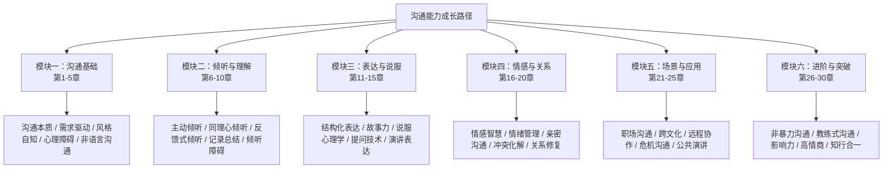
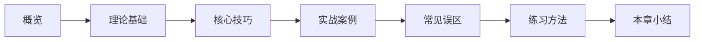

# 写在前面

## 一个真实的故事

2019年，某互联网公司的一次产品评审会上，产品经理小李准备了一份详尽的需求文档。他对自己的方案充满信心——数据扎实、逻辑清晰、竞品分析到位。然而，当他站到投影幕前开始陈述时，事情急转直下。

他花了十五分钟解释技术架构，台下的市场同事开始看手机；他用了一堆专业术语，运营团队面面相觑；当他终于讲到核心卖点时，时间已经所剩无几，总监皱着眉头说了一句："所以，你到底想做什么？"

小李愣住了。他想说的明明都在PPT里，为什么没人听懂？

同一天晚上，他回到家，因为一件小事和女友吵了一架。女友说："你从来都不听我说话。"他反驳："我怎么不听了？你每次说我哪里不好我都记住了。"女友沉默了很久，说："我需要的不是你记住问题，是你理解我的感受。"

那天晚上，小李失眠了。他开始意识到一个被自己忽视了二十多年的问题：**他从未真正学过如何沟通。**

这个故事不是个例。如果把小李替换成你、我、我们身边的任何一个人，故事的细节可能不同，但底层困境惊人地相似。

---

## 沟通：被严重低估的"元能力"

### 什么是"元能力"

在认知科学中，有一种能力被称为"元能力"（meta-skill）——它不是某一种具体技能，而是**决定其他所有技能能否发挥价值的底层能力**。学习能力是一种元能力，因为它决定了你能多快掌握新知识；思维能力是一种元能力，因为它决定了你如何分析和解决问题。

而沟通能力，是所有社会性元能力中最核心的一种。

理由很简单：**人类几乎所有的社会活动，都以沟通为载体。**

- 你想推动一个项目，需要向上级汇报、向团队传达、向客户说服——这需要沟通。
- 你想建立一段关系，需要自我暴露、情感共鸣、冲突化解——这需要沟通。
- 你想实现职业晋升，需要面试展示、跨部门协作、危机处理——这需要沟通。
- 你想获得内心平静，需要自我对话、情绪表达、边界设定——这需要沟通。

哈佛大学一项持续75年的成人发展研究（Harvard Study of Adult Development）得出了一个简洁而深刻的结论：**决定人生幸福的最重要因素，不是财富、名望或成就，而是人际关系的质量。** 而沟通，正是构建和维系人际关系的核心机制。

### 沟通能力的"复利效应"

与其他技能不同，沟通能力有一种独特的"复利效应"。

一个技术能力很强但沟通能力弱的工程师，可能只能影响自己负责的模块；而当他提升了沟通能力之后，他的技术见解能够被更多人理解和采纳，他的影响力会呈指数级增长。这不是线性的叠加，而是乘法——沟通能力作为乘数，放大了你所有其他能力的价值。

具体来说，沟通能力的复利效应体现在三个层面：

**第一层：信息效率。** 高效沟通者能在更短的时间内传递更准确的信息，减少误解和返工。研究表明，职场中因沟通不畅导致的时间浪费，平均占工作时间的17%。假设你每天工作8小时，这意味着你每天有近1.5小时在处理因沟通问题产生的额外工作。

**第二层：关系资本。** 每一次高质量的沟通都在为你的"关系账户"存款。这些关系在你需要帮助、寻求合作、寻找机会时，会转化为实实在在的价值。LinkedIn的一项调查显示，85%的工作机会是通过人际网络获得的。

**第三层：自我认知。** 沟通不仅是向外传递信息的过程，也是向内认识自己的过程。当你试图清晰地表达一个想法时，你被迫梳理自己的思维；当你倾听别人的反馈时，你获得了一面审视自己的镜子。这种自我认知的深化，会反过来提升你的决策质量和人生方向感。

### 一个残酷的事实

尽管沟通能力如此重要，我们的教育体系却几乎没有系统地教授过它。

从小学到大学，我们花了十几年学习数学公式、历史年表、物理定律，却从未有一门课教我们：如何在冲突中保持冷静对话？如何让自己的观点被他人接受？如何在不伤害关系的前提下表达不满？如何在社交场合中自然而自信地与人交流？

这不是个别现象，而是全球性的教育盲区。世界经济论坛（World Economic Forum）发布的《未来就业报告》中，"沟通能力"连续多年被列为职场最重要的软技能之一，但在全球大多数国家的K-12教育体系中，系统的沟通教育仍然缺位。

结果就是：绝大多数人的沟通方式，都是"野生"的——模仿父母、观察同伴、在无数次碰壁中自行摸索。有些人运气好，成长环境中的沟通模式相对健康，他们"自学成才"的效果还不错；但更多人继承了原生家庭中那些低效甚至有害的沟通模式，却不自知。

**这本书的出现，就是为了补上这一课。**

---

## 这本书能给你什么

### 不是一本"话术大全"

市面上的沟通类书籍大致可以分为三类：

| 类型 | 特点 | 典型问题 |
|------|------|----------|
| 话术集锦型 | 收录各种场景的"金句"和"套路" | 知道说什么，但不知道为什么这么说；换个场景就不会了 |
| 理论学术型 | 系统介绍传播学、语言学理论 | 读的时候觉得有道理，用的时候不知道怎么用 |
| 心灵鸡汤型 | 用故事和感悟激励读者 | 感动三天，然后忘记一切 |

本书试图走一条不同的路：**道、法、术、器贯通。**

"道"是底层原理——为什么沟通会有效或无效？人的认知规律、情感机制、心理需求如何影响沟通效果？理解了"道"，你才能在任何场景中举一反三，而不是死记硬背。

"法"是方法论——面对不同类型的沟通场景，应该遵循怎样的思考框架和决策逻辑？有了"法"，你面对新场景时不会手足无措，而是知道该从哪里着手分析。

"术"是具体技巧——怎么开场？怎么提问？怎么回应？怎么收尾？这些是可以直接拿去用的操作指南。"术"必须具体、可执行、可验证，不说空话。

"器"是工具和模板——沟通日志模板、自测评估表、场景准备清单、练习计划。这些工具帮助你把知识转化为行动，把行动固化为习惯。

### 你将获得的五种能力

通读并实践本书之后，你将在以下五个维度获得实质性提升：

**1. 感知力——读懂"没说出口的话"**

大多数沟通的真正信息不在文字本身，而在文字之外——语气、表情、停顿、用词选择、身体姿态。你将学会系统地捕捉这些信号，像一个经验丰富的心理咨询师那样，听到对方"话语背后的话语"。

这不仅仅是"察言观色"的社交技巧。它基于心理学中的情绪识别理论、非语言沟通研究和认知共情模型，是一种可以被系统训练的能力。

**2. 表达力——让你的话"落地有声"**

"我心里想得很清楚，就是说不出来"——这种困境的根源不是"嘴笨"，而是缺乏结构化的表达方法。你将掌握多种表达框架（金字塔原则、PREP法则、故事弧线等），让你的表达从"想到哪说到哪"变成"有结构、有重点、有感染力"。

更重要的是，你将学会"受众思维"——根据听者的知识背景、关注点和情绪状态，调整你的表达方式。同一个产品方案，对技术团队讲和对投资人讲，需要的表达策略完全不同。

**3. 倾听力——从"听到"到"听懂"**

大多数人以为倾听是一种被动行为——闭上嘴、看着对方、点点头就行了。但真正的倾听是一种高度主动的认知活动，它需要你同时完成三件事：接收信息、处理信息、管理自己的反应。

你将学到主动倾听、同理心倾听、批判性倾听等多种倾听模式，以及在不同场景下如何灵活切换。你会惊讶地发现，仅仅是"学会倾听"这一件事，就能大幅改善你80%以上的人际关系。

**4. 调节力——在情绪风暴中保持对话**

冲突是沟通中最困难的场景，也是最考验功力的时刻。当情绪上头时，大多数人要么攻击、要么逃避、要么压抑——这三种反应都会让事情变得更糟。

你将学会一套经过临床验证的情绪调节方法：从冲突中的即时降压技术，到长期的情绪觉察习惯；从非暴力沟通的四步法，到修复关系的具体步骤。你不再需要在"忍着不说"和"说了就吵"之间二选一。

**5. 适应力——在任何场景中自如切换**

职场汇报、朋友闲聊、客户谈判、亲密对话、公共演讲、危机回应……不同场景对沟通的要求截然不同。一个在朋友聚会中侃侃而谈的人，可能在向领导汇报时紧张到语无伦次。

你将建立一套"场景识别→策略选择→技巧组合→反馈调整"的完整应变体系。这套体系让你不再依赖某一种固定的沟通风格，而是能像一个优秀的演员那样，根据舞台的不同自如切换。

---

## 30把钥匙：全书结构一览

本书以"钥匙"为隐喻——每一章都是一把打开特定沟通困境的钥匙。30把钥匙分为六个模块，形成一个从基础到进阶的完整能力成长路径。

### 模块一：沟通基础（第1-5章）——地基

这是一切的起点。你将重新理解"沟通"这件事本身：它不是单向的信息输出，而是一个包含编码、传递、解码、反馈的完整闭环。你将认识到自己的沟通风格和心理盲区，学会解读非语言信号。

**适合人群：所有人。** 无论你目前的沟通水平如何，这一模块都值得精读。很多"高级"沟通问题的根源，恰恰在基础认知上。

### 模块二：倾听与理解（第6-10章）——耳朵

古希腊哲学家爱比克泰德说过："我们有两只耳朵一张嘴，就是为了多听少说。"但倾听远不是"少说"那么简单。这一模块将倾听分解为主动倾听、同理心倾听、反馈式倾听等多种模式，每种模式都配有详细的技巧和练习。

**关键突破：** 大多数人学完这一模块后最大的感受是——"我以前根本没有在听，我只是在等对方说完。"

### 模块三：表达与说服（第11-15章）——嘴巴

有了好的输入（倾听），还需要好的输出（表达）。这一模块聚焦于如何让你的话有结构、有力量、有说服力。从金字塔原则到故事弧线，从修辞学到提问的艺术，你将获得一整套表达工具。

**关键突破：** 表达的核心不是"我能说多少"，而是"对方能接收多少"。受众思维是这一模块的核心转变。

### 模块四：情感与关系（第16-20章）——心脏

沟通中最难处理的，往往不是信息本身，而是情感。这一模块深入情感智慧的领域：如何识别和管理自己的情绪？如何在不伤害关系的前提下表达不满？如何在冲突后修复信任？

**关键突破：** 你将学会区分"表达情绪"和"情绪化表达"——前者是健康的沟通，后者是关系的毒药。

### 模块五：场景与应用（第21-25章）——战场

理论再好，也需要在真实场景中验证。这一模块覆盖职场沟通、跨文化沟通、远程协作、危机沟通和公共演讲五大高频场景，每个场景都有针对性的策略和工具。

**关键突破：** 你会发现，不同场景需要的沟通策略可能截然相反——在危机沟通中要"快"，在亲密沟通中要"慢"；在谈判中要"守住底线"，在创意讨论中要"开放一切"。

### 模块六：进阶与突破（第26-30章）——天花板

这是全书的高阶部分，面向已经具备扎实基础的读者。非暴力沟通、教练式沟通、影响力构建……这些方法将你从"会沟通"推向"沟通高手"。

**关键突破：** 真正的沟通高手，不是在每个场景中都用同一种"最佳"方法，而是能根据情境灵活组合、即时调整。这种能力需要深厚的理解和大量的练习。

---

## 每一章的统一结构

为了让你的学习过程清晰可预测，全书30章都遵循统一的内容结构：

- **概览**：用一两段话让你快速了解本章的核心观点和学习目标
- **理论基础**：解释"为什么"——心理学、行为科学、传播学等领域的相关研究
- **核心技巧**：讲解"怎么做"——具体的方法、步骤、框架
- **实战案例**：展示"真实场景"——来自职场、家庭、社交等不同领域的案例
- **常见误区**：提醒"别踩坑"——初学者最容易犯的错误和纠正方法
- **练习方法**：指导"去练习"——可执行的练习任务，从易到难
- **本章小结**：回顾"核心收获"——用简洁的清单帮你巩固记忆

这种结构确保你不会停留在"知道"的层面。每一章的最后，你都会有一个明确的行动清单，告诉你今天就可以做什么来开始练习。

---

## 关于"知道"和"做到"之间的距离

这是本书最重要的前提假设之一，我需要在一开始就说清楚。

**阅读本书不会让你自动变成一个沟通高手。** 就像阅读一本游泳教材不会让你自动学会游泳一样。

认知心理学中有一个概念叫"知识诅咒"（Curse of Knowledge）——当你理解了一个概念之后，你会觉得它显而易见，难以想象不理解它是什么感觉。沟通类书籍尤其容易陷入这种陷阱：作者已经是一个沟通高手，他写的每一个技巧在他看来都是"理所当然"的，读者读起来也觉得"确实如此"——然后合上书，什么都没改变。

本书通过三种机制来对抗这种困境：

**第一，大量的具体案例。** 不是抽象地说"要倾听"，而是用真实场景展示"当你的伴侣说'你从来不关心我'的时候，倾听的正确打开方式是什么"。具体的案例在你的大脑中会形成"心理模拟"，让你在真实场景中更容易提取和运用。

**第二，每章的刻意练习。** 不是"建议你多练习"这种空话，而是具体的、可执行的、有明确标准的练习任务。比如："今天在一次对话中，只倾听不打断，对话结束后用自己的话复述对方的三个核心观点。"

**第三，21天习惯养成框架。** 神经科学研究表明，一个新的行为模式从"刻意控制"变为"自动反应"，平均需要21天的重复练习。本书提供的30天和90天学习计划，正是基于这一研究设计的。

**你唯一需要做的，就是去练。** 不需要练得很完美，不需要一次就做对——你只需要去做。每一次笨拙的尝试，都是在重塑你的神经通路。

---

## 不同读者的起点

每个人的沟通基础不同，遇到的困境也不同。在开始阅读之前，你可以用以下描述快速定位自己的起点：

| 起点类型 | 典型表现 | 建议路径 |
|----------|----------|----------|
| **初学者** | 不知道怎么和陌生人开口，社交场合紧张，说话容易冷场 | 从第1章开始按顺序阅读，重点练习模块一和模块二 |
| **职场新人** | 不会汇报工作，会议上不敢发言，和同事协作困难 | 先读模块一建立框架，然后重点突破第5章（职场沟通）和第11-15章（表达与说服） |
| **关系困惑者** | 和伴侣/家人总是吵架，想表达关心却变成指责 | 先读第6-10章（倾听），然后重点突破第16-20章（情感与关系） |
| **进阶提升者** | 已有不错的沟通基础，希望在演讲、谈判、领导力等方面更上一层楼 | 快速浏览模块一确认基础，重点精读模块五和模块六 |
| **管理者/领导者** | 需要带团队、做决策、处理冲突、对外沟通 | 重点关注第11-15章（说服）、第21-25章（场景应用）和第28章（教练式沟通） |

无论你从哪个起点出发，最终的目标是一样的：**建立一套完整的沟通能力体系，让你在任何场景中都能自信、从容、有效地与人沟通。**

---

## 学习本书的五个建议

在你正式开始之前，这里有五个经过验证的学习建议，它们将显著提升你的学习效果：

### 1. 准备一本"沟通日志"

准备一个笔记本（纸质或电子均可），从今天开始记录你的沟通观察和练习心得。格式很简单：

- **日期**
- **场景**：发生了什么？和谁的对话？
- **表现**：我做得好的是什么？可以改进的是什么？
- **对应技巧**：这和书中的哪个知识点相关？
- **下次怎么做**：如果有类似场景，我想要尝试什么不同的做法？

这本日志将成为你最宝贵的学习资产。当你回头看时，你会清晰地看到自己的成长轨迹。

### 2. 找一个学习伙伴

沟通是双向的技能，一个人闷头练习的效果远不如两个人互相练习。找一个愿意和你一起学习的朋友、同事或家人，你们可以：

- 一起阅读同一章节，然后讨论各自的理解
- 互相扮演案例中的角色，进行角色扮演练习
- 在日常沟通中互相观察和反馈
- 每周做一次学习回顾，分享各自的进步和困惑

研究表明，有学习伙伴的学习者，坚持率比独自学习者高出3倍以上，技能掌握速度也快40%。

### 3. 一次只练一个技能

沟通技能的学习切忌贪多。如果你这周同时练习"主动倾听""非暴力沟通""金字塔原则"和"眼神接触"，结果大概率是什么都练不好。

正确的方法是：**每周聚焦一个技能，用这一周的时间在所有可能的场景中反复练习这一个技能。** 当你觉得这个技能开始变得自然了（通常需要5-7天），再进入下一个。

这就像健身——你不会在同一天练完所有部位。专注才能深入。

### 4. 从"低风险"场景开始

不要一上来就在最重要的场景（比如向CEO汇报、和伴侣谈敏感话题）中试验新技巧。先从低风险的场景开始——和便利店收银员聊天、在午餐时和同事练习倾听、在微信群里练习结构化表达。

低风险场景给你犯错的空间，而犯错是学习的必要组成部分。当你在低风险场景中建立了信心和熟练度，再逐步转移到高风险场景。

### 5. 允许自己"倒退"

学习沟通技能的过程不是一条上升的直线，而是一条有起伏的曲线。你可能在某一周觉得自己进步明显，下一周又觉得退步了。这是完全正常的。

认知心理学中有一个概念叫"意识性无能"（Conscious Incompetence）——在学习的早期阶段，你对问题的觉察力提升速度会快于你的解决能力提升速度。换句话说，你知道得越多，反而越觉得自己做得不好。这不是退步，而是你的眼光在进步。

**坚持下去。度过这个阶段之后，你会迎来一段快速进步期。**

---

## 本书的知识脉络

为了帮助你在阅读过程中建立全局视角，这里展示全书30章的知识关联图：

```mermaid
graph TD
    subgraph 认知层
        C1[第1章<br/>沟通本质]
        C2[第2章<br/>需求驱动]
        C3[第3章<br/>风格自知]
        C4[第4章<br/>心理障碍]
        C5[第5章<br/>非语言沟通]
    end

    subgraph 输入层
        L1[第6章<br/>主动倾听]
        L2[第7章<br/>同理心倾听]
        L3[第8章<br/>反馈式倾听]
        L4[第9章<br/>记录与总结]
        L5[第10章<br/>倾听障碍]
    end

    subgraph 输出层
        E1[第11章<br/>结构化表达]
        E2[第12章<br/>故事力]
        E3[第13章<br/>说服心理学]
        E4[第14章<br/>提问技术]
        E5[第15章<br/>演讲表达]
    end

    subgraph 情感层
        F1[第16章<br/>情感智慧]
        F2[第17章<br/>情绪管理]
        F3[第18章<br/>亲密沟通]
        F4[第19章<br/>冲突化解]
        F5[第20章<br/>关系修复]
    end

    subgraph 场景层
        S1[第21章<br/>职场沟通]
        S2[第22章<br/>跨文化沟通]
        S3[第23章<br/>远程协作]
        S4[第24章<br/>危机沟通]
        S5[第25章<br/>公共演讲]
    end

    subgraph 进阶层
        A1[第26章<br/>非暴力沟通]
        A2[第27章<br/>教练式沟通]
        A3[第28章<br/>影响力构建]
        A4[第29章<br/>高情商沟通]
        A5[第30章<br/>知行合一]
    end

    C1 --> C2 --> C3 --> C4 --> C5
    C5 --> L1
    L1 --> L2 --> L3 --> L4 --> L5
    L5 --> E1
    E1 --> E2 --> E3 --> E4 --> E5
    E5 --> F1
    F1 --> F2 --> F3 --> F4 --> F5
    F5 --> S1
    S1 --> S2 --> S3 --> S4 --> S5
    S5 --> A1
    A1 --> A2 --> A3 --> A4 --> A5
```

这张图不是让你背下来的，而是帮你理解全书的逻辑主线：**认知→输入（倾听）→输出（表达）→情感→场景→进阶**。每一层都建立在前一层的基础之上。跳过基础直接学高级技巧，就像地基没打好就盖楼——看着像那么回事，一遇压力就塌。

---

## 最后：你为什么应该相信这本书

你可能会问：市面上沟通类的书那么多，为什么选这一本？

老实说，我不打算用"本书作者是某某领域的权威"或者"本书销量突破百万"来打动你。因为最终决定这本书有没有价值的，不是作者是谁，而是它对你有没有用。

我只想告诉你三件事：

**第一，这本书的方法都经过验证。** 每一个技巧都有心理学或行为科学的研究支撑，每一个案例都来自真实的沟通场景。你不会在这本书里看到"想成功先发疯"这类没有依据的口号。

**第二，这本书尊重你的智商。** 它不会把复杂的沟通现象简化成几个"金句"，也不会用煽情的故事代替严肃的分析。它会告诉你原理，会给你方法，会陪你练习——但它不会替你思考。

**第三，这本书只关心一件事：你读完之后，沟通能力是否真的提升了。** 所以，如果你读了某一章觉得"这和我的情况不一样"，请跳过它，去找和你相关的章节。如果你读了某个技巧觉得"这太简单了我不需要练习"，请至少试一次再下结论。

**沟通能力不是天赋，是技能。技能可以学习，可以练习，可以提升。**

你已经翻开了这本书，这说明你已经做好了改变的准备。

那我们就开始吧。

***

> 💡 **下一步**：阅读「[如何使用本书](02-如何使用本书.md)」，了解不同读者的阅读路径和学习方法建议。
