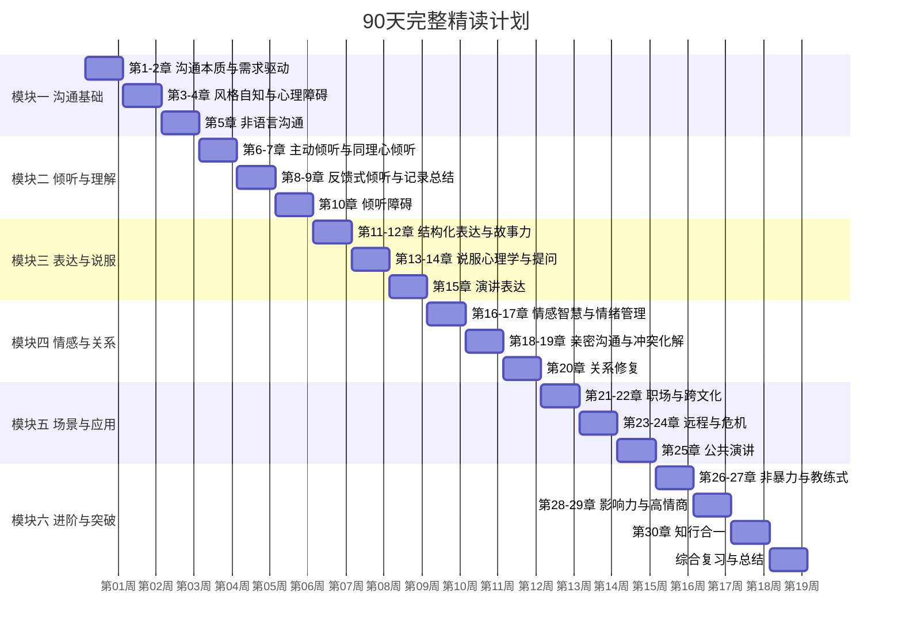

## 如何使用本书

上一章我们聊了"为什么要学沟通"以及"这本书能给你什么"。这一章解决一个更实际的问题：**你手上这本书，怎么用才能效果最大化？**

一本书的价值，不仅取决于它写了什么，更取决于你怎么读它、怎么用它。同一本书，有人读完脱胎换骨，有人读完毫无变化——差别往往不在智商，而在方法。

这一章就是你的"使用说明书"。

---

### 阅读之前的三个准备

在翻开第一章之前，花十分钟做好以下三件事，能让你的学习效率提升一倍以上。

#### 准备一：明确你的起点和目标

不同的人打开这本书，带着不同的困惑。有人在职场上汇报总被打断，有人和伴侣总是吵到最后不欢而散，有人在社交场合不知道怎么开口。困惑不同，学习的侧重点也应该不同。

请拿出一张纸（或打开手机备忘录），花三分钟回答以下三个问题：

1. **你目前最大的沟通困境是什么？** 用一句话描述，比如"我在会议上总是不敢发言"或"我和父母一说话就吵架"。
2. **你希望通过这本书解决什么问题？** 具体一点，比如"学会在3分钟内清晰地汇报工作"或"和伴侣吵架时能控制住不翻旧账"。
3. **你目前的沟通水平自评是怎样的？** 用1-10分给自己打个分，诚实就好。

把这份回答保存好。读完本书之后，再回头看它，你会惊讶于自己的变化。

#### 准备二：准备一个"沟通日志"

这不是一个可选的建议，而是本书学习体系的核心工具之一。

沟通日志的作用不是记录流水账，而是帮你建立一个"观察-反思-改进"的闭环。具体格式如下：

| 字段 | 说明 | 示例 |
|------|------|------|
| 日期 | 记录时间 | 2024-03-15 |
| 场景 | 什么情境下发生的沟通 | 周会汇报项目进度 |
| 对象 | 和谁的沟通 | 直属领导 + 跨部门同事 |
| 问题 | 沟通中出现了什么问题 | 我讲了10分钟，领导打断说"说重点" |
| 分析 | 为什么会出问题（对照书中知识） | 没有使用结构化表达，信息层级不清 |
| 改进 | 下次遇到类似场景怎么做 | 用PREP法则重新组织：结论先行→理由→案例→重申结论 |
| 关联章节 | 对应本书哪一章的内容 | 第11章：结构化表达 |

这个日志可以用纸质笔记本、手机备忘录、Notion、Excel，甚至微信"文件传输助手"——工具不重要，持续记录才重要。

建议每天至少记录一条。如果某天没有特别的沟通事件，可以记录你观察到的别人的沟通行为——看别人怎么做，本身就是一种学习。

#### 准备三：找到你的学习伙伴

前面说过，沟通是双向技能，一个人闷头练习的效果远不如两个人互相反馈。找一个愿意和你一起学习的人——朋友、同事、伴侣、家人都可以。

学习伙伴的协作方式：

- **同步阅读**：每周约定读同一章节，周末用30分钟讨论各自的理解和感悟
- **角色扮演**：书中的实战案例，一个人扮演沟通者，另一个人扮演对方，实际演练一遍
- **日常互评**：在日常相处中，观察对方的沟通行为，每周给对方一个具体的反馈（"你这周在讨论中打断别人的次数明显少了"）
- **互相打卡**：每天互相确认"今天记录沟通日志了吗"，简单的外部监督能显著提高坚持率

研究表明，有学习伙伴的学习者，完成率比独自学习者高出3倍。如果你实在找不到身边的人，也可以在社交媒体上寻找同好社群——关键词搜索"沟通学习""非暴力沟通实践"等，都能找到志同道合的人。

---

### 五种阅读路径：根据你的时间和目标选择

本书30章内容丰富，但并不意味着你必须从第1章读到第30章。根据你的时间预算和学习目标，可以选择不同的阅读路径。

#### 路径一：完整精读路径（90天）

**适合人群**：想要系统建立沟通能力体系的读者，不赶时间，追求深度。

**时间安排**：每周精读2-3章，每章花2-3天（一天阅读，一天练习，一天复盘）

**每周节奏**：
- 周一/周二：精读当章内容，做好标记和笔记
- 周三/周四：完成章节练习，在沟通日志中记录实践
- 周五/周六：和学习伙伴讨论，互相反馈
- 周日：回顾本周内容，整理笔记，预览下周章节

#### 路径二：快速突破路径（30天）

**适合人群**：时间紧迫，有一个具体的沟通问题急需改善。

**核心策略**：先解决最痛的问题，再扩展其他领域。

**第一周：诊断与基础**（精读第1、3、4章）
- 第1章帮你理解沟通的完整链条，建立正确认知
- 第3章的风格自测帮你找到自己的盲区
- 第4章帮你识别阻碍你的心理因素

**第二周：核心技能突破**（根据你的问题选读2-3章）
- 如果问题在"不会说"→精读第11章（结构化表达）和第12章（故事力）
- 如果问题在"不会听"→精读第6章（主动倾听）和第7章（同理心倾听）
- 如果问题在"容易吵"→精读第17章（情绪管理）和第19章（冲突化解）
- 如果问题在"不敢说"→精读第4章（心理障碍）和第15章（演讲表达）

**第三周：场景实践**（选读1-2章场景模块）
- 职场问题→第21章（职场沟通）
- 关系问题→第18章（亲密沟通）
- 公众场合→第25章（公共演讲）

**第四周：整合与巩固**（精读第30章，回顾前三周笔记）
- 重新做第3章的风格自测，对比四周前的结果
- 整理沟通日志中的高频问题和进步点
- 制定下一阶段的学习计划

#### 路径三：主题式阅读路径（按需阅读）

**适合人群**：沟通基础已经不错，只想针对性提升某个方面。

这种路径不按章节顺序读，而是根据你当下面临的具体问题，直接跳到对应章节：

| 你遇到的问题 | 建议阅读的章节 | 配套练习 |
|-------------|---------------|---------|
| 开会时不知道怎么汇报工作 | 第11章（结构化表达）+ 第21章（职场沟通） | 每天用PREP法则重新组织一个工作汇报 |
| 和伴侣总是吵完架冷战 | 第17章（情绪管理）+ 第19章（冲突化解）+ 第20章（关系修复） | 记录每次争吵的触发点，练习"暂停-呼吸-表达"三步法 |
| 在陌生人面前不知道说什么 | 第4章（心理障碍）+ 第5章（非语言沟通）+ 第12章（故事力） | 每天主动和一个陌生人说一句话 |
| 提出的方案总是被否决 | 第13章（说服心理学）+ 第14章（提问技术） | 用"问题-方案-收益"框架重写一个被否决的方案 |
| 远程会议效率低 | 第23章（远程协作）+ 第8章（反馈式倾听） | 下次会议前写好议程，会议后发总结 |
| 被批评时容易情绪失控 | 第17章（情绪管理）+ 第26章（非暴力沟通） | 每次被批评后，写下"事实是什么""我的感受是什么""我的需求是什么" |
| 公众演讲紧张忘词 | 第15章（演讲表达）+ 第4章（心理障碍） | 对着镜子练习3分钟即兴演讲，每天一次 |

主题式阅读的好处是目标明确、见效快；缺点是可能错过系统性的基础知识。建议在完成一轮主题式阅读后，再走一遍完整路径补全体系。

#### 路径四：管理者专属路径（45天）

**适合人群**：团队管理者、项目负责人、需要频繁协调各方的人。

管理者对沟通的需求有其特殊性：不仅要"说得清楚"，还要"带得动人"。以下是针对管理场景优化的阅读顺序：

**第一阶段：自我认知（第1周）**
- 第1章：沟通本质——重新理解你在团队沟通中的角色
- 第3章：风格自知——了解你的管理沟通风格

**第二阶段：倾听与反馈（第2-3周）**
- 第6章：主动倾听——1对1沟通的核心技能
- 第7章：同理心倾听——理解团队成员的真实需求
- 第8章：反馈式倾听——给下属有效反馈的方法

**第三阶段：说服与影响（第4-5周）**
- 第11章：结构化表达——向上汇报、向下传达
- 第13章：说服心理学——推动跨部门协作
- 第28章：影响力构建——从管理者到领导者

**第四阶段：冲突与关系（第6-7周）**
- 第19章：冲突化解——处理团队内部矛盾
- 第27章：教练式沟通——激发下属潜能
- 第24章：危机沟通——应对突发状况

#### 路径五：伴侣/家庭共建路径（60天）

**适合人群**：和伴侣或家人一起学习，目标是改善亲密关系中的沟通。

**这是本书最推荐的学习方式之一。** 亲密关系中的沟通问题，往往不是一个人的问题，而是两个人的互动模式出了问题。两个人一起学，效果远超一个人单独学。

**第1-2周：各自建立基础**
- 各自阅读第1-4章，建立沟通认知框架
- 各自完成沟通风格自测，交换结果，讨论差异

**第3-4周：学会倾听彼此**
- 一起阅读第6-7章
- 每天做一次"倾听练习"：一方说话5分钟，另一方只听不打断，然后复述对方的核心感受
- 规则：复述时不能加自己的评判，只能说"我听到你说的是……"

**第5-6周：学会表达需求**
- 一起阅读第11章和第26章（非暴力沟通）
- 练习"观察-感受-需求-请求"四步法
- 每周选一个有分歧的话题，用非暴力沟通的方式讨论

**第7-8周：学会处理冲突**
- 一起阅读第17章和第19章
- 制定"吵架规则"：比如不翻旧账、不人身攻击、一方喊暂停时另一方必须配合
- 每次冲突后，各自在沟通日志中记录"这次我做得好的是什么""下次可以改进的是什么"

---

### 每一章怎么读：高效阅读的四个步骤

无论你选择哪条路径，每一章的阅读都应该遵循以下步骤，而不是从头到尾一气读完。

#### 步骤一：鸟瞰（5分钟）

先快速浏览全章，不细读内容，只关注：
- 章节标题和小标题——了解本章讲什么
- 加粗的文字和要点列表——抓住核心信息
- 图表和表格——这些通常是本章最重要的框架
- 本章小结——提前知道这一章的结论

这一步的目的是在你的大脑中建立一个"知识框架"。就像盖房子先搭脚手架——有了框架，后续的细节阅读才知道往哪里放。

#### 步骤二：精读（30-45分钟）

逐段细读，边读边做标记：

- **用下划线标记**你觉得重要的概念和原理
- **用星号标记**你想立刻尝试的技巧和方法
- **用问号标记**你不理解或不认同的内容
- **在页边空白处**写下你的联想、疑问或个人经历

不要追求"一次读懂"。遇到不理解的地方，先标记，继续往下读。很多时候，后面的案例会帮你理解前面的理论。

#### 步骤三：联结（15分钟）

读完之后，合上书（或关上屏幕），花15分钟思考：

1. **这一章的核心观点是什么？** 试着用一句话总结
2. **这和我的实际情况有什么关系？** 至少找到一个你亲身经历的对应场景
3. **我之前的做法和这一章的建议有什么不同？** 明确差异才能改进
4. **我打算怎么练习？** 选出一个具体的行动

如果你有学习伙伴，这一步可以变成一次15分钟的讨论——互相说说各自的理解和收获，效果更好。

#### 步骤四：实践（持续一周）

从本章的练习方法中，选择一个最适合你当前情况的，持续练习一周。

关键原则：**一次只练一个技能。** 如果你同时练习倾听、表达、非语言沟通和情绪管理，结果大概率是什么都练不好。专注于一个技能，在所有可能的场景中反复练习，直到它开始变得自然（通常需要5-7天），再进入下一个。

---

### 如何使用书中的练习和工具

本书不是一本"读完就放"的书。每一章都包含精心设计的练习和工具，它们是知识转化为能力的桥梁。

#### 练习的设计逻辑

本书的练习遵循"刻意练习"（Deliberate Practice）的理论框架。刻意练习不是简单的重复，而是有目标、有反馈、有挑战的练习。具体来说：

| 练习层次 | 说明 | 示例 |
|----------|------|------|
| 感知层 | 学会识别和观察 | 观察一次对话中对方的非语言信号 |
| 模仿层 | 按照模板和步骤操作 | 用PREP法则重新组织一段话 |
| 应用层 | 在真实场景中使用 | 在本周的会议中使用结构化表达 |
| 内化层 | 变成自然反应 | 无需刻意思考，自然使用结构化方式表达 |

大多数练习从"感知层"或"模仿层"开始，随着你的进步逐步升级到"应用层"和"内化层"。

#### 沟通日志的进阶用法

当你积累了两周以上的沟通日志之后，可以开始做"模式分析"：

1. **高频问题提取**：回顾日志，找出出现次数最多的3个问题。这些就是你最需要重点突破的地方
2. **成功案例复盘**：找到那些"做得好"的记录，分析为什么好——是用了某个技巧？还是当时心态对了？成功经验同样值得总结
3. **进步曲线**：每两周给自己的沟通能力打一次分（1-10分），画一条折线图。虽然评分是主观的，但趋势是有意义的
4. **模式识别**：你可能会发现一些有趣的规律——比如"我在上午的沟通状态比下午好""我和A沟通总是很顺畅，和B总是出问题""一到正式场合我就退缩"。这些规律就是你改进的方向

#### 21天习惯养成框架

每个核心技能的练习，建议至少持续21天。这不是一个随意的数字——神经科学研究表明，一个新的行为模式从"刻意控制"变为"自动反应"，平均需要21天的持续重复。

21天的具体节奏：

- **第1-7天：别扭期**。你会觉得刻意、不自然，甚至有点做作。这是正常的。就像刚学开车时手忙脚乱一样，任何新技能在初期都会让你觉得不舒服
- **第8-14天：适应期**。你开始找到一些感觉，偶尔能在真实场景中自然地使用新技能。但也经常"忘记"——一回到旧习惯中就又用回老方法
- **第15-21天：稳定期**。新技能开始变成默认选项。你不需要提醒自己"要用结构化表达"，而是自然地就开始这样做了

如果21天后你仍然觉得这个技能很刻意，那就再续21天。每个人的节奏不同，不要和别人比速度。

---

### 阅读中的常见困惑与应对

#### "读的时候觉得很有道理，用的时候想不起来"

这是沟通类书籍最常见的"学习陷阱"。原因很简单：阅读是一种被动的信息接收，而沟通是一种主动的行为输出。从"接收"到"输出"之间，需要一个关键的中间环节——**心理模拟**。

**应对方法**：每读到一个技巧，立刻在脑海中想象一个具体的使用场景。比如读到"复述对方的核心观点"这个技巧时，就想一想："下次和谁的对话中我可以试试这个？具体怎么说？"越具体越好，最好能想象出画面和声音。

如果你有学习伙伴，还可以当场角色扮演——一个人说一段话，另一个人练习复述。5分钟的角色扮演，比30分钟的反复阅读更有效。

#### "练习的时候做得不错，一到真实场景就打回原形"

这是因为"练习环境"和"真实环境"之间的差距。练习时你是放松的、没有压力的、不怕犯错的；但真实场景中你可能紧张、有情绪、害怕对方的反应。

**应对方法**：渐进式暴露。不要等到"完美掌握"了再去真实场景中使用。从低风险场景开始：

1. **第一层：和安全的人练习**——伴侣、密友、家人。告诉他们你在练习新的沟通方式，请他们给反馈
2. **第二层：在低风险场景中使用**——和便利店店员聊天、在微信群中练习表达、在午餐时和同事用新的方式交流
3. **第三层：在中等风险场景中使用**——日常工作会议、和不太熟的朋友交流
4. **第四层：在高风险场景中使用**——重要的工作汇报、敏感话题的讨论、冲突中的沟通

每一层至少练习3-5次，感觉相对自然了再进入下一层。

#### "我觉得这些技巧太刻意了，不像我自己"

这个困惑通常出现在练习的前两周，是一个好的信号——说明你正在突破旧的沟通模式。任何新行为在初期都会让你觉得"不像自己"，因为旧模式已经自动化了，新模式还在"手动挡"阶段。

**应对方法**：区分"刻意"和"虚假"。刻意练习不等于装腔作势。当你练习结构化表达时，你不是在"装"一个会表达的人，而是在训练一种新的表达习惯。就像学打字——刚学时每个字母都要低头找键盘，你觉得很刻意；但熟练之后，你的手指自然就找到了正确的位置。沟通技能也是一样。

给自己时间。21天之后，你会觉得这些技巧越来越自然。

#### "我不知道自己做得对不对"

沟通技能不像数学题，没有标准答案。你很难判断"我这次倾听做得好不好"。

**应对方法**：

1. **观察对方的反应**。对方是否更愿意和你继续交流？是否更放松、更开放？是否表达了更多？这些都是正向信号
2. **直接问反馈**。在练习期间，你可以在对话结束后直接问对方："我刚才的倾听方式让你感觉怎么样？有没有什么地方让你觉得不舒服？"大多数人会感谢你的坦诚
3. **回看沟通日志**。把今天的记录和两周前的记录做对比，你会看到变化
4. **录像回放**。如果条件允许（比如在演讲练习中），录下自己的表现回看。你会看到很多自己在当下意识不到的细节

#### "学了很多技巧，但不知道该先练哪个"

面对30章的内容，不知道从哪里下手是很正常的。

**应对方法**：回到你最初写下的三个问题——你的困境、你的目标、你的自评。然后问自己：**现在最影响我生活质量的沟通问题是什么？** 从这个问题对应的章节开始。

一个简单的决策框架：

如果你的核心问题是：
├── "我不敢说" → 第4章（心理障碍）+ 第15章（演讲表达）
├── "我不会说" → 第11章（结构化表达）+ 第12章（故事力）
├── "我不会听" → 第6章（主动倾听）+ 第7章（同理心倾听）
├── "我总吵架" → 第17章（情绪管理）+ 第19章（冲突化解）
└── "我不知如何应对" → 第21章（职场）或对应场景章节

记住：**一次只聚焦一个问题，一次只练习一个技能。** 贪多嚼不烂。

---

### 30天速成计划：从零到习惯

如果你不确定怎么规划学习进度，以下是一个经过验证的30天入门计划。它不会让你成为沟通高手，但会让你建立核心习惯，为后续的深入学习打下基础。

| 阶段 | 天数 | 阅读内容 | 每日练习 | 目标 |
|------|------|----------|----------|------|
| 认知建立 | Day 1-3 | 第1章：沟通本质 | 完成沟通认知自测 | 理解沟通的完整链条 |
| 自我发现 | Day 4-6 | 第3章：风格自知 | 完成风格评估，请朋友评价 | 知道自己的沟通风格和盲区 |
| 倾听入门 | Day 7-10 | 第6章：主动倾听 | 每天在一次对话中只听不说，然后复述 | 学会"真听"而不只是"等着说" |
| 表达入门 | Day 11-14 | 第11章：结构化表达 | 每天用PREP法则组织一段话 | 让表达有结构、有重点 |
| 情绪基础 | Day 15-18 | 第17章：情绪管理 | 每天记录一次情绪事件及其触发点 | 学会识别和命名自己的情绪 |
| 非语言 | Day 19-22 | 第5章：非语言沟通 | 每天观察3个人的非语言信号 | 开始关注"没说出口的话" |
| 冲突基础 | Day 23-26 | 第19章：冲突化解 | 回忆最近一次冲突，用书中框架复盘 | 学会"暂停-分析-回应"的冲突应对模式 |
| 整合巩固 | Day 27-30 | 第30章：知行合一 | 回顾前27天的沟通日志，总结进步和仍需改进之处 | 形成持续学习的习惯 |

这个计划的核心不是"30天读完6章"，而是**建立"阅读-练习-记录-反思"的学习循环**。30天之后，这个循环本身就变成了一种习惯，你可以在后续的学习中持续使用。

---

### 进阶：如何在读完之后持续提升

读完本书只是起点，不是终点。沟通能力的提升是一个终身的过程。以下是读完本书后的持续成长建议。

#### 建立日常练习体系

选择2-3个你最想保持的技能，把它们融入日常生活中：

- **每日一练**：每天花5分钟在沟通日志中记录一个观察或反思
- **每周一技**：每周选一个技能作为"本周重点"，在所有对话中刻意使用
- **每月一评**：每月给自己的沟通能力做一个自评，对比上月的变化

#### 拓展阅读与学习

本书建立的是沟通能力的核心框架。在这个框架之上，你可以根据自己的兴趣和需要，深入某个方向：

- **心理学方向**：《非暴力沟通》（马歇尔·卢森堡）、《影响力》（罗伯特·西奥迪尼）、《思考，快与慢》（丹尼尔·卡尼曼）
- **演讲与表达**：《金字塔原理》（芭芭拉·明托）、《TED演讲的力量》（克里斯·安德森）、《故事经济学》（罗伯特·麦基）
- **职场沟通**：《关键对话》（科里·帕特森等）、《高难度谈话》（道格拉斯·斯通等）、《向上管理》
- **亲密关系**：《亲密关系》（罗兰·米勒）、《爱的五种语言》（盖瑞·查普曼）

#### 寻找真实练习场景

知识只有在使用中才会变成能力。以下是一些持续练习的真实场景：

- **主动承担汇报机会**：工作中的每一次汇报，都是练习结构化表达的机会
- **参加社交活动**：聚会、行业活动、兴趣小组，都是练习开场、倾听和即兴表达的低风险场景
- **做志愿者或教练**：教别人沟通技巧，是最好的自我提升方式
- **写文章或录视频**：把你的学习心得分享出来，输出本身就是一种深度学习

---

### 写在最后

这本书不是灵丹妙药，读完不会让你一夜之间变成沟通高手。但它会给你一套经过验证的框架、一系列可以立刻使用的工具、以及一个清晰的成长路径。

**你唯一需要做的，就是开始。**

不需要等到"准备好了"——你永远不会完全准备好。不需要追求"完美地练习"——笨拙的尝试胜过完美的计划。不需要一次改变所有——一个技能一个技能地来，积少成多。

翻开下一章，从今天开始。

***

> 💡 **下一步**：阅读「[第一模块：沟通基础（第1-5章）](../_index.md)」，正式开始你的沟通能力提升之旅。
