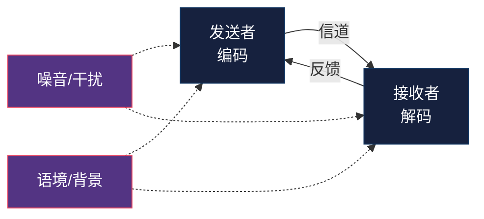
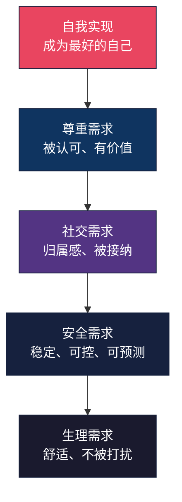
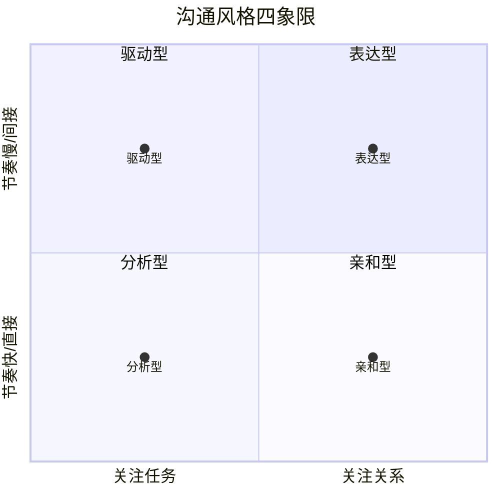
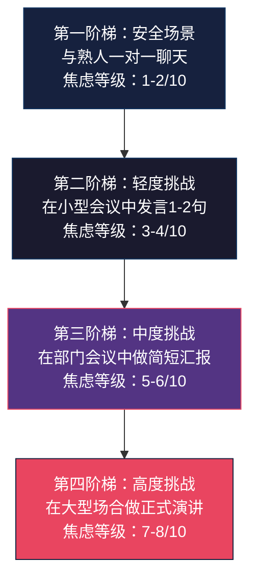
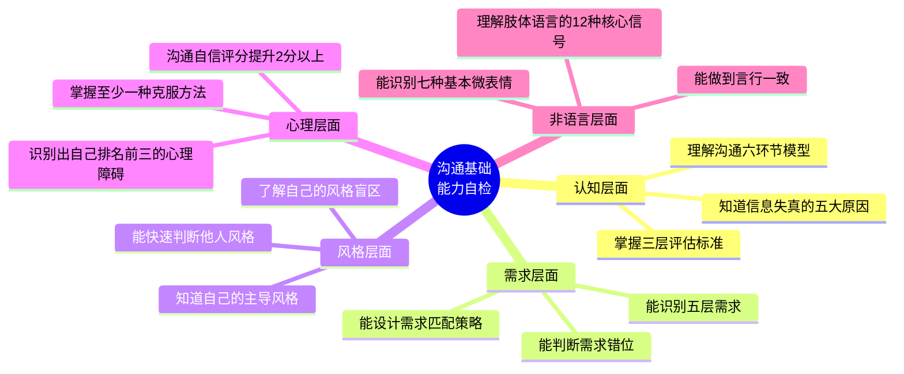

## 第一模块：沟通基础（第1-5章）

### 模块总览：地基决定大楼的高度

沟通能力是一座大厦，第一模块就是地基。跳过基础直奔技巧，就像不打地基就盖楼——表面光鲜，一遇风浪就塌。

本模块五章，遵循一条清晰的递进链：

- **第1章**回答"沟通到底是什么"——定义边界
- **第2章**回答"沟通为什么有效或失效"——理解驱动力
- **第3章**回答"我是谁"——建立自我认知
- **第4章**回答"什么在阻碍我"——排除障碍
- **第5章**回答"言语之外还有什么"——打开完整感知通道

完成这五章，你会拥有三样东西：对沟通本质的正确理解、对自身沟通模式的清醒认知、以及扫除障碍后畅通的信息收发通道。后面所有高级技巧，都建立在这个地基之上。

---

### 第1章：沟通的本质——不只是说话那么简单

**核心观点**：沟通的本质是信息的传递与情感的连接，而非单向的信息输出。

#### 为什么这一章排在第一章

大多数人对沟通有一个根深蒂固的误解：沟通 = 说话。这个等式错得离谱。如果你只关注"说什么"，你会忽略"怎么说""什么时候说""对谁说""用什么方式说"，以及最重要的——"对方听到了什么"。

本章的任务是彻底重构你对沟通的认知框架，让后续所有技巧有立足之地。

#### 沟通的完整信息链

从信息论创始人香农（Claude Shannon）的通信模型出发，一次完整的人际沟通包含六个环节：

| 环节 | 含义 | 常见失败模式 |
|------|------|-------------|
| **编码** | 将想法转化为语言/符号 | 词不达意、专业术语轰炸、情绪化表达 |
| **信道** | 信息传递的媒介 | 微信文字丢失语气、会议中被打断、邮件被忽略 |
| **解码** | 接收者理解信息的含义 | 断章取义、文化差异误解、注意力分散 |
| **反馈** | 接收者回应确认理解 | 沉默不等于理解、点头不等于同意 |
| **噪音** | 干扰信息传递的因素 | 环境嘈杂、手机通知、内心杂念 |
| **语境** | 沟通发生的背景 | 忽略对方当下情绪、不了解行业惯例 |

每个环节都可能产生信息失真。举一个具体例子：项目经理对开发说"这个功能很简单，两天搞定"——编码时的"简单"是项目经理视角，开发解码后可能是"两天要加班到凌晨"。信息在编码环节就已经失真了。

#### 沟通效果的三层评估标准

| 层级 | 标准 | 说明 |
|------|------|------|
| **第一层：信息到达** | 对方听到了 | 最低标准——对方物理上接收到了你的信息 |
| **第二层：理解一致** | 对方理解的意思 = 你想表达的意思 | 大多数沟通失败在这一层 |
| **第三层：行动匹配** | 对方采取了你期望的行动 | 最高标准——理解变成行为 |

评估沟通是否成功，不能只看第一层。你发了邮件，对方收到了（第一层通过），但理解错了（第二层失败），执行自然也错了（第三层失败）。高效沟通者的习惯是：主动确认第二层，追踪第三层。

#### 信息失真的五大系统性原因

1. **选择性注意**：人脑每秒接收约1100万比特信息，但意识只能处理约50比特。你的听众在物理上就不具备完整接收你信息的能力。
2. **图式过滤**：每个人用已有的认知框架（图式）来理解新信息。同样一句"我们需要改变"，进取型人格听到的是机会，保守型人格听到的是威胁。
3. **情绪干扰**：当杏仁核被激活（愤怒、恐惧、焦虑），前额叶皮层（负责理性思考）的功能被抑制。对方情绪激动时，你说了什么他根本听不进去。
4. **记忆重构**：人类记忆不是录像回放，而是每次回忆时重新建构。对话结束24小时后，对方记忆中的内容可能与你说的有30%-50%的偏差。
5. **语义差异**：同一个词对不同人有不同含义。"尽快"对A来说是"今天下班前"，对B来说是"这周内"。

#### 本章学习路径

1. 阅读正文，完成"沟通认知自测"问卷（30题，识别你当前的认知盲区）
2. 接下来24小时，有意识地观察自己的每一次沟通，记录沟通对象、目的、方式
3. 从中挑出三个出现偏差的案例，用六环节模型逐一分析失真发生在哪里
4. 写一份500字的"沟通认知升级报告"

---

### 第2章：沟通的底层逻辑——人性需求驱动一切

**核心观点**：所有的沟通行为背后，都是人性需求在驱动。理解需求，才能掌握沟通主动权。

#### 为什么"需求"是沟通的底层代码

你有没有遇到过这种情况：你的逻辑无懈可击，数据充分，但对方就是不买账？这不是逻辑的问题，是你触碰的需求不对。

人做决定的底层驱动力不是理性，而是需求。神经科学家安东尼奥·达马西奥（Antonio Damasio）的研究表明：情绪和需求系统受损的患者，即使智商正常，连"午饭吃什么"这样的简单决定都做不了。

**沟通的真正公式**：`有效沟通 = 信息传递 × 需求匹配`

信息传递质量再高，需求匹配度为零，结果也是零。

#### 马斯洛需求层次在沟通中的映射

| 需求层级 | 沟通中的表现 | 触发该需求的典型场景 | 对应的沟通策略 |
|---------|-------------|-------------------|---------------|
| **生理/舒适** | 讨厌冗长会议、抗拒被打扰 | 会议超过60分钟、下班后收到工作消息 | 简短高效，尊重时间边界 |
| **安全/可控** | 抗拒模糊指令、害怕变化 | "公司要调整架构""你的方案要大改" | 提供明确预期、分步推进、给缓冲时间 |
| **社交/归属** | 渴望被接纳、害怕被排斥 | 新人入职、跨部门协作 | 建立连接感、使用"我们"而非"你" |
| **尊重/认可** | 在意面子、讨厌被否定 | 公开场合被质疑、成果被忽视 | 先认可贡献再提建议、私下反馈而非公开批评 |
| **自我实现** | 追求成长、渴望意义 | 被分配机械重复任务、看不到发展 | 连接工作与个人成长、提供挑战和自主权 |

#### 识别对方真实需求的五个信号

1. **重复出现的词汇**：对方反复提到"公平""尊重""确认"，这个词背后就是核心需求
2. **情绪强度**：反应越强烈，触及的需求越底层。对一个建议的反对声音越大，说明它威胁到的需求层级越低
3. **非语言信号**：身体后倾（防御/安全需求）、双臂交叉（保护/边界需求）、频繁看手机（舒适/逃离需求）
4. **提问方向**：问"为什么"的人需要意义感（自我实现），问"怎么做"的人需要可控感（安全需求），问"别人怎么想"的人需要归属感（社交需求）
5. **回避话题**：对方刻意绕开的区域，往往藏着未被满足的需求——因为那个话题让它更刺痛

#### 需求错位导致沟通失败的典型模式

| 你的表达 | 对方的核心需求 | 错位 | 正确策略 |
|---------|-------------|------|---------|
| "你的方案逻辑有问题" | 尊重需求 | 直接否定引发防御 | "方案的框架很好，如果能在XX方面补充数据会更强" |
| "公司要裁员30%" | 安全需求 | 信息模糊引发恐慌 | "调整涉及XX部门，以下岗位不受影响，补偿方案是……" |
| "你看看人家小张" | 自尊需求 | 比较引发敌意 | "你在这个项目上的进步很明显，如果在XX方面加强会更好" |
| "这个需求很简单" | 尊重+安全 | 轻视对方的专业判断 | "这个需求的技术挑战在于XX，我们拆解一下看怎么推进" |

#### 本章学习路径

1. 阅读正文，理解五层需求在沟通场景中的映射
2. 完成"需求识别练习"——给10个沟通场景标注主导需求层级
3. 回顾最近三次沟通失败，用需求错位模型分析根本原因
4. 针对接下来一周最重要的三次沟通，用需求匹配法设计策略并实施
5. 记录结果，对比改进前后差异

---

### 第3章：沟通风格自知——认识你自己的沟通模式

**核心观点**：不了解自己的沟通风格，就无法有针对性地改进。自我认知是一切改变的起点。

#### 为什么风格自知排在技巧之前

一个表达型风格的人，天生擅长讲故事、渲染气氛，但在需要严谨分析的场合可能显得不靠谱。一个分析型风格的人，数据说话、逻辑清晰，但在需要鼓舞士气时可能让人觉得冷漠。

问题不在于哪种风格更好，而在于你是否知道自己是什么风格——以及这个风格在什么场景下是优势、什么场景下是陷阱。

#### 四种基本沟通风格详解

| 风格维度 | 驱动型 | 表达型 | 亲和型 | 分析型 |
|---------|--------|--------|--------|--------|
| **核心驱动力** | 结果与控制 | 认可与影响力 | 和谐与稳定 | 准确与品质 |
| **说话特点** | 简短直接，结论先行 | 热情洋溢，故事多 | 温和耐心，善于倾听 | 数据详实，逻辑严密 |
| **决策方式** | 快速果断 | 直觉先行 | 征求各方意见 | 反复论证 |
| **害怕什么** | 失去控制 | 被忽视 | 冲突 | 犯错 |
| **时间观念** | 时间就是一切 | 时间有弹性 | 跟着节奏走 | 足够就好 |
| **邮件风格** | 一句话，带行动项 | 感叹号很多，附件是PPT | 先问你最近好吗 | 三页长，附Excel |
| **优势场景** | 危机处理、推动决策 | 头脑风暴、客户关系 | 团队协调、冲突调解 | 风险评估、方案论证 |
| **陷阱场景** | 需要耐心倾听时 | 需要严谨执行时 | 需要果断拍板时 | 需要快速决断时 |

#### 风格适配策略：与不同风格的人高效沟通

| 你的风格 | 面对驱动型 | 面对表达型 | 面对亲和型 | 面对分析型 |
|---------|-----------|-----------|-----------|-----------|
| **驱动型** | 直接说结论，别绕弯子 | 多给认可，别太严肃 | 放慢节奏，先聊关系 | 准备数据，别催进度 |
| **表达型** | 简化信息，给选项 | 互相激发，但要落地 | 给安全感，别压节奏 | 补充细节，用数据说话 |
| **亲和型** | 提前准备，果断表态 | 积极回应，别太拘谨 | 互相理解，但要推进 | 条理清晰，耐心解释 |
| **分析型** | 用数据支撑结论 | 故事化呈现数据 | 先建立信任再谈事 | 深入探讨，享受过程 |

#### 如何识别他人的沟通风格

三步快速判断法：

1. **观察开场白**："什么事？"→驱动型；"好久不见！"→表达型；"最近还好吗？"→亲和型；"你有数据吗？"→分析型
2. **注意提问方式**：问"什么时候完成"→驱动型；问"你觉得怎么样"→表达型；问"大家都同意吗"→亲和型；问"依据是什么"→分析型
3. **看回复速度**：秒回且简短→驱动型；秒回且长→表达型；延迟但温和→亲和型；延迟且详细→分析型

#### 风格盲区自查清单

每种风格都有一个自己最难察觉的盲区：

- **驱动型盲区**：以为别人跟自己一样不怕冲突。实际上你的一句"这不行"可能让亲和型同事难受一整天。
- **表达型盲区**：以为气氛好就代表问题解决了。实际上团队可能只是当面附和，背后吐槽。
- **亲和型盲区**：以为没有反对意见就等于全员同意。实际上大家只是不想做那个破坏和谐的人。
- **分析型盲区**：以为信息充分就能说服人。实际上表达型和驱动型的人在第一页PPT时就已经做了决定。

#### 本章学习路径

1. 完成"沟通风格评估问卷"（60题，含场景模拟）
2. 邀请三位了解你的朋友/同事匿名评价你的沟通风格
3. 对比自评与他评结果，关注差距最大的维度
4. 根据盲区自查清单，制定为期两周的风格优化计划
5. 每天记录一个"风格适配"实践案例

---

### 第4章：沟通的心理障碍——是什么在阻碍你

**核心观点**：最大的沟通障碍不在外部，而在你的内心。你最大的敌人是你自己的大脑。

#### 为什么心理障碍是沟通的隐形杀手

一个人可能掌握了所有沟通技巧，但在关键时刻，心理障碍会让这些技巧全部失灵。你明知道应该冷静回应，但就是控制不住怒火；你明知道应该主动开口，但就是迈不出第一步。

这不是技巧问题，是心理机制在作怪。本章的核心任务是：让这些隐形机制显性化，然后逐一击破。

#### 沟通中的十大心理障碍

| 障碍名称 | 机制解释 | 典型表现 | 后果 |
|---------|---------|---------|------|
| **确认偏误** | 大脑倾向于寻找支持已有观点的信息，忽略矛盾信息 | "他肯定在针对我"→只记住对方的负面行为 | 误判对方意图，关系恶化 |
| **社交焦虑** | 对社交场景的过度恐惧，源于对负面评价的灾难化预期 | 开会前反复演练，开口时大脑一片空白 | 错失表达机会，被认为没想法 |
| **自我服务偏差** | 成功归因于自己，失败归因于外部 | "项目成功是因为我的方案好""延期是因为别人配合差" | 无法真实复盘，团队信任下降 |
| **聚光灯效应** | 高估他人对自己行为的关注度 | 说错一句话后反复回想，觉得所有人都记住了 | 表达过度谨慎，失去自然感 |
| **基本归因错误** | 解释他人行为时过度归因于性格，低估情境因素 | "他迟到是因为不尊重人"（而非堵车） | 产生不公正的判断和敌意 |
| **情绪传染** | 自动模仿和同步他人的面部表情、语调和姿态 | 面对愤怒的人，自己也开始愤怒 | 冲突升级，丧失沟通主导权 |
| **锚定效应** | 第一条信息对后续判断产生不成比例的影响 | 第一次印象差→后续所有行为都被负面解读 | 错过修正关系的窗口期 |
| **达unning-Kruger效应** | 能力不足者高估自己的能力，能力强者低估自己 | 新手觉得自己口才很好，高手反而觉得自己不会说话 | 改进方向错位 |
| **习得性无助** | 多次沟通失败后形成的"我不行"信念 | "反正说了也没用""我天生就不会说话" | 放弃尝试，能力停滞 |
| **认知失调** | 行为与信念矛盾时产生的心理不适 | 明知需要反馈但回避，然后合理化"他应该自己领悟" | 问题积累，最终爆发 |

#### 确认偏误：沟通中最具破坏力的认知陷阱

确认偏误值得单独拿出来讲，因为它在沟通中的破坏力是最大的。

**运作机制**：一旦你对某人形成初步判断（"这个人不好合作"），大脑会自动过滤——你只注意到支持这个判断的证据（他的一次迟到），忽略反面证据（他连续三天加班帮你赶工）。更可怕的是，记忆会被重新编码，负面事件记得更清楚、更生动。

**破解方法**——"证据审查法"：

1. 写下你对这个人的判断："他不配合工作"
2. 列出支持这个判断的具体事实（不是感受）
3. 列出与这个判断矛盾的具体事实
4. 问自己：如果一个中立的第三方看这两份清单，会得出什么结论？
5. 根据完整证据修正判断

#### 社交焦虑的阶梯脱敏法

社交焦虑不是性格缺陷，而是大脑的过度保护机制。杏仁核将社交场景误判为"危险"，触发战斗-逃跑反应。

**四步阶梯脱敏**：

每一步的关键规则：
- 在当前阶梯重复练习，直到焦虑等级降到阶梯起点以下
- 绝不跳级——跳级会强化"社交很可怕"的神经回路
- 每次练习后记录：实际发生的事 vs 你预想会发生的事（通常差距很大）
- 平均需要5-8次成功经验才能让焦虑等级稳定下降

#### 认知行为疗法（CBT）在沟通障碍中的应用

CBT的核心公式：**情境 → 自动思维 → 情绪 → 行为**

| 沟通情境 | 自动思维 | 情绪 | 行为 | CBT重新解读 |
|---------|---------|------|------|------------|
| 领导叫你去办公室 | "我肯定做错事了" | 焦虑 | 回避、防御 | "可能是分配新任务，也可能是想了解进展，去之前不知道" |
| 同事没回你消息 | "他故意忽略我" | 愤怒、受伤 | 也开始冷处理 | "他可能在忙、可能没看到、可能在想怎么回复" |
| 发言后全场沉默 | "我说错话了" | 尴尬、羞耻 | 以后不说话了 | "沉默可能是思考、可能是认同、可能是不知道怎么接话" |
| 对方语气不好 | "他对我有意见" | 敌意 | 用同样语气回应 | "他可能心情不好、可能对事不对人、可能就是这个说话习惯" |

练习方法：每次出现强烈情绪反应时，按表格格式写下来。坚持21天，你会发现自己开始自动进行"重新解读"，情绪反应强度下降约40%-60%。

#### 建立"沟通自信"的四步法

1. **证据积累**：每天记录一个"我今天沟通得还不错"的具体事例，无论多小。21天后回顾，你会发现证据远比你想象的多。
2. **能力拆解**：不要笼统地说"我沟通不好"。拆解成具体维度：开场、倾听、提问、反馈、收尾。你可能只是在"开场"这一个维度上需要改进，而非全部。
3. **小胜积累**：从成功率90%的场景开始练习，逐步提升难度。每成功一次，大脑的"我能行"神经回路就强化一次。
4. **身体先行**：研究表明，"高能量姿势"（如双手叉腰、伸展手臂）维持2分钟，可使睾酮上升20%、皮质醇下降25%。在重要沟通前做一次，生理层面先自信起来。

#### 本章学习路径

1. 完成"心理障碍自查清单"（20题，识别你排名前三的障碍）
2. 选择最困扰你的一个障碍，用本章对应方法设计21天克服计划
3. 每天记录情绪日志：情境→自动思维→情绪→行为→重新解读
4. 第7天和第14天分别回顾，观察自动思维模式是否在变化
5. 第21天写一份"心理障碍克服报告"，对比第一天和现在的状态

---

### 第5章：非语言沟通——你没说出口的话，身体已经说了

**核心观点**：超过90%的沟通信息是通过非语言渠道传递的。掌握非语言沟通，等于掌握了沟通的暗线。

#### 梅拉比安法则：7-38-55的正确理解

心理学家阿尔伯特·梅拉比安（Albert Mehrabian）的研究经常被误读。这个法则的精确含义是：**在情感和态度的表达中**（注意限定条件），语言内容占7%，语调占38%，面部表情和肢体语言占55%。

**常见误读**："说话内容只占7%，所以内容不重要。"这是错的。当你传递事实性信息（比如报一组数据），内容占绝对主导。7-38-55法则适用于**情感态度类**沟通——比如表达关心、展示自信、传递诚意。

**实际意义**：当你的语言说"我很重视这个项目"，但语调平淡、眼神飘忽、身体后倾——对方会相信你的非语言信号，而不是你的语言内容。

#### 面部表情的微表情识别

微表情是持续时间仅1/25到1/5秒的面部表情，通常在试图掩饰真实情绪时泄露。保罗·艾克曼（Paul Ekman）的研究识别出七种跨文化通用的基本表情：

| 基本表情 | 关键面部特征 | 沟通含义 |
|---------|------------|---------|
| **快乐** | 嘴角上扬，眼角出现鱼尾纹（真笑才有） | 真诚认同、愉悦 |
| **悲伤** | 眉头内侧上扬，嘴角下拉 | 失望、需要共情 |
| **愤怒** | 眉毛下压，嘴唇紧闭或张开 | 不满，需要处理 |
| **恐惧** | 眉毛上扬并拢，眼睛睁大 | 感到威胁，需要安全感 |
| **惊讶** | 眉毛高扬，嘴巴张开 | 意料之外（如果持续超过1秒，可能是假装的） |
| **厌恶** | 上唇上扬，鼻子皱起 | 强烈排斥 |
| **轻蔑** | 单侧嘴角上扬（唯一不对称的基本表情） | 看不起，优越感 |

**实用识别技巧**：重点观察眼睛区域。嘴部可以主动控制（假笑），但眼角的鱼尾纹和眼轮匝肌的收缩是很难伪装的。

#### 肢体语言的12种核心信号

| 信号 | 含义 | 注意事项 |
|------|------|---------|
| 身体前倾 | 感兴趣、投入 | 配合眼神接触才是真兴趣，无眼神可能是伪装 |
| 身体后倾 | 防御、不认同、想拉开距离 | 也可能是单纯累了，结合其他信号判断 |
| 双臂交叉 | 自我保护、封闭 | 在冷的房间里可能只是保暖 |
| 双脚朝向 | 真正想去的方向 | 脚尖朝门说明想离开，即使脸上在微笑 |
| 摸脖子/耳朵 | 焦虑、不确定、可能在说谎 | 高频出现时可信度更高 |
| 拇指展示 | 自信、优越感 | 拇指插口袋露出=自信，完全插口袋=紧张 |
| 镜像动作 | 无意识模仿对方姿态 | 是好感和建立连接的信号 |
| 手掌朝上 | 开放、诚恳、邀请 | 说"我说的是实话"时配合掌心朝上 |
| 手掌朝下 | 权威、控制 | 领导布置任务时的典型手势 |
| 搓手 | 期待、兴奋 | 也可能是手冷 |
| 摆弄物品 | 紦张、不安、注意力分散 | 会议中不停转笔=焦虑或无聊 |
| 头部倾斜 | 倾听、感兴趣 | 配合眼神接触时表达"我在认真听" |

#### 空间距离学（Proxemics）在沟通中的应用

人类学家爱德华·霍尔（Edward Hall）提出的四个人际距离区域：

| 距离区域 | 范围 | 适用关系 | 沟通特点 |
|---------|------|---------|---------|
| **亲密距离** | 0-45cm | 伴侣、家人、极亲密朋友 | 低声耳语，肢体接触频繁 |
| **个人距离** | 45cm-1.2m | 朋友、熟悉同事 | 正常对话音量，偶尔肢体接触 |
| **社交距离** | 1.2m-3.6m | 商务场合、普通同事 | 正式语调，肢体接触极少 |
| **公共距离** | 3.6m以上 | 演讲、会议发言 | 需要放大音量和手势 |

**关键原则**：距离的改变传递强烈信号。缩短距离→表达亲近或权力展示；拉大距离→表达疏远或尊重边界。跨文化差异巨大——拉丁文化的人习惯更近的距离，北欧和东亚文化的人偏好更远的距离。误读距离信号是跨文化沟通冲突的常见来源。

#### 语调、语速、停顿的沟通密码

| 声音要素 | 正向含义 | 负向含义 | 练习方法 |
|---------|---------|---------|---------|
| **语调上扬** | 热情、邀请参与 | 不确定、在征求许可 | 陈述句用降调，疑问句用升调 |
| **语调平稳** | 镇定、可靠 | 冷漠、无感情 | 在关键词上做微调，避免全程平调 |
| **语速加快** | 紧迫感、激情 | 紧张、心虚 | 关键信息放慢50%，用停顿分隔 |
| **语速放慢** | 强调、权威 | 犹豫、不确定 | 在"最重要的一点是"后故意放慢 |
| **长时间停顿** | 沉稳、给对方思考空间 | 忘词、不知所措 | 在关键观点后停顿2-3秒，增强冲击力 |
| **短促停顿** | 节奏感、条理清晰 | 机械、缺乏自然感 | 用在列举各项之间 |

**一个实用技巧**：录音回听自己的一次电话会议。你会对自己的语调模式有一个全新的认识——大多数人第一次听都会惊讶于自己的口头禅、语调习惯和停顿位置。

#### 非语言一致性：言行合一的力量

当语言和非语言信号一致时，信任感最强。当两者矛盾时，人们几乎总是相信非语言信号。

**自查清单**——检查你的非语言一致性：

- [ ] 说"欢迎提意见"时，身体姿态是开放的还是防御的？
- [ ] 说"我很高兴见到你"时，眼神接触是否充分，笑容是否到达眼底？
- [ ] 说"这个问题很好"时，语调是上扬（真的觉得好）还是平调（客套话）？
- [ ] 说"没关系"时，身体是放松的还是紧绷的？
- [ ] 说"我同意"时，是否有轻微的摇头动作（潜意识不同意）？

#### 线上沟通的非语言替代方案

在文字消息为主的今天，非语言信号大幅减少，但并非完全消失：

| 非语言要素 | 线下表现 | 线上替代方案 |
|-----------|---------|------------|
| 语调 | 声音的高低起伏 | emoji、语气词（"嗯嗯""好嘞"）、标点（！vs 。） |
| 表情 | 面部表情 | 表情包、gif、emoji |
| 节奏 | 语速、停顿 | 回复速度、消息长短、是否分段发送 |
| 距离 | 物理距离 | 回复的正式程度、称呼方式 |
| 重视程度 | 眼神接触、身体前倾 | 回复速度、字数、是否认真引用原文 |

**关键规则**：文字消息中缺失的非语言信息，接收者会用自己当前的情绪状态去填充。你一条平淡的文字，在对方心情不好时会被解读为"语气很差"。所以在重要的文字沟通中，多花5秒加一个emoji或语气词，远比事后解释有效。

#### 本章学习路径

1. 观看三段无字幕的电影片段（推荐《Lie to Me》片段），练习微表情识别
2. 录制自己的一次3分钟演讲视频，回看分析：语调变化、手势使用、眼神方向、身体姿态
3. 接下来三天，在每次对话中有意识地观察对方的非语言信号，记录至少五个发现
4. 练习"非语言一致性"：在一次重要沟通前，对着镜子预演一遍，检查言行是否一致
5. 分析自己最近一周的微信聊天记录，找出三处可能被误解为"语气不好"的消息，思考如何改写

---

### 模块总结：沟通基础能力自检

完成本模块后，用这张清单评估自己的基础是否牢固：

**能力进阶路线**：如果你在某个维度的自评低于60分，回到对应章节重新学习并完成练习。基础不牢，后续模块的高级技巧就像空中楼阁。

准备好进入第二模块了吗？接下来我们将进入"倾听与表达"——你已经知道了沟通是什么、为什么有效、你是什么风格、什么在阻碍你、以及语言之外还有哪些通道。现在，是时候学习如何真正地"听"和"说"了。
