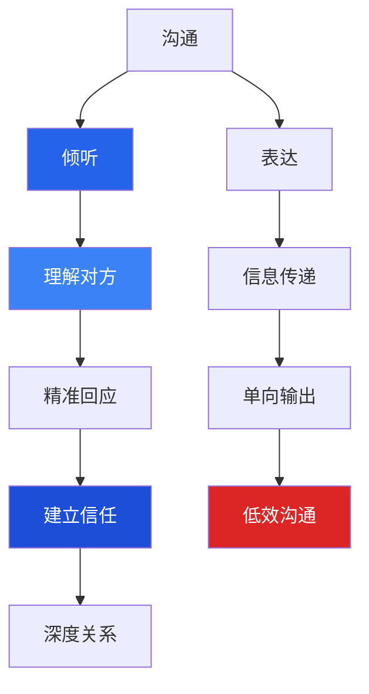
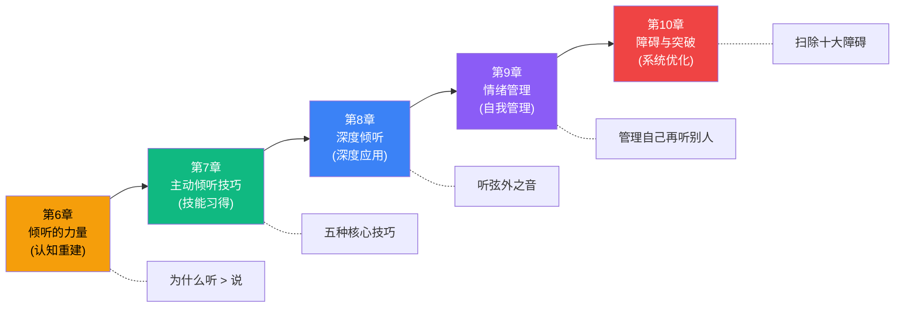
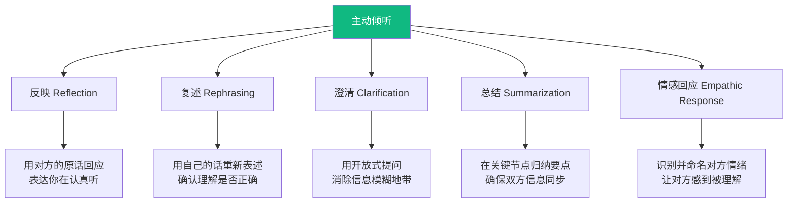
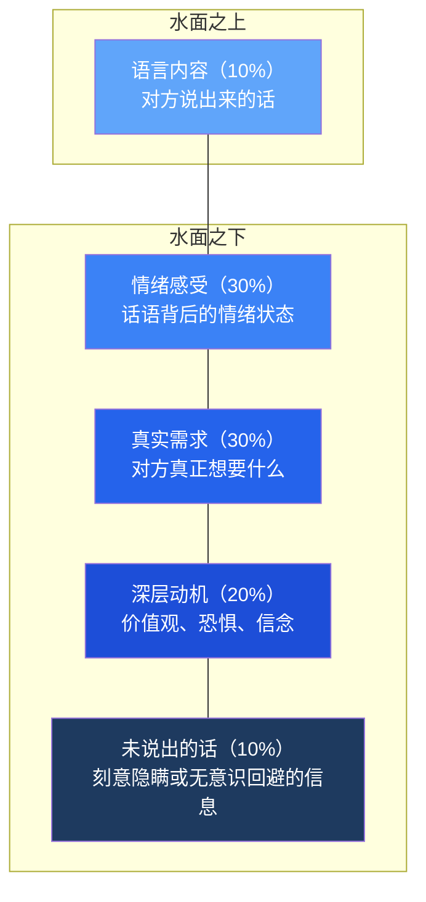
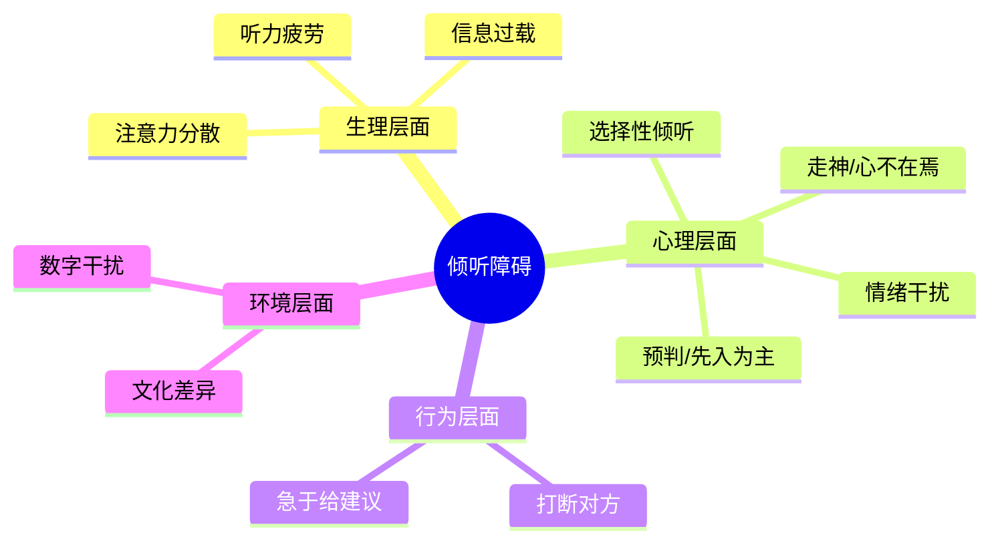
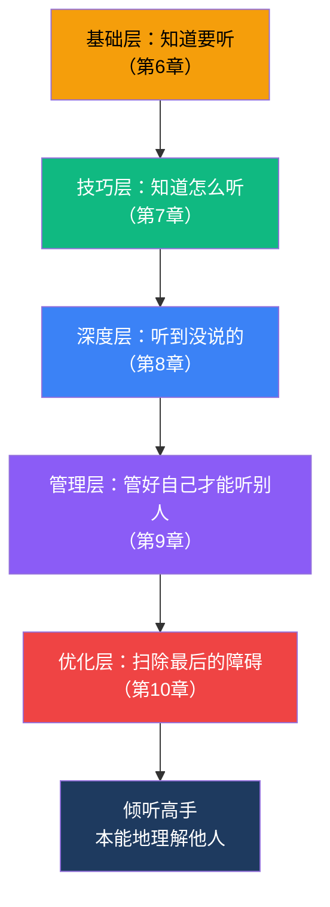

## 第二模块：倾听与理解（第6-10章）

> "我们有两只耳朵一张嘴，就是要我们多听少说。" ——爱比克泰德

沟通不是一个人的独角戏。如果说第一模块解决了"如何清晰表达自己"的问题，那么第二模块要解决一个更根本的问题：**你是否真的听到了对方在说什么？**

大多数人自认为是合格的倾听者，但研究数据讲了一个残酷的故事——人类的倾听效率平均只有25%，也就是说，对方说了100个字的信息，你实际接收到的不过25个字。更糟糕的是，大多数人对这个事实毫不知情。

### 为什么倾听是沟通的地基

在进入具体章节之前，先理解一个关键逻辑：

没有倾听的表达是独白，没有理解的回应是自说自话。**倾听决定了沟通的上限——你能理解到多深，你就能回应到多精准。**

### 模块架构：五章递进体系

本模块按照"认知重建→技能习得→深度应用→自我管理→障碍突破"的路径设计，五章之间环环相扣：

下面逐章展开。

---

### 第6章：倾听的力量——沟通中最被低估的技能

**一句话定位**：颠覆"沟通=会说"的认知，建立倾听是一切有效沟通前提的心智模型。

#### 为什么这一章排在"表达技巧"之后

第一模块（第1-5章）教你如何表达，但表达的效果取决于你对对方需求的理解深度。一个只顾说、不会听的人，就像一个枪法很准但从来不看靶子在哪的射手——技术再好也打不中。

#### 核心理论框架

**倾听的五层金字塔模型**（改编自Ivey的微观咨询理论）：

| 层级 | 名称 | 特征 | 典型表现 | 对沟通的影响 |
|------|------|------|----------|-------------|
| L1 | 忽视 | 人在心不在 | 玩手机、眼神游离 | 对方感到被无视 |
| L2 | 假装倾听 | 表面配合，内心走神 | "嗯嗯""对对"敷衍回应 | 对方感到不被尊重 |
| L3 | 选择性倾听 | 只听自己想听的部分 | 只关注结论，忽略过程和情感 | 信息丢失严重 |
| L4 | 专注倾听 | 全神贯注接收全部信息 | 眼神接触、适时点头、不打断 | 对方感到被重视 |
| L5 | 共情倾听 | 听到信息+感受+需求 | "听起来你当时很委屈" | 对方感到被真正理解 |

**绝大多数人停留在L3**，原因有三：

1. **效率焦虑**：觉得听太久浪费时间，急于给出解决方案
2. **自我中心**：脑子里已经在组织自己的回应，没有空间留给对方
3. **训练缺失**：从小到大，从没有人系统教过我们如何倾听

#### 实操：倾听水平自评

在进入后续章节的技巧学习之前，先做一次诚实的自我评估。回忆最近一周的三次重要对话，逐项打分（1-5分）：

| 评估项 | 从不(1) | 很少(2) | 有时(3) | 经常(4) | 总是(5) |
|--------|---------|---------|---------|---------|---------|
| 对方说话时我能忍住不打断 |  |  |  |  |  |
| 我能准确复述对方刚说的内容 |  |  |  |  |  |
| 我能察觉对方话语中的情绪变化 |  |  |  |  |  |
| 对方说完后我不会立刻转移到自己身上 |  |  |  |  |  |
| 在争议话题中我能保持开放心态 |  |  |  |  |  |

**得分解读**：20-25分（L4-L5水平，巩固即可）；13-19分（L3水平，有明确提升空间）；5-12分（L1-L2水平，急需系统训练）。

#### "沉默的力量"——最容易被忽视的倾听工具

大多数人害怕对话中的沉默，觉得尴尬、冷场。但事实上，**有策略的沉默是最强大的倾听工具之一**。

具体应用场景：

- **对方刚说完一个重要观点**：停顿2-3秒再回应，表明你在认真消化
- **对方情绪激动时**：保持安静陪伴，比任何安慰话语都有效
- **对方似乎欲言又止时**：给空间，不要急着填补空白
- **谈判或关键对话中**：谁先打破沉默，谁往往先让步

**练习方法**：从每天3秒的刻意沉默开始。在对方说完话后，默数1-2-3，然后再开口。你会发现，这短短三秒会彻底改变对方对你倾听质量的感知。

#### 常见误区

- **误区一**："倾听就是不说话" → 倾听是主动的信息处理过程，安静只是表面形式
- **误区二**："好听众就是点头附和" → 无脑附和等于L2假装倾听，真正的倾听需要回应内容和情感
- **误区三**："倾听是性格决定的，外向的人学不会" → 倾听是技能，不是性格特征，任何人都可以通过训练提升

---

### 第7章：主动倾听的技巧——让对方感到被理解

**一句话定位**：从"我知道要听"到"我真的会听"，掌握五种可练习、可衡量的主动倾听核心技巧。

#### 五种技巧的完整技术体系

##### 技巧一：反映（Reflection）

**原理**：用对方刚说的关键词或短语，以陈述语气重复出来。这不是鹦鹉学舌，而是用"回声"告诉对方——"你的信息被接收到了"。

**标准句式**："你说的是……" "听起来你觉得……"

**实战示例**：

> 对方："这个项目我已经加班两周了，结果老板还说进度太慢。"
> 反映："进度太慢……"（停顿，让对方继续展开）

**适用场景**：对话初期建立信任；对方情绪需要释放时；你需要争取思考时间时。

**注意事项**：反映的语气必须是陈述句（平调），不能是疑问句（升调），否则会变成质疑而非倾听。

##### 技巧二：复述（Rephrasing）

**原理**：用自己的语言重新组织对方的核心意思，而不是简单重复原话。这要求你真正理解了对方的意思，才能用不同的话说出来。

**标准句式**："如果我理解正确的话，你的意思是……" "换句话说……"

**实战示例**：

> 对方："这个方案太冒险了，万一市场反应不好，我们整个季度的KPI都得完蛋。"
> 复述："你担心这个方案的风险太高，如果失败会影响整个季度的业绩指标。"

**为什么有效**：复述迫使对方检验你的理解是否准确。如果理解有偏差，对方会立刻纠正，从而避免信息在传递链中失真。

##### 技巧三：澄清（Clarification）

**原理**：当对方的表述存在歧义、模糊或信息不完整时，用开放式提问消除理解偏差。

**标准句式**："你提到的XX具体是指？" "能不能举个例子说明一下？" "你说的'不太好'大概是到什么程度？"

**关键区分**：澄清是开放式提问（"能具体说说吗？"），不是封闭式提问（"你是说XX对吧？"）。封闭式提问容易引导对方按照你的理解走，而不是暴露真实意思。

##### 技巧四：总结（Summarization）

**原理**：在对话的关键节点（通常每10-15分钟或话题切换时），用30秒左右归纳对方的核心观点和诉求。

**标准句式**："我来梳理一下你刚才说的几个要点……" "目前为止，你说到了三个方面：第一……第二……第三……"

**实战价值**：总结不仅是倾听工具，更是对话的"校准器"——它能让双方确认信息是否一致，避免越聊越偏的情况。在商务谈判和项目会议中，定期总结能把对话效率提升40%以上。

##### 技巧五：情感回应（Empathic Response）

**原理**：识别对方话语中蕴含的情绪，并用语言将这种情绪"命名"出来。当一个人的情绪被准确命名时，他会感到被真正理解——这是建立深度信任的捷径。

**标准句式**："听起来这件事让你很……（委屈/沮丧/焦虑/失望）" "你当时一定感到很……"

**核心挑战**：大多数人能识别"开心""生气"这类基础情绪，但对复合情绪（如"对现状的无力感+对未来的焦虑""被认可的渴望+害怕被拒绝的恐惧"）识别力不足。提升情绪词汇量是关键——中文里表达细腻情绪的词汇远比日常使用中多得多。

#### 五种技巧的综合运用

在真实对话中，五种技巧不是孤立使用的，而是在对话的不同阶段自然切换：

**练习路径**：第一周只练反映，第二周加复述，第三周加澄清，第四周尝试综合运用。不要贪多，每次对话只刻意练习一种新技巧，直到它变成肌肉记忆。

---

### 第8章：深度倾听——听到话语背后的真实含义

**一句话定位**：从"听到说了什么"到"听到没说什么"，掌握穿透语言表面、触及真实需求的高级倾听能力。

#### 冰山模型：语言只是水面之上的一角

弗洛伊德的冰山理论在倾听领域有极强的解释力：

**举例说明**：伴侣说"你最近总是加班"。
- 表面含义：描述一个事实
- 情绪感受：孤独、被忽视
- 真实需求：希望有更多共处时间
- 深层动机：对关系安全感的需求

如果只听到表面含义，你的回应可能是："没办法，项目赶进度。" 但如果听到了冰山之下的层次，你的回应可能是："你是不是觉得最近我们相处的时间太少了？"

#### 三层含义模型

每一句话都至少包含三层信息：

| 层次 | 内容 | 识别方法 |
|------|------|----------|
| 第一层：事实层 | 发生了什么（客观事件） | 关注5W1H：谁、何时、何地、什么、为什么、如何 |
| 第二层：感受层 | 对方对此有什么情绪 | 关注语气、语速、停顿、用词的强弱变化 |
| 第三层：需求层 | 对方希望得到什么回应 | 关注"我希望""要是能……就好了""可惜"等信号词 |

#### 识别"弦外之音"的六个线索

1. **重复出现的词**：对方反复提到某个词或话题，说明这个点对他很重要
2. **语速突然变化**：加快可能意味着焦虑或想跳过；放慢可能意味着在犹豫或强调
3. **回避特定话题**：被问到时转移话题或含糊其辞，往往是敏感点
4. **身体语言不一致**：嘴上说"没事"，但肢体紧绷、语调下沉——以身体语言为准
5. **"其实""说实话""老实说"**：这些前置词后面往往才是真实想法
6. **绝对化表述**："你从来不……""你总是……"背后是对长期积累的不满

#### 文化背景对倾听的影响

在中国文化语境中，倾听需要额外注意一个维度：**含蓄表达的文化基因**。

西方沟通倾向于直接表达需求（"I need you to..."），而中文语境中更常见的表达方式是：

| 直接表达（较少见） | 含蓄表达（更常见） | 真实含义 |
|-------------------|-------------------|----------|
| "我不同意" | "这个方案挺好的，但是不是再考虑一下？" | 强烈反对 |
| "帮帮我" | "最近忙得焦头烂额" | 需要帮助但不好意思开口 |
| "我不想去了" | "到时候看情况吧" | 委婉拒绝 |
| "我很生气" | "你觉得这样做合适吗？" | 已经非常不满 |

**应对策略**：在中国文化语境中，倾听时要特别注意"但是""不过""再说吧""看情况"这些缓冲词——它们往往不是字面意思，而是信号词，提示你对方有未说出口的真实想法。

#### 深度倾听的提问技术

当怀疑对方说的不是全部真相时，不要直接追问（"你是不是在骗我？"），而是用以下三种提问方式引导：

1. **假设性提问**："如果没有任何限制，你最希望这件事怎么发展？"（绕过现实约束，引出真实愿望）
2. **外化提问**："你觉得如果你最好的朋友遇到这种情况，他会怎么做？"（降低防御心理，让对方以外人视角说出真实想法）
3. **量化提问**："从1到10，你对这件事的满意度是多少？"（量化比模糊的"还行"更接近真实感受）

---

### 第9章：倾听中的情绪管理——保持冷静与开放

**一句话定位**：倾听最大的敌人不是外界噪音，而是你自己的情绪。管理好自己，才能听懂别人。

#### 为什么情绪管理是倾听的前提

神经科学给出了清晰的解释：当人处于强烈情绪状态时，大脑的杏仁核会劫持前额叶皮层的理性功能——这就是"杏仁核劫持"（Amygdala Hijack）。在这个状态下，你的大脑进入了"战或逃"模式，所有信息都会经过情绪滤镜的扭曲：

- 对方的中性陈述被解读为攻击
- 对方的善意建议被理解为批评
- 对方的沉默被判定为敌意

**换句话说：情绪激动时，你听到的不是对方说的内容，而是你的情绪投射。**

#### 情绪触发器的识别与管理

**情绪触发器**是指那些能快速点燃你情绪反应的特定话题、词语、语气或行为模式。每个人都有自己的触发器，识别它是情绪管理的第一步。

**常见情绪触发器类型**：

| 触发器类型 | 示例 | 典型反应 |
|-----------|------|----------|
| 价值观冲突 | "你这样太不负责任了" | 愤怒、防御 |
| 身份威胁 | "你根本不懂这个领域" | 自卑、反击 |
| 被忽视感 | "这个我知道，不用你说" | 沮丧、疏离 |
| 不公平感 | "为什么总是我来做" | 愤怒、委屈 |
| 失控感 | "我早就跟你说过了" | 自责、焦虑 |

**实操：建立你的触发器清单**

回忆过去三次你在对话中情绪失控的经历，分析：
1. 对方说了什么（具体的话）？
2. 你当时的情绪反应是什么？
3. 这个反应触发了你什么深层需求（被尊重？被认可？安全感？）？
4. 下次遇到类似情况，你可以怎么做？

将这些写下来，形成你个人的"情绪触发器地图"。知道自己的雷区在哪里，才能提前排雷。

#### 正念倾听法

正念（Mindfulness）的核心是"有意识地、不加评判地关注当下"。将其应用于倾听：

**四步正念倾听流程**：

1. **觉察**：注意到自己开始有情绪反应了（"我现在有点生气"）
2. **暂停**：不要立刻回应，给自己3秒钟的缓冲
3. **呼吸**：做一次深呼吸，将注意力从情绪拉回到对方的话语上
4. **选择**：有意识地选择如何回应，而不是被情绪裹挟着反应

**日常练习**：每天选择一次对话，在倾听过程中刻意练习"觉察-暂停"。不需要每次对话都做到，先从一天一次开始，逐步增加频率。

#### 当对方的话让你不舒服时的应对策略

不舒服的感受有很多种，应对策略也不同：

| 不舒服的类型 | 不建议的做法 | 建议的做法 |
|-------------|-------------|-----------|
| 对方在批评你 | 立刻辩解或反击 | 先反映："你觉得我在XX方面做得不够好" |
| 对方在诉苦 | 急于给建议"你应该……" | 先回应情绪："听起来你真的很累" |
| 对方在指责你 | 否认"我没有！" | 澄清："你能具体说说是哪个瞬间让你这么觉得的？" |
| 对方观点你不认同 | 打断并反驳 | 先复述确认理解，再表达自己的看法 |

**关键原则**：先处理情绪，再处理事情。跳过情绪直接解决问题，往往会让对方觉得你没有在听。

#### 如何在高压对话中保持倾听能力

高压对话（绩效面谈、家庭冲突、商务谈判）是倾听能力的终极考场。以下是四个经过验证的策略：

1. **提前预演**：对话前预想可能的刺激性话题，提前准备好应对方式
2. **物理调节**：深呼吸（4秒吸-7秒屏-8秒呼）、喝水、改变坐姿——这些小动作能从生理层面降低应激反应
3. **设立"暂停暗号"**：在重要关系中与对方约定一个暂停信号，当任何一方情绪即将失控时使用
4. **事后再谈**：如果情绪实在无法控制，主动提出"我需要一点时间消化，我们半小时后再继续好吗？"——这比在情绪中说出伤人的话好一万倍

---

### 第10章：倾听的障碍与突破——克服常见的倾听问题

**一句话定位**：系统识别倾听中的十大障碍，提供针对性的突破策略，完成从"知道"到"做到"的最后一公里。

#### 十大倾听障碍全景图

逐一分析：

#### 障碍一：走神——大脑的"默认模式网络"

**神经科学原理**：人脑有一个叫"默认模式网络"（Default Mode Network, DMN）的系统，当你没有专注于外部任务时，它会自动激活——表现为胡思乱想、神游天外。研究表明，人类清醒时约47%的时间处于走神状态。

**突破策略**：
- **物理锚定法**：将注意力锚定在一个具体的物理感受上（如双脚踩在地面上的感觉），走神时通过这个锚点回来
- **关键词追踪法**：在倾听时默默提炼对方每句话的关键词，这会让大脑保持"加工模式"而非"待机模式"
- **笔记法**：用手写笔记（不是手机打字）记录要点，手写的过程本身就是注意力锚定

#### 障碍二：预判——"我知道你接下来要说什么"

**表现**：对方刚开口，你就在心里下结论了。预判会过滤掉所有与你预期不符的信息，让你活在一个自我确认的回音室里。

**突破策略**：
- 用"假设检验"心态替代"确认"心态：把你的预设当作一个待验证的假设，而不是事实
- 养成习惯：在对方说完后，先问自己"有没有什么出乎我意料的部分？"

#### 障碍三：选择性倾听——只听想听的

**表现**：只关注与自己相关或符合自己观点的内容，忽略其他信息。

**突破策略**：
- 对话结束后，尝试回忆对方提到但你当时没太在意的三个点
- 有意识地关注与自己观点不同的部分——这才是最有信息增量的内容

#### 障碍四：打断——"我知道你要说什么了"

**表现**：在对方还没说完时就插入自己的观点。调查显示，平均对话中每18秒就会发生一次打断。

**突破策略**：
- 当你有强烈的表达冲动时，在心里默念"等他说完"
- 如果怕忘记自己想说的话，在心里快速记一个关键词，然后继续专注倾听

#### 障碍五：急于给建议——"你应该这样做"

**表现**：对方还在倾诉，你就已经在脑子里组织解决方案了。

**这是最普遍也最隐蔽的倾听障碍**。它的根源是：帮助别人解决问题会让你觉得自己有价值。但大多数情况下，对方需要的不是建议，而是被理解。

**突破策略**：
- 在给建议前，先问自己："对方是真的在寻求建议，还是只是想被听到？"
- 实在不确定时，直接问："你是想让我听你说，还是想让我帮你想想办法？"

#### 障碍六：情绪干扰

（详见第9章的完整论述。核心应对：觉察→暂停→呼吸→选择。）

#### 障碍七：信息过载

**表现**：对方说的信息量太大，大脑处理不过来，于是开始放弃。

**突破策略**：
- 主动要求暂停："你说的很重要，我需要一点时间消化，我们先停一下可以吗？"
- 借助笔记——把信息外化到纸上，减轻大脑的短期记忆负担
- 用总结技巧压缩信息："你刚才主要说了三个方面，我理解得对吗？"

#### 障碍八：注意力分散（数字时代特有）

**表现**：手机通知、邮件弹窗、消息提醒——数字设备正在系统性地摧毁我们的深度倾听能力。

**突破策略**：
- 重要对话前，手机翻面朝下或调到勿扰模式
- 把"手机朝下"作为尊重对方的仪式感动作
- 如果在线上会议中，关闭所有非必要的标签页和通知

#### 障碍九：文化差异

**表现**：不同文化背景的人对沉默、打断、眼神接触、语速的默认设定不同，容易产生误判。

**突破策略**：
- 不要用自己文化的倾听标准去评判对方的行为
- 当不确定时，直接询问："在你的文化/习惯中，什么样的方式让你觉得被认真倾听？"

#### 障碍十：听力疲劳

**表现**：长时间高强度倾听后，大脑的注意力资源耗尽，倾听质量断崖式下降。

**突破策略**：
- 重要对话安排在精力充沛的时段
- 超过45分钟的连续对话，主动提议休息5-10分钟
- 学会区分"必须深度倾听"和"可以适度放松"的场合，合理分配注意力资源

#### 建立"倾听纪律"：四周改善计划

| 周次 | 重点突破 | 每日任务 | 验证标准 |
|------|---------|---------|---------|
| 第1周 | 消除打断 | 记录每天被打断/打断别人的次数 | 打断次数减少50% |
| 第2周 | 专注倾听 | 每天至少一次完整对话不看手机 | 对话后能准确复述对方要点 |
| 第3周 | 深度倾听 | 每天练习一次"听三层"（事实+感受+需求） | 能识别出1-2个弦外之音 |
| 第4周 | 综合运用 | 在一次重要对话中综合使用所有技巧 | 对方主动反馈"你真的在听" |

**四周后的复测**：重新做第6章的倾听水平自评，对比四周前的得分。如果你的总分提高了5分以上，说明你的倾听能力已经有了实质性的提升。

---

### 模块总结：倾听能力的进阶路径

**关键认知**：倾听不是天赋，而是技能。技能意味着任何人都可以通过系统训练从"不会"到"会"，从"会"到"精通"。五章内容提供了完整的训练体系——从认知重建到技能习得，从深度应用到自我管理，从障碍识别到系统突破。

**最终检验标准**：当你和别人对话时，对方不需要说"你在听吗？"——因为你的回应已经证明了一切。

