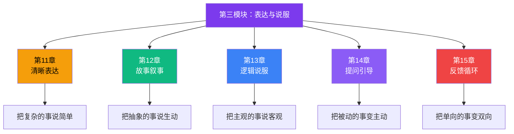
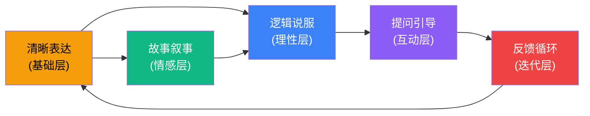
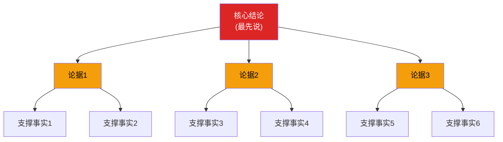
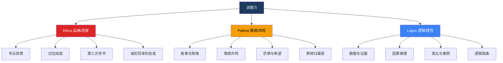
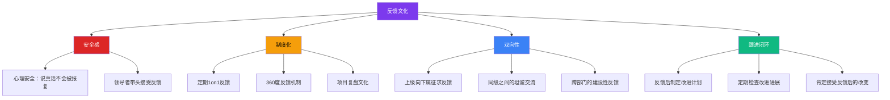
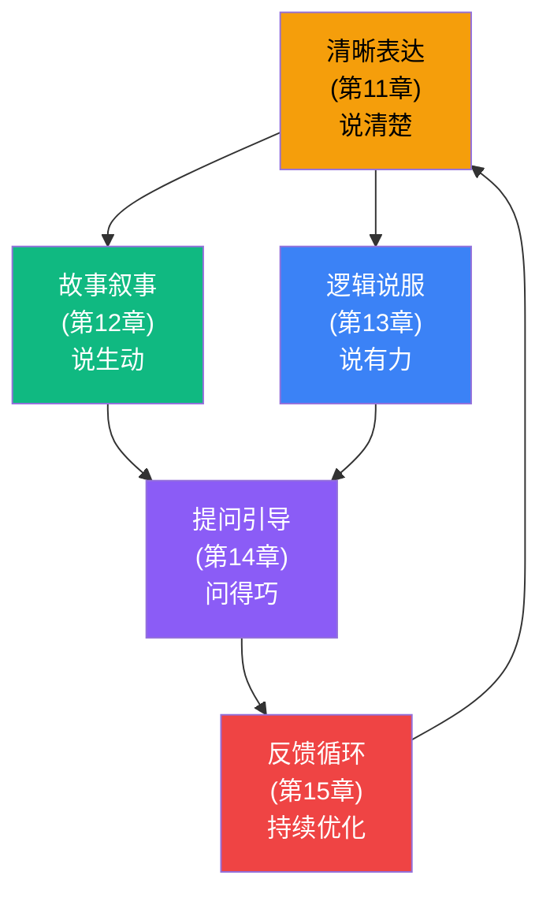

## 第三模块：表达与说服（第11-15章）

> "清晰的表达不是天赋，而是纪律。" ——威廉·津瑟

前两个模块解决了沟通的两个前提——**认识自己**（第一模块）和**理解别人**（第二模块）。但沟通的终极目标不只是"理解"，而是**影响**：让对方接受你的观点、认同你的方案、采取你希望的行动。

第三模块就是为此而设计的。五章分别覆盖表达的五个关键维度：

### 模块核心逻辑：表达与说服的五维模型

表达与说服不是单一技能，而是一个多维能力矩阵。五个维度之间的关系如下：

- **清晰表达**是基础——说不清楚，后面一切都是空中楼阁
- **故事叙事**和**逻辑说服**是两条并行的说服路径——感性与理性
- **提问引导**是主动掌控对话方向的杠杆——好问题胜过好答案
- **反馈循环**是持续优化的闭环——没有反馈，你永远不知道自己说的对不对

完成这个模块后，你将掌握一套完整的"表达-说服-优化"能力闭环，在工作汇报、项目提案、团队管理、客户沟通等所有需要影响他人的场景中游刃有余。

---

### 第11章：清晰表达的艺术——让你的话一击即中

**一句话定位**：掌握将复杂信息精准、简洁、高效传递给任何听众的系统方法论。

#### 为什么"清晰表达"是所有沟通技巧的地基

你可能遇到过这样的人：明明做了很多工作，汇报时却让听众一头雾水；明明产品很好，介绍时却让客户失去耐心；明明想法很有价值，表达时却被人忽视。

根本原因不是"口才不好"，而是**缺乏结构化的表达思维**。

心理学家乔治·米勒（George Miller）在1956年发表的经典论文《神奇的数字7±2》中指出，人类工作记忆的容量有限——普通人一次只能处理5-9个信息块。这意味着，如果你的表达没有经过结构化处理，听众的大脑会在30秒内达到信息过载，然后选择性放弃。

**清晰表达的本质不是"少说"，而是"有序地说"。**

#### 核心理论框架一：金字塔原理（The Pyramid Principle）

金字塔原理由麦肯锡公司的芭芭拉·明托（Barbara Minto）在《金字塔原理》一书中系统提出，是商务写作和口头表达中最经典的结构化思维工具。

**核心规则**：结论先行，自上而下，逻辑分组。

**为什么结论先行有效？**

认知心理学中的"首因效应"（Primacy Effect）表明，人们对最先接收到的信息印象最深。同时，听众需要一个"认知框架"来组织后续信息——如果你先说论据，听众不知道这些论据要支撑什么结论，就会在脑子里反复猜测，消耗大量认知资源，最终错过你后面的内容。

**实战对比**：

| 低效表达（论据先行） | 高效表达（结论先行） |
|---------------------|---------------------|
| "我分析了竞品A、B、C的定价策略，研究了用户付费意愿调研报告，还和销售团队聊了最近的客户反馈……" | "我建议将定价下调15%。原因有三：第一，竞品均价已低于我们18%；第二，用户调研显示价格是流失主因；第三，销售反馈客户最大的抱怨就是性价比。" |
| 听众反应：说了两分钟还不知道你想说什么 | 听众反应：3秒内知道你的核心观点，后面的内容自动归类 |

#### 核心理论框架二：三点法（Rule of Three）

三这个数字在人类认知中有特殊地位。心理学研究表明，三个信息点恰好处于工作记忆的最佳负荷区间——足够形成完整论证，又不会造成信息过载。

**修辞学中的"三"无处不在**：
- 基督教：圣父、圣子、圣灵
- 美国独立宣言：Life, Liberty, and the pursuit of Happiness
- 奥巴马竞选口号：Change we can believe in（三组意象）
- 乔布斯发布会：Three products（iPod, Phone, Internet Communicator）

**三点法的实操模板**：

在汇报、演讲、提案中，将核心信息组织为"一个中心论点 + 三个支撑要点"的结构：

我认为应该[核心结论]。
原因有三个：
第一，[要点1]——[一句话展开]
第二，[要点2]——[一句话展开]
第三，[要点3]——[一句话展开]
所以，[重述结论+行动建议]。

**注意事项**：
- 三个要点之间必须互斥（MECE原则），不能有重叠
- 三个要点最好按重要性递减排列（首因效应+近因效应，最重要的放第一和第三）
- 如果确实有四个要点，检查能否合并为三个；如果只有两个，检查能否拆分出第三个

#### 核心理论框架三：电梯演讲（Elevator Pitch）

电梯演讲是指在30秒到2分钟内（电梯从1楼到顶楼的时间），向任何人清晰传达你的核心想法。这个技能在创业融资、项目提案、社交场合自我介绍中都是生死攸关的能力。

**经典结构——PREP法**：

| 步骤 | 含义 | 时间 | 示例 |
|------|------|------|------|
| P - Point | 亮出结论 | 5秒 | "我们的用户留存率可以从30%提升到50%" |
| R - Reason | 给出理由 | 15秒 | "因为数据显示70%的用户在第3天流失，原因是新手引导缺失" |
| E - Example | 举个例子 | 15秒 | "上周我们测试了新引导流程，试验组留存提升了12个百分点" |
| P - Point | 重申结论 | 5秒 | "所以，我建议全面上线新引导流程，预计季度收入增加200万" |

**电梯演讲的三大禁忌**：
1. **堆术语**：听众可能不是你的专业领域，用行业黑话等于自说自话
2. **铺垫太长**：不要从"事情的起因是这样的……"开始，直接亮结论
3. **没有行动呼吁**：说清楚"我希望你做什么"，否则对方听完不知道该怎么回应

#### 去除语言中的"噪音"

清晰表达的敌人不只是结构混乱，还有语言本身的"噪音"——那些不携带有效信息但占用听者注意力的词汇和表达。

**四大语言噪音类型**：

| 噪音类型 | 常见表现 | 优化方法 | 优化效果 |
|----------|---------|---------|---------|
| 填充词 | "嗯""啊""那个""就是说""然后""对吧" | 录音回听+刻意停顿替代填充词 | 表达节奏感提升40% |
| 模糊词 | "可能""大概""差不多""应该""感觉" | 用具体数据或明确判断替代 | 可信度提升50% |
| 多余修饰 | "非常""特别""真的""很""挺" | 删除不影响句意的修饰词 | 信息密度提升30% |
| 冗余表达 | "我个人认为我觉得""说白了就是""其实本质上" | 直接说核心意思 | 表达效率提升25% |

**实操练习：60秒录音诊断法**

1. 录一段60秒的工作汇报
2. 逐字转录
3. 用三种颜色标记：红色=填充词，蓝色=模糊词，绿色=多余修饰
4. 删掉所有标记内容后重新朗读
5. 对比前后的信息密度和表达节奏

大多数人会发现，去掉噪音后，60秒的内容可以在40秒内说完，而且信息量不减反增。

#### 清晰表达的场景化应用

不同场景对清晰表达的要求不同：

| 场景 | 时间约束 | 核心策略 | 关键要点 |
|------|---------|---------|---------|
| 工作日报 | 3分钟内 | "成果+问题+计划"三段式 | 量化成果，明确卡点 |
| 项目汇报 | 10分钟内 | 金字塔原理+数据支撑 | 决策者只关心结论和风险 |
| 方案提案 | 20分钟内 | 问题→方案→收益→行动 | 先让对方认同问题再谈方案 |
| 客户沟通 | 因人而异 | 从对方痛点切入 | 客户关心的是"对我有什么用" |
| 跨部门协调 | 5分钟内 | 用对方的语言说自己的事 | 技术对技术、商业对商业 |

#### 常见误区与纠正

| 误区 | 真相 | 纠正方法 |
|------|------|---------|
| "说得多显得专业" | 信息过载会让听众关闭接收通道 | 严格遵循三点法，只保留最核心的信息 |
| "清晰=简单化" | 清晰是有序，不是浅薄 | 用结构化框架组织复杂信息，而非删减信息量 |
| "准备稿件就够了" | 清晰表达需要反复练习和反馈 | 录音回听、找人试听、持续迭代 |
| "表达技巧是天生的" | 所有顶级演讲者都经过系统训练 | 每周至少做一次刻意练习 |

#### 学习路径

1. **第一周**：用金字塔原理重构你下一次工作汇报
2. **第二周**：录制一段一分钟自我介绍，用"噪音诊断法"优化
3. **第三周**：准备三个不同场景的电梯演讲
4. **第四周**：请三位同事评价你的表达清晰度（用1-5分打分），建立基线，持续优化

---

### 第12章：故事的力量——用叙事打动人心

**一句话定位**：掌握故事的底层结构和实战技巧，让你的沟通从"说道理"升级到"讲故事"。

#### 为什么人类天生对故事无法抗拒

神经科学给出了令人震惊的答案：当一个人在听数据和事实时，大脑只有两个区域被激活——布洛卡区（语言处理）和韦尼克区（语言理解）。但当一个人在听故事时，**大脑的七个区域同时被激活**——除了语言区域，还包括负责运动感知的运动皮层、负责情感处理的杏仁核、负责感官体验的感觉皮层等。

这意味着什么？**听数据时，大脑在"分析"；听故事时，大脑在"体验"。**

普林斯顿大学的尤里·哈森（Uri Hasson）教授的研究更进一步发现，讲述者和倾听者的大脑活动会出现"神经耦合"——当讲故事的人描述跑步场景时，听者大脑中负责跑步的运动皮层也会激活。**故事不仅传递信息，还能让听众的脑活动与讲述者同步。**

这就是为什么：
- 苹果发布会不讲参数，讲"我们为什么要造这个产品"
- TED演讲不用PPT堆数据，用个人经历开场
- 顶级销售不推产品功能，讲"其他客户怎么用它解决了问题"

#### 故事的底层结构：三幕式叙事

几乎所有有效故事都遵循一个通用结构——三幕式叙事（Three-Act Structure），这是从亚里士多德的《诗学》到好莱坞编剧都在使用的底层框架：

**关键要点**：第二幕占整个故事50%的篇幅，因为冲突和挣扎是故事最有张力的部分。很多人讲故事的错误是：铺垫太长，解决太快——还没让听众感受到"痛"，就急着给"药"。

#### STAR法则：职场故事的万能模板

STAR法则是面试、述职、案例分享中最实用的故事框架，尤其适合需要展示能力和成果的场景：

| 要素 | 含义 | 示例 | 时间占比 |
|------|------|------|---------|
| S - Situation | 背境是什么 | "去年Q3，我们的用户流失率突然从15%飙升到28%" | 20% |
| T - Task | 你的任务/目标 | "作为产品负责人，我需要在一个月内找到原因并止血" | 10% |
| A - Action | 你做了什么 | "我做了三件事：深度访谈30个流失用户、分析行为漏斗数据、AB测试新引导流程" | 50% |
| R - Result | 结果如何 | "流失率降到12%，比之前还低3个百分点，季度收入多了300万" | 20% |

**STAR法则的四个常见错误**：

1. **S太长**：花5分钟讲背景，听众已经不耐烦了。背景控制在30秒内。
2. **T不清楚**：没有明确"你的角色和目标"，导致听众不知道你在故事中的位置。
3. **A太笼统**：说"我做了很多工作"不如说"我每周做3次用户访谈"。具体数字比模糊描述有效10倍。
4. **R没有量化**：说"效果不错"不如说"转化率提升了23%"。数字是最有说服力的故事结尾。

#### 构建你的"个人故事库"

故事不是临场编造的，而是提前准备好的。每个人都应该建立自己的"故事库"——5-10个经过打磨、随时可用的个人故事。

**故事库的分类框架**：

| 故事类型 | 用途 | 建议数量 | 示例主题 |
|----------|------|---------|---------|
| 克服困难型 | 展示韧性和能力 | 2-3个 | 项目死线、技术难题、团队冲突 |
| 成功案例型 | 展示成果和方法论 | 2-3个 | 业绩突破、流程优化、创新方案 |
| 失败学习型 | 展示反思和成长 | 1-2个 | 错误决策、失败项目、教训总结 |
| 价值观型 | 展示品格和信念 | 1-2个 | 职业选择、道德困境、人生转折 |
| 幽默自嘲型 | 拉近距离、活跃气氛 | 1-2个 | 尴尬经历、趣事、意外状况 |

**打磨故事的五步法**：

1. **选素材**：回忆真实经历中最有冲突/转折/情感的瞬间
2. **定结构**：用STAR或三幕式框架组织
3. **加细节**：加入感官描写（看到了什么、听到了什么、感受到什么），让听众"身临其境"
4. **卡时间**：职场故事控制在90秒到3分钟
5. **反复练**：对着镜子或录音讲5遍以上，直到自然流畅

#### 数据+故事的双轨说服法

纯粹的故事缺乏说服力，纯粹的数据缺乏感染力。最强大的说服方式是**数据和故事的结合**——用数据建立可信度，用故事建立情感连接。

**经典结构：数据→故事→数据**

"根据我们的用户调研，72%的新用户在注册后3天内流失。
我给你讲一个真实的例子：小王是我们上周访谈的用户，
他下载了App，注册花了5分钟，然后……
如果我们把注册流程从7步减到3步，类似小王的用户
留存率预计可以提升40%——这在行业AB测试中已被多次验证。"

**为什么这个结构有效**：
- 第一个数据建立问题的严重性（理性钩子）
- 故事让数据变得可感知（情感连接）
- 第二个数据提供解决方案的信心（理性闭环）

#### 让故事产生情感共鸣的关键技术

故事打动人的不是情节，而是**情感**。以下是四种让故事产生情感共鸣的技术：

1. **脆弱性展示**：不要只讲"我多厉害"，也要讲"我当时多害怕/多无助"。适度展示脆弱会让人觉得你真实、可亲近。
2. **感官细节**："会议室里安静得能听到空调的嗡嗡声"比"会议室很安静"有力10倍。感官细节激活大脑的感觉皮层，让听众产生"代入感"。
3. **情感对比**：先讲"多糟糕"再讲"多成功"，对比越强烈，故事越有张力。这就是为什么好莱坞电影总是在高潮前安排一个"最低谷"。
4. **留白**：不要把所有情感都替听众表达出来。讲完关键情节后停顿2秒，让听众自己产生感受——自己得出的结论比被告知的更有力量。

#### 常见误区与纠正

| 误区 | 真相 | 纠正方法 |
|------|------|---------|
| "讲故事就是编故事" | 虚假的故事一旦被拆穿，信任归零 | 只讲真实经历，可以艺术加工但不能捏造 |
| "我的经历太平淡，没有好故事" | 故事的价值不在于事件大小，在于冲突和情感 | 从日常小事中提取"冲突点"和"转折点" |
| "正式场合不该讲故事" | 越正式的场合，越需要故事来抓住注意力 | 用STAR法则讲职场故事，专业且有感染力 |
| "故事越长越有感染力" | 好故事是压缩的，每一句话都要有功能 | 删掉所有不影响情节和情感的描述 |

#### 学习路径

1. **第一周**：准备5个不同场景的个人故事，用STAR框架打磨
2. **第二周**：在一次会议或汇报中有意识地使用故事法开场
3. **第三周**：收集听众反馈——"哪个部分让你印象最深？"
4. **第四周**：根据反馈迭代故事库，淘汰效果不好的，补充新的

---

### 第13章：逻辑与说服——有理有据地影响他人

**一句话定位**：掌握亚里士多德说服三要素和现代论证技术，构建无懈可击的说服体系。

#### 说服力的三大基石：Ethos-Pathos-Logos

2300多年前，亚里士多德在《修辞学》中提出了说服的三要素。令人惊叹的是，这套框架在21世纪的今天依然完全适用——无论是商业提案、政治演讲还是日常沟通，所有成功的说服都在运用这三个要素：

**三个要素的优先级因场景而异**：

| 场景 | 最重要的要素 | 原因 | 次重要的要素 |
|------|------------|------|------------|
| 学术/技术评审 | Logos | 评审者看重证据和推理 | Ethos |
| 投资人路演 | Ethos | 投资人首先判断"这个人靠不靠谱" | Logos |
| 品牌营销 | Pathos | 消费者购买的是情感体验 | Ethos |
| 跨部门提案 | Logos | 用数据和利益说话最有效 | Ethos |
| 危机公关 | Ethos | 公众首先要确认你是否值得信任 | Pathos |

#### 论证结构的搭建方法

一个有效的论证不是简单地"摆事实讲道理"，而是有结构的推理链条。

**经典论证结构——图尔敏模型（Toulmin Model）**：

| 要素 | 含义 | 示例 |
|------|------|------|
| 主张（Claim） | 你想要证明的结论 | "我们应该将营销预算的40%投向短视频" |
| 证据（Data） | 支撑主张的事实和数据 | "短视频的获客成本比传统广告低60%" |
| 保证（Warrant） | 连接证据和主张的逻辑 | "在获客成本更低的渠道投入更多预算，是提高ROI的基本逻辑" |
| 支撑（Backing） | 补充保证的额外证据 | "行业报告显示，短视频营销的年增长率是传统渠道的3倍" |
| 限定（Qualifier） | 承认主张的适用范围 | "在目前的市场环境下，在目标用户为18-35岁的产品线中" |
| 反驳（Rebuttal） | 主动回应可能的反对意见 | "有人可能担心短视频品牌形象低端，但数据显示高端品牌的短视频完播率反而更高" |

**为什么图尔敏模型比简单的"论点+论据"更有效？**

因为它增加了两个关键维度：**限定**（承认你不是绝对正确，增加可信度）和**反驳**（主动消除反对意见，减少阻力）。心理学中的"预防接种理论"表明，主动提出反对意见并回应，比被动等待对方提出后再辩解有效得多。

#### 常见逻辑谬误的识别与避免

逻辑谬误是说服力的毒药——它不仅削弱你的论证，还会让有逻辑思维能力的听众对你产生不信任。以下是沟通中最常见的八种逻辑谬误：

| 谬误名称 | 定义 | 常见表现 | 纠正方法 |
|----------|------|---------|---------|
| 稻草人谬误 | 歪曲对方观点后攻击 | "你反对加班就是不想干活" | 先准确复述对方观点，再回应 |
| 滑坡谬误 | 夸大因果链 | "允许弹性工作就会纪律涣散" | 每一步因果都要求证据支撑 |
| 诉诸权威 | 因为权威说了所以对 | "马斯克说了，AI会取代一切" | 权威观点可以参考，但不能替代论证 |
| 诉诸情感 | 用情绪代替逻辑 | "你忍心看团队这样辛苦吗？" | 先承认情感，再回到逻辑层面 |
| 虚假二分法 | 只给两个选择 | "要么加班赶出来，要么丢掉客户" | 展示更多可行选项 |
| 以偏概全 | 用个例概括整体 | "我认识一个985毕业的还不如我" | 要求统计数据而非个例 |
| 循环论证 | 结论就是前提 | "这方法好因为它最有效" | 要求独立于结论的证据 |
| 相关当因果 | 把相关性当因果性 | "喝咖啡的人都成功了" | 检验是否有混杂变量 |

**识别对方谬误的四步法**：
1. 对方的核心论点是什么？
2. 支撑论点的证据/逻辑是什么？
3. 证据和论点之间的逻辑链条是否有跳跃？
4. 如果有跳跃，这就是谬误所在——指出跳跃而非攻击对方

#### "反驳预设"法：主动消除反对理由

**"反驳预设"（Prebuttal）**是一种高级说服技术：在对方提出反对意见之前，你先把这个反对意见说出来并回应掉。

**为什么"反驳预设"比"反驳"更有效？**

| 方式 | 对方的心理反应 |
|------|--------------|
| 对方提反对，你再反驳 | "他在辩解，说明他自己也知道这是个弱点" |
| 你先提出反对并回应 | "他已经考虑到了这个顾虑，说明他考虑得很周全" |

**操作步骤**：
1. 提案前，列出对方最可能提出的3个反对意见
2. 在正式提案中，主动提及这些顾虑："你可能会想……"
3. 给出有理有据的回应："但实际上……"
4. 继续推进你的论证

**示例**：
> "我知道你可能会想，短视频营销会不会影响我们品牌的高端定位。但最新的行业数据显示，劳力士、保时捷等顶级品牌的短视频内容获得了最高的完播率——因为高端用户也在刷短视频，关键是内容质量而非渠道本身。"

#### 用数据增强说服力的六种技巧

数据是说服力的骨架，但数据使用不当反而会削弱说服力。

**技巧一：用对比让数据有感觉**

| 弱表达 | 强表达 |
|--------|--------|
| "我们的App日活有500万" | "我们的日活相当于整个新加坡的人口" |
| "响应时间降到了200毫秒" | "眨眼需要300毫秒，我们的响应比眨眼还快" |

**技巧二：用趋势代替绝对值**

"上个月我们增长了3%"——这不好也不坏。"我们已经连续6个月保持3%以上的增长"——这说明趋势健康。

**技巧三：用百分比和绝对数交替**

"转化率提升了5%（从2%到7%）"——百分比看起来不大，但如果每天10万流量，这意味着每天多转化5000个用户。

**技巧四：用来源增强可信度**

"根据Gartner 2024年报告"比"我看到一个数据"可信10倍。数据来源的权威性直接影响论证的说服力。

**技巧五：可视化数据**

人类处理图像的速度是文字的60000倍。能用图表展示的数据，就不要用文字描述。

**技巧六：承认数据的局限性**

"这个样本量只有200，结果需要谨慎解读"——承认局限反而增加可信度，因为它表明你对数据有诚实的评估能力。

#### 说服的层次模型：从服从到认同

并非所有"被说服"都是同一种状态。心理学家Herbert Kelman提出，说服可以产生三种不同层次的态度改变：

| 层次 | 状态 | 持久性 | 适用场景 |
|------|------|--------|---------|
| 第一层：服从 | 表面答应，内心不服 | 极短（离开你的视线就恢复） | 命令式管理 |
| 第二层：认同 | 因为喜欢/信任你而接受 | 中等（关系变就变） | 基于信任的团队 |
| 第三层：内化 | 真正理解并认同你的逻辑 | 持久（成为自己的信念） | 价值观层面的共识 |

**高效说服的目标应该是第三层——内化**。这要求你不只是给出结论，还要给出推理过程，让对方自己走一遍你的逻辑，从而"自己说服自己"。

#### 常见误区与纠正

| 误区 | 真相 | 纠正方法 |
|------|------|---------|
| "说服就是辩论赢" | 说服是帮对方看到新可能性，不是击败对方 | 用"共同探索"的姿态代替"对抗"姿态 |
| "有数据就够了" | 数据建立可信度，但情感才是行动的推动力 | 结合Logos和Pathos |
| "说到对方无话可说就是成功" | 压服不是说服，口服心不服毫无意义 | 检验对方是否真的理解和认同 |
| "说服是一次性的" | 真正的态度改变需要多次接触和信息强化 | 建立长期的信任和论证关系 |

#### 学习路径

1. **第一周**：分析3个成功的说服案例（TED演讲、商业提案、政治演讲），拆解其Ethos-Pathos-Logos的运用
2. **第二周**：练习用图尔敏模型构建一个完整的论证
3. **第三周**：在一次实际场景（会议、提案、讨论）中运用说服技巧
4. **第四周**：复盘效果——对方是"服从""认同"还是"内化"了你的观点？

---

### 第14章：提问的艺术——好问题胜过好答案

**一句话定位**：掌握提问作为沟通中最强大杠杆工具的系统方法论，用问题引导思维、激发创意、解决问题。

#### 为什么提问是沟通中最被低估的技能

大多数人把沟通能力等同于"表达能力"——说得清楚、讲得漂亮。但真正的沟通高手知道，**提问的质量决定了沟通的深度**。

一个好的问题可以：
- **引导思维方向**：让对方从你的角度看问题
- **激发深度思考**：让对方说出他原本没意识到的想法
- **化解对抗情绪**：用提问代替指责，降低防御心理
- **掌控对话节奏**：谁在提问，谁就在主导对话
- **建立信任关系**：好问题表明你在认真倾听和思考

爱因斯坦说过："如果我有一个小时来解决问题，我会花55分钟思考问题本身，花5分钟思考答案。" 提问就是那个55分钟。

#### 开放式问题与封闭式问题的策略性运用

这是提问最基础也最重要的区分。选择错误的问题类型，会让对话走向完全不同的方向：

| 维度 | 开放式问题 | 封闭式问题 |
|------|----------|----------|
| 定义 | 无法用"是/否"回答，需要展开 | 可以用"是/否"或简短词语回答 |
| 典型词 | "怎么""为什么""什么""描述一下" | "是不是""对不对""有没有""哪一个" |
| 对话效果 | 打开话题、获取深度信息 | 确认事实、收窄范围、推动决策 |
| 适用阶段 | 探索阶段、了解需求、头脑风暴 | 确认阶段、推动行动、结束话题 |
| 风险 | 可能让话题发散 | 可能让对方感觉被审问 |

**实战中的策略性切换**：

探索阶段（开放式）："你对这个方案怎么看？"
深入挖掘（开放式）："你觉得最大的风险在哪里？"
确认理解（封闭式）："所以你的核心顾虑是时间线，对吗？"
推动决策（封闭式）："那我们下周一开始执行，你看行吗？"

**原则：先开放后封闭，先探索后收窄。** 过早使用封闭式问题会让对方感到被限制，过晚使用开放式问题会让对话失去方向。

#### 苏格拉底式提问法的现代应用

苏格拉底式提问（Socratic Questioning）是一种通过连续提问引导对方自己发现真理的对话方法。2400年过去了，它仍然是最强大的引导式提问技术。

**六种苏格拉底式提问类型**：

| 类型 | 目的 | 句式示例 | 适用场景 |
|------|------|---------|---------|
| 澄清问题 | 厘清概念 | "你说的XX具体是指什么？""能举个例子吗？" | 对方使用了模糊概念时 |
| 探究假设 | 检验前提 | "你这个判断是基于什么假设？""如果这个假设不成立呢？" | 对方的推理基于未经检验的前提时 |
| 探究证据 | 要求支撑 | "你有什么证据支持这个说法？""这个数据的来源是？" | 对方的论据不够充分时 |
| 探究视角 | 引入多元 | "换一个角度看呢？""如果你是对方，你会怎么看？" | 对方陷入单一视角时 |
| 探究后果 | 推演结果 | "如果按你说的做，最坏的结果是什么？""然后呢？" | 对方的方案缺乏风险评估时 |
| 反思问题 | 深化认知 | "你最初是怎么得出这个结论的？""你的思考过程是？" | 帮助对方整理和深化自己的思考 |

**苏格拉底式提问的黄金法则**：
1. **不带预设**：你提问的目的不是证明对方错了，而是帮助对方（和你自己）更深入地理解问题
2. **保持好奇**：用真正好奇的心态提问，而不是用问题当武器
3. **给思考时间**：提问后至少等5秒，不要急着补充或自问自答
4. **层层递进**：从表层到深层，每一层的问题都基于上一层的回答

#### 如何用提问化解冲突

在冲突场景中，提问比陈述更有效。陈述容易激发防御心理，提问则引导对方理性思考。

**冲突中的五种关键提问**：

**1. 利益探索型**
> "你最关心的是什么？" / "对你来说，什么最重要？"
> 目的：从立场之争转向利益探索。大多数冲突的根源是双方固守立场，没有去理解对方的深层利益。

**2. 理解确认型**
> "如果我理解正确的话，你的核心诉求是……对吗？"
> 目的：让对方感到被理解。被理解是化解对抗情绪的第一步。

**3. 共同目标型**
> "我们的共同目标是什么？" / "我们都希望达成的结果是什么？"
> 目的：重建合作框架，把"你vs我"变成"我们vs问题"。

**4. 方案共创型**
> "有什么方案能同时满足你的需要和我的需要？" / "如果我们从零开始设计，理想的方案长什么样？"
> 目的：从"谁对谁错"的争论转向"一起想办法"的协作。

**5. 底线确认型**
> "这个方案中，你最不能接受的部分是什么？" / "哪些是可以谈的，哪些是底线？"
> 目的：快速定位分歧的真正焦点，避免在可妥协的地方浪费时间。

#### "有力问题"的设计原则

不是所有问题都同等有效。"有力问题"（Powerful Questions）是指那些能打开新思路、激发深度反思、推动认知升级的问题。

**有力问题的四个设计原则**：

| 原则 | 说明 | 示例 |
|------|------|------|
| 简洁 | 问题不超过20个字，越短越有力 | "如果只做一件事呢？" vs "你觉得在所有这些事情中，如果只能选一个来做的话，你会选什么？" |
| 开放 | 答案空间足够大，允许多种可能性 | "还有什么可能？" / "还有什么我们没想到的？" |
| 面向未来 | 不纠结过去的对错，而是看向未来的可能性 | "下一步怎么做最好？" vs "你为什么会犯这个错？" |
| 挑战假设 | 质疑隐含的前提，打开新的思考空间 | "如果预算无限呢？""如果时间只有现在的一半呢？" |

**20个万能有力问题清单**：

按场景分类：

**决策场景**：
1. "如果只能选一个，你会选哪个？"
2. "10年后回看今天，你会希望自己怎么决定？"
3. "如果这件事完全由你负责，你会怎么做？"
4. "你最害怕的结果是什么？它发生的概率有多大？"

**创新场景**：
5. "如果预算无限，你会怎么做？"
6. "如果完全没有限制，理想的解决方案长什么样？"
7. "如果从零开始，你还会做现在正在做的事吗？"
8. "你的用户/客户最痛的点是什么？"

**团队场景**：
9. "你觉得我们团队最大的优势是什么？最大的盲区呢？"
10. "如果有一件事可以改变，你最想改变什么？"
11. "你怎么看？"（最简单也最有力的邀请发言的问题）
12. "什么让你夜不能寐？"

**自我反思场景**：
13. "你真正想要的是什么？"
14. "你愿意为什么付出代价？"
15. "你在哪里自欺欺人了？"
16. "如果你最好的朋友遇到这个情况，你会给他什么建议？"

**冲突场景**：
17. "你的核心诉求是什么？"
18. "什么样的结果对双方都好？"
19. "你最不能接受的是什么？"
20. "我们怎样才能一起解决这个问题？"

#### 提问的时机、语调和措辞技巧

同一个问题，不同的时机、语调和措辞，效果天差地别。

**时机**：
- 对方刚说完时立刻提问——表示你在认真听
- 对方犹豫不决时提问——帮他理清思路
- 沉默过久时提问——重新激活对话
- 关键决策前提问——确保信息完整

**语调**：
- 好奇的语调（升调+停顿）——激发对方分享
- 平静的语调（平调+慢速）——适合敏感话题
- 坚定的语调（降调+清晰）——适合推动决策
- 切忌审问的语调（快速+连续）——会让对方感到被攻击

**措辞技巧**：

| 避免 | 改为 | 原因 |
|------|------|------|
| "你为什么这样做？" | "是什么让你选择了这个方向？" | "为什么"容易被理解为指责 |
| "你难道不知道……吗？" | "你对XX这部分了解多少？" | 否定句式激发防御心理 |
| "你不觉得……吗？" | "你怎么看……？" | 否定引导是伪装的陈述，不是真正的问题 |
| "你到底想怎样？" | "你最希望的结果是什么？" | "到底"带有不耐烦的情绪 |

#### 常见误区与纠正

| 误区 | 真相 | 纠正方法 |
|------|------|---------|
| "提问显得无知" | 提问显示的是思考力和好奇心 | 把"不敢问"改为"怎样问得更好" |
| "好答案比好问题重要" | 好问题能激发所有人的智慧，好答案只是一个人的 | 先练习提问，再追求完美回答 |
| "问完就等答案" | 提问后要倾听、追问、总结 | 将提问视为对话的起点而非终点 |
| "提问越多越好" | 连续提问像审问，让人不舒服 | 提问和陈述交替，保持对话的平衡 |

#### 学习路径

1. **第一周**：准备一套20个"有力问题清单"（可参考上文的万能清单），在对话中有意识地使用
2. **第二周**：在一次对话中只问问题不陈述——练习用提问引导对方自己得出结论
3. **第三周**：记录一周的提问，分析哪些问题产生了好的效果，哪些问题让对方不舒服
4. **第四周**：在一次冲突或分歧场景中，用提问代替反驳，观察效果差异

---

### 第15章：反馈的艺术——给出和接受反馈的正确方式

**一句话定位**：掌握科学的反馈方法论，让反馈成为关系深化和能力提升的催化剂而非冲突的导火索。

#### 为什么反馈是沟通中最危险的场景

反馈是一个"高风险、高回报"的沟通场景：
- **做对了**：对方能力提升、关系加深、团队进步
- **做错了**：对方产生防御心理、关系破裂、矛盾激化

哈佛商学院的研究显示，**72%的员工认为自己的绩效反馈没有帮助**，而盖洛普的调查发现，只有26%的员工认为收到的反馈能帮助他们改进工作。也就是说，大多数反馈不仅无效，甚至有害。

反馈失败的根源在于三个错误假设：
1. **"我看到了真相"**：你以为的"事实"可能只是你视角中的一个切面
2. **"说出来就好了"**：以为反馈的效果取决于说了什么，忽略了怎么说、何时说、对谁说
3. **"对方应该接受"**：期待对方立刻接受你的反馈，不接受就是"态度有问题"

#### SBI反馈模型：情境-行为-影响

SBI（Situation-Behavior-Impact）模型由创意领导力中心（Center for Creative Leadership）开发，是目前最广泛使用的结构化反馈框架。

**标准格式**：

| 要素 | 含义 | 句式 | 示例 |
|------|------|------|------|
| S - Situation | 具体情境 | "在[时间/场合]，" | "在昨天的客户会议上，" |
| B - Behavior | 观察到的行为 | "我注意到你……" | "我注意到你打断了客户的三次发言，" |
| I - Impact | 行为产生的影响 | "这导致了……" | "这导致客户的表情明显不悦，后面的讨论他参与度很低。" |

**SBI的正面反馈版本（同样重要）**：
> "在今天的项目汇报中（S），你用了三个具体数据来支撑每个论点（B），这让整个提案的说服力提升了一个档次，老板当场就批了预算（I）。"

**SBI的四个关键注意事项**：

1. **行为必须具体可观察**："你态度不好"不是行为描述，"你在会议中交叉双臂、没有发言"才是。
2. **影响必须真实可信**：不要夸大影响，也不要模糊影响。"这让团队很不舒服"不如"这让三个人在会后来找我抱怨"。
3. **不要夹带评价**："你打断客户，这很不专业"——"不专业"是评价，不是影响。保持影响的客观性。
4. **SBI之后加询问**：反馈不是宣判，而是一段对话的开始。SBI之后应该加一个问题："你当时是怎么想的？"给对方解释的机会。

#### "三明治反馈法"的正确使用与常见误用

"三明治反馈法"（反馈三明治）是指用"正面评价→负面反馈→正面评价"的结构来包装批评意见。

**为什么三明治法曾经流行？**

因为它利用了心理学中的"首因效应"和"近因效应"——人们更容易记住最先和最后听到的内容，中间的负面信息被正面信息"夹住"，理论上可以降低防御心理。

**为什么现在大多数沟通专家反对三明治法？**

| 问题 | 后果 |
|------|------|
| 夹心的"正面"往往很假 | "你PPT做得很好，但是你数据全是错的，不过你的配色真好看"——对方一听就知道前面的好话是铺垫 |
| 削弱正面反馈的效果 | 以后每次收到正面反馈，对方都会怀疑"后面是不是要批评我了？" |
| 核心信息被模糊 | 对方记住了首尾的正面评价，但中间真正需要改进的部分被忽略 |
| 信任被系统性消耗 | 长期使用会让团队形成"领导的表扬=后面有但是"的条件反射 |

**替代方案：直接但友善的反馈**

"我想和你聊聊昨天会议上的一个观察。（开场，设定安全环境）
你在介绍方案时，有三次打断了客户的提问。（SBI，具体行为）
我担心这会让客户觉得自己的意见不被重视。（影响）
你是当时怎么考虑的？（邀请对方回应）
我们可以一起想想下次怎么处理这种情况。（共同解决问题）
"

**什么时候三明治法还有用？**

如果你面对的是一个对反馈极度敏感、过去有创伤经历的人，在关系建立的早期阶段，适度使用"正面-改进-正面"结构是可以的。但长期来看，目标应该是建立足够信任的关系，让直接反馈成为常态。

#### 如何给出"难以启齿"的负面反馈

有些反馈确实很难开口：告诉下属他的工作不达标、告诉同事他的行为让人不舒服、告诉朋友他的决定可能有误。

**四步安全反馈法**：

**第一步：内心准备（对话前）**
- 明确你的目的：是帮对方改进，还是发泄不满？
- 准备具体的SBI描述，排除情绪化的评价
- 预想对方的可能反应，准备应对方案
- 选择合适的时间和私密空间

**第二步：营造安全氛围（对话开头）**
- "我有一些观察想和你分享，目的是帮你把事情做得更好。"
- "我说的可能不完全准确，所以也想听听你的想法。"
- 关键：让对方知道你不是在审判他，而是在和他一起解决问题。

**第三步：给出反馈（对话核心）**
- 使用SBI模型，具体、客观、不带评价
- 一次只说一个主题，不要"数罪并罚"
- 给对方回应的空间："你觉得呢？""你当时是怎么想的？"

**第四步：共同制定改进计划（对话结尾）**
- "下次遇到类似情况，你觉得怎么做会更好？"
- "你需要我什么支持？"
- "我们可以两周后再聊一下，看看效果如何？"

**最难的三种反馈场景的特殊处理**：

| 场景 | 挑战 | 处理策略 |
|------|------|---------|
| 给上级反馈 | 权力不对等 | 用"请教"的姿态："我有一个观察想请教您的看法"；选择一对一的私密场合；聚焦行为而非人格 |
| 给亲密关系的人反馈 | 怕伤害感情 | 用"我"句式而非"你"句式："我感到……"而非"你总是……"；在关系平稳时提出，不要在争吵中翻旧账 |
| 给比你年长/资深的人反馈 | 尊重与坦诚的平衡 | 先肯定经验和贡献，再提出具体观察；用提问代替陈述："您觉得有没有可能……" |

#### 如何优雅地接受他人的批评

大多数人对批评的本能反应是防御——辩解、否认、反击、或者表面接受内心抗拒。但这些反应都会阻碍你的成长。

**接受反馈的五步心法**：

**第一步：暂停本能反应**
批评来临时，你的杏仁核会在300毫秒内启动"战或逃"反应。在做出任何回应之前，先深呼吸一次，给自己3秒。

**第二步：倾听并复述**
"我听到你说的是……我理解得对吗？"
这有两个作用：确保你理解准确；给对方感到被尊重。

**第三步：感谢而非辩解**
"谢谢你告诉我这些。"
即使你不同意，也先感谢——因为愿意给你反馈的人是在帮你，不是在害你。

**第四步：核实而非反驳**
"你能举一个具体的例子吗？"
这不是反击，而是帮你判断反馈的真实性和具体性。如果对方能举出具体例子，说明反馈有依据；如果举不出来，你也可以保留自己的判断。

**第五步：反思后行动**
不要当场承诺改变，给自己消化的时间。
"我需要认真想想你刚才说的，我们明天再聊可以吗？"

**常见错误反应**：

| 错误反应 | 为什么是错误的 | 替代反应 |
|----------|--------------|---------|
| 立刻辩解 | 对方会觉得你没有在听 | 先复述确认理解，再表达自己的看法 |
| "但是……" | "但是"前面的感谢全部作废 | 用"同时"代替"但是" |
| 全盘接受不反思 | 不是所有反馈都是对的 | 给自己48小时消化期，独立判断 |
| 情绪化反击 | 破坏关系，错失成长机会 | 如果情绪太强，请求暂停："我需要一点时间消化" |
| 找借口 | 让对方觉得你在推卸责任 | 先承认可以改进的地方，再解释客观因素 |

#### 建立"反馈文化"的组织层面策略

个人层面的反馈技能很重要，但如果组织文化不支持，个人的反馈行为会处处碰壁。

**反馈文化的四个支柱**：

**具体实施策略**：

**1. 建立安全感**
- 领导者在团队面前主动寻求对自己的反馈："这周我有什么做得不好的地方？"
- 第一次收到负面反馈时，公开感谢而非反驳——这会向整个团队发出信号："在这里说真话是安全的。"
- 明确区分"对事的反馈"和"对人的攻击"，只鼓励前者

**2. 制度化反馈**
- 每周一对一：15分钟，"本周什么做得好+什么可以改进+需要什么支持"
- 项目复盘：每个项目结束后，全员参与"什么继续做+什么停止做什么开始做"
- 360度反馈：每季度一次，匿名收集上级、同级、下属的反馈

**3. 保障双向性**
- 管理者定期问下属："我有什么可以做得更好的？"
- 建立匿名反馈渠道（问卷、意见箱），降低反馈的心理门槛
- 跨部门项目结束后，团队之间互相给反馈

**4. 闭环跟进**
- 收到反馈后30天内，必须有一项可见的行动改变
- 定期回顾反馈改进的进展
- 当看到某人因为接受反馈而发生积极变化时，公开肯定——这会形成正向激励循环

#### 反馈的黄金比例

研究表明，高效团队的正面反馈与负面反馈的比例约为**5:1**——每1次批评对应5次肯定。

这不意味着你要刻意凑正面反馈，而是要改变"只有出了问题才给反馈"的习惯。大多数管理者日常忽视好的表现，只有出了问题才开口——这导致反馈=坏消息的条件反射。

**实操建议**：每天给团队成员至少一条具体的正面SBI反馈。不是"干得不错"这种空话，而是"你今天在客户会议上用数据反驳了对方的质疑，这让我们在谈判中占据了主动"。

#### 常见误区与纠正

| 误区 | 真相 | 纠正方法 |
|------|------|---------|
| "反馈就是挑毛病" | 反馈包括肯定好的和指出可改进的 | 保持5:1的正面/负面比例 |
| "好的员工不需要反馈" | 所有人都需要反馈，高手更需要精微反馈 | 即使是Top performer，也有成长空间 |
| "批评会让关系变差" | 不当的批评才会；好的反馈会加深信任 | 用SBI模型，聚焦行为而非人格 |
| "反馈是一次性事件" | 反馈是持续的过程，需要跟进和闭环 | 建立定期反馈机制和改进跟踪 |
| "给反馈是管理者的职责" | 反馈是所有人的权利和义务 | 培养团队成员之间的同级反馈习惯 |

#### 学习路径

1. **第一周**：用SBI模型准备一次真实的反馈（正面或负面均可），在安全环境中练习
2. **第二周**：主动向一位同事或朋友征求对自己的反馈，练习"五步接受法"
3. **第三周**：在团队中引入"每周一条SBI正面反馈"的习惯
4. **第四周**：和信任的伙伴进行一次"反馈练习"——互相给对方SBI反馈，然后讨论感受和改进方向

---

### 模块总结：表达与说服的能力闭环

完成第三模块的五章学习后，你将拥有一套完整的"表达-说服-优化"能力闭环：

**核心能力矩阵**：

| 能力 | 核心工具 | 关键指标 | 典型应用场景 |
|------|---------|---------|------------|
| 清晰表达 | 金字塔原理+三点法+电梯演讲 | 信息传递准确率、听众理解度 | 工作汇报、项目提案、日常沟通 |
| 故事叙事 | 三幕结构+STAR法则+故事库 | 听众情感共鸣度、记忆留存率 | 演讲分享、面试述职、团队激励 |
| 逻辑说服 | Ethos-Pathos-Logos+图尔敏模型 | 论证被接受率、行动转化率 | 方案说服、谈判协商、观点交锋 |
| 提问引导 | 开放/封闭策略+苏格拉底式提问 | 问题质量、对话深度 | 需求探索、冲突化解、团队引导 |
| 反馈循环 | SBI模型+反馈文化 | 反馈接受率、行为改变率 | 绩效管理、团队建设、关系维护 |

**从第三模块到第四模块的过渡**：

第三模块解决了"如何表达和说服"的问题，但表达和说服的最终效果，取决于你与对方之间的**关系质量**。再好的表达技巧，用在不信任你的人身上都会大打折扣。

第四模块将进入"情感与关系"维度——如何建立信任、管理冲突、经营关系。这五章会告诉你：**沟通的最高境界不是说得多好，而是关系有多深。**
