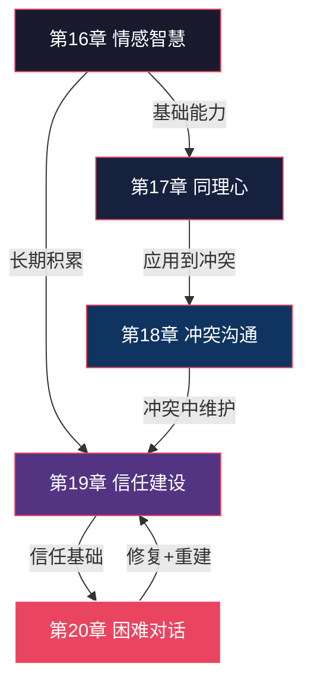
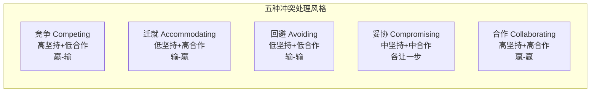
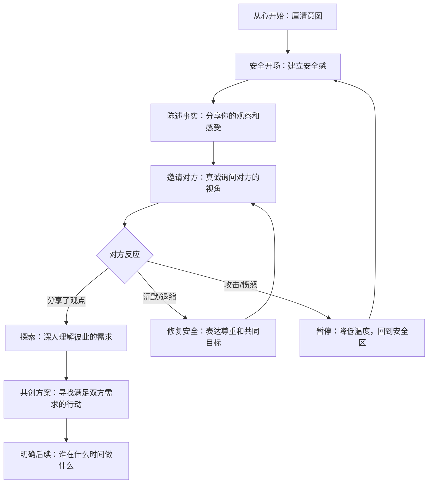
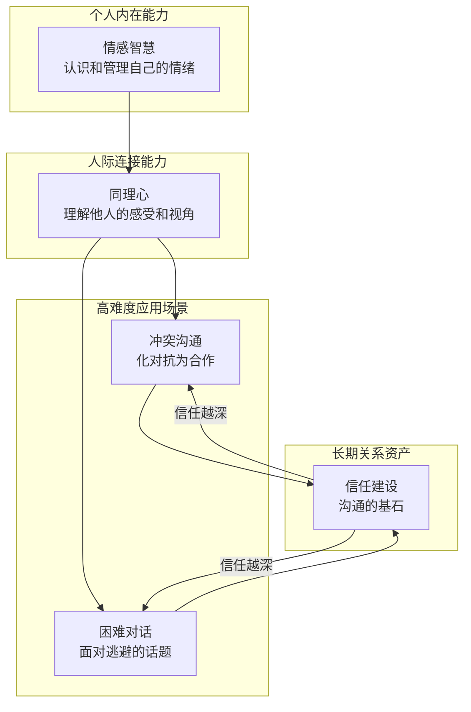

## 第四模块：情感与关系（第16-20章）

### 模块导言：为什么情感是沟通的核心引擎

很多人以为沟通是"把话说清楚"的技术活。这种理解只对了一半。说清楚只是信息层面，而真正驱动沟通效果的，是隐藏在信息之下的**情感暗流**。

哈佛大学一项持续75年的成人发展研究（Grant Study）得出了一个简单而深刻的结论：决定人生幸福与健康的最关键因素，不是财富、名望或成就，而是**亲密关系的质量**。而维系亲密关系的核心能力，正是本模块要探讨的五项：情感智慧、同理心、冲突处理、信任建设、困难对话。

这五章构成一个递进的能力体系：



**模块学习路线图**：先建立情感自我觉察（第16章），再向外拓展到理解他人（第17章），然后将这些能力用于最考验人的冲突场景（第18章），同时持续积累信任资本（第19章），最终面对那些你一直在逃避的困难对话（第20章）。

---

### 第16章：情感智慧在沟通中的应用——先处理心情，再处理事情

**核心观点**：没有情感连接的沟通，只是信息的搬运。

#### 为什么情感智慧是沟通的地基

丹尼尔·戈尔曼（Daniel Goleman）在1995年出版的《情商》中提出了革命性观点：一个人的成功中，智商的贡献只占20%，其余80%由情商决定。后续大量研究证实，在职场、婚姻、友谊等各类关系中，情商的预测力都显著高于智商。

戈尔曼将情感智慧拆解为四个维度，每个维度都直接影响沟通质量：

| 维度 | 定义 | 沟通中的表现 | 缺失时的后果 |
|------|------|-------------|-------------|
| **自我认知**（Self-Awareness） | 准确识别自己的情绪状态 | 知道自己在生气，所以暂停对话而不是口不择言 | 被情绪裹挟却不自知，说完伤人的话才后悔 |
| **自我管理**（Self-Regulation） | 调节和控制情绪反应 | 被误解时深呼吸，选择理性回应而非本能反击 | 情绪爆发，破坏关系，事后追悔 |
| **社会认知**（Social Awareness） | 读懂他人情绪和社交动态 | 从对方的沉默和语气中察觉不满，主动询问 | 对方已经在生气了你还在讲道理 |
| **关系管理**（Relationship Management） | 用情感信息引导互动 | 适时给予认可，在对方脆弱时提供支持 | 有好心但不会表达，关系越来越疏远 |

#### 情绪识别：沟通的第一课

你无法管理你不识别的情绪。情绪识别分为两条线：

**识别自己的情绪**——很多人对自己的情绪状态其实是模糊的。心理学家将其称为"情绪粒度"（Emotional Granularity）：你能区分"有点不高兴"和"非常愤怒"之间的细微差别吗？情绪粒度越高的人，越能精准地应对不同情境。

练习方法：建立"情绪日志"。每天记录三次——早上起床时、中午、睡前。记录格式：

```text
时间：[具体时间]
情绪：[用2-3个精确词汇描述，如"焦虑+烦躁"而非"不好"]
触发事件：[什么导致了这个情绪]
身体反应：[肩膀紧绷/心跳加速/胃不舒服]
强度：[1-10分]
```

坚持两周，你会发现自己对情绪的识别速度和精度显著提升。

**识别他人的情绪**——人类情绪表达有七种通用通道：面部表情、语音语调、肢体语言、用词选择、呼吸节奏、生理反应（如脸红）、行为模式（如突然沉默）。其中**语音语调**承载了约38%的情绪信息（Albert Mehrabian的研究），**面部表情**承载约55%，语言内容本身只占7%。

这意味着：当一个人说"我没事"时，如果他的语气低沉、目光回避，真实的信号来自语气和表情，而不是那三个字。

#### 情绪传染：你的情绪如何影响对方

神经科学发现了"镜像神经元"系统——当我们观察他人的情绪表达时，大脑会自动模拟同样的情绪状态。这就是情绪传染的生理基础。

在沟通中的实际影响：

- **正向传染**：你微笑，对方会不自觉地放松；你语气平和，对方的攻击性会降低
- **负向传染**：你焦虑，对方也会紧张；你愤怒，对方会防御或反击
- **领导者效应**：团队中情绪传染的方向是从高权力者向低权力者流动，领导者的情绪状态对团队氛围的影响是普通成员的3-5倍

#### 高情商沟通的五个关键时刻

| 时刻 | 典型场景 | 低情商反应 | 高情商做法 |
|------|---------|-----------|-----------|
| **被批评时** | 上司指出报告中的错误 | 辩解、反击、找借口 | "谢谢你指出，我确认一下具体问题，马上修正" |
| **被忽视时** | 会议中你的建议无人回应 | 沉默生闷气或提高音量强推 | 会后私下找关键决策者，用新角度重新表述 |
| **对方情绪激动时** | 同事因项目延期而发怒 | 讲道理："你不应该这么激动" | 先共情："我能理解你的压力，这个情况确实很棘手" |
| **需要说"不"时** | 朋友请求超出你能力范围的帮忙 | 勉强答应后心生怨恨 | 温和而坚定："我很想帮你，但这超出了我的能力范围，不过我可以..." |
| **对话陷入僵局时** | 谈判双方各执一词 | 重复自己的立场，越来越强硬 | 暂停争论，回到共同目标："我们都希望项目成功，看看有没有第三条路" |

#### 学习路径与实践计划

1. **第一周：建立觉察**——完成情商自评量表（推荐EQ-i 2.0或戈尔曼ECI量表的简化版），建立情绪日志
2. **第二周：练习识别**——每天在两次对话中有意识地观察对方的情绪信号，事后验证
3. **第三周：管理升级**——选择一个高情绪触发场景，提前准备情绪管理策略（如深呼吸、暂停、重新框定）
4. **第四周：综合应用**——在一次重要对话前做完整的情绪准备（识别自己的状态→预判对方的可能情绪→制定应对方案），对话后写反思日志

---

### 第17章：同理心沟通——站在对方的鞋子里

**核心观点**：同理心不是同意对方，而是理解对方为什么会那样想。

#### 同理心≠同情心：一个关键区分

很多人混淆同理心和同情心，导致沟通中产生反效果：

| | 同理心（Empathy） | 同情心（Sympathy） |
|---|---|---|
| **姿态** | 平等的，"我和你一起" | 居高临下的，"我为你感到难过" |
| **关注点** | 对方的感受和视角 | 自己对对方处境的判断 |
| **效果** | 对方感到被理解 | 对方感到被怜悯 |
| **典型表达** | "我能理解你现在有多失望" | "你真可怜，真替你感到遗憾" |
| **对方的体验** | "他懂我" | "他在可怜我" |

Brené Brown在她著名的TED演讲中用一个比喻精准描述了两者的区别：同情心是在洞口往下喊"你感觉怎么样？"然后建议"你应该试着往上爬"；同理心则是爬下洞口，坐在那个人旁边说"我知道在这里是什么感觉，我陪你"。

#### 认知同理心 vs 情感同理心

神经科学研究将同理心分为两种类型，它们在大脑中有不同的神经回路：

- **认知同理心**（Cognitive Empathy）：理解对方在想什么、为什么这样想。激活的是"心智化网络"（内侧前额叶、颞顶联合区）。这是沟通中最实用的——你不需要"感受"对方的痛苦，但你需要"理解"他的逻辑。

- **情感同理心**（Affective Empathy）：真正感受到对方的情绪。激活的是"镜像神经元系统"。这是亲密关系的基础，但如果过度使用会导致"同理心疲劳"（常见于医护人员、心理咨询师）。

- **同理心关怀**（Empathic Concern）：在理解的基础上产生帮助对方的意愿。这是同理心的最高层次，也是沟通中最理想的输出。

#### 同理心倾听四步法

大多数人倾听是为了回应，而不是为了理解。真正的同理心倾听需要刻意练习：

**第一步：暂停判断（Suspend Judgment）**
放下"他不应该这样想"的内心反驳。即使你100%不同意对方的观点，也先把"同意/不同意"的开关关掉。把注意力全部放在"理解"上。

**第二步：全身心在场（Full Presence）**
放下手机，关掉电脑屏幕，面向对方，保持眼神接触。研究表明，仅仅是放下手机这个动作，就能让对方对对话质量的评价提升40%。

**第三步：情感标注（Name the Emotion）**
用语言描述你观察到的对方情绪："听起来你对这件事很失望"、"我感觉到你现在有些焦虑"。心理学研究（UCLA的Matthew Lieberman团队）发现，仅仅是给情绪"命名"这个动作，就能让杏仁核的活跃度降低，帮助对方情绪平复。

**第四步：回声确认（Reflective Confirmation）**
用自己的话复述对方的核心意思和感受："如果我理解正确的话，你最担心的是团队不认可这个方案，同时你觉得自己付出了很多但没被看到。是这样吗？"这一步给对方一个修正的机会，确保你真正理解了。

#### 在冲突中保持同理心

同理心最容易在冲突中失效——因为当对方攻击你时，你的大脑会进入"战斗或逃跑"模式，同理心通道几乎关闭。以下策略帮助你在冲突中保持同理心：

1. **3秒规则**：在对方说完话后，默数3秒再回应。这3秒让你的前额叶皮层重新激活，恢复理性思考能力。
2. **翻译攻击**：把对方的攻击性语言"翻译"为背后的需求。"你从来都不听我说话！"→ 他的需求是"被认真倾听"。
3. **分离立场和人**：对方反对你的观点，不等于否定你这个人。在内心重复："他对这个方案有不同看法，他不是在针对我。"
4. **好奇取代防御**：用一个问题来替代辩护——"你能多说一些吗？我想更好地理解你的角度。"

#### 同理心的边界：避免同理心疲劳

同理心不是无限供给的资源。过度同理会导致：

- **情绪耗竭**：你为每个人的痛苦"买单"，最终自己精疲力竭
- **丧失立场**：你太理解对方了，以至于忘记了自己的需求
- **决策偏差**：情感过度卷入导致无法做出理性判断

健康的同理心有明确边界：我理解你的感受（认知层面），我在情感上与你同在（情感层面），但我不是你，我有自己独立的情绪和立场（自我保持）。

保护自己的具体方法：对话后给自己5分钟"情绪独处"时间；建立"情绪分隔仪式"（如洗手、换衣服）来标记从工作同理切换到个人生活的边界；定期进行不涉及他人情绪的自我关怀活动。

#### 学习路径与实践计划

1. **第一周：视角转换练习**——每天选择一个与你意见不同的人，花5分钟写下"如果我是他，我会怎么想？为什么？"
2. **第二周：同理心倾听**——在两次重要对话中完整实践四步法，对话后记录效果
3. **第三周：同理心回应**——在一次冲突或分歧中，刻意使用"翻译攻击"+"好奇取代防御"策略
4. **第四周：边界建设**——写一封"同理心信件"（不是真的寄出），练习在理解对方的同时保持自己的立场

---

### 第18章：冲突沟通——化对抗为合作

**核心观点**：冲突本身不是问题，处理冲突的方式才是。

#### 重新认识冲突：它不是敌人

大多数人将冲突视为需要避免的坏事。但组织行为学研究表明，适度的任务冲突（Task Conflict）反而能提升团队决策质量和创新能力——前提是冲突保持在"任务层面"而不是滑向"关系层面"。

| 冲突类型 | 内容 | 效果 | 处理方式 |
|---------|------|------|---------|
| **任务冲突** | 对工作内容、方案、方法的分歧 | 适度时有益，激发多元思考 | 鼓励表达，用数据和逻辑解决 |
| **关系冲突** | 对人的攻击、贬低、怨恨 | 始终有害，破坏信任和合作 | 必须立即干预，回到对事不对人 |
| **流程冲突** | 对谁做什么、怎么做、何时做的分歧 | 适度时有益，明确职责 | 用流程和制度解决 |

#### 托马斯-基尔曼冲突模型（TKI）

Kenneth Thomas和Ralph Kilmann提出的冲突处理模型是目前最广泛使用的框架，基于两个维度：**坚持性**（满足自己利益的程度）和**合作性**（满足对方利益的程度），组合出五种风格：



**五种风格详解**：

- **竞争（Competing）**：以牺牲对方利益为代价满足自己的需求。适合：紧急决策、涉及原则性问题、对方在利用你的善意。风险：损害关系，对方可能报复。

- **迁就（Accommodating）**：牺牲自己的需求来满足对方。适合：这件事对你不重要但对对方很重要、你想积累善意、你发现自己是错的。风险：被忽视，长期积累怨恨。

- **回避（Avoiding）**：既不坚持自己也不合作，选择退出冲突。适合：冲突微不足道、需要时间冷静、对方情绪过于激动无法理性对话。风险：问题恶化，错过解决时机。

- **妥协（Compromising）**：双方各让一步，找到中间地带。适合：双方势均力敌、需要临时解决方案、时间紧迫。风险：没有人完全满意，可能不是最优解。

- **合作（Collaborating）**：共同努力找到同时满足双方需求的方案。适合：双方关系重要、问题复杂需要多元视角、有充足的时间。风险：过程耗时，需要双方都愿意投入。

**关键洞察**：没有"最好的"风格——最有效的冲突处理者是能够灵活切换五种风格的人。你需要根据具体情境选择最合适的风格。

#### 非暴力沟通（NVC）四步法

马歇尔·卢森堡（Marshall Rosenberg）博士提出的非暴力沟通是冲突沟通中最实用的框架，全球范围内被广泛应用于调解、教育、家庭和职场：

**第一步：观察（Observation）——描述事实，不加评判**

- ❌ "你总是迟到"（"总是"是评判）
- ✅ "这周的三次会议，你分别迟到了10分钟、15分钟和5分钟"（具体事实）

**第二步：感受（Feeling）——表达你的真实感受，而非想法**

- ❌ "我觉得你不尊重我"（这是想法/判断，不是感受）
- ✅ "当你迟到时，我感到焦虑和不被重视"（真实感受）

**第三步：需要（Need）——说出感受背后的需求**

- ❌ "你让我很生气"（把感受归因于对方）
- ✅ "我需要被尊重和准时，这对我的工作效率很重要"（说出自己的需求）

**第四步：请求（Request）——提出具体、可执行的请求**

- ❌ "你能不能上点心？"（模糊，无法执行）
- ✅ "你能在会议开始前5分钟到吗？如果临时有事，能提前10分钟告诉我吗？"（具体、可执行、可验证）

**完整的NVC表达模板**：

```text
"当[观察到的事实]时，我感到[感受]，因为我需要[需求]。
你是否愿意[具体请求]？"
```

**实战示例**：

```text
"当我看到这份报告有三处数据错误（观察），
我感到担心（感受），
因为我需要确保我们提交给客户的方案是准确可靠的（需求）。
你能在今天下班前重新核对一遍数据吗？（请求）"
```

#### 冲突降级的语言技巧

当对话温度升高时，以下语言策略能快速降低对方的防御：

| 技巧 | 示例 | 原理 |
|------|------|------|
| **"同时"替代"但是"** | "你说的有道理，**同时**我有不同的看法" | "但是"否定了前面的肯定，"同时"保留了对方的观点 |
| **"我注意到"替代"你总是"** | "我注意到最近三次..." | 客观描述替代全称判断，减少对方的反驳冲动 |
| **"我们"替代"你"** | "我们怎么解决这个问题？" | 从对立变成同盟，强调共同目标 |
| **提问替代陈述** | "你觉得还有哪些因素需要考虑？" | 让对方从防御模式切换到思考模式 |
| **承认不确定性** | "我不确定自己的理解是否准确..." | 展示谦逊，降低对方的对抗心理 |

#### 将冲突转化为合作的契机

每一次冲突都包含着一个"合作的机会窗口"——只是被情绪和立场遮蔽了。找到这个窗口的方法：

1. **回到共同目标**："我们都希望项目按时上线，对吧？从这个目标出发，我们看看怎么走。"
2. **暴露利益而非立场**：立场是"我要周五交"，利益是"我需要留出时间做质量检查"。当双方都暴露利益时，解决方案往往比任何一方的立场都更优。
3. **引入第三选择**：不是A方案或B方案，而是"有没有一个C方案，能同时满足你的X需求和我的Y需求？"

#### 学习路径与实践计划

1. **第一周：风格诊断**——完成TKI测试，了解自己默认的冲突风格；回忆最近3次冲突，分析当时用的哪种风格
2. **第二周：NVC学习**——背诵四步法（观察→感受→需求→请求），在纸上练习3个场景的NVC表达
3. **第三周：降级练习**——在一次小冲突中刻意使用"同时替代但是"+"我们替代你"技巧，观察效果
4. **第四周：复盘总结**——回顾本月的一次真实冲突，分析：我用了什么风格？如果重来，我会怎么做？

---

### 第19章：信任的建立与修复——沟通的基石

**核心观点**：信任是沟通的货币。没有信任，再好的技巧也是空谈。

#### 信任的本质：它到底是什么

信任不是一个模糊的感觉，而是一个有明确构成要素的心理状态。当你信任一个人时，你的内心独白是：**"我相信你会做对我有益的事，即使在我不在场的时候。"**

信任的核心公式：

```text
信任 = (能力 + 正直 + 一致性 + 关怀) × 时间
```

这四个因素缺一不可：

| 因素 | 含义 | 日常体现 | 破坏信任的行为 |
|------|------|---------|--------------|
| **能力**（Competence） | 你是否有做好这件事的能力 | 专业可靠，说到做到 | 承诺超出能力范围的事，最终无法兑现 |
| **正直**（Integrity） | 你是否言行一致、诚实透明 | 不背后说人坏话，有错就认 | 双面人，对不同的人说不同的话 |
| **一致性**（Consistency） | 你的行为是否可预测 | 情绪稳定，标准统一 | 忽冷忽热，今天这样明天那样 |
| **关怀**（Care/Benevolence） | 你是否真的关心对方的利益 | 主动帮助，记住对方的需要 | 只在需要对方时才出现，利用关系 |

#### "信任账户"模型

史蒂芬·柯维在《高效能人士的七个习惯》中提出的"情感账户"（Emotional Bank Account）概念，是理解信任动态最直观的工具：

**信任存款行为**（存入）：
- 说到做到，兑现承诺（小承诺和大承诺同等重要）
- 主动关心对方的需求，而不只是在需要时才联络
- 在对方不在场时，仍然维护他的利益和声誉
- 诚实透明，主动分享可能影响对方的信息
- 在犯错时主动承认并承担责任
- 记住对方分享过的个人细节，并在后续交流中体现

**信任取款行为**（取出）：
- 失约、迟到、食言
- 在背后议论对方
- 隐瞒重要信息
- 只顾自己的利益
- 不尊重对方的边界
- 对方的脆弱分享被当作把柄或笑料

**关键比例**：心理学研究发现，信任关系需要大约**5:1的正负比**——5次正面互动才能抵消1次负面互动的伤害。这就是为什么信任建立需要很长时间，却可以在一瞬间崩塌。

#### 建立信任的日常行为清单

不要等大事来考验信任——信任是在日常小事中一点一滴积累的：

**基础层（每天做）**：
- 准时赴约（迟到是最低成本的取款行为）
- 回复消息不拖延（即使是"收到了，明天回复你详细内容"）
- 承诺之前先评估能力，不确定就说"我试试"而非"没问题"

**进阶层（每周做）**：
- 主动分享一个可能对对方有用的信息
- 在第三方场合中正面提及对方
- 问一个对方上次提过的个人事情的后续（"上次说的面试怎么样了？"）

**高阶层（长期坚持）**：
- 在利益冲突时，优先考虑关系而非短期收益
- 在对方脆弱时提供支持，即使这对你没有直接好处
- 对自己的错误和不足保持透明

#### 信任破裂后的修复五步法

信任破裂并不意味着关系终结。研究表明，经过妥善修复的信任关系，有时比从未经历过考验的关系更加牢固——前提是修复过程真诚且彻底。

**第一步：承认伤害（Acknowledge）**
不要淡化、不要找借口、不要说"我不是故意的所以你不应该这么受伤"。直面事实："我做了X，这伤害了你。我理解你为什么会感到Y。"

**第二步：承担责任（Take Responsibility）**
完全属于自己的责任部分：毫无保留地承担。不推卸，不转移，不说"但是你也有责任"。

**第三步：表达真诚的悔意（Express Remorse）**
"对不起"三个字的力量取决于它背后的真诚。不是"我很抱歉你这么觉得"（这在暗示问题出在对方的感受上），而是"我为我的行为感到抱歉，我做得不对"。

**第四步：提出修复方案（Make Amends）**
空洞的道歉不如具体的行动。"我怎么做能弥补？" 或者主动提出一个具体的修复方案——如果迟到伤害了对方，未来两周每天提前10分钟到达。

**第五步：用时间和行动重建（Rebuild Through Consistency）**
修复不是一次对话能完成的。它需要在之后很长一段时间里，用持续一致的可靠行为来证明改变是真实的。这个过程可能需要数月甚至数年，取决于伤害的严重程度。

**重要提醒**：修复信任需要对方的配合。如果对方还没有准备好，尊重他的节奏，不要强迫。你只能控制自己的行为，不能控制对方的原谅速度。

#### 在组织中建立信任文化

信任不仅是个人关系的事，也是组织效能的基石。Google的Project Aristotle研究发现，高效团队最重要的特征就是**心理安全感**——而心理安全感的核心就是信任。

组织信任建设的关键杠杆：

- **透明沟通**：决策过程公开，信息不对称最小化
- **容错文化**：犯错不会被惩罚（故意犯错除外），而是被视为学习机会
- **一致性标准**：规则对所有人一视同仁，没有特权和例外
- **领导示范**：领导者首先展示脆弱性，承认自己的错误和不足

#### 学习路径与实践计划

1. **第一周：信任审计**——评估你在三个最重要关系中的信任水平（1-10分），找出最大的"取款行为"
2. **第二周：存款行动**——每天至少做3次信任存款行为，记录对方的反应
3. **第三周：修复计划**——如果某段关系中信任已经受损，写下五步法中每一步的具体行动计划
4. **第四周：文化影响**——在团队中推动一项信任建设举措（如每周分享一个"失败教训"）

---

### 第20章：困难对话——面对你一直逃避的话题

**核心观点**：逃避困难对话不会让问题消失，只会让它恶化。

#### 为什么我们逃避困难对话

困难对话之所以困难，不是因为它技术上复杂，而是因为它触碰了我们最深层的恐惧：

- **被拒绝的恐惧**："如果我提加薪被拒怎么办？"
- **关系破裂的恐惧**："如果我说了真话，我们的关系就完了"
- **冲突升级的恐惧**："如果对方情绪爆发，场面不可收拾怎么办"
- **自我暴露的恐惧**："如果我说出真实想法，对方会怎么看我"

心理学家Susan Scott在《Fierce Conversations》中写道："你不愿意面对的对话，恰恰是你最需要进行的对话。你和这个话题之间的距离，就是你和真实的自己之间的距离。"

逃避的代价是累积的：压抑的不满像滚雪球，最初的小问题逐渐变成不可调和的大裂痕。研究表明，伴侣之间未表达的不满，是离婚的最强预测因子之一——比争吵本身更强。

#### 困难对话的心理准备三步法

**第一步：厘清你的意图（Clarify Your Intent）**

在进入对话之前，问自己三个问题：
- 我真正想要的结果是什么？（不是"我要让他认错"，而是"我希望我们找到一个双方都能接受的方案"）
- 如果这次对话完美成功，我们的关系会是什么样子？
- 我是否愿意倾听对方的视角？

如果你的意图是"证明我是对的"或"让对方不舒服"，先停下来调整。带着攻击性意图的困难对话，几乎一定会以伤害关系收场。

**第二步：预演最坏情况（Rehearse the Worst Case）**

想象对话可能走向最糟糕的方向——对方大怒、对方拒绝沟通、对方哭泣。然后提前想好你的应对方案。研究表明，仅仅是"预先想象"这个动作，就能显著降低实际面对时的焦虑水平。

**第三步：选定时机和场景（Choose the Right Setting）**

- ❌ 不要在公共场合、对方压力大的时刻、走廊里随口说
- ✅ 选择私密空间、双方都有充足时间、情绪相对平稳的时刻
- 开场白可以是："有一件事我想和你聊聊，不是什么坏事，但我觉得对我们很重要。你今天下午有20分钟吗？"

#### 对话开场的黄金法则

困难对话的前60秒决定了整个对话的走向。一个糟糕的开场几乎无法在后续挽回。

**有效的开场公式**：

```text
"我想和你聊[话题]，因为[你的正面意图]。
我注意到[具体事实]，这让我感到[感受]。
我很想听听你的看法。"
```

**对比示例**：

| 场景 | ❌ 糟糕的开场 | ✅ 有效的开场 |
|------|-------------|-------------|
| 加薪 | "我觉得我的工资太低了，别人干一样的活拿得比我多" | "我想聊聊我的薪酬。我很看重在这里的发展，同时也注意到市场同岗位的薪资水平有一些变化，想和你讨论一下" |
| 伴侣的坏习惯 | "你又把袜子扔在地上了，你到底有没有想过我的感受？" | "我想聊聊家务的事。我知道这不是什么大事，但日积月累它确实让我有些困扰，我希望我们能找到一个都舒服的方式" |
| 同事的配合问题 | "你上次的报告交得太晚了，差点害整个项目延期" | "上次报告的时间安排确实带来了一些压力。我想聊聊我们的协作方式，看看怎么能让流程更顺畅" |

#### "关键对话"框架

Kerry Patterson等人在《Crucial Conversations》中提出的框架是目前最成熟的困难对话方法论：

**核心原则：在对话中保持"安全区"**

当对方感到安全时，他们会敞开心扉。当感到不安全时，他们会沉默或攻击。你需要持续监测两个安全信号：

- **相互尊重**（Mutual Respect）：对方是否感到被尊重？
- **共同目标**（Mutual Purpose）：对方是否相信你和他有共同的目标？

当任何一个信号亮红灯时，立即暂停内容讨论，先修复安全感。

**修复安全感的三句话**：
1. "我可能表达得不够好，让我重新说一下"（当对方误解了你的意图时）
2. "我非常重视我们的关系/合作，这一点不会因为这次对话而改变"（当对方感到被威胁时）
3. "我很想听听你的看法，我可能遗漏了重要的信息"（当对方感到不被尊重时）

**关键对话的完整流程**：



#### 如何在对话中保持立场而不伤害关系

很多人在困难对话中陷入两难：要么忍着不说（保护关系但牺牲自己），要么说了但伤了关系（表达自己但伤害关系）。其实存在第三条路——**温和而坚定**（Assertive Communication）。

温和而坚定的核心公式：

```text
"我理解[对方的立场/感受]，同时[你的立场/需求]。
我相信我们能找到[一个对双方都好的方案]。"
```

具体技巧：
- **用"我"开头而非"你"开头**："我感到压力很大"而非"你给我太大压力了"
- **描述影响而非评价人格**："这个决定导致团队加班了一周"而非"你做的决定很自私"
- **保持开放而非封闭**："你怎么看？"而非"你应该同意这一点吧？"
- **对事不对人**：讨论行为，而不是给对方贴标签

#### 对话后的跟进与关系维护

困难对话不是一次事件，而是一个过程。对话结束后的48小时非常关键：

1. **当天**：给自己时间消化。如果对话顺利，写一个简短的感谢（"谢谢你今天和我坦诚地聊了这些"）。如果有未解决的问题，记录下来。
2. **第二天**：执行你在对话中承诺的行动。如果你答应了什么，立刻开始做——这是最有力的信任信号。
3. **一周后**：找一个自然的机会做一个简短的后续跟进："上次聊过之后，你觉得我们新的方式怎么样？"
4. **长期**：观察和评估——这次对话是否真的改变了什么？如果没有，可能需要更深层的对话。

#### 学习路径与实践计划

1. **第一周：清单与排序**——列出你一直在逃避的三个对话，按照"影响程度×关系重要性"排序，选择得分最高的开始准备
2. **第二周：准备与预演**——用"困难对话准备清单"（意图→开场→可能反应→应对方案）准备第一个对话，找信任的人做角色扮演
3. **第三周：实践**——进行第一个困难对话。重点不在于完美，而在于你迈出了这一步
4. **第四周：复盘与迭代**——回顾对话过程和结果，总结经验教训，准备下一个

---

### 模块总结：情感与关系的沟通全景图



**五章核心要点速览**：

| 章节 | 一句话核心 | 最重要的工具 |
|------|----------|------------|
| 第16章 情感智慧 | 先处理心情，再处理事情 | 情绪日志 + 四维度自评 |
| 第17章 同理心 | 理解对方为什么那样想 | 同理心倾听四步法 |
| 第18章 冲突沟通 | 冲突是合作的入口 | 非暴力沟通四步法 |
| 第19章 信任建设 | 信任 = 能力+正直+一致性+关怀 | 信任账户存款清单 |
| 第20章 困难对话 | 逃避不会让问题消失 | 关键对话框架 |

**学完本模块后，你应该能够**：

1. 准确识别自己和他人的情绪状态，并在沟通中有效管理情绪
2. 在分歧和冲突中保持同理心，真正理解对方的立场和需求
3. 使用非暴力沟通和冲突处理模型，将对抗转化为合作
4. 有意识地在重要关系中积累信任资本，并在信任受损时进行修复
5. 主动面对那些一直在逃避的困难对话，温和而坚定地表达自己

这五项能力不是孤立的技能，而是一个有机的整体。它们相互支撑、相互强化：情感智慧让你能准确识别信号，同理心让你能理解信号背后的含义，冲突沟通让你能在高压场景中运用这些能力，信任建设让你的努力能产生长期回报，困难对话让你敢于面对最需要沟通的时刻。

掌握这五章内容，你将拥有大多数人一辈子都没有系统学习过的——**关系沟通的完整能力体系**。
