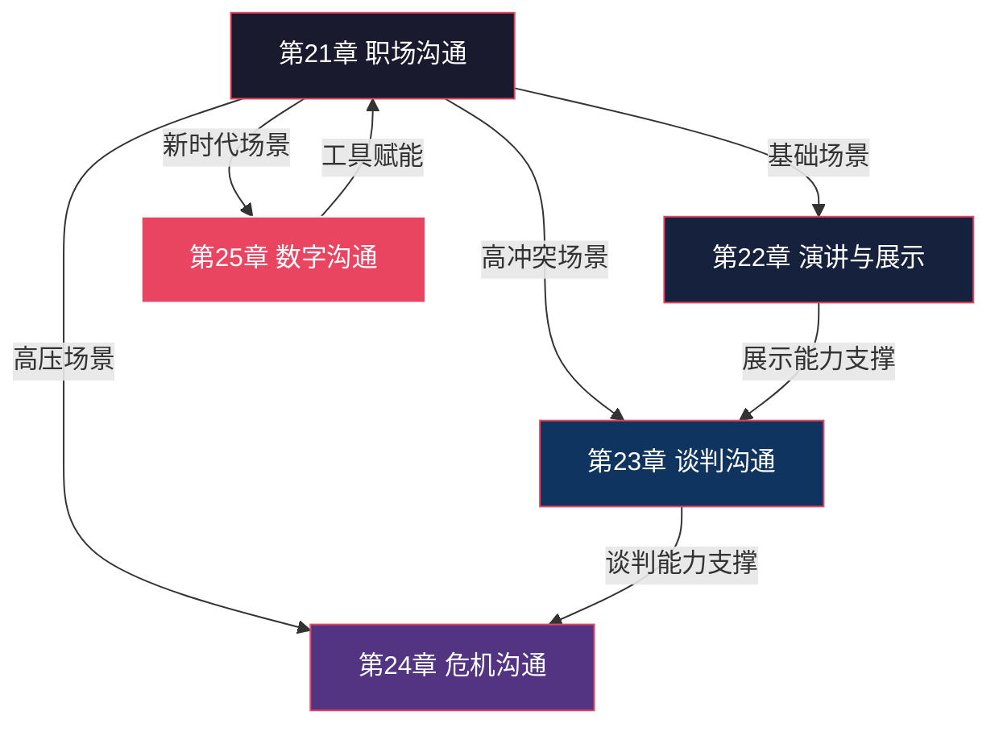
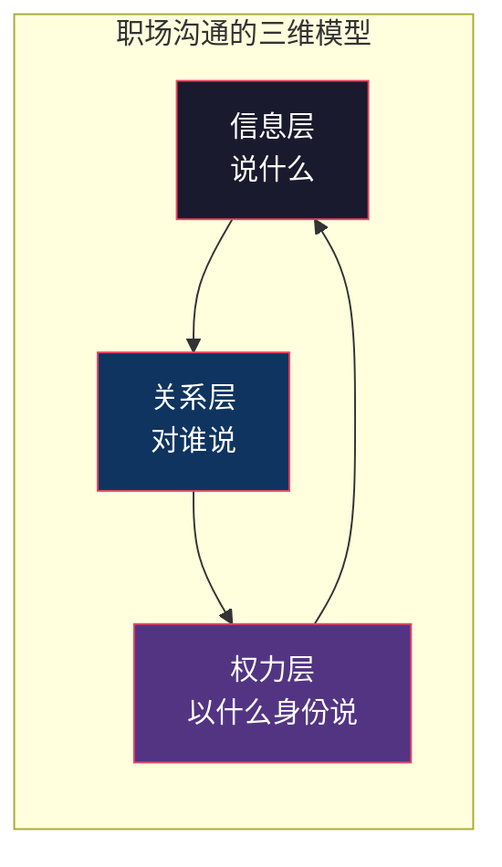
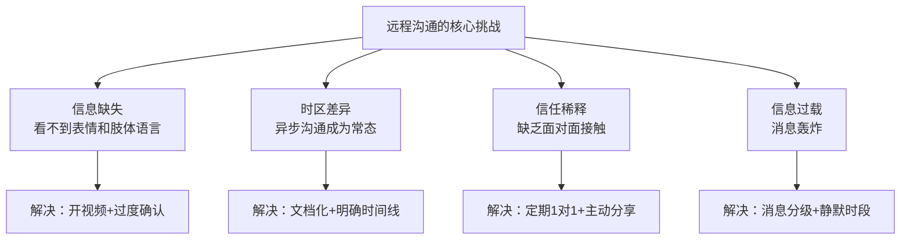
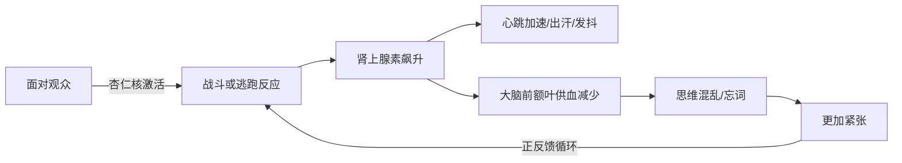
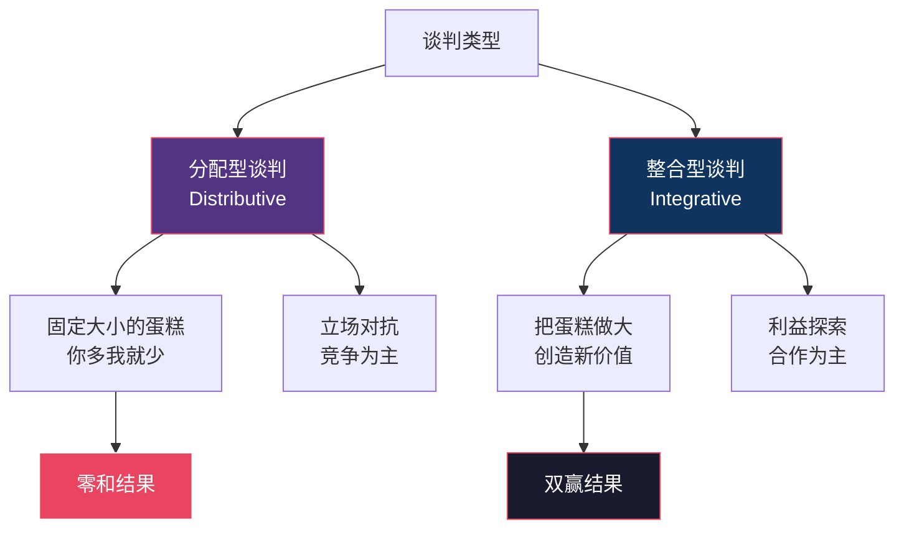
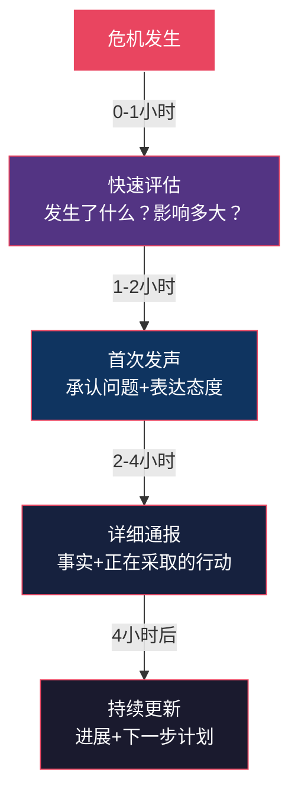
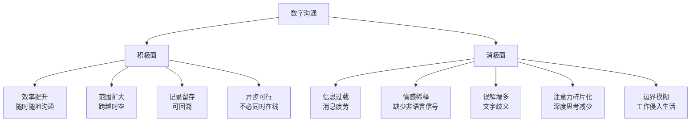
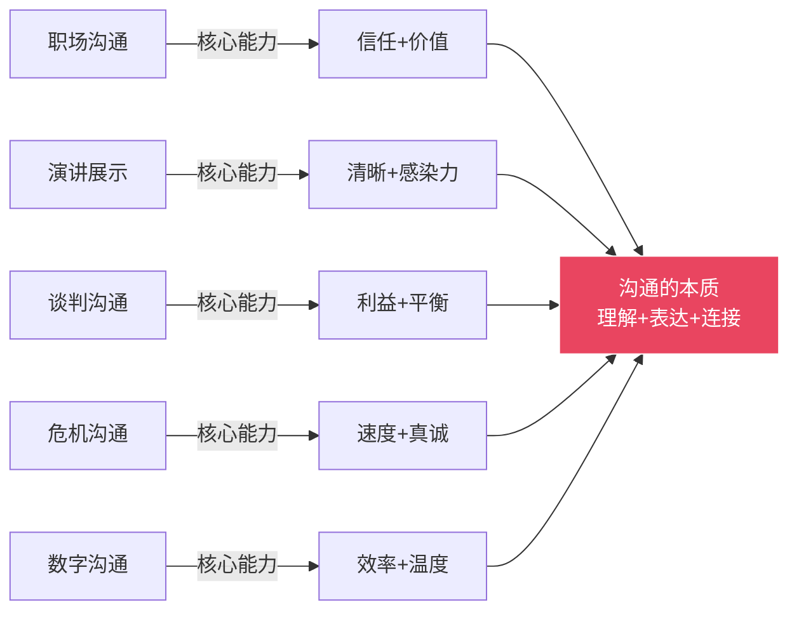

## 第五模块：场景与应用（第21-25章）

### 模块导言：从通用能力到场景实战

前四个模块帮你建立了沟通的基础能力——倾听、表达、情感智慧、信任建设。但现实世界的沟通从来不是在真空中发生的。你在会议室里向上司汇报项目延期的消息，和你在家客厅里跟伴侣讨论周末计划，用的底层能力相同，但策略、话术、风险完全不同。

**本模块的核心理念：沟通能力必须在具体场景中才能真正内化。** 这就像学游泳——你可以在岸上学会所有动作要领，但只有跳进水里，肌肉记忆才会真正形成。

这五章覆盖了人生中最具挑战性的五大沟通场景：



**模块学习策略**：这五章的学习顺序建议按照难度递进——先掌握最日常的职场沟通（第21章），再攻克需要勇气的公开演讲（第22章），然后进入高压力的谈判（第23章）和危机场景（第24章），最后用数字时代的新工具武装自己（第25章）。每章的学习路径都设计了从"知道"到"做到"的完整阶梯。

---

### 第21章：职场沟通——向上、向下、横向的全方位策略

**核心观点**：职场沟通的本质是建立信任、传递价值和推动协作。

#### 为什么职场沟通是所有场景中最复杂的

职场是最复杂的沟通场景之一。你需要与不同层级、不同职能、不同性格的人打交道，而且每一层关系都有不同的沟通规则和期望。更重要的是，职场沟通不仅仅是"把话说清楚"——它同时涉及权力关系、利益分配、职业发展和组织政治。

哈佛商学院的研究表明，一个管理者平均花75%-80%的工作时间在沟通上——开会、写邮件、一对一谈话、跨部门协调。而在这些沟通中，导致问题的往往不是信息传递的错误，而是**关系层面的失误**：没有照顾到对方的情绪、忽视了对方的利益诉求、在不合适的时机说了不合适的话。



**职场沟通的独特属性**：

| 维度 | 日常社交 | 职场沟通 |
|------|---------|---------|
| **目的** | 情感连接为主 | 目标导向，需要产出结果 |
| **关系** | 自由选择 | 被组织结构绑定，不能选择同事 |
| **权力** | 相对平等 | 存在明确的上下级关系 |
| **后果** | 沟通失败损失有限 | 直接影响职业发展和收入 |
| **频率** | 按需进行 | 每天持续进行，无法逃避 |
| **记录** | 通常不记录 | 邮件、会议纪要都留痕 |

#### 向上沟通：如何与上司建立高效的工作关系

向上沟通是职场中最高频也最容易出错的场景。很多人要么过度顺从（"老板说的就是对的"），要么过度对抗（"我不同意就得说出来"），两者都会损害你的职业发展。

**向上沟通的核心原则**：

**1. 理解上司的沟通偏好**

每个上司都有自己的信息接收偏好。有人喜欢数据和细节，有人只要结论和关键点；有人偏好邮件（留痕），有人喜欢面对面（高效）。你的第一件事是观察和适应，而不是让上司适应你。

诊断方法：观察上司回答你问题时的模式——如果他总是追问"具体数字是多少"，说明他是数据导向型；如果他说"直接告诉我结论"，说明他是结果导向型；如果他问"你跟相关人沟通了吗"，说明他重视关系和共识。

**2. 带着方案汇报问题**

这是向上沟通中最经典的黄金法则。没有人喜欢只听到坏消息。当你向上司汇报问题时，必须同时准备：

```text
标准汇报模板：
━━━━━━━━━━━━━━━━━━━━━━━━━━━━━━
1. 问题概述（1-2句话说清是什么问题）
2. 影响评估（这个问题会导致什么后果，量化）
3. 根因分析（为什么会发生，1-3个核心原因）
4. 解决方案（2-3个选项，含利弊分析）
5. 你的建议（推荐哪个方案，为什么）
6. 需要的支持（你需要上司做什么决定或提供什么资源）
━━━━━━━━━━━━━━━━━━━━━━━━━━━━━━
```

**3. 管理上司的预期**

很多人在接到任务时不敢说"不"或不敢提出困难，结果到了截止日期才暴露问题，这是最伤害信任的行为。正确的做法是在任务开始时就明确预期：

- 如果你觉得时间不够：**当时就说**。"这个项目我评估需要10天，如果要压缩到5天，可能需要牺牲X部分的质量，你觉得可以接受吗？"
- 如果资源不足：**提前说**。"要达到这个目标，我需要Y的支持，否则只能做到Z的水平。"
- 如果发现风险：**预警说**。"目前一切正常，但我注意到一个潜在风险，想提前和你确认一下应对方案。"

**4. 向上反馈的艺术**

给上司提意见是最敏感的向上沟通场景。核心原则是：**在私下场合、以建设性的方式、聚焦于事情而非人**。

| 场景 | ❌ 错误方式 | ✅ 正确方式 |
|------|-----------|-----------|
| 上司的决策有问题 | "这个方案根本行不通" | "这个方案有一个风险我想提一下，如果X发生，我们可能面临Y，有没有备选方案？" |
| 上司对你不公平 | "你总是把最难的活给我" | "我想和你聊聊工作分配。我注意到最近几个高难度项目都交给了我，我想确认一下这是对我能力的信任，还是分配上需要调整？" |
| 上司的管理风格有问题 | "你管得太细了，让人喘不过气" | "我很感谢你的指导。如果可以的话，我希望在一些常规任务上能有更多的自主空间，遇到关键决策再来找你确认，这样效率可能更高" |

#### 向下沟通：如何激励和指导下属

向下沟通的核心挑战是：你既要推动工作完成，又要维护团队成员的积极性和成长空间。很多新晋管理者犯的最大错误是把自己当成"信息传递者"——把上司的话原封不动地传给下属，把下属的问题原封不动地传给上司。

**向下沟通的四大支柱**：

**1. 清晰的目标传达**

每次布置任务时，确保对方理解五个要素：

```text
任务传达五要素（5W框架）：
━━━━━━━━━━━━━━━━━━━━━━━━━━━━━━
What：具体要做什么（产出物是什么）
Why：为什么做这件事（它对团队/公司/客户的价值）
When：什么时候完成（明确截止日期+中间检查点）
Who：谁负责（主要负责人+协作者+审批人）
How：怎么做（关键要求、质量标准、可参考的范例）
━━━━━━━━━━━━━━━━━━━━━━━━━━━━━━
```

布置完任务后，最有价值的一步是让对方**用自己的话复述**一遍。你可能会惊讶地发现，你以为说清楚了的事情，对方理解的完全是另一回事。

**2. 有效的反馈机制**

反馈是向下沟通中最被低估的工具。盖洛普的研究发现，员工离职的首要原因不是薪酬，而是"得不到足够的反馈和认可"。

**SBI反馈模型**（Situation-Behavior-Impact）：

```text
Situation（情境）："在昨天的客户会议上..."
Behavior（行为）："当客户提出质疑时，你没有直接反驳，而是先认可了客户的担忧，然后用数据来解释..."
Impact（影响）："这让客户的态度从对抗变成了合作，最终顺利签下了合同。这个处理方式非常专业，继续保持。"
```

正面反馈和改进反馈都用同一个框架，区别在于Impact部分：

```text
改进反馈示例：
Situation："在这周的三次团队会议上..."
Behavior："你多次打断了同事的发言，并且在别人讲到一半时就开始提出反对意见..."
Impact："这导致两个同事在后半段会议中完全不说话了，我们因此错过了他们的想法。下次可以先把想法记下来，等对方说完再提问。"
```

**3. 一对一沟通的正确打开方式**

定期的一对一是向下沟通中最高价值的投资。最佳频率是每两周一次，每次30分钟。

高效一对一的结构：
- 前5分钟：问"你最近状态怎么样？有什么需要我帮忙的？"——关注人，而不是任务
- 中间15分钟：讨论当前项目进展、遇到的障碍、需要的资源
- 最后10分钟：讨论职业发展、学习计划、下一步目标

**关键提示**：一对一的主角是下属，不是你。你的角色是倾听、提问和支持，而不是训话和布置任务。

**4. 授权与信任**

向下沟通的终极目标不是让下属执行你的指令，而是让他们具备独立判断和决策的能力。授权的层次：

| 层次 | 描述 | 适用对象 | 沟通方式 |
|------|------|---------|---------|
| **指令式** | 告诉他具体怎么做 | 新人、第一次做这类任务 | "先做A，再做B，遇到C情况来找我" |
| **教练式** | 引导他思考怎么做 | 有一些经验的人 | "你觉得应该怎么处理？为什么？" |
| **支持式** | 鼓励他自己决定 | 经验较丰富的人 | "我相信你的判断，需要支持随时找我" |
| **授权式** | 完全放手 | 高度成熟的下属 | "交给你了，有结果告诉我" |

#### 横向沟通：与同事建立协作关系

横向沟通的难点在于：你们之间没有权力关系，你不能命令对方配合你，但你需要他的支持才能完成工作。

**横向沟通的三大策略**：

**1. 利益交换思维**

不要从"我需要你做什么"开始，而是从"我能为你提供什么"开始。在请求协作之前，先想清楚：

- 这件事对对方有什么好处？
- 对方当前的工作重点是什么？你的请求是否与他的目标相关？
- 你能为对方提供什么回报（信息、资源、帮助、曝光机会）？

**示例**：
```text
❌ "我需要你这周帮我出一份数据分析报告"
✅ "我这边有个项目如果做好了，对你们部门的KPI也有帮助。
    需要你帮忙做一份数据分析，作为回报，我在季度汇报中
    会提到你们团队的贡献。你觉得怎么样？"
```

**2. 非正式关系建设**

最有效的横向沟通发生在正式会议之外。建立"关系资本"的方法：
- 午餐时主动坐到不同部门同事旁边
- 在内部IM上分享一条对对方有用的信息
- 当对方部门的工作被高层认可时，发一条祝贺消息
- 在自己部门的会议上，提到其他部门的支持和贡献

**3. 跨部门冲突的化解**

跨部门冲突的根源通常是：目标不一致、资源竞争、流程不清。化解方法：

- **回到共同目标**："我们两个部门的最终目标都是让客户满意，从这个出发点来看，怎么分工对客户最有利？"
- **用数据说话**：不要争论"谁对谁错"，而是用客观数据来评估不同方案的效果
- **引入第三方**：当双方僵持不下时，找一个双方都信任的上级或同事来仲裁
- **建立流程**：把反复出现的跨部门问题变成标准化的协作流程，减少每次都要谈判的成本

#### 远程/混合办公时代的沟通新规则

疫情后的办公模式变革给职场沟通带来了全新的挑战：



**远程沟通的具体规则**：

| 规则 | 说明 | 示例 |
|------|------|------|
| **异步优先** | 不紧急的事用文字沟通，留出深度工作时间 | 把"能聊聊吗？"改成"关于XX项目，我有一个问题想确认，具体内容是..." |
| **过度确认** | 远程环境下，你以为说清楚了，对方可能完全理解偏了 | 每次沟通后用文字总结"我们的结论是...，各自的任务是..." |
| **摄像头纪律** | 重要会议开摄像头，传递专注和尊重 | 不是所有会议都要开，但1对1、客户会、方案讨论一定开 |
| **文档即沟通** | 重要的讨论和决定必须有文字记录 | 会议结束5分钟内发出纪要，邮件确认关键决策 |
| **社交空间** | 刻意创造非正式交流的机会 | 周五下午15分钟的"闲聊会"，不聊工作 |

#### 学习路径与实践计划

1. **第一周：绘制你的"职场沟通地图"**——列出你最重要的5个职场关系（上司、下属、同事、跨部门合作者、客户），评估每段关系的沟通质量（1-10分），找出最需要改善的一段
2. **第二周：向上沟通实验**——下次汇报工作时，使用"带方案汇报"模板，观察上司的反应变化
3. **第三周：一对一升级**——如果你还没有定期一对一，本周开始安排；如果已有，尝试把"任务汇报"的比例降到50%以下，增加"人"的关注
4. **第四周：跨部门关系投资**——主动为一个跨部门同事提供一次帮助（不需要对方请求），观察这段关系的变化

---

### 第22章：演讲与展示——在众人面前自信表达

**核心观点**：演讲不是表演，而是一对多的高效沟通。

#### 演讲焦虑：你的身体在保护你

很多人害怕公开演讲——事实上，各种调查显示，公众演讲恐惧在人类恐惧排行榜中常年位居前三，甚至超过对死亡的恐惧。这不是你的缺陷，而是进化留给我们的本能。

**为什么你会紧张**：当你站在一群人面前时，你的大脑把"所有人盯着你"解读为"被群体审判"的威胁信号。杏仁核（大脑的警报器）被激活，触发"战斗或逃跑"反应：肾上腺素飙升、心跳加速、手心出汗、大脑一片空白。



**破解紧张的科学方法**：

| 方法 | 原理 | 具体操作 |
|------|------|---------|
| **认知重构** | 改变对紧张的解读 | 不要告诉自己"别紧张"（这会让大脑更关注紧张），而是告诉自己"我的身体正在给我能量，准备帮助我表现得更好" |
| **呼吸控制** | 激活副交感神经系统 | 4-7-8呼吸法：吸气4秒，屏住7秒，呼气8秒。上台前做3轮 |
| **身体预热** | 消耗多余的肾上腺素 | 上台前找个没人的地方做30秒的快速开合跳或深蹲 |
| **暴露训练** | 降低对观众注视的敏感度 | 从对着镜子讲→录视频→对1个朋友讲→对5个人讲→对20个人讲 |
| **充分准备** | 确定性降低焦虑 | 准备到"即使忘词也能接下去"的程度——不是背稿，而是对每个要点有3种表达方式 |

**关键洞察**：你不需要消除紧张，你只需要让紧张降到"可控"的水平。适度的紧张实际上能提升表现——它让你保持警觉、精力充沛。世界级的演讲者上台前也会紧张，他们的秘诀不是"不紧张"，而是"紧张但依然能做好"。

#### 演讲内容设计：从"我想说什么"到"他们需要听什么"

大多数人的演讲设计思路是错误的——他们从"我要讲什么"出发，罗列自己知道的所有内容。好的演讲设计从三个问题出发：

```text
演讲设计的黄金三角：
━━━━━━━━━━━━━━━━━━━━━━━━━━━━━━
1. 听众是谁？（知识水平、关注点、痛点、期望）
2. 我想让他们做什么？（具体的行为改变）
3. 他们为什么应该在乎？（与他们的利益有什么关系）
━━━━━━━━━━━━━━━━━━━━━━━━━━━━━━
```

**"黄金圈"法则（Simon Sinek）**：你的演讲内容应该从内到外组织——先说"为什么"（Why），再说"怎么做"（How），最后说"是什么"（What）。大多数人反过来——先说"是什么"，导致听众一开始就失去了兴趣。

| 层次 | 含义 | 示例（产品发布演讲） |
|------|------|-------------------|
| **Why** | 为什么这件事重要 | "我们发现80%的用户每天花2小时在信息搜索上，却仍然找不到需要的答案" |
| **How** | 我们怎么解决这个问题 | "我们用AI技术构建了智能问答系统，能在3秒内给出精准回答" |
| **What** | 具体是什么产品/方案 | "这就是我们的新产品——智能助手3.0" |

**演讲结构的七种经典模板**：

**模板一：问题-方案-收益**
适合：产品介绍、方案汇报、变革倡议

```text
1. 开场：描述一个听众都经历过的痛点（引发共鸣）
2. 分析：为什么这个问题一直没被解决（建立认知）
3. 方案：介绍你的解决方案（核心内容）
4. 收益：听众采纳方案后会获得什么（动力推动）
5. 行动：你现在就可以做的第一步（降低行动门槛）
```

**模板二：时间线结构**
适合：项目汇报、公司战略、个人故事

```text
过去 → 我们从哪里来（背景和问题）
现在 → 我们在哪里（当前状态和挑战）
未来 → 我们要到哪里去（愿景和路径）
```

**模板三：三点法**
适合：任何需要让听众记住关键信息的场合

```text
人的短期记忆容量是7±2个项目（Miller's Law），
但为了安全起见，把核心信息控制在3个以内。
"今天的分享有三个核心要点：第一...第二...第三..."
```

**模板四：PREP结构**
适合：即兴演讲、会议发言、快速说服

```text
P - Point（观点）："我认为我们应该选择方案A"
R - Reason（原因）："因为它在成本和效率上都有明显优势"
E - Example（例子）："上次B团队用类似方案，成本降低了30%"
P - Point（重申观点）："所以我建议我们选择方案A"
```

**模板五：STAR结构**
适合：案例分享、面试回答、复盘汇报

```text
S - Situation（情境）："去年Q3，我们的客户流失率达到了15%"
T - Task（任务）："我负责制定一个客户留存方案"
A - Action（行动）："我做了三件事：客户分层、个性化关怀、流失预警机制"
R - Result（结果）："Q4流失率降到了5%，挽回了200万收入"
```

**模板六：故事弧结构**
适合：激励演讲、文化建设、价值观传递

```text
英雄（听众认同的角色）→ 遇到挑战 → 挣扎和尝试 
→ 关键转折（你的洞察/产品/方案）→ 克服挑战 → 新的开始
```

**模板七：对比结构**
适合：方案对比、变革倡导、打破认知

```text
"想象一下两种场景：
场景A（现状）：你每天花3小时处理邮件...
场景B（未来）：AI帮你自动分类和回复，你只需要15分钟..."
```

#### 开场和结尾：决定演讲成败的两分钟

**开场的七种经典方式**：

| 方式 | 描述 | 适用场景 | 示例 |
|------|------|---------|------|
| **悬念开场** | 抛出一个令人意外的事实或问题 | 数据型、研究型演讲 | "你知道吗？你今天做的一个决定，会在5年后改变你的人生轨迹" |
| **故事开场** | 讲一个简短的故事 | 任何类型的演讲 | "三年前的今天，我站在和你们一样的位置，手里拿着一份被拒绝了12次的商业计划书..." |
| **提问开场** | 向听众提一个让他们思考的问题 | 互动型演讲 | "请举手——有多少人今天早上是带着焦虑来上班的？" |
| **引用开场** | 引用一句有力量的名言 | 正式场合、主题演讲 | "丘吉尔说过：你能看到多远的过去，就能看到多远的未来" |
| **震撼开场** | 用一个惊人的数据或事实 | 数据型、问题导向型演讲 | "在接下来我说话的60秒里，全球会有XX吨碳排放进入大气" |
| **幽默开场** | 用一个得体的笑话或自嘲 | 轻松场合、破冰 | "我今天的演讲有三个要点——第一个是，永远不要在午餐后第一个演讲" |
| **场景开场** | 描绘一个具体的场景 | 愿景型、变革型演讲 | "想象一下：2030年的早晨，你走进办公室，AI助手已经帮你完成了80%的重复工作..." |

**结尾的七种经典方式**：

| 方式 | 描述 | 效果 |
|------|------|------|
| **总结回顾** | 重述三个核心要点 | 强化记忆 |
| **行动号召** | 明确告诉听众下一步做什么 | 推动行动 |
| **回到开场** | 用开场的故事/问题呼应，形成闭环 | 结构感强 |
| **金句收尾** | 用一句有力量的话结束 | 余音绕梁 |
| **愿景描绘** | 描述采纳建议后的美好未来 | 激发动力 |
| **提问收尾** | 留一个开放性问题让听众思考 | 引发深思 |
| **感谢致敬** | 真诚感谢听众的时间和注意力 | 优雅收场 |

**最糟糕的结尾方式**："呃，差不多就这些了"、"时间到了，我就讲到这里"、"嗯，还有什么问题吗？"——这些结尾会把前面所有的好内容都打折扣。

#### 肢体语言：你的身体比你的嘴更诚实

Albert Mehrabian的研究表明，在情感和态度传递中，语言内容只占7%，语音语调占38%，肢体语言占55%。虽然这个比例在演讲场景中不完全适用，但肢体语言的重要性毋庸置疑。

**演讲中的关键肢体语言要素**：

| 要素 | 正确做法 | 常见错误 |
|------|---------|---------|
| **眼神** | 每次注视一个区域的某个人3-5秒，然后自然移动到下一个区域 | 一直盯着PPT、看天花板、只看前排 |
| **手势** | 手放在腰部到胸部之间的"能量区"，用手势强调关键信息 | 双手插兜、双手抱胸、手不知道放哪 |
| **站姿** | 双脚与肩同宽，重心均匀分布，身体略微前倾 | 双脚并拢晃动、重心来回切换、靠着讲台 |
| **移动** | 在关键转折点时自然移动位置，用移动标记内容切换 | 来回踱步、一动不动、在台上无目的地走 |
| **表情** | 与内容匹配——讲困难时严肃，讲成功时微笑 | 全程扑克脸、紧张地皱眉、不自然的假笑 |

#### Q&A环节：从恐惧到机会

很多人害怕Q&A——"万一我答不上来怎么办？"但Q&A其实是演讲中最有价值的部分，因为它证明听众在乎你讲的内容。

**Q&A应对策略**：

**1. 提前预演**：列出听众最可能问的10个问题，准备好答案。你会发现，80%的实际问题都在这个清单里。

**2. 桥接技术**（Bridging）：当你不想被问题牵着走时，用"桥接"回到你的核心信息：
```text
"这是一个很好的问题。关于这个具体细节，我会后可以和你单独讨论。
但我想强调的核心点是..."
```

**3. 诚实面对不知道**：
```text
❌ "这个问题很好"（然后瞎扯）
✅ "这是一个很好的问题。我目前没有这个具体数据，但我会在今天之内
    查到并分享给大家。"（然后真的做到）
```

**4. 控制节奏**：如果Q&A已经超时或问题变得过于细节化，可以主动收束：
```text
"我注意到时间快到了。最后一个问题——如果有更多想讨论的，
我很乐意会后和大家继续交流。"
```

#### 不同类型的演讲场景应对

| 场景 | 特点 | 关键策略 |
|------|------|---------|
| **工作汇报** | 时间有限，领导关注结果 | 开头30秒说结论，然后展开；准备好被中途打断 |
| **产品发布** | 需要制造兴奋感 | 用故事开场，每个功能都关联用户痛点，结尾有惊喜 |
| **学术报告** | 听众专业，期待深度 | 数据先行，逻辑严谨，预设质疑并提前回应 |
| **婚礼致辞** | 情感导向，需要真诚 | 讲真实故事，适度幽默，控制在3-5分钟 |
| **电梯演讲** | 30-60秒，机会稍纵即逝 | PREP结构，只讲一个核心点，留一个钩子 |

#### 学习路径与实践计划

1. **第一周：内容设计**——选择一个你下周需要讲的主题，用"黄金三角"重新设计内容结构，用七种模板中的一种组织框架
2. **第二周：镜前练习**——对着镜子完整讲一遍，录制视频。回看时关注：语速是否适中（每分钟150-180字为佳）、是否有填充词（"嗯""那个""就是"）、肢体语言是否自然
3. **第三周：小范围试讲**——找2-3个信任的朋友或同事做听众，收集三个维度的反馈：内容是否清晰、表达是否有感染力、时间控制是否合理
4. **第四周：正式上场**——完成一次正式演讲，演讲后做一次完整的自我复盘：哪些地方做得好？哪些地方可以改进？听众的反应如何？

---

### 第23章：谈判沟通——争取利益的艺术

**核心观点**：最好的谈判结果不是一方赢，而是双方都觉得赢了。

#### 重新理解谈判：它无处不在

大多数人对谈判的理解停留在"讨价还价"——买房、买车、谈薪资。但实际上，谈判是一种无处不在的沟通形式：跟伴侣商量周末去谁家、跟同事讨论项目分工、跟孩子约定看屏幕的时间、跟上司协商截止日期——这些都是谈判。

哈佛谈判项目的核心发现是：**大多数人用"立场式谈判"（我要X），而高效谈判者用"利益式谈判"（我为什么需要X）**。这个区别决定了谈判是变成零和博弈还是双赢创造。



**分配型谈判 vs 整合型谈判**：

| 维度 | 分配型谈判 | 整合型谈判 |
|------|-----------|-----------|
| **假设** | 利益总量固定 | 利益可以创造 |
| **目标** | 拿到更大份额 | 双方都比现状更好 |
| **信息策略** | 隐藏信息，虚张声势 | 分享信息，探索需求 |
| **关系** | 短期，一次性 | 长期，需要维护 |
| **适用场景** | 跳蚤市场、一次性交易 | 商业合作、薪资谈判、关系协调 |

**关键洞察**：大多数谈判是混合型的——有些议题是分配型的（价格），有些是整合型的（付款条件、交付时间、售后服务）。高效谈判者能在不同议题间灵活切换策略。

#### BATNA：你最强大的谈判武器

BATNA（Best Alternative To a Negotiated Agreement，最佳替代方案）是哈佛谈判理论中最核心的概念。它指的是：**如果这次谈判达不成协议，你的最佳替代选择是什么？**

BATNA的重要性在于：**它决定了你的底线和谈判力**。你的BATNA越好，你越不害怕谈判破裂，因此你的谈判力越强。

**如何构建你的BATNA**：

```text
BATNA构建四步法：
━━━━━━━━━━━━━━━━━━━━━━━━━━━━━━
1. 头脑风暴：如果这次谈判破裂，我有哪些替代选择？
   （不要自我限制，先列出所有可能）
2. 评估可行性：每个替代选择的实际可行性如何？
   （需要什么资源、时间、条件）
3. 最佳化：对最有希望的替代选择进行优化
   （让它变得更可行、更有吸引力）
4. 选择：确定你的最佳替代方案，并记住它
   （谈判前默念：如果谈不拢，我还有B方案）
━━━━━━━━━━━━━━━━━━━━━━━━━━━━━━
```

**薪资谈判中的BATNA示例**：

```text
你的BATNA清单：
├── 已有的另一个offer（最强BATNA）
├── 现在的公司不走，但要求调岗/加薪
├── 自由职业/创业的可能性
├── 继续深造，暂缓求职
└── 接受这个offer但在其他方面补偿（远程、签约奖金等）

你的底线 = BATNA对应的价值
你的目标 = 你能合理争取到的最高值
你的最优 = 对方能接受的上限
```

**如何评估对方的BATNA**：

对方的BATNA你也需要大致了解。评估线索：
- 对方是否着急？（越急，BATNA越差）
- 对方还有其他选择吗？（选择越多，BATNA越好）
- 对方的替代方案是否可行？（如果对方说"我可以找别人"，但市场上只有你有这个能力，那只是虚张声势）

#### 锚定效应：第一个数字的力量

诺贝尔经济学奖得主Daniel Kahneman的研究表明，谈判中提出的第一个数字会像"锚"一样影响最终结果——即使这个数字完全是随机的。这就是锚定效应（Anchoring Effect）。

**锚定效应的心理机制**：当人接收到一个初始数字后，后续的判断会围绕这个数字进行调整，但调整通常是不充分的。即使你知道锚定效应的存在，你也很难完全消除它的影响。

**如何利用锚定效应**：

| 策略 | 操作 | 原理 |
|------|------|------|
| **先手锚定** | 在合理范围内提出较高的初始要求 | 你的数字成为谈判的"起点"，后续让步都在你的框架内 |
| **区间锚定** | "根据我的了解，这个岗位的市场薪资在X到Y之间" | 用一个范围来锚定，比单个数字更灵活 |
| **外部锚定** | 引用市场数据、行业标准、第三方评估 | 用客观数据支撑你的锚点，让对方难以反驳 |

**如何应对对方的锚定**：

```text
当对方抛出一个不合理的极端锚定时：
━━━━━━━━━━━━━━━━━━━━━━━━━━━━━━
1. 不要在对方的数字上讨价还价（这会强化锚点）
2. 直接质疑锚点的合理性："这个数字的依据是什么？"
3. 重新锚定："根据我们的市场调研，合理范围是..."
4. 将注意力从数字转移到价值："让我们先讨论这个方案
   的整体价值，再讨论具体数字"
━━━━━━━━━━━━━━━━━━━━━━━━━━━━━━
```

#### 让步的艺术：何时让、让多少、如何让

让步是谈判中最需要技巧的环节。错误的让步方式会让你损失利益、传递错误信号、或者破坏谈判氛围。

**让步的五条黄金法则**：

**法则一：永远不要第一次就接受对方的第一次报价**
即使对方的报价已经超出了你的预期，也不要立刻接受。立刻接受会让对方觉得"我报低了"，从而产生后悔情绪。更好的做法是："这个数字让我很感兴趣，不过在确认之前，我想再了解一下..."

**法则二：递减让步**
不要每次让步金额相同。递减的让步幅度传递"正在接近底线"的信号：

```text
❌ 错误的让步模式（每次让100）：
第一次报价：1000 → 让步100 → 900 → 让步100 → 800
对方解读：他还会继续让100，我的目标价是700

✅ 正确的让步模式（递减）：
第一次报价：1000 → 让步100 → 900 → 让步50 → 850 → 让步20 → 830
对方解读：他的让步空间越来越小，快到底了
```

**法则三：每次让步都要换取对方的让步**
```text
"如果我在价格上让步10%，你能把付款周期从30天缩短到15天吗？"
"如果我把交付时间提前两周，你能在合同金额上增加5%吗？"
```

**法则四：给让步一个理由**
没有理由的让步会被视为"还有空间"。有理由的让步显得有原则：
```text
❌ "好吧，那800就800吧"（还有空间的信号）
✅ "考虑到这是我们第一次合作，我愿意在价格上做一些让步，
    800是我能给到的底线了"（有原则的让步）
```

**法则五：知道什么时候停止**
如果谈判已经进入死循环，双方在同一个点上反复拉锯，是时候停下来了。你可以说："看来我们在这个点上暂时找不到共识。我们先搁置这个议题，看看能不能在其他方面找到突破口。"

#### 谈判中的策略性行为识别

谈判对手会使用各种策略来获取优势。识别这些策略是保护自己的第一步：

| 策略 | 表现 | 应对方法 |
|------|------|---------|
| **好警察坏警察** | 一个人强硬，一个人友好 | 识破后忽略强硬方，直接和友好方谈 |
| **虚假截止日期** | "今天必须决定，否则价格就变了" | 验证截止日期的真实性，不被时间压力绑架 |
| **情绪施压** | 拍桌子、威胁退出 | 保持冷静，回到事实和数据："我理解你的感受，让我们看看实际数据" |
| **信息不对称利用** | "市场上都是这个价格" | 用自己的调研数据回应，质疑对方信息的来源 |
| **逐步升级** | 先同意小条件，然后不断追加新要求 | 明确范围："我们谈的是X和Y，Z是新议题，需要另外讨论" |
| **沉默施压** | 提出条件后长时间不说话 | 适应沉默，不要因为不舒服而主动让步 |

#### 谈判的完整准备清单

```text
谈判准备清单（每次谈判前必做）：
━━━━━━━━━━━━━━━━━━━━━━━━━━━━━━
□ 明确我的目标：我想要什么结果？（具体数字/条件）
□ 评估我的BATNA：如果谈不拢，我的替代方案是什么？
□ 研究对方：他们的需求、压力、BATNA是什么？
□ 确定我的底线：低于这个我宁可不谈
□ 确定我的锚点：我要用什么数字开场？
□ 准备让步策略：我可以在哪里让步？让步的幅度和顺序？
□ 预判对方策略：对方可能用什么招数？我怎么应对？
□ 准备议题清单：哪些议题对我来说最重要？哪些可以用来交换？
□ 选择谈判地点：在哪里谈？谁的地盘？
□ 准备情绪策略：如何保持冷静？如何读取对方情绪？
━━━━━━━━━━━━━━━━━━━━━━━━━━━━━━
```

#### 学习路径与实践计划

1. **第一周：理论学习**——阅读Roger Fisher的《Getting to Yes》核心章节，理解BATNA、利益vs立场、第三选择三个核心概念
2. **第二周：BATNA练习**——选择你生活中的一个谈判场景（薪资、买房、合作），完整梳理你的BATNA清单和对方的BATNA评估
3. **第三周：模拟谈判**——找一个朋友进行一次模拟谈判（可以是薪资谈判、购买谈判），全程录音，事后复盘双方的策略
4. **第四周：真实实践**——在一次真实的低风险谈判中有意识地运用至少两个技巧（锚定、让步策略、BATNA暗示），记录效果

---

### 第24章：危机沟通——在压力下保持清醒

**核心观点**：危机时刻的沟通，决定了你是问题的一部分还是解决方案的一部分。

#### 危机的本质：信息真空比危机本身更危险

危机的定义不仅仅是"发生了坏事"——危机的核心特征是**高度的不确定性、紧迫的时间压力、以及大规模的利益相关者关注**。在这三个因素同时出现时，人们的决策能力会急剧下降。

但危机中最致命的不是危机本身，而是**信息真空**。当正式渠道沉默时，谣言、猜测和恐慌就会填补空白。研究危机沟通的学者W. Timothy Coombs发现：公众对一个组织的评价，70%取决于危机发生后的沟通表现，而不是危机本身的严重程度。

**危机的类型划分**：

| 危机类型 | 特征 | 示例 | 沟通策略重心 |
|---------|------|------|------------|
| **天灾型** | 组织无直接责任 | 自然灾害、疫情 | 快速响应+人道关怀 |
| **人为失误型** | 组织有部分责任 | 生产事故、数据泄露 | 承认问题+整改方案 |
| **道德失范型** | 组织有明显责任 | 造假、腐败、歧视 | 真诚道歉+彻底变革 |
| **恶意攻击型** | 外部蓄意制造 | 竞争对手抹黑、网络攻击 | 事实澄清+法律应对 |
| **渐进型** | 长期积累爆发 | 质量口碑下滑、人才流失 | 系统性改革+持续沟通 |

#### 危机沟通的"黄金四小时"原则

在社交媒体时代，"黄金四小时"取代了传统的"黄金24小时"法则。危机发生后，你有大约4小时的时间窗口来建立你在叙事中的位置。如果4小时内你没有发声，别人就会替你定义这个故事。



**四小时内必须完成的四件事**：

**1. 事实评估（0-1小时）**：快速弄清楚——发生了什么？影响范围多大？目前谁在处理？还需要什么资源？注意：这个阶段你不需要知道所有细节，你需要知道的是"我们目前知道什么"和"我们还不知道什么"。

**2. 首次发声（1-2小时）**：即使你还不知道全部真相，也要第一时间发声。首次声明的核心要素：

```text
危机首次声明模板：
━━━━━━━━━━━━━━━━━━━━━━━━━━━━━━
① 我们已经知道发生了什么（确认事实，不含糊）
② 我们对此非常重视（态度明确）
③ 我们正在采取行动（具体在做什么）
④ 我们会在[具体时间]提供更详细的信息（设定预期）
⑤ 受影响的人可以[具体的联系方式/帮助渠道]
━━━━━━━━━━━━━━━━━━━━━━━━━━━━━━
```

**3. 详细通报（2-4小时）**：在首次发声后，你需要更详细的版本——更多的事实、更具体的行动方案、更清晰的时间线。这个版本的目标是让所有利益相关者感到"事情在被处理"。

**4. 持续更新（4小时后）**：危机沟通不是一次声明就结束的。你需要持续更新进展，频率取决于危机的严重程度——严重危机可能需要每小时更新一次。

#### 在信息不完整时进行有效沟通

危机中最大的挑战是：你需要在信息不完整时做出回应。等到掌握了所有信息再发声，可能已经太晚了。

**"已知-未知"框架**：

```text
"目前我们已知的是：[已确认的事实]
我们正在确认的是：[需要进一步核实的信息]
我们还不清楚的是：[承认不确定性]
我们下一步将要做的：[具体行动]
我们会在[时间]提供更新"
```

这个框架的力量在于：它既诚实地承认了你不知道的东西，又展示了你在积极行动。沉默会让人觉得你在隐瞒，而这个框架让人觉得你在透明地处理问题。

**绝对不能做的三件事**：

| ❌ 行为 | 为什么有害 | ✅ 替代方案 |
|---------|-----------|-----------|
| 撒谎或隐瞒事实 | 一旦被揭穿，信任彻底崩塌 | 承认不确定性，承诺持续更新 |
| 指责他人推卸责任 | 让你看起来在逃避，而不是在解决问题 | 先承担责任，事后再厘清责任 |
| 说"无可奉告" | 给人的印象是傲慢和冷漠 | 至少表达态度和正在采取的行动 |

#### 情绪传染的控制与正向引导

危机中的情绪传染比平时更强烈——恐惧、愤怒、焦虑会以指数级速度扩散。作为危机沟通者，你的情绪状态会直接影响所有利益相关者。

**情绪控制的三个层次**：

**层次一：控制自己的情绪**
- 在发表声明之前，先给自己3分钟的冷静时间
- 用"暂停-呼吸-思考-回应"替代"刺激-反应"模式
- 提醒自己：现在不是追究责任的时候，是解决问题的时候

**层次二：控制团队的情绪**
- 统一信息出口，避免不同人发出不同信号
- 在内部会议中先处理情绪——"我知道大家现在都很紧张，这是正常的。让我们先深呼吸，然后理性地分析情况"
- 给团队明确的角色分工，人在忙于具体任务时焦虑感会降低

**层次三：引导公众的情绪**
- 承认情绪的合理性——"我们理解大家的担忧和愤怒，这些感受是完全正当的"
- 用行动替代承诺——不要说"我们会尽快解决"，而是说"我们已经在30分钟前启动了X措施，预计Y时间会有结果"
- 提供确定性——即使是很小的确定性也能降低恐慌，比如"目前受影响的范围是X，Y区域是安全的"

#### 危机中的媒体沟通策略

如果危机涉及到媒体关注，你需要额外的策略：

**媒体沟通的五条铁律**：

| 规则 | 说明 |
|------|------|
| **指定唯一发言人** | 所有对外声明只能由一个人发出，避免信息混乱 |
| **准备核心信息** | 提炼不超过3条核心信息，所有回答都要回到这3条上 |
| **不接受即兴采访** | 每次采访都要提前知道主题，准备好口径 |
| **不说"不予置评"** | 这等于把叙事权交给对方，改为"我们目前掌握的情况是..." |
| **事实+态度+行动** | 每次面对媒体都要包含这三个要素 |

**"桥接"技术在媒体采访中的应用**：

```text
记者："你们公司这次出了这么大的安全事故，是不是管理上有问题？"

❌ 直接回答："我们的管理没有问题"（否认显得心虚）
❌ 回避回答："这个我不方便说"（让人觉得有隐情）

✅ 桥接回答："目前我们最重要的事情是确保所有受影响的人得到妥善
    处理。我们已经[具体行动]。事故原因正在调查中，我们会在[时间]
    公布调查结果。安全是我们的第一优先级，我们会以此为契机
    全面审视和升级我们的安全体系。"
```

#### 危机后的信任重建沟通

危机结束不等于沟通结束。研究表明，危机后的信任重建需要持续的沟通投入。

**信任重建的五步沟通策略**：

```text
第一步：复盘公开
- 发布完整的危机复盘报告，包括：发生了什么、为什么会发生、
  我们做对了什么、做错了什么
- 不回避错误，诚实面对

第二步：系统性改革宣布
- 公布具体的制度/流程/人员调整
- 不是"我们会改进"，而是"我们已经做了X、Y、Z"

第三步：引入第三方背书
- 邀请行业权威、监管机构或独立专家进行审计
- 公开审计结果

第四步：持续进展更新
- 定期（月度/季度）公布改进进展
- 用具体数据说话

第五步：叙事重建
- 逐步建立新的品牌叙事："我们经历了危机，但我们从中
  变得更强。以下是我们今天的样子..."
```

**经典案例：强生泰诺事件**

1982年，芝加哥地区7人因服用被蓄意投毒的泰诺胶囊死亡。强生公司当时的CEO James Burke的做法成为危机沟通的教科书：

- 24小时内全国召回所有泰诺产品（3100万瓶，损失1亿美元）
- 完全透明地与媒体和公众沟通
- 率先推出防篡改包装，成为行业标准
- 6个月内泰诺市场份额从0恢复到接近原来的水平

这个案例的核心教训：**在危机中选择做正确的事（即使代价巨大），最终会获得远超损失的信任回报**。

#### 学习路径与实践计划

1. **第一周：案例研究**——选择三个真实的危机沟通案例（一个成功的、一个失败的、一个有争议的），用"黄金四小时"框架分析它们的首次回应
2. **第二周：制定预案**——为你自己或你的组织制定一份危机沟通预案模板，包括：发言人制度、信息流程、核心信息模板、媒体应对流程
3. **第三周：模拟演练**——找同事或朋友进行一次危机模拟，设定一个场景（如产品安全事故），实际演练首次声明和媒体采访
4. **第四周：复盘完善**——回顾模拟演练的录像（如果有），找出三个可以改进的地方，更新你的危机沟通预案

---

### 第25章：数字时代的沟通——屏幕背后的连接

**核心观点**：数字工具改变了沟通的方式，但没有改变沟通的本质。

#### 数字沟通的双刃剑效应

微信、邮件、视频会议、社交媒体——数字工具极大地扩展了我们的沟通范围：你可以同时与50个群保持联系，一封邮件可以触达全球，视频会议让远程协作成为可能。但这些工具也带来了前所未有的挑战：



**数字沟通 vs 面对面沟通的信息损失**：

| 沟通通道 | 面对面 | 视频会议 | 语音通话 | 文字消息 |
|---------|--------|---------|---------|---------|
| 语言内容 | ✅ | ✅ | ✅ | ✅ |
| 语音语调 | ✅ | ⚠️ 延迟/失真 | ✅ | ❌ |
| 面部表情 | ✅ | ⚠️ 画面小 | ❌ | ❌ |
| 肢体语言 | ✅ | ❌ 大部分看不到 | ❌ | ❌ |
| 环境氛围 | ✅ | ❌ | ❌ | ❌ |
| 情感连接强度 | 100% | ~60% | ~40% | ~20% |

这意味着：**在数字沟通中，你需要主动补偿这些丢失的通道**。不能假设对方能"感觉到"你的语气和态度——你必须用文字明确表达。

#### 不同数字沟通工具的选择策略

不是所有消息都适合用微信发，也不是所有事情都需要开会。工具选择错误是数字沟通中最常见的低效来源：

| 沟通目的 | 最佳工具 | 为什么 | 最差选择 |
|---------|---------|--------|---------|
| **快速确认**（是/否、时间地点） | 微信/IM | 即时、简短 | 邮件（太慢）|
| **复杂讨论**（需要来回多轮） | 视频会议/电话 | 高带宽、减少误解 | 微信文字（来回太慢，容易误解）|
| **正式决策**（需要留痕） | 邮件 | 正式、可追溯、可转发 | 语音消息（无法检索）|
| **头脑风暴**（需要创造性） | 视频会议+白板 | 实时互动、激发灵感 | 邮件（太慢，扼杀创造力）|
| **负面反馈**（敏感话题） | 面对面 > 视频 > 电话 | 需要情感通道 | 文字（极易误解）|
| **信息广播**（通知多人） | 邮件/群公告 | 覆盖广、可回看 | 逐个私信（浪费时间）|
| **日常协调**（谁做什么、进度更新） | 项目管理工具 | 结构化、可追踪 | 微信群（容易被淹没）|

#### 微信/邮件写作的高效法则

**微信沟通的七个规则**：

| 规则 | 说明 | 示例 |
|------|------|------|
| **一条消息一个主题** | 不要把三件事塞进一条消息 | ❌ "对了明天开会别忘了带报告还有帮我确认一下会议室" ✅ 分成三条独立消息 |
| **先说结论** | 重要消息的第一句话就是结论 | "需要你帮忙：今天下班前帮我核对一下这份数据，详见附件" |
| **不要发长语音** | 超过30秒的语音消息是一种沟通暴力 | 60秒语音需要对方花60秒听，但文字只需要10秒扫读 |
| **标注需要回复的截止时间** | "请今天下午3点前回复"比"请尽快回复"有效10倍 | 给对方明确的行动指令 |
| **群消息@明确对象** | 不要让群里的人猜"这条消息跟谁有关" | "@张三 这个数据麻烦确认一下" |
| **不在群里讨论敏感话题** | 薪资、人事、投诉——私聊 | 误发群消息的尴尬无法撤回 |
| **尊重对方的非工作时间** | 除非紧急，不在22:00-08:00发工作消息 | 紧急消息标注"紧急"，否则用定时发送 |

**邮件写作的六个要素**：

```text
高效邮件模板：
━━━━━━━━━━━━━━━━━━━━━━━━━━━━━━
标题：[行动词] + 主题 + 时间
     例："【审批】Q3营销预算方案 - 请6/25前反馈"

正文结构：
① 核心信息（1-2句话，开门见山）
② 背景信息（只在必要时提供，用灰色字体或附录）
③ 需要对方做什么（明确的行动指令+截止时间）
④ 附件/链接（直接附上，不要让对方去翻找）
⑤ 签名（姓名+职务+联系方式）

收件人规则：
- TO：需要采取行动的人
- CC：需要知道这件事但不需要行动的人
- 不要滥用"回复全部"
━━━━━━━━━━━━━━━━━━━━━━━━━━━━━━
```

#### 视频会议的沟通技巧与礼仪

疫情后，视频会议成了很多人的日常。但大多数人对视频会议的认知还停留在"把线下会议搬到线上"——这是一个巨大的误区。视频会议有其独特的规则和挑战。

**视频会议的十大规则**：

| 规则 | 说明 | 原因 |
|------|------|------|
| **准时进入** | 提前1-2分钟上线，测试设备 | 迟到在线上比线下更尴尬——所有人都看着你的空白头像 |
| **开摄像头** | 重要会议一定开视频 | 面部表情是信息传递的重要通道，不开等于盲人对话 |
| **注意光线** | 面部朝向光源，避免逆光 | 逆光让你看起来像黑影，影响专业形象 |
| **中性背景** | 使用虚拟背景或整洁的实景 | 杂乱的背景分散注意力，降低专业感 |
| **静音纪律** | 不说话时保持静音 | 键盘声、环境噪音、呼吸声会被放大 |
| **看着镜头说话** | 不是看着屏幕上的小人 | 看着镜头=看着对方的眼睛，看着屏幕=看着对方的下巴 |
| **发言前先说名字** | "我想补充一下..." | 视频延迟让人不知道谁在说话，先报名字避免混乱 |
| **屏幕共享时关掉自己的画面** | 不要让小窗口挡住共享内容 | 尊重正在分享的人，把注意力给内容 |
| **控制会议时间** | 视频会议的注意力衰减比线下更快 | 45分钟是上限，超过1小时必须安排休息 |
| **会后5分钟发纪要** | 趁热打铁，确认共识 | 文字确认比口头约定可靠100倍 |

**视频会议中常见的"隐形杀手"**：

```text
❌ "有人要说什么吗？"（沉默5秒后继续）→ 没人敢开口
✅ "李四，你对这个方案怎么看？"（点名提问）→ 给人开口的许可

❌ 一个人分享屏幕讲了30分钟 → 所有人都在偷偷看手机
✅ 每10分钟抛一个问题或做一次互动 → 保持注意力

❌ 讨论完一个议题后立刻跳到下一个 → 信息不同步
✅ "关于这个议题，我们的结论是[复述]，对吗？" → 确认共识再往下
```

#### 如何在文字中传递情感和温度

文字沟通最大的缺陷是缺少情感通道——同样的"好的"，可能是"好的😊"也可能是"好的。"（句号本身就带有一种冰冷感）。你需要有意识地在文字中补偿情感信息：

**补偿情感的七种技巧**：

| 技巧 | 说明 | 示例 |
|------|------|------|
| **表情符号（适度）** | 一个恰当的emoji能传递整段话的情绪 | "收到👍" 比 "收到" 传达了积极的态度 |
| **语气词** | 加上"哈""嗯""啦"软化语气 | "这个方案不错哈" 比 "这个方案不错" 更有温度 |
| **具体表扬** | 不要只说"好"，说好在哪里 | "你这个数据可视化的配色方案非常好，客户一眼就能看懂重点" |
| **个人化** | 在适当的时候加入一点个人元素 | "周三下午我带孩子去打疫苗，可能需要晚点上线" |
| **延迟发送** | 生气时写的文字先存草稿，隔一小时再看 | 你在愤怒时写的内容，冷静后再看可能会庆幸没发出去 |
| **替代语气** | 重要的敏感话题用语音或视频替代文字 | "这件事电话里说比较好，方便吗？" |
| **正向开头** | 在提建议或反馈前先肯定 | "你这个方案的框架很好👍，我有几个小建议让它更完善..." |

#### 数字沟通中的"信息疲劳"管理

斯坦福大学的研究发现，频繁的数字沟通干扰会导致**注意力残留效应**——当你从一封邮件切换到一项工作时，你的注意力不会立刻100%转移过来，大约有20-30%的注意力仍然停留在上一封邮件上。一天之内反复切换，累计的认知损耗是巨大的。

**信息疲劳的症状**：
- 看到新消息通知就焦虑
- 频繁查看手机，即使没有通知
- 对任何需要超过2分钟处理的消息都想"先放着"
- 开始用"嗯""好的""收到"回复所有消息
- 对面对面沟通感到疲惫

**数字沟通断舍离方案**：

```text
每日数字沟通管理：
━━━━━━━━━━━━━━━━━━━━━━━━━━━━━━
早上（到岗前30分钟）：
  - 关闭所有消息通知
  - 处理最重要的深度工作任务

批次处理（3个固定时段）：
  - 09:30 处理夜间消息+当天紧急事项
  - 12:00 午间回复+下午工作安排
  - 17:00 最终回复+明天待办整理

即时响应（只对这些情况）：
  - 直接上级的紧急消息
  - 明确标注"紧急"的消息
  - 与正在推进的项目直接相关的实时沟通

规则：
  - 非紧急消息在24小时内回复即可
  - 每天至少有2小时的"免打扰时段"
  - 周末设定固定时段处理工作消息，其余时间不看
━━━━━━━━━━━━━━━━━━━━━━━━━━━━━━
```

#### 数字沟通的边界管理

工作与生活的边界在数字时代变得越来越模糊。很多人"7x24小时在线"的状态不是高效率的表现，而是沟通管理失败的表现。

**建立数字边界的具体方法**：

| 边界 | 具体规则 | 如何告知他人 |
|------|---------|------------|
| **时间边界** | 工作日22:00后不回工作消息 | 在邮件签名和自动回复中说明 |
| **空间边界** | 卧室不看工作消息 | 告诉同事"紧急情况请打电话" |
| **渠道边界** | 工作用微信/钉钉，私人用另一个号 | 用工作手机的"免打扰模式" |
| **速度边界** | 非紧急消息24小时内回复 | 在团队中设定明确的响应时间预期 |

#### 学习路径与实践计划

1. **第一周：工具审计**——记录你一周的数字沟通情况：每天发了多少条消息、收了多少封邮件、参加了几个视频会议。计算"沟通时间占比"，评估是否有优化空间
2. **第二周：模板优化**——为你最常发的三种邮件/消息创建标准化模板，减少每次写消息的思考时间
3. **第三周：视频会议实验**——在下次视频会议中实践至少五条规则，会后收集参会者的反馈
4. **第四周：数字断舍离**——实施一周的"批次处理"方案，关闭实时通知，记录专注工作时间的变化和焦虑感的变化

***

### 模块总结：场景沟通的核心心法

五个章节覆盖了人生中最具挑战性的沟通场景。如果把这五章的核心智慧浓缩为一句话，那就是：

**场景在变，但沟通的本质不变——理解对方的需求，清晰表达自己的立场，找到双方都能接受的路径。**

无论你是面对上司、站在台上、坐在谈判桌前、处理危机、还是在屏幕前打字，这个本质都不变。你需要变化的只是策略、工具和节奏。



**模块完成后的自检清单**：

- [ ] 我能用"带方案汇报"的方式向领导汇报一个复杂问题
- [ ] 我能在10人以上的场合做一次5分钟的自信演讲
- [ ] 我理解BATNA，并能在下一次谈判中运用
- [ ] 我能制定一份危机沟通预案，并进行首次声明
- [ ] 我有明确的数字沟通策略，知道什么场景用什么工具
- [ ] 我能管理数字沟通的边界，不被信息过载吞噬
- [ ] 我在这五个场景中都至少有一次刻意练习的经历

如果你在所有项目上都能打勾，恭喜——你已经具备了在任何沟通场景中从容应对的能力。接下来的第六模块，将带你从"能应对"走向"精通"。
