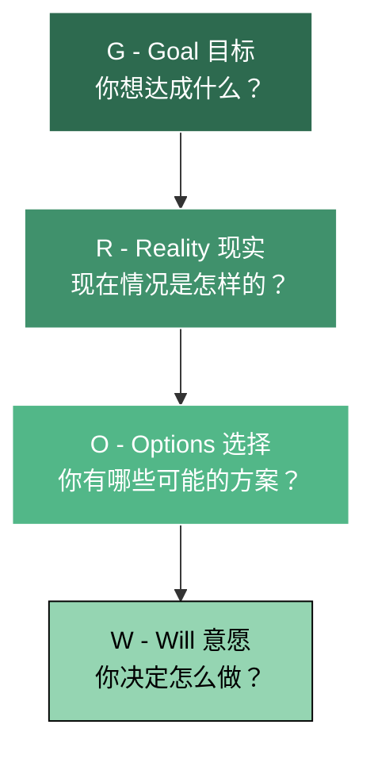
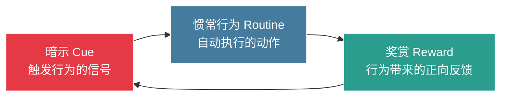
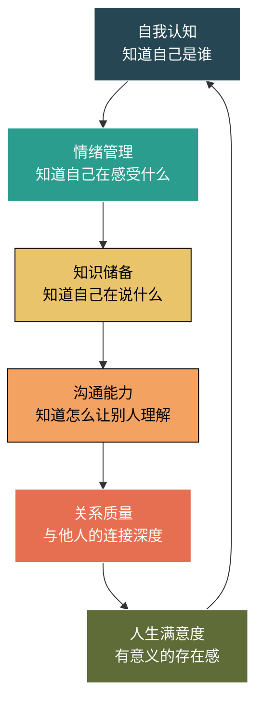
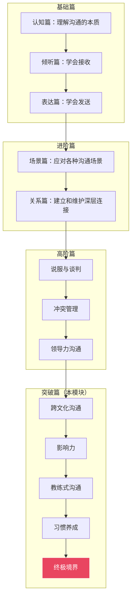

## 第六模块：进阶与突破（第26-30章）

前五个模块帮你从零搭建沟通能力的完整框架——从认知底层逻辑、倾听与表达的基本功，到说服、谈判、冲突管理等高阶场景。本模块是全书的**升华篇**：跳出单一语言和文化框架，进入跨文化、跨圈层、跨权力边界的沟通领域；同时解决"知道却做不到"的最后一公里问题，将所有技能内化为本能，最终抵达"不需要技巧"的真实沟通境界。

本模块的学习逻辑是**从外到内**：先向外扩展沟通的文化边界（第26章），再在组织和社会层面建立影响力（第27章），然后向内修炼以提问激发他人（第28章），接着用科学方法将所有技能固化为习惯（第29章），最后回归本心，达到沟通的最高境界（第30章）。

---

### 第26章：跨文化沟通——在全球化时代游刃有余

**核心观点**：文化差异不是障碍，而是丰富沟通的资源。

#### 为什么跨文化沟通能力越来越重要

全球化不只是跨国企业的事。即使你在国内工作，你的客户、供应商、合作伙伴、甚至同事，很可能来自不同文化背景。远程办公的普及让跨文化协作成为日常。据哈佛商学院研究，**跨文化沟通失败导致的项目延期和成本超支，平均占项目总预算的25%-30%**。掌握跨文化沟通能力，已经不是加分项，而是生存技能。

#### 文化差异的底层逻辑：不只是语言不同

很多人以为跨文化沟通就是"学好外语"。事实上，语言只是冰山浮在水面上的部分。爱德华·霍尔的"文化冰山模型"揭示：水面上的显性文化（语言、服饰、饮食）只占10%，水面下的隐性文化（价值观、时间观、权力观、沟通风格）占90%——而正是这90%决定了沟通的成败。

#### 霍夫斯泰德文化维度理论的沟通应用

荷兰学者吉尔特·霍夫斯泰德通过IBM全球员工调查，提炼出六个文化维度，每个维度都直接影响沟通策略：

| 维度 | 含义 | 高分文化特征 | 低分文化特征 | 沟通影响 |
|------|------|-------------|-------------|---------|
| **权力距离** | 对权力不平等的接受程度 | 等级分明，尊重权威（中国、印度） | 平等意识强（北欧、以色列） | 高权力距离文化中，下属不会当面反驳上级；低权力距离文化中，任何人都可以挑战任何人的观点 |
| **个人主义vs集体主义** | 个人利益与群体利益的优先级 | 个人优先（美国、澳大利亚） | 群体优先（日本、韩国） | 个人主义文化重视直接表达个人立场；集体主义文化强调共识和"给面子" |
| **男性化vs女性化** | 竞争导向vs关怀导向 | 竞争激烈、追求成就（日本、美国） | 注重生活质量（瑞典、挪威） | 男性化文化中谈判更硬，女性化文化中更注重关系维护 |
| **不确定性规避** | 对模糊和未知的容忍度 | 规则多、流程严格（希腊、葡萄牙） | 灵活变通（新加坡、丹麦） | 高不确定性规避文化需要详细计划和明确承诺；低规避文化更能接受"走着看" |
| **长期导向vs短期导向** | 重视未来还是当下 | 注重储蓄和长远（中国、日本） | 注重当下和传统（美国、英国） | 长期导向文化中建立信任需要时间，但合作关系更持久 |
| **放纵vs克制** | 对欲望满足的态度 | 享受生活（墨西哥、巴西） | 自我约束（中国、俄罗斯） | 影响工作与生活的边界感，以及社交场合的放松程度 |

**实操建议**：在与不同文化背景的人合作前，花15分钟在Hofstede Insights官网（hofstede-insights.com）查一下对方国家的文化维度得分，形成基本预判。这比临场猜测高效十倍。

#### 高语境文化与低语境文化：90%的误解源于此

爱德华·霍尔提出的高/低语境理论，是理解跨文化沟通差异最实用的框架：

| 特征 | 高语境文化（中日韩、阿拉伯、拉美） | 低语境文化（美德北欧、澳大利亚） |
|------|--------------------------------|-------------------------------|
| **信息传递方式** | 大量信息通过语境、关系、非语言线索传递 | 信息主要通过明确的语言文字传递 |
| **说话风格** | 含蓄、委婉、点到为止 | 直接、明确、有话直说 |
| **"不"的表达** | "这个问题我们再研究研究"="不行" | "No, that won't work"="不行" |
| **合同观念** | 合同是关系的起点，可以灵活调整 | 合同是神圣承诺，白纸黑字 |
| **冲突处理** | 避免当面冲突，保全双方面子 | 直接面对冲突，对事不对人 |
| **信任建立** | 基于长期关系和人际网络 | 基于专业能力和过往业绩 |

**典型案例**：一位美国经理到中国分公司，会议上问"大家对这个方案有什么意见？"中国员工沉默。美国经理认为"没有意见=同意"。实际上，沉默可能是"有意见但不当面说"。结果方案执行时阻力重重，美国经理觉得"中国人不守承诺"，中国员工觉得"领导不听我们的"。根源就是高语境与低语境的碰撞。

**破解方法**：
- 面对高语境文化：多观察非语言信号，会后私下一对一确认真实想法，用"您觉得还有什么需要完善的地方"替代"有没有反对意见"
- 面对低语境文化：把你想表达的直接说出来，减少铺垫和暗示，书面确认关键决策

#### 跨文化沟通的七个常见误区

1. **刻板印象陷阱**："日本人就是含蓄的，美国人就是直接的"——文化倾向是统计规律，不是个人标签。始终以具体个体为沟通对象。
2. **文化中心主义**：用自己的文化标准评判他人的行为。"他们怎么这么不守时"可能只是时间观念不同。
3. **语言能力=沟通能力**：托福110不等于能和美国人有效沟通。语言只是工具，文化理解才是核心。
4. **忽视非语言差异**：点头在保加利亚表示"不"，竖大拇指在中东是侮辱手势。
5. **过度适应**：为了"融入"完全放弃自己的文化习惯，反而显得不真诚。
6. **忽视亚文化**：美国南方人和纽约人的沟通风格差异，可能比美国人和英国人的差异还大。
7. **把个人行为归因于文化**：一个人迟到可能是堵车，不一定是"他们文化就是不守时"。

#### 跨文化团队的沟通策略

| 策略 | 具体做法 | 适用场景 |
|------|---------|---------|
| **建立团队沟通公约** | 共同制定：会议语言、决策方式、反馈风格、冲突处理流程 | 新组建的跨文化团队 |
| **文化翻译者** | 指定熟悉多种文化的成员担任"文化桥梁"，在误解发生前化解 | 大型跨文化项目 |
| **双轨反馈** | 同时提供公开反馈和匿名反馈渠道，兼顾不同文化的偏好 | 涉及高低语境文化混合的团队 |
| **可视化优先** | 用图表、流程图、原型代替纯文字沟通，减少语言障碍 | 语言能力参差不齐的团队 |
| **定期文化复盘** | 每月一次"文化check-in"，讨论沟通中的摩擦和改进 | 长期跨文化协作 |

#### 快速适应新文化环境的四步法

1. **观察期（第1-2周）**：不说，只看。观察当地人的沟通节奏、会议风格、邮件格式、社交礼仪。记录三个让你"意外"的行为。
2. **试探期（第3-4周）**：小范围尝试。在非正式场合（午餐、茶歇）与当地人交流，试探性地使用你观察到的沟通方式。
3. **调整期（第5-8周）**：根据反馈调整。如果某个方式效果好，保留；如果引起不适，回退。建立你的"文化适配手册"。
4. **融合期（第2-3个月）**：形成自己的跨文化沟通风格。不是完全变成对方，而是在保持自我的基础上找到最大公约数。

**本章学习路径**：了解你最常接触的外国文化的沟通特点→学习十个跨文化沟通案例→在一次跨文化互动中实践→反思总结→形成你的"文化适配手册"。

---

### 第27章：影响力沟通——不靠权力也能推动改变

**核心观点**：真正的影响力来自于信任、专业和共鸣，而非职位和权力。

#### 什么是影响力：区分"影响"与"操控"

影响力和操控的边界在于**意图和透明度**。影响力是让对方在充分知情的情况下自愿认同你的观点；操控是通过信息不对称或情绪操纵让对方做出对你有利但可能损害对方利益的决策。本章讨论的是前者——正向的、可持续的影响力。

#### 罗伯特·西奥迪尼的六大影响力原则及其高级应用

西奥迪尼在《影响力》中提出的六大原则，是影响力研究的基石。以下是每个原则的深度解读和高级应用技巧：

| 原则 | 核心机制 | 低阶用法 | 高阶用法 | 警惕点 |
|------|---------|---------|---------|--------|
| **互惠** | 给予后对方会产生回报感 | 送小礼物、帮忙 | 先主动分享有价值的信息/资源，创造"人情账户"；在对方最需要时出手，效果倍增 | 不要让人觉得你在"放长线钓大鱼" |
| **承诺与一致** | 人们倾向于与先前承诺保持一致 | 让对方先答应小请求 | 引导对方公开表态（会议记录、邮件确认），利用"自我形象一致性"推动后续行动 | 不要利用承诺陷阱让人做违背真实意愿的事 |
| **社会认同** | 人们参考他人行为来判断正确行为 | 展示案例和数据 | 构建"势能"——让对方看到他的同行/同级/尊重的人都在做这件事 | 不要伪造社会认同 |
| **喜好** | 人们更容易被喜欢的人影响 | 找共同点、真诚赞美 | 深度倾听+精准回应对方的核心关切，建立超越表面的个人连接 | 不要变成"讨好型人格" |
| **权威** | 人们倾向于服从专业权威 | 展示头衔和资质 | 通过持续输出高质量专业内容建立"知识权威"；借力第三方权威背书 | 不要越界——在非专业领域也摆权威架子 |
| **稀缺** | 越稀缺越有价值 | 限时限量 | 制造"独家性"——让对方觉得这个机会/信息/资源是专门为其定制的 | 不要制造虚假紧迫感 |

#### "先影响力"与"后影响力"策略

**先影响力**（Pre-suasion）：在正式沟通前就开始布局。西奥迪尼在同名著作中详细阐述了这一概念——你在提出请求之前的"铺垫"决定了对方的接受度。

先影响力的关键技术：
- **框架设定**：在会议前通过邮件预设讨论框架，让对方在你的逻辑框架内思考
- **环境选择**：在你的主场（你的办公室、你选的餐厅）沟通，心理优势提升15%-20%
- **信息预埋**：提前3-5天分享相关资料，让对方在无压力状态下"提前消化"你的观点
- **情绪预热**：在正式提案前，先通过非正式聊天建立积极情绪

**后影响力**（Post-suasion）：在达成共识后巩固影响力。

后影响力的关键技术：
- **即时确认**：会议结束24小时内发送纪要，强化关键决策
- **公开归因**：在更大的场合提及"这个方案是XX团队共同智慧的结晶"
- **阶段性回报**：方案执行过程中定期汇报进展，让支持者获得正向反馈
- **关系维护**：即使没有具体事务，也定期保持联络，不要"用人朝前不用人朝后"

#### 在没有正式权力的情况下推动变革的五种策略

这是职场中最常见也最困难的影响力场景——你不是老板，但你需要推动事情发生。

**策略一：成为信息枢纽**

掌握关键信息和资源的人，天然具有影响力。具体做法：
- 主动成为跨部门项目的协调人
- 建立广泛的信息网络，成为"消息灵通人士"
- 分享有价值的行业报告、市场数据、竞争情报

**策略二：构建联盟**

单独一个人推动变革很难，但一群人推动就变成了"组织意志"。
- 先找到3-5个核心支持者，形成"变革核心圈"
- 通过核心支持者影响各自的社交网络
- 让支持者在关键会议上替你发声（第三方推荐比自我推荐有效3倍）

**策略三：用数据说话**

个人意见可以被忽视，但数据不会。
- 收集支持你观点的数据、案例和基准
- 用可视化方式呈现，降低理解门槛
- 准备"如果不变，代价是什么"的数据——损失厌恶比收益诱惑更有效

**策略四：从小胜利开始**

不要一上来就推翻整个流程。先在一个小范围、低风险的场景中试点。
- 选择一个容易成功的试点项目
- 用试点成果作为"社会认同"的证据
- 逐步扩大范围，形成不可逆的趋势

**策略五：借势**

利用组织中已有的趋势、危机或高层关注点来推动你的变革。
- 将你的方案与公司战略目标对齐
- 利用行业危机或竞争压力作为变革的紧迫性论据
- 争取一位有影响力的"赞助人"为你的方案背书

#### 社交网络中的影响力传播

影响力在社交网络中的传播遵循"弱连接优势"理论——你的强关系（亲密朋友）和你的信息高度同质，真正带来新信息和新机会的是弱关系（泛泛之交）。

建立社交网络影响力的核心策略：
- **维护弱连接**：定期与"不太熟"的人互动，转发他们的内容、评论他们的动态
- **内容为王**：持续输出有深度的专业内容，让自己成为某个领域的"信息源头"
- **连接者角色**：主动为不同圈子的人牵线搭桥，成为"网络中的桥梁节点"
- **选择性曝光**：不是什么都要评论，只在你真正擅长的领域发声，保持专业一致性

#### 影响力的长期建设与维护

影响力是"慢变量"——建立需要数月甚至数年，摧毁只需一次失信。维护影响力的核心原则：

1. **一致性**：你说的和你做的必须一致。言行不一是影响力最大的敌人。
2. **可预测性**：让别人能预判你的行为模式。稳定的人比反复无常的人更有影响力。
3. **慷慨性**：持续给予而不计即时回报。影响力最大的人往往是"给予者"。
4. **成长性**：持续学习和进步。停滞不前的人，影响力会随时间衰减。
5. **透明性**：在合理范围内坦诚你的意图和局限。坦诚比完美更能建立信任。

**本章学习路径**：评估你目前的影响力水平→选择一个你想要影响的目标→制定影响力策略（先影响+正向原则）→实施并评估效果→持续维护影响力资产。

---

### 第28章：教练式沟通——激发他人的潜能

**核心观点**：最好的沟通不是给答案，而是帮助对方找到自己的答案。

#### 什么是教练式沟通

教练式沟通源于体育教练的理念：教练不需要比运动员更会跑步，但教练能帮助运动员跑得更快。在管理、教育和人际关系中，教练式沟通是一种以提问为主导、以对方为中心的沟通方式——它不是告诉你该怎么做，而是通过有力的问题帮助你理清思路、发现资源、找到解决方案。

#### 为什么"给答案"反而有害

当别人带着问题来找你时，直接给出答案看似高效，实际上存在三个问题：

1. **依赖性**：下次遇到问题，对方第一个想到的还是来找你。你变成了"人肉搜索引擎"，而不是领导者。
2. **责任转移**：答案是你的，不是对方的。执行时缺乏主人翁意识，效果打折。
3. **能力萎缩**：对方失去了独立思考和解决问题的锻炼机会。"授人以鱼"不如"授人以渔"的古训，在这里完全适用。

#### GROW模型：教练式沟通的核心框架

GROW模型由约翰·惠特莫尔爵士在《高绩效教练》中提出，是全球使用最广泛的教练框架：

**G - Goal（目标）：明确你想要什么**

关键提问：
- "这次对话你最想解决什么问题？"
- "理想的结果是什么样的？"
- "你怎么知道自己达到了目标？有没有具体的衡量标准？"
- "这个目标是你真正想要的，还是别人期望你要的？"

常见陷阱：目标模糊（"我想提升沟通能力"→应该是"我想在月度述职时不紧张"）。帮对方把模糊目标转化为具体、可衡量的目标。

**R - Reality（现实）：诚实面对现状**

关键提问：
- "目前的情况具体是怎样的？"
- "你已经尝试过哪些方法？效果如何？"
- "这件事的难点在哪里？"
- "有哪些因素是你能控制的？哪些是不能控制的？"
- "如果用1-10分评价现状，你打几分？为什么不是更低/更高？"

常见陷阱：对方跳过现实分析直接要方案。需要温和地拉回来："在讨论怎么做之前，我们先确保对现状有清晰的共识。"

**O - Options（选择）：打开可能性空间**

关键提问：
- "你有哪些可能的选择？"
- "如果没有任何限制，你会怎么做？"
- "如果你最好的朋友遇到同样的问题，你会给他什么建议？"
- "还有没有你没想到的可能性？"
- "每个选择的利弊是什么？"

**拓展技巧**：当对方说"我想不到其他办法了"，用以下方法突破思维限制：
- 换角色："如果你是客户/老板/竞争对手，你会怎么看这个问题？"
- 换时间："5年后的你回头看这件事，会觉得什么最重要？"
- 换资源："如果预算/时间/人力翻倍，你会怎么做？"
- 反向思考："如果你想让这件事彻底失败，你会怎么做？"（然后避免那些行为）

**W - Will（意愿）：转化为行动承诺**

关键提问：
- "你决定选择哪个方案？"
- "你打算什么时候开始？第一步是什么？"
- "可能会遇到什么障碍？你打算怎么应对？"
- "你需要什么支持？"
- "用1-10分评价你的行动意愿，怎样才能从X分提高到10分？"

常见陷阱：对方说了计划但缺乏承诺。检验方法：问"如果下周我问你进展，你希望我怎么问？"——主动邀请监督是高承诺的信号。

#### 有力提问的技巧与练习

教练式沟通的灵魂是提问的质量。以下是提问的层次模型：

| 层次 | 特征 | 示例 | 效果 |
|------|------|------|------|
| **信息层** | 收集事实 | "发生了什么？""什么时候开始的？" | 建立对现状的基本了解 |
| **感受层** | 探索情绪 | "这件事让你感觉怎样？""你最担心的是什么？" | 帮助对方觉察情绪对决策的影响 |
| **认知层** | 触发思考 | "你觉得根本原因是什么？""这个假设成立吗？" | 推动深度分析和反思 |
| **洞察层** | 引发顿悟 | "如果你只能改变一件事，会是什么？""你从中学到了什么？" | 产生突破性认知 |
| **行动层** | 转化为行动 | "你决定怎么做？""第一步是什么？" | 将思考转化为可执行的计划 |

**提问的六大禁忌**：
1. **引导式提问**："你不觉得应该这样做吗？"——这不是提问，是包装成问句的建议
2. **连环炮式提问**：一口气问三个问题——对方不知道该回答哪个
3. **评判式提问**："你为什么会犯这种错？"——对方进入防御模式
4. **封闭式提问**（过多）："是不是？对不对？"——限制了对方的思考空间
5. **自我中心式提问**："我以前也遇到过，我是这样做的……"——又变成了给建议
6. **跳跃式提问**：还没理解现状就问解决方案——根基不稳

#### 从"给答案"到"问问题"的转变路径

这个转变不容易，因为给答案更简单、更快、也更"显得你厉害"。以下是渐进式转变方法：

**第一阶段：觉察**
记录一周内你"给别人建议"的次数。每次给建议前暂停3秒，问自己："这个问题，对方能不能自己想出答案？"

**第二阶段：替换**
把三种常见句式替换：
- "你应该……" → "你觉得有哪些可能的做法？"
- "我的建议是……" → "如果排除所有限制，你最想怎么做？"
- "这个问题要这样解决……" → "你之前试过什么方法？效果怎样？"

**第三阶段：组合**
先提问，对方回答后再补充你的观点："你刚才提到了X方案，这是一个很好的方向。我补充一个视角供你参考……"这样既尊重了对方的思考，又贡献了你的经验。

**第四阶段：纯教练**
能够在90%的对话中只用提问引导对方自己找到答案。这需要大量练习，通常需要3-6个月的刻意训练。

#### 教练式沟通的多元应用场景

| 场景 | 具体用法 | 注意事项 |
|------|---------|---------|
| **管理下属** | 员工遇到困难时，用GROW模型引导而不是直接指令 | 紧急情况除外——火烧眉毛时直接下指令 |
| **教育子女** | 孩子犯错时，用提问帮TA自己认识问题而不是说教 | 根据孩子年龄调整问题的抽象程度 |
| **辅导新人** | 新人提问时，先问"你自己怎么看？"再给反馈 | 新人能力不足时要给足够的信息输入，不能只问不教 |
| **夫妻关系** | 伴侣抱怨时，用倾听+提问替代急于解决问题 | 有时候对方需要的是情绪接纳，不是解决方案 |
| **客户沟通** | 客户提出需求时，用提问帮TA厘清真正的问题 | 有些客户就是想要你直接给方案，要灵活应对 |

**本章学习路径**：学习GROW模型→在一次辅导对话中使用教练式沟通→记录对方的反应和结果→对比"给答案"和"问问题"两种方式的效果→持续练习→逐步扩展到更多场景。

---

### 第29章：沟通习惯的养成——从刻意练习到自然而然

**核心观点**：沟通能力不是天赋，而是习惯。好习惯需要刻意培养。

#### 从"知道"到"做到"的鸿沟

读完一本书、听完一门课，你会有一种"我已经学会了"的错觉。但知识和能力之间隔着一条巨大的鸿沟——**练习**。神经科学研究表明，从"认知理解"到"行为自动执行"需要经历四个阶段（德雷福斯技能获取模型）：

| 阶段 | 特征 | 举例 | 所需时间 |
|------|------|------|---------|
| **新手** | 依赖规则，无法应对意外 | "先倾听再表达"——但遇到冲突就忘了 | - |
| **进阶** | 能识别常见模式，但需要刻意思考 | 能判断对方是高语境还是低语境，但需要想一想 | 数周-数月 |
| **胜任** | 能灵活应变，但还需要集中注意力 | 能根据不同场景切换沟通风格 | 数月-1年 |
| **精通** | 直觉判断，不假思索 | 看到对方微表情就知道该怎么调整 | 1-3年 |
| **专家** | 本能反应，浑然天成 | 即使在高压环境下也能自然地有效沟通 | 3年以上 |

#### 习惯养成的神经科学原理

习惯的本质是大脑的"节能模式"。大脑通过"基底神经节"将反复执行的行为模式编码为自动程序，就像你不需要思考怎么骑自行车一样。习惯回路由三个环节组成：

应用到沟通习惯养成中：

- **暗示**：设定固定的触发场景。例如："每次会议开始前=做一次深呼吸+决定本次要练习的沟通技能"
- **惯常行为**：在触发场景下执行特定的沟通行为。例如："深呼吸后，在会议前三分钟专注于倾听，不急于表达"
- **奖赏**：建立即时反馈机制。例如："会议结束后记录——今天我做到了专注倾听，给自己加一分"

#### "微习惯"策略在沟通训练中的应用

斯蒂芬·盖斯在《微习惯》中提出的核心理念是：**把目标缩小到不可能失败的程度**。应用到沟通训练：

| 传统目标（容易失败） | 微习惯版本（几乎不可能失败） | 为什么有效 |
|-------------------|--------------------------|----------|
| "每天练习30分钟演讲" | "每天对着镜子说一句完整的话" | 启动门槛极低，但一旦开始往往会多做 |
| "每次开会都主动发言" | "每次开会至少点头一次表示认同" | 不需要勇气，但建立了"参与"的习惯回路 |
| "每天写500字沟通反思" | "每天写一句话：今天沟通做得最好的一点是…" | 30秒完成，不会因为"太忙"而跳过 |
| "对每个人都用非暴力沟通" | "今天对一个人用'我观察到…我感觉…'的句式" | 聚焦一个人比改变所有互动容易得多 |

**关键原则**：微习惯的"超量完成"是常态——你设定了"说一句话"的目标，结果往往说了三分钟。但超量是奖励，不是新标准。第二天的目标还是"一句话"。

#### 设计你的21天沟通习惯训练计划

21天是一个入门锚点（实际形成稳定习惯需要66天左右，根据伦敦大学学院的研究）。以下是分三周递进的训练框架：

**第一周：聚焦一个场景，一个技能**

选择你最常用的一个沟通场景（例如：一对一会议）和一个最需要提升的技能（例如：有效倾听）。

每天任务：
- 早上：设定今天的"一句话目标"（例如："今天和小张开会时，他说完之前我不打断"）
- 中间：执行
- 晚上：30秒记录（做到了/没做到/意外收获）

**第二周：扩展到两个场景**

保持第一周的习惯，新增一个场景。例如：从"一对一会议"扩展到"团队会议"。

**第三周：引入复杂情境**

在前两周的基础上，引入更具挑战性的情境。例如：在有分歧的会议中练习倾听和表达的平衡。

#### 克服练习中的倦怠和挫折

**倦怠期**通常出现在第7-14天——新鲜感消退，但习惯尚未形成。应对策略：

1. **降低标准而非放弃**：感觉累了？微习惯的底线还在——"一句话目标"总能完成。
2. **找到"练习搭子"**：和一个也在提升沟通能力的朋友互相监督，每天互发"今日练习报告"。
3. **可视化进展**：用日历打卡法——每完成一天画一个X，连续的X链会让你不忍心中断（"不要打破链条"法则）。
4. **庆祝小胜利**：每完成一周，给自己一个小奖励。大脑需要正向反馈来维持动力。
5. **接受"退步是正常的"**：技能提升不是线性的。有时候第三周的表现还不如第二周——这是神经网络重组的信号，不是失败。

**挫折期**的典型场景：一次重要的沟通中，你完全忘记了所有技巧，回到了旧模式。

应对方式：
- **不要自责**。大脑在压力下会退回最熟悉的模式，这是正常的神经机制。
- **复盘而非反刍**。分析"当时是什么触发了旧模式"、"下次可以怎样提前预防"，而不是反复回想"我怎么又犯了"。
- **降低下一次的难度**。如果上次是在10人会议上失败了，下次先在3人小组中练习。

#### 建立"沟通支持系统"

独自练习沟通技能就像独自健身——容易放弃。你需要一个支持系统：

1. **习惯伙伴**：找一个志同道合的人，互相监督和反馈。
2. **导师**：找一个沟通能力比你强的人，定期请教和复盘。
3. **练习场景**：主动创造练习机会。加入Toastmasters演讲俱乐部、参加行业交流会、主动承担会议主持。
4. **反馈渠道**：定期向信任的同事/朋友征求"沟通反馈"——"最近和我沟通，有什么感受？有什么建议？"
5. **学习社群**：加入沟通技能学习社群，分享心得、讨论案例、互相激励。

**本章学习路径**：选择三个你最想养成的沟通习惯→设计21天微习惯计划→找一个"习惯伙伴"→实施并每天记录→每周末复盘调整→坚持66天形成稳定习惯。

---

### 第30章：沟通的终极境界——做真实的自己

**核心观点**：最高级的沟通技巧，是不需要技巧。

#### 技巧的尽头是什么

当你学完了30章的沟通技巧，练习了倾听、表达、说服、谈判、冲突管理、跨文化沟通、影响力、教练式沟通……你可能会问：这些技巧全部学会之后，最高的境界是什么？

答案是：**忘记技巧**。

这听起来像悖论，但它是所有技艺修行的共同规律。武侠小说中，独孤求败的最高境界是"无剑胜有剑"；书法中，最高境界是"无法之法"；沟通中，最高境界是"不需要技巧的真诚"。

但请注意——**"不需要技巧"不等于"没有技巧"**。恰恰相反，只有当你把所有技巧都练到了本能反应的程度，你才能"忘记"它们。没有修炼过的"真实"，只是"粗糙"。

#### "真实沟通"的哲学与实践

真实沟通（Authentic Communication）的核心是三个一致性：

1. **言行一致**：你说的就是你做的。你倡导开放，自己就率先坦诚；你要求守时，自己就从不迟到。
2. **内外一致**：你的表达和你的内心感受一致。不开心时不强装开心，不确定时坦承不确定。
3. **角色一致**：无论面对谁，你的核心价值观和沟通原则不变。不是在领导面前一套，在下属面前另一套。

**真实沟通的实践方法**：

- **暂停与觉察**：在回应之前，花1-2秒觉察自己当下的真实感受和想法。这个微小的暂停，让你有机会选择真诚的回应而非习惯性的反应。
- **承认不知道**：当被问到不确定的问题，说"这个我需要查一下/想一想"比"嗯，应该是……"更专业也更真诚。
- **表达脆弱**：适度展示你的不确定、困惑和失败，不是软弱，而是勇气。布芮尼·布朗在《脆弱的力量》中指出，适度的脆弱是建立深层信任的最强催化剂。
- **一致性检验**：定期问自己三个问题——"我最近一次说了违心的话是什么时候？""我在不同场合的表达是否一致？""我的行为是否支撑我倡导的价值观？"

#### 技巧与真诚的平衡

有人会质疑："如果沟通需要'技巧'，那它还真诚吗？"

这个质疑源于对"真诚"的误解。真诚不等于"有什么说什么"——那是缺乏同理心的粗暴。真诚的核心是**动机的纯正**和**意图的透明**，而技巧只是让你更好地实现这个意图。

| 场景 | 粗暴的"真实" | 有技巧的真诚 | 没有真诚的技巧 |
|------|------------|------------|--------------|
| 给下属负面反馈 | "你这个方案太烂了" | "这个方案在X和Y方面还有提升空间，我们一起看看怎么改进" | "方案很好，但是有一些小的调整……"（明明很差） |
| 拒绝不合理请求 | "不行，我没空" | "我理解这个很重要，但目前我的优先级排不过来。我们看看有没有其他方式解决？" | "好的好的"（然后不做的） |
| 表达不同意见 | "你这个想法完全不对" | "我理解你的出发点，但从另一个角度看，可能存在X风险。你怎么看？" | 当面不说，背后抱怨 |

**核心原则**：技巧是手段，真诚是目的。好的技巧让真诚更容易被接受，真诚让技巧更有力量。

#### 沟通与个人成长的关系

沟通能力不是孤立存在的。它是你认知能力、情绪管理能力、知识储备、人格成熟度的综合体现。提升沟通能力的过程，本质上是提升自我的过程。

这意味着：当你觉得沟通遇到瓶颈时，往往不是沟通技巧的问题，而是需要回到更底层去提升。例如：
- 跟某些人说话就容易暴躁→可能是情绪管理的问题，不是表达技巧的问题
- 表达总是抓不住重点→可能是思维结构的问题，需要训练逻辑思维
- 不知道该跟陌生人聊什么→可能是知识面和生活阅历的问题，需要拓宽视野

#### 建立终身学习的沟通成长体系

沟通能力的学习没有终点。以下是建立长期成长体系的四个维度：

**1. 输入系统**
- 每月阅读一本沟通/心理学/人际关系经典著作
- 关注3-5个高质量的沟通类播客或公众号
- 参加年度沟通技能培训或工作坊

**2. 实践系统**
- 每天至少一次刻意练习（哪怕只是一个微习惯）
- 每周主动承担一个有挑战性的沟通场景
- 每月尝试一种新的沟通方法或工具

**3. 反馈系统**
- 每季度向5位不同关系的人征求沟通反馈
- 每半年做一次全面的沟通能力自评
- 记录并分析"沟通失败案例"——失败是比成功更好的老师

**4. 复盘系统**
- 每周15分钟复盘：本周沟通做得最好的三件事和可以改进的一件事
- 每月深度复盘：本月在沟通方面最大的突破和最大的挑战
- 每年总结：回顾年初设定的沟通目标，评估进展，制定新目标

#### 从"有效沟通"到"有意义的沟通"

有效沟通解决的是"事情能不能成"的问题——方案能不能通过，谈判能不能赢，冲突能不能化解。

有意义的沟通解决的是"关系能不能深"的问题——你能不能被真正理解，对方能不能感到被尊重，彼此能不能建立深层的信任和连接。

有效沟通的评判标准是**结果**：达成了什么目标。
有意义的沟通的评判标准是**质量**：创造了怎样的连接。

在你掌握了所有"术"的层面的技巧之后，请回到"道"的层面思考：

- 我沟通的最终目的是什么？是赢得争论，还是建立理解？
- 我是在"使用"他人，还是在"连接"他人？
- 我的沟通让这个世界变得更温暖了一点，还是更冷漠了一点？

当你能真诚地回答这些问题，并且你的沟通行为与答案一致——你就达到了沟通的终极境界：做真实的自己。

#### 全书30章回顾：从入门到精通的完整地图

**本章学习路径**：回顾全书30章的核心技能→评估你的成长（对比第1章的自评）→制定下一阶段的沟通成长计划→从"知道"走向"做到"→从"做到"走向"成为"→开始新的旅程。

---

> **编者按**：本模块是全书的收官之作。前25章教你各种"术"的层面的技巧，本模块带你回归"道"的层面——沟通的本质是人与人之间的真诚连接。技巧是桥梁，真诚是目的地。愿你在读完这本书之后，不仅能成为一个更有效的沟通者，更能成为一个更真实、更温暖的人。
