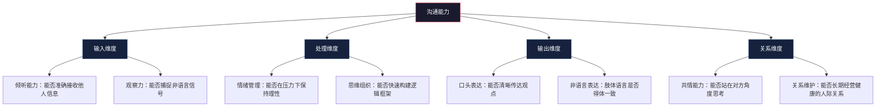
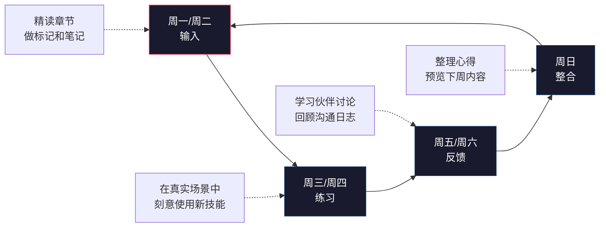
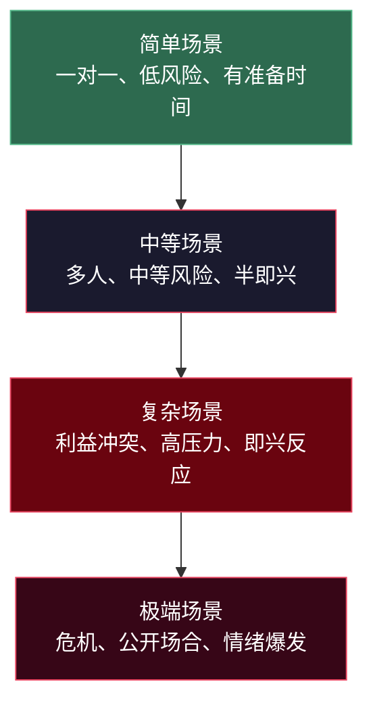
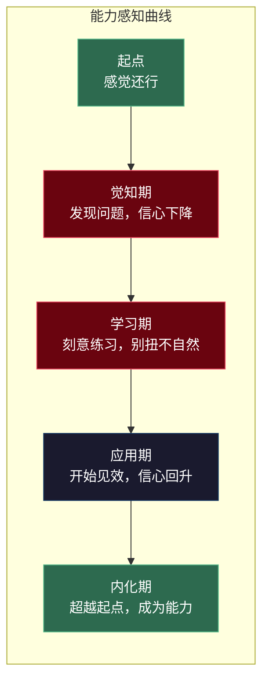
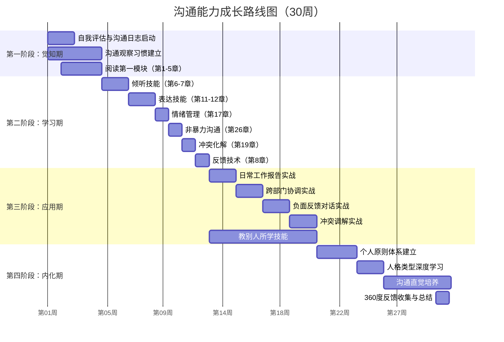

## 沟通能力成长路线图

### 为什么需要一张路线图

沟通能力的提升不是"多说话就行"那么简单，它是一项复杂的复合能力——包含倾听、表达、情绪管理、关系构建、场景适应等多个维度。没有路线图的学习，容易陷入两个陷阱：

**陷阱一：盲目练习。** 花大量时间重复已经熟练的技能，回避真正薄弱的环节。就像一个跑步很快但从不练力量的运动员，永远突破不了瓶颈。

**陷阱二：过早放弃。** 在"别扭期"觉得"我不适合这种方式"，回到旧习惯。实际上，几乎所有沟通能力的提升都遵循一条"先退后进"的曲线——短期内你会觉得用新方法反而更别扭，但这恰恰是成长的信号。

本章为你画一张清晰的地图：你在哪里、你要去哪里、路上会遇到什么、怎么判断自己走到了哪一步。

---

### 沟通能力的成长模型：四阶段八维度

#### 理论基础：德雷福斯技能习得模型

1980年，美国哲学家斯图尔特·德雷福斯（Stuart Dreyfus）和休伯特·德雷福斯（Hubert Dreyfus）提出了技能习得五阶段模型。该模型被广泛应用于医学、航空、体育等领域，同样适用于沟通能力的成长：

| 阶段 | 特征 | 沟通中的表现 |
|------|------|------------|
| 新手 | 依赖规则，不考虑情境 | "书上说要用I-Statement，我就按公式说" |
| 高级新手 | 开始识别情境差异 | "和领导说话跟和朋友说话确实不一样" |
| 胜任者 | 能制定计划并执行 | "这次谈判我准备了三个方案，按优先级推进" |
| 精通者 | 直觉判断，整体感知 | "我感觉这个氛围不太对，需要先缓一缓" |
| 专家 | 不依赖规则，自然反应 | 无需思考，即在复杂情境中做出恰当回应 |

本书的成长路线图基于这一理论，将其简化为四个阶段，对应从"零基础"到"内化为本能"的完整旅程。

#### 八个评估维度

沟通能力不是单一维度的技能。判断自己的成长阶段，需要从八个维度综合评估：

用这八个维度做自评（每项1-10分），你就能得到一张"沟通能力雷达图"。这张图会告诉你：你的优势在哪里，短板在哪里，下一阶段该重点突破什么。

---

### 第一阶段：觉知期（第1-4周）——"看见自己"

#### 阶段本质

这个阶段的核心任务不是"学技巧"，而是"看见"。看见自己的沟通习惯、看见他人的反应模式、看见互动中隐藏的问题。

这就像去医院做体检——在开药之前，首先要确诊。很多人沟通有问题却不自知，或者知道有问题但说不清具体是什么。觉知期要解决的就是这个"诊断"问题。

#### 你在这个阶段会经历什么

**心理状态：** 你会经历一段"恍然大悟"的时期。很多以前没注意到的细节突然变得显眼——你发现自己打断别人的频率远超想象，你意识到自己在紧张时会不自觉地加快语速，你注意到某个同事每次被批评后都会沉默很久。

**典型反应：** 有些读者在这个阶段会感到焦虑——"原来我有这么多问题！"这是正常的。看见问题是解决问题的第一步，而不是倒退。

#### 阶段任务详解

**任务一：完成自我评估**

本书第三章提供了沟通风格自测工具。在这个阶段，你需要完成以下评估：

| 评估工具 | 目的 | 所在章节 | 预计用时 |
|---------|------|---------|---------|
| 沟通风格测试 | 了解你的默认沟通模式（攻击型/被动型/被动攻击型/自信型） | 第3章 | 15分钟 |
| 倾听能力评估 | 评估你在倾听中的盲区（选择性听/评判性听/假听） | 第6章 | 10分钟 |
| 情绪觉察测试 | 评估你识别和管理自身情绪的能力 | 第17章 | 10分钟 |
| 冲突应对风格测试 | 了解你在冲突中的默认反应模式（回避/竞争/妥协/迁就/合作） | 第19章 | 10分钟 |

把所有评估结果保存好，它们是你后续衡量进步的"基准线"。

**任务二：启动沟通日志**

沟通日志是贯穿全书的核心工具。在这个阶段，日志的重点是"客观记录"，不急于分析和改进。

每天至少记录一条沟通事件，格式如下：

日期：2024-03-15
场景：周会汇报项目进度
对象：直属领导 + 跨部门同事（共6人）
我做了什么：讲了10分钟项目进展，用了PPT，逐页讲解
对方的反应：第3分钟开始有人看手机，领导在第7分钟打断说"说重点"
我当时的情绪：有点慌，觉得自己的汇报不被重视
事后反思：信息量太大，没有突出关键结论

**关键原则：** 这个阶段不要求自己改进，只要求如实记录。就像拍照——你首先要拍清楚现状，才能知道要修什么。

**任务三：建立"沟通观察"习惯**

每天花5分钟，观察一次他人的沟通行为。可以是：
- 会议上，观察谁发言最多、谁被忽略、谁的表达最有条理
- 吃饭时，观察两个朋友之间的对话节奏——谁说得多、谁听得认真
- 地铁上，观察打电话的人怎么开场、怎么结束

观察的重点不是"评判好坏"，而是"识别模式"。你开始看到：好的沟通者有哪些共同特征？沟通失败时通常发生了什么？

#### 阶段里程碑

经过四周的觉知期，你应该能够：

1. **清晰描述自己的沟通风格。** 不是模糊的"我觉得我还可以"，而是具体的"我是一个偏被动型的沟通者，在面对权威人物时倾向于回避冲突，在亲密关系中倾向于用沉默表达不满"。
2. **列出至少三个具体的沟通问题。** 比如"我经常在别人还没说完时就急着给建议""我在群体讨论中很少主动发言""我在情绪激动时会说出伤人的话"。
3. **理解沟通的完整链条。** 明白沟通不是"我说了什么"，而是"对方接收到了什么"——发送→编码→传输→接收→解码→反馈，任何一个环节出问题都会导致沟通失败。

#### 常见误区

**误区一："我已经很了解自己了，不需要做评估。"**
事实是：人们对自身沟通能力的认知，与他人对其的评价之间，平均存在30%-40%的偏差。你以为自己是"直来直去"，别人觉得你是"不懂分寸"。评估不是多余，是校准。

**误区二："日志太麻烦了，我没时间。"**
一条日志只需要3-5分钟。如果你连3-5分钟都不愿意花在自我提升上，那可能你还没有真正想要改变。这个阶段测试的不是你的能力，而是你的意愿。

---

### 第二阶段：学习期（第5-12周）——"刻意练习"

#### 阶段本质

觉知期是"看见"，学习期是"练习"。这个阶段你要系统学习沟通技能，并在真实场景中有意识地运用。

关键词是"有意识"。你不再是自动驾驶，而是手动挡——每一步都需要刻意思考。这会让你觉得别扭、缓慢、不自然。这完全正常。

#### 学习期的科学原理：刻意练习

安德斯·艾利克森（Anders Ericsson）在《刻意练习》中指出，技能提升的关键不是重复，而是有目标、有反馈、有挑战的练习。套用到沟通学习中：

| 刻意练习四要素 | 在沟通学习中的体现 |
|-------------|-----------------|
| 明确的目标 | 每周聚焦一个具体技能（如"本周练习不打断别人"） |
| 专注的练习 | 在真实对话中有意识地使用目标技能 |
| 即时的反馈 | 通过沟通日志和学习伙伴获得反馈 |
| 适度的挑战 | 逐步从简单场景升级到复杂场景 |

#### 每周学习节奏

#### 本周重点技能规划表

这个阶段共8周，建议按以下顺序逐个突破核心技能：

| 周次 | 重点技能 | 对应章节 | 一句话练习目标 |
|------|---------|---------|-------------|
| 第5周 | 主动倾听 | 第6章 | 在每次对话中做到"听完再回应"，不打断、不预判 |
| 第6周 | 同理心倾听 | 第7章 | 在回应前先说"我理解你的感受是……" |
| 第7周 | 结构化表达 | 第11章 | 每次开口前先想"我的结论是什么"，结论先行 |
| 第8周 | 故事力 | 第12章 | 把一个数据/观点包装成"谁+在什么情况下+做了什么+结果如何"的故事 |
| 第9周 | 情绪觉察 | 第17章 | 每天至少命名3次自己的情绪（不是"不爽"，而是"被忽视的失落"） |
| 第10周 | 非暴力沟通 | 第26章 | 用"观察-感受-需求-请求"四步法重构一次抱怨 |
| 第11周 | 冲突化解 | 第19章 | 在下次分歧中，先确认对方的观点再表达自己的 |
| 第12周 | 反馈技术 | 第8章 | 给一个同事/朋友一次具体的正面反馈（行为+影响） |

#### 学习期的关键工具

**工具一：技能练习卡片**

为每个技能制作一张便携卡片，正面写核心要点，反面写使用场景。随身携带，在对话前快速回顾。

示例卡片——"结构化表达（PREP法则）"：

【正面】
P - Point（结论先行）：先说结论
R - Reason（理由支撑）：给1-2个理由
E - Example（案例佐证）：举一个具体例子
P - Point（重申结论）：最后重申一遍

【反面】
适用场景：汇报工作、提出建议、说服他人
不适用：闲聊、安慰、头脑风暴
使用提示：开口前花3秒钟想一下"我的结论是什么"

**工具二：渐进式暴露练习清单**

不要一上来就在最高风险的场景中练习。按照以下层级逐步升级：

| 层级 | 场景类型 | 示例 | 练习次数建议 |
|------|---------|------|------------|
| 第一层 | 安全环境 | 和伴侣/密友练习 | 每个技能至少5次 |
| 第二层 | 低风险社交 | 和便利店店员聊天、在微信群中发言 | 3-5次 |
| 第三层 | 日常工作 | 周会发言、和同事讨论 | 3-5次 |
| 第四层 | 重要场景 | 向上汇报、敏感话题、冲突对话 | 准备充分后再尝试 |

**工具三：21天习惯追踪表**

每个核心技能需要21天的持续练习才能初步形成习惯。制作一个简单的追踪表：

技能名称：___________  开始日期：___________

第1周（别扭期）：
□ Day1  □ Day2  □ Day3  □ Day4  □ Day5  □ Day6  □ Day7
本周感受：_______________

第2周（适应期）：
□ Day8  □ Day9  □ Day10 □ Day11 □ Day12 □ Day13 □ Day14
本周感受：_______________

第3周（稳定期）：
□ Day15 □ Day16 □ Day17 □ Day18 □ Day19 □ Day20 □ Day21
本周感受：_______________

是否需要续期？ □ 是（再练21天） □ 否（进入下一个技能）

#### 阶段里程碑

经过8周的学习期，你应该能够：

1. **熟练运用至少5种核心沟通技巧。** 不是"知道"，而是"能在真实场景中使用"。比如在工作汇报中自然地使用PREP法则，在冲突中先确认对方观点再回应。
2. **获得至少一次他人的正向反馈。** 可能是"你最近说话清楚多了"，也可能是"跟你聊天感觉很舒服"。外部反馈是检验学习效果最直接的证据。
3. **沟通日志中出现"成功案例"。** 对比第一阶段的纯问题记录，你现在开始有一些"做得不错"的记录——"今天汇报领导没有打断我""今天和伴侣讨论敏感话题没有吵架"。

#### 学习期的心理关卡

**关卡一："学了这么多，感觉越来越不会说话了。"**

这是典型的"意识觉醒"效应。以前你不知道自己有多少问题，所以感觉还行；现在你知道了，反而觉得处处不自在。这就像学开车——刚学的时候反而比之前更紧张，因为你开始意识到每一个操作。渡过这个阶段，你会比以前好得多。

**应对方法：** 一次只聚焦一个技能。不要试图同时掌握倾听、表达、情绪管理和非语言沟通——那样只会让你什么都做不好。选当下对你最实用的一个，练到相对自然后再进入下一个。

**关卡二："练习时做得挺好，一到真实场景就打回原形。"**

这是因为练习环境（放松、无压力、不怕犯错）和真实环境（紧张、有后果、有情绪）之间的差距。

**应对方法：** 回到"渐进式暴露"的层级表，从低一层的场景重新开始。不是退缩，是巩固。就像举重——如果80公斤举不起来，不是你不行，而是需要在60公斤上多练几组。

**关卡三："我觉得用这些技巧太刻意了，不像我自己。"**

区分"刻意"和"虚假"。刻意练习是在训练新习惯，不是在伪装。学打字的时候低头找键盘很刻意，但熟练之后你不需要看键盘——沟通技能也是一样。给自己21天时间。

---

### 第三阶段：应用期（第13-20周）——"场景实战"

#### 阶段本质

学习期是在"训练场"练基本功，应用期是上"实战"。这个阶段的核心任务是：把在安全环境中练熟的技能，迁移到越来越复杂的现实场景中。

你不再是"学一个用一个"，而是开始"组合使用"多种技能——在一次困难对话中同时运用倾听、情绪管理、结构化表达和冲突化解。

#### 场景复杂度递进

#### 实战场景清单

以下列出了应用期需要面对的核心实战场景，按难度递进排列：

**场景一：日常工作报告（难度：★★☆☆☆）**

| 要素 | 说明 |
|------|------|
| 挑战 | 信息量大、听众注意力有限、容易陷入细节 |
| 使用技能 | 结构化表达（PREP）、非语言沟通（眼神交流、站姿） |
| 练习方法 | 每周做一次工作汇报练习，用手机录音，回放听自己的逻辑和节奏 |
| 成功标准 | 领导能在你汇报后准确复述你的核心结论 |

**场景二：跨部门协调（难度：★★★☆☆）**

| 要素 | 说明 |
|------|------|
| 挑战 | 各方立场不同、存在利益冲突、需要说服和妥协 |
| 使用技能 | 倾听（理解各方诉求）、说服心理学、提问技术 |
| 练习方法 | 在协调会前准备各方立场分析，会上先确认各方需求再提方案 |
| 成功标准 | 达成一个各方都能接受的方案，而非单方面让步 |

**场景三：负面反馈对话（难度：★★★★☆）**

| 要素 | 说明 |
|------|------|
| 挑战 | 对方可能防御、愤怒或受伤，需要兼顾真实和善意 |
| 使用技能 | 非暴力沟通（观察-感受-需求-请求）、情绪管理、共情 |
| 练习方法 | 提前写出反馈脚本，用SBI模型（情境-行为-影响）组织语言 |
| 成功标准 | 对方理解了你的反馈，没有关系破裂，且有改进意愿 |

**场景四：激烈冲突调解（难度：★★★★★）**

| 要素 | 说明 |
|------|------|
| 情境 | 双方情绪激动、立场对立、可能有历史积怨 |
| 使用技能 | 全部核心技能的组合运用 |
| 练习方法 | 先从旁观者角度学习调解，再尝试做第三方调解人 |
| 成功标准 | 双方从对立转向对话，找到共同利益点 |

#### 每周"挑战性沟通"实践

应用期的核心练习机制是：每周至少完成一次"挑战性沟通"——一个你以前会回避或处理不好的对话。

选择标准：
- 有一定难度，但不至于让你完全失控
- 有明确的结果可以衡量（对方的反应、事情的进展）
- 事后可以复盘

复盘模板：

挑战性沟通复盘
日期：________
场景：________

1. 我的目标是什么？________
2. 我用了哪些技能？________
3. 对方的核心反应是什么？________
4. 哪些地方做得好？________
5. 哪些地方可以改进？________
6. 下次类似场景我会怎么做？________

#### "教是最好的学"——输出倒逼输入

这个阶段有一个被低估的加速器：教别人。当你需要向别人解释"什么是结构化表达"或"怎么用非暴力沟通"时，你对这个技能的理解会大幅加深。

教的方式可以很简单：
- 在团队内部做一个10分钟的"沟通技巧分享"
- 在学习小组中担任一周的"技能教练"
- 把自己的学习心得写成文字发给朋友

教育心理学中的"费曼学习法"指出：如果你不能用简单的语言向别人解释一个概念，说明你自己还没有真正理解它。

#### 阶段里程碑

经过8周的应用期，你应该能够：

1. **在至少三个高难度场景中取得明显更好的结果。** 比如一次成功的向上汇报、一次没有升级为争吵的冲突、一次让对方愿意改变的反馈对话。
2. **能够灵活组合使用多种技能。** 不再是"今天练倾听、明天练表达"的单点突破，而是在一次对话中自然地切换和组合。
3. **开始形成自己的"沟通直觉"。** 遇到复杂情况时，不再需要停下来想"我该用什么技巧"，而是凭直觉做出大致正确的反应，事后复盘时才发现自己用对了方法。

---

### 第四阶段：内化期（第21-30周）——"成为本能"

#### 阶段本质

内化期是整个成长路线的最后阶段，也是最具挑战性的阶段。它的目标不是"学更多技巧"，而是"让已有的技巧成为你的自然反应"。

这个阶段对应德雷福斯模型中从"胜任者"向"精通者"和"专家"的跨越。胜任者能按计划执行，精通者凭直觉判断，专家则无需思考即能做出最优反应。

#### 内化的标志

以下迹象表明你正在从"刻意使用"走向"自然内化"：

| 维度 | 刻意阶段 | 内化阶段 |
|------|---------|---------|
| 倾听 | 提醒自己"不要打断对方" | 自然而然地等对方说完再回应 |
| 表达 | 先想PREP法则再开口 | 不经思考就以结论先行的方式表达 |
| 情绪 | 提醒自己"深呼吸、暂停" | 在情绪涌上来的瞬间自然地按下暂停键 |
| 冲突 | 想"先确认对方观点" | 条件反射式地先问"你的想法是什么" |
| 反馈 | 套用SBI模型 | 在对话中自然地给出行为+影响的反馈 |

#### 建立个人沟通原则体系

到了这个阶段，你不应该再依赖书中的框架和模型——你需要建立自己的。

**步骤一：回顾全书，提取对你最有用的原则**

从30章内容中，选出对你影响最大的5-10条原则。这些原则应该：
- 用你自己的话表述（不是照搬书中的原文）
- 在你的实际经验中反复验证过
- 简洁到可以在3秒钟内想起

示例：

我的沟通原则体系（个人版）
1. 先理解，再被理解
2. 结论先行，别人没耐心听你的推理过程
3. 情绪来了先暂停，3秒后再开口
4. 说"你让我很生气"不如说"当XX发生时，我感到XX"
5. 别人向你倾诉时，80%的情况他要的是倾听，不是建议
6. 永远不在第三方面前批评一个人

**步骤二：建立自己的"沟通检查清单"**

针对你最常遇到的场景，建立个性化的检查清单：

【向上汇报前检查清单】
□ 核心结论用一句话能说清吗？
□ 有没有准备1-2个关键数据支撑？
□ 领导可能问什么？准备了答案吗？
□ 时间控制在多长？（3分钟/5分钟/10分钟）
□ 有没有"请求决策"的明确结尾？

【处理冲突前检查清单】
□ 我的情绪状态如何？（如果>7分，先冷静再谈）
□ 我能客观描述事实吗？（去掉形容词和评判）
□ 我的核心需求是什么？（不是立场，是需求）
□ 对方的核心需求可能是什么？
□ 有没有第三种方案能满足双方需求？

**步骤三：定期修订和迭代**

每三个月回顾一次你的原则体系。随着经验积累，你会：
- 淘汰一些不再适用的原则（"我发现XX只在特定场景下有效"）
- 增加新的领悟（"我总结出一条新原则：XX"）
- 修改措辞使原则更精准

#### 进阶修炼：从"会沟通"到"懂人心"

真正的沟通高手，不只是"会说话"，而是对人性有深刻的理解。这个阶段的进阶修炼包括：

**修炼一：读懂"没说出口的话"**

每次对话都有两个层面——表面层（对方说了什么）和深层（对方真正在意什么）。

| 对方说的话 | 可能的深层含义 | 验证方法 |
|-----------|-------------|---------|
| "这个方案还行吧" | 不满意但不想直接否定 | 追问"哪个部分你觉得可以优化？" |
| "你们决定就好" | 觉得被忽视，想参与但不知道怎么开口 | 主动邀请"你的意见对我们很重要，具体怎么看？" |
| "我没意见" | 可能有意见但觉得说了也没用 | 一对一私聊，降低表达门槛 |
| "随便" | 累了/生气了/不想争论 | 先关心情绪"你看起来有点累，要不要先休息一下？" |

**修炼二：理解不同人格类型的沟通偏好**

基于DISC人格模型，不同类型的沟通偏好差异巨大：

| 类型 | 核心特征 | 沟通偏好 | 与之沟通的要点 |
|------|---------|---------|-------------|
| D型（支配型） | 直接、果断、目标导向 | 要结论、不要细节、给选项 | 开门见山说结论，准备好被挑战 |
| I型（影响型） | 热情、社交、喜欢认可 | 要氛围、要故事、要互动 | 多用故事和类比，给予积极回应 |
| S型（稳健型） | 温和、稳定、不喜欢变化 | 要安全感、要步骤、要稳定 | 给充足时间思考，不要突然改变计划 |
| C型（谨慎型） | 严谨、逻辑、注重细节 | 要数据、要逻辑、要准确 | 准备充分的数据支撑，避免模糊表述 |

**修炼三：培养"沟通直觉"**

沟通直觉不是天赋，是大量经验积累后的模式识别能力。培养方法：
- 每月回顾10个沟通案例，总结"什么有效、什么无效"
- 观察你认为沟通能力强的人，分析他们的行为模式
- 读书、看访谈、听播客，拓宽你对"沟通"的理解边界

#### 阶段里程碑

经过10周的内化期，你应该能够：

1. **沟通成为你的核心竞争力。** 在职场中，你的汇报让人信服、你的协调让人配合、你的反馈让人接受。在关系中，你的倾听让伴侣感到被理解、你的表达让家人感到被尊重。
2. **能够帮助他人提升沟通能力。** 你不只是"自己会"，还能"教别人会"。你可能成为团队中的沟通教练、朋友圈中的"和事佬"。
3. **形成独特的个人沟通风格。** 你不再是"照着书做"，而是找到了适合自己的方式——真诚、有效、有辨识度。

---

### 全程成长评估体系

#### 定期自评：每四周一次

在四个阶段中，每四周做一次全面自评。对照八个维度（倾听、观察力、情绪管理、思维组织、口头表达、非语言表达、共情能力、关系维护）打分，和上一次的分数做对比。

评分标准参考：

| 分数段 | 含义 | 参考标准 |
|-------|------|---------|
| 1-3分 | 需要重点突破 | 经常在这个维度出问题，被他人指出过 |
| 4-5分 | 基本合格 | 偶尔出问题，但总体可控 |
| 6-7分 | 良好 | 在多数场景下表现稳定 |
| 8-9分 | 优秀 | 在复杂场景下也能灵活应对 |
| 10分 | 精通 | 成为本能，无需思考即可自然运用 |

#### 成长曲线：先退后进

请记住这条曲线。在觉知期和学习期，你会觉得自己"越学越差"——这不是真的退步，而是你开始看到以前看不到的问题。坚持下去，应用期会迎来突破，内化期会实现质变。

#### 外部验证：最有说服力的进步证据

自评有主观偏差，外部反馈更可靠。建议在以下时间点收集外部反馈：

| 时间点 | 收集方式 | 反馈对象 |
|-------|---------|---------|
| 第4周 | 请3个身边的人用1-10分评价你的沟通能力 | 家人、同事、朋友各1人 |
| 第12周 | 再次请同一批人评分，对比变化 | 同上 |
| 第20周 | 做一次360度沟通反馈 | 上级、同事、下属、家人 |
| 第30周 | 请新认识的人评价你的沟通能力 | 不知道你在"学习沟通"的人 |

最后一项特别有说服力——如果一个不知道你在刻意提升沟通能力的人觉得"跟你聊天很舒服"，说明你的改变已经足够自然。

---

### 常见瓶颈与突破策略

#### 瓶颈一：进步停滞（"我好像卡住了"）

**表现：** 学习期的后半段或应用期的前半段，感觉不管怎么练都没有明显进步。

**原因：** 技能提升不是线性的，而是阶梯式的。每一次突破之前都会有一段平台期——大脑在整合新的神经通路。

**突破策略：**
- 回顾你的沟通日志，找那些你"已经不太会犯"的错误——你会发现进步比你以为的多
- 换一个练习场景——同样的技能在新场景中会激活新的学习
- 向高手请教——找一个你认为沟通能力很强的人，请他给你具体反馈

#### 瓶颈二：旧习惯反弹（"又回到老样子了"）

**表现：** 压力大、疲惫、情绪低落时，旧的沟通习惯自动接管。

**原因：** 旧习惯经过多年的重复已经形成了强大的神经通路，新习惯还不够稳固。在认知资源不足时（压力、疲劳），大脑会默认走"老路"。

**突破策略：**
- 设定"预警信号"——当你意识到自己在用旧方式沟通时，不要自责，而是记下来。觉察本身就是进步
- 建立"安全词"——和亲密的人约定一个暗号，当他们发现你回到旧模式时轻声提醒你
- 降低标准——在压力大的时期，允许自己"只守住一条底线"（比如"不管怎样，不人身攻击"），其他暂时放一放

#### 瓶颈三：环境不配合（"我改了，但他们还是一样"）

**表现：** 你用新的方式沟通，但对方仍然用旧的方式回应你。比如你用非暴力沟通表达需求，对方却继续攻击你。

**原因：** 沟通是双向的。你改变了自己的行为，但对方的互动模式需要时间来适应。在某些情况下，对方可能根本没有改变的意愿。

**突破策略：**
- 给时间——对方的模式是多年形成的，需要一段时间来适应你的新行为
- 明确告知——"我在尝试用一种新的方式来沟通，可能开始会有点不习惯"
- 接受局限——如果对方完全没有改变的意愿，你需要接受"我能改变的只有我自己"这个事实，然后决定如何应对

---

### 30周总览：一张图看清全貌

---

### 写在路线图之后

这张路线图是你的"GPS"——它告诉你方向和大致路径，但不会替你走路。

三个最重要的提醒：

**第一，不要追求完美，追求持续。** 每天进步1%，30周后你将进步超过100%。但如果你追求每天进步10%，大概率第3天就放弃了。小步快跑，持续迭代。

**第二，允许自己有反复。** 旧习惯的反弹不是失败，是正常的学习曲线。关键不是"从不犯错"，而是"犯错后能更快觉察并调整"。

**第三，享受过程。** 沟通能力的提升会给你带来更好的关系、更多的机会、更少的内耗。这些回报不是30周后才有的——从你开始觉察自己的沟通模式那一刻起，改变就已经在发生。

现在，翻开下一章，开始走你的路。

***

> 💡 **下一步**：阅读「[写在最后](../_index.md)」，为你的沟通能力提升之旅画上一个完整的起点句号。
