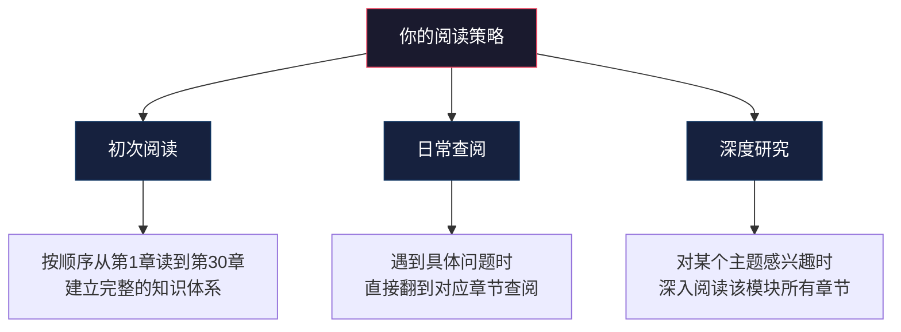

## 写在最后

你刚刚读完了整本书的导读部分。在过去的九节内容中，你了解了这本书的写作初衷、全书结构、六个模块的核心内容、不同读者的学习路径、沟通能力成长的四阶段路线图，以及一套完整的自评和练习体系。

现在，你站在起跑线上。

在你翻到第一章之前，我想和你谈三件事——它们不是技巧，不是方法论，而是关于"改变"本身的真相。

---

### 一、改变不会自然发生，但会自然消失

#### 为什么"知道"不等于"做到"

认知科学中有一个被反复验证的发现：知识的留存率与学习方式密切相关。美国国家训练实验室（National Training Laboratory）的"学习金字塔"研究表明：

| 学习方式 | 两周后知识留存率 |
|---------|----------------|
| 听讲 | 5% |
| 阅读 | 10% |
| 视听结合 | 20% |
| 演示/示范 | 30% |
| 讨论/交流 | 50% |
| 实践/练习 | 75% |
| 教授他人 | 90% |

单纯阅读本书，两周后你可能只记住10%的内容。这不是书的问题，而是人脑的工作方式——**信息不经过反复提取和应用，就会被大脑判定为"不重要"而逐渐遗忘。**

这就是为什么你在导读部分看到的每一个学习建议，都指向同一个方向：**去做。** 沟通日志、学习伙伴、渐进式暴露、21天习惯追踪——这些工具不是"锦上添花"的附加品，而是让知识从纸面走进你肌肉记忆的桥梁。

#### "遗忘曲线"与对抗策略

德国心理学家赫尔曼·艾宾浩斯（Hermann Ebbinghaus）在1885年提出的遗忘曲线揭示了一个残酷的规律：新学的信息在20分钟后遗忘42%，1小时后遗忘56%，6天后遗忘75%。如果不主动干预，你在读完本书一个月后，可能只记得几个模糊的概念。

但遗忘曲线有一个关键的"反转点"——**间隔重复**（Spaced Repetition）。每一次主动回忆，都会拉长遗忘的时间间隔。第一次复习可能让你记住一天，第二次复习让你记住三天，第三次复习让你记住一周，以此类推。

应用到本书的学习中，具体的操作方法是：

间隔复习计划（示例）

读完第1章当天：
  → 合上书，用自己的话写出3个核心要点
  → 找一个真实场景，应用1个技巧

读完第1章的第3天：
  → 回顾自己的笔记，尝试回忆章节框架
  → 检查沟通日志中对应技巧的练习记录

读完第1章的第7天：
  → 不看笔记，口述本章的核心模型
  → 用这个模型分析一个新的沟通场景

读完第1章的第21天：
  → 这个技巧已经成为习惯的一部分
  → 进入稳定维护期

#### 最大的敌人不是"学不会"，而是"不去学"

心理学家罗伯特·科根（Robert Kegan）和丽莎·拉海（Lisa Lahey）在《Immunity to Change》一书中揭示了一个令人不安的事实：人们在面对改变时，表面上有强烈的改变意愿（"我想提升沟通能力"），但潜意识中存在一个"免疫系统"在抵抗改变。

这个"免疫系统"表现为各种看似合理的借口：

- **"我太忙了，等有空再练。"** ——真相是，你永远不会"有空"。时间不会自己腾出来，只能被挤出来。每天5分钟的沟通日志，一周35分钟，一个月140分钟——这点时间足以让你记录20个沟通场景并完成深度复盘。
- **"这些技巧太基础了，我需要更高级的。"** ——真相是，你以为自己已经掌握了基础，但大多数人在做自我评估时存在显著的"能力幻觉"。研究表明，能力最差的人往往对自己的评估最高（达克效应）。在你跳过基础之前，先用一个诚实的自我评估来验证。
- **"我试过了，对我不管用。"** ——真相是，你可能只试了一两次就下了结论。21天习惯养成不是建议，是神经科学的底线。新行为模式需要至少21天的重复才能从"刻意控制"变为"自动反应"。

---

### 二、三个核心原则：真诚、练习、成长

#### 原则一：真诚是一切沟通技巧的根基

市面上有大量"话术"类内容教你"高情商回复模板"、"万能开场白"、"化解尴尬的100句话"。这些内容的问题不在于技巧本身，而在于它们经常被剥离了真诚这个前提。

**没有真诚的沟通，技巧只是伪装。** 而伪装有一个致命缺陷：它不可持续。你可以在一次对话中"表演"出共情和倾听，但如果你内心并不真正关心对方，你的微表情、语气、回应节奏——这些你无法完全控制的非语言信号——迟早会出卖你。

心理学家卡尔·罗杰斯（Carl Rogers）在人本主义心理学中提出的"无条件积极关注"（Unconditional Positive Regard），是所有有效沟通的基石。它的含义不是"赞同对方的一切"，而是"尊重对方作为一个独立个体的存在价值"。

实践方法：

- **在每次对话前，花3秒钟问自己一个问题：** "我此刻的目的是什么？是真正理解对方，还是只想证明自己是对的？"这个问题的答案会直接影响你的倾听质量、语气和非语言表达。
- **区分"真诚"和"直接"。** 真诚是动机层面的——你确实关心对方的感受和需求。直接是表达层面的——你选择不加修饰地说出事实。真诚可以用温和的方式表达（"我注意到你最近似乎不太开心，我想了解发生了什么"），也可以用直接的方式表达（"你今天在会上的态度让我不舒服，我想和你聊聊"）。两者并不矛盾。
- **接受"不完美的沟通"。** 真诚的沟通有时候会让你说出笨拙的话、做出不得体的反应。这没关系。对方需要的不是一个完美的沟通者，而是一个真实的人。

#### 原则二：练习是唯一的捷径

沟通是一种技能，不是一种知识。这两者有本质区别：

| 维度 | 知识 | 技能 |
|------|------|------|
| 获取方式 | 学习/理解 | 练习/重复 |
| 评判标准 | 知道/不知道 | 熟练/不熟练 |
| 衰减速度 | 较慢（理论可以长期记住） | 较快（不练就会退步） |
| 举例 | 知道PREP法则的定义 | 能在3秒内用PREP法则组织一次汇报 |

你可以花一小时读完"主动倾听"的全部理论，但如果你没有在真实对话中练习过，你仍然不会倾听——就像你可以花一小时读完一本游泳教材，但跳进水里仍然会沉下去。

**练习的核心不是"量"，而是"质"。** 安德斯·艾利克森（Anders Ericsson）在"刻意练习"理论中指出，一万小时定律被严重误读了。真正让你从新手变成专家的，不是简单地重复一万小时，而是持续进行有目标、有反馈、有挑战的刻意练习。

在沟通学习中，这意味着：

1. **每次练习都有明确目标。** 不是"今天我要好好沟通"，而是"今天我要在对话中做到不打断对方"。
2. **每次练习都有即时反馈。** 可以是自我观察（对话后回顾自己的表现），也可以是外部反馈（请学习伙伴指出你的盲点）。
3. **每次练习都适度超出现有能力。** 如果你觉得"有点别扭但能做到"，说明难度刚好。如果觉得"太轻松了"，说明需要提升挑战等级。

#### 原则三：追求进步，而非完美

完美主义是沟通提升的最大敌人之一。它以两种方式阻碍你：

**第一种：行动瘫痪。** "我还没准备好""我怕说错""等我再想想怎么说"——结果就是永远不开口。完美主义者往往是最安静的人，因为他们害怕自己说出的任何话都不够完美。

**第二种：过度自我批评。** 一次对话中有一个环节处理得不好，就全盘否定整次沟通。"今天又搞砸了""我果然不适合和人打交道"——这种全有或全无的思维模式，会让你在每次不完美的表现后都退回到起点。

替代完美主义的心态叫做"成长型思维"（Growth Mindset），由斯坦福大学心理学家卡罗尔·德韦克（Carol Dweck）提出。它的核心信念是：**能力不是固定的，而是可以通过努力和练习来发展的。**

具体应用：

- **用"还没"替代"不行"。** 不是"我不擅长处理冲突"，而是"我还没掌握处理冲突的技巧"。一个字的差异，代表了两种截然不同的心理框架。
- **记录进步，而非缺陷。** 沟通日志中不只记录"做得不好的地方"，也要记录"比上次做得好的地方"。进步是可感知的，只要你愿意去看。
- **设定"足够好"的标准，而非"完美"的标准。** "这次汇报领导没有打断我"就是一个值得庆祝的进步，不需要做到"像TED演讲一样精彩"。

---

### 三、你需要知道的最后几件事

#### 本书不是线性的——它是你的工具箱

导读部分给你画了一张从起点到终点的路线图，但这不意味着你必须严格按照顺序阅读。在你开始读正文之前，请记住：

**初次阅读**建议按顺序进行，因为各模块之间有递进关系——倾听能力是表达能力的基础，情绪管理能力是冲突化解的基础。跳过基础直接学高级技巧，效果会大打折扣。

**日常查阅**时可以直接定位到你需要的章节。明天要和客户谈判？翻到谈判技巧那一章。下周要做团队汇报？翻到演讲表达那一章。每个章节都设计为可以独立使用，同时注明了前置知识的链接。

**深度研究**适合那些对某个领域特别感兴趣的读者。比如你发现"冲突化解"对你特别重要，可以深入阅读模块四的所有章节，再加上模块六中的非暴力沟通和教练式沟通。

#### 你的学习系统——工具清单回顾

导读部分介绍了多个工具和模板，在这里做一个完整清单，方便你随时查阅：

| 工具名称 | 用途 | 所在章节 | 建议使用频率 |
|---------|------|---------|------------|
| 沟通风格自测 | 了解你的默认沟通模式 | 第3章 | 开始时做一次，3个月后重测 |
| 倾听能力评估 | 评估倾听中的盲区 | 第6章 | 开始时做一次，每月回顾 |
| 情绪觉察测试 | 评估情绪识别和管理能力 | 第17章 | 开始时做一次，每季度重测 |
| 冲突应对风格测试 | 了解冲突中的默认反应 | 第19章 | 开始时做一次，遇到冲突后复盘 |
| 沟通日志 | 记录每天的沟通观察 | 贯穿全书 | 每天至少1条 |
| 技能练习卡片 | 便携式技能提醒 | 学习期 | 随身携带，对话前快速回顾 |
| 21天习惯追踪表 | 养成新技能习惯 | 学习期 | 每个新技能一份 |
| 挑战性沟通复盘 | 复盘高难度对话 | 应用期 | 每周至少1次 |
| 个人沟通原则体系 | 建立自己的沟通框架 | 内化期 | 每3个月修订一次 |
| 场景检查清单 | 针对具体场景的准备清单 | 内化期 | 每次重要对话前 |

#### 最重要的一句话

如果这本书的全部内容只能浓缩成一句话，那就是：

**沟通能力不是天赋，是技能。技能可以学习，可以练习，可以提升。**

你可以是内向的人，也可以成为优秀的沟通者——内向不是缺陷，它只是意味着你的沟通风格可能更偏向深度倾听和一对一交流，这在很多场景中恰恰是优势。

你可以是"不会说话"的人，也可以成为让人如沐春风的沟通者——"不会说话"不是性格缺陷，它只是说明你还没有找到适合自己的表达框架和练习方法。

你可以是曾经在沟通中受过伤的人，也可以成为建立深度连接的沟通者——过去的失败经历不是你能力的上限，它只是你成长的起点。

---

### 四、从这里开始

导读结束了，旅程正式开始。

以下是你的第一个行动清单——不需要全部做完，从第一个开始：

你的第一步行动清单

□ 1. 完成沟通风格自测（第3章）
   → 了解自己的起点，建立基准线

□ 2. 准备一本沟通日志（纸质或电子均可）
   → 从今天开始，每天记录至少1条沟通事件

□ 3. 找一个学习伙伴
   → 朋友、同事、伴侣都可以
   → 告诉TA你正在读这本书，邀请TA一起学或给你反馈

□ 4. 翻到第1章，开始阅读
   → 不求快，每章读完后合上书，用自己的话复述核心要点

□ 5. 在今天的某次对话中，尝试一个微小的改变
   → 比如：不打断对方、多问一个开放式问题、先确认对方的感受再回应

不需要做得很完美。不需要一次就做对。你只需要去做。

每一次笨拙的尝试，都是在重塑你的神经通路。每一次真诚的对话，都是在为你的人际关系账户存款。每一次从失败中站起来的复盘，都是在为未来的沟通高手打下地基。

祝你在沟通的旅程中，收获更好的关系、更多的机会、更丰盛的人生。

***

*本书导读到此结束。请翻到「[第一章：沟通的本质](../../02-第一章-沟通的本质/_index.md)」，开始你的沟通能力提升之旅。*
