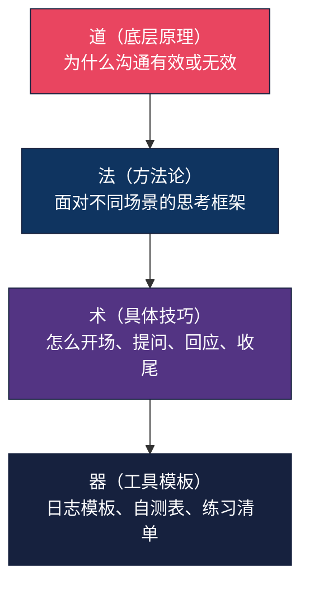
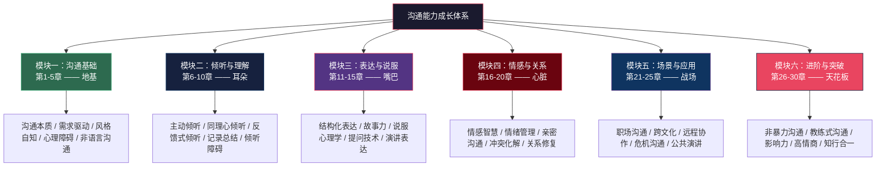

# 前言

## 写在前面的话

亲爱的读者，当你翻开这本书的这一刻，你已经迈出了改变自己的第一步。

也许你是在深夜的台灯下，带着一天社交疲惫后"我今天又说错话了"的自责翻开它；也许你是在书店的书架前，在无数本沟通类书籍中犹豫许久，最终选择了这一本；也许你是被朋友推荐，带着将信将疑的心态点开了这个文档；也许你只是在搜索引擎里输入了"怎么提高沟通能力"这几个字，然后一路摸索到了这里。

无论你是以何种方式来到这里，我想先对你说一句：**欢迎你。**

这不是一本教你"话术"的书，不是一本让你变成"社交达人"的速成手册，更不是一本充满空洞理论的学术著作。这是一本关于**如何更好地理解他人、表达自己、建立连接**的实用指南。它源于生活中无数次真实的沟通困境，也终将回到你的生活中，帮助你化解那些曾经让你困扰的对话时刻。

在正式开始之前，有三件事我想提前和你说清楚：

**第一，这本书不会让你一夜之间变成社交天才。** 沟通能力的提升需要时间、练习和耐心。如果你期望看完就能口若悬河、八面玲珑，那你可能会失望。但如果你愿意花30天认真学、认真练，你会看到真实的、持久的改变。

**第二，这本书里的方法都有科学依据。** 你不会看到"想成功先发疯"这类口号，也不会看到"三个万能话术搞定一切"这类噱头。每一个技巧背后都有心理学、传播学或行为科学的研究支撑，每一个案例都来自真实的沟通场景。

**第三，这本书只需要你做一件事：去练。** 不需要练得很完美，不需要一次就做对——你只需要去做。每一次笨拙的尝试，都是在重塑你的神经通路。

好了，让我们正式开始。

## 为什么要写这本书

沟通，是我们每天都在做的事情。从早上和家人的第一句"早安"，到工作中和同事的邮件往来，再到晚上和朋友的微信聊天——我们无时无刻不在沟通。但矛盾的是，**我们从来没有系统地学习过如何沟通。**

想想看：我们花了十几年学习数学、语文、英语，花了几年学习专业技能，但我们花在"如何与人有效沟通"上的时间有多少？学校里没有这门课，家里也没有人教过我们。我们所有的沟通方式，几乎都是"自学成才"——模仿父母、观察朋友、在无数次碰壁中磕磕绊绊地摸索。

这不是个别现象，而是全球性的教育盲区。世界经济论坛（World Economic Forum）发布的《未来就业报告》中，"沟通能力"连续多年被列为职场最重要的软技能之一，但在全球大多数国家的K-12教育体系中，系统的沟通教育仍然缺位。

这种"自学成才"的结果是什么？

- 你可能在会议上明明有好想法，却总是说不出来，或者说了没人听；
- 你可能在和伴侣吵架时，明明想表达关心，出口却变成了指责；
- 你可能在社交场合中总是找不到话题，只能尴尬地站在角落；
- 你可能在面对领导时紧张得语无伦次，事后懊恼不已；
- 你可能在微信聊天中，反复斟酌一句话改了又删、删了又改；
- 你可能在和父母沟通时，总是三句话就吵起来，事后又后悔。

这些场景，我相信你至少经历过其中一两个。而这些困境的根源，不是你"不会说话"，不是你"情商低"，更不是你"性格有问题"——**你只是从来没有学过沟通的方法。**

哈佛大学一项持续75年的成人发展研究（Harvard Study of Adult Development）得出了一个简洁而深刻的结论：**决定人生幸福的最重要因素，不是财富、名望或成就，而是人际关系的质量。** 而沟通，正是构建和维系人际关系的核心机制。

这本书的写作初衷，就是填补这个空白。我想把那些在心理学研究、沟通学理论、无数实践中被验证有效的沟通方法，用最通俗易懂的方式呈现给你。不是高高在上的理论，不是空洞的心灵鸡汤，而是**你可以立刻拿去用的、切实可行的方法和技巧。**

## 这本书是怎么写出来的

这本书的内容，并非凭空而来。它融合了多个领域的智慧，遵循"道、法、术、器"四个层次的贯通：

**"道"——心理学基础。** 沟通的本质是人与人之间的心理互动。理解人的认知规律、情感模式、心理需求，才能真正理解沟通为什么有时有效、有时失败。本书引用了认知心理学、社会心理学、情感心理学、神经科学等多个分支的研究成果。比如，安东尼奥·达马西奥（Antonio Damasio）的研究证明，情绪系统受损的患者即使智商正常，连"午饭吃什么"这样的简单决定都做不了——这揭示了情感在沟通中的底层驱动作用。

**"法"——经典沟通理论。** 从亚里士多德的修辞学三要素（逻辑、情感、人格），到现代的非暴力沟通理论；从香农的信息论通信模型，到德雷福斯的技能习得五阶段模型——本书站在前人的肩膀上，将那些经过时间检验的经典理论转化为可操作的实践方法。

**"术"——真实实践经验。** 理论再好，如果不能落地就是空谈。本书的每一个技巧，都配有大量来自真实生活和工作场景的案例。这些案例涵盖了职场、社交、亲密关系、家庭、公共演讲等多个维度，确保你能找到与自己处境相似的参考。每个案例都包含了具体的对话、具体的情境和具体的结果，而不是"小明通过沟通解决了问题"这种笼统的描述。

**"器"——工具与模板。** 沟通日志模板、沟通风格自测评估表、场景准备清单、21天习惯追踪表、复盘模板——这些工具帮助你把知识转化为行动，把行动固化为习惯。光是"知道"没有用，你需要一个具体的"抓手"来开始练习。

**持续迭代优化。** 在成书过程中，我们参考了大量读者的反馈和建议，不断调整内容的深度、广度和呈现方式，力求让每一个章节都能真正帮到你。

## 这本书适合谁

市面上的沟通类书籍大致可以分为三类：

| 类型 | 特点 | 典型问题 |
|------|------|----------|
| 话术集锦型 | 收录各种场景的"金句"和"套路" | 知道说什么，但不知道为什么这么说；换个场景就不会了 |
| 理论学术型 | 系统介绍传播学、语言学理论 | 读的时候觉得有道理，用的时候不知道怎么用 |
| 心灵鸡汤型 | 用故事和感悟激励读者 | 感动三天，然后忘记一切 |

本书试图走一条不同的路：**道法术器贯通，理论与实践并重。** 无论你是以下哪一类读者，都能在书中找到适合自己的内容：

**如果你是"沟通小白"——** 不知道怎么和陌生人开口，总是冷场，说话没有逻辑，那么这本书会从最基础的部分开始，一步步教你建立沟通的基本功。你不需要任何前置知识，只需要一颗愿意学习的心。建议从第一模块（第1-5章）开始，按顺序学习。

**如果你是"职场新人"——** 不知道怎么向领导汇报工作，不知道怎么和同事协作，不知道怎么在会议上发言，那么本书的职场沟通章节会给你非常具体的指导。你将学会金字塔原则、PREP法则、电梯演讲等实用工具。建议先读第一模块建立框架，然后重点突破第五章和第三模块（第11-15章）。

**如果你是"社交困难者"——** 害怕社交场合，不会聊天，人际关系紧张，那么本书的倾听和表达章节会帮你打开社交的大门。你会发现，聊天是一项可以训练的技能，而不是某种天生的天赋。建议重点学习第二模块（第6-10章）的倾听技巧。

**如果你是"情感困惑者"——** 和伴侣沟通总是吵架，和家人总是话不投机，那么本书的情感沟通和冲突管理章节会给你全新的视角。你将学会如何表达关心而非指责，如何倾听而非评判，如何修复而非逃避。建议重点突破第四模块（第16-20章）。

**如果你是"管理者/领导者"——** 需要带团队、做决策、处理冲突、对外沟通，那么本书的说服、影响力和教练式沟通章节正是为你准备的。建议重点关注第三模块和第六模块（第26-30章）。

**如果你只是"想变得更好"——** 你并没有什么具体的沟通问题，只是希望自己成为一个更好的沟通者，那么恭喜你，这可能是最好的学习状态。没有焦虑和压力，只有好奇心和成长欲——这样的学习往往效果最好。

**简单来说：只要你和人打交道，这本书就适合你。**

## 本书的核心理念

在开始阅读之前，我想和你分享贯穿全书的三个核心理念。理解了这三个理念，你会发现后续所有内容都更容易吸收和运用。

### 理念一：沟通是一项技能，不是一种天赋

这是本书最重要的前提假设。很多人以为"会说话"是天生的——有些人天生口才好，有些人天生嘴笨。但认知科学的研究告诉我们一个截然不同的事实：**沟通能力90%以上来自后天学习和练习。**

世界上最优秀的演讲家，如马丁·路德·金、乔布斯、奥巴马，他们的演讲能力不是从天而降的。他们花了大量时间学习、排练、改进。乔布斯每次产品发布会前，都要花数周时间反复排练，甚至对每一句过渡语、每一个停顿点都精心设计。奥巴马在成为总统之前，也经历过无数次失败的演讲和艰难的辩论磨练。

心理学家安德斯·艾利克森（Anders Ericsson）的"刻意练习"理论指出：任何技能的习得都遵循相同的路径——明确目标、专注练习、即时反馈、逐步提升难度。沟通能力也不例外。它不是基因决定的，而是可以像学游泳、学开车一样，通过系统的学习和练习来掌握。

所以，不要给自己贴上"我不会说话"的标签。你不是不会，你只是还没学。而你现在正在学。

### 理念二：真诚是沟通的根基

在这个信息爆炸的时代，你可能见过太多"教你说话"的内容——各种话术、套路、公式。有些确实有用，但如果脱离了真诚，这些技巧只会让你变成一个"油腻"的人。

**真正的沟通高手，不是最会说话的人，而是最能让对方感受到真诚的人。**

什么是真诚？真诚不是"有什么说什么"的口无遮拦，也不是"掏心掏肺"的自我暴露。真诚是一种态度：**我真心想要理解你，我尊重你的感受，我愿意和你建立真实的连接。** 当这种态度到位时，即使你的表达不够完美、措辞不够精妙，对方也能感受到你的善意。

本书会教你很多技巧和方法，但请你始终记住：技巧是工具，真诚是灵魂。如果你只能记住一句话，请记住这句：**所有沟通技巧的底层逻辑，都是"我真心想要理解你、连接你"。** 当你不确定该用什么技巧时，回到这个原点，你就不会走偏。

### 理念三：知道和做到之间，隔着一万次练习

读完一本书，和真正掌握书中的技能，是完全不同的两件事。这也是为什么很多人买了无数本"自我提升"的书，生活却没有发生任何改变。

认知心理学中有一个概念叫"知识诅咒"（Curse of Knowledge）——当你理解了一个概念之后，你会觉得它显而易然，难以想象不理解它是什么感觉。沟通类书籍尤其容易陷入这种陷阱：你读到"要学会倾听"，觉得"确实如此"——然后合上书，继续在对话中打断别人。

**沟通能力的提升，只能通过实践来实现。** 就像学游泳，你不可能通过看教学视频就学会游泳——你必须下水。沟通也一样，你必须在真实的对话中去尝试、去犯错、去调整。

本书每章都设计了具体的练习方法，遵循"21天习惯养成"框架——神经科学研究表明，一个新的行为模式从"刻意控制"变为"自动反应"，平均需要21天的重复练习。请你务必去做。不需要做得很完美，不需要一次就做对——你只需要去做。每一次练习，都是在为未来的自己积累能力。

## 本书的结构安排

全书共30章，分为六个模块，构成一个从基础到进阶的完整沟通能力成长体系。你可以把它想象成一座六层的大厦——每一层都建立在前一层的基础之上。

**模块一：沟通基础（第1-5章）—— 地基。** 这是所有沟通能力的起点。你将重新理解"沟通"这件事本身——它不是单向的信息输出，而是一个包含编码、传递、解码、反馈的完整闭环。你将认识到自己的沟通风格和心理盲区，学会解读非语言信号。这五章是所有人的必修课。很多"高级"沟通问题的根源，恰恰在基础认知上。

**模块二：倾听与理解（第6-10章）—— 耳朵。** 古希腊哲学家爱比克泰德说过："我们有两只耳朵一张嘴，就是为了多听少说。"但倾听远不是"少说"那么简单。这一模块将倾听分解为主动倾听、同理心倾听、反馈式倾听等多种模式，每种模式都配有详细的技巧和练习。大多数读者学完这一模块后最大的感受是——"我以前根本没有在听，我只是在等对方说完。"

**模块三：表达与说服（第11-15章）—— 嘴巴。** 有了好的输入（倾听），还需要好的输出（表达）。这一模块聚焦于如何让你的话有结构、有力量、有说服力。从金字塔原则到故事弧线，从修辞学到提问的艺术，你将获得一整套表达工具。核心转变：表达的关键不是"我能说多少"，而是"对方能接收多少"。

**模块四：情感与关系（第16-20章）—— 心脏。** 沟通中最难处理的，往往不是信息本身，而是情感。这一模块深入情感智慧的领域：如何识别和管理自己的情绪？如何在不伤害关系的前提下表达不满？如何在冲突后修复信任？你将学会区分"表达情绪"和"情绪化表达"——前者是健康的沟通，后者是关系的毒药。

**模块五：场景与应用（第21-25章）—— 战场。** 理论再好，也需要在真实场景中验证。这一模块覆盖职场沟通、跨文化沟通、远程协作、危机沟通和公共演讲五大高频场景，每个场景都有针对性的策略和工具。你会发现，不同场景需要的沟通策略可能截然相反——在危机沟通中要"快"，在亲密沟通中要"慢"；在谈判中要"守住底线"，在创意讨论中要"开放一切"。

**模块六：进阶与突破（第26-30章）—— 天花板。** 这是全书的高阶部分，面向已经具备扎实基础的读者。非暴力沟通、教练式沟通、影响力构建、高情商沟通——这些方法将你从"会沟通"推向"沟通高手"。真正的沟通高手，不是在每个场景中都用同一种"最佳"方法，而是能根据情境灵活组合、即时调整。

每一章都遵循统一的内容结构：**概览 → 理论基础 → 核心技巧 → 实战案例 → 常见误区 → 练习方法 → 本章小结**。这种结构确保你不仅能"知道"，更能"做到"。每一章的最后，你都会有一个明确的行动清单，告诉你今天就可以做什么来开始练习。

## 如何使用这本书

**第一步：做一次自测。** 在正式开始学习之前，请先翻到附录中的"沟通能力自测表"，花10-15分钟做一次自我评估。这会帮你了解自己的起点在哪里，哪些方面需要重点提升。评估结果不是用来给自己贴标签的，而是用来制定学习策略的——就像去医院做体检，在开药之前首先要确诊。

**第二步：选择适合你的学习路径。** 如果你是初学者，建议从第一章开始按顺序学习；如果你已经有一定基础，可以直接跳到你最需要的章节。本书还提供了30天学习计划和90天进阶计划，你可以参考执行。详细的路径建议，请阅读下一篇「如何使用本书」。

**第三步：学习一个技巧，就练习一个技巧。** 不要贪多。每周聚焦一个技能，用这一周的时间在所有可能的场景中反复练习。当你觉得这个技能开始变得自然了（通常需要5-7天），再进入下一个。这就像健身——你不会在同一天练完所有部位。专注才能深入。

**第四步：准备一本"沟通日志"。** 这是贯穿全书的核心工具。每天花3-5分钟记录一条沟通事件：今天和谁的对话？我做得好的是什么？可以改进的是什么？对应书中的哪个知识点？下次类似场景我怎么做？这本日志将成为你最宝贵的学习资产——当你回头看时，你会清晰地看到自己的成长轨迹。

**第五步：找一个学习伙伴。** 沟通是双向的技能，一个人闷头练习的效果远不如两个人互相练习。研究表明，有学习伙伴的学习者，坚持率比独自学习者高出3倍以上，技能掌握速度也快40%。如果找不到学习伙伴，至少在每次练习后做一次自我复盘。

**第六步：允许自己"倒退"。** 学习沟通技能的过程不是一条上升的直线，而是一条有起伏的曲线。你可能在某一周觉得自己进步明显，下一周又觉得退步了。这完全正常。认知心理学中的"意识性无能"概念指出：在学习早期，你对问题的觉察力提升速度会快于你的解决能力提升速度。你知道得越多，反而越觉得自己做得不好。这不是退步，而是你的眼光在进步。坚持下去，你会迎来一段快速进步期。

## 常见疑虑：你可能在想的问题

在多年与读者交流的过程中，我发现大多数人翻开这本书时，心里都有一些疑虑。在这里，我直接回答这些疑虑，希望能帮你放下包袱，轻装上阵。

### "我性格内向，能学会沟通吗？"

这是一个非常常见的误解：把沟通能力和性格外向划等号。

事实是：**内向者在沟通中有独特的优势。** 内向者通常更善于倾听、更善于深度思考、更善于一对一的深度交流。世界上最受尊敬的领导者中，有大量内向者——比尔·盖茨、沃伦·巴菲特、蒂姆·库克，都是出了名的内向。沟通能力不是"话多"，而是"有效"。一个善于倾听、说话有分量的内向者，往往比一个滔滔不绝的外向者更有影响力。

本书会帮助你发挥内向者的优势，同时补齐可能的短板（比如在大型场合的表达），而不是试图把你变成另一个人。

### "我年纪大了，还能改变吗？"

神经科学已经证明，大脑具有终身可塑性（neuroplasticity）。无论你是20岁还是60岁，你的大脑都可以通过学习和练习建立新的神经通路。当然，年纪大一些的读者可能需要更多的重复练习来巩固新习惯，但这绝不意味着"来不及了"。

事实上，年纪大的读者往往有一个年轻读者不具备的优势：更丰富的人生阅历。你在多年的沟通实践中积累的"反面教材"——那些失败的对话、错失的机会、伤害过的关系——都是极其宝贵的学习素材。你知道什么方法不管用，这比什么都不知道要强得多。

### "这些技巧会不会让我变得不真诚？"

如果你把技巧理解为"操控对方的手段"，那确实会。但本书教的不是操控术，而是**有效表达的工具**。就像学习写作技巧不会让你的文章变得虚伪一样——技巧只是帮你更好地传递你内心真实的想法。

一个不会写作的人，心里有千言万语却写不出一篇好文章；一个不会沟通的人，心里有真诚的想法却总是被误解。学习沟通技巧的目的，是减少"我想说的"和"对方听到的"之间的差距，让真诚能够真正被对方感受到。

### "我没时间怎么办？"

本书每章的阅读时间约为30-45分钟，练习时间约为每天10-15分钟。如果你实在很忙，可以采用"周末集中学习+工作日碎片练习"的模式：周末花2小时精读一章，工作日每天花10分钟做一个小练习。

更重要的是：**提升沟通能力本身就是一种时间投资的回报。** 职场研究显示，因沟通不畅导致的时间浪费平均占工作时间的17%。假设你每天工作8小时，这意味着你每天有近1.5小时在处理因沟通问题产生的额外工作。花在学习沟通上的时间，很快会通过减少沟通成本赚回来。

## 30天后和90天后的你

写这篇前言的时候，我在想：什么样的人会把前言读完？

大概率，你是一个认真的人。你不是随便翻翻，而是真的想要改变自己的沟通能力。你愿意在正式学习之前花时间了解这本书的理念和方法。这种态度本身，就已经说明你具备了学好沟通最重要的素质——**认真对待每一段对话的意愿。**

我想对你说：**请坚持下去。**

学习沟通的过程不会一帆风顺。你可能会在某次练习中感到尴尬，可能会在某次对话中犯错，可能会在某个阶段觉得自己没有进步。这些都是正常的。每一个沟通高手，都是从无数次笨拙的尝试中成长起来的。

**30天后，你会发现自己的变化。** 你会发现自己在对话中更从容了，发现自己能更好地理解别人的意思了，发现自己在社交场合没那么紧张了。这些变化可能很微小，但它们是真实的、持久的。

**90天后，你会发现自己判若两人。** 沟通能力的提升会带来连锁反应——更好的人际关系、更高的工作效率、更强的自信心、更和谐的家庭关系。你会发现，学会沟通，不仅仅是学会了一项技能，更是打开了一个全新的世界。

最后，我想用一句话来结束这篇前言：

> **"你的语言，就是你的世界。当你改变了说话的方式，你就改变了整个世界对你的回应。"**

准备好开始了吗？翻到下一页，让我们一起踏上这段旅程。

祝你学有所获，愿你的每一句话，都充满力量与温度。

***
*本书作者*
*2026年*

***

> 💡 **提示**：建议在开始正式学习之前，先阅读下一篇「[如何使用本书](全书导读/02-如何使用本书.md)」，了解详细的使用方法和不同读者的阅读路径建议。然后根据你的情况，选择最适合你的学习节奏和路径。
