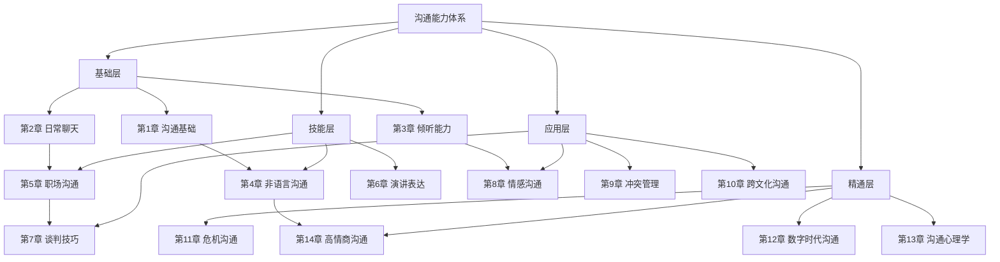

# 如何使用本书

## 快速开始：三步上手

如果你不想通读整篇使用指南，只需记住以下三步：

**第一步**：做一次沟通能力自测 → [能力自测表](../99-附录/能力自测表.md)，了解自己的起点。

**第二步**：根据自测结果，选择适合你的阅读路径（下文有四种路径详解）。

**第三步**：打开第一章，开始阅读。每读完一章，完成至少一个练习。

就这么简单。接下来的内容会帮你更高效地使用本书——但不要让"准备工作"变成拖延的借口。**最好的学习，就是现在就开始。**

---

## 本书的设计理念

### 为什么采用模块化+场景化

本书采用了**"模块化+场景化"**的内容组织方式，这个设计源于两个认知科学原理：

**模块化**：认知心理学家 George Miller 提出的"组块理论"（Chunking Theory）表明，人脑一次只能处理 7±2 个信息单元。本书将每章拆分为独立模块（概览→理论→技巧→案例→误区→练习→小结），每个模块聚焦一个认知目标，降低你的认知负荷。你不需要记住整章的所有内容，只需要在每个模块中抓住核心要点。

**场景化**：教育心理学中的"情境学习理论"（Situated Learning Theory）指出，知识在真实场景中习得时，迁移效果最好。本书所有理论和技巧都紧密围绕真实的沟通场景展开，确保你"学了就能用"——不是背了一堆概念，而是掌握了一套在特定场景下可以调用的行为模式。

### 这种设计对你意味着什么

**核心含义：你不必从头到尾按顺序阅读。** 虽然我们推荐系统学习，但如果你时间有限或有明确的学习目标，完全可以按需跳读。本书的每个章节都是相对独立的模块，不会因为跳过了前面的内容而无法理解后面的内容（第一章除外——它是全书的基础概念层）。

**类比理解**：把本书想象成一个工具箱。每章是一件工具（螺丝刀、扳手、锤子……）。你可以从最常用的工具开始用，也可以按说明书的顺序逐个学习。但无论哪种方式，你都需要先了解工具箱的基本结构——这就是本篇使用指南的目的。

---

## 本书的完整知识体系

在进入具体章节结构之前，先建立一个全局视角。本书 14 章的内容覆盖了沟通能力的完整知识体系：

**四层结构的逻辑**：

- **基础层**（第1-3章）：回答"沟通是什么"和"如何打好基础"。这是一切的起点，跳过基础层直接学高层内容，就像不学音阶直接弹钢琴——勉强能弹，但天花板很低。
- **技能层**（第4-6章）：回答"如何提升单项技能"。掌握非语言信号、职场场景和公众表达这三项核心技能。
- **应用层**（第7-10章）：回答"如何在复杂场景中运用"。谈判、情感、冲突、跨文化——这些都是沟通的"高难度副本"。
- **精通层**（第11-14章）：回答"如何成为沟通高手"。危机应对、数字沟通、心理洞察、高情商——从"会沟通"到"精通沟通"的跃迁。

---

## 每章的结构详解

理解每章的结构，能帮你更高效地获取信息。每章由 7 个标准模块组成，形成"认知→理解→应用→巩固"的完整学习闭环：

### 📋 章节概览（00-章节概览.md）

**阅读时间：5分钟 | 定位：认知层——知道"学什么"**

这是每章的"地图页"，包含：

- 本章的核心主题和学习目标（3-5个可衡量的目标）
- 你将学到的关键技能清单
- 本章的知识框架图（用 mermaid 绘制的可视化结构）
- 阅读前的自省问题（帮你带着问题进入学习）

**使用建议**：每章开始前先读概览，建立整体认知框架。如果你时间有限，概览也能帮你快速判断这章是否是当前最需要学习的。**判断标准**：概览中的自省问题，如果超过一半你回答"是"或"不确定"，就说明这章值得深入学习。

### 📚 理论基础（01-理论基础.md）

**阅读时间：15分钟 | 定位：理解层——知道"为什么"**

这是每章的"为什么"部分，包含：

- 相关的学术理论和研究成果（带出处引用）
- 核心概念的详细解释（用类比和图示降低理解门槛）
- 模型和框架的介绍（如 DISC 模型、非暴力沟通四步法等）
- 理论背后的逻辑链条（为什么 A 导致 B，B 导致 C）

**使用建议**：如果你是"喜欢先理解原理"的人，这部分要仔细读。如果你更喜欢"直接上手做"，可以先跳过，等实践中遇到困惑时再回来查阅。理论不是为了让你背诵，而是为了让你理解"为什么这样做有效"。

**为什么要读理论？** 一个简单的例子：很多人知道"要倾听"，但不知道为什么要倾听、倾听的心理机制是什么。当你理解了"倾听能满足对方的被尊重需求，从而激活互惠原则"这个原理后，你对倾听的理解会从"知道要做"升级为"知道为什么要做以及如何做得更好"。理论给你的是底层操作系统，技巧只是上面运行的 App。

### 🛠️ 核心技巧（02-核心技巧.md）

**阅读时间：15分钟 | 定位：应用层——知道"怎么做"**

这是每章的"怎么做"部分，包含：

- 3-5 个核心沟通技巧（每个技巧有明确的适用场景）
- 每个技巧的具体步骤（第一步做什么、第二步做什么……）
- 实用的话术模板和句式（可直接使用的语言素材）
- 不同场景的变体应用（同一个技巧在不同场景中的微调）

**使用建议**：这是每章最核心的内容。建议仔细阅读，并在笔记本上记录下你最想练习的 2-3 个技巧。不需要一次掌握所有技巧——贪多嚼不烂，选择最适合你的先练起来。

**关键原则**：技巧是"半成品"，需要你根据具体场景进行个性化调整。书中提供的话术模板是"骨架"，你需要填充自己的"血肉"（你的经历、你的语气、你的风格）才能让它真正发挥作用。直接照搬模板的人，往往会觉得"不自然"——这不是技巧的问题，而是你还没有把它变成自己的东西。

### 🎭 实战案例（03-实战案例.md）

**阅读时间：20分钟 | 定位：观察层——看"别人怎么做"**

这是每章的"看别人怎么做"部分，包含：

- 5 个以上真实的沟通场景（覆盖家庭、职场、社交三大场景）
- 每个场景包含"错误示范"和"正确示范"（对比让你看到差异）
- 详细的对话文本和分析（逐句拆解，标注关键转折点）
- 关键转折点的点评（为什么这一句话改变了整个对话走向）

**使用建议**：案例是最好的学习素材，但阅读方式决定了你能从中获得多少。以下是三种阅读深度：

| 深度 | 方法 | 适合场景 |
|------|------|----------|
| 浅读 | 通读对话，了解大概 | 时间紧张时的快速浏览 |
| 精读 | 逐句分析，标注关键句 | 第一次学习某个技巧时 |
| 代入 | 设身处地想"我会怎么说"，然后对比 | 巩固理解和建立直觉时 |

**最有效的学习方法**：把案例中的对话大声读出来，感受语言的节奏和力量。沟通是"听觉+视觉"的艺术，光用眼睛看，你只能学到 30%；用嘴巴说出来，你能学到 70%；在真实场景中用出来，才是 100%。

### ⚠️ 常见误区（04-常见误区.md）

**阅读时间：10分钟 | 定位：防护层——知道"什么不能做"**

这是每章的"避坑指南"，包含：

- 5 个最常见的沟通误区（来自大量真实案例的归纳）
- 每个误区的错误示范和正确做法（对比让你一目了然）
- 误区背后的心理原因（为什么人会不自觉地掉入这个坑）
- 如何避免掉入误区的具体策略

**使用建议**：误区部分的价值不亚于技巧部分。很多人沟通效果不好，不是因为不知道正确做法，而是因为不自觉地掉入了误区。阅读时对照自己的日常习惯，逐条检查：这个误区我是否中过？中过几次？最近一次是什么时候？

**一个反直觉的真相**：减少错误比增加技巧更能快速提升沟通效果。研究发现，人际关系中的负面事件（一次伤人的话）需要 5-7 次正面事件（七次暖心的话）才能抵消。这意味着，避免说错话的优先级，应该高于学习新技巧。

### 🏋️ 练习方法（05-练习方法.md）

**阅读时间：10分钟 | 定位：实践层——动手"做起来"**

这是每章的"实操训练"部分，包含：

- 3-5 个具体可执行的练习任务（每个任务有明确的完成标准）
- 每个练习的难度等级（⭐入门 / ⭐⭐进阶 / ⭐⭐⭐挑战）和预计时间
- 练习的步骤说明（从准备到执行到复盘的完整流程）
- 进阶练习和变体（掌握基础后如何提高难度）

**使用建议**：**这是全书最重要的部分之一。** 如果你只读理论和技巧而不做练习，效果会大打折扣——研究显示，被动阅读的知识留存率仅为 10%，而主动练习的知识留存率可达 75%。每天选择一个练习，花 10-20 分钟去做。不需要做到完美，重要的是开始做。

### 📝 本章小结（06-本章小结.md）

**阅读时间：5分钟 | 定位：巩固层——记住"核心要点"**

这是每章的"复习卡片"，包含：

- 本章的核心要点回顾（5-8 个关键点，每点一句话概括）
- 3-5 个最值得记住的金句（浓缩的智慧，适合反复阅读）
- 下一步行动建议（学完这章后，你接下来该做什么）
- 与其他章节的关联（这一章的知识如何与前后章衔接）

**使用建议**：学完一章后，先不要急着进入下一章。花 5 分钟读一下小结，巩固记忆。根据艾宾浩斯遗忘曲线，学习后 24 小时内不复习，你会遗忘约 70% 的内容。小结就是你的"防遗忘盾牌"。你也可以把小结打印出来，贴在显眼的地方，作为日常提醒。

---

## 四种阅读路径详解

不同的读者有不同的起点、目标和时间约束。本书提供四种阅读路径，选择最适合你的那一种。

### 🌱 路径一：零基础系统学习（推荐）

**适合人群**：沟通能力自测得分较低，或者完全没有系统学习过沟通知识的人。你可能经常遇到"不知道说什么""说了但对方不理解""总是把天聊死"等基础问题。

**学习方式**：按顺序从第 1 章读到第 14 章，每章花 1-2 天时间。

**30 天详细安排**：

| 阶段 | 时间 | 章节内容 | 阶段目标 | 完成标志 |
|------|------|----------|----------|----------|
| 基础建设 | 第 1-7 天 | 第 1-3 章 | 理解沟通本质，掌握日常聊天和倾听 | 能和陌生人自然聊天 5 分钟以上 |
| 技能提升 | 第 8-14 天 | 第 4-6 章 | 读懂非语言信号，适应职场和公开场合 | 能做一次 3 分钟的即兴发言 |
| 场景应用 | 第 15-21 天 | 第 7-10 章 | 处理谈判、情感、冲突等复杂场景 | 在一次冲突中成功运用非暴力沟通 |
| 精通进阶 | 第 22-28 天 | 第 11-14 章 | 应对危机、数字沟通、心理洞察 | 能识别并应对三种以上沟通陷阱 |
| 总结巩固 | 第 29-30 天 | 复习+附录 | 查漏补缺，制定长期练习计划 | 完成二次自测，对比进步 |

**每日学习流程**（总用时约 50 分钟）：

🌅 早晨（10分钟）
   → 阅读当天章节的章节概览和理论基础
   → 目的：建立认知框架，理解"为什么"

🌞 中午（15分钟）
   → 阅读核心技巧，记录想练习的方法（2-3 个）
   → 目的：获取具体工具，明确"怎么做"

🌙 晚上（20分钟）
   → 阅读案例和误区，完成当日练习任务
   → 目的：观察示范，动手实践

🌜 睡前（5分钟）
   → 回顾本章小结，写沟通成长日志
   → 目的：巩固记忆，反思改进

### 🎯 路径二：目标导向重点突破

**适合人群**：有明确的沟通痛点，希望快速解决特定问题的人。你可能在某一方面表现不错，但在某个特定场景中遇到了瓶颈。

**学习方式**：根据你的具体需求，直接跳到相关章节学习。

**需求-章节精准对照表**：

| 你的痛点 | 典型表现 | 优先学习 | 补充学习 | 预计改善周期 |
|----------|----------|----------|----------|-------------|
| 不会和人聊天，总是冷场 | 说完"你好"就不知道说什么了 | 第 2 章：日常聊天 | 第 4 章：非语言沟通 | 2-3 周 |
| 和伴侣/家人总是吵架 | 说着说着就变成互相指责 | 第 8 章：情感沟通 | 第 9 章：冲突管理 | 3-4 周 |
| 职场汇报说不清楚 | 领导总是追问"所以你想表达什么" | 第 5 章：职场沟通 | 第 1 章：沟通基础 | 2-3 周 |
| 害怕公开演讲 | 上台前紧张到手抖、忘词 | 第 6 章：演讲表达 | 第 14 章：高情商沟通 | 4-6 周 |
| 谈判总是吃亏 | 不知道怎么争取自己的利益 | 第 7 章：谈判技巧 | 第 9 章：冲突管理 | 3-4 周 |
| 微信/邮件总被误解 | 对方经常理解错你的意思 | 第 12 章：数字时代沟通 | 第 5 章：职场沟通 | 1-2 周 |
| 社交场合紧张焦虑 | 聚会时只想躲在角落 | 第 2 章：日常聊天 | 第 13 章：沟通心理学 | 3-4 周 |
| 不知道怎么拒绝别人 | 明明不愿意却总是答应 | 第 1 章：沟通基础 | 第 9 章：冲突管理 | 2-3 周 |
| 领导力沟通不足 | 团队执行力差，指令传达不到位 | 第 5 章：职场沟通 | 第 7 章：谈判技巧 | 3-4 周 |
| 和外国同事沟通困难 | 文化差异导致误会频发 | 第 10 章：跨文化沟通 | 第 12 章：数字时代沟通 | 2-3 周 |

**四周学习节奏**：

- **第 1 周**：深入学习目标章节，完成所有练习，建立基础认知
- **第 2 周**：学习补充章节，理解关联知识，扩展技能边界
- **第 3 周**：持续练习，在真实场景中反复应用，形成肌肉记忆
- **第 4 周**：回顾总结，评估进步，制定后续保持计划

### ⏱️ 路径三：碎片化渐进学习

**适合人群**：时间非常有限，每天只能挤出 30 分钟左右的学习时间。你可能是上班族、宝妈宝爸、或者正在备考的学生。

**学习方式**：每天只读一个小节（约 10 分钟），利用碎片时间逐步积累。

**碎片时间利用方案**：

| 时间段 | 时长 | 学习内容 | 学习方式 |
|--------|------|----------|----------|
| 通勤时间 | 10-15 分钟 | 理论基础或核心技巧 | 手机阅读，用便签记录要点 |
| 午休时间 | 10 分钟 | 实战案例 | 阅读对话，内心模拟"我会怎么说" |
| 睡前时间 | 10-15 分钟 | 练习任务 + 本章小结 | 完成一个练习，回顾当日要点 |

**时间估算**：按每天 10-15 分钟的节奏，约 90 天可以完成全书学习。虽然时间长一些，但"持续学习"比"突击学习"的效果更好——行为心理学研究表明，每天坚持的小习惯，其长期效果远超偶尔的大强度训练。沟通能力的提升需要时间来沉淀和内化，90 天的节奏恰好符合"习惯养成周期"（通常需要 66 天）。

**碎片学习的三个关键策略**：

1. **锚定触发器**：把学习绑定到已有的日常行为上。例如"每次坐地铁就打开一个章节"，这样你不需要额外的意志力来启动学习。
2. **微笔记法**：每次学习后，在手机备忘录中写一句话总结。例如"今天学到：倾听的 OARS 模型——Open question, Affirm, Reflect, Summarize"。一周后回看这些微笔记，你会发现记忆被大幅强化。
3. **场景预演**：在碎片时间里，想象一个你即将遇到的沟通场景（例如下午的会议、晚上的家庭对话），在脑海中预演如何运用当天学到的技巧。这种"心理模拟"的效果接近真实练习。

### 🏢 路径四：团队共学

**适合人群**：希望和同事、朋友或学习小组一起提升沟通能力的人。特别适合企业内部培训、读书会、或朋友互助学习。

**学习方式**：组建 3-8 人的学习小组，每周学习一章，定期讨论和练习。

**每周安排**：

| 日期 | 活动 | 时间 | 具体内容 |
|------|------|------|----------|
| 周一 | 个人预习 | 30 分钟 | 阅读章节概览和理论基础，带着问题来 |
| 周三 | 个人学习 | 30 分钟 | 阅读技巧和案例，标记想讨论的内容 |
| 周五 | 小组聚会 | 60-90 分钟 | 讨论心得 + 角色扮演练习 + 互相反馈 |
| 周末 | 个人实践 | 20 分钟 | 完成练习任务，记录实践心得 |

**团队共学的额外价值**：

- **互相练习**：和组员进行角色扮演，模拟书中的案例场景。这种"安全环境中的练习"能大大降低你在真实场景中的紧张感。
- **多元视角**：不同的人对同一个案例会有不同的理解，讨论能拓宽你的视野。
- **互相监督**：团队学习的坚持率（约 70%）远高于个人学习（约 30%）。
- **即时反馈**：你练习时的表现，组员可以给你真实的反馈——这是独自学习时无法获得的。

**小组聚会的推荐流程**：

1. 暖场（5分钟）
   → 每人分享本周的一个沟通成功/失败经历

2. 知识回顾（15分钟）
   → 每人用 1 分钟总结本章最触动自己的一个点
   → 小组讨论：这个知识点在我们的工作/生活中如何应用？

3. 角色扮演（30分钟）
   → 选择 2-3 个案例场景，两人一组进行角色扮演
   → 其他组员观察并记录：做得好的地方 + 可以改进的地方
   → 每轮结束后，所有人分享观察和建议

4. 行动承诺（10分钟）
   → 每人写下下周要在真实场景中尝试的一个技巧
   → 小组互相"签约"，下周汇报执行情况

5. 总结（5分钟）
   → 记录讨论要点和下周任务

---

## 如何高效练习

练习是本书的核心价值所在。以下是经过验证的高效练习方法论。

### 练习的四个原则

**原则一：从简单开始，循序渐进。** 不要一上来就挑战最难的场景。练习的难度阶梯应该是：

Level 1（安全区）：和家人、伴侣的日常对话
    ↓
Level 2（舒适区边缘）：和朋友、同事的非正式交流
    ↓
Level 3（挑战区）：职场会议、客户沟通等正式场景
    ↓
Level 4（高压区）：冲突处理、谈判、公开演讲等高难度场景

每个级别至少练习 1-2 周，确保在当前级别基本自如后，再进入下一级别。

**原则二：每天练一点，比一周练一次效果好。** 沟通能力的提升就像健身——每天练 30 分钟，比一周练一次 3 小时效果好得多。原因有二：第一，短时高频的练习更符合大脑的记忆巩固机制（睡眠期间的记忆重组需要重复刺激）；第二，每天练习意味着你每天都在真实场景中应用，这种"即时迁移"是知识内化的关键。

**原则三：记录你的进步。** 准备一个"沟通成长日志"，每天花 2 分钟记录四个维度：

| 维度 | 记录内容 | 为什么要记录 |
|------|----------|-------------|
| 今日练习 | 今天练习了什么技巧？ | 追踪练习覆盖度，避免重复 |
| 应用场景 | 在什么场景中练习的？ | 建立"场景-技巧"的关联记忆 |
| 效果评估 | 效果如何？对方反应如何？（1-5 分） | 量化进步，增强成就感 |
| 改进方向 | 下次可以怎么改进？ | 形成持续优化的闭环 |

**原则四：不怕犯错，拥抱不适感。** 练习的过程中一定会犯错——这恰恰是最好的学习机会。神经科学研究表明，犯错时大脑产生的"错误信号"（Error-Related Negativity）正是神经通路重塑的触发器。换句话说，每一次"说错了"的经历，都在物理层面改造你的大脑，让下一次"说对了"更有把握。

### 每日练习模板

以下是一个每日练习的模板，你可以根据自己的情况调整：

📋 今日沟通练习计划

📅 日期：____年____月____日
📖 今日学习内容：第___章 第___节

🎯 今日练习目标：运用________________技巧

📍 计划练习场景：
   □ 工作中的某次对话
   □ 和家人/朋友的交流
   □ 社交场合
   □ 线上沟通（微信/邮件/电话）

📝 练习记录（完成后填写）：
   实际场景：________________
   使用的技巧：________________
   效果评估：① ② ③ ④ ⑤（1=很差，5=很好）
   对方反应：________________
   下次改进：________________

💡 今日感悟：________________

### 进阶练习法：刻意练习三板斧

当你完成了基础练习，想进一步提升时，可以使用以下三种进阶方法：

**方法一：录像复盘法。** 用手机录下自己的一次沟通（提前征得对方同意），然后回看录像，从旁观者角度审视自己的表现。你会惊讶地发现很多自己意识不到的问题——语速过快、频繁使用口头禅、眼神回避等。每周录一次，一个月后对比第一次和第四次的录像，你会看到明显的进步。

**方法二：渐进超负荷法。** 借鉴健身中的"渐进超负荷"原则，逐步增加练习难度。例如：
- 第 1 周：和一个朋友练习新技巧
- 第 2 周：和两个不太熟的朋友练习
- 第 3 周：在小组会议中练习
- 第 4 周：在正式场合中练习

**方法三：跨场景迁移法。** 同一个技巧，在不同场景中练习。例如"积极倾听"这个技巧，你可以分别在以下场景中练习：和伴侣的晚餐对话、和同事的工作讨论、和父母的电话沟通、和朋友的聚会聊天。每个场景的沟通风格不同，你需要灵活调整技巧的应用方式——这种"变式练习"能让你真正掌握技巧的精髓，而不是只会一种固定套路。

---

## 配合附录使用

本书附录提供了几个非常实用的工具，建议配合正文使用：

| 附录工具 | 使用时机 | 使用方法 |
|----------|----------|----------|
| 沟通能力自测表 | 学习前 + 学习后 | 各做一次，对比两次得分，量化你的进步 |
| 30 天提升计划 | 开始学习时 | 详细的每日学习任务，帮你坚持到底 |
| 推荐书单 | 学习中 + 学习后 | 想深入某个主题时，参考推荐的书籍 |
| 工具清单 | 学习中 | 各种实用的沟通工具和模板，随时查阅 |
| 金句收藏 | 任何时候 | 值得反复品味的沟通智慧，适合碎片时间阅读 |

---

## 常见问题解答

### Q1：我按照书里的方法做了，但感觉很不自然怎么办？

这非常正常。任何新技能的学习，一开始都会觉得"不自然"——心理学称之为"有意识无能"阶段（Conscious Incompetence）。想想你第一次学骑自行车的感觉——僵硬、紧张、随时可能摔倒。但现在呢？你骑车时甚至不需要思考。

沟通技巧的学习遵循"四阶段模型"：

| 阶段 | 状态 | 感受 | 持续时间 |
|------|------|------|----------|
| 无意识无能 | 不知道自己不会 | "我觉得我说得挺好的" | 学习前 |
| 有意识无能 | 知道自己不会了 | "怎么这么多我不知道的" | 刚开始学习 |
| 有意识有能 | 知道自己会了，但需要刻意 | "我在用技巧，感觉有点假" | 练习 1-3 周 |
| 无意识有能 | 自然地会了 | "这就是我的沟通方式" | 练习 3 周以上 |

你现在处于第二或第三阶段，这恰恰说明你在进步。**坚持 3 周，你会感受到明显的变化。** 当技巧变成习惯，"不自然"的感觉会完全消失。

### Q2：我学了很多技巧，但一到关键时刻就忘了怎么办？

这说明你还没有把这些技巧内化为习惯。根本原因是"认知带宽"问题——高压力场景下，你的大脑被焦虑占据，没有多余的"内存"来调用新学的技巧。

解决方案：

1. **减少同时学习的技巧数量**。一次只专注练习 1-2 个技巧，练熟了再学新的。试图一次掌握 10 个技巧，结果一个都用不出来。
2. **在低压力场景中反复练习**。先在和家人、好友的对话中练习，等熟练到"不需要思考就能用"的程度，再用在高压力场景中。
3. **设置环境触发器**。把想练习的技巧写在便签纸上，贴在手机壳上或电脑屏幕旁边。在特定场景出现前，先看一眼便签，给大脑一个"预加载"信号。
4. **建立"关键词锚点"**。给每个技巧起一个简短的关键词（例如"三明治反馈法"→ 三明治），在关键时刻默念这个词，就能快速调用整个技巧的步骤。

### Q3：对方不配合怎么办？我用书里的方法，但对方没有好的回应。

沟通是双向的。你只能控制自己的行为，无法控制对方的回应。但这并不意味着你的努力是白费的——**你改变了自己这一端的 50%，就已经大幅提升了沟通成功的概率。**

另外，请检查以下几个方面：

- **真诚度检查**：你是否在"真诚地"使用技巧，还是在"机械地"套用话术？技巧只是工具，如果脱离了真诚和善意，对方是能感受到的。人类对"真诚"的感知能力远超你的想象——研究表明，人们能在 30 秒内判断对方是否真诚。
- **时机检查**：你是否在对方情绪激动时试图"运用技巧"？当对方处于强烈情绪中时，任何技巧都可能被解读为"你在套路我"。此时最有效的方法是：先倾听，先共情，等对方情绪平复后再沟通。
- **期望检查**：你是否期望"一招见效"？沟通是一个渐进的过程，你改变了 10 次，对方可能只感知到 3 次。但第 11 次，改变可能会突然显现。保持耐心。
- **匹配度检查**：你选择的技巧是否适合这个特定的沟通对象？不同的人有不同的沟通偏好——有人喜欢直接，有人喜欢委婉，有人需要时间消化。观察对方的风格，调整你的策略。

### Q4：这本书的内容会不会过时？

沟通的核心原理——真诚、倾听、尊重、共情——是永恒的，不会因为时代变化而过时。本书中的理论基础大多来自几十年甚至上百年的经典研究（如卡尔·罗杰斯的"无条件积极关注"、马歇尔·卢森堡的"非暴力沟通"、保罗·艾克曼的"微表情研究"），经得起时间考验。

当然，关于数字时代沟通的部分（第 12 章）可能会随着技术发展需要更新——例如 AI 辅助沟通、虚拟现实社交等新兴领域。但即使技术在变，人与人之间的基本需求是不变的：**被理解、被尊重、被关心。** 这三个需求从人类诞生之日起就存在，到人类灭亡之日也不会消失。

### Q5：我需要把整本书都学完吗？

不一定。以下是两种情况的建议：

**只学部分章节**：如果你有明确的学习目标（例如"我只想改善和伴侣的沟通"），可以只学习相关的章节。但建议至少也读一下第 1 章（沟通基础），因为它是所有其他章节的概念基础。

**通读全书**：如果你想全面提升沟通能力，建议至少通读一遍所有章节。即使某些章节不是你当前的重点，它们也会帮你建立更完整的沟通认知框架。而且，你可能会发现一些你之前没有意识到的问题——很多人在读完"常见误区"部分后才意识到，自己一直在不知不觉中犯某些错误。

### Q6：学习过程中遇到瓶颈期怎么办？

瓶颈期是学习任何技能的必经阶段。在沟通学习中，瓶颈期通常表现为：感觉自己已经知道了很多，但在实际应用中进步变慢了。

突破瓶颈的三个策略：

1. **回归基础**：重新阅读理论基础部分，你可能会发现第一遍遗漏的细节。
2. **换一个练习场景**：如果你一直在职场场景中练习，试试在社交场景中练习。新的场景会激活新的学习。
3. **找一个练习伙伴**：一个人练习容易陷入盲区，有人给你反馈，往往能发现你忽略的问题。

### Q7：如何衡量自己的进步？

进步是可量化的。以下是几种衡量方式：

| 衡量维度 | 具体指标 | 测量方法 |
|----------|----------|----------|
| 自我评估 | 沟通能力自测分数 | 学习前后各做一次，对比得分 |
| 行为计数 | 每周主动发起对话的次数 | 记录在成长日志中 |
| 反馈收集 | "你觉得我最近沟通有变化吗？" | 每月问 3 个亲近的人 |
| 场景成功率 | 在特定场景中的成功次数/总次数 | 例如：10 次汇报中有 7 次获得正面反馈 |
| 内在感受 | 沟通前的焦虑程度（1-10） | 自我评分，观察变化趋势 |

---

## 写在最后

使用指南到此结束。现在，你已经了解了：

- 本书的设计理念和知识体系
- 每章的七模块结构及其学习方法
- 四种阅读路径的选择方法
- 高效练习的方法论和模板
- 常见问题的解答

接下来，请选择适合你的路径，开始你的学习之旅吧！

**快速入口**：

- 还没做自测？→ [能力自测表](../99-附录/能力自测表.md)
- 已经准备好了？→ [第 1 章：沟通基础](../02-第一章-沟通基础/00-章节概览.md)
- 想要 30 天学习计划？→ [学习路径](学习路径.md)

**记住：最好的学习，就是现在就开始。** 不要等到"准备好了"才开始——你永远不会觉得自己"完全准备好了"。翻开第一章，读五分钟，这就是最好的开始。

***

> 💡 **小贴士**：建议把这篇使用指南收藏起来，在学习过程中随时回来查阅。当你感到迷茫或失去动力时，重读"设计理念"和"常见问题"两个部分，它们会帮你重新找到方向。每完成一个阶段，也建议回来重读一次——你会发现自己对指南内容的理解在不断深化。
