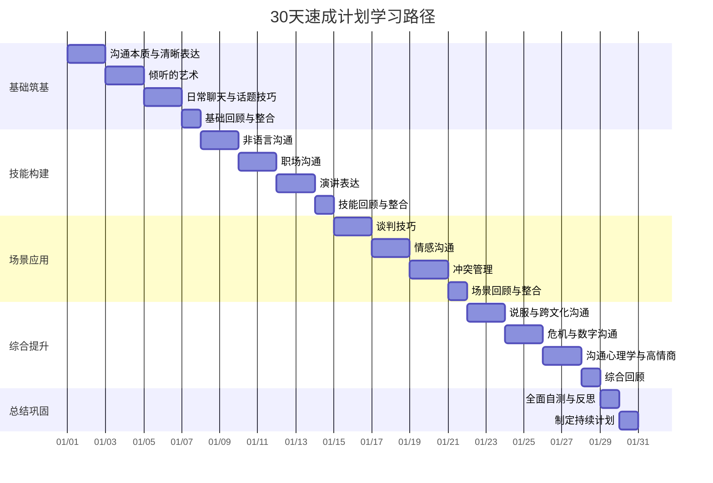
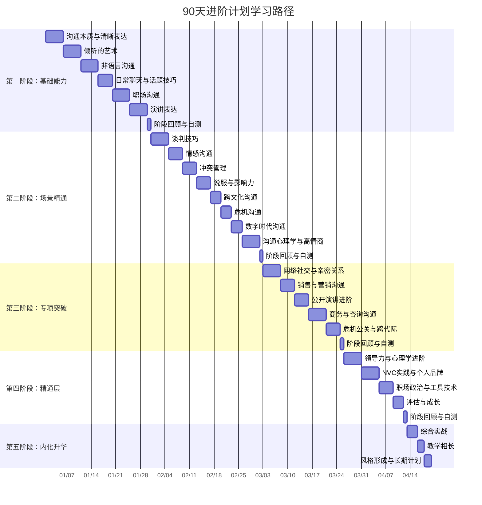

# 学习路径

## 前言：为什么需要学习路径

学习沟通技能，最怕的不是"学不会"，而是"不知道怎么学"和"坚持不下去"。

很多人买了一堆沟通类书籍，看了几页就放下了；或者看了很多内容，但没有系统地练习，最后什么都记不住。这不是因为你不够聪明或不够努力，而是因为**缺少一个清晰的、可执行的学习计划。**

本篇提供了三个学习计划：

- **30天速成计划**：适合时间紧迫、希望快速掌握核心沟通能力的人
- **90天进阶计划**：适合希望系统性地全面提升、达到精通水平的人
- **混合方案**：灵活组合，适合大多数人的实际情况

每个计划都经过精心设计，确保你在有限的时间内获得最大的学习效果。请根据自己的时间和目标选择适合的计划。

在选择计划之前，建议先做一次 [沟通能力自测](../99-附录/能力自测表.md)，了解自己的起点。30天或90天后再次自测，你会惊喜于自己的进步。

---

## 学习科学：计划背后的设计原理

在展开具体计划之前，有必要理解这些计划为什么这样设计。它们不是随意编排的，而是基于认知科学的实证研究成果。

### 三大核心学习原理

#### 原理一：间隔重复（Spaced Repetition）

德国心理学家赫尔曼·艾宾浩斯（Hermann Ebbinghaus）在1885年发现了著名的"遗忘曲线"——人在学习新知识后，如果不复习，24小时内会遗忘约70%的内容。但如果你在关键时间点复习，遗忘速度会大幅降低。

间隔重复的核心策略：

| 复习时间点 | 做什么 | 在本计划中的体现 |
|-----------|--------|----------------|
| 学习后10分钟 | 快速回忆核心要点 | 每日学习结束后的"3分钟回顾" |
| 当天晚上 | 不看笔记，尝试回忆 | "沟通成长日志"中的当日总结 |
| 第2天 | 快速浏览昨天的笔记 | 新一天学习前的5分钟回顾 |
| 第1周末 | 综合复习本周内容 | 每周末的"周回顾"环节 |
| 第4周 | 回顾整个月的要点 | 阶段自检清单 |

这就是为什么计划中设置了"复习日"和"周回顾"——不是为了凑天数，而是为了让知识真正进入长期记忆。

#### 原理二：刻意练习（Deliberate Practice）

心理学家安德斯·艾利克森（Anders Ericsson）提出了"刻意练习"理论，核心观点是：**单纯的重复不会带来进步，只有有针对性的、有反馈的、超出舒适区的练习才能提升能力。**

刻意练习的四个要素及其在学习计划中的应用：

| 要素 | 含义 | 学习计划中的做法 |
|------|------|-----------------|
| 明确目标 | 每次练习聚焦一个具体技能 | 每天的学习任务都有明确的练习焦点 |
| 适度挑战 | 练习难度略高于当前能力 | 从简单场景（日常聊天）到复杂场景（谈判冲突）递进 |
| 即时反馈 | 练习后立即知道对错 | "自检清单"提供客观评估标准 |
| 反复修正 | 根据反馈不断调整 | "常见误区"章节帮助你识别和纠正错误 |

#### 原理三：情境学习（Situated Learning）

教育学家让·拉夫（Jean Lave）和艾蒂安·温格（Etienne Wenger）提出：知识在真实情境中习得时，迁移效果最好。换句话说，**在真实场景中学到的东西，比在书桌前背下来的东西更有用。**

这就是为什么计划中的每一个理论学习都搭配了一个真实场景的练习任务。你不是在"学沟通"，而是在"在沟通中学沟通"。

### 学习曲线：你会经历的四个阶段

学习任何技能都不是线性上升的。沟通能力的提升遵循一条典型的"S型曲线"：


| 阶段 | 时间 | 典型感受 | 关键行动 |
|------|------|---------|---------|
| 蜜月期 | 第1-2周 | "原来沟通有这么多学问！" | 保持好奇心，广泛吸收 |
| 瓶颈期 | 第3-4周 | "道理我都懂，但做起来好别扭" | 坚持练习，这是正常的"技能阵痛" |
| 突破期 | 第5-8周 | "我开始能在真实场景中用出来了" | 加大练习频率，挑战更难的场景 |
| 内化期 | 第9-12周 | "不用刻意想，自然而然就做了" | 从"刻意运用"过渡到"本能反应" |

**关键认知：瓶颈期不是退步，而是进步的信号。** 当你感到别扭和不适时，说明你的大脑正在建立新的神经通路。大多数人在这个阶段放弃，回到旧习惯——但如果你坚持过去，突破就在眼前。

---

## 开始之前：你的起点在哪里

在选择计划之前，花5分钟做一个快速的自我诊断。这能帮你更有针对性地安排学习重点。

### 快速能力诊断

请诚实评估自己在以下八个维度的水平（每项1-10分）：

| 维度 | 1-3分（薄弱） | 4-6分（一般） | 7-10分（较强） |
|------|-------------|-------------|--------------|
| **倾听能力** | 经常打断别人，听不进不同意见 | 能听完但容易走神 | 能深度倾听，理解言外之意 |
| **口头表达** | 说话没重点，经常跑题 | 能表达清楚但缺乏感染力 | 条理清晰，有说服力 |
| **非语言沟通** | 不注意自己的肢体语言 | 知道重要但运用不够自然 | 能自如运用非语言信号 |
| **情绪管理** | 容易被情绪控制 | 能意识到但控制不住 | 能在压力下保持冷静 |
| **冲突处理** | 回避冲突或激化冲突 | 能处理简单冲突 | 能化解复杂矛盾 |
| **共情能力** | 难以理解他人的感受 | 能理解但回应不够恰当 | 能准确感知并有效回应 |
| **社交能力** | 社交场合紧张不自在 | 能应付基本社交 | 能自如建立新关系 |
| **说服影响力** | 说服别人很困难 | 偶尔能说服，缺乏方法 | 有策略地影响他人 |

**评分解读**：

- **总分 8-24分**：沟通基础较薄弱，建议选择30天计划或90天计划，从头系统学习
- **总分 25-48分**：有一定基础但存在明显短板，建议选择90天计划，重点突破薄弱项
- **总分 49-64分**：基础扎实，可以选择30天计划快速查漏补缺，或针对特定场景精进
- **总分 65-80分**：沟通能力较强，建议跳过基础章节，直接进入高级场景和专项突破

### 根据目标选择学习重点

不同的沟通目标决定了你需要重点学习的章节：

| 你的核心目标 | 重点章节 | 建议路径 |
|-------------|---------|---------|
| 职场晋升 | 第5章（职场沟通）、第6章（演讲表达）、第20章（商务沟通）、第24章（沟通与领导力） | 技能层→应用层 |
| 人际关系改善 | 第3章（倾听）、第8章（情感沟通）、第9章（冲突管理）、第17章（亲密关系沟通） | 基础层→应用层 |
| 社交能力提升 | 第4章（日常聊天）、第3章（非语言沟通）、第16章（网络社交沟通） | 基础层→技能层 |
| 销售与营销 | 第10章（说服与影响力）、第18章（销售与营销沟通）、第20章（商务沟通） | 应用层→专业层 |
| 领导力发展 | 第24章（沟通与领导力）、第25章（沟通心理学进阶）、第29章（职场政治与沟通） | 精通层→专业层 |
| 全面提升 | 按计划顺序学习全部30章 | 完整学习路径 |

---

## 📅 30天速成计划

### 总体目标

在30天内，建立沟通的基本认知框架，掌握核心沟通技巧，能够在日常生活中有意识地运用所学方法。

### 设计原则

- **聚焦核心**：从30章中精选最高优先级的内容，确保每天的学习都能带来实际能力提升
- **理论+练习并行**：每天的学习都包含"输入"（阅读理论）和"输出"（实践练习），避免"只看不练"
- **节奏可控**：每天投入40-60分钟，适合工作繁忙的上班族

### 章节覆盖

30天计划覆盖本书的核心章节（第1-14章），这些章节构建了沟通能力的基础框架。高级章节（第15-30章）留待90天计划或后续精进。

### 阶段划分

| 阶段 | 天数 | 对应章节 | 主题 | 核心目标 |
|------|------|---------|------|---------|
| 第一阶段 | 第1-7天 | 第1-3章 | 基础筑基 | 理解沟通本质，掌握倾听和日常聊天的基本技巧 |
| 第二阶段 | 第8-14天 | 第4-6章 | 技能构建 | 掌握非语言沟通、职场沟通和演讲表达 |
| 第三阶段 | 第15-21天 | 第7-9章 | 场景应用 | 在谈判、情感沟通和冲突管理中灵活运用 |
| 第四阶段 | 第22-28天 | 第10-14章 | 综合提升 | 掌握说服、跨文化、危机、数字沟通和高情商沟通 |
| 第五阶段 | 第29-30天 | 全书回顾 | 总结巩固 | 回顾反思，制定持续计划 |



### 详细日程安排

#### 第一阶段：基础筑基（第1-7天）

> **阶段目标**：理解沟通的本质，掌握倾听和日常聊天的基本技巧，建立每日学习和练习的习惯。这是整个学习旅程的"地基"——地基不牢，后面学再多技巧都是空中楼阁。

| 日期 | 学习内容 | 练习任务 | 预计时间 |
|------|----------|---------|---------|
| Day 1 | 第1章：理论基础——沟通的定义、本质、模型 | 做沟通能力自测，记录基准分数；设定30天后的具体目标 | 45分钟 |
| Day 2 | 第1章：核心技巧——清晰表达 + 实战案例 + 常见误区 | "30秒电梯演讲"：向一个人清晰地介绍自己或一个观点，录制回听 | 45分钟 |
| Day 3 | 第2章：理论基础——倾听的层次、心理学基础、障碍分析 | "3F倾听法"练习：在一次对话中全程只倾听，不打断、不建议、不评判 | 45分钟 |
| Day 4 | 第2章：核心技巧——主动倾听、同理心倾听、反馈式倾听 | "复述确认"练习：在对话中用"你的意思是……对吗？"来确认理解 | 45分钟 |
| Day 5 | 第3章：理论基础——非语言沟通的定义、分类、心理学基础 | "人观察"练习：在公共场合观察3个人的非语言信号，记录发现 | 45分钟 |
| Day 6 | 第3章：核心技巧——肢体语言、眼神接触、空间距离、微表情 | "镜子练习"：对着镜子说话5分钟，观察自己的表情和手势 | 45分钟 |
| Day 7 | 复习第1-3章，整理笔记，回顾练习心得 | 综合练习：与朋友进行一次15分钟的深度对话，同时练习倾听、观察和表达 | 60分钟 |

**第一阶段自检清单**：
- [ ] 完成沟通能力自测，记录基准分数
- [ ] 能用30秒清晰地介绍自己或表达一个观点（金字塔原则：结论先行）
- [ ] 理解沟通的双向本质，知道"说清楚"不等于"对方听懂了"
- [ ] 理解倾听的五个层次（听而不闻→假装在听→选择性倾听→专注倾听→同理心倾听）
- [ ] 能识别至少5种常见的非语言信号（眼神、手势、姿态、距离、表情）
- [ ] 完成7天连续学习，建立了学习习惯

#### 第二阶段：技能构建（第8-14天）

> **阶段目标**：掌握非语言沟通的精妙之处、职场沟通的核心框架和演讲表达的基本技巧。这个阶段从"理解沟通"过渡到"能用沟通解决问题"。

| 日期 | 学习内容 | 练习任务 | 预计时间 |
|------|----------|---------|---------|
| Day 8 | 第4章：理论基础——日常聊天的社交功能、话题选择的心理学 | "FIRE话题模型"练习：和一个不太熟的人进行5分钟聊天 | 45分钟 |
| Day 9 | 第4章：核心技巧——开场白、话题转换、回应层次、幽默感 | "故事素材库"：准备3个可以随时分享的个人小故事（有趣经历、意外发现、成长感悟） | 45分钟 |
| Day 10 | 第5章：理论基础——职场沟通的独特属性、权力动态、组织文化 | "金字塔原则"练习：用结论先行的方式向同事/家人汇报一件事 | 45分钟 |
| Day 11 | 第5章：核心技巧——工作汇报、会议发言、向上沟通、跨部门协作 | "邮件升级"：用BLUF原则（Bottom Line Up Front）重写一封最近的工作邮件 | 45分钟 |
| Day 12 | 第6章：理论基础——演讲的类型、听众心理、紧张的本质 | "强力开场"：准备3种不同的演讲开场方式（提问式、故事式、数据式） | 45分钟 |
| Day 13 | 第6章：核心技巧——开场技巧、结构化表达、肢体语言、控场能力 | "即兴演讲"：随机选一个话题，做2分钟即兴发言，录制回看 | 45分钟 |
| Day 14 | 复习第4-6章，整理笔记 | 综合练习：在工作中有意识地同时运用语言和非语言技巧，晚上写复盘 | 60分钟 |

**第二阶段自检清单**：
- [ ] 掌握FIRE话题模型（Fact事实→Interpretation解读→Reaction反应→Effect效果），能自然开启话题
- [ ] 准备了至少3个随时可用的个人故事素材
- [ ] 掌握金字塔原则，能用"结论先行"的方式表达
- [ ] 能用PREP法则（Point观点→Reason原因→Example例子→Point重申）清晰地表达一个观点
- [ ] 能够做2分钟的即兴发言，不紧张、不跑题
- [ ] 在工作场景中有意识地运用了至少3次所学技巧

#### 第三阶段：场景应用（第15-21天）

> **阶段目标**：掌握谈判、情感沟通和冲突管理的高级技巧，能够在复杂的人际场景中有效应对。这个阶段是"从技能到应用"的关键转折。

| 日期 | 学习内容 | 练习任务 | 预计时间 |
|------|----------|---------|---------|
| Day 15 | 第7章：理论基础——谈判的本质、类型、心理学基础 | "BATNA分析"：为你当前面临的一个协商场景列出你的最佳替代方案 | 45分钟 |
| Day 16 | 第7章：核心技巧——准备策略、开局策略、让步策略、僵局处理 | "日常小谈判"：在一次日常协商（选餐厅、分家务、时间安排）中运用谈判技巧 | 45分钟 |
| Day 17 | 第8章：理论基础——依恋理论、情感需求、情绪的本质 | "XYZ公式"练习：用"当你在X情境下做Y时，我感到Z"的句式表达一次不满或需求 | 45分钟 |
| Day 18 | 第8章：核心技巧——表达感受、情感回应、关系修复 | "感恩练习"：写一封感谢信（不必寄出），表达你对某个人的具体感谢 | 45分钟 |
| Day 19 | 第9章：理论基础——冲突的类型、升级模型、Thomas-Kilmann模型 | "冲突复盘"：回顾最近一次冲突，用TK模型分析双方的冲突风格 | 45分钟 |
| Day 20 | 第9章：核心技巧——冲突预防、冲突降级、协商解决 | "NVC四步法"：用观察→感受→需要→请求的方式处理一次小分歧 | 45分钟 |
| Day 21 | 复习第7-9章，整理笔记 | 综合练习：回顾本周的沟通场景，用表格记录进步和仍需改进的地方 | 60分钟 |

**第三阶段自检清单**：
- [ ] 理解BATNA的概念，能在谈判前做好充分准备
- [ ] 掌握至少3种谈判策略（锚定效应、让步策略、BATNA运用）
- [ ] 掌握XYZ公式，能用"我"信息表达感受和需求，而非用"你"信息指责
- [ ] 理解依恋理论的基本概念，能识别自己和他人的依恋风格
- [ ] 掌握NVC四步法（观察→感受→需要→请求），能在冲突中保持理性沟通
- [ ] 在一次真实的情感沟通或冲突场景中成功运用了所学方法

#### 第四阶段：综合提升（第22-28天）

> **阶段目标**：掌握说服、跨文化沟通、危机沟通、数字时代沟通和高情商沟通的技巧，全面提升沟通能力的广度和深度。

| 日期 | 学习内容 | 练习任务 | 预计时间 |
|------|----------|---------|---------|
| Day 22 | 第10章：理论基础——说服的心理学基础（Cialdini六大原则） | "影响力日志"：记录今天你被说服（或说服别人）的一次经历，分析用了哪个原则 | 45分钟 |
| Day 23 | 第10章：核心技巧——建立可信度、论证技巧、情感诉求、行为引导 | "说服练习"：尝试用逻辑+情感的方式说服一个人接受你的一个小建议 | 45分钟 |
| Day 24 | 第11-12章：跨文化沟通理论 + 危机沟通理论（SAAR框架） | "SAAR模拟"：模拟一次危机场景（如工作失误被发现），用SAAR框架准备回应 | 45分钟 |
| Day 25 | 第13章：数字时代沟通——文字沟通的陷阱、社交媒体礼仪 | "消息改写"：把最近一条容易被误解的消息重写一遍，对比效果 | 45分钟 |
| Day 26 | 第14章：沟通心理学——认知偏差、情绪觉察、自我对话 | "情绪觉察"：在一次对话中觉察自己的情绪变化，记录触发点和反应模式 | 45分钟 |
| Day 27 | 第14章：高情商沟通——情绪标记法、共情回应、情绪引导 | "情绪标记法"：在一次对话中用"我感到……"来标记情绪，观察对话走向 | 45分钟 |
| Day 28 | 复习第10-14章，整理全部笔记 | 综合练习：回顾30天的学习历程，写一份"沟通成长报告" | 60分钟 |

**第四阶段自检清单**：
- [ ] 理解Cialdini六大影响力原则（互惠、承诺一致、社会认同、喜好、权威、稀缺）
- [ ] 理解高语境和低语境文化的差异，能在跨文化场景中调整沟通方式
- [ ] 掌握SAAR框架（Situation情境→Action行动→Aftermath后果→Response回应），能应对危机场景
- [ ] 掌握数字时代文字沟通的核心原则（消除歧义、控制语气、善用格式）
- [ ] 掌握情绪标记法，能在对话中有意识地觉察和管理情绪
- [ ] 能够用高情商的方式回应他人的情绪（识别→命名→验证→回应）

#### 第五阶段：总结巩固（第29-30天）

| 日期 | 学习内容 | 练习任务 | 预计时间 |
|------|----------|---------|---------|
| Day 29 | 重新做沟通能力自测，对比Day 1的基准分数 | 整理30天的"沟通成长日志"，用表格列出掌握的技巧和真实应用场景 | 60分钟 |
| Day 30 | 制定后续持续练习计划，阅读附录中的推荐书单 | 给自己写一封信：记录30天后的变化、最大的3个收获、未来3个月的沟通目标 | 45分钟 |

**30天计划完成自检**：
- [ ] 重新做沟通能力自测，分数相比Day 1有明显提升（目标：提升20%以上）
- [ ] 掌握了至少15个核心沟通技巧，能在需要时主动调用
- [ ] 在至少10个真实场景中运用了所学技巧
- [ ] 建立了每日沟通练习的习惯
- [ ] 有了一个清晰的后续提升计划（知道下一步学什么、练什么）

---

## 📅 90天进阶计划

### 总体目标

在90天内，系统性地掌握全书全部30章的内容，通过大量的刻意练习将沟通技能内化为本能反应，从"知道怎么做"进化为"自然而然就做到"，成为真正的沟通高手。

### 设计原则

- **全面覆盖**：30天计划只覆盖核心14章，90天计划覆盖全部30章，包括专业应用和高阶主题
- **深度优先**：每个技巧不仅"了解"，还要"精通"——练习次数从1-2次提升到5-10次
- **从刻意到自然**：前期刻意运用每个技巧，后期逐渐内化为本能反应
- **教学相长**：第三阶段引入"教别人"的环节，因为教是最好的学

### 与30天计划的核心差异

| 维度 | 30天速成计划 | 90天进阶计划 |
|------|-------------|-------------|
| **每日投入** | 40-60分钟 | 30-60分钟（节奏更灵活） |
| **总投入时间** | 约22小时 | 约65小时 |
| **章节覆盖** | 第1-14章（核心章节） | 全部30章 |
| **学习深度** | 掌握核心技巧 | 精通所有技巧 |
| **练习强度** | 每个技巧1-2次 | 每个技巧5-10次 |
| **适合人群** | 时间有限，希望快速入门 | 有充足时间，希望全面精通 |
| **预期效果** | 沟通能力提升20-30% | 沟通能力提升40-60% |
| **核心差异** | 广度优先，快速覆盖 | 深度优先，反复精练 |

### 阶段划分

| 阶段 | 周数 | 对应章节 | 主题 | 核心目标 |
|------|------|---------|------|---------|
| 第一阶段 | 第1-4周 | 第1-6章 | 基础能力 | 同30天计划，但更注重深度理解和反复练习 |
| 第二阶段 | 第5-7周 | 第7-14章 | 场景精通 | 在每个复杂场景中达到熟练运用的水平 |
| 第三阶段 | 第8-10周 | 第15-23章 | 专项突破 | 掌握网络社交、亲密关系、销售、演讲进阶、商务、咨询、危机公关、跨代际沟通 |
| 第四阶段 | 第11-12周 | 第24-30章 | 精通层 | 领导力沟通、心理学进阶、NVC实践、个人品牌、职场政治、工具技术、评估成长 |
| 第五阶段 | 第13周 | 全书整合 | 内化升华 | 将技能内化为本能，形成个人沟通风格 |



### 第一阶段：基础能力（第1-4周）

这一阶段与30天计划的内容基本相同，但节奏更从容，练习更深入。

**额外要求**：
- 每章的学习时间从1-2天扩展到2-3天，确保深度理解
- 每个练习至少重复3次，直到感觉自然
- 开始写"沟通成长日志"，每天记录至少一条心得
- 每周末花30分钟做一次周回顾，用八个维度打分追踪进步

**周计划概览**：

| 周次 | 主题 | 学习内容 | 练习重点 |
|------|------|---------|---------|
| 第1周 | 沟通基础+倾听 | 第1-2章理论+技巧+案例+误区 | 清晰表达、3F倾听法、复述确认 |
| 第2周 | 非语言+日常聊天 | 第3-4章理论+技巧+案例+误区 | 非语言信号识别、FIRE话题模型、故事素材库 |
| 第3周 | 职场+演讲 | 第5-6章理论+技巧+案例+误区 | 金字塔原则、PREP法则、即兴演讲 |
| 第4周 | 基础整合 | 全部基础章节回顾+综合练习 | 在真实场景中综合运用基础层技巧 |

**第一阶段目标**：
- 沟通能力自测分数提升20%以上
- 掌握基础层（第1-6章）的所有核心技巧
- 在日常对话中能自然运用基础沟通技巧
- 积累了至少10条"沟通成长日志"

### 第二阶段：场景精通（第5-8周）

这一阶段的重点是**场景化精练**。你已经掌握了基础技巧，现在需要在每个具体场景中达到熟练运用的水平。

**周计划概览**：

| 周次 | 主题 | 学习内容 | 练习重点 |
|------|------|---------|---------|
| 第5周 | 谈判+情感 | 第7-8章理论+技巧+案例+误区 | BATNA分析、让步策略、XYZ公式、情感回应 |
| 第6周 | 冲突+说服 | 第9-10章理论+技巧+案例+误区 | NVC四步法、冲突降级、说服策略、论证技巧 |
| 第7周 | 跨文化+危机+数字 | 第11-13章理论+技巧+案例+误区 | 文化适应、SAAR框架、数字沟通礼仪 |
| 第8周 | 心理学+高情商+整合 | 第14章+全部场景章节回顾 | 认知偏差觉察、情绪标记法、综合场景演练 |

**场景化练习方法**：

每个场景章节的学习遵循"四步法"：

1. **精读理论**（Day 1）：理解场景的本质、心理学基础和核心模型
2. **学习技巧**（Day 2）：掌握具体的应对策略和工具
3. **分析案例**（Day 3）：研读实战案例，理解技巧在真实场景中的运用
4. **刻意练习**（Day 4-5）：在真实场景中反复练习，直到感觉自然

**第二阶段目标**：
- 在每个核心场景中都有至少3次成功运用的经历
- 沟通能力自测分数再次提升15%以上
- 能够在压力场景中（如冲突、谈判）保持冷静并有效沟通
- 开始形成自己的沟通风格和习惯用语

### 第三阶段：专项突破（第9-10周）

这一阶段覆盖30天计划未涉及的专业应用章节（第15-23章），这些章节针对特定领域提供了深度指导。

**周计划概览**：

| 周次 | 主题 | 章节 | 核心内容 | 练习重点 |
|------|------|------|---------|---------|
| 第9周上 | 网络社交沟通 | 第16章 | 社交媒体沟通、线上形象管理、社群沟通 | 优化你的社交媒体个人简介和互动方式 |
| 第9周中 | 亲密关系沟通 | 第17章 | 亲密关系中的沟通模式、依恋风格、需求表达 | 用所学技巧与伴侣/家人进行一次深度对话 |
| 第9周下 | 销售与营销沟通 | 第18章 | 客户心理、需求挖掘、异议处理、成交技巧 | 模拟一次完整的销售对话流程 |
| 第10周上 | 公开演讲进阶 | 第19章 | 演讲故事化、幽默技巧、控场能力、即兴应对 | 准备并录制一段5分钟的演讲视频，自我回看分析 |
| 第10周中 | 商务沟通 | 第20章 | 商务邮件、合同谈判、客户关系、跨部门协作 | 用专业模板重写一封商务邮件 |
| 第10周下 | 咨询辅导+危机公关+跨代际 | 第21-23章 | 咨询式提问、危机公关策略、代际差异应对 | 用咨询式提问帮助一个朋友梳理问题 |

**第三阶段目标**：
- 拓展了沟通能力的应用边界，能应对更多专业场景
- 至少深入掌握了2个专业领域的沟通技巧
- 沟通能力自测分数再次提升10%以上

### 第四阶段：精通层（第11-12周）

这一阶段覆盖最高层级的章节（第24-30章），这些内容将你的沟通能力从"熟练"提升到"精通"。

**周计划概览**：

| 周次 | 主题 | 章节 | 核心内容 | 练习重点 |
|------|------|------|---------|---------|
| 第11周上 | 沟通与领导力 | 第24章 | 愿景传达、激励沟通、变革沟通、教练式沟通 | 用黄金圈法则向团队传达一个想法 |
| 第11周中 | 沟通心理学进阶 | 第25章 | 认知偏差深度、框架效应、锚定效应、群体心理 | 分析一次会议中的认知偏差现象 |
| 第11周下 | 非暴力沟通实践 | 第26章 | NVC深度实践、困难对话、长期关系中的NVC | 用NVC处理一个长期存在的沟通困境 |
| 第12周上 | 沟通与个人品牌 | 第27章 | 个人品牌定位、故事讲述、影响力传播 | 写出你的"个人品牌故事"（300字以内） |
| 第12周中 | 职场政治与沟通 | 第28章 | 利益博弈、权力动态、联盟构建、向上管理 | 分析你所在组织的权力地图和利益关系 |
| 第12周下 | 沟通工具与技术+评估成长 | 第29-30章 | 数字工具、AI辅助沟通、能力评估体系 | 用评估工具做一次全面的沟通能力评估 |

**第四阶段目标**：
- 掌握了沟通的最高层级技巧（领导力、心理学、个人品牌）
- 沟通能力自测分数相比Day 1提升40%以上
- 能够在复杂的政治和权力场景中游刃有余

### 第五阶段：内化升华（第13周）

这一阶段的目标是**将技能内化为本能**。你不再需要刻意思考"我该用哪个技巧"，而是自然而然地做出有效沟通。

**第89-91天：综合实战期**
- 不再按章节学习，而是面对真实的复杂场景
- 每天记录一个"沟通挑战"并分析自己的应对策略
- 主动寻找高难度的沟通场景来挑战自己（如跨部门冲突、高压汇报、困难对话）
- 开始练习"实时调整"——根据对方的反应即时切换策略，而不是死守一种方法

**第92-93天：教学相长**
- 尝试把学到的技巧教给别人（朋友、家人、同事）
- 在学习小组或社群中分享你的学习心得和实战经验
- 帮助身边的人解决一个具体的沟通问题
- 教学过程中你会发现自己的知识盲区——这正是最后补漏的机会

**第94-95天：个人风格形成**
- 回顾90天的学习历程，总结最适合你的10个沟通技巧
- 形成你自己的"沟通工具箱"——按场景分类的技巧清单
- 写出你的"沟通哲学"——你在沟通中最看重什么、最坚持什么
- 制定长期的沟通能力维持和提升计划

**第96天：全面评估与庆祝**
- 重新做沟通能力自测，与Day 1对比
- 整理90天的"沟通成长日志"，写一份完整的成长报告
- 庆祝你的进步——你已经完成了从"沟通新手"到"沟通高手"的旅程

**第五阶段自检清单**：
- [ ] 在复杂场景中能够自然、灵活地运用各种沟通技巧
- [ ] 沟通能力自测分数相比Day 1提升40%以上
- [ ] 能够清晰地向他人传授沟通技巧
- [ ] 形成了自己的个人沟通风格和"沟通工具箱"
- [ ] 有了长期的沟通能力提升计划

---

## 如何选择适合你的计划

### 选择30天计划，如果你：

- 有明确的时间限制（如即将到来的演讲、面试、谈判）
- 希望快速建立沟通的基本框架
- 日常工作较忙，每天只能投入40-60分钟
- 更喜欢"先学完再慢慢消化"的方式
- 自测总分在8-48分之间，需要从基础开始系统学习

### 选择90天计划，如果你：

- 希望真正成为沟通高手，而不仅仅是"了解"沟通
- 有充足的时间和精力投入
- 希望通过大量的练习将技能内化为本能
- 更喜欢"慢工出细活"的学习方式
- 自测总分在25-64分之间，有一定基础但希望全面提升
- 需要覆盖专业领域（如销售、领导力、危机公关等）

### 混合方案（推荐）

如果你的情况介于两者之间，可以这样安排：

| 时间段 | 内容 | 说明 |
|--------|------|------|
| 第1-30天 | 按30天计划执行 | 快速建立基础框架 |
| 第31-60天 | 选择你最需要提升的2-3个场景章节精练 | 针对性突破薄弱项 |
| 第61-90天 | 在真实生活中持续运用和反思 | 从"学"过渡到"用" |

**混合方案的优势**：兼顾了广度和深度，适合大多数人的情况。关键是第31-60天的选择——根据你的自测结果和实际需求，挑选对你最有价值的章节重点突破。

### 跳读指南

如果你已有较好的沟通基础，不需要从头开始，可以按以下逻辑跳读：

1. **先做自测**：确定你的薄弱维度
2. **直接进入对应章节**：每个章节相对独立，跳过前面的内容不会影响理解
3. **但一定要读第1章**：它是全书的概念基础，定义了后续章节的核心术语和框架
4. **每章至少做一个练习**：只看不练等于没学

---

## 学习方法工具箱

### 工具一：沟通成长日志

这是贯穿整个学习过程的核心工具。每天花5-10分钟记录：

```markdown
## 日期：____年__月__日

### 今日学习
- 学习章节：____
- 核心要点：____
- 最大收获：____

### 今日练习
- 练习内容：____
- 练习场景：____
- 效果评估：1 2 3 4 5（1=很糟糕，5=非常好）
- 需要改进的地方：____

### 今日沟通亮点
- 今天我在____场景中，成功运用了____技巧
- 对方的反应是____

### 今日反思
- 我发现自己的一个沟通习惯是____
- 我想改变的是____
```

### 工具二：技巧练习矩阵

用这个表格追踪每个技巧的练习状态：

| 技巧名称 | 理解程度 | 练习次数 | 最佳场景 | 待改进点 |
|----------|---------|---------|---------|---------|
| 金字塔原则 | ✅ | 5次 | 工作汇报 | 开头不够简洁 |
| NVC四步法 | ⚠️ | 2次 | 伴侣沟通 | "请求"部分不够具体 |
| FIRE话题模型 | ✅ | 8次 | 社交场合 | 已能自然运用 |

状态标记：⬜ 未学习 → ⚠️ 已学习未练习 → ✅ 已掌握 → ⭐ 已内化

### 工具三：周回顾模板

每个周末花30分钟做一次周回顾：

```markdown
## 第__周回顾

### 本周学习总结
- 完成章节：____
- 练习次数：____次
- 学习时长：____分钟

### 八个维度自评（本周 vs 上周）
| 维度 | 上周 | 本周 | 变化 |
|------|------|------|------|
| 倾听能力 | __/10 | __/10 | ↑/↓/→ |
| 口头表达 | __/10 | __/10 | ↑/↓/→ |
| 非语言沟通 | __/10 | __/10 | ↑/↓/→ |
| 情绪管理 | __/10 | __/10 | ↑/↓/→ |
| 冲突处理 | __/10 | __/10 | ↑/↓/→ |
| 共情能力 | __/10 | __/10 | ↑/↓/→ |
| 社交能力 | __/10 | __/10 | ↑/↓/→ |
| 说服影响力 | __/10 | __/10 | ↑/↓/→ |

### 本周最大收获
____

### 本周最大挑战
____

### 下周计划
____
```

### 工具四：费曼学习法

理查德·费曼的学习法核心是"如果你不能用简单的话解释一个概念，说明你还没有真正理解它。"在学习计划中的应用：

1. **学完一个技巧后**，试着用一句话向一个完全不懂的人解释它
2. **如果解释不清楚**，说明你理解得还不够深——回去重读
3. **如果对方听懂了**，说明你真的掌握了
4. **进阶**：试着教别人完整地使用一个技巧，教学过程中暴露的盲区是最宝贵的学习机会

---

## 常见失败模式与应对策略

学习沟通技能的过程中，大多数人会遇到以下六种失败模式。提前了解它们，就能在遇到时从容应对。

### 失败模式一：完美主义瘫痪

**表现**："我还没准备好，等我再学几章再开始练习。"

**本质**：用"准备"来逃避"行动"。你永远不会觉得"完全准备好"——因为学习是螺旋上升的过程，不是线性的"学完再用"。

**应对策略**：
- 第一天就开始练习，哪怕只是"对着镜子自我介绍"
- 接受"不完美的练习"比"完美的准备"更有价值
- 设定一个规则：每学一个新技巧，24小时内必须在真实场景中用一次

### 失败模式二：知识囤积

**表现**："我先把所有内容看完，再统一练习。"

**本质**：混淆了"学习"和"掌握"。看完≠学会，知道≠做到。认知科学的研究表明，被动输入的知识在24小时后遗忘70%，而主动输出的知识保留率高达90%。

**应对策略**：
- 严格遵循计划中的"学一章、练一章"节奏
- 用"2:1法则"：每花1小时阅读，至少花2小时练习
- 记住：你不是在"看书"，而是在"练沟通"

### 失败模式三：三天打鱼两天晒网

**表现**：学了3-5天后中断，再也没捡起来。

**本质**：习惯还没有形成就中断了。行为科学的研究表明，一个新习惯的形成平均需要66天（不是广为流传的21天），前30天是最脆弱的时期。

**应对策略**：
- 设定"最低可行练习量"：即使再忙，每天至少花10分钟做一件沟通相关的事
- 使用"如果-那么"计划：提前设定应对中断的预案（如"如果加班到很晚，那么就在通勤时听一个沟通播客"）
- 找一个学习伙伴：互相监督、互相练习，有人陪伴的坚持率提高3倍以上
- 允许自己不完美：如果某一天没有完成计划，不要自责——跳过那一天，继续前进。**坚持不等于完美，坚持意味着即使中断了，也会重新开始。**

### 失败模式四：场景隔离

**表现**："我在练习的时候表现很好，但到了真实场景就用不出来。"

**本质**：练习场景和真实场景之间存在"迁移鸿沟"。在安全的练习环境中你能做到的，在有压力的真实环境中未必能做到。

**应对策略**：
- 从低风险场景开始练习（和朋友聊天→和同事交流→和领导沟通→谈判冲突）
- 用"渐进暴露法"：每次稍微增加一点难度，让自己逐渐适应压力
- 建立"场景触发器"：在特定场景前给自己一个心理提示（如"开会前默念：结论先行"）
- 录制自己的真实沟通场景，回看分析——你会发现自己以为"用不出来"的技巧其实已经用了

### 失败模式五：急于求成

**表现**："学了两周了，怎么还没有明显的效果？"

**本质**：低估了技能习得的时间。回到学习曲线那一节——大多数人要在第5-8周才会进入"突破期"。前4周的"瓶颈期"是正常的，不是你学得慢。

**应对策略**：
- 回顾你的"沟通成长日志"，看看你已经走了多远
- 记住德雷福斯模型：从"新手"到"胜任者"需要数月的持续练习
- 关注过程而非结果：今天比昨天多用了1次技巧，就是进步
- 设定"微目标"：不要想着"成为沟通高手"，而是想着"今天在一次对话中练习深度倾听"

### 失败模式六：只学不用

**表现**：看了很多书、学了很多理论，但生活中沟通方式没有变化。

**本质**：把"学习沟通"当成了一个知识获取任务，而不是一个行为改变任务。沟通是一项技能，不是一门学科——你不能通过"知道"来"做到"，只能通过"做"来"做到"。

**应对策略**：
- 把学习目标从"看完第X章"改为"在X场景中成功运用X技巧X次"
- 用"行为锚定法"：每个技巧都绑定一个具体的使用场景和触发条件
- 设立"实战日"：每周至少有一天，刻意在多个场景中运用所学技巧
- 记住：**你不是在"学沟通"，你是在"成为一个更好的沟通者"——区别在于行动，不在于知识**

---

## 坚持下去的策略

### 策略一：设定具体的目标

不要只是说"我要提升沟通能力"，而要说：
- "30天后，我要能在会议上自信地做2分钟即兴发言"
- "90天后，我要能和伴侣用NVC的方式解决分歧"
- "3个月后，我要能在客户面前做一场有说服力的产品演示"

具体的目标比模糊的愿望更有驱动力，也更容易衡量进度。

### 策略二：建立"最小习惯"

把学习变成一个不需要意志力的习惯：
- 固定时间：每天早上起床后的第一件事，或每天晚上睡前
- 固定地点：书桌前、通勤路上、午休时间
- 固定动作：打开笔记→回忆昨天的学习→开始今天的章节

### 策略三：找到你的"为什么"

问自己：我为什么要提升沟通能力？答案越具体、越个人化，驱动力越强：
- "我想在下次晋升评审中脱颖而出"
- "我想和父母的沟通不再以争吵结束"
- "我想在社交场合不再紧张得说不出话"

把你的"为什么"写在学习日志的第一页，每次想放弃时翻出来看看。

### 策略四：设置阶段性奖励

每完成一个阶段，给自己一个小奖励：
- 完成第一阶段：买一本你一直想买的书
- 完成第二阶段：去看一场电影或吃一顿好的
- 完成第三阶段：给自己放一天假，做喜欢的事
- 完成全部计划：买一件你一直想要的东西，作为对自己坚持的奖励

### 策略五：想象未来的自己

闭上眼睛，想象90天后的自己——更自信、更从容、更会表达、人际关系更好。那个版本的自己，正在等着现在的你。

---

## 最后的话

无论你选择30天还是90天，无论你是从头学起还是重点突破，最重要的一步都是——**现在就开始。**

不是明天，不是下周，不是等我忙完这阵子——**是现在。**

因为每一个"明天再说"的背后，都是一个被浪费的今天。而每一个今天的小练习，都在为未来的你积累改变的力量。

**翻开第一章，开始吧。**

---

> 💡 **提示**：在开始学习计划之前，建议先做一次 [沟通能力自测](../99-附录/能力自测表.md)，记录你的基准分数。30天或90天后，再次自测，你会惊喜于自己的进步。
