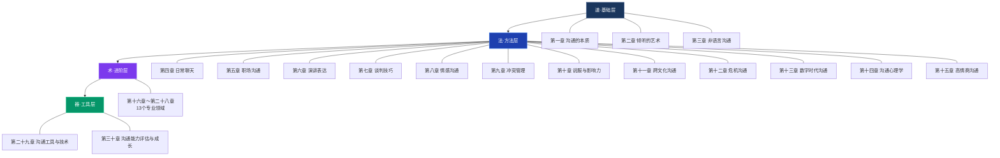
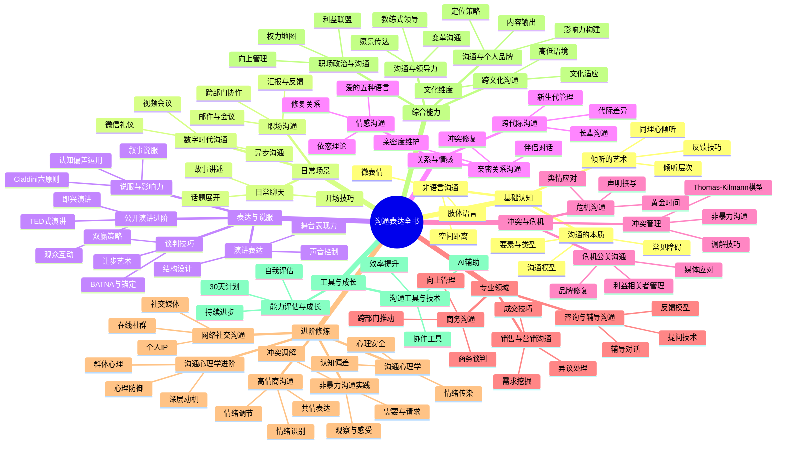

# 📖 沟通表达全书·目录与导航

***

## 关于本书

这是一本系统覆盖「沟通」全部维度的实战型全书，从最基础的倾听与表达到高阶的领导力沟通与危机公关，共计 **30 章 + 8 份附录**。全书按照「**道法术器**」的逻辑层层递进：

- **道**（第一～三章）：理解沟通的本质、掌握倾听、读懂非语言信号——这是底层认知。
- **法**（第四～十五章）：日常聊天、职场沟通、演讲、谈判、情感、冲突、说服、跨文化、危机、数字沟通、心理学、高情商——这是 12 个核心场景的方法论。
- **术**（第十六～二十八章）：网络社交、亲密关系、销售、演讲进阶、商务沟通、咨询辅导、危机公关、代际沟通、领导力、心理学进阶、非暴力沟通、个人品牌、职场政治——这是 13 个专业领域的高阶技术。
- **器**（第二十九～三十章）：沟通工具箱与能力评估体系——这是工具和成长路径。



***

## 如何使用本书

### 按阅读水平选择路径

| 你的情况 | 推荐路径 | 预计时间 |
|---------|---------|---------|
| **零基础入门**：从没系统学过沟通 | 第一章 → 第二章 → 第三章 → 第四章 → 第十五章 → 按兴趣选读 | 2～3 周 |
| **职场进阶**：工作中常遇到沟通问题 | 第五章 → 第七章 → 第九章 → 第十章 → 第十二章 → 第二十四章 → 第二十八章 | 2～3 周 |
| **关系提升**：想改善亲密关系/家庭关系 | 第八章 → 第二章 → 第十七章 → 第二十三章 → 第二十六章 | 1～2 周 |
| **专业深造**：从事销售/公关/管理等岗位 | 第十八章 → 第二十一章 → 第二十二章 → 第二十四章 → 第二十七章 | 2～3 周 |
| **通读全书**：想全面掌握沟通能力 | 按章节顺序从头读到尾 | 4～6 周 |

### 按问题场景速查

遇到具体问题？直接跳转到对应章节：

| 你遇到的问题 | 翻到哪里 |
|-------------|---------|
| 不知道怎么开口聊天，总是冷场 | [第四章 日常聊天](05-第四章-日常聊天/00-章节概览.md) |
| 跟同事/领导沟通效率低 | [第五章 职场沟通](06-第五章-职场沟通/00-章节概览.md) |
| 上台紧张、演讲不知道怎么讲 | [第六章 演讲表达](07-第六章-演讲表达/00-章节概览.md) → [第十九章 公开演讲进阶](20-第十九章-公开演讲进阶/00-章节概览.md) |
| 谈薪资/砍价/谈合作总吃亏 | [第七章 谈判技巧](08-第七章-谈判技巧/00-章节概览.md) |
| 和伴侣/家人总是吵架 | [第八章 情感沟通](09-第八章-情感沟通/00-章节概览.md) → [第十七章 亲密关系沟通](18-第十七章-亲密关系沟通/00-章节概览.md) |
| 不知道怎么处理冲突和分歧 | [第九章 冲突管理](10-第九章-冲突管理/00-章节概览.md) |
| 想说服别人但总被拒绝 | [第十章 说服与影响力](11-第十章-说服与影响力/00-章节概览.md) |
| 和外国人/不同文化背景的人打交道 | [第十一章 跨文化沟通](12-第十一章-跨文化沟通/00-章节概览.md) |
| 出了事故/被曝光，不知道怎么应对 | [第十二章 危机沟通](13-第十二章-危机沟通/00-章节概览.md) → [第二十二章 危机公关沟通](23-第二十二章-危机公关沟通/00-章节概览.md) |
| 微信/邮件总是被误解 | [第十三章 数字时代沟通](14-第十三章-数字时代沟通/00-章节概览.md) |
| 控制不住情绪，沟通时容易激动 | [第十五章 高情商沟通](16-第十五章-高情商沟通/00-章节概览.md) → [第二十五章 沟通心理学进阶](26-第二十五章-沟通心理学进阶/00-章节概览.md) |
| 想提升领导力和团队影响力 | [第二十四章 沟通与领导力](25-第二十四章-沟通与领导力/00-章节概览.md) |
| 不知道怎么和父母/长辈沟通 | [第二十三章 跨代际沟通](24-第二十三章-跨代际沟通/00-章节概览.md) |
| 想建立个人品牌、提升公众表达 | [第二十七章 沟通与个人品牌](28-第二十七章-沟通与个人品牌/00-章节概览.md) |

***

## 全书知识地图



***

## 学习路线图

```mermaid
graph LR
    subgraph 基础阶段 "🌱 基础阶段（第1-2周）"
        C1["第一章<br>沟通的本质"]
        C2["第二章<br>倾听的艺术"]
        C3["第三章<br>非语言沟通"]
        C1 --> C2 --> C3
    end

    subgraph 核心阶段 "🔧 核心阶段（第3-4周）"
        C4["第四章<br>日常聊天"]
        C5["第五章<br>职场沟通"]
        C6["第六章<br>演讲表达"]
        C7["第七章<br>谈判技巧"]
        C4 --> C5 --> C6 --> C7
    end

    subgraph 深化阶段 "🎯 深化阶段（第5-7周）"
        C8["第八章<br>情感沟通"]
        C9["第九章<br>冲突管理"]
        C10["第十章<br>说服与影响力"]
        C11["第十一章<br>跨文化沟通"]
        C12["第十二章<br>危机沟通"]
        C13["第十三章<br>数字时代沟通"]
        C8 --> C9 --> C10
        C11 --> C12 --> C13
    end

    subgraph 整合阶段 "🧠 整合阶段（第8-9周）"
        C14["第十四章<br>沟通心理学"]
        C15["第十五章<br>高情商沟通"]
        C14 --> C15
    end

    subgraph 专业阶段 "⚡ 专业阶段（第10-14周）"
        C16["第十六章～第二十八章<br>13个专业领域"]
    end

    subgraph 收官阶段 "🏁 收官阶段（第15周）"
        C29["第二十九章<br>沟通工具与技术"]
        C30["第三十章<br>能力评估与成长"]
        C29 --> C30
    end

    基础阶段 --> 核心阶段
    核心阶段 --> 深化阶段
    深化阶段 --> 整合阶段
    整合阶段 --> 专业阶段
    专业阶段 --> 收官阶段

    style 基础阶段 fill:#1a365d,stroke:#2a4a7f,color:#fff
    style 核心阶段 fill:#1e40af,stroke:#3b82f6,color:#fff
    style 深化阶段 fill:#7c3aed,stroke:#a78bfa,color:#fff
    style 整合阶段 fill:#be185d,stroke:#ec4899,color:#fff
    style 专业阶段 fill:#c2410c,stroke:#f97316,color:#fff
    style 收官阶段 fill:#059669,stroke:#34d399,color:#fff
```

***

## 前言

- [前言与导读](00-前言与导读.md) — 全书写作缘起、学习路径规划、如何使用本书

***

## 第一模块：基础认知

> 🌱 **目标**：建立对沟通的完整认知框架。这三章是全书的地基——理解沟通的本质、掌握倾听这个最核心的技能、读懂语言之外的信号。跳过这三章直接学技巧，等于盖楼不打地基。

***

### 第一章：沟通的本质

> *"单向的信息传递不是沟通，那只是通知。真正的沟通是一个双向的意义共建过程。"*

- [章节概览](02-第一章-沟通的本质/00-章节概览.md)
- 理论基础 — 沟通的学术定义、七大核心要素（发送者/接收者/信息/渠道/反馈/噪音/语境）、三种沟通类型（自我/人际/公共）、四大功能（信息/情感/控制/社交）、线性-交互-交易三类沟通模型
- 核心技巧 — 明确沟通目的四步法、受众分析矩阵、金字塔原则入门、「我」信息表达公式、沟通节奏掌控
- 实战案例 — 工作汇报、拒绝请求、陌生人破冰、跨部门协调、向上沟通等场景
- 常见误区 — 只顾自己说、假设对方理解、信息过载、忽视反馈、混淆事实与观点
- 练习方法 — 30 秒电梯演讲、复述练习、信息压缩训练
- 本章小结

***

### 第二章：倾听的艺术

> *"如果你只能学习一项沟通技能，那应该是倾听。大多数沟通问题的根源，不在于说不清楚，而在于听不明白。"*

- [章节概览](03-第二章-倾听的艺术/00-章节概览.md)
- 理论基础 — 听（Hearing）与倾听（Listening）的本质区别、倾听五层次模型（忽视→假装→选择→专注→共情）、SOLER 面对姿态、倾听的神经科学基础、常见倾听障碍分类
- 核心技巧 — 主动倾听四步法（3F：Fact/Feeling/Focus）、同理心倾听技巧、反馈式倾听（复述/释义/反映）、记录与总结技巧、鼓励技巧、不打断的艺术
- 实战案例 — 朋友深夜倾诉、领导布置任务、客户投诉、伴侣争吵、同事会议发言、销售谈判、父母唠叨、孩子犯错等 8 个场景
- 常见误区 — 边听边评判、急于给建议、虚假倾听（假装在听）、选择性倾听、用自己经历替代对方感受
- 练习方法 — 静默倾听练习、复述训练、24 小时倾听挑战
- 本章小结

***

### 第三章：非语言沟通

> *"你「怎么说」比「说什么」重要得多。梅拉比安法则告诉我们，情感和态度的传递中，肢体语言占 55%，声音语调占 38%，语言内容仅占 7%。"*

- [章节概览](04-第三章-非语言沟通/00-章节概览.md)
- 理论基础 — 非语言沟通八大类别（面部表情/目光接触/手势/姿态/触摸/空间距离/声音语调/外表）、Edward T. Hall 人际距离学（亲密/个人/社交/公共四区）、Ekman 六大基本表情、开放姿态 vs 封闭姿态
- 核心技巧 — 眼神接触的黄金比例（60-70%）、微笑的科学（杜兴微笑 vs 社交微笑）、手势表达的十个原则、坐姿站姿的权力信号、语调控制的音量-语速-停顿三维度
- 实战案例 — 面试中的非语言信号、销售中的购买信号、恋爱中的暗示、权力博弈中的身体语言、文化差异下的非语言冲突
- 常见误区 — 忽视文化差异（竖大拇指 ≠ 全球通用）、过度解读单一信号、刻意模仿他人肢体语言、忽视自己的非语言泄露
- 练习方法 — 镜子练习、无声电影观察、人观察日记
- 本章小结

***

## 第二模块：核心场景

> 🔧 **目标**：掌握日常生活中最高频的沟通场景。从闲聊到职场，从演讲到谈判——这些是每个人每天都在用、但很少人专门练过的技能。

***

### 第四章：日常聊天

> *"聊天是可以训练的技能，不是天赋。每天 2/3 的对话属于闲聊，这些「没用的话」恰恰是社交关系的基石。"*

- [章节概览](05-第四章-日常聊天/00-章节概览.md)
- 理论基础 — 闲聊的社会功能（传递善意/确认关系/交换信息/缓解焦虑）、乒乓球理论（对话像打乒乓球，有来有回）、聊天三层结构（信息层/情感层/关系层）、ARE 沟通法（Anchor-Reason-Encourage）
- 核心技巧 — 万能开场白公式、FIRE 话题模型（Fact/Interesting/Reaction/Experience）、回应层次递进、讲故事的五要素、接话技巧（接话-展开-转移三步法）、冷场急救术
- 实战案例 — 相亲场景、电梯偶遇领导、同学聚会、咖啡厅搭话、同事茶水间闲聊等 5+ 场景
- 常见误区 — 查户口式提问、不停抱怨、好为人师、只聊自己、过早深入敏感话题
- 练习方法 — 每日一聊挑战、话题卡片练习、故事素材库建设
- 本章小结

***

### 第五章：职场沟通

> *"职场人平均 70% 的工作时间在沟通上。但职场沟通和日常社交有本质不同——这里有权力关系、利益博弈和职业风险。"*

- [章节概览](06-第五章-职场沟通/00-章节概览.md)
- 理论基础 — 金字塔原则（结论先行、以上统下、归类分组、逻辑递进）、PREP 沟通法（Point-Reason-Example-Point）、SCQA 故事框架（Situation-Complication-Question-Answer）、乔哈里窗模型
- 核心技巧 — 30-3-1 法则（30 秒-3 分钟-1 分钟三层表达）、BLUF 邮件原则（Bottom Line Up Front）、会议发言的 PREP 结构、跨部门协作的五步法、向上管理沟通策略
- 实战案例 — 年终述职、跨部门推动项目、接受领导批评、提出反对意见、新人入职沟通等 5+ 场景
- 常见误区 — 邮件长篇大论、会议沉默不发言、只报喜不报忧、越级沟通、用情绪代替事实
- 练习方法 — 电梯演讲练习、邮件改写升级、汇报模拟演练
- 本章小结

***

### 第六章：演讲表达

> *"公开演讲是人们最害怕的事情之一（超过对死亡的恐惧），但也是最值得学习的技能之一。一场好演讲能改变听众的认知和行动。"*

- [章节概览](07-第六章-演讲表达/00-章节概览.md)
- 理论基础 — 亚里士多德说服三要素（Ethos 品格/Pathos 情感/Logos 逻辑）、TED 演讲的 18 分钟法则与 Ideas Worth Spreading 理念、演讲结构模型（总-分-总/问题-方案/时间线/对比式）、演讲焦虑的 Yerkes-Dodson 定律
- 核心技巧 — 强力开场五种方式（故事/问题/数据/引用/震撼事实）、讲故事的力量（STAR 故事框架）、PPT 设计的 10-20-30 法则、声音控制的音量-语速-停顿三维度、有力结尾的三种模式
- 实战案例 — 公司年会演讲、产品发布会、婚礼致辞、TED 风格分享、即兴演讲等 5+ 场景
- 常见误区 — 背稿子（像念课文）、念 PPT、信息过载（想一次讲完所有东西）、忽视观众反应、没有互动
- 练习方法 — 镜子练习、录像回放、即兴演讲训练、模仿优秀演讲
- 本章小结

***

### 第七章：谈判技巧

> *"谈判不是零和游戏。最好的谈判结果不是一方赢一方输，而是双方都觉得自己赢了——这叫整合式谈判。"*

- [章节概览](08-第七章-谈判技巧/00-章节概览.md)
- 理论基础 — 分配式谈判 vs 整合式谈判的本质区别、BATNA 理论（最佳替代方案是你的谈判底线）、哈佛谈判法四大原则（人/利益/选项/标准）、锚定效应的心理学机制
- 核心技巧 — 谈判准备清单（信息收集/目标设定/底线确定/替代方案）、锚定效应的运用与反制、让步的递减策略、应对强硬对手的五种策略、沉默的力量
- 实战案例 — 薪资谈判、客户砍价、房东谈租金、商业合同谈判、夫妻家务分工协商等 5+ 场景
- 常见误区 — 没准备就上桌、过于关注价格忽视价值、被情绪左右、过早亮出底线、把谈判当吵架
- 练习方法 — 日常小谈判练习（咖啡店/菜市场）、角色扮演、谈判复盘日记
- 本章小结

***

## 第三模块：深度沟通

> 🎯 **目标**：从「能沟通」升级到「会沟通」。这一模块覆盖情感、冲突、说服、跨文化、危机和数字沟通——这些场景的共同点是：出错的代价更高，需要更深的理解力和更精细的技巧。

***

### 第八章：情感沟通

> *"情感沟通是最重要也最困难的沟通类型。我们的学校教了知识和逻辑，却从没教过如何表达和回应情感。"*

- [章节概览](09-第八章-情感沟通/00-章节概览.md)
- 理论基础 — 依恋理论（安全型/焦虑型/回避型/混乱型）、Chapman 爱的五种语言（肯定的言辞/精心的时刻/接受礼物/服务的行动/身体接触）、情感银行账户（Gottman）、末日四骑士（批评/蔑视/防御/冷战）
- 核心技巧 — XYZ 公式（当你在 Y 情境下做 X 时，我感到 Z）、积极倾听在情感场景中的应用、修复关系四步法（承认/共情/道歉/行动）、暂停规则（20 分钟冷静期）、道歉的艺术（五种语言的道歉）
- 实战案例 — 表白被拒后的沟通、吵架后的修复、第一次见家长、分手沟通、长期关系中的情感维护等 5+ 场景
- 常见误区 — 用「你」信息指责对方、翻旧账、冷战（回避型依恋的典型模式）、忽视小事的累积效应、把「为你好」当借口
- 练习方法 — 感恩日记、情感词汇扩展训练、每周深度对话
- 本章小结

***

### 第九章：冲突管理

> *"冲突本身不是坏事——处理得当的冲突不仅不会破坏关系，反而能促进深层理解、推动创新变革、增强团队凝聚力。"*

- [章节概览](10-第九章-冲突管理/00-章节概览.md)
- 理论基础 — Thomas-Kilmann 冲突模型五种风格（竞争/合作/妥协/回避/适应）、冲突发展阶段（潜在→感知→感受→行为→结果/后续）、非暴力沟通（NVC）四要素（观察/感受/需要/请求）、建设性冲突 vs 破坏性冲突
- 核心技巧 — 「我」信息表达法（观察+感受+需要+请求）、NVC 四步法实操、情绪降温的五种技术、冲突调解的第三方角色、从冲突到共识的五步流程
- 实战案例 — 被当众质疑、被误解、室友生活习惯冲突、团队资源争夺、家庭决策分歧等 5+ 场景
- 常见误区 — 回避冲突（问题只会越积越大）、人身攻击（从「对事」滑向「对人」）、非黑即白思维、情绪化决策、赢了道理输了关系
- 练习方法 — 角色互换练习、NVC 日常对话练习、冲突复盘日记
- 本章小结

***

### 第十章：说服与影响力

> *"说服力不是口才，而是对人类决策机制的深度理解。亚里士多德两千年前提出的 Ethos-Pathos-Logos 至今仍是说服理论的基石。"*

- [章节概览](11-第十章-说服与影响力/00-章节概览.md)
- 理论基础 — 亚里士多德说服三要素详解、Cialdini 影响力六大原则（互惠/承诺一致/社会认同/喜好/权威/稀缺）、精细加工可能性模型（ELM：中心路径 vs 边缘路径）、行为经济学中的认知偏差（损失厌恶/禀赋效应/框架效应）
- 核心技巧 — 说服准备三步走（了解对方/构建论据/选择策略）、叙事说服法（故事比数据更有力）、社会认同的运用、互惠原则的主动创造、应对反对意见的 A-R-R 法（Acknowledge-Respond-Redirect）
- 实战案例 — 推动团队采纳新技术、说服客户接受方案、让领导批准预算、影响朋友改变习惯、销售成交等 5+ 场景
- 常见误区 — 用权威压制而非说服、只讲逻辑不讲情感、忽视对方立场、急于求成、把操控当说服
- 练习方法 — 日常说服场景记录、说服策略分析练习、正反方辩论练习
- 本章小结

***

### 第十一章：跨文化沟通

> *"全球化时代，跨文化沟通不再是外交官的专属技能。很多沟通失败不是因为语言不通，而是文化「不通」。"*

- [章节概览](12-第十一章-跨文化沟通/00-章节概览.md)
- 理论基础 — Hofstede 六大文化维度（权力距离/个人主义-集体主义/男性化-女性化/不确定性规避/长期导向/放纵-克制）、Edward T. Hall 高语境 vs 低语境文化、文化冲击四阶段（蜜月期→挫折期→调整期→适应期）、Bennett 跨文化敏感度发展模型（DMR）
- 核心技巧 — 了解对方文化的五个切入点（历史/宗教/价值观/沟通风格/商务礼仪）、语言简化的三个原则、尊重差异的具体做法、适应性调整策略、跨文化团队的沟通协议
- 实战案例 — 和日本客户谈判、与美国同事协作、多元文化团队管理、海外留学社交、跨文化商务宴请等 5+ 场景
- 常见误区 — 刻板印象（用标签代替了解）、忽视非语言差异（眼神接触/身体距离/手势的文化含义）、强迫自己文化标准、过度自我审查、忽视文化内的个体差异
- 练习方法 — 文化日记（记录跨文化互动）、学习一门新语言、跨文化阅读清单
- 本章小结

***

### 第十二章：危机沟通

> *"危机时刻，沟通的质量直接决定结果的好坏。黄金 24 小时内的第一反应，往往决定了危机的最终走向。"*

- [章节概览](13-第十二章-危机沟通/00-章节概览.md)
- 理论基础 — 黄金时间原则（危机发生后的响应窗口）、SCCT 情境危机沟通理论（Coombs：匹配回应策略与危机类型）、3C 原则（Concern 关切/Control 控制/Commitment 承诺）、危机生命周期四阶段（潜伏期→爆发期→蔓延期→恢复期）
- 核心技巧 — SAAR 框架（Situation-Acknowledge-Action-Reassure）、媒体应对的 Q&A 准备、情绪控制的冷静三步法、内部沟通的信息分级策略、危机声明撰写的模板与禁忌
- 实战案例 — 工作犯错后的汇报、社交媒体负面舆情、被媒体采访、产品安全事故、数据泄露事件等 5+ 场景
- 常见误区 — 否认推卸责任、反应太慢（错过黄金时间）、前后矛盾（信息不一致）、过度承诺（做不到的保证）、忽视内部沟通
- 练习方法 — 危机模拟演练、经典案例复盘、压力环境下的表达训练
- 本章小结

***

### 第十三章：数字时代沟通

> *"文字缺少了 93% 的非语言信息——这就是为什么你的微信消息总是被误解。数字沟通不是传统沟通的线上版本，它需要一套全新的技能。"*

- [章节概览](14-第十三章-数字时代沟通/00-章节概览.md)
- 理论基础 — 媒介丰富度理论（Daft & Lengel：不同媒介传递信息的能力不同）、缺失线索理论（缺少非语言线索导致的误解）、注意力经济（信息过载时代的注意力稀缺）、同步 vs 异步沟通的选择框架
- 核心技巧 — 微信沟通的十大礼仪规则、邮件写作的 BLUF + 5W1H 结构、视频会议的最佳实践（环境/设备/互动/跟进）、异步沟通的信息设计原则、表情包与标点符号的社交含义
- 实战案例 — 微信消息被误解、邮件引发冲突、视频会议被忽视、群聊中的权力动态、远程团队的信任建立等 5+ 场景
- 常见误区 — 用文字讨论复杂问题（应该打电话或见面）、发语音不分场合、邮件抄送过多/过少、消息已读不回复、在公开群聊中批评个人
- 练习方法 — 消息发送前三秒暂停法、消息改写练习、无屏幕沟通日
- 本章小结

***

### 第十四章：沟通心理学

> *"所有的沟通，本质上都是人与人之间的心理互动。理解了沟通心理学，你就理解了为什么人们会做出那些「不合理」的反应。"*

- [章节概览](15-第十四章-沟通心理学/00-章节概览.md)
- 理论基础 — 认知偏差对沟通的影响（确认偏差/光环效应/基本归因错误/虚假共识效应）、Maslow 需求层次在沟通中的应用、框架效应（同一事实不同表述导致不同决策）、情绪传染的神经机制（镜像神经元）
- 核心技巧 — 镜像神经元的沟通应用（模仿对方姿态建立连接）、认知重构（重新解读对方行为的积极意图）、积极预设（假设对方动机是好的）、心理安全感的四个条件（Schein）
- 实战案例 — 克服社交焦虑、理解「不合理」行为背后的心理需求、在高压环境中保持心理弹性、应对操纵型沟通者等 5+ 场景
- 常见误区 — 用心理学知识操控他人、过度分析每个细节、忽视自己的心理状态、把心理标签当诊断工具、用理论代替共情
- 练习方法 — 情绪觉察日记、换位思考训练、心理安全氛围营造练习
- 本章小结

***

### 第十五章：高情商沟通

> *"高情商 = 觉察 + 同理 + 表达 + 行动。智商决定你能走多远，情商决定你能走多稳。"*

- [章节概览](16-第十五章-高情商沟通/00-章节概览.md)
- 理论基础 — Goleman 情商四维度（自我觉察/自我管理/社会觉察/关系管理）、高情商沟通公式（觉察情绪→理解原因→选择表达→采取行动）、情绪管理的 ABC 模型（Ellis：Activating event-Belief-Consequence）、情绪颗粒度理论（Barrett）
- 核心技巧 — 情绪标记法（Name it to tame it：用语言标记情绪可以降低杏仁核激活）、暂停的力量（6 秒法则：情绪峰值持续约 6 秒）、高情商回应模板、赞美的三明治结构、批评的 SBI 模型（Situation-Behavior-Impact）
- 实战案例 — 面对愤怒的人、安慰失意的朋友、团队负面情绪管理、拒绝而不伤害关系、在批评中成长等 5+ 场景
- 常见误区 — 只讲道理不讲情感、讨好型沟通（压抑自己迎合他人）、过度情绪化（把情绪当借口）、把高情商等同于「会说话」、忽视负面情绪的价值
- 练习方法 — 情绪日记、共情练习（镜像对话）、21 天赞美挑战、正念冥想
- 本章小结

***

## 第四模块：专业领域

> ⚡ **目标**：覆盖 13 个专业沟通领域。这些章节面向有特定需求的读者——你想提升领导力、做销售、管理危机公关、建立个人品牌、处理职场政治——在这里都能找到系统的方法论。不需要按顺序读，按需选读即可。

***

### 第十六章：网络社交沟通

> *在网络世界里，你的文字就是你的全部形象。*

- [章节概览](17-第十六章-网络社交沟通/00-章节概览.md)
- 理论基础 — 网络社交心理学、在线印象管理理论、网络去抑制效应（Suler）、社区沟通动力学
- 核心技巧 — 社交媒体文案写作、在线社群运营与互动、个人 IP 内容表达、评论区互动策略
- 实战案例 — 朋友圈人设管理、知乎/小红书内容创作、社群运营沟通、网络争议处理等场景
- 常见误区 — 线上线下人格不一致、过度表演、忽视网络暴力风险、把点赞当认可
- 练习方法 — 社交媒体内容复盘、社群互动实验、网络影响力日记

***

### 第十七章：亲密关系沟通

> *"亲密关系中的沟通质量，直接决定了关系的存亡。Gottman 的研究表明，仅凭观察夫妻沟通模式 5 分钟，就能以 91% 的准确率预测他们是否会离婚。"*

- [章节概览](18-第十七章-亲密关系沟通/00-章节概览.md)
- 理论基础 — Gottman 四骑士（批评/蔑视/防御/冷战）与四解药、依恋理论在亲密关系中的深化、关系发展阶段的沟通需求变化、亲密关系中的权力动态
- 核心技巧 — 约会中的深度对话、伴侣冲突的修复对话、性话题的沟通框架、亲密度的阶梯式提升、「我们」视角的建立
- 实战案例 — 第一次约会、恋爱中的争吵修复、长期关系中的新鲜感维护、异地恋沟通、分手前的最后沟通等场景
- 常见误区 — 把「不说」当「没有问题」、用冷战惩罚对方、在亲密关系中失去边界、把伴侣当情绪垃圾桶
- 练习方法 — 关系检查清单、伴侣对话练习、亲密度评估问卷

***

### 第十八章：销售与营销沟通

> *"最好的销售不是说服别人买东西，而是帮助客户发现他们真正需要什么。"*

- [章节概览](19-第十八章-销售与营销沟通/00-章节概览.md)
- 理论基础 — SPIN 销售法（Situation-Problem-Implication-Need-payoff）、顾问式销售模型、消费者决策心理学、AIDA 模型（Attention-Interest-Desire-Action）
- 核心技巧 — 需求挖掘的提问技术、产品价值的 FAB 表述法（Feature-Advantage-Benefit）、异议处理的 LAER 模型（Listen-Acknowledge-Explore-Respond）、成交信号的识别与回应
- 实战案例 — B2B 大客户销售、零售场景的即兴销售、电话销售、产品发布会演示、处理价格异议等场景
- 常见误区 — 只讲产品特性不讲客户利益、急于成交忽视信任建立、忽视售后沟通、用话术套路代替真诚
- 练习方法 — 销售对话录音分析、角色扮演、经典销售案例学习

***

### 第十九章：公开演讲进阶

> *"从「能讲」到「讲得好」，从「不紧张」到「享受舞台」——这是演讲能力的质变。"*

- [章节概览](20-第十九章-公开演讲进阶/00-章节概览.md)
- 理论基础 — TED 演讲的深层结构解析、即兴演讲的认知框架（PREP/STAR/时间线）、故事讲述的神经科学（故事激活听众大脑与讲者同步）、舞台表现力的 Actor's Toolbox
- 核心技巧 — 即兴演讲的三种万能框架、故事讲述的七步法、舞台移动与空间运用、声音戏剧化（音调/节奏/音量/停顿的组合）、观众互动的冷启动与热维持
- 实战案例 — TED 级别演讲设计、行业峰会演讲、产品路演、毕业典礼致辞、大场地 vs 小场地的策略切换等场景
- 常见误区 — 过度依赖 PPT、把幽默当万能钥匙、忽视排练（即兴 ≠ 不准备）、内容贪多求全、忽视不同场地的差异
- 练习方法 — 录像回放分析、即兴演讲俱乐部、模仿大师级演讲、声音训练

***

### 第二十章：商务沟通

> *"商务沟通的本质不是「说漂亮话」，而是在复杂的商业环境中高效地传递信息、建立关系、推动决策。"*

- [章节概览](21-第二十章-商务沟通/00-章节概览.md)
- 理论基础 — 商务沟通的编码-解码模型、利益相关者分析矩阵、正式 vs 非正式沟通渠道的选择、商务沟通的法律边界
- 核心技巧 — 商务提案的结构化写作、向高管汇报的金字塔法、商务宴请的餐桌沟通、合同谈判中的沟通策略、跨部门推动项目的影响力技巧
- 实战案例 — 向 CEO 汇报项目进展、推动跨部门协作、商务宴请破冰、处理客户投诉升级、国际商务沟通等场景
- 常见误区 — 用内部语言对外沟通、忽视商务礼仪、把邮件当即时通讯、在正式场合用非正式语气、忽视沉默的利益相关者
- 练习方法 — 商务邮件模板积累、汇报演练、商务社交模拟

***

### 第二十一章：咨询与辅导沟通

> *"好的咨询师不是给答案的人，而是帮客户自己找到答案的人。"*

- [章节概览](22-第二十一章-咨询与辅导沟通/00-章节概览.md)
- 理论基础 — GROW 辅导模型（Goal-Reality-Options-Will）、Socratic 提问法、倾听-共情-引导的三阶段框架、咨询关系中的移情与反移情
- 核心技巧 — 开放式提问的五种类型、反馈的 SBI 模型、困难对话的管理、教练式领导力沟通、辅导计划的设计与执行
- 实战案例 — 管理者辅导下属、职业规划咨询、绩效面谈、心理危机干预转介、客户问题诊断等场景
- 常见误区 — 把辅导当说教、急于给建议、忽视被辅导者的自主性、混淆咨询师与朋友的角色、过度承诺
- 练习方法 — 提问技术练习、辅导对话录音分析、GROW 模型日常应用

***

### 第二十二章：危机公关沟通

> *"危机公关不是「灭火」，而是「重建信任」。处理得好，危机可以成为展现组织价值观的最佳时机。"*

- [章节概览](23-第二十二章-危机公关沟通/00-章节概览.md)
- 理论基础 — 危机公关的 5S 原则（Speed 承担/Sincerity 真诚/Standard 统一/System 系统/Skill 技巧）、Benoit 形象修复理论五种策略、危机利益相关者地图、社交媒体时代的危机传播模型
- 核心技巧 — 危机声明的撰写框架与语言禁忌、新闻发布会的 Q&A 策略、社交媒体舆情监控与回应、品牌修复的阶段性策略、内部沟通的信息一致性管理
- 实战案例 — 产品质量危机、高管不当言论、数据泄露、员工丑闻、供应链危机等场景的完整公关案例
- 常见误区 — 过度法律化（律师思维 vs 公关思维）、忽视社交媒体传播速度、把「无可奉告」当策略、危机结束后停止沟通、忽视内部员工的公关角色
- 练习方法 — 危机模拟沙盘、经典危机案例拆解、危机声明撰写练习

***

### 第二十三章：跨代际沟通

> *"代际差异不是谁对谁错，而是不同历史环境塑造了不同的价值观和沟通偏好。理解了这一点，就理解了一半的代际冲突。"*

- [章节概览](24-第二十三章-跨代际沟通/00-章节概览.md)
- 理论基础 — 代际理论（Strauss-Howe 四代模型：婴儿潮/X 世代/千禧一代/Z 世代）、各世代的核心价值观与沟通偏好、技术环境对代际沟通风格的塑造、代际冲突的深层根源
- 核心技巧 — 与长辈沟通的尊重-简化-耐心策略、与年轻下属沟通的信任-授权-反馈策略、代际差异的翻译术（把一种代际语言「翻译」成另一种）、家族聚会中的沟通智慧
- 实战案例 — 与父母的观念冲突、管理比自己年长的下属、与 Z 世代员工的协作、家族企业中的代际传承、教育子女中的沟通策略等场景
- 常见误区 — 用「我们那时候」否定年轻人、用「你们不懂」否定长辈、忽视代际差异只看个体、把技术代沟等同于能力代沟
- 练习方法 — 代际对话日记、跨代际社交实验、代际沟通书单阅读

***

### 第二十四章：沟通与领导力

> *"领导力的本质就是影响力，而影响力的核心是沟通。一个不善沟通的领导者，就像一个不会开灯的电工。"*

- [章节概览](25-第二十四章-沟通与领导力/00-章节概览.md)
- 理论基础 — 变革型领导力的沟通维度、愿景传达的叙事框架、领导力沟通的四个层次（告知→推销→参与→共创）、情境领导力模型中的沟通策略适配
- 核心技巧 — 愿景传达的「为什么-怎么做-做什么」黄金圈、变革沟通的 Kotter 八步法、教练式领导力对话、团队反馈文化的建设、危机中的领导者沟通
- 实战案例 — 新任领导者的百日沟通、推动组织变革的沟通策略、裁员/重组的艰难对话、远程团队的领导力沟通、建设高绩效团队的沟通习惯等场景
- 常见误区 — 只用权力不用影响力、只发布不倾听、忽视中层管理者的沟通桥梁角色、把沟通当单向通知、在变革中保持沉默
- 练习方法 — 愿景演讲练习、教练式对话模拟、360 度反馈收集与分析

***

### 第二十五章：沟通心理学进阶

> *"当你理解了人类决策的心理机制，你就理解了为什么「道理都懂但就是做不到」——以及如何绕过这个困境。"*

- [章节概览](26-第二十五章-沟通心理学进阶/00-章节概览.md)
- 理论基础 — 认知偏差百科（50+ 种偏差在沟通中的表现）、深层动机理论（McClelland 成就/权力/亲和）、心理防御机制在沟通中的投射、群体心理与社会认同（Tajfel）、心理安全感的团队建设（Edmondson）
- 核心技巧 — 认知偏差的觉察与规避策略、深层动机的倾听与回应、心理防御的识别与化解、群体沟通中的去极化技术、心理安全团队的建设方法
- 实战案例 — 说服「固执」的人、管理团队中的「有毒」成员、应对职场PUA、在争论中保持理性、识别与应对心理操控等场景
- 常见误区 — 把心理学当操控术、过度心理分析（看谁都像有心理问题）、忽视文化对心理的影响、把相关性当因果性、用标签代替理解
- 练习方法 — 认知偏差觉察日记、心理学案例分析、正念沟通练习

***

### 第二十六章：非暴力沟通实践

> *"非暴力沟通不仅是一种沟通技巧，更是一种看待人与人关系的哲学。它教会我们：在表达自己和倾听他人之间，找到那条温柔而有力的路。"*

- [章节概览](27-第二十六章-非暴力沟通实践/00-章节概览.md)
- 理论基础 — 马歇尔·卢森堡与 NVC 的诞生背景、NVC 四要素详解（观察/感受/需要/请求）、NVC 的哲学基础（人本主义/需要理论）、NVC 与传统沟通方式的对比
- 核心技巧 — 第一步观察（区分观察与评论）、第二步感受（建立感受词汇库）、第三步需要（识别深层需要）、第四步请求（具体可行的请求 vs 要求）、NVC 在冲突中的应用、NVC 完整对话的六个阶段
- 实战案例 — NVC 在亲密关系中的应用、NVC 在职场批评中的应用、NVC 在亲子教育中的应用、NVC 在客户投诉中的应用、NVC 在自我对话中的应用
- 常见误区 — 把 NVC 当话术模板（机械化套公式）、忽视 NVC 的内在态度、把「不评判」等同于「不表达立场」、只对别人用 NVC 不对自己用、在紧急情况下坚持使用 NVC
- 练习方法 — NVC 四步法日常练习、感受词汇卡片、需要清单自检、NVC 角色扮演

***

### 第二十七章：沟通与个人品牌

> *"在注意力稀缺的时代，你的个人品牌就是别人在你不在场时对你的描述。而塑造这个描述的核心工具，就是沟通。"*

- [章节概览](28-第二十七章-沟通与个人品牌/00-章节概览.md)
- 理论基础 — 个人品牌定位理论、内容营销的 70-20-10 法则、思想领导力的构建路径、叙事身份理论（McAdams）
- 核心技巧 — 个人定位的三环模型（擅长/热爱/被需要）、电梯演讲的三种版本（10 秒/30 秒/3 分钟）、内容输出的渠道策略（公众号/视频/播客/演讲）、社交资本的积累与维护
- 实战案例 — 从零开始建立行业影响力、公开演讲打造个人 IP、社交媒体人设管理、行业峰会的社交策略、危机中的个人品牌维护等场景
- 常见误区 — 把个人品牌等同于自我营销、内容与人设不一致、急于求成忽视长期积累、只输出不互动、忽视线下沟通的价值
- 练习方法 — 个人定位画布练习、内容日历规划、电梯演讲录制与优化、社交资本清单

***

### 第二十八章：职场政治与沟通

> *"职场政治不是贬义词。它是组织中资源分配、权力运作和利益协调的现实。不懂职场政治的人，不是清高，是天真。"*

- [章节概览](29-第二十八章-职场政治与沟通/00-章节概览.md)
- 理论基础 — 组织中的正式权力与非正式权力、权力地图（Pettigrew：谁影响谁/谁决定什么）、利益相关者分析矩阵、向上管理理论、组织沟通网络分析（中心/桥接/边缘节点）
- 核心技巧 — 权力地图的绘制方法、利益联盟的建立与维护、向上管理的沟通策略、办公室八卦的处理原则、政治敏感度的培养、在不公正中保护自己的沟通策略
- 实战案例 — 新人融入团队的政治生态、与「难搞」同事的协作、争取资源与晋升的沟通策略、跨部门利益博弈、面对不公正对待时的应对等场景
- 常见误区 — 完全拒绝参与职场政治（导致被边缘化）、过度参与政治（失去信任）、在公开场合挑战权威、把联盟等同于派系、忽视信息就是权力
- 练习方法 — 组织地图绘制练习、政治情景模拟、向上管理案例分析、权力动态观察日记

***

## 第五模块：工具与成长

> 🏁 **目标**：这是全书的收官部分。第二十九章帮你掌握最新的沟通工具与技术，第三十章提供系统的评估体系和成长路径——让你知道自己的沟通水平在哪里、该往哪里去、怎么去。

***

### 第二十九章：沟通工具与技术

> *"工具放大的是你的能力——如果你的沟通能力是 1 分，工具放大后还是 1 分；但如果你的能力是 10 分，好的工具能让它变成 100 分。"*

- [章节概览](30-第二十九章-沟通工具与技术/00-章节概览.md)
- 理论基础 — 媒介丰富度理论的数字化延伸、AI 辅助沟通的伦理边界、异步协作的信息架构设计、数字沟通疲劳的神经科学解释
- 核心技巧 — 协作工具的高效使用（飞书/钉钉/Slack/Notion）、AI 辅助写作的最佳实践（提示词工程/质量把控）、视频会议的专业化操作、异步沟通文档的结构化设计、沟通工作流自动化
- 实战案例 — 远程团队的沟通体系搭建、AI 辅助邮件写作、跨时区协作的最佳实践、企业沟通工具选型、数字化转型中的沟通挑战等场景
- 常见误区 — 工具过多导致信息碎片化、过度依赖 AI 失去个人风格、忽视工具背后的文化适配、把工具当解决方案而非杠杆、忽视信息安全与隐私
- 练习方法 — 工具审计（梳理当前工具栈）、沟通效率基准测试、AI 辅助写作 A/B 测试

***

### 第三十章：沟通能力评估与成长

> *"你无法提升你无法衡量的能力。本章为你提供一套从「无意识的不胜任」到「无意识的胜任」的完整成长体系。"*

- [章节概览](31-第三十章-沟通能力评估与成长/00-章节概览.md)
- 理论基础 — 沟通能力的四阶段模型（无意识不胜任→有意识不胜任→有意识胜任→无意识胜任）、沟通能力的多维评估框架、刻意练习理论（Ericsson）、习惯形成的 21-66 天模型
- 核心技巧 — 沟通能力自评问卷的使用方法、360 度沟通反馈的收集与分析、个人沟通发展计划（PDP）的制定、刻意练习的四要素（目标/专注/反馈/修正）、沟通日志的记录与复盘
- 实战案例 — 年度沟通能力盘点、从评估到改进的完整案例、团队沟通能力提升项目、不同职业阶段的沟通成长路径等场景
- 常见误区 — 评估后不行动（停留在「知道自己差」）、只评估不练习（知道和做到是两回事）、用单一指标评估沟通能力、忽视情境因素（同一个人在不同场景沟通能力不同）、急于求成忽视渐进成长
- 练习方法 — 沟通能力自测、360 度反馈收集、个人成长计划制定、30 天沟通提升挑战

***

## 附录

- [附录 A：沟通能力自测工具](99-附录/附录A-沟通能力自测工具.md) — 12 个维度的沟通能力评估问卷，帮你定位当前水平
- [附录 B：沟通场景速查手册](99-附录/附录B-沟通场景速查手册.md) — 50+ 常见沟通场景的即查即用策略
- [附录 C：沟通金句与名言集](99-附录/附录C-沟通金句与名言集.md) — 200+ 条沟通相关名言、金句、公式
- [附录 D：推荐阅读与资源](99-附录/附录D-推荐阅读与资源.md) — 精选书单、课程、播客、工具推荐
- [附录 E：沟通工具箱](99-附录/附录E-沟通工具箱.md) — 可直接使用的沟通模板、清单、脚本
- [附录 F：沟通训练 30 天计划](99-附录/附录F-沟通训练30天计划.md) — 每天一个主题、一项练习，30 天系统提升
- [附录 G：行业沟通指南](99-附录/附录G-行业沟通指南.md) — 针对不同行业（互联网/金融/医疗/教育等）的沟通要点
- [附录 H：沟通案例百科](99-附录/附录H-沟通案例百科.md) — 100+ 真实沟通案例的分析与启示
- [推荐书单](99-附录/推荐书单.md) — 沟通领域经典与新锐书籍推荐
- [工具清单](99-附录/工具清单.md) — 沟通相关的数字工具与 App 推荐
- [能力自测表](99-附录/能力自测表.md) — 快速自评你的沟通能力等级
- [金句收藏](99-附录/金句收藏.md) — 沟通智慧的精华浓缩
- [30 天提升计划](99-附录/30天提升计划.md) — 打印出来每天打卡的完整执行方案

***

## 章节总览表

| 模块 | 章节 | 主题 | 核心关键词 |
|------|------|------|-----------|
| **基础认知** | 第一章 | 沟通的本质 | 模型·要素·类型·障碍 |
| | 第二章 | 倾听的艺术 | 五层次·3F倾听·同理心 |
| | 第三章 | 非语言沟通 | 7-38-55·肢体语言·微表情 |
| **核心场景** | 第四章 | 日常聊天 | 开场·话题·故事·接话 |
| | 第五章 | 职场沟通 | 金字塔·PREP·向上管理 |
| | 第六章 | 演讲表达 | 开场·结构·PPT·声音 |
| | 第七章 | 谈判技巧 | BATNA·锚定·让步·双赢 |
| **深度沟通** | 第八章 | 情感沟通 | 依恋·五种语言·修复 |
| | 第九章 | 冲突管理 | Thomas-Kilmann·NVC·调解 |
| | 第十章 | 说服与影响力 | Cialdini六原则·ELM·叙事 |
| | 第十一章 | 跨文化沟通 | Hofstede·高低语境·文化冲击 |
| | 第十二章 | 危机沟通 | 黄金时间·SCCT·3C原则 |
| | 第十三章 | 数字时代沟通 | 媒介丰富度·微信·异步 |
| | 第十四章 | 沟通心理学 | 认知偏差·情绪传染·框架 |
| | 第十五章 | 高情商沟通 | 情商四维度·情绪标记·ABC |
| **专业领域** | 第十六章 | 网络社交沟通 | 社交媒体·社群·个人IP |
| | 第十七章 | 亲密关系沟通 | Gottman·修复·边界 |
| | 第十八章 | 销售与营销沟通 | SPIN·FAB·异议处理 |
| | 第十九章 | 公开演讲进阶 | TED·即兴·舞台·声音 |
| | 第二十章 | 商务沟通 | 提案·汇报·宴请·谈判 |
| | 第二十一章 | 咨询与辅导沟通 | GROW·提问·教练式 |
| | 第二十二章 | 危机公关沟通 | 5S·形象修复·舆情 |
| | 第二十三章 | 跨代际沟通 | 代际差异·价值观·翻译术 |
| | 第二十四章 | 沟通与领导力 | 愿景·变革·教练式·反馈 |
| | 第二十五章 | 沟通心理学进阶 | 50+偏差·动机·防御·群体 |
| | 第二十六章 | 非暴力沟通实践 | 观察·感受·需要·请求 |
| | 第二十七章 | 沟通与个人品牌 | 定位·内容·IP·社交资本 |
| | 第二十八章 | 职场政治与沟通 | 权力地图·联盟·向上管理 |
| **工具与成长** | 第二十九章 | 沟通工具与技术 | 协作工具·AI·效率 |
| | 第三十章 | 沟通能力评估与成长 | 四阶段·360度·刻意练习 |

***

> *"沟通中最重要的事，是听到没有说出来的话。" ——彼得·德鲁克*
