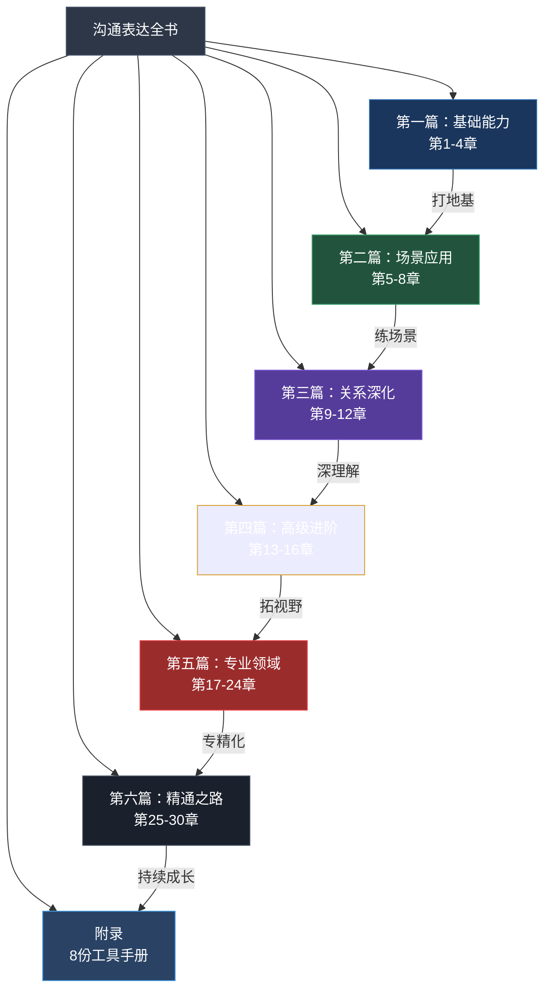
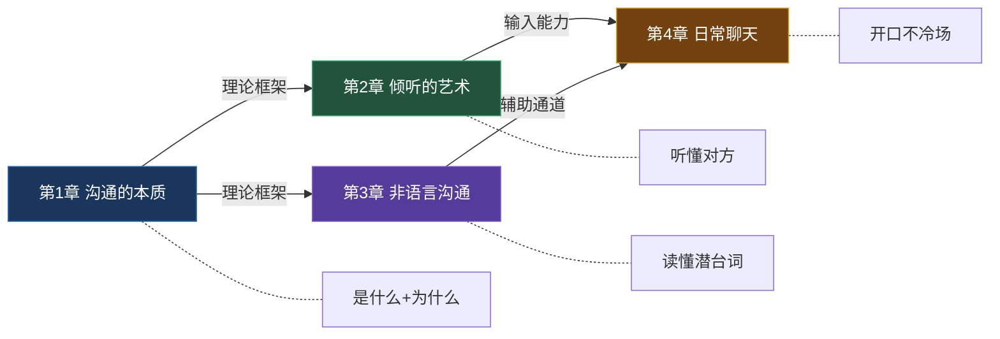

# 《沟通表达全书》完整目录

> **从零基础到精通的全方位沟通百科——30章 + 8份附录，覆盖沟通的每一个维度**

本书按照 **"道→法→术→器"** 的逻辑编排：先建立认知框架（道），再掌握核心方法（法），然后在具体场景中反复打磨（术），最后用工具和评估体系持续精进（器）。全书共分 **六大篇章**，从基础能力到高级进阶，从通用场景到专业领域，层层递进，纵横交织。



---

## 前言与导读

> 开始阅读之前，请先了解本书的写作理念、目标读者和使用方法。这部分帮你找到最适合自己的阅读路径。

| 文件 | 内容简介 | 阅读时间 |
|------|----------|----------|
| [前言](../00-前言与导读/前言.md) | 写作初衷、核心理念（"道法术器"贯通）、适用人群、全书结构概览 | 10分钟 |
| [如何使用本书](../00-前言与导读/如何使用本书.md) | 不同读者的阅读路径建议、每章结构说明、练习配合方法、碎片化学习策略 | 10分钟 |
| [学习路径](../00-前言与导读/学习路径.md) | 30天速成计划（每天1章）、90天精读计划（每天1节）、180天大师计划、团队共学方案 | 15分钟 |

---

## 第一篇：基础能力（第1-4章）

> **定位**：沟通的"地基工程"。这四章构建了理解沟通的完整认知框架——从沟通的本质定义，到倾听、非语言信号、日常对话这些最底层的能力模块。不打好基础，后面的技巧都是空中楼阁。



---

### 第一章：沟通的本质——理解沟通的底层逻辑

> **一句话概括**：所有沟通技巧的根基，是对"沟通到底是什么"的深刻理解。

**本章核心内容**：沟通的定义与本质（信息传递→意义建构→关系维护的三层递进）、沟通的七大要素（发送者-信息-渠道-接收者-反馈-噪音-语境）、三种沟通类型（自我沟通-人际沟通-群体沟通）、四大功能（信息传递-情感表达-关系建立-社会控制）。经典沟通模型全景：Shannon-Weaver线性模型、Schramm交互模型、Barnlund交易模型。掌握"明确目的→了解受众→组织信息→选择渠道→预判反馈"的完整沟通准备流程。

**本章知识框架**：

| 知识模块 | 核心概念 | 关键理论 |
|----------|----------|----------|
| 沟通的定义 | 信息传递、意义建构、关系维护 | 符号互动论 |
| 七大要素 | 发送者、信息、渠道、接收者、反馈、噪音、语境 | Shannon-Weaver模型 |
| 三种类型 | 自我沟通、人际沟通、群体沟通 | Johari窗理论 |
| 四大功能 | 信息传递、情感表达、关系建立、社会控制 | 功能主义沟通观 |
| 沟通模型 | 线性→交互→交易的演进 | Barnlund交易模型 |

| 序号 | 文件 | 核心内容 | 阅读时间 |
|------|------|----------|----------|
| 00 | [章节概览](../02-第一章-沟通的本质/00-章节概览.md) | 学习目标、核心要点、知识框架图 | 5分钟 |
| 01 | [理论基础](../02-第一章-沟通的本质/理论基础/) | 沟通的定义和本质、沟通要素、沟通类型、沟通障碍分析（6个专题文件） | 30分钟 |
| 02 | [核心技巧](../02-第一章-沟通的本质/核心技巧/) | 明确目的、了解受众、金字塔原则、"我"信息表达、沟通节奏控制 | 25分钟 |
| 03 | [实战案例](../02-第一章-沟通的本质/实战案例/) | 汇报工作、拒绝请求、陌生人破冰、化解误会、表达感谢、向上沟通等场景 | 25分钟 |
| 04 | [常见误区](../02-第一章-沟通的本质/04-常见误区.md) | 只顾自己说、假设对方理解、信息过载、忽视反馈、情绪化表达、说了=沟通了等10大误区 | 10分钟 |
| 05 | [练习方法](../02-第一章-沟通的本质/05-练习方法.md) | 30秒电梯演讲、复述练习、信息压缩、沟通目的分析、沟通日志 | 10分钟 |
| 06 | [本章小结](../02-第一章-沟通的本质/06-本章小结.md) | 核心要点回顾、关键金句、下一步行动建议 | 5分钟 |
| 07 | [深度拓展](../02-第一章-沟通的本质/07-深度拓展.md) | 学术前沿、延伸阅读、跨学科视角 | 15分钟 |

---

### 第二章：倾听的艺术——沟通中最被低估的核心技能

> **一句话概括**：如果你只能学习一项沟通技能，那应该是倾听。80%的沟通问题源于"不会听"。

**本章核心内容**：听（hearing）与倾听（listening）的本质区别——听是生理反应，倾听是主动的意义建构过程。倾听的五个层次：忽视→假装→选择→专注→共情。SOLER模型（面对对方Squarely→开放姿态Open→身体前倾Lean→眼神接触Eye→放松Relax）。倾听的七大障碍：环境噪音、认知偏差、情绪过滤、注意力分散、预设判断、急于回应、信息过载。掌握3F倾听法（Fact事实-Feeling感受-Focus意图）和回应层次递进技术。

**本章知识框架**：

| 知识模块 | 核心概念 | 关键理论 |
|----------|----------|----------|
| 听vs倾听 | 生理反应vs主动建构 | 信息加工理论 |
| 五层次模型 | 忽视→假装→选择→专注→共情 | 人际沟通学 |
| SOLER模型 | 面对-开放-前倾-眼神-放松 | Egan专注力模型 |
| 倾听障碍 | 7类障碍的识别与克服 | 认知心理学 |
| 3F倾听法 | 事实-感受-意图 | 教练技术 |

| 序号 | 文件 | 核心内容 | 阅读时间 |
|------|------|----------|----------|
| 00 | [章节概览](../03-第二章-倾听的艺术/00-章节概览.md) | 学习目标、核心要点、知识框架图 | 5分钟 |
| 01 | [理论基础](../03-第二章-倾听的艺术/理论基础/) | 听vs倾听、倾听五层次、SOLER模型、倾听障碍、主动倾听理论 | 30分钟 |
| 02 | [核心技巧](../03-第二章-倾听的艺术/核心技巧/) | 3F倾听法、回应层次递进、鼓励技巧、不打断的艺术、复述与澄清 | 25分钟 |
| 03 | [实战案例](../03-第二章-倾听的艺术/实战案例/) | 伴侣倾诉、同事吐槽、客户投诉、朋友求助、长辈唠叨、领导批评等场景 | 25分钟 |
| 04 | [常见误区](../03-第二章-倾听的艺术/04-常见误区.md) | 边听边评判、急于给建议、虚假倾听、选择性倾听、过度共情、假装在听 | 10分钟 |
| 05 | [练习方法](../03-第二章-倾听的艺术/05-练习方法.md) | 静默倾听、复述练习、24小时倾听挑战、倾听日记、共情回应训练 | 10分钟 |
| 06 | [本章小结](../03-第二章-倾听的艺术/06-本章小结.md) | 核心要点回顾、关键金句、下一步行动建议 | 5分钟 |
| 07 | [深度拓展](../03-第二章-倾听的艺术/07-深度拓展.md) | 神经科学视角、跨文化倾听差异、专业倾听领域 | 15分钟 |

---

### 第三章：非语言沟通——身体比嘴巴更诚实

> **一句话概括**：你"怎么说"比"说什么"重要得多。肢体语言占信息传递的55%，语调占38%，文字仅占7%。

**本章核心内容**：非语言沟通的七大类别——面部表情（43块肌肉组合出上万种表情）、身体动作（Kinesics身势学）、手势（象征性-说明性-调节性-适应性）、眼神（凝视-扫视-回避的含义）、触摸（Haptics触觉学）、空间距离（Proxemics人际距离学）、语调（Paralinguistics副语言学）。Mehrabian的7-38-55法则及其适用边界。Edward Hall的四个距离圈：亲密距离（0-45cm）→个人距离（45-120cm）→社交距离（120-360cm）→公共距离（360cm+）。开放与封闭姿态的含义、镜像效应（Mirroring）的建立亲和力原理。

**本章知识框架**：

| 非语言类别 | 包含要素 | 信息含义 | 文化差异度 |
|-----------|---------|---------|-----------|
| 面部表情 | 喜怒哀乐惊恐厌 | 情绪状态 | 低（基本普适） |
| 身体动作 | 站姿、坐姿、走姿 | 态度与自信度 | 中 |
| 手势 | 竖拇指、OK、挥手 | 强调与指示 | 高 |
| 眼神 | 凝视、回避、瞳孔 | 关注与态度 | 高 |
| 触摸 | 握手、拍肩、拥抱 | 亲密度与权力 | 极高 |
| 空间距离 | 四个距离圈 | 关系与地位 | 高 |
| 语调 | 音量、语速、停顿 | 情绪与强调 | 中 |

| 序号 | 文件 | 核心内容 | 阅读时间 |
|------|------|----------|----------|
| 00 | [章节概览](../04-第三章-非语言沟通/00-章节概览.md) | 学习目标、核心要点、知识框架图 | 5分钟 |
| 01 | [理论基础](../04-第三章-非语言沟通/理论基础/) | 非语言类别详解、人际距离学、面部表情解码、开放vs封闭姿态、镜像效应 | 35分钟 |
| 02 | [核心技巧](../04-第三章-非语言沟通/核心技巧/) | 眼神接触技巧、微笑的力量、手势表达、坐姿站姿、语调控制、空间管理 | 25分钟 |
| 03 | [实战案例](../04-第三章-非语言沟通/实战案例/) | 面试信号解码、购买信号识别、恋爱暗示、权力姿态、欺骗识别、谈判微表情等场景 | 30分钟 |
| 04 | [常见误区](../04-第三章-非语言沟通/04-常见误区.md) | 忽视文化差异、过度解读单一信号、刻意模仿、忽视自身信号、以偏概全 | 10分钟 |
| 05 | [练习方法](../04-第三章-非语言沟通/05-练习方法.md) | 镜子练习、无声电影分析、人群观察、语调录音分析、微表情识别训练 | 10分钟 |
| 06 | [本章小结](../04-第三章-非语言沟通/06-本章小结.md) | 核心要点回顾、关键金句、下一步行动建议 | 5分钟 |
| 07 | [深度拓展](../04-第三章-非语言沟通/07-深度拓展.md) | 微表情研究前沿、AI情感识别、跨文化非语言差异 | 15分钟 |

---

### 第四章：日常聊天——轻松愉快的社交对话

> **一句话概括**：聊天是可以训练的技能。本章教你如何开口不冷场、让对话自然流动。

**本章核心内容**：闲聊的社会功能（建立联系→信息交换→情绪调节→身份确认）与心理学基础（自我表露理论、社会渗透理论）。乒乓球理论（对话的节奏控制——发球、接球、回球、让球）。聊天的三层结构：破冰（前30秒定调）→深入（话题推进与情感连接）→收尾（优雅退出）。ARE沟通法（提问Anchor-共鸣Resonance-分享Extend）。万能开场白模板、FIRE话题模型（Facts事实-Interpretations解读-Reactions反应-Effects效果）、接话技巧（承接-追问-转场的三步法）。

**本章知识框架**：

| 知识模块 | 核心概念 | 应用场景 |
|----------|----------|----------|
| 闲聊的本质 | 社会功能、心理学基础 | 理解"为什么要聊天" |
| 乒乓球理论 | 发球-接球-回球-让球 | 控制对话节奏 |
| 三层结构 | 破冰→深入→收尾 | 掌握对话全程 |
| ARE法 | 提问-共鸣-分享 | 自然推进话题 |
| FIRE模型 | 事实-解读-反应-效果 | 选择聊天话题 |

| 序号 | 文件 | 核心内容 | 阅读时间 |
|------|------|----------|----------|
| 00 | [章节概览](../05-第四章-日常聊天/00-章节概览.md) | 学习目标、核心要点、知识框架图 | 5分钟 |
| 01 | [理论基础](../05-第四章-日常聊天/理论基础/) | 闲聊的社会功能、乒乓球理论、聊天三层结构、ARE沟通法、社会渗透理论 | 30分钟 |
| 02 | [核心技巧](../05-第四章-日常聊天/核心技巧/) | 万能开场白、FIRE话题模型、回应层次递进、讲故事技巧、接话技巧、冷场救场 | 25分钟 |
| 03 | [实战案例](../05-第四章-日常聊天/实战案例/) | 相亲场景、电梯偶遇领导、同学聚会、社交派对、初次见面、同事午饭等场景 | 25分钟 |
| 04 | [常见误区](../05-第四章-日常聊天/04-常见误区.md) | 查户口式提问、不停抱怨、好为人师、冷场焦虑、话题终结者、独角戏 | 10分钟 |
| 05 | [练习方法](../05-第四章-日常聊天/05-练习方法.md) | 每日一聊挑战、话题卡片练习、故事素材库建设、回应升级训练 | 10分钟 |
| 06 | [本章小结](../05-第四章-日常聊天/06-本章小结.md) | 核心要点回顾、关键金句、下一步行动建议 | 5分钟 |
| 07 | [深度拓展](../05-第四章-日常聊天/07-深度拓展.md) | 幽默的科学、社交心理学前沿、线上闲聊差异 | 15分钟 |

---

## 第二篇：场景应用（第5-8章）

> **定位**：将基础能力应用到四大高频场景——职场、演讲、谈判、情感。每个场景都有专属的理论框架和实战工具，解决"学了理论不会用"的问题。

```mermaid
graph TD
    subgraph 第二篇：场景应用
        C5[第5章 职场沟通] -->|向上汇报| C6[第6章 演讲表达]
        C5 -->|跨部门协作| C7[第7章 谈判技巧]
        C6 -->|台上影响力| C7
        C7 -->|关系维护| C8[第8章 情感沟通]
    end

    B1[第一篇基础能力] --> C5

    style C5 fill:#1a365d,stroke:#2b6cb0,color:#fff
    style C6 fill:#22543d,stroke:#38a169,color:#fff
    style C7 fill:#553c9a,stroke:#805ad5,color:#fff
    style C8 fill:#744210,stroke:#d69e2e,color:#fff
```

---

### 第五章：职场沟通——专业高效的表达

> **一句话概括**：职场人平均75%的工作时间在沟通上。高效沟通是职业发展的关键杠杆。

**本章核心内容**：金字塔原则（Barbara Minto）——结论先行、以上统下、归类分组、逻辑递进。PREP沟通法（Point观点-Reason理由-Example案例-Point重申）。SCQA框架（Situation情境-Complication冲突-Question问题-Answer答案）——麦肯锡咨询师的思维利器。乔哈里窗（公开区-盲区-隐藏区-未知区）——理解信息不对称的框架。掌握30-3-1法则（30秒说清核心、3分钟展开逻辑、1小时完整汇报）、BLUF邮件原则（Bottom Line Up Front）、跨部门协作沟通的五步法、向上管理的沟通策略。

**本章知识框架**：

| 知识模块 | 核心概念 | 适用场景 |
|----------|----------|----------|
| 金字塔原则 | 结论先行、逻辑分层 | 汇报、写作、思考 |
| PREP法 | 观点-理由-案例-重申 | 即兴发言、观点表达 |
| SCQA框架 | 情境-冲突-问题-答案 | 方案呈现、故事叙述 |
| 乔哈里窗 | 公开-盲区-隐藏-未知 | 团队协作、自我认知 |
| 30-3-1法则 | 30秒-3分钟-1小时 | 汇报、述职、演讲 |

| 序号 | 文件 | 核心内容 | 阅读时间 |
|------|------|----------|----------|
| 00 | [章节概览](../06-第五章-职场沟通/00-章节概览.md) | 学习目标、核心要点、知识框架图 | 5分钟 |
| 01 | [理论基础](../06-第五章-职场沟通/理论基础/) | 金字塔原则、PREP法、SCQA框架、乔哈里窗、组织沟通理论 | 30分钟 |
| 02 | [核心技巧](../06-第五章-职场沟通/核心技巧/) | 30-3-1法则、BLUF邮件原则、会议发言、跨部门协作、向上管理沟通 | 25分钟 |
| 03 | [实战案例](../06-第五章-职场沟通/实战案例/) | 年终述职、跨部门推动、接受批评、提出异议、向上管理、项目汇报等场景 | 25分钟 |
| 04 | [常见误区](../06-第五章-职场沟通/04-常见误区.md) | 邮件长篇大论、会议不发言、只报喜不报忧、越级汇报、推卸责任 | 10分钟 |
| 05 | [练习方法](../06-第五章-职场沟通/05-练习方法.md) | 电梯演讲练习、邮件升级改写、汇报演练、会议发言模拟 | 10分钟 |
| 06 | [本章小结](../06-第五章-职场沟通/06-本章小结.md) | 核心要点回顾、关键金句、下一步行动建议 | 5分钟 |
| 07 | [深度拓展](../06-第五章-职场沟通/07-深度拓展.md) | 远程办公沟通、跨层级沟通、组织变革沟通 | 15分钟 |

---

### 第六章：演讲表达——站在台上的魅力

> **一句话概括**：公开演讲是人们最害怕的事情之一（超过死亡），但也是最值得学习的技能之一。

**本章核心内容**：亚里士多德修辞学三要素——逻辑（Logos：数据与推理）、情感（Pathos：故事与共鸣）、人格（Ethos：可信度与权威性）。TED演讲的核心理念——"值得传播的思想"（Ideas Worth Spreading）。演讲的结构模型：问题-方案-收益（PSB模型）、时间线结构、因果链结构。演讲焦虑的科学应对——了解杏仁核劫持原理、呼吸调节法、认知重评技术。掌握强力开场的五种方式（提问-故事-数据-悬念-幽默）、讲故事的力量（STAR故事框架）、有力结尾的三种模式（总结-号召-回响）。

**本章知识框架**：

| 知识模块 | 核心概念 | 实用价值 |
|----------|----------|----------|
| 修辞学三要素 | 逻辑-情感-人格 | 构建说服力 |
| TED理念 | 值得传播的思想 | 打造好内容 |
| 演讲结构 | PSB、时间线、因果链 | 组织演讲内容 |
| 演讲焦虑 | 杏仁核劫持、呼吸调节 | 克服恐惧 |
| 开场与结尾 | 五种开场、三种结尾 | 抓住注意力 |

| 序号 | 文件 | 核心内容 | 阅读时间 |
|------|------|----------|----------|
| 00 | [章节概览](../07-第六章-演讲表达/00-章节概览.md) | 学习目标、核心要点、知识框架图 | 5分钟 |
| 01 | [理论基础](../07-第六章-演讲表达/理论基础/) | 亚里士多德三要素、TED理念、演讲结构模型、演讲焦虑心理学 | 30分钟 |
| 02 | [核心技巧](../07-第六章-演讲表达/核心技巧/) | 强力开场、讲故事的力量、PPT设计原则、声音控制、肢体语言、有力结尾 | 25分钟 |
| 03 | [实战案例](../07-第六章-演讲表达/实战案例/) | 公司年会、产品发布会、婚礼致辞、毕业典礼、TED演讲、述职答辩等场景 | 25分钟 |
| 04 | [常见误区](../07-第六章-演讲表达/04-常见误区.md) | 背稿子、念PPT、信息过载、忽视观众反应、虎头蛇尾、过度依赖幻灯片 | 10分钟 |
| 05 | [练习方法](../07-第六章-演讲表达/05-练习方法.md) | 镜子练习、即兴演讲、模仿优秀演讲、录像回看、Toastmasters俱乐部 | 10分钟 |
| 06 | [本章小结](../07-第六章-演讲表达/06-本章小结.md) | 核心要点回顾、关键金句、下一步行动建议 | 5分钟 |
| 07 | [深度拓展](../07-第六章-演讲表达/07-深度拓展.md) | 舞台表演技巧、大型活动演讲、线上演讲策略 | 15分钟 |

---

### 第七章：谈判技巧——双赢的艺术

> **一句话概括**：谈判不是零和游戏，最好的结果是双方都满意。每天你都在谈判——薪资、分工、定价、甚至今晚吃什么。

**本章核心内容**：分配式谈判（Win-Lose，固定蛋糕）vs 整合式谈判（Win-Win，做大蛋糕）——两种谈判范式的本质区别与适用场景。BATNA理论（Best Alternative To Negotiated Agreement，最佳替代方案）——你的谈判底线由BATNA决定。哈佛谈判法的四个原则：①人与问题分开（对事不对人）②关注利益而非立场（挖掘冰山下的真实需求）③创造双赢方案（扩大选择空间）④坚持客观标准（用数据说话）。掌握锚定效应（第一报价的心理学影响）、让步艺术（递减让步法、条件式让步）、应对强硬对手的六大策略。

**本章知识框架**：

| 知识模块 | 核心概念 | 策略价值 |
|----------|----------|----------|
| 谈判类型 | 分配式vs整合式 | 选择正确策略 |
| BATNA | 最佳替代方案 | 确定底线 |
| 哈佛谈判法 | 四大原则 | 系统化谈判 |
| 锚定效应 | 第一报价策略 | 获得优势起点 |
| 让步艺术 | 递减让步、条件让步 | 保护利益 |

| 序号 | 文件 | 核心内容 | 阅读时间 |
|------|------|----------|----------|
| 00 | [章节概览](../08-第七章-谈判技巧/00-章节概览.md) | 学习目标、核心要点、知识框架图 | 5分钟 |
| 01 | [理论基础](../08-第七章-谈判技巧/理论基础/) | 分配式vs整合式谈判、BATNA理论、哈佛谈判法、谈判心理学 | 30分钟 |
| 02 | [核心技巧](../08-第七章-谈判技巧/核心技巧/) | 准备清单、锚定效应运用、让步艺术、应对强硬对手、提问策略、沉默的力量 | 25分钟 |
| 03 | [实战案例](../08-第七章-谈判技巧/实战案例/) | 薪资谈判、客户砍价、房东谈租金、合同条款谈判、项目资源争夺等场景 | 25分钟 |
| 04 | [常见误区](../08-第七章-谈判技巧/04-常见误区.md) | 没准备就上桌、过于关注价格、被情绪左右、急于成交、害怕关系破裂 | 10分钟 |
| 05 | [练习方法](../08-第七章-谈判技巧/05-练习方法.md) | 日常小谈判实践、角色扮演、谈判日记、BATNA分析练习 | 10分钟 |
| 06 | [本章小结](../08-第七章-谈判技巧/06-本章小结.md) | 核心要点回顾、关键金句、下一步行动建议 | 5分钟 |
| 07 | [深度拓展](../08-第七章-谈判技巧/07-深度拓展.md) | 多方谈判、跨文化谈判、在线谈判、调解与仲裁 | 15分钟 |

---

### 第八章：情感沟通——用心连接彼此

> **一句话概括**：情感沟通是最重要也最困难的沟通类型，它决定了我们最深层的人际连接质量。

**本章核心内容**：依恋理论（Bowlby & Ainsworth）——安全型、焦虑型、回避型、混乱型四种依恋风格如何影响沟通模式。Chapman的爱的五种语言：肯定的言辞（Words of Affirmation）、精心的时刻（Quality Time）、接受礼物（Receiving Gifts）、服务的行动（Acts of Service）、身体的接触（Physical Touch）——每个人有主要和次要的"爱语"。情感银行账户（Emotional Bank Account）——每次积极互动是存款，消极互动是取款。Gottman的"末日四骑士"：批评（Criticism）、蔑视（Contempt）、防御（Defensiveness）、冷战（Stonewalling）——预测关系破裂的四大信号。掌握XYZ公式（"当你在X情境下做Y时，我感到Z"）和修复关系四步法。

**本章知识框架**：

| 知识模块 | 核心概念 | 关系价值 |
|----------|----------|----------|
| 依恋理论 | 四种依恋风格 | 理解行为模式 |
| 爱的五语言 | 五种表达爱的方式 | 精准表达爱 |
| 情感银行账户 | 存款与取款 | 维护关系平衡 |
| 末日四骑士 | 批评-蔑视-防御-冷战 | 预警关系危机 |
| XYZ公式 | 情境+行为+感受 | 非暴力表达 |

| 序号 | 文件 | 核心内容 | 阅读时间 |
|------|------|----------|----------|
| 00 | [章节概览](../09-第八章-情感沟通/00-章节概览.md) | 学习目标、核心要点、知识框架图 | 5分钟 |
| 01 | [理论基础](../09-第八章-情感沟通/理论基础/) | 依恋理论、爱的五种语言、情感银行账户、末日四骑士、情绪调节理论 | 30分钟 |
| 02 | [核心技巧](../09-第八章-情感沟通/核心技巧/) | XYZ公式、积极倾听、修复关系四步法、暂停规则、道歉的艺术、情感验证 | 25分钟 |
| 03 | [实战案例](../09-第八章-情感沟通/实战案例/) | 表白沟通、吵架后修复、见家长、分手沟通、长期关系维护、异地沟通等场景 | 25分钟 |
| 04 | [常见误区](../09-第八章-情感沟通/04-常见误区.md) | "你"信息指责、翻旧账、冷战处理、忽视小事、过度依赖、情感绑架 | 10分钟 |
| 05 | [练习方法](../09-第八章-情感沟通/05-练习方法.md) | 感恩日记、情感词汇扩展、每周深度对话、爱的语言测试、情绪标注练习 | 10分钟 |
| 06 | [本章小结](../09-第八章-情感沟通/06-本章小结.md) | 核心要点回顾、关键金句、下一步行动建议 | 5分钟 |
| 07 | [深度拓展](../09-第八章-情感沟通/07-深度拓展.md) | 情感神经科学、依恋修复、长期关系维护研究 | 15分钟 |

---

## 第三篇：关系深化（第9-12章）

> **定位**：处理沟通中的"硬骨头"——冲突、说服、文化差异、危机时刻。这些场景最考验沟通功力，也是普通人最容易翻车的领域。

```mermaid
graph TD
    subgraph 第三篇：关系深化
        C9[第9章 冲突管理] -->|化解分歧| C10[第10章 说服与影响力]
        C9 -->|跨文化场景| C11[第11章 跨文化沟通]
        C10 -->|危机场景| C12[第12章 危机沟通]
        C11 -->|高压场景| C12
    end

    style C9 fill:#1a365d,stroke:#2b6cb0,color:#fff
    style C10 fill:#22543d,stroke:#38a169,color:#fff
    style C11 fill:#553c9a,stroke:#805ad5,color:#fff
    style C12 fill:#9b2c2c,stroke:#e53e3e,color:#fff
```

---

### 第九章：冲突管理——化危为机的智慧

> **一句话概括**：冲突本身不是坏事，关键在于如何管理。处理得当的冲突反而能加深理解、推动创新。

**本章核心内容**：Thomas-Kilmann冲突处理模型——五种风格（竞争Competing-合作Collaborating-妥协Compromising-回避Avoiding-迁就Accommodating）的适用场景和切换策略。冲突的五个阶段：潜伏期→感知期→感觉期→显现期→结果期。建设性冲突vs破坏性冲突的区分标准。掌握"我"信息表达法（I-Message）、冲突降温技巧（暂停-复述-确认-推进的四步法）、情绪管理ABC理论（Activating event→Belief→Consequence）。

**本章知识框架**：

| 知识模块 | 核心概念 | 实用价值 |
|----------|----------|----------|
| TK模型 | 五种冲突风格 | 选择应对策略 |
| 冲突阶段 | 五阶段模型 | 识别冲突时机 |
| 建设性冲突 | 以冲突促创新 | 转化冲突价值 |
| "我"信息 | 非指责性表达 | 降低防御反应 |
| ABC理论 | 事件-信念-结果 | 管理情绪反应 |

| 序号 | 文件 | 核心内容 | 阅读时间 |
|------|------|----------|----------|
| 00 | [章节概览](../10-第九章-冲突管理/00-章节概览.md) | 学习目标、核心要点、知识框架图 | 5分钟 |
| 01 | [理论基础](../10-第九章-冲突管理/理论基础/) | Thomas-Kilmann模型、冲突五阶段、建设性冲突、冲突根源分析 | 30分钟 |
| 02 | [核心技巧](../10-第九章-冲突管理/核心技巧/) | "我"信息、冲突降温四步法、ABC情绪管理、调解技巧、和解策略 | 25分钟 |
| 03 | [实战案例](../10-第九章-冲突管理/实战案例/) | 被当众质疑、被误解、室友冲突、团队分歧、家庭矛盾、邻居纠纷等场景 | 25分钟 |
| 04 | [常见误区](../10-第九章-冲突管理/04-常见误区.md) | 回避所有冲突、人身攻击、非黑即白思维、赢了争论输了关系、情绪失控 | 10分钟 |
| 05 | [练习方法](../10-第九章-冲突管理/05-练习方法.md) | 角色互换练习、冲突复盘日记、TK模型自测、压力情境模拟 | 10分钟 |
| 06 | [本章小结](../10-第九章-冲突管理/06-本章小结.md) | 核心要点回顾、关键金句、下一步行动建议 | 5分钟 |
| 07 | [深度拓展](../10-第九章-冲突管理/07-深度拓展.md) | 组织冲突管理、国际冲突调解、冲突转化理论 | 15分钟 |

---

### 第十章：说服与影响力——改变他人想法的艺术

> **一句话概括**：说服不是操控，而是帮助对方看到他原本忽略的视角和可能性。

**本章核心内容**：Cialdini说服六大原则——互惠（给予在先）、承诺一致（小步承诺→大步行动）、社会认同（从众心理）、喜好（相似性+赞美+接触）、权威（专家效应）、稀缺（限时限量）。每条原则的心理学机制、适用场景和伦理边界。亚里士多德说服三角（Ethos人格-Pathos情感-Logos逻辑）在现代说服中的应用。掌握LAER模型（Listen倾听-Acknowledge确认-Explore探索-Respond回应）、渐进式承诺技术（登门槛效应）、框架效应在说服中的运用。

**本章知识框架**：

| 说服原则 | 心理机制 | 实操技巧 |
|----------|----------|----------|
| 互惠 | 亏欠感 | 先给予再请求 |
| 承诺一致 | 认知协调 | 从小承诺到大行动 |
| 社会认同 | 从众心理 | 展示他人选择 |
| 喜好 | 情感偏好 | 建立亲和力 |
| 权威 | 信任转移 | 借用专家背书 |
| 稀缺 | 损失厌恶 | 制造紧迫感 |

| 序号 | 文件 | 核心内容 | 阅读时间 |
|------|------|----------|----------|
| 00 | [章节概览](../11-第十章-说服与影响力/00-章节概览.md) | 学习目标、核心要点、知识框架图 | 5分钟 |
| 01 | [理论基础](../11-第十章-说服与影响力/理论基础/) | Cialdini六大原则、亚里士多德说服三角、ELM精细加工可能性模型 | 30分钟 |
| 02 | [核心技巧](../11-第十章-说服与影响力/核心技巧/) | LAER模型、渐进式承诺、框架效应运用、故事说服法、数据说服法 | 25分钟 |
| 03 | [实战案例](../11-第十章-说服与影响力/实战案例/) | 说服客户、说服领导批准方案、说服家人、说服团队接受变革等场景 | 25分钟 |
| 04 | [常见误区](../11-第十章-说服与影响力/04-常见误区.md) | 操控而非说服、只用逻辑不用情感、忽视对方需求、急于求成、过度施压 | 10分钟 |
| 05 | [练习方法](../11-第十章-说服与影响力/05-练习方法.md) | 说服日记、A/B测试话术、角色扮演、说服力自评 | 10分钟 |
| 06 | [本章小结](../11-第十章-说服与影响力/06-本章小结.md) | 核心要点回顾、关键金句、下一步行动建议 | 5分钟 |
| 07 | [深度拓展](../11-第十章-说服与影响力/07-深度拓展.md) | 神经营销学、行为经济学应用、伦理边界讨论 | 15分钟 |

---

### 第十一章：跨文化沟通——跨越边界的理解

> **一句话概括**：文化差异是沟通障碍的重要来源。很多失败不是因为语言不通，而是文化"不通"。

**本章核心内容**：Hofstede文化维度理论——六大维度（权力距离Power Distance、个人主义vs集体主义Individualism vs Collectivism、男性化vs女性化Masculinity vs Femininity、不确定性规避Uncertainty Avoidance、长期导向vs短期导向Long-term vs Short-term Orientation、放纵vs克制Indulgence vs Restraint）。Edward Hall的高语境文化（中国、日本：含蓄、间接、重视关系）vs 低语境文化（美国、德国：直接、明确、重视效率）。文化冲击的四个阶段：蜜月期→挫折期→调整期→适应期。掌握文化智商（CQ）的四个维度（元认知-认知-动机-行为）。

**本章知识框架**：

| 知识模块 | 核心概念 | 实用价值 |
|----------|----------|----------|
| Hofstede六维度 | 权力距离、个人主义等 | 理解文化差异 |
| 高低语境 | 含蓄vs直接 | 调整沟通风格 |
| 文化冲击 | 四阶段模型 | 预期文化适应 |
| 文化智商CQ | 四维度模型 | 提升跨文化能力 |
| 文化禁忌 | 各国敏感话题 | 避免冒犯 |

| 序号 | 文件 | 核心内容 | 阅读时间 |
|------|------|----------|----------|
| 00 | [章节概览](../12-第十一章-跨文化沟通/00-章节概览.md) | 学习目标、核心要点、知识框架图 | 5分钟 |
| 01 | [理论基础](../12-第十一章-跨文化沟通/理论基础/) | Hofstede六维度、高/低语境文化、文化冲击四阶段、文化智商CQ | 35分钟 |
| 02 | [核心技巧](../12-第十一章-跨文化沟通/核心技巧/) | 了解对方文化、语言简化、尊重差异、适应性调整、文化敏感度提升 | 25分钟 |
| 03 | [实战案例](../12-第十一章-跨文化沟通/实战案例/) | 和日本客户、美国同事、中东合作伙伴、多元文化团队、海外出差等场景 | 25分钟 |
| 04 | [常见误区](../12-第十一章-跨文化沟通/04-常见误区.md) | 刻板印象、忽视非语言差异、以自己文化为标准、文化优越感、过度适应 | 10分钟 |
| 05 | [练习方法](../12-第十一章-跨文化沟通/05-练习方法.md) | 文化日记、学习新语言基础、跨文化阅读、文化体验活动、CQ自评 | 10分钟 |
| 06 | [本章小结](../12-第十一章-跨文化沟通/06-本章小结.md) | 核心要点回顾、关键金句、下一步行动建议 | 5分钟 |
| 07 | [深度拓展](../12-第十一章-跨文化沟通/07-深度拓展.md) | 全球化团队管理、跨文化谈判、文化融合策略 | 15分钟 |

---

### 第十二章：危机沟通——关键时刻的表达

> **一句话概括**：危机时刻，沟通的质量直接决定结果的好坏。黄金24小时内说什么、怎么说，可能改变一切。

**本章核心内容**：危机沟通的"黄金时间"原则——危机发生后的前24小时（社交媒体时代压缩到4小时甚至更短）是定调的关键窗口。Situational Crisis Communication Theory（SCCT，情境危机沟通理论）——四类危机类型（受害型-事故型-可预防型-挑战型）对应不同策略。3C原则（Concern关心-Commitment承诺-Control掌控）——危机回应的三个核心要素。掌握SAAR框架（Situation情境-Action行动-Attitude态度-Result结果）、媒体应对策略（桥接技术Bridging）、情绪控制的生理学方法（迷走神经调节）。

**本章知识框架**：

| 知识模块 | 核心概念 | 实操价值 |
|----------|----------|----------|
| 黄金时间 | 24小时/4小时窗口 | 把握回应时机 |
| SCCT理论 | 四类危机+策略匹配 | 选择正确回应 |
| 3C原则 | 关心-承诺-掌控 | 构建危机声明 |
| SAAR框架 | 情境-行动-态度-结果 | 结构化回应 |
| 桥接技术 | 从问题转向核心信息 | 媒体应对 |

| 序号 | 文件 | 核心内容 | 阅读时间 |
|------|------|----------|----------|
| 00 | [章节概览](../13-第十二章-危机沟通/00-章节概览.md) | 学习目标、核心要点、知识框架图 | 5分钟 |
| 01 | [理论基础](../13-第十二章-危机沟通/理论基础/) | 黄金时间原则、SCCT理论、3C原则、危机生命周期 | 30分钟 |
| 02 | [核心技巧](../13-第十二章-危机沟通/核心技巧/) | SAAR框架、媒体应对策略、情绪控制、内部沟通协调、声明撰写 | 25分钟 |
| 03 | [实战案例](../13-第十二章-危机沟通/实战案例/) | 工作犯错应对、社交媒体危机、被媒体采访、产品事故、丑闻应对等场景 | 25分钟 |
| 04 | [常见误区](../13-第十二章-危机沟通/04-常见误区.md) | 否认推卸、反应太慢、前后矛盾、信息封锁、过度道歉、逃避媒体 | 10分钟 |
| 05 | [练习方法](../13-第十二章-危机沟通/05-练习方法.md) | 危机模拟演练、经典案例分析、压力演练、应急预案制定 | 10分钟 |
| 06 | [本章小结](../13-第十二章-危机沟通/06-本章小结.md) | 核心要点回顾、关键金句、下一步行动建议 | 5分钟 |
| 07 | [深度拓展](../13-第十二章-危机沟通/07-深度拓展.md) | 企业危机管理体系建设、舆情监控、危机后修复 | 15分钟 |

---

## 第四篇：高级进阶（第13-16章）

> **定位**：从"会沟通"到"懂沟通"的跃迁。这一篇深入数字时代的沟通新规则、沟通的心理学底层逻辑、高情商沟通的系统方法，以及网络社交的独特挑战。

```mermaid
graph TD
    subgraph 第四篇：高级进阶
        C13[第13章 数字时代沟通] -->|心理机制| C14[第14章 沟通心理学]
        C14 -->|情商应用| C15[第15章 高情商沟通]
        C13 -->|线上场景| C16[第16章 网络社交沟通]
        C15 -->|综合应用| C16
    end

    style C13 fill:#1a365d,stroke:#2b6cb0,color:#fff
    style C14 fill:#22543d,stroke:#38a169,color:#fff
    style C15 fill:#553c9a,stroke:#805ad5,color:#fff
    style C16 fill:#744210,stroke:#d69e2e,color:#fff
```

---

### 第十三章：数字时代沟通——屏幕背后的交流

> **一句话概括**：文字缺少了93%的非语言信息，数字沟通有其独特的挑战和规则。

**本章核心内容**：媒介丰富度理论（Media Richness Theory）——不同沟通媒介（面对面→电话→视频→即时消息→邮件→文档）传递信息的丰富程度不同，选择错误的媒介是数字沟通失败的首要原因。缺失线索假说（Reduced Cues Hypothesis）——线上沟通缺少非语言线索，导致人们更容易产生误解、冲突和去抑制行为。注意力经济——在信息过载时代，获得对方注意力本身就是一种沟通资源。掌握微信沟通礼仪（消息长度、回复时机、表情包使用、语音vs文字选择）、邮件写作规范（主题行-正文-签名-抄送）、视频会议技巧（镜头语言、虚拟背景、发言规则）、异步沟通方法（文档化、录屏、Notion/飞书协作）。

| 序号 | 文件 | 核心内容 | 阅读时间 |
|------|------|----------|----------|
| 00 | [章节概览](../14-第十三章-数字时代沟通/00-章节概览.md) | 学习目标、核心要点、知识框架图 | 5分钟 |
| 01 | [理论基础](../14-第十三章-数字时代沟通/01-理论基础.md) | 媒介丰富度理论、缺失线索假说、注意力经济、数字鸿沟 | 15分钟 |
| 02 | [核心技巧](../14-第十三章-数字时代沟通/02-核心技巧.md) | 微信礼仪、邮件规范、视频会议技巧、异步沟通方法、远程协作 | 15分钟 |
| 03 | [实战案例](../14-第十三章-数字时代沟通/03-实战案例.md) | 微信被误解、视频会议被忽视、邮件引发冲突、群聊社交等场景 | 20分钟 |
| 04 | [常见误区](../14-第十三章-数字时代沟通/04-常见误区.md) | 用文字讨论复杂问题、发语音不分场合、已读不回焦虑、表情包滥用 | 10分钟 |
| 05 | [练习方法](../14-第十三章-数字时代沟通/05-练习方法.md) | 消息改写练习、无屏幕沟通日、邮件模板练习、数字排毒 | 10分钟 |
| 06 | [本章小结](../14-第十三章-数字时代沟通/06-本章小结.md) | 核心要点回顾、关键金句、下一步行动建议 | 5分钟 |
| 07 | [深度拓展](../14-第十三章-数字时代沟通/07-深度拓展.md) | AI辅助沟通、元宇宙社交、数字身份管理 | 15分钟 |

---

### 第十四章：沟通心理学——理解人心的力量

> **一句话概括**：所有的沟通，本质上都是人与人之间的心理互动。理解心理机制，就掌握了沟通的底层密码。

**本章核心内容**：常见认知偏误全景——确认偏误（只看到支持自己观点的信息）、锚定效应（第一印象的过度影响）、光环效应（以偏概全）、基本归因错误（他人的失败归因于人品，自己的失败归因于环境）、达克效应（能力不足者往往高估自己）。马斯洛心理需求层次在沟通中的应用——每个人说的话背后都有需求层次的驱动。框架效应（Framing Effect）——同样的信息，不同的表述方式会产生截然不同的效果。情绪传染理论——情绪如何在人群中传播，以及如何有意识地管理情绪场。掌握镜像神经元原理（共情的神经基础）、认知重构技术（改变思维模式→改变沟通结果）、心理安全感的建立方法。

| 序号 | 文件 | 核心内容 | 阅读时间 |
|------|------|----------|----------|
| 00 | [章节概览](../15-第十四章-沟通心理学/00-章节概览.md) | 学习目标、核心要点、知识框架图 | 5分钟 |
| 01 | [理论基础](../15-第十四章-沟通心理学/01-理论基础.md) | 认知偏误全景、心理需求层次、框架效应、情绪传染理论 | 15分钟 |
| 02 | [核心技巧](../15-第十四章-沟通心理学/02-核心技巧.md) | 镜像神经元应用、认知重构、积极预设、心理安全感建立 | 15分钟 |
| 03 | [实战案例](../15-第十四章-沟通心理学/03-实战案例.md) | 克服社交焦虑、理解"不合理"行为、化解偏见、建立信任等场景 | 20分钟 |
| 04 | [常见误区](../15-第十四章-沟通心理学/04-常见误区.md) | 心理操控、过度分析他人、忽视自己心理状态、贴标签、归因偏差 | 10分钟 |
| 05 | [练习方法](../15-第十四章-沟通心理学/05-练习方法.md) | 情绪觉察练习、换位思考训练、心理日记、正念冥想 | 10分钟 |
| 06 | [本章小结](../15-第十四章-沟通心理学/06-本章小结.md) | 核心要点回顾、关键金句、下一步行动建议 | 5分钟 |
| 07 | [深度拓展](../15-第十四章-沟通心理学/07-深度拓展.md) | 社会神经科学前沿、集体心理、数字化时代心理学 | 15分钟 |

---

### 第十五章：高情商沟通——让语言成为你的超能力

> **一句话概括**：高情商 = 觉察（知道自己在感受什么）+ 同理（理解别人的感受）+ 表达（说对的话）+ 行动（做对的事）。

**本章核心内容**：Daniel Goleman情商四维度——自我意识（Self-Awareness：认识自己的情绪）、自我管理（Self-Management：控制冲动和调节情绪）、社会意识（Social Awareness：共情和组织感知）、关系管理（Relationship Management：影响、教练、冲突管理）。高情商沟通公式 = 情绪觉察 × 共情理解 × 精准表达 × 行动跟进。情绪管理ABCDE模型（Adversity逆境→Belief信念→Consequence结果→Disputation辩驳→Energization激活）。掌握情绪标记法（Affect Labeling，用语言标注情绪可以降低杏仁核活跃度）、暂停的力量（6秒规则——愤怒的生理峰值只有6秒）、赞美与批评的SBI模型（Situation情境-Behavior行为-Impact影响）。

| 序号 | 文件 | 核心内容 | 阅读时间 |
|------|------|----------|----------|
| 00 | [章节概览](../16-第十五章-高情商沟通/00-章节概览.md) | 学习目标、核心要点、知识框架图 | 5分钟 |
| 01 | [理论基础](../16-第十五章-高情商沟通/01-理论基础.md) | 情商四维度、高情商公式、ABCDE情绪管理模型 | 15分钟 |
| 02 | [核心技巧](../16-第十五章-高情商沟通/02-核心技巧.md) | 情绪标记法、暂停力量、回应模板、赞美与批评的SBI模型 | 15分钟 |
| 03 | [实战案例](../16-第十五章-高情商沟通/03-实战案例.md) | 面对愤怒、安慰失意朋友、团队负面情绪、拒绝请求、处理尴尬等场景 | 20分钟 |
| 04 | [常见误区](../16-第十五章-高情商沟通/04-常见误区.md) | 只讲道理不讲情感、讨好型沟通、过度情绪化、压抑情绪、道德绑架 | 10分钟 |
| 05 | [练习方法](../16-第十五章-高情商沟通/05-练习方法.md) | 情绪日记、共情练习、赞美挑战、正念冥想、情商自评 | 10分钟 |
| 06 | [本章小结](../16-第十五章-高情商沟通/06-本章小结.md) | 核心要点回顾、关键金句、下一步行动建议 | 5分钟 |
| 07 | [深度拓展](../16-第十五章-高情商沟通/07-深度拓展.md) | 情商与领导力、情商训练的神经可塑性、情商测评工具 | 15分钟 |

---

### 第十六章：网络社交沟通——数字身份与线上人格

> **一句话概括**：你的线上形象就是你的"第二张脸"。在网络世界里，每一句话都在塑造别人对你的认知。

**本章核心内容**：网络社交的心理学基础——在线去抑制效应（Online Disinhibition Effect，匿名性+不可见性+异步性导致人们线上更激进）。数字身份的构建——你在朋友圈、微博、小红书、抖音上的每一次发布都在建构一个"数字人格"。社交媒体算法与回音室效应——算法推荐如何强化信息茧房，影响我们的沟通观点。掌握各平台的沟通风格差异（微信私聊→朋友圈→微博→小红书→知乎→B站）、网络人设管理、线上社群运营沟通、数字礼仪与网络暴力应对。

| 序号 | 文件 | 核心内容 | 阅读时间 |
|------|------|----------|----------|
| 00 | [章节概览](../17-第十六章-网络社交沟通/00-章节概览.md) | 学习目标、核心要点、知识框架图 | 5分钟 |
| 01 | [理论基础](../17-第十六章-网络社交沟通/01-理论基础.md) | 去抑制效应、数字身份理论、回音室效应、平台生态差异 | 15分钟 |
| 02 | [核心技巧](../17-第十六章-网络社交沟通/02-核心技巧.md) | 平台风格适配、人设管理、社群运营、线上争议处理 | 15分钟 |
| 03 | [实战案例](../17-第十六章-网络社交沟通/03-实战案例.md) | 朋友圈运营、微博互动、小红书种草、知乎答题、网络冲突等场景 | 20分钟 |
| 04 | [常见误区](../17-第十六章-网络社交沟通/04-常见误区.md) | 线上线下人设割裂、跟风站队、网络暴力参与、过度曝光隐私 | 10分钟 |
| 05 | [练习方法](../17-第十六章-网络社交沟通/05-练习方法.md) | 数字形象审计、内容创作练习、社群互动模拟 | 10分钟 |
| 06 | [本章小结](../17-第十六章-网络社交沟通/06-本章小结.md) | 核心要点回顾、关键金句、下一步行动建议 | 5分钟 |
| 07 | [深度拓展](../17-第十六章-网络社交沟通/07-深度拓展.md) | AI社交、虚拟偶像、Web3社区沟通 | 15分钟 |

---

## 第五篇：专业领域（第17-24章）

> **定位**：沟通技能在特定专业领域的深度应用。每个领域都有独特的沟通规则、专业术语和实践要求。根据你的职业和生活需求选择重点学习。

```mermaid
graph TD
    subgraph 第五篇：专业领域
        C17[第17章 亲密关系沟通]
        C18[第18章 销售与营销沟通]
        C19[第19章 公开演讲进阶]
        C20[第20章 商务沟通]
        C21[第21章 咨询与辅导沟通]
        C22[第22章 危机公关沟通]
        C23[第23章 跨代际沟通]
        C24[第24章 沟通与领导力]
    end

    style C17 fill:#553c9a,stroke:#805ad5,color:#fff
    style C18 fill:#22543d,stroke:#38a169,color:#fff
    style C19 fill:#744210,stroke:#d69e2e,color:#fff
    style C20 fill:#1a365d,stroke:#2b6cb0,color:#fff
    style C21 fill:#9b2c2c,stroke:#e53e3e,color:#fff
    style C22 fill:#2a4365,stroke:#4299e1,color:#fff
    style C23 fill:#44337a,stroke:#9f7aea,color:#fff
    style C24 fill:#1a202c,stroke:#4a5568,color:#fff
```

---

### 第十七章：亲密关系沟通——爱的语言与深层连接

> **一句话概括**：亲密关系中的沟通质量，决定了关系的幸福感和持久度。

**本章核心内容**：超越第八章情感沟通的基础，深入亲密关系的专业沟通技术。非暴力沟通在亲密关系中的特殊应用——如何在情绪最激烈的场景下依然保持连接。依恋风格配对的沟通挑战（焦虑型+回避型的"追逃模式"）。亲密关系中的四大沟通模式：指责-辩护、冷战-追逐、轻蔑-反击、建设性对话。掌握关系修复的"五步道歉法"、"情绪时间-out"协议、亲密关系中的边界沟通、长期关系中的"新鲜感维护"策略。

| 序号 | 文件 | 核心内容 | 阅读时间 |
|------|------|----------|----------|
| 00 | [章节概览](../18-第十七章-亲密关系沟通/00-章节概览.md) | 学习目标、核心要点、知识框架图 | 5分钟 |
| 01 | [理论基础](../18-第十七章-亲密关系沟通/01-理论基础.md) | 依恋配对理论、四大沟通模式、关系修复理论、边界理论 | 15分钟 |
| 02 | [核心技巧](../18-第十七章-亲密关系沟通/02-核心技巧.md) | 五步道歉法、情绪时间-out、边界沟通、新鲜感维护 | 15分钟 |
| 03 | [实战案例](../18-第十七章-亲密关系沟通/03-实战案例.md) | 日常摩擦、重大分歧、信任重建、异地维护、亲密对话等场景 | 20分钟 |
| 04 | [常见误区](../18-第十七章-亲密关系沟通/04-常见误区.md) | 以爱之名控制、回避冲突、过度依赖对方、忽视自身需求 | 10分钟 |
| 05 | [练习方法](../18-第十七章-亲密关系沟通/05-练习方法.md) | 每周关系回顾、情感需求清单、亲密对话练习 | 10分钟 |
| 06 | [本章小结](../18-第十七章-亲密关系沟通/06-本章小结.md) | 核心要点回顾、关键金句、下一步行动建议 | 5分钟 |
| 07 | [深度拓展](../18-第十七章-亲密关系沟通/07-深度拓展.md) | 婚姻咨询前沿、多元关系沟通、数字时代的亲密关系 | 15分钟 |

---

### 第十八章：销售与营销沟通——让价值被看见

> **一句话概括**：销售的本质不是"卖东西"，而是"帮客户做出最好的决定"。

**本章核心内容**：SPIN销售法（Situation情境-Problem问题-Implication暗示-Need-payoff需求收益）——从提问到成交的系统方法。AIDA模型（Attention注意-Interest兴趣-Desire欲望-Action行动）在营销沟通中的应用。价值主张画布（Value Proposition Canvas）——精准匹配客户需求与产品价值。掌握顾问式销售沟通、异议处理的LSCPA模型（Listen倾听-Share分享-Clarify澄清-Present呈现-Ask请求）、社交媒体营销文案的写作框架、客户见证的故事化表达。

| 序号 | 文件 | 核心内容 | 阅读时间 |
|------|------|----------|----------|
| 00 | [章节概览](../19-第十八章-销售与营销沟通/00-章节概览.md) | 学习目标、核心要点、知识框架图 | 5分钟 |
| 01 | [理论基础](../19-第十八章-销售与营销沟通/01-理论基础.md) | SPIN销售法、AIDA模型、价值主张画布、消费者心理学 | 15分钟 |
| 02 | [核心技巧](../19-第十八章-销售与营销沟通/02-核心技巧.md) | 顾问式销售、异议处理LSCPA、文案写作、客户见证故事化 | 15分钟 |
| 03 | [实战案例](../19-第十八章-销售与营销沟通/03-实战案例.md) | B2B销售、零售场景、电话销售、社群营销、直播带货等场景 | 20分钟 |
| 04 | [常见误区](../19-第十八章-销售与营销沟通/04-常见误区.md) | 过度推销、忽视倾听、只谈价格不谈价值、急于成交 | 10分钟 |
| 05 | [练习方法](../19-第十八章-销售与营销沟通/05-练习方法.md) | SPIN提问演练、文案改写、异议处理模拟 | 10分钟 |
| 06 | [本章小结](../19-第十八章-销售与营销沟通/06-本章小结.md) | 核心要点回顾、关键金句、下一步行动建议 | 5分钟 |
| 07 | [深度拓展](../19-第十八章-销售与营销沟通/07-深度拓展.md) | AI销售助手、数据驱动营销、内容营销策略 | 15分钟 |

---

### 第十九章：公开演讲进阶——从合格到卓越

> **一句话概括**：基础演讲让你"能讲"，进阶演讲让你"讲得好"，大师级演讲让你"改变人心"。

**本章核心内容**：超越第六章基础演讲，聚焦高级技巧。演讲叙事学——英雄之旅（Hero's Journey）在演讲中的应用、对比叙事法、多线叙事结构。舞台掌控力——如何利用舞台空间（Zone系统：舞台左-中-右的含义）、与观众的互动技术（冷读术、现场投票、呼告修辞）。即兴演讲的PREP快速框架和"问题-故事-洞见"三段式。掌握大型活动演讲的特殊要求、虚拟演讲的镜头语言、演讲教练的核心方法论。

| 序号 | 文件 | 核心内容 | 阅读时间 |
|------|------|----------|----------|
| 00 | [章节概览](../20-第十九章-公开演讲进阶/00-章节概览.md) | 学习目标、核心要点、知识框架图 | 5分钟 |
| 01 | [理论基础](../20-第十九章-公开演讲进阶/01-理论基础.md) | 演讲叙事学、英雄之旅、舞台Zone系统、即兴演讲理论 | 15分钟 |
| 02 | [核心技巧](../20-第十九章-公开演讲进阶/02-核心技巧.md) | 舞台掌控、观众互动、即兴演讲、虚拟演讲、大型活动演讲 | 15分钟 |
| 03 | [实战案例](../20-第十九章-公开演讲进阶/03-实战案例.md) | 行业峰会、投资人路演、TED风格演讲、毕业典礼、虚拟发布会等场景 | 20分钟 |
| 04 | [常见误区](../20-第十九章-公开演讲进阶/04-常见误区.md) | 过度依赖技术、忽视观众差异、照搬他人风格、忽视排练 | 10分钟 |
| 05 | [练习方法](../20-第十九章-公开演讲进阶/05-练习方法.md) | 即兴演讲练习、舞台走位练习、演讲教练互练 | 10分钟 |
| 06 | [本章小结](../20-第十九章-公开演讲进阶/06-本章小结.md) | 核心要点回顾、关键金句、下一步行动建议 | 5分钟 |
| 07 | [深度拓展](../20-第十九章-公开演讲进阶/07-深度拓展.md) | 演讲商业化、演讲教练方法论、演讲比赛策略 | 15分钟 |

---

### 第二十章：商务沟通——专业场合的高效表达

> **一句话概括**：商务沟通的每一个细节——从邮件措辞到会议主持——都在影响你的职业形象。

**本章核心内容**：商务沟通的正式性层级——内部日常沟通→内部正式沟通→外部商务沟通→对外公众沟通，每一层的措辞、渠道和礼仪都不同。商务写作的金字塔结构在邮件、报告、提案中的具体应用。会议沟通全流程——会前准备（议程设计）、会中控制（主持技巧、时间管理）、会后跟进（决议跟踪）。掌握商务宴请沟通、商务谈判中的文化敏感度、跨时区团队协作、商务演讲与提案展示。

| 序号 | 文件 | 核心内容 | 阅读时间 |
|------|------|----------|----------|
| 00 | [章节概览](../21-第二十章-商务沟通/00-章节概览.md) | 学习目标、核心要点、知识框架图 | 5分钟 |
| 01 | [理论基础](../21-第二十章-商务沟通/01-理论基础.md) | 商务沟通层级、正式性标尺、组织沟通理论 | 15分钟 |
| 02 | [核心技巧](../21-第二十章-商务沟通/02-核心技巧.md) | 商务写作、会议主持、提案展示、宴请沟通、跨时区协作 | 15分钟 |
| 03 | [实战案例](../21-第二十章-商务沟通/03-实战案例.md) | 商务邮件、项目提案、客户会议、商务宴请、跨国协作等场景 | 20分钟 |
| 04 | [常见误区](../21-第二十章-商务沟通/04-常见误区.md) | 过度正式或随意、忽视文化差异、会议低效、邮件冗长 | 10分钟 |
| 05 | [练习方法](../21-第二十章-商务沟通/05-练习方法.md) | 商务邮件改写、会议主持模拟、提案演练 | 10分钟 |
| 06 | [本章小结](../21-第二十章-商务沟通/06-本章小结.md) | 核心要点回顾、关键金句、下一步行动建议 | 5分钟 |
| 07 | [深度拓展](../21-第二十章-商务沟通/07-深度拓展.md) | 商务沟通数字化转型、AI辅助商务写作 | 15分钟 |

---

### 第二十一章：咨询与辅导沟通——帮助他人成长的对话

> **一句话概括**：最好的沟通者不是给出答案的人，而是帮助别人找到答案的人。

**本章核心内容**：GROW教练模型（Goal目标-Reality现状-Options选择-Will意愿）——全球最广泛使用的教练对话框架。焦点解决短期治疗（SFBT）的核心技术——奇迹问句、例外问句、量尺问句。助人者的沟通姿态——卡尔·罗杰斯的无条件积极关注（Unconditional Positive Regard）、共情理解（Empathic Understanding）、真诚一致（Congruence）。掌握反馈的SBI模型、困难对话的引导技术、辅导式提问的层级（开放式→探索式→挑战式→行动导向式）。

| 序号 | 文件 | 核心内容 | 阅读时间 |
|------|------|----------|----------|
| 00 | [章节概览](../22-第二十一章-咨询与辅导沟通/00-章节概览.md) | 学习目标、核心要点、知识框架图 | 5分钟 |
| 01 | [理论基础](../22-第二十一章-咨询与辅导沟通/01-理论基础.md) | GROW模型、SFBT技术、罗杰斯三要素、咨询伦理 | 15分钟 |
| 02 | [核心技巧](../22-第二十一章-咨询与辅导沟通/02-核心技巧.md) | 辅导式提问、SBI反馈、困难对话引导、积极倾听进阶 | 15分钟 |
| 03 | [实战案例](../22-第二十一章-咨询与辅导沟通/03-实战案例.md) | 员工辅导、绩效面谈、职业咨询、团队教练、朋友支持等场景 | 20分钟 |
| 04 | [常见误区](../22-第二十一章-咨询与辅导沟通/04-常见误区.md) | 直接给答案、过度共情、忽视边界、评判性回应 | 10分钟 |
| 05 | [练习方法](../22-第二十一章-咨询与辅导沟通/05-练习方法.md) | GROW对话练习、提问层级训练、反馈练习 | 10分钟 |
| 06 | [本章小结](../22-第二十一章-咨询与辅导沟通/06-本章小结.md) | 核心要点回顾、关键金句、下一步行动建议 | 5分钟 |
| 07 | [深度拓展](../22-第二十一章-咨询与辅导沟通/07-深度拓展.md) | 专业教练认证、心理咨询入门、组织发展咨询 | 15分钟 |

---

### 第二十二章：危机公关沟通——组织声誉的守护

> **一句话概括**：危机公关不是"灭火"，而是"在火中重建信任"。比第12章更聚焦于组织和品牌的系统性危机管理。

**本章核心内容**：超越第12章个人危机沟通，聚焦组织层面。危机预警系统——舆情监控指标（声量-情感-传播速度-关键意见领袖）、危机分级体系（蓝-黄-橙-红四级响应）。危机公关的5S原则——承担责任（Shoulder）、真诚沟通（Sincerity）、速度第一（Speed）、系统运行（System）、权威证实（Standard）。掌握新闻发布会的组织与发言、社交媒体危机回应的节奏、KOL/媒体关系维护、危机后品牌修复策略。

| 序号 | 文件 | 核心内容 | 阅读时间 |
|------|------|----------|----------|
| 00 | [章节概览](../23-第二十二章-危机公关沟通/00-章节概览.md) | 学习目标、核心要点、知识框架图 | 5分钟 |
| 01 | [理论基础](../23-第二十二章-危机公关沟通/01-理论基础.md) | 5S原则、危机分级体系、舆情监控、声誉管理理论 | 15分钟 |
| 02 | [核心技巧](../23-第二十二章-危机公关沟通/02-核心技巧.md) | 新闻发布会、社交媒体回应、KOL关系、品牌修复策略 | 15分钟 |
| 03 | [实战案例](../23-第二十二章-危机公关沟通/03-实战案例.md) | 食品安全危机、数据泄露、高管丑闻、产品召回、舆情风暴等场景 | 20分钟 |
| 04 | [常见误区](../23-第二十二章-危机公关沟通/04-常见误区.md) | 删帖控评、沉默应对、甩锅、统一口径过于模板化 | 10分钟 |
| 05 | [练习方法](../23-第二十二章-危机公关沟通/05-练习方法.md) | 危机模拟、舆情分析练习、声明撰写、媒体应对演练 | 10分钟 |
| 06 | [本章小结](../23-第二十二章-危机公关沟通/06-本章小结.md) | 核心要点回顾、关键金句、下一步行动建议 | 5分钟 |
| 07 | [深度拓展](../23-第二十二章-危机公关沟通/07-深度拓展.md) | 全球化危机管理、ESG与企业声誉、AI舆情分析 | 15分钟 |

---

### 第二十三章：跨代际沟通——跨越年龄的对话

> **一句话概括**：70后、80后、90后、00后——每一代人都有自己的沟通"母语"，理解代际差异是高效沟通的前提。

**本章核心内容**：代际理论——Strauss-Howe代际轮理论在中国语境下的应用（改革开放一代→互联网原住民→移动互联网原住民→AI原住民）。每一代人的核心价值观、沟通偏好和冲突触发点的差异。职场代际沟通的特殊挑战——老员工与新员工、上下级年龄倒挂、代际知识转移。掌握代际共情的"三步法"（理解背景→尊重差异→寻找共性）、家庭代际沟通（父母-子女、婆媳）、代际团队管理沟通。

| 序号 | 文件 | 核心内容 | 阅读时间 |
|------|------|----------|----------|
| 00 | [章节概览](../24-第二十三章-跨代际沟通/00-章节概览.md) | 学习目标、核心要点、知识框架图 | 5分钟 |
| 01 | [理论基础](../24-第二十三章-跨代际沟通/01-理论基础.md) | 代际轮理论、代际价值观差异、代际冲突根源 | 15分钟 |
| 02 | [核心技巧](../24-第二十三章-跨代际沟通/02-核心技巧.md) | 代际共情三步法、沟通风格适配、知识转移策略 | 15分钟 |
| 03 | [实战案例](../24-第二十三章-跨代际沟通/03-实战案例.md) | 职场师徒、上下级年龄倒挂、家庭代际冲突、团队代际融合等场景 | 20分钟 |
| 04 | [常见误区](../24-第二十三章-跨代际沟通/04-常见误区.md) | 代际标签化、忽视个体差异、以己度人、拒绝适应新方式 | 10分钟 |
| 05 | [练习方法](../24-第二十三章-跨代际沟通/05-练习方法.md) | 代际对话练习、跨代际阅读、逆向导师制 | 10分钟 |
| 06 | [本章小结](../24-第二十三章-跨代际沟通/06-本章小结.md) | 核心要点回顾、关键金句、下一步行动建议 | 5分钟 |
| 07 | [深度拓展](../24-第二十三章-跨代际沟通/07-深度拓展.md) | Z世代研究、AI时代的代际变迁、全球代际比较 | 15分钟 |

---

### 第二十四章：沟通与领导力——用语言驱动团队

> **一句话概括**：领导力的本质就是沟通力。你无法领导你不了解的人，你无法不了解你不沟通的人。

**本章核心内容**：Simon Sinek的黄金圈法则（Why-How-What）——从"为什么"开始的沟通比从"做什么"开始更有感召力。变革型领导力沟通——通过愿景激励（Inspirational Motivation）、智力激发（Intellectual Stimulation）、个性化关怀（Individualized Consideration）和理想化影响（Idealized Influence）四个维度驱动团队。情境领导力理论（Hersey-Blanchard）——根据下属的准备度（能力×意愿）调整沟通风格。掌握科特变革管理八步法中的沟通策略、仆人式领导力沟通、包容性领导力沟通、领导力沟通的五个层次（职位→许可→产出→人才培养→人格魅力）。

**本章知识框架**：

| 领导力模型 | 核心概念 | 沟通应用 |
|-----------|---------|---------|
| 黄金圈法则 | Why-How-What | 愿景传达 |
| 变革型领导力 | 四个维度 | 团队激励 |
| 情境领导力 | 四种风格 | 个性化沟通 |
| 科特八步法 | 变革管理 | 变革推动 |
| 领导力五层次 | 5P模型 | 领导力发展 |

| 序号 | 文件 | 核心内容 | 阅读时间 |
|------|------|----------|----------|
| 00 | [章节概览](../25-第二十四章-沟通与领导力/00-章节概览.md) | 学习目标、核心要点、知识框架图 | 5分钟 |
| 01 | [理论基础](../25-第二十四章-沟通与领导力/理论基础/) | 黄金圈法则、变革型领导力、情境领导力、科特八步法、仆人式领导、包容性领导、领导力五层次、组织沟通理论（8个专题文件） | 40分钟 |
| 02 | [核心技巧](../25-第二十四章-沟通与领导力/核心技巧/) | 愿景传达、团队激励话术、一对一沟通、全员大会、变革沟通、教练式领导 | 30分钟 |
| 03 | [实战案例](../25-第二十四章-沟通与领导力/实战案例/) | 新任领导上任、团队士气低落、组织变革推动、危机领导、跨文化团队领导等场景 | 25分钟 |
| 04 | [常见误区](../25-第二十四章-沟通与领导力/04-常见误区.md) | 只说不听、命令式沟通、忽视个体差异、画饼不兑现、回避艰难对话 | 10分钟 |
| 05 | [练习方法](../25-第二十四章-沟通与领导力/05-练习方法.md) | 愿景演讲练习、一对一模拟、360度反馈收集、领导力日志 | 10分钟 |
| 06 | [本章小结](../25-第二十四章-沟通与领导力/06-本章小结.md) | 核心要点回顾、关键金句、下一步行动建议 | 5分钟 |
| 07 | [深度拓展](../25-第二十四章-沟通与领导力/07-深度拓展.md) | 领导力发展路径、高管教练、组织领导力体系 | 15分钟 |

---

## 第六篇：精通之路（第25-30章）

> **定位**：从"高手"到"大师"的最后六章。将沟通能力与心理学深度、个人品牌、职场智慧、技术工具和自我评估整合，形成完整的沟通能力闭环。

```mermaid
graph TD
    subgraph 第六篇：精通之路
        C25[第25章 沟通心理学进阶] -->|深度理论| C26[第26章 非暴力沟通实践]
        C26 -->|个人品牌| C27[第27章 沟通与个人品牌]
        C27 -->|职场政治| C28[第28章 职场政治与沟通]
        C28 -->|技术赋能| C29[第29章 沟通工具与技术]
        C29 -->|评估成长| C30[第30章 沟通能力评估与成长]
    end

    style C25 fill:#1a365d,stroke:#2b6cb0,color:#fff
    style C26 fill:#22543d,stroke:#38a169,color:#fff
    style C27 fill:#553c9a,stroke:#805ad5,color:#fff
    style C28 fill:#744210,stroke:#d69e2e,color:#fff
    style C29 fill:#9b2c2c,stroke:#e53e3e,color:#fff
    style C30 fill:#1a202c,stroke:#4a5568,color:#fff
```

---

### 第二十五章：沟通心理学进阶——思维的深层解码

> **一句话概括**：超越第14章基础心理学，深入沟通中的深层心理机制、集体无意识和高级认知科学。

**本章核心内容**：情绪智力的高级应用——Mayer-Salovey四分支模型（感知-促进-理解-管理情绪）在复杂沟通场景中的运用。叙事心理学——我们如何通过"讲故事"来建构自我认同和社会关系。系统思维与沟通——从线性因果到循环因果，理解组织沟通中的复杂动态。社会认同理论（Tajfel）——群体归属如何影响我们的沟通立场和偏见。掌握高级认知重构技术、元认知沟通策略（思考"我正在如何思考"）、深层倾听（听到对方叙事背后的意义结构）。

**本章知识框架**：

| 知识模块 | 核心概念 | 深度应用 |
|----------|----------|----------|
| 情绪智力高级 | Mayer-Salovey四分支 | 复杂情绪管理 |
| 叙事心理学 | 故事建构认同 | 理解他人叙事 |
| 系统思维 | 循环因果、涌现 | 组织沟通分析 |
| 社会认同理论 | 群体归属与偏见 | 理解立场差异 |
| 元认知策略 | 思考的思考 | 自我调节沟通 |

| 序号 | 文件 | 核心内容 | 阅读时间 |
|------|------|----------|----------|
| 00 | [章节概览](../26-第二十五章-沟通心理学进阶/00-章节概览.md) | 学习目标、核心要点、知识框架图 | 5分钟 |
| 01 | [理论基础](../26-第二十五章-沟通心理学进阶/理论基础/) | 情绪智力高级应用、叙事心理学、系统思维、社会认同理论、元认知（多个专题文件） | 40分钟 |
| 02 | [核心技巧](../26-第二十五章-沟通心理学进阶/核心技巧/) | 高级认知重构、元认知沟通策略、深层倾听、叙事解构 | 30分钟 |
| 03 | [实战案例](../26-第二十五章-沟通心理学进阶/实战案例/) | 复杂人际冲突、组织变革心理、群体决策偏差、深度辅导对话等场景 | 25分钟 |
| 04 | [常见误区](../26-第二十五章-沟通心理学进阶/04-常见误区.md) | 过度心理学化、忽视身体信号、理论脱离实践、标签化思维 | 10分钟 |
| 05 | [练习方法](../26-第二十五章-沟通心理学进阶/05-练习方法.md) | 元认知日记、叙事分析练习、系统图绘制、社会认同自评 | 10分钟 |
| 06 | [本章小结](../26-第二十五章-沟通心理学进阶/06-本章小结.md) | 核心要点回顾、关键金句、下一步行动建议 | 5分钟 |
| 07 | [深度拓展](../26-第二十五章-沟通心理学进阶/07-深度拓展.md) | 认知神经科学、积极心理学、文化心理学前沿 | 15分钟 |

---

### 第二十六章：非暴力沟通实践——让对话充满善意

> **一句话概括**：Marshall Rosenberg的非暴力沟通（NVC）不仅是一种技巧，更是一种看待人与人关系的哲学。

**本章核心内容**：NVC四步法的深度实践——观察（Observation，不带评判地描述事实）、感受（Feeling，识别并表达真实情感）、需要（Need，连接深层需求）、请求（Request，提出具体可行的请求）。NVC与暴力沟通的对比——道德评判、进行比较、回避责任、强人所难四种"暴力"语言模式。NVC在不同场景中的变体应用——自我共情（Self-Empathy）、愤怒转化、冲突调解、团队反馈。掌握NVC的"长颈鹿语言"（善意解读）vs"豺狗语言"（评判解读）的思维切换。

| 序号 | 文件 | 核心内容 | 阅读时间 |
|------|------|----------|----------|
| 00 | [章节概览](../27-第二十六章-非暴力沟通实践/00-章节概览.md) | 学习目标、核心要点、知识框架图 | 5分钟 |
| 01 | [理论基础](../27-第二十六章-非暴力沟通实践/理论基础/) | NVC四步法深度解析、四种暴力模式、NVC哲学基础、感受与需要清单（多个专题文件） | 40分钟 |
| 02 | [核心技巧](../27-第二十六章-非暴力沟通实践/核心技巧/) | NVC实战话术、自我共情、愤怒转化、冲突调解、团队反馈NVC化 | 30分钟 |
| 03 | [实战案例](../27-第二十六章-非暴力沟通实践/实战案例/) | 家庭冲突、职场批评、亲密关系摩擦、团队矛盾、自我对话等场景 | 25分钟 |
| 04 | [常见误区](../27-第二十六章-非暴力沟通实践/04-常见误区.md) | 机械套用四步、忽视自身需求、过度迁就、NVC万能论 | 10分钟 |
| 05 | [练习方法](../27-第二十六章-非暴力沟通实践/05-练习方法.md) | NVC日记、感受词汇扩展、需要清单练习、NVC角色扮演 | 10分钟 |
| 06 | [本章小结](../27-第二十六章-非暴力沟通实践/06-本章小结.md) | 核心要点回顾、关键金句、下一步行动建议 | 5分钟 |
| 07 | [深度拓展](../27-第二十六章-非暴力沟通实践/07-深度拓展.md) | NVC与正念、NVC在教育和医疗中的应用、NVC社区资源 | 15分钟 |

---

### 第二十七章：沟通与个人品牌——用语言塑造影响力

> **一句话概括**：在注意力稀缺的时代，你的沟通方式就是你的个人品牌。

**本章核心内容**：个人品牌定位——找到你的"沟通签名"（独特的表达风格、专业标签和价值观主张）。内容创作与传播——如何通过写作、演讲、社交媒体持续输出高质量内容。故事化自我介绍——"你是谁"的故事比"你做什么"的简历更有力量。掌握电梯演讲的进阶版本（15秒-30秒-60秒-3分钟四个版本）、个人品牌危机管理、网络声誉维护、从"被看见"到"被信任"的品牌建设路径。

| 序号 | 文件 | 核心内容 | 阅读时间 |
|------|------|----------|----------|
| 00 | [章节概览](../28-第二十七章-沟通与个人品牌/00-章节概览.md) | 学习目标、核心要点、知识框架图 | 5分钟 |
| 01 | [理论基础](../28-第二十七章-沟通与个人品牌/理论基础/) | 个人品牌定位、品牌传播理论、故事化表达、信任建立模型 | 25分钟 |
| 02 | [核心技巧](../28-第二十七章-沟通与个人品牌/核心技巧/) | 多版本电梯演讲、内容创作框架、社交媒体运营、口碑管理 | 25分钟 |
| 03 | [实战案例](../28-第二十七章-沟通与个人品牌/实战案例/) | 求职品牌、创业者品牌、自媒体运营、职场专家形象等场景 | 25分钟 |
| 04 | [常见误区](../28-第二十七章-沟通与个人品牌/04-常见误区.md) | 人设崩塌、过度包装、忽视一致性、只追求曝光不追求价值 | 10分钟 |
| 05 | [练习方法](../28-第二十七章-沟通与个人品牌/05-练习方法.md) | 品牌定位画布、自我介绍迭代、内容日历制定 | 10分钟 |
| 06 | [本章小结](../28-第二十七章-沟通与个人品牌/06-本章小结.md) | 核心要点回顾、关键金句、下一步行动建议 | 5分钟 |
| 07 | [深度拓展](../28-第二十七章-沟通与个人品牌/07-深度拓展.md) | IP商业化、知识付费、影响力经济 | 15分钟 |

---

### 第二十八章：职场政治与沟通——看不见的游戏规则

> **一句话概括**：职场政治不是贬义词，它是组织中资源分配和权力运作的现实。忽视它的人会付出代价。

**本章核心内容**：组织政治的正面解读——政治敏感度（Political Savvy）是领导力的核心组成部分。权力地图分析——识别组织中的正式权力（职位）和非正式权力（影响力、信息、关系网络）。利益相关者分析——谁是决策者、影响者、支持者、反对者、旁观者。掌握"向上管理"的沟通策略、办公室八卦的应对、派系中立的沟通立场、权力对话的微妙艺术（暗示-试探-确认的三步法）、联盟建立与维护。

| 序号 | 文件 | 核心内容 | 阅读时间 |
|------|------|----------|----------|
| 00 | [章节概览](../29-第二十八章-职场政治与沟通/00-章节概览.md) | 学习目标、核心要点、知识框架图 | 5分钟 |
| 01 | [理论基础](../29-第二十八章-职场政治与沟通/理论基础/) | 组织政治理论、权力地图、利益相关者分析、政治敏感度模型 | 25分钟 |
| 02 | [核心技巧](../29-第二十八章-职场政治与沟通/核心技巧/) | 向上管理、八卦应对、派系中立、权力对话、联盟建设 | 25分钟 |
| 03 | [实战案例](../29-第二十八章-职场政治与沟通/实战案例/) | 竞争上岗、资源争夺、站队困境、信息战、办公室政治等场景 | 25分钟 |
| 04 | [常见误区](../29-第二十八章-职场政治与沟通/04-常见误区.md) | 假装政治不存在、过度参与、只站队不做事、忽视信息管理 | 10分钟 |
| 05 | [练习方法](../29-第二十八章-职场政治与沟通/05-练习方法.md) | 权力地图绘制、利益相关者分析练习、政治敏感度自评 | 10分钟 |
| 06 | [本章小结](../29-第二十八章-职场政治与沟通/06-本章小结.md) | 核心要点回顾、关键金句、下一步行动建议 | 5分钟 |
| 07 | [深度拓展](../29-第二十八章-职场政治与沟通/07-深度拓展.md) | 组织行为学前沿、权力与道德、扁平化组织中的政治 | 15分钟 |

---

### 第二十九章：沟通工具与技术——用科技放大你的声音

> **一句话概括**：善用工具不是偷懒，而是聪明地提升沟通效率和覆盖面。

**本章核心内容**：AI辅助沟通工具——ChatGPT/Claude等大语言模型在写作、翻译、头脑风暴中的应用。协作工具——飞书/Notion/Slack等异步协作平台的沟通最佳实践。演示工具——Canva/Beautiful.ai/Gamma等AI演示工具的运用。录音/转写工具——讯飞听见/飞书妙记等在会议记录中的应用。掌握AI写作的"人机协作"模式（AI起草→人工润色→AI校对）、自动化沟通工作流（邮件模板、回复机器人、日程管理）、数字素养与信息甄别。

| 序号 | 文件 | 核心内容 | 阅读时间 |
|------|------|----------|----------|
| 00 | [章节概览](../30-第二十九章-沟通工具与技术/00-章节概览.md) | 学习目标、核心要点、知识框架图 | 5分钟 |
| 01 | [理论基础](../30-第二十九章-沟通工具与技术/理论基础/) | AI辅助沟通原理、协作工具分类、数字素养理论 | 20分钟 |
| 02 | [核心技巧](../30-第二十九章-沟通工具与技术/核心技巧/) | AI写作协作、协作平台最佳实践、演示工具、自动化工作流 | 20分钟 |
| 03 | [实战案例](../30-第二十九章-沟通工具与技术/实战案例/) | AI写作辅助、远程协作优化、会议效率提升、内容批量生产等场景 | 20分钟 |
| 04 | [常见误区](../30-第二十九章-沟通工具与技术/04-常见误区.md) | 过度依赖AI、工具替代思考、忽视隐私安全、工具选择焦虑 | 10分钟 |
| 05 | [练习方法](../30-第二十九章-沟通工具与技术/05-练习方法.md) | AI写作实验、协作工具试用、效率对比测试 | 10分钟 |
| 06 | [本章小结](../30-第二十九章-沟通工具与技术/06-本章小结.md) | 核心要点回顾、关键金句、下一步行动建议 | 5分钟 |
| 07 | [深度拓展](../30-第二十九章-沟通工具与技术/07-深度拓展.md) | 未来沟通技术趋势、AI伦理、元宇宙沟通 | 15分钟 |

---

### 第三十章：沟通能力评估与成长——终身精进的闭环

> **一句话概括**：学完不是终点，持续评估和成长才是沟通高手的真正标志。

**本章核心内容**：沟通能力的多维度评估框架——从倾听、表达、非语言、情商、场景适应五个维度建立个人能力画像。360度反馈的收集与解读——如何系统性地获取上级、同事、下属、客户对你沟通能力的评价。沟通成长的四个阶段：无意识无能力（不知道自己不会）→有意识无能力（知道自己不会）→有意识有能力（刻意练习中）→无意识有能力（内化为本能）。掌握个人沟通能力发展计划（IDP）的制定方法、沟通教练/导师的寻找和合作、持续学习资源的筛选。

**全书学习闭环**：


| 序号 | 文件 | 核心内容 | 阅读时间 |
|------|------|----------|----------|
| 00 | [章节概览](../31-第三十章-沟通能力评估与成长/00-章节概览.md) | 学习目标、核心要点、知识框架图 | 5分钟 |
| 01 | [理论基础](../31-第三十章-沟通能力评估与成长/理论基础/) | 多维评估框架、360度反馈、成长四阶段模型、IDP理论 | 20分钟 |
| 02 | [核心技巧](../31-第三十章-沟通能力评估与成长/核心技巧/) | 能力自评工具、反馈收集方法、IDP制定、教练合作 | 20分钟 |
| 03 | [实战案例](../31-第三十章-沟通能力评估与成长/实战案例/) | 个人成长故事、团队沟通提升项目、沟通教练案例等场景 | 20分钟 |
| 04 | [常见误区](../31-第三十章-沟通能力评估与成长/04-常见误区.md) | 只评估不行动、追求速成、忽视反馈、停止学习 | 10分钟 |
| 05 | [练习方法](../31-第三十章-沟通能力评估与成长/05-练习方法.md) | 全面自评、360反馈收集、IDP制定、成长日记 | 10分钟 |
| 06 | [本章小结](../31-第三十章-沟通能力评估与成长/06-本章小结.md) | 核心要点回顾、关键金句、全书总结与终身行动建议 | 5分钟 |
| 07 | [深度拓展](../31-第三十章-沟通能力评估与成长/07-深度拓展.md) | 沟通能力认证体系、教练行业入门、终身学习框架 | 15分钟 |

---

## 附录

> 8份实用工具手册 + 5份经典附录，随时查阅，配合正文使用。

### 经典附录

| 文件 | 内容简介 |
|------|----------|
| [能力自测表](../99-附录/能力自测表.md) | 从倾听、表达、非语言、情商、场景适应五个维度评估你的沟通能力水平 |
| [30天提升计划](../99-附录/30天提升计划.md) | 每日详细学习任务清单，覆盖全书30章核心知识点 |
| [推荐书单](../99-附录/推荐书单.md) | 沟通领域经典书籍推荐（中英文），按主题分类 |
| [工具清单](../99-附录/工具清单.md) | 实用的沟通工具、模板和资源汇总 |
| [金句收藏](../99-附录/金句收藏.md) | 值得反复品味的沟通智慧和名言，按场景分类 |

### 专业附录

| 文件 | 内容简介 |
|------|----------|
| [附录A：沟通能力自测工具](../99-附录/附录A-沟通能力自测工具.md) | 系统化的沟通能力测评量表，含评分标准和解读指南 |
| [附录B：沟通场景速查手册](../99-附录/附录B-沟通场景速查手册.md) | 50+常见沟通场景的快速应对指南——翻到就能用 |
| [附录C：沟通金句与名言集](../99-附录/附录C-沟通金句与名言集.md) | 按主题分类的沟通名言集，适合写作和演讲引用 |
| [附录D：推荐阅读与资源](../99-附录/附录D-推荐阅读与资源.md) | 深度阅读清单、播客推荐、在线课程、学术论文 |
| [附录E：沟通工具箱](../99-附录/附录E-沟通工具箱.md) | 可直接使用的模板、清单、框架卡片 |
| [附录F：沟通训练30天计划](../99-附录/附录F-沟通训练30天计划.md) | 侧重实操的30天训练方案，每天有具体练习任务 |
| [附录G：行业沟通指南](../99-附录/附录G-行业沟通指南.md) | IT、金融、医疗、教育、法律等行业的沟通特殊要求 |
| [附录H：沟通案例百科](../99-附录/附录H-沟通案例百科.md) | 100+真实沟通案例，按场景和难度分类 |

---

## 快速导航

### 按需求查找

> 遇到具体的沟通问题？直接跳到对应章节。

| 你的需求 | 推荐章节 | 为什么选这章 |
|----------|----------|-------------|
| 不会聊天，总是冷场 | [第4章：日常聊天](../05-第四章-日常聊天/) | FIRE话题模型+接话技巧，专治冷场 |
| 和伴侣/家人沟通困难 | [第8章：情感沟通](../09-第八章-情感沟通/) + [第17章：亲密关系沟通](../18-第十七章-亲密关系沟通/) | 从理解到实操，完整解决方案 |
| 职场沟通效率低 | [第5章：职场沟通](../06-第五章-职场沟通/) | 金字塔原则+PREP法，结构化表达 |
| 害怕公开演讲 | [第6章：演讲表达](../07-第六章-演讲表达/) + [第19章：演讲进阶](../20-第十九章-公开演讲进阶/) | 从克服恐惧到大师级技巧 |
| 谈判总是吃亏 | [第7章：谈判技巧](../08-第七章-谈判技巧/) | BATNA+哈佛谈判法，系统化谈判 |
| 经常和人发生冲突 | [第9章：冲突管理](../10-第九章-冲突管理/) + [第26章：非暴力沟通](../27-第二十六章-非暴力沟通实践/) | 化解冲突+长期预防 |
| 微信/邮件总被误解 | [第13章：数字时代沟通](../14-第十三章-数字时代沟通/) + [第16章：网络社交沟通](../17-第十六章-网络社交沟通/) | 数字沟通的规则和技巧 |
| 社交场合紧张焦虑 | [第4章](../05-第四章-日常聊天/) + [第14章](../15-第十四章-沟通心理学/) | 技巧+心理双管齐下 |
| 不知道怎么拒绝别人 | [第1章](../02-第一章-沟通的本质/) + [第9章](../10-第九章-冲突管理/) + [第26章](../27-第二十六章-非暴力沟通实践/) | 原则+方法+话术 |
| 和外国同事沟通困难 | [第11章：跨文化沟通](../12-第十一章-跨文化沟通/) | Hofstede六维度+高低语境文化 |
| 想提升领导力沟通 | [第24章：沟通与领导力](../25-第二十四章-沟通与领导力/) | 黄金圈+变革型领导+情境领导 |
| 想全面提升情商 | [第14章](../15-第十四章-沟通心理学/) + [第15章](../16-第十五章-高情商沟通/) + [第25章](../26-第二十五章-沟通心理学进阶/) | 从基础到进阶的完整情商路径 |
| 想做销售/营销 | [第18章：销售与营销沟通](../19-第十八章-销售与营销沟通/) | SPIN+AIDA+LSCPA |
| 想打造个人品牌 | [第27章：沟通与个人品牌](../28-第二十七章-沟通与个人品牌/) | 品牌定位+内容创作+声誉管理 |
| 遇到职场政治 | [第28章：职场政治与沟通](../29-第二十八章-职场政治与沟通/) | 权力地图+向上管理+联盟建设 |
| 想帮助他人成长 | [第21章：咨询与辅导沟通](../22-第二十一章-咨询与辅导沟通/) | GROW模型+教练式提问 |
| 遇到危机事件 | [第12章](../13-第十二章-危机沟通/) + [第22章](../23-第二十二章-危机公关沟通/) | 个人危机+组织危机全覆盖 |
| 需要说服他人 | [第10章：说服与影响力](../11-第十章-说服与影响力/) | Cialdini六原则+LAER模型 |
| 与父母/长辈沟通 | [第23章：跨代际沟通](../24-第二十三章-跨代际沟通/) | 代际差异理解+共情方法 |

### 按学习路径查找

| 学习路径 | 适用人群 | 推荐顺序 | 预计时间 |
|----------|----------|----------|----------|
| **零基础系统学习** | 想全面打好基础 | 第1章→第30章（按顺序） | 60天（每天2小时） |
| **基础速成** | 只想掌握核心 | 第1→2→4→5→8→15章 | 14天 |
| **职场进阶** | 职场人士 | 第1→5→6→7→10→24→28章 | 21天 |
| **关系修复** | 情感/家庭问题 | 第2→3→8→9→17→26章 | 14天 |
| **销售/商务** | 销售/商务人士 | 第1→7→10→18→20→27章 | 14天 |
| **领导力发展** | 管理者/领导者 | 第5→6→10→15→24→28章 | 21天 |
| **心理学深造** | 对心理学感兴趣 | 第14→15→25→26→21章 | 21天 |
| **碎片化渐进** | 时间有限 | 每天1个小节 | 180天 |
| **团队共学** | 团队/组织 | 每周一章，周末讨论 | 30周 |

### 按难度等级查找

| 难度 | 章节 | 适合人群 |
|------|------|----------|
| ⭐ 入门 | 第1、2、4章 | 沟通新手，从零开始 |
| ⭐⭐ 基础 | 第3、5、8、13章 | 有一定经验，想系统提升 |
| ⭐⭐⭐ 中级 | 第6、7、9、10、11、12、16章 | 需要场景化应用技巧 |
| ⭐⭐⭐⭐ 高级 | 第14、15、17、18、19、20、21、23章 | 追求专业深度 |
| ⭐⭐⭐⭐⭐ 大师 | 第22、24、25、26、27、28、29、30章 | 沟通专家/教练/领导者 |

---

## 全书统计

| 指标 | 数值 |
|------|------|
| 总章节数 | 30章 + 前言 + 附录 |
| 基础能力篇 | 第1-4章（4章） |
| 场景应用篇 | 第5-8章（4章） |
| 关系深化篇 | 第9-12章（4章） |
| 高级进阶篇 | 第13-16章（4章） |
| 专业领域篇 | 第17-24章（8章） |
| 精通之路篇 | 第25-30章（6章） |
| 附录手册 | 13份（5经典 + 8专业） |
| 总文件数 | 637个专题文件 |
| 覆盖沟通理论 | 60+经典理论与模型 |
| 实战场景 | 200+真实沟通场景 |
| 练习方法 | 150+刻意练习任务 |

---

> *"沟通中最重要的事，是听到没有说出来的话。"* ——彼得·德鲁克
>
> *"真正的沟通高手，不是口才最好的人，而是让对方感到被理解的人。"*
>
> **愿这本书成为你沟通之路上最忠实的伙伴。从第1页到最后1页，从新手到大师——每一步都有我们陪伴。**
