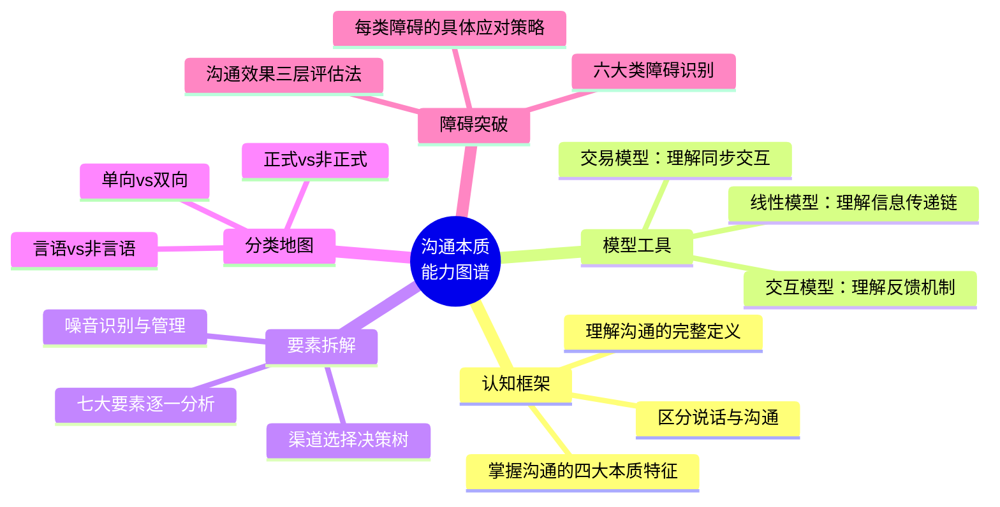
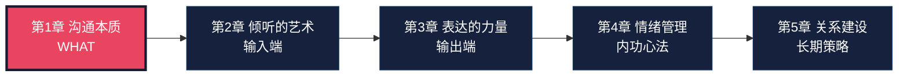
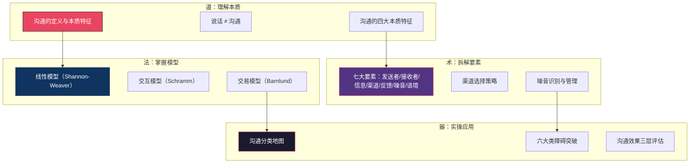
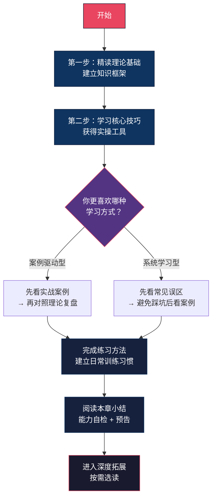

# 第一章：沟通的本质

> "The single biggest problem in communication is the illusion that it has taken place."
> —— George Bernard Shaw（萧伯纳）

## 为什么这一章值得你花时间

你每天都在沟通——发微信、开会、打电话、写邮件、和家人聊天。但你有没有认真想过一个问题：**这些沟通，有多少是真正有效的？**

一份针对2000名职场人的调查显示：普通员工平均每天花费2.5小时在沟通相关活动上，但其中**超过50%的时间**被用于澄清误解、重复说明、弥补沟通失误。换句话说，沟通效率的低下，每年在你身上偷走了数百个小时。

问题的根源不在于你"不会说话"，而在于你从未系统地理解过**沟通到底是什么**。

很多人以为沟通就是"把话说清楚"。这个认知从第一步就错了。沟通不是一个动作，而是一个**系统**——包含编码、传输、解码、反馈、噪音、语境等多个环节的完整系统。任何一个环节出问题，信息就会失真。

本章的任务是帮你建立对沟通的**完整认知框架**。这不是理论课，而是**操作系统升级**——升级你看问题的视角，后续所有技巧才有立足之地。

### 学完这一章，你会获得什么

---

## 本章定位：全书的基石

### 在知识体系中的位置

本书共30章，分为六大模块。第一章位于"第一模块：沟通基础"的最前端，承担的角色是**地基中的地基**。

为什么把"沟通的本质"放在第一章？因为大多数沟通失败的根源，不是技巧不足，而是**认知框架错误**。你带着"沟通=说话"的旧框架去学技巧，就像带着错误的地图学开车——越努力，偏得越远。

**前置知识**：无。本章是零基础起点，不需要任何沟通学或心理学背景。

**后续依赖**：第二章（倾听的艺术）直接建立在本章的"接收者"和"反馈"概念之上；第三章（表达的力量）需要本章的"编码"和"信息设计"概念；第四章（情绪管理）需要本章的"噪音"和"心理障碍"概念。跳过本章，后续章节的理解会出现结构性缺陷。

### 一个真实的认知重构案例

张伟是一名技术经理，带8人团队。他一直认为自己的沟通能力"还行"——直到做了一次360度反馈，同事们的评价让他震惊：

- "开会时他总在说，但从不确认我们是否理解了"
- "邮件写得像技术文档，看不懂他到底要我们做什么"
- "出了问题他说'我之前说过了'，但他说的方式和我们的理解完全不一样"

张伟的问题不是口才差，而是**认知框架有问题**——他把沟通等同于"信息输出"，忽略了接收者解码、反馈确认、渠道选择等环节。学完本章后，他用了三个改变：

1. 每次布置任务后要求对方复述理解（反馈环节）
2. 重要邮件发送前检查"接收者视角"（解码环节）
3. 涉及情绪的事改用面谈而非微信（渠道选择）

三个月后，团队的"沟通满意度"评分从3.2提升到4.5（5分制）。

---

## 核心知识点地图

本章内容按照"道→法→术→器"的逻辑层层递进：

| 知识模块 | 核心概念 | 关键收获 | 与其他章节的关联 |
|----------|----------|----------|-----------------|
| 沟通定义 | communicare、信息传递与理解 | 区分"说话"与"沟通" | 第3章（表达）、第7章（说服） |
| 沟通模型 | 线性→交互→交易模型演进 | 用交易模型思维指导日常沟通 | 第2章（倾听的双向性）、第11章（谈判的同步博弈） |
| 七大要素 | 发送者、接收者、信息、渠道、反馈、噪音、语境 | 系统性诊断沟通问题的工具 | 第5章（非言语沟通）、第9章（反馈技巧） |
| 沟通类型 | 言语/非言语、正式/非正式、单向/双向 | 根据场景选择最优沟通方式 | 第4章（正式场合）、第8章（非正式社交） |
| 沟通障碍 | 语言/心理/文化/组织/物理/认知六大类 | 识别障碍→分析原因→选择策略 | 第4章（心理障碍深度展开）、第16章（跨文化沟通） |

---

## 五大学习目标

完成本章学习后，你应该能够：

### 目标一：准确定义沟通（知识层）

能用自己的话解释什么是沟通，清晰区分"说话"与"沟通"的本质区别。不是背定义，而是真正理解——沟通是信息的**传递与理解**的过程，关键在"理解"，不在"表达"。

**检验标准**：能向一个从没思考过这个问题的朋友解释清楚，让他恍然大悟。

### 目标二：掌握三大经典模型（知识层）

能描述线性模型、交互模型和交易模型的核心区别和适用场景，并理解为什么交易模型最贴近现实。

**检验标准**：面对一个具体场景（如团队会议、微信聊天、客户谈判），能判断哪个模型最有解释力，并说明为什么。

### 目标三：系统分析沟通要素（理解层）

能完整说出沟通的七大要素，解释每个要素的作用，并在实际沟通中进行系统性诊断。

**检验标准**：当一次沟通出现问题时，能用七要素框架快速定位问题出在哪个环节。

### 目标四：识别并突破沟通障碍（应用层）

能识别日常沟通中六类常见障碍，分析其产生原因，并选择对应的突破策略。

**检验标准**：回顾过去一周的一次沟通失误，能准确归因到具体障碍类型，并给出改进方案。

### 目标五：建立沟通效果评估意识（应用层）

能从"信息到达→理解一致→行动匹配"三个层次评估沟通效果，养成主动确认理解的习惯。

**检验标准**：在日常沟通中开始主动使用"我说明白了吗？"或"你的理解是？"来确认第二层。

---

## 核心要点速览

在深入学习之前，先建立整体认知框架。以下是本章的五个核心观点：

### 要点一：沟通的本质是信息的传递与理解

沟通不仅仅是"说话"，而是一个完整的信息传递和理解过程。真正的沟通发生在**对方理解了你的意思之后**，而不仅仅是在你把话说完之后。

这意味着一个根本性的视角转换：沟通的效果应该以**接收者的理解程度**来衡量，而不是以发送者的表达意愿来衡量。你觉得"我说得很清楚"毫无意义——对方是否真的理解了才是关键。

**一个自我检测**：回忆最近三次你认为"已经说清楚了"但对方执行出错的情况。这三次失败的共同原因是什么？大概率不是对方笨，而是你在编码、渠道或确认理解的某个环节出了问题。

### 要点二：沟通是一个双向甚至多向的过程

现代沟通理论强调，沟通不是单方面的信息灌输，而是双方（或多方）共同参与、相互影响的过程。

即使在看似"单向"的演讲中，听众的眼神、表情、提问也在不断地向演讲者传递信息。一个经验丰富的演讲者会实时读取这些信号——看到困惑的眼神就换种说法，看到低头看手机就加快节奏或抛出问题。这就是交易模型的核心思想：**所有人同时在发送和接收**。

**实际影响**：当你意识到自己时刻也在"接收"信息时，你会变得更敏锐——你能更早地察觉对方的困惑、不耐烦或认同，从而及时调整。

### 要点三：非言语信息往往比言语信息更有力量

梅拉比安（Albert Mehrabian）的经典研究表明，在涉及情感和态度的沟通中，非言语信息占到信息传递总量的93%——其中语调占38%，面部表情占55%，而语言内容仅占7%。

**重要限定**：这个数据适用于情感态度类沟通（表达关心、展示诚意、传递情绪）。当你传递事实性信息（报数据、讲流程）时，内容仍然是主导。但即便如此，"怎么说"在绝大多数场景中都比"说什么"更重要——同样的内容，用不同的语气、表情、时机说出来，效果天差地别。

**一个残酷的现实**：你说"我很重视这件事"时，如果语调平淡、眼神飘忽、身体后倾，对方100%会相信你的身体语言，而不是你的文字。

### 要点四：沟通障碍无处不在，但可以被识别和克服

噪音、偏见、情绪、文化差异、组织层级、认知偏差——这些因素无时无刻不在干扰沟通。但好消息是：**障碍一旦被识别，就失去了一半的破坏力**。

本章将系统梳理六大类沟通障碍，每类障碍都配有具体的识别信号和应对策略。这不是理论列表，而是一个**实战诊断工具箱**——下次沟通出问题时，你可以快速对照排查。

### 要点五：沟通能力是可以系统训练的

哈佛商学院的一项纵向研究追踪了MBA学生20年的职业发展，发现：那些在毕业时"沟通能力"评分最高的学生，20年后的平均收入比评分最低的学生高出**13%**，晋升到高管层的概率高出**2.5倍**。

沟通不是一种天赋，而是一种技能。神经科学研究表明，人类大脑的可塑性意味着——通过系统的学习和持续的练习，你可以在任何年龄显著提升沟通能力。就像学开车一样，一开始需要刻意操作每个步骤，但随着练习，这些操作会变成自动化的"肌肉记忆"。

**关键不是"你有没有天分"，而是"你有没有正确的方法和足够的练习"。**

---

## 本章结构与学习路径

### 内容结构

| 序号 | 节 | 核心问题 | 内容概要 | 阅读时间 |
|------|-----|---------|----------|---------|
| 01 | 理论基础 | 沟通到底是什么？ | 定义、本质特征、三大模型、七大要素、类型分类、障碍分析 | 25分钟 |
| 02 | 核心技巧 | 如何实际操作？ | 清晰表达、有效倾听、反馈的艺术、提问的力量 | 25分钟 |
| 03 | 实战案例 | 真实场景怎么做？ | 8个场景：工作汇报、安慰朋友、家人沟通、客户投诉、跨部门协作、面试、约会、微信工作群 | 30分钟 |
| 04 | 常见误区 | 哪里容易踩坑？ | 10个高频沟通误区及纠正方法 | 15分钟 |
| 05 | 练习方法 | 怎么练才能进步？ | 每日/每周练习任务与进度跟踪体系 | 15分钟 |
| 06 | 本章小结 | 学到了什么？ | 要点回顾、能力自检、下一章预告 | 8分钟 |
| 07 | 深度拓展 | 进阶内容 | 学术前沿、跨学科视角、延伸阅读 | 按需 |

**总建议学习时间**：约2小时（可分2-3次完成）

### 推荐学习路径

**关键原则**：不要跳过练习部分。阅读理论能让你"知道"，但只有练习才能让你"做到"。沟通能力的提升，10%靠阅读，90%靠实践。

---

## 前置自测：你对沟通的认知有多深？

在开始正式学习前，花3分钟完成这个快速自测。不需要打分——目的是帮你找到认知盲区，让后续学习更有针对性。

### 自测题目

请诚实回答以下10个问题（在心里默记你的答案）：

| 序号 | 问题 | 你的直觉答案 |
|------|------|-------------|
| 1 | 沟通和"说话"是同一件事吗？ | 是 / 否 |
| 2 | 一次成功的沟通，主要由谁来负责？ | 说话的人 / 听话的人 / 双方共同 |
| 3 | 你发了一封邮件，对方收到了，这次沟通完成了吗？ | 是 / 否 |
| 4 | 面对面沟通中，语言内容传递了多少比例的信息？ | 50%以上 / 30%左右 / 10%以下 |
| 5 | 一个性格内向的人能成为优秀沟通者吗？ | 能 / 不能 |
| 6 | 沟通中最大的障碍通常来自哪里？ | 外部环境 / 对方的问题 / 自己的内心 |
| 7 | 会议上没有反对意见，意味着大家都同意了吗？ | 是 / 否 |
| 8 | "我说得很清楚了"这句话本身有什么问题？ | 没问题 / 有问题 |
| 9 | 用微信文字讨论复杂问题，效率如何？ | 高效 / 低效 / 取决于情况 |
| 10 | 沟通能力是天生的还是可以后天培养的？ | 天生 / 后天培养 |

### 自测解析

**如果你的答案大部分偏向左侧选项**：你对沟通的认知还停留在"常识"层面。这恰恰说明本章对你价值最大——你将获得一套全新的认知框架。

**如果你的答案大部分偏向右侧选项**：你已经有一定的沟通意识基础。本章将帮你把这些零散的认知系统化，形成完整的知识体系。

**如果你的答案介于两者之间**：这很正常。大多数人的沟通认知处于"半自觉"状态——隐约觉得有些东西不对，但说不清楚到底是什么。本章的任务就是帮你把这些模糊的直觉变成清晰的认知。

> 这个自测没有"标准答案"。学习完本章后，回来重新回答一遍——你会发现自己看问题的角度完全不同了。

---

## 关键术语表

在正式学习前，先熟悉这些核心术语。后续内容会频繁使用它们。

| 术语 | 英文 | 定义 | 常见误解 |
|------|------|------|----------|
| **沟通** | Communication | 信息从发送者传递到接收者，并被理解和反馈的过程 | ≠ 说话（说话只是沟通的一个环节） |
| **编码** | Encoding | 将想法转化为可传递的符号（语言、文字、表情等） | 不只是"组织语言"，也包括选择语气、表情、渠道 |
| **解码** | Decoding | 接收者将符号转化为可理解的意义 | 解码结果≠编码意图，偏差是常态 |
| **反馈** | Feedback | 接收者对信息的回应，用于确认理解和调整沟通方向 | ≠ 回复（沉默、表情、行为都是反馈） |
| **噪音** | Noise | 任何干扰信息传递和理解的因素 | 不只是物理噪音，还包括心理、文化、语义噪音 |
| **语境** | Context | 沟通发生的物理、社会、文化、心理环境 | 同一句话在不同语境下含义可能完全不同 |
| **渠道** | Channel | 信息传递的媒介和途径 | 渠道选择不当会严重影响沟通效果 |
| **非言语沟通** | Non-verbal Communication | 不通过语言文字传递信息的方式（表情、语调、肢体等） | 不是"辅助"，而是信息传递的主体 |
| **沟通模型** | Communication Model | 用简化方式描述沟通过程的理论框架 | 模型不是现实，而是理解现实的工具 |

---

## 本章核心概念速查

学习过程中如果需要快速回顾，以下是本章涉及的核心概念及其一句话解释：

**关于沟通的本质**：
- **沟通的本质**：信息传递 + 意义共享 + 关系构建的三位一体过程
- **说话 vs 沟通**：说话是单向输出，沟通是双向理解；说话关注"我要说什么"，沟通关注"对方理解了什么"
- **四大本质特征**：不可逆（覆水难收）、连续性（前因后果）、不可重复（情境不同）、双层传递（内容+关系）

**关于沟通模型**：
- **线性模型**：发送→编码→传输→解码→接收（忽略了反馈）
- **交互模型**：在线性基础上加入反馈和语境（但仍是交替进行）
- **交易模型**：所有参与者同时发送和接收，意义共同构建（最接近现实）

**关于沟通要素**：
- **七大要素**：发送者、接收者、信息、渠道、反馈、噪音、语境
- **渠道选择原则**：信息越重要越复杂 → 选信息越丰富的渠道；涉及情感 → 选面对面；需要留底 → 选书面

**关于沟通障碍**：
- **六大类障碍**：语言障碍、心理障碍、文化障碍、组织障碍、物理障碍、认知障碍
- **三层评估标准**：信息到达（听到了）→ 理解一致（理解对了）→ 行动匹配（做对了）

---

## 学习建议

1. **先读理论基础和核心技巧**：建立知识框架后再看案例，否则案例分析你会"看热闹"而非"看门道"
2. **带着问题读**：每次阅读前，先想想自己最近的一次沟通失误，带着这个问题去读——你会发现答案就藏在内容里
3. **不要跳过练习**：沟通能力的提升，关键在于实践。读完理论不练习，就像看完游泳教学视频不下水——你以为自己会了，但其实不会
4. **分多次完成**：2小时的内容不必一口气读完。建议分2-3次，每次40-60分钟，中间留出消化和反思的时间
5. **学完就用**：当天学完某个概念后，在当天的某次沟通中有意识地运用它。学而不用等于没学
6. **记录心得**：准备一个"沟通学习笔记"，记录你在学习过程中的感悟、对照自身发现的问题、以及实践后的效果。这个笔记会成为你最有价值的学习资产

---

## 延伸阅读预览

如果你对本章内容特别感兴趣，以下资源可以帮你进一步深化理解：

| 资源 | 类型 | 推荐理由 | 适合人群 |
|------|------|---------|---------|
| 《沟通的艺术》（罗纳德·阿德勒） | 书籍 | 沟通学经典教材，系统全面 | 想要系统学习的读者 |
| 《非暴力沟通》（马歇尔·卢森堡） | 书籍 | 聚焦情感沟通，方法论极强 | 希望改善亲密关系的读者 |
| 《关键对话》（帕特森等） | 书籍 | 专注于高压力、高风险沟通场景 | 职场人士 |
| 《沟通的10个致命错误》 | TED演讲 | 18分钟快速了解沟通常见陷阱 | 时间有限的读者 |
| Paul Ekman的微表情研究 | 学术/视频 | 非言语沟通的权威研究 | 对非言语沟通感兴趣的读者 |

> 这些资源将在本章末尾的"深度拓展"中有详细介绍和阅读指南。

---

> 💡 **最后提醒**：本章是全书30章的第一步。它不会教你"说话的技巧"——那是后续章节的事。它做的是更根本的事：**帮你重构对沟通的认知框架**。这个框架一旦建立，后续所有技巧的学习效率会提升数倍。所以请耐心读完，认真思考，踏实练习。地基打好了，后面的楼才盖得稳。
