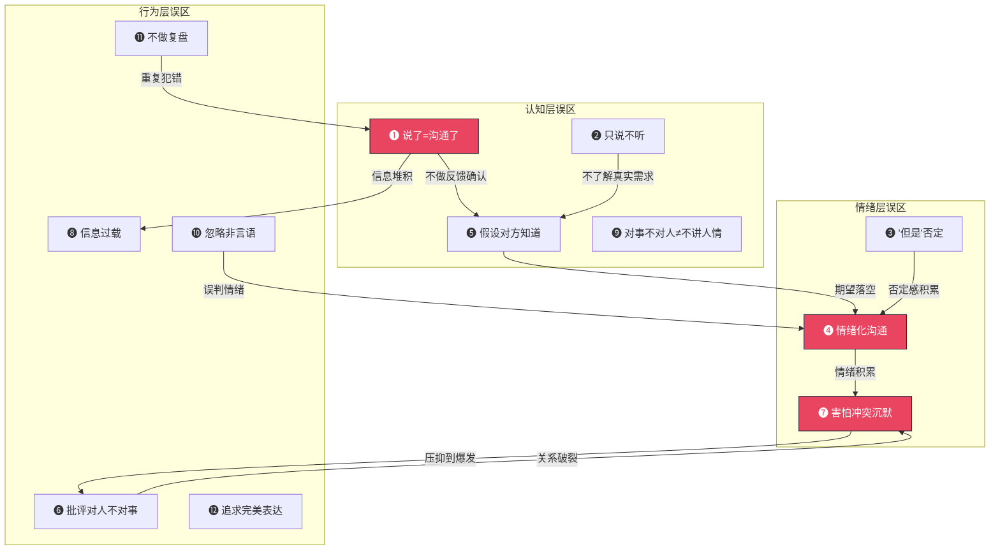
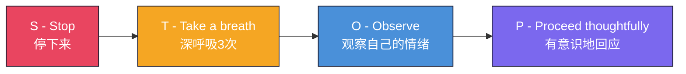

# 沟通的常见误区：从认知偏差到行为纠正

> "The illusion that we communicate is the most dangerous of all."
> —— Paul Watzlawick（帕洛·瓦兹拉维克），交互传播理论创始人

你可能已经掌握了沟通的基本模型、七大要素和核心技巧，但在实际操作中，仍然会反复踩进同一个坑里。这不是因为你笨——而是因为人类大脑天生存在一系列认知偏差，这些偏差会让你在沟通中做出直觉上"合理"但实际有害的选择。

本节将系统剖析沟通中最常见的误区。每个误区都会回答四个问题：**它长什么样**（表现信号）、**为什么会发生**（认知机制）、**造成什么后果**（代价分析）、**怎么纠正**（实操方法）。理解了底层机制，你才能真正改掉这些习惯，而不仅仅停留在"知道但做不到"的层面。

---

## 误区全景图：12个高频陷阱的关联结构

在逐一分析之前，先建立整体认知。这12个误区不是孤立存在的——它们之间存在因果链和强化回路。理解这些关系，才能从根本上打破恶性循环。

**关键洞察**：误区之间形成三条典型恶性循环链——

1. **认知-认知链**：说了≠沟通了 → 不确认理解 → 假设对方知道 → 沟通失败
2. **情绪-行为链**：情绪化 → 说出伤人的话 → 关系受损 → 更容易情绪化
3. **回避-爆发链**：害怕冲突沉默 → 情绪积累 → 压抑到极点突然爆发 → 关系破裂

打破任何一条链的任一环节，都能阻止恶性循环的蔓延。下面逐一深入分析。

---

## 误区一：以为"说了"就等于"沟通了"

### 表现信号

这是所有沟通误区的**元凶**——其他很多误区都是它的衍生品。核心表现：

- 发完消息就觉得"任务完成了"，不看对方是否回复或理解
- 布置任务后不跟进，出了问题才说"我明明说过了"
- 把"信息发出"等同于"信息到达"，把"信息到达"等同于"信息被理解"
- 听到对方说"嗯""好的"就认为对方完全理解了

### 认知机制：发射器偏差（Transmitter Bias）

心理学研究将这种现象称为**发射器偏差**——人们在沟通过程中，天然地过度关注自己作为"信息发射方"的行为，而低估了接收方解码过程的复杂性。

造成这种偏差的原因是**知识的诅咒**（Curse of Knowledge）：当你已经知道一件事之后，你很难想象"不知道这件事"是什么感觉。你觉得自己说得一清二楚，是因为你脑子里已经有完整的背景信息；但对方脑子里是空白的，他需要用你给的有限信息去拼凑出完整的画面。

### 代价分析

| 后果类型 | 具体表现 | 严重程度 |
|---------|---------|---------|
| 任务执行偏差 | 同事理解的目标和你意图不一致 | ⭐⭐⭐⭐ |
| 信任损耗 | 反复出现"我说过了"的对话，对方觉得你在甩锅 | ⭐⭐⭐⭐⭐ |
| 时间浪费 | 重复沟通、返工、修补误解 | ⭐⭐⭐⭐ |
| 关系恶化 | 对方觉得你不在乎他的理解 | ⭐⭐⭐⭐ |

### 纠正方法：三层确认法

**第一层：编码确认（你说之前）**

在开口之前，先问自己三个问题：
1. 对方的知识背景是什么？他可能不知道哪些我认为理所当然的信息？
2. 这次沟通的核心目标是什么？对方听完后应该做什么？
3. 最适合这个信息的表达方式是什么？口头、书面、还是两者结合？

**第二层：传输确认（你说完之后）**

不要问"你听懂了吗？"——大多数人出于面子会说"听懂了"。换一种方式：

❌ "我说清楚了吗？"（确认的是你自己）
❌ "你听懂了吗？"（让对方感到被质疑）

✅ "你能说说你的理解吗？我想确认我们理解一致。"（把确认变成合作）
✅ "这个方案你觉得哪部分需要再讨论一下？"（假设存在疑问，降低对方表达顾虑的门槛）

**第三层：行动确认（执行过程中）**

对于重要事项，在执行过程中设置检查点：
- 布置任务时明确："我们明天下午3点对一下进展，你看这个时间可以吗？"
- 发送书面总结："刚才讨论的内容我整理了一下，你看看有没有遗漏。"
- 关键节点主动问："做到哪一步了？有没有卡住的地方？"

> 💡 **核心原则**：沟通的完成标准不是"我说完了"，而是"对方按我的意图行动了"。在此之前，沟通都还在进行中。

---

## 误区二：只顾自己说，不听对方讲

### 表现信号

- 对方还在说话，你已经在心里组织反驳的话
- 频繁打断对方，用"不对""但是""你听我说"插话
- 对方讲了一个问题，你立刻跳到解决方案，没有先理解问题本身
- 听别人说话时眼神飘移、看手机、身体转向别处
- 把"倾听"理解为"安静等对方说完然后我说"

### 认知机制：自我中心偏差 + 即时反应冲动

人类大脑有两个倾向导致这个误区：

**自我中心偏差**（Egocentric Bias）：人天然更关注自己的想法、感受和观点。神经科学研究表明，当人们在表达自己的观点时，大脑的奖励中枢（腹侧纹状体）会被激活——说话本身就让人感到愉悦。这意味着"说"比"听"在神经层面上更有吸引力。

**即时反应冲动**：当你听到一个触发性的观点时，大脑的杏仁核会在200毫秒内产生情绪反应，前额叶皮层需要更长的时间才能做出理性判断。这就是为什么你总是"先反驳，后思考"。

### 代价分析

不倾听的代价远超表面。它不只是"没听到对方说什么"，而是造成三个层面的损害：

1. **信息损失**：你错过了对方话语中可能改变你判断的关键信息
2. **关系伤害**：对方感到不被尊重、不被重视，信任感下降
3. **决策失误**：基于不完整信息做出的决策，质量必然下降

哈佛商学院的研究显示，管理者在会议中倾听时间占比低于30%的团队，员工敬业度比平均水平低**41%**。

### 纠正方法：结构化倾听框架

**第一步：暂停反应（Pause）**

当对方说话时，刻意抑制自己的即时反应冲动。具体做法：
- 在心里默数3秒再开口
- 用"我听到了"代替"不对"
- 把想说的话先记在纸上，等对方说完再统一回应

**第二步：专注接收（Focus）**

- 放下手机，屏幕朝下扣在桌上
- 身体前倾，保持眼神接触
- 偶尔用"嗯""然后呢""具体是什么情况"等简短回应表示你在听

**第三步：确认理解（Confirm）**

使用"反映式倾听"技术：
模板："你刚才说的[内容]，我的理解是[复述]，对吗？"

示例：
"你刚才说项目延期的原因主要是开发人手不够，我的理解是你需要
临时增加两个开发人员才能赶上deadline，对吗？"

**第四步：深度探索（Explore）**

在确认基本理解后，用开放式问题深入挖掘：
- "你觉得最关键的问题在哪里？"
- "如果只能解决一个问题，你会选哪个？"
- "这件事对你来说最困难的部分是什么？"

> 💡 **记住**：倾听不是"等自己说话的机会"。真正的倾听是**让对方的思路在你脑中完整走一遍**。很多时候，你认真听完了，问题已经解决了一半——因为对方需要的不是你的建议，而是被理解。

---

## 误区三：用"但是"否定前面的肯定

### 表现信号

- "你做得很好，**但是**……"——对方只记住了"但是"后面的内容
- "我理解你的想法，**不过**我觉得……"——对方感到你的"理解"只是开场白
- 先表扬再批评，形成条件反射：每次听到夸奖就知道"坏消息要来了"

### 认知机制：负面偏差（Negativity Bias）

心理学中的**负面偏差**指出：人类对负面信息的关注度、记忆深度和情绪反应强度，大约是正面信息的**3-5倍**。这是进化的产物——在生存环境中，忽视威胁比忽视机会的代价更大。

当你说"你做得不错，但是……"的时候，"但是"这个转折词充当了一个**注意力重定向信号**——它告诉对方"前面说的都是铺垫，现在才是真正重要的内容"。负面偏差让你大脑自动加重了"但是"之后内容的权重，正面部分几乎被完全忽略。

更糟糕的是，长期使用这种模式会形成**条件反射**：对方一听到你的表扬，就开始紧张地等待"但是"，你精心设计的正面反馈也失去了激励效果。

### 纠正方法：替换话术与结构重组

**替换词选择**

| 无效表达 | 替代表达 | 效果差异 |
|---------|---------|---------|
| 你做得不错，**但是**需要改进 | 你做得不错，**同时**有几个地方可以更进一步 | "同时"不否定前面，而是并列补充 |
| 我理解你的感受，**但是**你应该… | 我理解你的感受，**如果**在XX方面调整，**会更好** | 条件句式更柔和，指向未来而非否定过去 |
| 方案可以，**不过**成本太高了 | 方案可以，**在此基础上**我们看看怎么控制成本 | 承认价值，追加优化 |

**结构重组：三明治沟通法（升级版）**

传统的"三明治法"（肯定-批评-肯定）已被证明效果有限，因为对方知道你在"套路"他。更好的做法是**将肯定和建议分开说**：

第一步：先说肯定，完整地说，不要加"但是"
  "这次方案的整体思路非常清晰，用户调研做得特别扎实。"

第二步：停顿2-3秒，让肯定沉淀

第三步：用"如果"或"同时"引入建议，聚焦可改进的部分
  "同时，我注意到成本估算这部分偏保守了，
   如果能把获客成本的计算方式再细化一下，方案会更有说服力。"

> 💡 **核心原则**：肯定就是肯定，建议就是建议。不要把两者用"但是"捆绑在一起——那样你既没有肯定成功，也没有建议成功。

---

## 误区四：情绪化沟通

### 表现信号

- 生气时发大段消息，发完就后悔
- 用"你从来都……""你永远都……"这类绝对化语言
- 在愤怒中做决策、发通知、回邮件
- 吵架时翻旧账，把过去的事全部翻出来
- 情绪平复后觉得"我当时为什么要说那些话"

### 认知机制：情绪劫持（Amygdala Hijack）

丹尼尔·戈尔曼在《情商》中描述了**杏仁核劫持**现象：当人感受到强烈情绪时，大脑的杏仁核会绕过前额叶皮层（理性思考区域），直接接管行为反应。这个过程发生在约200毫秒内——远快于你做出理性判断的时间（约600毫秒）。

这意味着：在情绪激动的瞬间，你的理性大脑实际上处于"离线"状态。你说出的话、做出的决定，本质上是情绪的自动反应，而不是深思熟虑的判断。

**"你从来都……""你永远都……"** 这类绝对化语言有一个专门的术语叫**过度泛化**（Overgeneralization），是认知行为疗法（CBT）中定义的核心认知扭曲之一。它几乎100%是不准确的，但会严重伤害对方——因为没有人愿意被全盘否定。

### 代价分析

情绪化沟通的代价是**不可逆**的：

- 说出的话收不回来，即使道歉，伤害已经造成
- 对方会记住你情绪失控的样子，未来每次沟通都会带着防备
- 长期情绪化沟通会形成"沟通恐惧"——对方开始回避与你交流
- 在工作场合，情绪化会严重损害你的专业形象和可信度

### 纠正方法：STOP模型

**S - Stop（停下来）**

感到情绪涌上来的瞬间，给自己按下暂停键。具体信号：
- 心跳加速、手心出汗
- 想用"你从来都""你永远都"这类绝对化语言
- 想翻旧账
- 想发一大段文字

觉察到这些信号时，对自己说："我现在情绪在主导，不是理性的我。"

**T - Take a breath（深呼吸）**

做3次4-7-8呼吸法：
- 吸气4秒
- 屏住7秒
- 呼气8秒

这个呼吸模式能激活副交感神经系统，在30秒内将心率降低10-15%，让理性大脑重新上线。

**O - Observe（观察）**

问自己三个问题：
1. "我现在具体感受到什么情绪？"（愤怒？委屈？恐惧？焦虑？）
2. "这个情绪的触发点是什么？"（对方说了什么？做了什么？）
3. "我真正想要的是什么？"（被理解？被尊重？问题解决？）

**P - Proceed thoughtfully（有意识地回应）**

使用"我"语言表达：

❌ "你让我很失望！"（指责对方）
✅ "我对这个结果感到失望，我希望我们能一起找到解决办法。"
   （表达感受 + 提出需求）

❌ "你根本不关心这个项目！"
✅ "我发现项目进展和我预期有差距，我有些担心，
   我们能讨论一下接下来的计划吗？"
   （描述事实 + 表达感受 + 请求对话）

**紧急情况处理**：如果情绪过于强烈，无法在当下有效沟通，坦诚地请求暂停：
- "我现在情绪有些激动，需要冷静一下。我们30分钟后再继续这个话题，可以吗？"
- "这件事对我很重要，我想认真回应你。给我一点时间整理一下思路，下午再聊。"

这不是逃避，而是负责任的沟通行为。

---

## 误区五：假设对方知道你在想什么

### 表现信号

- "你看着办吧"——然后对结果不满意
- "尽快搞定"——然后追问"怎么还没完成"
- "你应该知道我的意思"——对方其实完全不知道
- 布置任务只说目标，不说背景、标准和约束
- "这还用说吗？"——对，就是需要说

### 认知机制：知识的诅咒（Curse of Knowledge）

这是认知心理学中一个被反复验证的偏差：**当你掌握了某个知识之后，你就很难想象"不具备这个知识"是什么状态**。

1990年斯坦福大学的经典实验中，被试被要求用敲桌子的方式传递一首歌的节奏给另一组人。敲的人预估对方能猜对的概率是50%，实际猜对率只有**2.5%**。原因是敲的人脑中自动播放着旋律，他觉得节奏"已经很明显了"——但听的人只听到了一堆无规律的敲击声。

这个实验完美地解释了为什么你觉得"很明显"的事情，对方却完全看不到——因为你脑中有完整的背景信息（旋律），而对方只接收到了你传递的有限信号（节奏）。

### 代价分析

| 场景 | 后果 | 隐性成本 |
|------|------|---------|
| "你看着办吧" | 对方做出来的结果不符合预期 | 返工 + 信任损耗 |
| "尽快搞定" | 对方理解的"尽快"和你完全不同 | deadline延误 + 互相埋怨 |
| "你应该知道" | 对方猜错了，你觉得他不用心 | 关系裂痕 + 对方不敢再问 |
| 不说背景信息 | 对方缺乏决策依据，要么乱猜要么不敢决策 | 决策质量下降 + 效率降低 |

### 纠正方法：5W1H信息完整度检查

在传达重要信息前，用5W1H框架检查信息完整度：

What  - 具体要做什么？（任务内容）
Why   - 为什么要做？（背景和目的）
Who   - 谁负责？谁配合？谁审批？（角色和权限）
When  - 什么时候完成？中间有哪些节点？（时间要求）
Where - 在哪里做？涉及哪些系统/部门？（空间和范围）
How   - 用什么标准衡量？有什么约束？（执行标准）

**实际应用示例**：

❌ 模糊表达：
"这个报告你弄一下，下周一之前给我。"

✅ 完整表达：
"我需要你做一份Q3的用户增长分析报告（What），
 用来给管理层汇报，展示我们和竞品的差距（Why）。
 你负责数据分析部分，小王负责可视化图表，我最后审核（Who）。
 周五下午6点前你和小王完成初稿，我周末审核，
 周一上午10点提交给管理层（When）。
 数据源用我们的内部BI系统，对比对象是A公司和B公司（Where/How）。
 重点展示留存率和获客成本两个指标的变化趋势（How）。"

> 💡 **一个检验标准**：如果你布置完任务后对方提出了2个以上的问题，说明你的信息传达不够完整。好的信息传达应该让对方只需要提1-2个确认性问题，而不是一堆基础性问题。

---

## 误区六：批评时对人不对事

### 表现信号

- "你怎么这么粗心？"——把行为归因为人格
- "你这个人就是不靠谱"——给人贴标签
- "你每次都这样"——过度泛化
- 批评时语调升高、手指指点、使用第二人称"你"开头
- 在公开场合批评个人

### 认知机制：基本归因错误（Fundamental Attribution Error）

社会心理学中的**基本归因错误**指出：人们在解释他人行为时，倾向于**高估内在因素（人格、能力）**，**低估外在因素（环境、情境）**。

当同事迟交报告时，你的第一反应是"他这个人不靠谱"（内在归因），而不是"他这周可能手头任务太多了"（外在归因）。但如果你自己迟交了报告，你更可能归因为"最近太忙了"（外在归因）——这就是著名的**行动者-观察者效应**。

这种偏差导致了一个恶性循环：你把对方的行为归因为人格问题 → 用批评人格的方式沟通 → 对方感到被攻击 → 产生防御心理 → 行为反而更差 → 你更确信"这个人就是不行"。

### 代价分析

对人不对事的批评是**破坏力最强**的沟通误区之一：

1. **立即后果**：对方进入防御模式，停止接收你传递的信息
2. **短期后果**：对方对你的信任下降，未来沟通的开放度降低
3. **长期后果**：形成"习得性无助"——对方觉得"反正你怎么看我都不行"，干脆放弃改进
4. **团队后果**：如果在公开场合批评个人，整个团队都会变得谨小慎微，不敢冒险

### 纠正方法：SBI反馈模型

**SBI模型**（Situation-Behavior-Impact）是全球500强企业广泛使用的反馈框架，它强制你将批评聚焦在具体行为而非人格上：

S（情境）- 描述具体的情境和时间
B（行为）- 描述你观察到的具体行为
I（影响）- 说明这个行为造成的影响

模板：
"在[具体情境]中，我观察到[具体行为]，
 这导致了[具体影响]。"

示例：
❌ "你太不负责了！"
✅ "在昨天下午的客户会议（S）上，
    你没有提前测试投影设备（B），
    导致会议开始后花了15分钟调试，客户明显不耐烦了（I）。
    下次会议之前，我们能不能提前30分钟到会议室检查设备？"

**批评的五个原则**：

| 原则 | 正确做法 | 错误做法 |
|------|---------|---------|
| 对事不对人 | "这份报告有三处数据错误" | "你怎么这么粗心" |
| 具体不笼统 | "周三下午的会议上你打断了3次发言" | "你总是打断别人" |
| 私下不公开 | 单独约谈 | 当众指出 |
| 建设性不破坏性 | "下次可以这样做" | "你永远做不好" |
| 及时不拖延 | 发现后24小时内沟通 | 积累到年终一起算账 |

---

## 误区七：害怕冲突，选择沉默

### 表现信号

- 心里不同意，嘴上说"嗯嗯好的"
- 被分配了不想做的任务，不敢拒绝
- 看到不合理的事情，选择"算了不说了"
- 害怕"伤感情"，宁可自己委屈
- 长期积累不满，直到某一天突然爆发

### 认知机制：冲突回避偏差 + 社交焦虑

冲突回避的根源通常是两个认知扭曲：

**灾难化思维**：把"表达不同意见"等同于"关系破裂"。大脑自动播放最坏的剧本——"如果我拒绝，他会讨厌我""如果我提意见，团队会分裂"。但实际上，健康的冲突是关系深化的催化剂，回避冲突才真正破坏关系。

**损失厌恶**：心理学研究表明，人对损失的敏感度是收益的**2.5倍**。你害怕"表达意见可能带来的关系损失"，远远大于你期待"表达意见可能带来的问题解决"。这种不对称的风险评估导致你选择了"安全"的沉默。

### 代价分析

沉默的代价是**延迟但剧烈**的：

沉默 → 问题积累 → 情绪积压 → 达到临界点 → 爆发（往往以不恰当的方式）
                                    ↓
                              关系严重受损
                              对方困惑："你怎么突然这样？"
                              你说："我忍你很久了！"
                              对方："你怎么不早说？"

这就是心理学中的**情绪水坝效应**——你以为自己在"忍耐"，实际上你在修建一座水坝。水坝越高，溃坝时的破坏力越大。

### 纠正方法：分级表达法

不需要一步到位地"勇敢表达"，可以从低风险场景开始逐步练习：

**Level 1：表达偏好（低风险）**

"今天吃什么？"
❌ "随便。"（其实不想吃火锅）
✅ "我今天想吃点清淡的，你们觉得呢？"

**Level 2：表达不同观点（中风险）**

"我觉得方案A更好。"
❌ "嗯嗯，方案A挺好的。"（其实觉得方案B更好）
✅ "方案A的优势很明显。同时我想提一下方案B的一个亮点，
    [具体观点]，大家看看有没有参考价值？"

**Level 3：表达不满/设立边界（高风险）**

同事又把工作推给你。
❌ 默默加班做完。
✅ "我理解你现在手头忙，但这个任务不在我的职责范围内，
    我目前的工作量已经满了。我们可以一起跟领导说一下，
    看看怎么分配更合理？"

**Level 4：表达根本性分歧（最高风险）**

领导的方案你认为有重大问题。
❌ 开会时沉默不语，事后跟同事吐槽。
✅ 会前或会后私下找领导：
    "我认真看了方案，有一些担忧想跟你讨论。
    [具体问题]可能导致[具体风险]。
    我有一个替代思路[具体内容]，
    你觉得是否值得在团队里讨论一下？"

> 💡 **核心认知转换**：表达不同意见 ≠ 制造冲突。**不表达**才是最大的冲突制造者——因为你剥夺了对方了解你真实想法的机会，也剥夺了问题被解决的可能。

---

## 误区八：一次传递过多信息

### 表现信号

- 发微信写了一大段，涵盖五六个话题
- 开会时东拉西扯，一个小时过去大家不知道核心议题是什么
- 邮件写了密密麻麻的文字，收件人不知道自己需要做什么
- 汇报时从头到尾讲细节，领导中途问"所以你的结论是什么？"

### 认知机制：认知负荷理论（Cognitive Load Theory）

心理学家约翰·斯威勒提出的**认知负荷理论**指出：人的工作记忆（Working Memory）容量极其有限——米勒定律（Miller's Law）的经典研究表明，人在一次沟通中能有效处理的信息块（Chunk）不超过**7±2个**。而在实际沟通场景中，由于还要处理环境噪音、情绪反应等额外信息，有效的信息块通常只有**3-4个**。

当你一次传递过多信息时，对方的大脑会经历**信息过载**（Information Overload）——工作记忆溢出，开始丢弃信息。结果是：你说了10件事，对方可能只记住了2件，而且很可能不是你最想强调的那2件。

### 代价分析

| 信息量 | 对方记住 | 效率损失 |
|--------|---------|---------|
| 1-3个要点 | 全部记住 | 0% |
| 4-5个要点 | 记住3-4个 | 20-30% |
| 6-10个要点 | 记住2-3个 | 60-70% |
| 10个以上 | 记住1个或全忘 | 80%+ |

### 纠正方法：金字塔沟通法

借鉴麦肯锡的金字塔原理，每次沟通遵循**"结论先行，分层展开"**的结构：

第一步：先说结论（1句话）
  "我建议采用方案A。"

第二步：给出3个核心理由
  "原因有三个：
   第一，成本最低，比方案B节省30%；
   第二，实施周期最短，2周可以完成；
   第三，风险最小，不需要新的技术栈。"

第三步：根据对方反应决定是否展开细节
  如果对方问"成本怎么算的？"再展开第一个理由的细节。

**信息分层的实操原则**：

1. **核心信息**：每次沟通不超过3个核心点
2. **支撑细节**：每个核心点不超过3个支撑细节
3. **按需展开**：细节只在对方提问时才展开，不要主动倾倒
4. **书面补充**：超过3个要点的信息，用书面形式（文档、邮件）补充，不要纯口头传达

**消息写作模板**：

❌ 信息过载型：
"今天的会议讨论了进度问题、资源问题、技术方案、客户反馈、
 下周计划、人员安排、预算调整、风险评估……（继续500字）"

✅ 金字塔型：
"今天的会议有3个核心决定：
 1. 项目延期到3月15日（原因是XX）；
 2. 增加2名开发人员（预算已批准）；
 3. 技术方案改为微服务架构（详见附件）。

 需要你做的：在本周五前完成架构设计初稿。
 有问题随时找我。"

---

## 误区九：忽略非言语信号

### 表现信号

- 对方说"没问题"，但表情犹豫、语气勉强，你以为真的没问题
- 客户说"我再考虑考虑"，你觉得还有希望，但其实对方已经委婉拒绝
- 伴侣说"我没事"，你信以为真，但其实对方很生气
- 只关注对方的字面意思，不关注语气、表情、肢体语言
- 在微信聊天中完全依赖文字，忽略对方的回复速度、语气词、表情包变化

### 认知机制：语言优先偏差（Verbal Bias）

人类大脑存在**语言优先偏差**——我们习惯性地优先处理语言信息，而将非言语信号降级为"背景噪音"。这是因为语言处理走的是大脑的高效语言通路，而非言语信号的解读需要更多的认知资源和情感感知能力。

梅拉比安（Albert Mehrabian）的经典研究表明，在涉及**情感和态度**的沟通中：
- 语言内容传递的信息占 **7%**
- 语调和声音特征占 **38%**
- 面部表情和肢体语言占 **55%**

**重要限定**：这个数据适用于情感态度类沟通。当传递事实性信息（报数据、讲流程）时，内容仍然是主导。但即便如此，"怎么说"在绝大多数场景中都比"说什么"更重要。

### 常见非言语信号解读

| 信号类型 | 正面信号 | 负面信号 |
|---------|---------|---------|
| 眼神 | 稳定的目光接触 | 回避眼神、频繁看别处 |
| 身体姿态 | 前倾、面向你 | 后仰、身体转向别处 |
| 手臂 | 自然放松 | 交叉抱胸（防御姿态） |
| 语速 | 正常节奏 | 突然变快（紧张）或变慢（犹豫） |
| 音量 | 正常音量 | 突然变小（不自信）或变大（激动） |
| 微表情 | 嘴角上扬、眉眼舒展 | 嘴角下拉、眉头微皱、嘴唇紧闭 |
| 回复速度（线上） | 正常节奏回复 | 突然变慢或已读不回 |

### 纠正方法：双重解码训练

**日常训练**：

在每次对话中，刻意练习"双重解码"——同时处理语言内容和非言语信号：

语言层：对方说了什么？
非言语层：对方怎么说的？表情、语气、姿态传递了什么信息？
综合判断：语言和非言语是否一致？不一致时，哪个更可信？

**当语言和非言语矛盾时**：

经验法则：**非言语信号通常比语言更真实**。因为语言是可以刻意控制的，但非言语信号更多是自动反应。

**验证方法**——直接但温和地表达观察：

❌ 直接忽略："好的，那没问题。"（对方明明看起来很犹豫）
✅ 温和确认："我注意到你刚才有些犹豫，是不是还有什么顾虑？
              如果有的话，现在说我们也好提前处理。"

> 💡 **线上沟通的特殊性**：在微信、钉钉等文字沟通中，非言语信号被大幅削弱。你能捕捉的信号包括：回复速度变化、语气词使用（"嗯""嗯嗯""嗯嗯嗯"含义不同）、表情包选择、标点符号使用等。当事情复杂或涉及情感时，**文字沟通的非言语信息不足以支撑判断**——此时应该切换到电话或面谈。

---

## 误区十：不做沟通复盘

### 表现信号

- 每次跟领导汇报都被打回"说重点"，但下次还是老样子
- 每次跟伴侣吵架都是同样的原因，但从不反思自己的沟通方式
- 团队会议效率一直很低，但没有人去改进会议的沟通方式
- 沟通完了就完了，不回想、不记录、不调整

### 认知机制：经验≠学习

很多人以为"经验多了自然就好了"。但心理学研究明确表明：**经验不会自动转化为能力**。只有经过**有意识的反思和调整**的经验才能转化为能力。

这在心理学中叫做**经验学习的反思缺口**（Reflection Gap）。没有反思的经验只是重复——你用同样的方式犯同样的错100次，不会在第101次自动变好。

### 纠正方法：2分钟快速复盘法

每次重要沟通后，花2分钟回答以下三个问题：

┌─────────────────────────────────────────┐
│           沟通复盘模板（2分钟）            │
├─────────────────────────────────────────┤
│ 1. 这次沟通的目标是什么？达成了吗？        │
│    目标：_______________                  │
│    达成度：□完全 □部分 □未达成            │
│                                         │
│ 2. 对方的真实反应是什么？                  │
│    语言层面：_______________              │
│    非言语层面：_______________            │
│                                         │
│ 3. 如果重来一次，我会怎么调整？            │
│    保持的：_______________                │
│    改进的：_______________                │
└─────────────────────────────────────────┘

**进阶：周度回顾**

每周日花10分钟回顾本周的沟通表现：
- 本周沟通中最成功的3个瞬间是什么？为什么成功？
- 本周沟通中最大的1个遗憾是什么？下次怎么避免？
- 本周有没有发现自己反复出现的沟通模式？

**关键原则**：记录"高光时刻"和"踩坑时刻"同样重要。很多人只关注"哪里做得不好"，却忽略了"哪里做得好"——而理解自己的优势，才能有意识地复制成功。

---

## 误区十一：追求完美表达，错过沟通时机

### 表现信号

- 一条消息反复修改30分钟才发出去
- 心里有话想说，但一直在想"怎么说才最完美"，结果错过了最佳表达时机
- 写邮件追求措辞完美，一封邮件写了一小时
- 因为"没准备好"而推迟重要对话，一推再推

### 认知机制：完美主义偏差

完美主义者在沟通中的核心焦虑是："如果说得不好，还不如不说。"这种思维模式忽略了两个关键事实：

1. **及时的80分表达，远胜于迟到的100分表达**。沟通的价值不仅在于内容的质量，更在于时机。一个及时的、表达清晰但不够完美的反馈，比一个迟到一周的、措辞完美的反馈有用100倍。

2. **沟通是迭代的，不是一次性的**。你不需要在第一次就把所有事情说清楚。沟通更像是对话式的拼图——你传递一块，对方回应一块，你们一起把完整的画面拼出来。

### 代价分析

| 行为 | 直接后果 | 间接后果 |
|------|---------|---------|
| 反复修改消息 | 效率低下，焦虑增加 | 对方等得不耐烦 |
| 推迟重要对话 | 问题持续发酵 | 对方觉得你不重视 |
| 追求完美措辞 | 沟通频率下降 | 对方认为你不坦诚 |

### 纠正方法："够好即发"原则

**80/20法则应用于沟通**：

- **80%的价值**来自20%的核心信息——先确保这20%传达清楚
- 剩下的20%可以通过后续沟通补充
- "完美"的沟通不是一次性说全，而是多次沟通逐步完善

**快速表达框架（PREP）**：

P - Point（观点）：先说结论
R - Reason（理由）：给出核心理由
E - Example（例子）：举一个具体例子
P - Point（重申）：再次强调结论

示例（给领导的即时反馈）：
P: "我认为这个方案的风险主要在技术实现上。"
R: "因为我们现有的技术栈不支持这种架构。"
E: "上个月类似的需求，我们尝试过，最终延期了两周。"
P: "建议在技术方案确认之前，先做一个技术可行性评估。"

> 💡 **核心原则**：好的沟通不是一次完美表达，而是持续的有效互动。先发出去，再迭代——就像软件开发中的"快速迭代"一样。

---

## 误区十二：试图控制沟通的结果

### 表现信号

- 对方不同意你的观点时，你感到非常挫败
- 花大量时间准备"完美的话术"来确保对方一定会接受
- 当沟通结果和预期不同时，反复复盘"我哪里说错了"
- 过度关注"说服"对方，而不是"理解"对方

### 认知机制：控制幻觉（Illusion of Control）

心理学中的**控制幻觉**指出：人倾向于高估自己对事件结果的控制能力。在沟通中，这种幻觉表现为"只要我说得够好，对方就一定会认同我"。

但沟通的真相是：你只能控制**自己的表达**，无法控制**对方的理解和决定**。对方有自己的经历、价值观、当前状态和判断标准——这些因素共同决定了他如何接收和回应你的信息。你的话术再完美，也无法100%控制结果。

### 纠正方法：过程导向思维

**认知转换**：

❌ 结果导向："我必须说服他接受我的方案。"
✅ 过程导向："我要清晰地表达我的观点，理解他的顾虑，
             然后一起寻找双方都能接受的方案。"

**实操方法**：

1. **设定"可控目标"**：把沟通目标从"对方接受我的方案"改为"我清晰地表达了方案的优势和风险，对方充分理解了"
2. **关注过程质量**：我是否表达清楚了？我是否认真倾听了？我是否理解了对方的顾虑？
3. **接受不确定性**：即使你做得完美，对方也可能做出和你预期不同的决定——这是正常的

---

## 误区深度对比：容易混淆的误区辨析

在实际应用中，有些误区容易被混淆。以下是常见混淆对的辨析：

| 混淆对 | 误区A | 误区B | 核心区别 |
|--------|-------|-------|---------|
| 沉默 vs 倾听 | 害怕冲突沉默（误区七）：不表达自己的观点 | 积极倾听（正确做法）：先理解再表达 | 沉默是"不敢说"，倾听是"先听后说" |
| 坦诚 vs 情绪化 | 坦诚表达感受（正确做法） | 情绪化沟通（误区四） | 坦诚是理性地表达情绪，情绪化是被情绪控制行为 |
| 直接 vs 粗鲁 | 直接表达需求（正确做法） | 对人不对事的批评（误区六） | 直接聚焦于事情和需求，粗鲁攻击人 |
| 简洁 vs 敷衍 | 简洁表达（正确做法） | 说了=沟通了（误区一） | 简洁但确认对方理解，敷衍是说完了就不管了 |

---

## 综合自检清单与诊断工具

### 快速自检表

在重要沟通之前，花30秒快速过一遍这个清单：

| 序号 | 误区 | 自检问题 | ✅/❌ |
|------|------|---------|------|
| 1 | 说了=沟通了 | 我确认对方理解了吗？ | □ |
| 2 | 只说不听 | 我真的在倾听吗？ | □ |
| 3 | "但是"否定 | 我有没有用"同时"代替"但是"？ | □ |
| 4 | 情绪化 | 我现在的情绪状态适合沟通吗？ | □ |
| 5 | 假设知道 | 我把背景信息和标准都说清楚了吗？ | □ |
| 6 | 对人不对事 | 我批评的是行为还是人格？ | □ |
| 7 | 害怕沉默 | 我有没有表达真实的想法？ | □ |
| 8 | 信息过载 | 这次沟通聚焦了几个核心点？ | □ |
| 9 | 忽略非言语 | 我有没有关注对方的非言语信号？ | □ |
| 10 | 不做复盘 | 沟通结束后我会反思吗？ | □ |
| 11 | 追求完美 | 我是在等"完美时机"还是先行动？ | □ |
| 12 | 控制结果 | 我关注的是过程质量还是只关注结果？ | □ |

### 误区诊断：找出你的"默认误区"

每个人都有自己的**高频误区模式**——不是所有12个误区你都会犯，但其中2-3个可能是你的"默认设置"。找出它们，才能精准改进。

**自问以下问题**：

1. 在最近一周的沟通中，哪次让你最后悔？发生了什么？
   → 你的后悔点指向哪个误区？

2. 别人最常对你沟通方式提出的反馈是什么？
   → 反复出现的反馈指向你的默认误区。

3. 你在什么情绪状态下最容易犯沟通错误？
   → 情绪触发点 + 误区 = 你的高风险组合。

4. 你在跟谁沟通时最容易出问题？
   → 关系类型决定了你的沟通盲区。

通过以上分析，你可以识别出自己的2-3个高频误区，然后有针对性地练习纠正。不需要一次改掉所有问题——**精准地改掉一个高频误区，效果远好于泛泛地"注意沟通方式"**。

---

## 误区纠正的阶段性路径

改掉沟通误区不是一蹴而就的事。心理学研究显示，改变一个习惯性行为模式通常需要**18-254天**，中位数为**66天**（《European Journal of Social Psychology》，2009）。以下是分阶段的改进路径：

**第1阶段：觉察（1-2周）** —— 不求改变，只求看见

- 目标：在犯错的时候能意识到"我又犯了XX误区"
- 方法：每次犯错后，在手机备忘录里记一笔（日期+误区类型+情境）
- 成功标准：一周能记录3次以上

**第2阶段：干预（3-6周）** —— 犯错后立即纠正

- 目标：在犯错后能快速自我纠正
- 方法：意识到犯错后，立刻说"我刚才说的不太对，让我换一种方式说"
- 成功标准：能在犯错后30秒内做出纠正

**第3阶段：自动（7-12周）** —— 新模式成为本能

- 目标：新的沟通模式取代旧的模式
- 方法：通过大量重复练习，让新的行为模式变成自动反应
- 成功标准：不再需要刻意提醒自己，新模式已成为习惯

---

## 章节衔接

> 📌 **本节总结**：12个沟通误区覆盖了认知层、情绪层和行为层三个维度。其中误区一（说了≠沟通了）是**元误区**——理解它是理解其他误区的基础。误区四（情绪化沟通）和误区七（害怕冲突沉默）是**破坏力最大**的两个误区，值得优先纠正。

> 📌 **下一步**：知道了误区在哪里，下一节我们将学习具体的**练习方法**——一套包含每日任务、每周任务和进度跟踪的系统化训练方案，帮助你从"知道"跨越到"做到"。

> 💡 **建议**：把本节的自检清单保存到手机备忘录或打印出来，在重要的沟通之前花30秒快速过一遍。你不需要记住所有12个误区——只需要记住自己的2-3个高频误区，重点突破。
