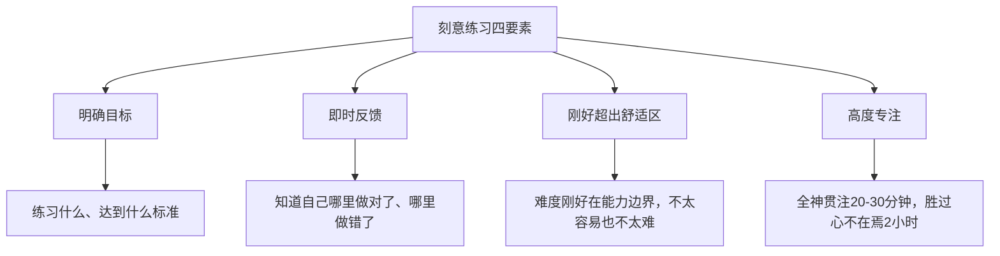
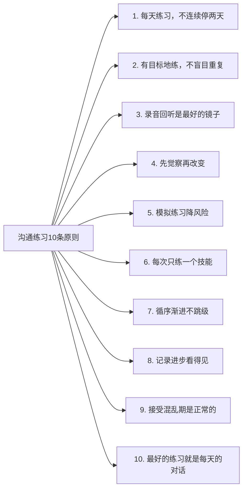

# 沟通练习方法

"知道"和"做到"之间隔着一个巨大的鸿沟，而这个鸿沟只能通过持续的练习来填平。认知科学的研究表明，从"知道一个概念"到"能在真实场景中自如运用"，平均需要 300-500 次有意识的重复练习。这不是天赋问题，而是神经可塑性的问题——大脑需要反复的刺激才能将新行为固化为本能反应。

本节不是一份"心灵鸡汤式"的建议清单，而是一套基于**刻意练习理论**（Anders Ericsson）、**习惯形成科学**（Wendy Wood）和**认知行为训练**（CBT）原理的系统训练方案。它包含自我评估、分级训练、每日/每周任务、进度追踪、障碍排除和进阶路径，帮助你将本章所学的沟通理论转化为肌肉记忆级别的实际能力。

***

## 一、为什么"练习"比"学习"重要得多

### 1.1 知识≠能力：理解"知道"和"做到"的鸿沟

大多数人学习沟通的方式是：读一本书、听一堂课、记住几个技巧，然后期待自己自动变强。这个逻辑存在一个根本性缺陷——**认知理解和行为能力是两个完全不同的神经系统**。

知识获取路径：
  眼睛/耳朵 → 工作记忆 → 语言理解 → "我知道了"
  （涉及区域：颞叶、前额叶语言区）

行为能力路径：
  场景刺激 → 判断 → 行为输出 → 反馈修正 → 固化
  （涉及区域：前额叶决策区、基底神经节、小脑）

"知道"只完成了第一步。你读了一百遍"倾听时要看着对方的眼睛"，在真实对话中可能还是会不自觉地看手机。因为旧的神经通路（看手机）已经固化了几千次，而新的通路（保持眼神接触）才刚刚建立。

### 1.2 刻意练习理论：为什么"练得对"比"练得多"更重要

心理学家 Anders Ericsson 在对小提琴手、棋手、运动员的研究中发现，决定一个人能达到什么水平的，不是练习的总时长，而是**刻意练习的质量**。刻意练习有四个核心要素：

这四个要素直接决定了本节所有练习任务的设计逻辑。每个任务都必须包含：具体目标（不是"练习倾听"，而是"在这次对话中，等对方说完三句话再回应"）、反馈机制（录音回听、同伴反馈、自我评分）、递进难度（从简单场景到复杂场景）。

### 1.3 习惯形成的真相：不是21天，是66天

"21天养成一个习惯"是一个被广泛传播的错误说法。这个数字来源于整形外科医生 Maxwell Maltz 在1960年的一本畅销书中的个人观察，从未被严格的心理学实验验证。

伦敦大学学院的 Phillippa Lally 等人在2009年的研究中，跟踪了96名被试者养成新习惯的过程。结果发现：

| 习惯类型 | 达到自动化平均天数 | 最短天数 | 最长天数 |
|----------|-------------------|---------|---------|
| 简单习惯（如每天喝一杯水） | 18天 | 18天 | 254天 |
| 中等习惯（如每天跑步15分钟） | 66天 | 18天 | 254天 |
| 复杂习惯（如每天练习沟通技巧） | 约90-120天 | 66天 | 254天 |

**关键结论**：偶尔漏掉一天不会毁掉整个习惯链，但你需要一个"绝不连续错过两天"的原则。本节的训练方案设计为**12周（约90天）**的周期，这才是符合科学的训练时长。

### 1.4 训练效果的预期曲线

大多数人在练习沟通时会经历一个典型的"J型曲线"——初期可能感觉比练习前更糟，因为你开始意识到自己以前没注意到的问题。

沟通能力
    ↑
    │                                          ╭───── 实际能力提升
    │                                      ╭──╯
    │                                  ╭──╯
    │         感觉更糟                  │
    │        ╭──────╮             ╭──╯
    │    ╭──╯      ╰──╮      ╭──╯
    │ ╭─╯              ╰──╮──╯
    │─╯                    ╰
    ├────────────────────────────────────→ 时间
    起点   觉察期    混乱期    整合期    内化期
          1-2周    3-4周    5-8周    9-12周

- **觉察期（1-2周）**：开始意识到自己的沟通习惯，会觉得"我以前怎么这样"
- **混乱期（3-4周）**：尝试运用新技巧但不自然，表达可能变得磕磕绊绊，这是正常的
- **整合期（5-8周）**：部分技巧开始变流畅，偶尔能自然运用
- **内化期（9-12周）**：大部分技巧已经成为本能反应，不需要刻意提醒自己

**最重要的心态**：混乱期不是失败的信号，而是大脑正在重建神经通路的标志。就像学开车时一开始手忙脚乱，但坚持下去就会变成自动驾驶。

***

## 二、自我评估：找到你的起点

在开始任何训练之前，你需要知道自己当前的水平。盲目练习就像不看地图就出发——你可能一直在原地打转。

### 2.1 沟通能力六维自评量表

用以下量表对自己进行诚实的评估。每个维度按1-10分打分（1=完全不行，5=平均水平，10=专家级）。

**评分标准说明：**

| 维度 | 1-3分（初学者） | 4-6分（中级） | 7-10分（高级） |
|------|----------------|---------------|----------------|
| **清晰表达** | 经常说不清楚自己的意思，别人需要反复追问 | 基本能说清楚，但有时冗长或缺乏条理 | 总能用最少的词传达最核心的意思，逻辑严密 |
| **有效倾听** | 经常走神，听不到对方的重点 | 能听到内容，但经常错过情绪和隐含信息 | 能同时捕捉内容、情绪和未说出口的需求 |
| **情绪管理** | 情绪经常主导对话，容易激动或退缩 | 通常能控制情绪，但高压下会失控 | 即使在高压场景也能保持冷静和理性 |
| **提问能力** | 很少提问，或只问封闭式问题 | 能问出开放式问题，但缺乏深度和针对性 | 能用精准的提问引导对话方向、挖掘深层需求 |
| **反馈能力** | 很少给反馈，或给出的反馈模糊/伤人 | 能给出结构化的正面反馈，但建设性反馈困难 | 能用对方最容易接受的方式给出尖锐但有用的反馈 |
| **非言语沟通** | 不知道自己在用什么非言语信号 | 有意识地控制部分非言语信号 | 能自如运用肢体语言、语调、节奏来增强表达 |

### 2.2 评估结果与训练路径对应

根据你的自评总分（满分60分），选择对应的训练路径：

| 总分区间 | 水平定位 | 训练策略 | 每日投入时间 |
|---------|---------|---------|-------------|
| **6-18分** | 初学者 | 专注基础技能，先练倾听和简单表达 | 15-20分钟/天 |
| **19-36分** | 中级 | 强化优势、补足短板，加入场景练习 | 20-30分钟/天 |
| **37-54分** | 高级 | 专项突破，挑战复杂场景，精进细节 | 15-20分钟/天（质量优先） |
| **55-60分** | 精通 | 指导他人、研究高级理论、跨文化沟通 | 按需练习 |

**如何使用评估结果：**

1. 选取你得分最低的1-2个维度作为**优先训练项**
2. 选取你得分最高的维度作为**信心基石**（在训练受挫时用来重建信心）
3. 每两周重新评估一次，追踪变化

### 2.3 360度反馈评估

自评最大的盲区是"不知道自己不知道什么"。除了自评，你应该收集至少3个人的外部反馈。

**360度反馈收集模板：**

你好，我最近在系统地提升自己的沟通能力，想请你帮我做一个简单的评估。
请你根据你和我相处/合作的经验，对以下每个维度给出1-10分的评分。
如果有具体的事例或建议，也请一并写下来。非常感谢！

1. 我表达自己想法的清晰程度：____
   具体表现或建议：____________________

2. 我倾听他人时的专注程度：____
   具体表现或建议：____________________

3. 我在情绪激动时的自控能力：____
   具体表现或建议：____________________

4. 我提问的质量和深度：____
   具体表现或建议：____________________

5. 我给出反馈时的方式是否恰当：____
   具体表现或建议：____________________

6. 我的肢体语言和语调给人的感受：____
   具体表现或建议：____________________

7. 你觉得我最需要改进的一个沟通习惯是什么？
   ____________________

8. 你觉得我最突出的一个沟通优点是什么？
   ____________________

**选择反馈对象的原则：**
- 至少1个上级（或年长的朋友/家人）
- 至少1个同级（同事、同学、朋友）
- 至少1个下级（如果你是管理者，或者比你年轻的人）

不同层级的视角能揭示完全不同的问题。上级可能觉得你"汇报不够结构化"，同级可能觉得你"打断别人太多"，下级可能觉得你"说话太直接让人不舒服"。

***

## 三、分级训练方案

### 3.1 初级阶段（第1-4周）：建立基础觉察

**核心目标**：从"无意识的无能"转变为"有意识的无能"。你开始意识到自己的沟通问题，这是改变的前提。

**每周重点：**

| 周次 | 训练重点 | 核心任务 | 每日时间 |
|------|---------|---------|---------|
| 第1周 | 倾听觉察 | 倾听日记 + 不打断练习 | 15分钟 |
| 第2周 | 表达觉察 | 口头禅记录 + 一句话练习 | 15分钟 |
| 第3周 | 非言语觉察 | 肢体语言观察 + 录音回听 | 15分钟 |
| 第4周 | 情绪觉察 | 情绪标记 + 暂停练习 | 15分钟 |

**每日任务（初级版）：**

#### 任务1：倾听日记（5分钟）

**目标**：培养对"自己是否在听"的觉察力

**科学原理**：人类在对话中平均只能保持23秒的专注倾听，之后大脑就开始走神——要么在准备自己要说的话，要么被其他念头拉走。倾听日记通过"事后回顾"机制，让你开始注意到自己走神的频率和模式。

**操作步骤**：
1. 每天选择一次对话（与同事、朋友、家人均可）
2. 对话结束后**立即**记录（不超过5分钟，拖久了细节会模糊）
3. 用以下模板记录：

日期：____
对话对象：____
对话主题：____

专注度评估（1-10分）：____
- 我走神了几次？大约在什么时候？
- 走神时我在想什么？（准备反驳/想别的事/看手机）

打断次数：____次
- 我打断对方时，通常是因为什么？
  □ 急于表达自己的观点
  □ 觉得对方说得太慢
  □ 想帮对方说完
  □ 不同意，想立刻反驳
  □ 其他：____

对方的核心观点（用自己的话，一句话）：____
对方的情绪状态：____

我有没有确认理解？ □ 有 □ 没有
如果有，我是怎么确认的？____

如果重来一次，我会：____

**关键提醒**：第1周的倾听日记目标不是"做得好"，而是"看清楚自己现在是什么样"。你可能会发现自己走神10次、打断5次——这完全正常，而且非常有价值。觉察是改变的第一步。

#### 任务2：一句话练习（3分钟）

**目标**：训练"用最少的词表达最核心的意思"

**科学原理**：认知心理学家 George Miller 发现，人的工作记忆容量为 7±2 个信息块。你的表达越简洁，对方的大脑越容易处理和记住。大多数沟通低效不是因为"说得少"，而是"说了一大堆，重点被淹没了"。

**操作步骤**：
1. 每天选一个话题（可以是今天的工作、新闻、一部电影）
2. 用**一句话（不超过30个字）**表达你的核心观点
3. 说完后用手机录音回听，检查：
   - 是否有"嗯""那个""就是说"等填充词？
   - 听众能否从这句话中获得明确的信息？
   - 这句话是否有歧义？

**话题素材库（按难度递增）：**

| 难度 | 话题示例 | 说明 |
|------|---------|------|
| ★☆☆ | 今天午饭吃了什么，好不好吃 | 纯描述，容易 |
| ★★☆ | 你推荐或不推荐某部电影，为什么 | 需要观点+理由 |
| ★★★ | 你对某个争议性话题的立场 | 需要立场+逻辑 |
| ★★★★ | 用一句话说服领导同意你的方案 | 需要立场+价值+行动 |

**示例：**
- 差："我觉得那个电影还行吧，就是有的地方有点不太合理，但是整体还可以"（39字，核心观点模糊）
- 好："这部电影视觉效果一流，但剧本逻辑有硬伤"（18字，观点明确，结构清晰）

#### 任务3：口头禅觉察（3分钟）

**目标**：发现自己无意识使用的语言习惯

**操作步骤**：
1. 录下自己一天中的某段对话（3-5分钟即可，可以用手机录音，征得对方同意）
2. 回听时，用计数器统计以下词汇的出现频率：

口头禅清单：
□ "然后"（出现____次）
□ "就是说"（出现____次）
□ "那个"（出现____次）
□ "嗯""啊""呃"（出现____次）
□ "其实"（出现____次）
□ "怎么说呢"（出现____次）
□ "反正就是"（出现____次）
□ "你知道吗"（出现____次）
□ "对吧"（出现____次）
□ 其他：____（出现____次）

3. 找出频率最高的2个填充词，下周在每次对话中**有意识地**减少使用

**进阶技巧**：当你发现自己正要说出口头禅时，用一个短暂的**沉默**代替。2-3秒的沉默比"嗯嗯那个"显得更沉稳、更有思考力。

#### 任务4：情绪标记练习（4分钟）

**目标**：在情绪出现的当下识别它，而不是等它爆发后才知道

**科学原理**：加州大学洛杉矶分校的 Matthew Lieberman 发现，仅仅是"给情绪命名"这一个动作，就能降低杏仁核（大脑的情绪中心）的活跃度约30%。这被称为"情感标签效应"（affect labeling）。

**操作步骤**：
1. 每天选3个时间点（早/中/晚），快速记录此刻的情绪状态
2. 使用**精确的情绪词汇**，不要只写"心情不好"：

情绪觉察表

时间：____
事件：____（发生了什么？）

我的情绪（选择所有适用的）：
□ 焦虑  □ 沮丧  □ 愤怒  □ 委屈  □ 尴尬
□ 烦躁  □ 失望  □ 嫉妒  □ 恐惧  □ 无力
□ 开心  □ 感激  □ 兴奋  □ 自豪  □ 平静
□ 放松  □ 期待  □ 满足  □ 感动  □ 其他：____

情绪强度（1-10分）：____

这个情绪想告诉我什么？
____

如果这个情绪会说话，它会说什么？
"____________________"

**关键原则**：情绪没有好坏之分。愤怒告诉你"边界被侵犯了"，焦虑告诉你"有重要的事需要准备"，委屈告诉你"你的需求没有被满足"。觉察情绪的目的不是消除它，而是理解它。

***

### 3.2 中级阶段（第5-8周）：刻意练习核心技巧

**核心目标**：从"有意识的无能"转变为"有意识的有能力"。你知道自己哪里不好，并且开始能有意识地做出正确的行为，虽然还不够自然。

**每周重点：**

| 周次 | 训练重点 | 核心任务 | 每日时间 |
|------|---------|---------|---------|
| 第5周 | 结构化表达 | PREP法则练习 + 结论先行 | 20分钟 |
| 第6周 | 提问技巧 | 开放式问题改写 + 追问练习 | 20分钟 |
| 第7周 | 反馈能力 | SBI模型练习 + 建设性反馈 | 25分钟 |
| 第8周 | 场景整合 | 模拟场景练习 + 角色扮演 | 30分钟 |

#### 任务5：PREP法则实战练习（7分钟）

**目标**：在任何话题上都能做到"结论先行、论据支撑"

**PREP法则详解：**

P - Point（观点）：用一句话亮出你的核心观点
    ↓
R - Reason（理由）：给出支撑观点的理由
    ↓
E - Example（举例）：用具体的例子/数据来证明
    ↓
P - Point（重申）：再次强调你的观点，形成闭环

**练习方式**：
1. 每天选一个话题
2. 用PREP结构组织你的表达
3. 先写出文字稿，然后脱稿口述
4. 录音回听，检查每个环节是否到位

**练习示例：**

话题："你觉得远程办公好不好？"

P（观点）：远程办公是未来的趋势，但需要配套制度才能真正有效。

R（理由）：因为远程办公的核心价值是减少通勤浪费、提升自主性，
但如果没有明确的沟通规范和成果衡量标准，反而会导致协作效率下降。

E（举例）：GitLab 是全球最大的全远程公司，1500名员工分布在67个国家。
他们的成功关键不是"远程"本身，而是建立了一套极致的异步沟通文档体系——
每个决策、每个流程都有详细的文字记录，新员工入职第一天就能找到所有需要的信息。
Buffer 的研究数据也显示，有明确远程规范的团队，生产力提升了13%，
而没有规范的团队，沟通成本增加了约40%。

P（重申）：所以远程办公本身不是问题，问题是企业是否为"远程"建立了对应的制度。
没有制度的远程，只是把"在办公室摸鱼"变成了"在家摸鱼"。

**进阶练习**：从写稿→脱稿→即兴。第5周先写稿，第6周尝试只写关键词，第7周直接即兴PREP。

#### 任务6：提问技巧深度练习（5分钟）

**目标**：从"问了就行"升级到"问对问题"

**三个层次的提问：**

| 层次 | 类型 | 特征 | 示例 |
|------|------|------|------|
| 表层 | 封闭式/确认式 | 用是/否就能回答，信息量小 | "项目完成了吗？" |
| 中层 | 开放式/探索式 | 引导对方展开描述 | "项目目前遇到哪些挑战？" |
| 深层 | 引导式/反思式 | 触发对方深度思考，挖掘底层需求 | "如果这个项目只有一个成功的标准，你会选什么？" |

**每日练习**：每天在至少2次对话中，刻意使用中层或深层问题。

**封闭式→开放式改写练习：**

| 原始问题（封闭式） | 改写版本（开放式） | 为什么改写后更好 |
|-------------------|-------------------|----------------|
| "方案可行吗？" | "你觉得这个方案最大的风险在哪里？" | 引出具体问题，而非简单判断 |
| "你同意吗？" | "你的第一反应是什么？" | 降低防御心理，获得真实想法 |
| "今天忙不忙？" | "今天在忙什么有意思的事？" | 开启有实质内容的对话 |
| "满意吗？" | "如果改进一个地方，你会改什么？" | 引出具体的建设性意见 |
| "要不要加班？" | "这个任务你估计还需要多少时间？" | 了解真实情况，而非催促 |

**追问技巧**：当对方给出回答后，不要急着表态，用以下追问模板深挖：
- "你说的____具体是指什么？"
- "能举一个具体的例子吗？"
- "你觉得背后的原因是什么？"
- "如果可以重来，你会怎么做？"

#### 任务7：SBI反馈模型练习（7分钟）

**目标**：能给出具体、真诚、不伤人的反馈

**SBI模型详解：**

S - Situation（情境）：具体的时间、地点、场景
    ↓
B - Behavior（行为）：你观察到的具体行为（事实，不是评价）
    ↓
I - Impact（影响）：这个行为产生了什么影响

**正面反馈示例：**

| 要素 | 示例 |
|------|------|
| S（情境） | "今天下午的客户会议上，" |
| B（行为） | "当客户质疑我们的报价时，你没有急着解释，而是先问了'您的预算范围是多少'，" |
| I（影响） | "这让客户感到被尊重，也让我们快速找到了双赢的方案。" |

完整版："今天下午的客户会议上，当客户质疑我们的报价时，你没有急着解释，而是先问了'您的预算范围是多少'，这让客户感到被尊重，也让我们快速找到了双赢的方案。这个处理方式非常专业。"

**建设性反馈示例：**

| 要素 | 示例 |
|------|------|
| S（情境） | "今天上午的团队讨论中，" |
| B（行为） | "小王发言到一半时，你直接打断并说'这个方案不行'，" |
| I（影响） | "小王之后再也没说话了，我觉得他可能觉得自己的想法被否定了。" |

完整版："今天上午的团队讨论中，小王发言到一半时，你直接打断并说'这个方案不行'，小王之后再也没说话了，我觉得他可能觉得自己的想法被否定了。我理解你可能已经看到了方案的问题，但如果能先让他说完再给反馈，可能效果会更好。你觉得呢？"

**关键区别**：正面反馈可以公开给，建设性反馈**必须私下给**。在众人面前批评一个人，哪怕你说得再对，对方感受到的只有羞辱。

#### 任务8：场景模拟练习（15分钟）

**目标**：在安全环境中预演高风险场景

**为什么模拟有效**：职业运动员在正式比赛前会进行无数次模拟训练。沟通也一样——在真实场景中犯错的代价可能很高（丢客户、伤关系、影响晋升），模拟练习让你在零代价的环境中反复试错。

**每周场景库（8周计划）：**

| 周次 | 场景 | 重点技巧 | 难度 |
|------|------|---------|------|
| 第5周 | 向领导汇报工作（结论先行） | 结构化表达、数据支撑 | ★★☆ |
| 第6周 | 安慰心情不好的朋友 | 共情倾听、情感回应 | ★★★ |
| 第7周 | 处理客户投诉 | 先情绪后问题、提供方案 | ★★★ |
| 第8周 | 推动跨部门协作 | 解释价值、消除阻力 | ★★★★ |

**模拟练习标准流程：**
1. **准备阶段（3分钟）**：明确场景、角色、你要达成的目标
2. **模拟阶段（5分钟）**：找朋友/同事扮演对方角色，真实对话
3. **反馈阶段（3分钟）**：对方给出反馈（做得好的3点 + 可改进的1点）
4. **再练一次（3分钟）**：根据反馈调整后重来
5. **记录阶段（1分钟）**：写下这次练习最大的收获

**找不到练习伙伴的替代方案：**
- **对着镜子练习**：观察自己的表情和肢体语言
- **录音/录像回放**：以第三方视角审视自己的表现
- **AI对话工具**：用ChatGPT等工具模拟特定场景的对话对象（虽然不能替代真人，但适合初期练习）
- **内心预演**：在真实场景之前，在脑中完整地过一遍对话流程

***

### 3.3 高级阶段（第9-12周）：复杂场景与内化

**核心目标**：从"有意识的有能力"转变为"无意识的有能力"。技巧开始自动化，你不再需要"想一想该用什么技巧"，而是在高压场景中也能自然应对。

**每周重点：**

| 周次 | 训练重点 | 核心任务 | 每日时间 |
|------|---------|---------|---------|
| 第9周 | 高压对话 | 关键对话模拟 + 情绪管理 | 20分钟 |
| 第10周 | 跨文化/跨场景 | 不同场景切换练习 | 20分钟 |
| 第11周 | 教练式沟通 | 用提问引导他人思考 | 15分钟 |
| 第12周 | 综合实战 | 真实场景全量应用 + 总复盘 | 20分钟 |

#### 任务9：高压对话练习（10分钟）

**目标**：在情绪激动的场景中保持沟通能力

**高压场景的特征**：
- 双方意见严重对立
- 有一方或双方情绪激动
- 结果有重大影响（升职、解雇、分手、重大决策）
- 时间压力大
- 有旁观者在场

**PREP-EMO框架**（在PREP基础上加入情绪管理）：

P - Pause（暂停）：情绪激动时，先暂停3-10秒
    ↓
R - Regulate（调节）：深呼吸3次，降低生理唤醒
    ↓
E - Empathize（共情）：先说出对方的感受，"我能感觉到你很____"
    ↓
P - Proceed（继续）：再用PREP结构表达你的观点

**模拟练习清单：**

| 场景 | 触发情绪 | 训练要点 |
|------|---------|---------|
| 领导当众批评你的方案 | 羞辱/愤怒 | 不当场反驳，先接受再私下沟通 |
| 同事推卸责任到你头上 | 愤怒/委屈 | 用事实说话，不攻击人格 |
| 伴侣说"你从来不关心我" | 委屈/防御 | 不辩解，先倾听和共情 |
| 客户要求不合理的时间线 | 焦虑/压力 | 不直接拒绝，而是提供替代方案 |

#### 任务10：跨场景切换练习（8分钟）

**目标**：同一个信息，在不同场景下用不同的方式表达

**练习方法**：选择一个信息，用四种场景的风格分别表达：

信息：这个项目需要延期两周

场景1 - 向领导汇报（结论先行 + 方案）：
"项目需要延期两周，主要原因是供应商交付延迟。我建议两个方案：
A方案是接受延期，保证质量；B方案是加急交付，但需要增加5万元预算。
我倾向A方案，您觉得呢？"

场景2 - 对团队通知（直接 + 支持）：
"项目延期两周，不是我们团队的问题，是供应商那边出了状况。
我已经跟领导沟通好了，不会影响大家的绩效。
接下来两周的重点是____，大家有什么困难随时跟我说。"

场景3 - 对客户告知（尊重 + 解决方案）：
"感谢您的耐心等待。为了确保交付质量达到您期望的标准，
我们需要额外两周的时间做最终测试。作为补偿，
我们会额外提供一个月的免费技术支持。"

场景4 - 对家人解释（轻松 + 情感）：
"最近项目可能会忙两周，不是出了什么问题，
是时间线调整了一下。这两周我可能会晚点回来，
不过忙完我请你吃大餐补偿。"

**关键洞察**：沟通能力不是"会说话"，而是"能根据场景灵活调整"。一个只会用一种风格说话的人，无论这种风格多好，都会在某些场景中碰壁。

#### 任务11：教练式沟通练习（10分钟）

**目标**：从"给答案"进化到"问问题"，帮助他人自己找到答案

**教练式沟通的核心原则**：不要急于给建议，而是通过提问引导对方思考。

传统模式：
  对方说问题 → 你给建议 → 对方要么听要么不听

教练模式：
  对方说问题 → 你提问引导 → 对方自己找到答案 → 更有行动力

**教练式提问清单：**

| 阶段 | 问题模板 | 目的 |
|------|---------|------|
| 澄清 | "你说的____具体是指什么？" | 确保理解一致 |
| 探索 | "你已经尝试过什么方法？" | 了解已有的努力 |
| 深挖 | "你觉得问题的根本原因是什么？" | 引导深度思考 |
| 拓展 | "如果不受任何限制，你会怎么做？" | 打开思路 |
| 聚焦 | "在所有可能的选项中，你最倾向哪个？" | 帮助决策 |
| 行动 | "下一步你打算怎么做？什么时候开始？" | 推动执行 |

**练习方式**：下次当有人来找你"请教问题"或"倾诉烦恼"时，克制住给建议的冲动，全程只用问题来回应。记录下对方的反应——你会发现，大多数时候对方自己就能找到答案。

***

## 四、每日练习总表

以下是所有阶段通用的每日练习时间安排。根据你的当前阶段，选择对应的任务组合。

### 4.1 初级阶段每日流程（15分钟）

早晨（5分钟）：
  □ 设定今天的沟通意图（"今天我要在至少一次对话中不打断对方"）
  □ 快速情绪标记（觉察此刻的情绪状态）

白天（5分钟）：
  □ 完成至少1次倾听日记
  □ 完成1次一句话练习

晚上（5分钟）：
  □ 完成口头禅觉察记录
  □ 复盘日记：做得好的 + 可改进的 + 明天尝试的

### 4.2 中级阶段每日流程（25分钟）

早晨（5分钟）：
  □ 设定今天的沟通目标（"今天我要用PREP法则表达至少3次"）
  □ 情绪标记

白天（15分钟）：
  □ 倾听日记（5分钟）
  □ PREP表达练习或提问练习（5分钟）
  □ SBI反馈练习（5分钟）

晚上（5分钟）：
  □ 复盘日记 + 录音回听关键对话
  □ 记录今天的"高光时刻"

### 4.3 高级阶段每日流程（20分钟）

早晨（3分钟）：
  □ 设定今天的专项挑战（"今天我要在至少一次高压对话中保持冷静"）

白天（12分钟）：
  □ 跨场景切换练习（选择1个信息，用2种风格表达）
  □ 教练式沟通练习（1次对话）

晚上（5分钟）：
  □ 深度复盘（不只记录，还分析"为什么"和"如果重来"）
  □ 更新能力自评得分

***

## 五、每周练习任务

每周安排1-2次较长的深度练习，每次30-60分钟。

### 5.1 模拟场景练习（30分钟）

每周选一个场景，按标准流程（准备→模拟→反馈→再练→记录）完成一次完整的角色扮演。

**推荐场景清单（12周递进）：**

| 阶段 | 周次 | 场景 | 重点技巧 | 难度 |
|------|------|------|---------|------|
| 初级 | 1-2 | 日常闲聊/破冰 | 开放式问题、倾听 | ★☆☆ |
| 初级 | 3-4 | 接听电话/处理简单请求 | 简洁表达、确认理解 | ★★☆ |
| 中级 | 5-6 | 向领导汇报/争取资源 | 结论先行、数据支撑 | ★★★ |
| 中级 | 7-8 | 处理投诉/化解矛盾 | 先情绪后问题、双赢方案 | ★★★ |
| 高级 | 9-10 | 薪资谈判/关键决策 | 利益分析、BATNA策略 | ★★★★ |
| 高级 | 11-12 | 公众演讲/团队动员 | 结构设计、感染力 | ★★★★★ |

### 5.2 沟通观察练习（15分钟）

**目标**：通过观察高手的沟通方式，内化优秀模式

**观察来源：**
- 高质量TED演讲（关注结构、停顿、眼神、手势）
- 优秀的播客访谈（关注主持人如何追问和引导）
- 职场中沟通能力强的同事/领导（关注他们如何处理分歧）
- 电影/电视剧中的经典对话场景（关注编剧如何设计冲突和化解）

**观察记录模板：**

观察日期：____
观察对象：____（具体人名或视频标题）
观察场景：____

1. 他/她做得最好的一个沟通细节是什么？
   ____

2. 这个细节为什么有效？（从沟通原理角度分析）
   ____

3. 我可以怎么把这个技巧用到自己的沟通中？
   ____

4. 他/她有没有做得不够好的地方？如果是你，你会怎么做？
   ____

### 5.3 阅读与深度学习（30分钟/周）

**推荐书单（按优先级排序）：**

| 优先级 | 书名 | 作者 | 核心收获 | 阅读建议 |
|--------|------|------|---------|---------|
| ★★★★★ | 《非暴力沟通》 | 马歇尔·卢森堡 | 表达感受和需求、避免暴力语言 | 每周读一章，结合实际练习 |
| ★★★★★ | 《关键对话》 | 科里·帕特森等 | 高风险高情绪对话的处理方法 | 重点读第3-6章 |
| ★★★★☆ | 《金字塔原理》 | 芭芭拉·明托 | 结构化思考和表达 | 重点读第一篇 |
| ★★★★☆ | 《影响力》 | 罗伯特·西奥迪尼 | 说服他人的心理学原理 | 全书精读 |
| ★★★☆☆ | 《沟通的艺术》 | 罗纳德·阿德勒 | 全面系统的沟通学教材 | 作为参考书按需查阅 |
| ★★★☆☆ | 《学会提问》 | 尼尔·布朗 | 批判性思维和提问方法 | 全书精读 |
| ★★☆☆☆ | 《高难度对话》 | 道格拉斯·斯通等 | 从哈佛谈判项目衍生的对话框架 | 全书精读 |

**阅读方法**：不要一次性读完，每周读30分钟（约一个章节），读完后立即在本周的练习中应用所学内容。**读而不用等于没读。**

***

## 六、进度追踪体系

### 6.1 每日打卡表

| 日期 | 核心任务1 | 核心任务2 | 核心任务3 | 复盘日记 | 完成度 | 今日亮点 |
|------|----------|----------|----------|---------|--------|---------|
| Day 1 | ☐ | ☐ | ☐ | ☐ | 0/4 | |
| Day 2 | ☐ | ☐ | ☐ | ☐ | 0/4 | |
| Day 3 | ☐ | ☐ | ☐ | ☐ | 0/4 | |
| ... | ... | ... | ... | ... | ... | ... |
| Day 7 | ☐ | ☐ | ☐ | ☐ | 0/4 | |

**使用方法**：
- 每完成一项打✓
- "今日亮点"栏写一句话记录今天最好的沟通瞬间
- 目标：每天至少完成3项，绝不连续错过两天

### 6.2 每周评估表

第____周  日期：____月____日 至 ____月____日

━━━ 量化数据 ━━━
每日任务完成天数：____/7天
每周任务完成情况：
  □ 模拟场景练习  □ 沟通观察  □ 阅读学习  □ 刻意挑战

━━━ 质量评估 ━━━
本周最成功的沟通事件：____________________
  成功原因分析：____________________

本周最失败的沟通事件：____________________
  失败原因分析：____________________
  如果重来我会：____________________

━━━ 下周计划 ━━━
重点练习的技能：____________________
要挑战的场景：____________________

### 6.3 月度回顾与能力重评

每月月末，重新做一次六维自评量表（第二章第2.1节），对比月初和月末的变化。

第____个月回顾

六维能力评分对比：
| 维度       | 月初 | 月末 | 变化 |
|------------|------|------|------|
| 清晰表达   |      |      |      |
| 有效倾听   |      |      |      |
| 情绪管理   |      |      |      |
| 提问能力   |      |      |      |
| 反馈能力   |      |      |      |
| 非言语沟通 |      |      |      |
| 总分       |      |      |      |

本月最大的进步维度：____，具体表现：____
本月最需要继续提升的维度：____，下月计划：____

关键洞察（关于自己的沟通模式的发现）：
____________________

### 6.4 进度可视化：趋势追踪

在一张纸上或电子表格中，每周记录你的能力总分，画出趋势线：

能力得分
  60 │                                          ╭──
     │                                     ╭───╯
  50 │                                ╭───╯
     │                           ╭───╯
  40 │                      ╭───╯
     │                 ╭───╯
  30 │            ╭───╯
     │       ╭───╯
  20 │  ╭───╯
     │─╯
  10 │
     └──────────────────────────────────────────→ 周次
       1  2  3  4  5  6  7  8  9  10  11  12

当趋势线向上时，你获得的是"持续进步"的证据；当趋势线平时，你需要分析原因并调整策略；当趋势线下滑时，你需要检查是否有外部因素干扰（压力大、睡眠不足等）。

***

## 七、障碍排除：常见问题与应对方案

### 7.1 时间不够怎么办？

**真相**：大多数人不是"没有时间"，而是"没有把沟通练习排进优先级"。每天的沟通练习不需要专门腾出时间——你每天都在对话，每次对话都是练习场。

**碎片化练习方案：**

| 时间段 | 可做的练习 | 所需时间 |
|--------|----------|---------|
| 通勤路上 | 在脑中回顾昨天的对话，思考"如果重来" | 3分钟 |
| 电梯里 | 跟同事打招呼时练习眼神接触和微笑 | 10秒 |
| 开会前 | 设定今天的沟通意图 | 30秒 |
| 午饭时 | 用开放式问题引导话题 | 自然进行 |
| 开会时 | 观察他人的沟通方式 | 自然进行 |
| 睡前 | 复盘日记 | 3分钟 |

**最小可行练习量**：如果一天真的很忙，至少完成1件事——**在一次对话中有意识地使用一个技巧**。哪怕只是"这次对话我要全程不打断对方"，也比什么都不做好一万倍。

### 7.2 练了一段时间感觉没有进步？

**原因分析与对策：**

| 可能原因 | 诊断方法 | 对策 |
|---------|---------|------|
| 练习太舒适，没有挑战 | 回顾最近的练习，是否都在重复同样的简单任务 | 提升难度，选一个从未挑战过的场景 |
| 只练不反馈 | 回顾是否有录音回听或他人反馈 | 从今天开始，每次练习都录音回听 |
| 目标太模糊 | 看看你的每日目标是否是"练习沟通"这种空话 | 改为"今天在会议中用PREP法则发言1次" |
| 遇到了平台期 | 查看趋势图，得分是否连续2-3周没有变化 | 平台期是正常的，换个维度练习，保持耐心 |
| 真实场景压力太大 | 模拟练习做得好但实战不行 | 增加模拟练习的难度（加角色、加压力、加旁观者） |

**"反思日记"模板（用于诊断进步停滞的原因）：**

最近一周我的沟通练习情况：
- 完成了哪些：____
- 跳过了哪些：____
- 跳过的原因：____

我在真实对话中的表现：
- 做得好的：____
- 做得不好的：____
- 和上周相比有变化吗：____

我觉得卡在哪里：____
可能的解决方法：____
下周要尝试的改变：____

### 7.3 被拒绝/失败后怎么恢复？

沟通练习中不可避免会遇到失败——你说错话、对方不配合、模拟练习中表现很差。关键是建立"失败复盘"的习惯。

**失败复盘三步法：**

第一步：事实还原（不带情绪地记录发生了什么）
  场景：____
  我做了什么：____
  对方的反应：____
  结果：____

第二步：原因分析（区分"我能控制的"和"我不能控制的"）
  我能控制的因素：
  □ 我的表达方式  □ 我的准备程度  □ 我的情绪管理  □ 其他：____
  我不能控制的因素：
  □ 对方的情绪状态  □ 场景限制  □ 时间压力  □ 其他：____

第三步：提取一个可执行的改进点
  下次遇到类似场景，我会：____

### 7.4 别人不配合你的练习怎么办？

**现实问题**：你想练开放式问题，但对方只用"嗯""还好"回答你。

**应对策略：**

| 对方表现 | 原因分析 | 应对方法 |
|---------|---------|---------|
| 回答很短，不展开 | 问题不够具体，或对方不信任你 | 问更具体的问题 + 先分享自己的想法 |
| 不愿参与你的"练习" | 感觉被当成实验对象 | 不要告诉对方你在练习，自然地运用技巧 |
| 对方本身就是沟通困难者 | 有些人的沟通风格就是简短直接 | 不要试图改变对方，调整你的期望和策略 |

**最有效的策略**：找至少1个愿意和你互相练习的人，约定每周固定时间进行模拟练习。这个人的沟通水平不需要比你高，只需要同样有提升意愿。

### 7.5 如何保持长期动力？

习惯科学告诉我们，维持一个新行为需要三个要素：提示（cue）、惯常行为（routine）、奖励（reward）。

**建立提示系统：**
- 在手机上设置每日提醒（固定时间弹出"今天练习了什么？"）
- 把练习工具放在显眼的地方（复盘日记本放在枕头旁）
- 将练习与已有习惯绑定（"每天刷牙后做3分钟情绪标记"）

**设计奖励机制：**
- 每完成一周的练习，给自己一个小奖励
- 每完成一个月，在能力评估表上看到分数提升本身就是奖励
- 记录"高光时刻"——那些你做得特别好的沟通瞬间，在沮丧时回顾

**社交支持：**
- 找一个练习伙伴互相监督
- 在社交媒体或朋友圈分享你的练习心得（适度）
- 加入沟通相关的学习社群

***

## 八、工具箱：辅助工具与资源

### 8.1 录音工具

| 工具 | 平台 | 用途 | 建议 |
|------|------|------|------|
| 手机自带录音 | iOS/Android | 录下自己的对话练习 | 最简单、随时可用 |
| Otter.ai | Web/iOS/Android | 语音转文字 + 自动摘要 | 回顾对话内容时非常方便 |
| 剪映/CapCut | iOS/Android/PC | 录制视频练习并剪辑 | 录视频回放效果最佳 |

**使用原则**：录音前必须征得对方同意（法律和伦理要求）。对练习模拟可以录自己那一半。

### 8.2 笔记工具

| 工具 | 优势 | 适用场景 |
|------|------|---------|
| 纸质笔记本 | 书写感好、无干扰 | 每日复盘日记 |
| Notion/Obsidian | 结构化、可搜索 | 长期进度追踪 |
| 备忘录/便签 | 随时记录 | 碎片化练习记录 |

### 8.3 学习资源

| 类型 | 资源 | 说明 |
|------|------|------|
| TED演讲 | Brené Brown《脆弱的力量》 | 学习如何在沟通中展现真实 |
| TED演讲 | Julian Treasure《怎样说话人们才爱听》 | 语音语调的运用 |
| 播客 | 《得到·沟通训练营》 | 刘润的沟通方法论 |
| 在线课程 | Coursera - Improving Communication Skills | 沃顿商学院沟通课程 |
| 视频 | 日剧《半泽直树》 | 高压场景下如何有理有据地表达 |

***

## 九、21天快速启动计划

如果你不知道从哪里开始，这里有一个21天的快速启动计划。它不是"21天让你变成沟通高手"，而是"21天让你建立练习习惯并看到初步变化"。

### 第一阶段：觉察期（Day 1-7）

| 天数 | 每日任务（15分钟） | 核心目标 |
|------|-------------------|---------|
| Day 1 | 完成一次倾听日记 + 做六维自评 | 建立起点，开始觉察 |
| Day 2 | 观察一次他人的沟通方式，记录观察模板 | 学习用"观察者视角"看沟通 |
| Day 3 | 录下自己的一段对话，统计口头禅频率 | 看清自己的语言习惯 |
| Day 4 | 在一次对话中有意识地不打断对方，记录感受 | 第一个"有意识"的行为改变 |
| Day 5 | 用一句话表达今天的3个观点（各不超过30字） | 练习简洁表达 |
| Day 6 | 给一个人真诚的正面反馈（用SBI模型） | 开始练习反馈 |
| Day 7 | 回顾本周所有记录，写一份简短的"周复盘" | 第一次系统复盘 |

### 第二阶段：练习期（Day 8-14）

| 天数 | 每日任务（20分钟） | 核心目标 |
|------|-------------------|---------|
| Day 8 | 用PREP法则写一个观点的文字稿，然后脱稿口述 | 结构化表达入门 |
| Day 9 | 在2次对话中使用开放式问题改写练习 | 提问技巧入门 |
| Day 10 | 观察对话中对方的非言语信号（肢体、语调、表情），记录3个发现 | 非言语觉察 |
| Day 11 | 用SBI模型写一份建设性反馈（先写稿，再口头练习） | 建设性反馈入门 |
| Day 12 | 在情绪激动时练习暂停10秒再回应（可以是真实的，也可以是模拟的） | 情绪管理入门 |
| Day 13 | 找朋友做一次10分钟的模拟对话，事后互相反馈 | 第一次完整模拟 |
| Day 14 | 回顾本周记录，对比第一周，写"进步清单" | 发现自己的进步 |

### 第三阶段：巩固期（Day 15-21）

| 天数 | 每日任务（20分钟） | 核心目标 |
|------|-------------------|---------|
| Day 15 | 用"同时"代替"但是"一整天，记录每处替换 | 纠正一个具体习惯 |
| Day 16 | 在会议/讨论中主动发言一次，用PREP结构 | 公众表达实战 |
| Day 17 | 给领导/同事做一次结论先行的工作汇报 | 汇报技巧实战 |
| Day 18 | 对一个不合理的要求练习说"不"（明确但不伤人地拒绝） | 边界表达实战 |
| Day 19 | 请一个信任的人给你沟通方面的具体反馈 | 收集外部视角 |
| Day 20 | 做一次完整的深度复盘（记录 + 分析 + 提取改进点） | 深度反思能力 |
| Day 21 | 重新做六维自评，对比Day 1的结果，制定下一阶段计划 | 量化进步，规划未来 |

**21天后的预期成果**：
- 你会清楚地知道自己的沟通优势和短板
- 你建立了每日练习的习惯
- 你的倾听觉察能力会有明显提升
- 你能用PREP法则做基本的结构化表达
- 你会有至少7份倾听日记、7份复盘记录和2次模拟练习的经验

**21天后的下一步**：进入中级阶段的系统训练（第五章第3.2节），继续向"有意识的有能力"迈进。

***

## 十、关于"找教练"的建议

### 10.1 什么时候你需要专业教练？

以下情况建议找专业沟通教练或参加培训课程：

- 你即将面临一个重要的沟通场景（述职答辩、融资路演、公开演讲），时间紧迫
- 你已经自我练习3个月以上但感觉停滞不前
- 你的沟通问题涉及深层心理模式（如社交恐惧、童年创伤导致的回避）
- 你的职业要求极高的沟通能力（高管、销售、律师、心理咨询师）

### 10.2 如何选择沟通培训/教练？

| 评估维度 | 好的教练/课程 | 差的教练/课程 |
|---------|-------------|-------------|
| 方法论 | 有系统理论框架，能解释"为什么" | 只教技巧不讲原理 |
| 练习环节 | 大量实操练习 + 真实反馈 | 只是听课和看视频 |
| 个性化 | 能针对你的具体情况给建议 | 一套模板给所有人 |
| 后续支持 | 有跟进和复训机制 | 上完课就结束 |
| 价格 | 合理反映专业水平 | 过高或过低都值得怀疑 |

### 10.3 没有预算怎么办？

- **Toastmasters（头马演讲俱乐部）**：全球最大的非营利演讲练习组织，在大多数城市都有分会，费用很低
- **学习小组**：找3-5个志同道合的人组建沟通练习小组，每周固定时间互相练习和反馈
- **自我教练**：用本节的方法 + 录音回放 + 自评量表，坚持12周，效果不会比差的教练差

***

## 十一、跨文化沟通练习补充

如果你的工作涉及跨文化场景（外企、海外客户、跨国团队），需要额外练习以下内容：

### 11.1 高语境 vs 低语境

| 维度 | 高语境文化（中、日、韩） | 低语境文化（美、德、北欧） |
|------|----------------------|----------------------|
| 表达方式 | 含蓄、间接、重暗示 | 直接、明确、重数据 |
| "不行"怎么说 | "这个方案挺好的，我们可以再研究研究" | "This won't work because..." |
| 反馈风格 | 先肯定再提建议 | 直接指出问题 |
| 练习重点 | 学会在适当时候直接表达 | 学会在适当时候留有余地 |

### 11.2 跨文化沟通练习方法

- **找不同文化背景的人对话**：每周至少跟一位文化背景不同的人聊天15分钟
- **阅读跨文化沟通书籍**：推荐《文化地图》（Erin Meyer）
- **观看多语言影视作品**：注意同一情感在不同文化中的表达差异

***

## 十二、练习原则总结

将本章所有练习方法浓缩为10条核心原则：

> 💡 **最后的建议**：沟通能力的提升没有捷径，但有科学的方法。把每一次对话都当作练习的机会，把每一次失败都当作学习的素材。90天后，当你重新做六维自评时，你会惊讶于自己的变化——不是因为你变成了另一个人，而是因为你终于把自己本来就有的潜力释放出来了。

> 📌 **下一节预告**：完成练习规划后，下一节我们将对本章内容做一个全面的回顾和总结，帮你在脑中建立沟通本质的完整知识图谱。
