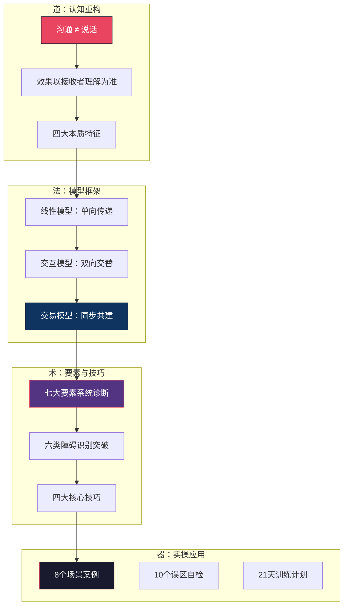
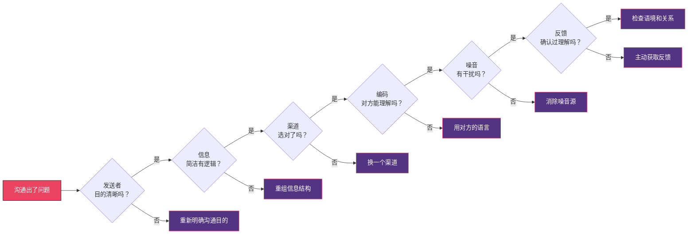
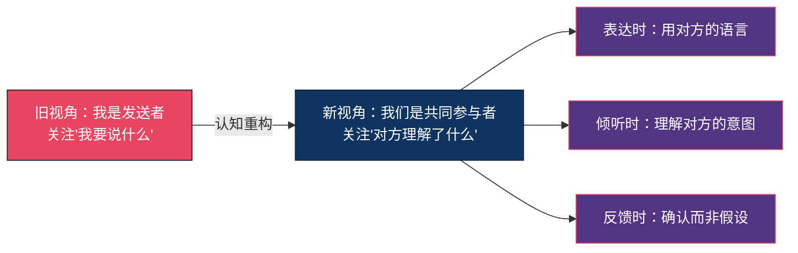
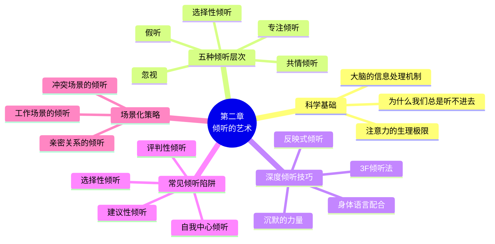

# 本章小结

恭喜你完成了第一章的学习。在进入下一章之前，先停下来做一件重要的事——**把学到的东西真正变成自己的**。

本章小结不是简单的"划重点"，而是一个**知识内化工具**。它包含四个部分：系统回顾帮你串联碎片、能力自检帮你找到盲区、行动清单帮你把知识变成习惯、下一章预告帮你建立学习预期。

> 如果说学习是输入，那本章小结就是你把输入转化为输出的关键一步。跳过这一步，前面2小时的阅读效果会打五折。

***

## 一、知识体系回顾

本章围绕一个核心问题展开：**沟通到底是什么？** 我们从"道"（本质认知）到"法"（模型框架）到"术"（要素拆解与技巧）到"器"（实操工具与案例），层层递进地构建了完整的沟通基础认知。

### 1.1 全章知识地图

### 1.2 核心概念串联

以下不是独立的知识点清单，而是一张**因果关系网**——每个概念都与其他概念相互关联，理解它们之间的关系比记住单个概念更重要。

**第一层：认知重构（道）**

沟通的本质是**信息传递与理解**的完整过程。这句话看起来简单，但它颠覆了一个根深蒂固的错觉——"我说了"等于"我沟通了"。真正的沟通以**接收者的理解**为终点，而非发送者的表达。

从这个认知出发，推导出沟通的四大本质特征：

| 特征 | 含义 | 对你的启示 |
|------|------|-----------|
| 不可逆 | 说出去的话无法真正收回 | 开口前三思，重要信息先草稿再发送 |
| 连续性 | 每次沟通都在前次基础上发生 | 你今天的态度会影响明天的沟通效果 |
| 不可重复 | 同样的话在不同语境下效果不同 | 不要"复制粘贴"式沟通，每次都要因人因境调整 |
| 双层传递 | 同时传递内容和关系 | 你"怎么说"比"说什么"更影响关系 |

**第二层：模型框架（法）**

三个模型不是"三个知识点"，而是**三个认知层级**：

- 线性模型帮你理解：信息从A到B会经过编码→传输→解码，任何环节都可能出错
- 交互模型帮你理解：没有反馈的沟通是"假沟通"，必须确认对方是否收到、理解
- 交易模型帮你理解：你和对方**同时**在发送和接收信息，你说话时对方的皱眉、点头、沉默都是信号——你必须同时"说"和"听"

> 实践中，大多数人停留在线性模型的认知层级（"我说完了，沟通就完成了"）。升级到交易模型思维，是本章最核心的认知跃迁。

**第三层：要素拆解（术）**

七个要素不是七个独立概念，而是一个**诊断系统**。当一次沟通出了问题，用七要素逐一排查，你就能快速定位瓶颈在哪：

**第四层：实操工具（器）**

四个核心技巧和八个实战场景不是"知识点"，而是**可执行的操作系统**：

| 技巧 | 核心工具 | 一句话精髓 | 典型场景 |
|------|---------|-----------|---------|
| 清晰表达 | 金字塔原理、PREP法则、KISS原则 | 结论先行，理由跟上，例子佐证 | 工作汇报、方案提报 |
| 有效倾听 | 3F倾听法（Fact-Feeling-Focus） | 听事实、听情绪、听意图 | 安慰朋友、客户沟通 |
| 反馈的艺术 | SBI法（Situation-Behavior-Impact） | 说事实不说评价，说影响不说定性 | 绩效面谈、团队协作 |
| 提问的力量 | 开放式vs封闭式 | 用问题引导对方思考，而非替对方下结论 | 面试、辅导、谈判 |

***

## 二、能力自检：你真的学会了吗？

阅读不等于理解，理解不等于掌握。以下自检工具帮你识别**真实的学习效果**——不是"我记住了什么"，而是"我能在实际中用出来多少"。

### 2.1 核心概念理解度自检

用"费曼测试"检验理解深度——如果你能用自己的话向一个从没学过这些内容的朋友解释清楚以下问题，说明你真正理解了：

| 序号 | 测试问题 | 通过标准 | 常见错误理解 |
|------|---------|---------|-------------|
| 1 | 用一句话解释"沟通的本质是什么" | 能说出"传递+理解+反馈"的完整闭环 | 只说"把话说清楚" |
| 2 | 解释"说了"和"沟通了"的区别 | 能举出具体例子说明 | 只说"要确认理解"但说不清为什么要确认 |
| 3 | 为什么交易模型比线性模型更准确？ | 能说出"同时性"和"共同构建"两个核心差异 | 只说"因为有反馈"（交互模型也有反馈） |
| 4 | 七要素中哪个最容易被忽略？为什么？ | 说到"反馈"或"语境"，并能解释原因 | 说"噪音"——噪音其实最容易被意识到 |
| 5 | 非言语信息占沟通的55%这个数据的适用范围？ | 说明仅适用于情感态度类沟通 | 把它当成所有沟通场景的通用比例 |
| 6 | 举一个"关系层面信息比内容层面更重要"的例子 | 例子具体，能清楚区分两个层面 | 混淆内容和关系层面 |
| 7 | "心理噪音"和"语义噪音"的区别？ | 能分别举例，不混淆 | 把两者混为一谈 |
| 8 | 金字塔原理和PREP法则的核心区别是什么？ | 金字塔是结构（先总后分），PREP是流程（观点→理由→举例→重申） | 认为两者是一回事 |

**评分标准**：答对6个以上——理解扎实；答对4-5个——需要回顾对应章节；答对3个以下——建议重新精读理论基础和核心技巧。

### 2.2 应用能力自检

以下场景没有"标准答案"，但有"合格线"——如果你能在30秒内想出合理的应对方案，说明你具备了初步的应用能力。

**场景一：渠道选择**
> 你需要跟下属谈一个问题——他最近三次开会都迟到。你打算怎么沟通？
>
> 合格线：选择面对面沟通（涉及态度和情感），而不是微信或邮件。能说出原因——文字缺少语气信息，容易被解读为指责。

**场景二：噪音识别**
> 你和同事在讨论一个技术方案，但对方一直坚持己见，完全不听你的分析。你判断可能是什么噪音？
>
> 合格线：能识别出"心理噪音"（可能是对方的防御心理、面子问题），而不仅仅归因为"他太固执"。

**场景三：反馈获取**
> 你给团队布置了一个任务，但总觉得大家执行得不太对。你接下来怎么做？
>
> 合格线：不要重复布置任务（信息已经发出，问题不在发送端），而是主动要求对方复述理解（在反馈端解决问题）。

**场景四：表达结构**
> 领导问你"那个项目怎么样了？"，你有大量信息要汇报。你怎么开口？
>
> 合格线：第一句话是结论或判断（"项目进展顺利，预计下周三交付"），而不是从背景开始铺垫。

**场景五：障碍突破**
> 你跟一个外国客户沟通，对方总是礼貌地点头但从不提出异议。你感到不安但又说不清为什么。
>
> 合格线：能识别出"文化障碍"——在某些文化中，当面表示反对被视为不礼貌，点头不等于同意。

### 2.3 常见误区自检清单

在重要沟通前，用这10个问题快速自检。每回答一个"否"，都意味着一个潜在的沟通风险：

| 序号 | 自检问题 | 正确做法 |
|------|---------|---------|
| 1 | 我清楚这次沟通的目的吗？ | 先想清楚"我希望对方理解什么、做什么" |
| 2 | 我考虑了对方的立场和感受吗？ | 换位思考，预判对方的反应 |
| 3 | 我选对了沟通渠道吗？ | 重要/敏感的事→面对面；简单/需要留底→文字 |
| 4 | 我的信息有结构吗？ | 结论先行，不超过三个核心点 |
| 5 | 我准备获取反馈吗？ | 至少问一次"你怎么理解的？" |
| 6 | 我的情绪状态适合沟通吗？ | 情绪激动时暂缓，冷静后再谈 |
| 7 | 我会用"同时"代替"但是"吗？ | "但是"会否定前文，"同时"保留两者 |
| 8 | 我会假设对方知道吗？ | 重要的事情即使觉得"对方应该知道"也要说 |
| 9 | 我关注了非言语信号吗？ | 注意自己的表情、语气、肢体语言 |
| 10 | 我会做复盘吗？ | 沟通结束后花2分钟回顾效果 |

***

## 三、知识整合：打通全章的五条主线

学习不是记忆碎片，而是建立连接。以下五条主线帮你把本章所有内容串联成一个有机整体。

### 主线一：从"我"到"我们"的视角转换

这是贯穿全章的核心思想转变：

- 理论基础告诉你**为什么**要转换视角（沟通的本质是传递+理解）
- 核心技巧教你**怎么**转换视角（金字塔原理帮你站在听者角度组织信息，3F倾听法帮你站在说者角度理解信息）
- 实战案例展示**转化后效果如何**（张伟从3.2分到4.5分的团队沟通满意度提升）

### 主线二：噪音无处不在，但可管理

本章从多个角度反复涉及"噪音"这个概念：

- **理论基础**：噪音是沟通七大要素之一，分为物理/生理/心理/语义四类
- **沟通模型**：线性模型最早引入噪音概念，交易模型将噪音扩展到语境层面
- **沟通障碍**：六大障碍中有三类（心理障碍、语言障碍、认知障碍）本质上都是噪音
- **核心技巧**：清晰表达减少语义噪音，有效倾听减少心理噪音，反馈减少理解偏差噪音
- **常见误区**："假设对方知道""情绪化沟通"都是在制造噪音而非消除噪音

> 关键洞察：噪音不只是"外部干扰"。你自己的预设、情绪、偏见，往往是你最大的噪音源。

### 主线三：非言语信息的系统性

"非言语信息占55%"这个数据被广泛引用，但本章的深度远不止于此。完整的非言语信息体系包括：

| 维度 | 具体形式 | 你需要注意的信号 | 管理建议 |
|------|---------|----------------|---------|
| 面部表情 | 微笑、皱眉、惊讶、厌恶 | 真笑vs假笑（眼角是否有皱纹） | 保持自然的面部表情，不要面无表情 |
| 眼神 | 直视、回避、频繁眨眼 | 过度回避可能意味着不自信或隐瞒 | 保持60-70%时间的眼神接触 |
| 身体语言 | 姿态、手势、距离 | 双臂交叉=防御，前倾=兴趣 | 开放性姿态，与对方保持舒适距离 |
| 副语言 | 语速、音量、停顿、语调 | 突然的停顿可能意味着犹豫或强调 | 重要的话慢说，停顿给对方消化时间 |
| 时间行为 | 准时、迟到、回复速度 | 迟到传递"你不重要"的信号 | 提前5分钟到达，及时回复消息 |

### 主线四：从认知到习惯的转化路径

本章的学习路径遵循一个清晰的转化链条：

**知道** → **理解** → **认同** → **练习** → **习惯** → **本能**

- 读完理论基础，你"知道"了沟通的七要素
- 看完模型对比，你"理解"了为什么交易模型最准确
- 分析完案例，你"认同"了这些原则确实有效
- 完成练习任务，你开始"练习"在实际中运用
- 坚持21天，这些行为变成"习惯"
- 最终，它们成为你的"本能"反应

> 绝大多数人停在"知道"和"理解"阶段就离开了。从"理解"到"习惯"的转化，完全取决于你是否真的去练习。

### 主线五：场景决定策略

本章没有给出"万能公式"，因为沟通不存在万能公式。贯穿全章的一个核心原则是：**场景决定策略**。

| 场景变量 | 影响维度 | 策略调整 |
|---------|---------|---------|
| 信息类型（事实vs情感） | 渠道选择、表达方式 | 事实→书面/结构化；情感→面对面/共情 |
| 关系距离（亲近vs陌生） | 语言风格、非言语 | 亲近→非正式/直接；陌生→正式/委婉 |
| 权力关系（对等vs不对等） | 沟通方向、反馈获取 | 对等→双向协商；不对等→注意权力动态 |
| 文化背景（同文化vs跨文化） | 直接程度、空间距离 | 跨文化→先了解对方的沟通规范 |
| 紧急程度（紧急vs常规） | 渠道选择、信息详略 | 紧急→电话/即时消息；常规→邮件/文档 |

***

## 四、行动清单：从今天开始做

知识不用等于没有。以下是三个层次的行动建议，从最简单的开始，逐步深入。

### 4.1 今天就能做的三件事（5分钟）

1. **设一个手机壁纸**：写上"对方理解了吗？"——每次重要沟通前看一眼
2. **在下次对话中有意识地观察对方的非言语信号**：一个表情、一个动作，试着解读它
3. **用"同时"代替"但是"试一次**：感受两者在语气上的差异

### 4.2 这周开始练的三件事（每天10分钟）

1. **倾听日记**：每天记录一次沟通，写下你听到的事实、感受到的情绪、推测的意图（3F倾听法）
2. **一句话练习**：每天找一个场景，用PREP法则（观点→理由→例子→重申）组织一段话
3. **复盘日记**：每天睡前回顾当天最重要的一次沟通——哪里做得好？哪里可以改进？

### 4.3 本月要建立的三个习惯

1. **反馈确认习惯**：重要沟通后主动问"你的理解是？"或"我们确认一下接下来的行动"
2. **渠道匹配习惯**：发送信息前花3秒想一下——这个信息用这个渠道合适吗？
3. **情绪觉察习惯**：感到烦躁/愤怒/焦虑时，暂停沟通，给自己10秒冷静时间

### 4.4 21天行动计划框架

| 阶段 | 天数 | 重点任务 | 预期效果 |
|------|------|---------|---------|
| 觉察期 | 第1-7天 | 记录每天的沟通模式，不做评判，只做观察 | 意识到自己的沟通习惯和盲区 |
| 练习期 | 第8-14天 | 每天刻意练习一个技巧（金字塔/3F/SBI/提问） | 开始能在具体场景中运用技巧 |
| 巩固期 | 第15-21天 | 综合运用，记录变化，请他人给反馈 | 技巧开始内化，不再需要刻意提醒 |

***

## 五、本章金句回顾

以下五句话浓缩了本章最核心的思想。建议把它们记下来，在需要的时候拿出来提醒自己：

> **"沟通的效果不是由发送者的意图决定的，而是由接收者的理解决定的。"**
>
> 这是本章的第一原理。你觉得自己"说清楚了"不重要，对方是否真的理解了才重要。

> **"倾听不是'等待自己说话的机会'。"**
>
> 大多数人"听"的时候，脑子里已经在组织自己的回应了。真正的倾听，是先把对方的信息完整接收完。

> **"用'同时'代替'但是'，效果会大不相同。"**
>
> "但是"会否定前面说的一切。"你做得很好，但是……"——对方听到这里已经忘了前半句。换成"你做得很好，同时如果能在XX方面改进，会更完美"——两个信息都被保留了。

> **"没有人是读心术大师——你认为'不需要说'的信息，恰恰是最需要说的。"**
>
> "他应该知道的""不用我说吧"——这些假设是沟通失败的最大元凶之一。宁可多说一句，不要少说一句。

> **"沟通能力不是天赋，而是技能。技能可以通过学习和练习来提升。"**
>
> 这是整本书的立足点。如果你觉得自己"天生不善沟通"，请记住：所有优秀的沟通者都是后天练出来的。

***

## 六、自评与下一步

### 6.1 章节能力自评表

在进入下一章前，对自己的掌握程度做一个诚实的评估。不需要追求满分——找到薄弱环节才是评估的真正目的：

| 能力维度 | 自评（1-5分） | 对应内容 |
|---------|-------------|---------|
| 理解沟通的本质（不是说话） | ___ | 理论基础-沟通的定义 |
| 掌握三大沟通模型的区别 | ___ | 理论基础-沟通的模型 |
| 能用七要素诊断沟通问题 | ___ | 理论基础-沟通的要素 |
| 能识别不同类型的沟通 | ___ | 理论基础-沟通的类型 |
| 能识别和应对沟通障碍 | ___ | 理论基础-沟通障碍分析 |
| 能用金字塔原理清晰表达 | ___ | 核心技巧-清晰表达 |
| 能做到共情倾听 | ___ | 核心技巧-有效倾听 |
| 能用SBI法给予反馈 | ___ | 核心技巧-反馈的艺术 |
| 能用提问引导沟通 | ___ | 核心技巧-提问的力量 |
| 能避免10个常见误区 | ___ | 常见误区 |

**3分以下的项目**：建议回到对应章节重新精读，然后在本周内针对该维度做3次刻意练习。

### 6.2 进入下一章之前的三件事

1. **完成21天行动计划的第1周**：从觉察期开始，不需要做任何改变，只需要观察和记录。觉察本身就是改变的开始。

2. **打印或保存误区自检清单**：把它放在你最容易看到的地方。每次重要沟通前花30秒过一遍，这个习惯值千金。

3. **找一个练习伙伴**：邀请一个朋友或同事一起学习，互相给反馈。沟通是两个人的事，有练习伙伴的效果远好于独自练习。

***

## 七、下一章预告：倾听的艺术

如果说第一章是沟通的**全景地图**，那么第二章将深入地图中最重要的一个区域——**倾听**。

为什么说倾听是"最重要的单项技能"？因为：

- **在所有沟通场景中，你"听"的时间比"说"的时间多**——研究数据显示，日常沟通中约45%的时间用于倾听，30%用于说话，16%用于阅读，9%用于书写
- **大多数人以为自己善于倾听，但实际上不是**——研究显示，人们在倾听后只能准确回忆约25%的信息
- **倾听是所有沟通技巧的基础**——你不听清楚对方在说什么，你的表达、反馈、提问都会偏离方向

第二章将系统探讨以下内容：

> **核心目标**：通过第二章的学习和练习，你将能够真正做到"听懂"对方——不仅听懂对方说了什么，还能听懂对方**没说什么**。

让我们继续这段沟通能力提升之旅。
