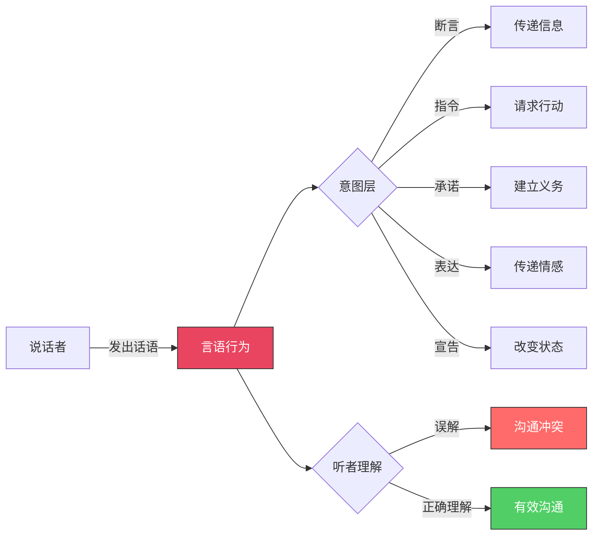
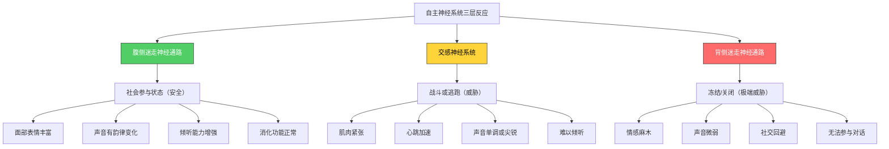
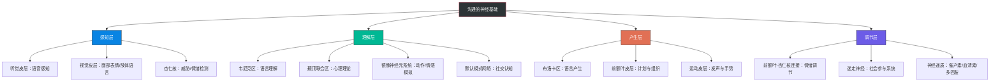
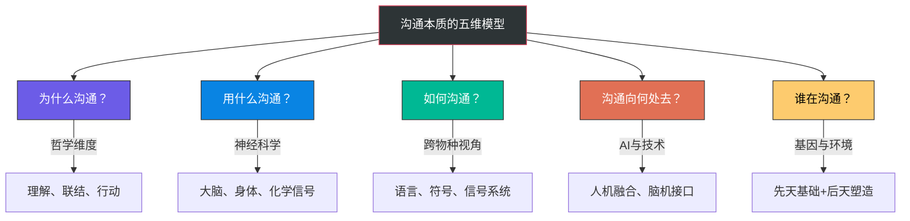

# 沟通的本质：深度拓展

## 引言

沟通是人类最基本的社会行为之一，但其本质远比我们日常所理解的更为复杂和深刻。本章将从哲学、神经科学、跨物种研究、人工智能以及遗传学等多个维度，对沟通的本质进行深层次的探索与拓展。这些前沿领域的研究成果，不仅丰富了我们对沟通的理解，也为提升沟通能力提供了科学依据和实践指导。

```mermaid
graph TD
    A[沟通的本质：五维深度探索] --> B[哲学基础]
    A --> C[神经科学]
    A --> D[跨物种研究]
    A --> E[人工智能与未来]
    A --> F[基因与环境]
    
    B --> B1[语言游戏理论]
    B --> B2[交往行为理论]
    B --> B3[言语行为理论]
    B --> B4["我-你关系"]
    
    C --> C1[镜像神经元]
    C --> C2[前额叶皮层]
    C --> C3[神经递质系统]
    C --> C4[神经可塑性]
    
    D --> D1[灵长类手语]
    D --> D2[海洋哺乳动物]
    D --> D3[昆虫通讯]
    D --> D4[鸟类与植物]
    
    E --> E1[大语言模型]
    E --> E2[人机沟通范式]
    E --> E3[脑机接口]
    E --> E4[沉浸式技术]
    
    F --> F1[FOXP2基因]
    F --> F2[双胞胎研究]
    F --> F3[表观遗传学]
    F --> F4[基因-环境交互]
    
    style A fill:#1a1a2e,stroke:#e94560,color:#fff
    style B fill:#16213e,stroke:#0f3460,color:#fff
    style C fill:#16213e,stroke:#0f3460,color:#fff
    style D fill:#16213e,stroke:#0f3460,color:#fff
    style E fill:#16213e,stroke:#0f3460,color:#fff
    style F fill:#16213e,stroke:#0f3460,color:#fff
```



***

## 一、沟通的哲学基础

### 1.1 维特根斯坦的语言游戏理论

路德维希·维特根斯坦（Ludwig Wittgenstein，1889—1951）是20世纪最具影响力的哲学家之一。他前期在《逻辑哲学论》中提出了"语言图像论"，认为语言是现实的逻辑图像；后期在《哲学研究》中彻底推翻了自己的前期观点，转向了"语言游戏"理论。这一转变对沟通研究的意义极为深远。

**语言游戏的概念**

维特根斯坦在《哲学研究》中提出了"语言游戏"（Sprachspiel）这一核心概念。他认为，语言的意义不在于它所指代的对象（前期观点），而在于它在具体情境中的使用方式。正如棋子的意义不在于其物理形状，而在于它在棋局中的规则和功能一样，词语的意义也来源于它在特定"语言游戏"中的作用。

这一理论对沟通的启示是深刻的。当我们与他人交流时，我们不仅仅是在传递信息，更是在参与一个共同的语言游戏。每一种沟通情境——无论是课堂讨论、朋友闲聊还是商务谈判——都有其独特的规则和语境。理解这一点，意味着真正的有效沟通需要我们识别和适应不同沟通场景的"游戏规则"。

**实操启示：如何运用语言游戏思维**

| 沟通场景 | 隐含规则 | 适应策略 |
|---------|---------|---------|
| 商务谈判 | 利益博弈、信息不对称 | 先了解对方诉求，找到共赢空间 |
| 朋友闲聊 | 情感支持、轻松氛围 | 倾听为主，少给建议多共情 |
| 学术讨论 | 逻辑严密、证据为本 | 提出论点必须有论据支撑 |
| 家庭对话 | 情感联结、安全表达 | 避免评判，创造安全空间 |
| 面试场景 | 展示能力、双向评估 | 用STAR法则结构化表达 |
| 跨文化沟通 | 尊重差异、避免假设 | 先观察再行动，不确定就问 |

**家族相似性与沟通的多样性**

维特根斯坦还提出了"家族相似性"（Familienähnlichkeit）的概念。他认为，许多概念之间并没有一个共同的本质特征，而是通过一系列交叉重叠的相似性联系在一起，就像一个家族的成员之间可能存在各种各样的相似，但没有一个特征是所有成员都共有的。

将这一观点应用到沟通领域，我们可以理解为什么"沟通"这个概念如此难以定义。面对面交谈、书信往来、电话沟通、网络聊天、肢体语言表达——这些都被称为"沟通"，但它们之间并没有一个统一的本质。它们之间存在着家族相似性：某些形式共享某些特征，但没有任何一个特征是所有沟通形式都具备的。这种理解帮助我们以更开放、更包容的态度看待沟通的多样性。

**遵循规则与沟通的默契**

维特根斯坦关于"遵循规则"的讨论也对沟通研究具有重要启示。他指出，遵循规则不是一种私人的心理活动，而是一种社会实践。这意味着沟通能力的培养不仅仅是个人技巧的提升，更是一种社会化的过程——我们需要通过参与社会实践来习得沟通的规则和习惯。

维特根斯坦的"私人语言论证"进一步说明：不存在完全私人的、只有自己能理解的语言。语言本质上是公共的、社会的。这一洞见提醒我们，沟通的有效性建立在共享的社会规范之上——当我们使用一个词语时，我们是在援引一套公共的使用规则。

### 1.2 奥斯汀与塞尔的言语行为理论

**奥斯汀的施事话语理论**

约翰·奥斯汀（J. L. Austin，1911—1960）在《如何以言行事》（How to Do Things with Words）中打破了传统哲学认为"语言只能描述事实"的观点，提出了言语行为理论。他指出，说话本身就是一种行为——当我们说"我承诺"、"我道歉"、"我命名"时，我们不仅仅是在描述什么，而是在做事。

奥斯汀将一个完整的言语行为分为三个层次：

| 层次 | 名称 | 含义 | 示例 |
|------|------|------|------|
| 第一层 | 以言表意行为（Locutionary Act） | 说出有意义的话语 | "明天我会完成报告" |
| 第二层 | 以言行事行为（Illocutionary Act） | 说话时实施的行为 | 做出承诺 |
| 第三层 | 以言取效行为（Perlocutionary Act） | 说话产生的效果 | 让对方感到安心 |

**约翰·塞尔的扩展**

约翰·塞尔（John Searle）进一步发展了言语行为理论，将"以言行事行为"分为五种基本类型：

1. **断言类（Assertives）**：表达说话者对某事的信念。如："地球是圆的"、"我认为这个方案可行"。
2. **指令类（Directives）**：试图让听者做某事。如："请把门关上"、"你能帮我看看这个吗？"
3. **承诺类（Commissives）**：说话者承诺未来做某事。如："我保证按时交货"、"下周一我来处理"。
4. **表达类（Expressives）**：表达心理状态。如："谢谢你"、"我很抱歉"、"恭喜你"。
5. **宣告类（Declarations）**：通过说话改变现实状态。如："我宣布会议开始"、"你被解雇了"。

**言语行为理论的沟通应用**

理解言语行为理论可以帮助我们更精准地进行沟通。很多沟通问题的根源在于：说话者意图的"以言行事"与听者理解的"以言行事"不一致。



**常见误解场景分析：**

- **场景一**：妻子说"你能不能把垃圾倒了？"——字面上是指令类（请求行动），丈夫理解为断言类（在陈述一个事实性问题），回答"能啊"就去打游戏了。妻子真正的以言行事是"我希望你现在就去倒垃圾"。
- **场景二**：领导说"这个方案还可以再优化一下"——字面上是断言类（提出看法），下属理解为表达类（随意评论），没有采取行动。领导真正的以言行事是"我要求你修改这个方案"。
- **场景三**：朋友说"最近手头有点紧"——字面上是断言类（陈述经济状况），听者理解为表达类（分享心情），回答"我也是"。朋友真正的以言行事可能是"我想向你借钱"（指令类）。

**避免言语行为误解的方法：**

1. **显性化你的意图**：不要让对方猜测。与其说"这个报告挺有意思"，不如说"我建议你修改第三部分的数据分析"（明确指令类）。
2. **确认对方的理解**：在重要沟通后，问一句"你理解我的意思了吗？"或"你打算怎么做？"来确认言语行为是否被正确接收。
3. **注意语境的转化作用**：同样一句话在不同语境中可能构成不同的言语行为。"你真行啊"在表扬语境中是表达类（赞美），在讽刺语境中是表达类（批评），在质问语境中是断言类（质疑对方能力）。

### 1.3 哈贝马斯的交往行为理论

尤尔根·哈贝马斯（Jürgen Habermas，1929—）是法兰克福学派第二代的核心人物，他的交往行为理论（Theorie des kommunikativen Handelns）为沟通研究提供了极为重要的理论框架。

**交往行为与策略行为的区分**

哈贝马斯区分了两种基本的社会行为类型：交往行为（kommunikatives Handeln）和策略行为（strategisches Handeln）。交往行为是指参与者以达成相互理解为目的，通过语言进行沟通的行为。而策略行为则是以实现个人目标为导向，将语言作为工具来影响他人行为的行动。

这一区分对我们的日常沟通具有深刻的指导意义。在很多沟通情境中，人们表面上在进行交往行为，实际上却在进行策略行为——例如，销售人员表面上在与客户进行真诚的对话，实际上却在试图说服客户购买产品。哈贝马斯认为，真正的沟通应该以相互理解为目标，而不是将他人当作实现自己目标的手段。

| 维度 | 交往行为 | 策略行为 |
|------|---------|---------|
| 核心目标 | 达成相互理解 | 实现个人目标 |
| 对他人的态度 | 视为平等对话者 | 视为实现目标的手段 |
| 语言的角色 | 理解的媒介 | 影响他人的工具 |
| 典型场景 | 真诚的朋友谈心 | 商业谈判中的试探 |
| 结果导向 | 共识优先 | 胜利优先 |
| 长期效果 | 建立信任关系 | 可能损害关系 |

**理想言说情境**

哈贝马斯提出了"理想言说情境"（ideale Sprechsituation）的概念，描述了一种理想的沟通条件：

- **包容性**：所有相关人员都有平等的参与机会
- **平等性**：每个参与者都有平等的机会表达自己的观点、需求和感受
- **真诚性**：参与者必须真诚地表达自己的意图
- **无强制性**：沟通不受任何外在或内在的强制因素影响

虽然理想言说情境在现实中很难完全实现，但它为我们评估和改善沟通质量提供了一个重要的参照标准。在日常工作和生活中，我们可以朝着这个理想努力，尽量创造更加平等、真诚和开放的沟通环境。

**如何在实践中接近理想言说情境：**

1. **创造包容性**：在团队会议中，确保每个人都有发言机会。可以使用"轮流发言"机制，或者主动邀请安静的成员分享观点。
2. **保障平等性**：警惕权力差异对沟通的影响。领导在讨论中最后发言，避免下属因为权威压力而不敢表达真实想法。
3. **鼓励真诚性**：以身作则，先表达自己的真实想法和不确定性。当你承认"这个问题我也没有答案"时，会鼓励他人也坦诚表达。
4. **减少强制性**：避免使用威胁、情感操控或信息封锁来影响沟通结果。

**交往理性的三个维度**

哈贝马斯认为，有效的交往行为需要同时满足三个方面的"有效性声称"（Geltungsansprüche）：

1. **真实性**（Wahrheit）：所说的内容是真实的
2. **正当性**（Richtigkeit）：所说的话在社会规范层面是正当的
3. **真诚性**（Wahrhaftigkeit）：说话者真诚地表达了自己内心的想法和感受

这三个维度为我们提供了一个全面评估沟通质量的框架。有效的沟通不仅仅意味着传达真实的信息，还意味着在适当的社会语境中以真诚的态度进行交流。

**用交往理性三维框架诊断沟通问题：**

当你感觉一次沟通"不太对"时，可以用这个框架来诊断问题出在哪个维度：

- "他说的不真实" → 真实性问题（信息有误或被刻意歪曲）
- "他说的话不合适" → 正当性问题（违反了社交规范或场合礼仪）
- "我感觉他不是真心的" → 真诚性问题（话语和表情/语气不一致）

### 1.4 马丁·布伯的"我-你"关系哲学

马丁·布伯（Martin Buber，1878—1965）在其经典著作《我与你》（Ich und Du）中区分了两种基本的人际关系模式："我-它"（Ich-Es）关系和"我-你"（Ich-Du）关系。

在"我-它"关系中，我们将他人视为客体，作为我们观察、分析和利用的对象。这是一种单向的、工具性的关系——我们从外部观察他人，将他人归类、评估、使用。在"我-你"关系中，我们与他人建立真正的对话关系，将对方视为与自己平等的主体。这是一种双向的、存在性的关系——我们以全部的存在与对方相遇。

布伯的理论提醒我们，真正深刻的沟通需要我们超越"我-它"的关系模式，进入"我-你"的对话关系。这意味着在沟通中，我们不仅要关注信息的传递，更要关注与对方建立真正的人际联结。

**日常生活中的"我-它"与"我-你"转换：**

- **客服场景**：标准化的客服话术是典型的"我-它"关系——客户被视为需要处理的"工单"。当客服人员真正倾听客户的困扰，给出个性化的回应时，关系就从"我-它"转向了"我-你"。
- **教育场景**：教师将学生视为"需要灌输知识的容器"是"我-它"关系。当教师真正关注每个学生的独特性，与学生建立思想上的交流时，就实现了"我-你"的教育关系。
- **亲密关系**：当伴侣将对方视为"需要管理的对象"或"满足需求的工具"时，关系就变成了"我-它"。真正的亲密关系需要双方以完整的自我与对方相遇。

### 1.5 伽达默尔的诠释学对话理论

汉斯-格奥尔格·伽达默尔（Hans-Georg Gadamer，1900—2002）认为，真正的对话就像一场游戏——它有自己的生命和节奏，参与者被对话所引导，而不是主导对话。在真正的对话中，我们愿意让自己的偏见和预设受到挑战，愿意被对方的观点所改变。这种开放性是有效沟通的核心要素。

伽达默尔还提出了"视域融合"（Horizontverschmelzung）的概念，认为理解发生在不同视域的交汇和融合之中。每个人都有自己的"视域"——由个人经验、文化背景、知识结构等构成的理解框架。在跨文化沟通中，这一概念尤其重要——真正的跨文化理解不是一方征服另一方，而是双方视域的创造性融合。

**如何在沟通中实现视域融合：**

1. **意识到自己的视域局限**：承认自己的理解总是受到特定视角的限制。
2. **真诚地进入对方的视域**：不是为了反驳而倾听，而是为了理解而倾听。
3. **寻找重叠的视域**：找到双方都能理解和认同的共同基础。
4. **允许新视域的形成**：在对话中，双方的视域都可能发生扩展和改变。

### 1.6 沟通哲学的综合应用框架

将上述哲学理论整合，我们可以建立一个多层次的沟通分析框架：

```mermaid
graph TD
    A[沟通分析框架] --> B[语言层面]
    A --> C[行为层面]
    A --> D[关系层面]
    A --> E[理解层面]
    
    B --> B1[维特根斯坦：识别语言游戏规则]
    B --> B2[塞尔：明确言语行为类型]
    
    C --> C1[哈贝马斯：区分交往行为与策略行为]
    C --> C2[奥斯汀：三层言语行为分析]
    
    D --> D1[布伯：从"我-它"到"我-你"]
    D --> D2[哈贝马斯：理想言说情境]
    
    E --> E1[伽达默尔：视域融合]
    E --> E2[维特根斯坦：家族相似性]
    
    style A fill:#2d3436,stroke:#e94560,color:#fff
    style B fill:#0984e3,stroke:#333,color:#fff
    style C fill:#00b894,stroke:#333,color:#fff
    style D fill:#e17055,stroke:#333,color:#fff
    style E fill:#6c5ce7,stroke:#333,color:#fff
```

**实操清单：用哲学框架提升日常沟通**

面对一次重要的沟通，你可以按以下步骤准备：

1. **识别语言游戏**（维特根斯坦）：这次沟通属于什么场景？有什么隐含规则？我需要调整什么表达方式？
2. **明确言语行为**（奥斯汀/塞尔）：我这次沟通的核心"以言行事"是什么？是请求、承诺、还是表达？我需要让对方明确理解我的意图。
3. **选择行为模式**（哈贝马斯）：我是要真诚地达成理解（交往行为），还是有具体的目标要实现（策略行为）？两者都是合理的，但要诚实面对自己的选择。
4. **建立关系质量**（布伯）：我是否把对方当作一个完整的人来对待？还是仅仅当作一个需要处理的对象？
5. **保持理解开放性**（伽达默尔）：我是否愿意被对方的观点改变？我是否在真诚地寻求"视域融合"？

***

## 二、沟通与大脑神经科学

### 2.1 镜像神经元：理解他人的神经基础

**镜像神经元的发现**

1990年代初，意大利帕尔马大学的贾科莫·里佐拉蒂（Giacomo Rizzolatti）及其团队在研究猕猴大脑运动皮层时，意外发现了一类特殊的神经元。这些神经元不仅在猴子自己执行某个动作时会激活，在猴子观察其他个体执行相同动作时也会激活。研究者将这些神经元命名为"镜像神经元"（mirror neurons）。

**镜像神经元与沟通的关系**

镜像神经元的发现被认为是神经科学领域最重要的发现之一，它为理解人类的沟通、共情和社会认知提供了神经科学基础。

- **动作理解**：镜像神经元使我们能够通过观察他人的动作来理解其意图，而不需要通过复杂的推理过程。当我们看到别人拿起杯子时，我们大脑中负责"拿杯子"动作的神经元也会激活，从而让我们直观地理解对方的意图。

- **共情能力**：研究表明，镜像神经元系统在我们体验共情时发挥着关键作用。当我们看到他人表达痛苦、快乐或悲伤时，镜像神经元的激活使我们能够"感同身受"，在某种程度上体验到对方的情感状态。

- **语言理解**：一些研究者认为，镜像神经元系统在语言理解和习得中也起着重要作用。手势语言和口语的理解可能都依赖于镜像神经元系统提供的运动模拟机制。

- **模仿学习**：镜像神经元被认为是模仿学习的神经基础。婴儿通过镜像神经元系统来模仿成人的面部表情和动作，这是他们学习沟通技能的重要途径。

**镜像神经元理论的争议**

尽管镜像神经元理论影响巨大，但也存在不少争议。一些研究者指出，将人类复杂的共情和社会认知能力简单归因于镜像神经元过于简化。还有研究者质疑，在猴子身上发现的镜像神经元是否能直接推广到人类身上。此外，一些对脑损伤患者的研究表明，镜像神经元系统的损伤并不一定导致共情能力的丧失，这表明共情可能涉及更复杂的神经网络。

### 2.2 前额叶皮层：沟通的指挥中心

**前额叶皮层的功能**

前额叶皮层（Prefrontal Cortex, PFC）是大脑最前端的区域，也是人类大脑中最为发达的部分之一。它在沟通中扮演着至关重要的角色：

- **执行功能**：前额叶皮层负责计划、决策和行为控制等高级认知功能。在沟通中，它帮助我们组织语言、选择适当的表达方式、控制冲动反应。

- **社会认知**：前额叶皮层，特别是内侧前额叶皮层（mPFC），在社会认知中发挥着核心作用。它参与心理理论（Theory of Mind）的运作，即理解他人心理状态（信念、意图、情感）的能力。这种能力对于有效沟通至关重要。

- **情绪调节**：前额叶皮层与边缘系统（特别是杏仁核）之间的连接在情绪调节中起着关键作用。在沟通中，前额叶皮层帮助我们调节情绪反应，避免在冲突中做出过激反应。

- **工作记忆**：前额叶皮层是工作记忆的神经基础。在对话过程中，工作记忆帮助我们保持对话的上下文信息，理解复杂句子，跟踪讨论的逻辑线索。

**前额叶皮层损伤与沟通障碍**

前额叶皮层损伤的案例为我们理解其在沟通中的作用提供了宝贵的证据。著名的菲尼亚斯·盖奇（Phineas Gage）案例就是一个典型的例子。1848年，盖奇在一次事故中被铁棒贯穿前额叶，虽然他奇迹般地存活下来，但他的性格和社交能力发生了巨大变化——他变得粗鲁、不耐烦、无法控制自己的言行，尽管他的基本智力和语言能力没有受到明显影响。

现代神经科学研究进一步证实了前额叶皮层在社交沟通中的重要作用。前额叶皮层损伤的患者常常表现出社交行为不当、无法理解社交暗示、难以维持适当的对话等沟通障碍。

### 2.3 神经递质与激素：沟通的化学基础

除了脑区结构，神经递质和激素在沟通中也扮演着至关重要的角色。它们调节我们的情绪状态、社交动机和信任水平，直接影响沟通的质量和深度。

**催产素（Oxytocin）：信任与联结的化学基础**

催产素被称为"拥抱激素"或"信任激素"，它在社交联结中发挥着核心作用：

- **增强信任感**：实验研究表明，鼻喷催产素可以显著增加人对陌生人的信任程度。在沟通中，催产素水平的提升使人更愿意开放自己、分享个人信息。
- **促进共情**：催产素增强了我们识别他人面部表情和语调中情绪信息的能力，使我们更能"读懂"对方。
- **强化社会记忆**：催产素帮助我们更好地记住社交互动中的积极体验，从而促进关系的深化。
- **降低社交焦虑**：催产素可以抑制杏仁核的过度激活，降低社交情境中的焦虑反应。

**实践应用：** 拥抱、握手、眼神接触等身体接触可以自然地促进催产素分泌。在重要沟通前，与亲近的人进行简短的身体接触（如拥抱），可以帮助你进入更开放、更信任的沟通状态。

**血清素（Serotonin）：情绪稳定的调节器**

血清素在情绪调节中起着关键作用。血清素水平偏低与抑郁、焦虑和攻击性增加相关——这些都会严重影响沟通质量。健康的血清素水平有助于保持情绪稳定，使人在沟通中更加平和、理性。

**自然提升血清素的方法**：规律运动、充足日照、健康饮食（富含色氨酸的食物）、冥想练习。这些方法不仅改善整体心理健康，也直接提升沟通中的情绪稳定性。

**多巴胺（Dopamine）：奖赏与动机系统**

多巴胺与大脑的奖赏系统密切相关。在沟通中，多巴胺的作用体现在：

- **社交奖赏**：愉快的社交互动会触发多巴胺释放，这使我们渴望更多的社交接触。
- **好奇心驱动**：多巴胺激发我们对新信息和新观点的兴趣，促进探索性的沟通。
- **语言创造**：多巴胺系统与创造性思维相关，适度的多巴胺水平有助于语言的流畅和创新。

**皮质醇（Cortisol）：压力反应与沟通障碍**

皮质醇是主要的压力激素。当人处于高压状态时，皮质醇水平升高会导致：

- 工作记忆容量下降（难以跟踪复杂的对话内容）
- 杏仁核过度激活（对威胁信号过度敏感，容易误解中性信息为敌意）
- 前额叶功能受损（冲动控制和理性思考能力下降）

**沟通中的"皮质醇陷阱"：** 当你感到沟通压力时（如公开演讲、冲突对话），身体进入应激状态，皮质醇升高，这会导致你表现更差，从而增加压力，形成恶性循环。打破这个循环的关键是学会在沟通前进行压力管理——深呼吸、正念冥想、充分准备等。

### 2.4 迷走神经：沟通的身体通道

**多迷走神经理论（Polyvagal Theory）**

斯蒂芬·波格斯（Stephen Porges）提出的多迷走神经理论揭示了自主神经系统与社交沟通之间的深层联系。迷走神经是人体最长的脑神经，连接大脑与心脏、肺部、消化系统等多个器官。

波格斯提出，人类的自主神经系统有三个层级的反应模式：



**对沟通的启示：**

只有在"社会参与"状态下（腹侧迷走神经主导），我们才能进行真正有效的沟通。当我们感到威胁时（无论是物理威胁还是心理威胁，如被批评、被否定），交感神经系统被激活，沟通能力急剧下降。

**如何激活社会参与系统：**

1. **安全信号**：保持微笑、开放的肢体语言、温和的语调——这些信号不仅让对方感到安全，也会通过反馈回路让自己进入安全状态。
2. **呼吸调节**：缓慢、有节奏的腹式呼吸可以激活腹侧迷走神经，帮助从应激状态回到社会参与状态。
3. **环境营造**：选择安全、舒适、私密的沟通环境，减少威胁性因素。
4. **节奏同步**：与对方的呼吸和说话节奏适度同步，可以增强社交联结感。

### 2.5 布洛卡区与韦尼克区：语言的神经基础

布洛卡区（Broca's area）和韦尼克区（Wernicke's area）是大脑中与语言处理直接相关的两个关键区域。布洛卡区主要负责语言的产生和语法处理，损伤会导致表达性失语症（患者能理解语言但难以流利地表达）。韦尼克区主要负责语言的理解，损伤会导致感受性失语症（患者能流利说话但内容往往没有意义）。

现代研究表明，语言处理远比"布洛卡区负责说、韦尼克区负责听"这种简单二分法复杂得多。语言的理解和产生涉及一个广泛的神经网络，包括颞叶、顶叶、额叶的多个区域，以及连接这些区域的白质纤维束。

### 2.6 杏仁核与情绪沟通

杏仁核（amygdala）是大脑中处理情绪信息的关键结构，特别是与恐惧和威胁相关的信息。在沟通中，杏仁核帮助我们快速评估社交情境中的情绪信息，判断对方是友好的还是敌意的。

杏仁核的一个重要特征是它的"快速通路"：感觉信息可以通过丘脑直接传到杏仁核，绕过大脑皮层的精细处理。这意味着我们对威胁的情绪反应可以在意识层面形成之前就已启动——这就是为什么在冲突对话中，我们常常先"发火"后"后悔"。

**杏仁核劫持（Amygdala Hijack）：** 丹尼尔·戈尔曼（Daniel Goleman）在《情商》中提出的概念。当杏仁核过度激活时，它会"劫持"前额叶的理性控制，导致情绪化的行为反应。在沟通中，这表现为突然的情绪爆发、非理性的攻击或完全的退缩。

**应对杏仁核劫持的策略：**

1. **识别身体信号**：心跳加速、肌肉紧张、呼吸急促是杏仁核激活的早期信号。
2. **暂停技巧**：感到情绪被触发时，说"我需要一分钟想想"，给自己时间让前额叶重新获得控制。
3. **认知重评**：尝试从不同角度解读对方的行为。对方可能不是在攻击你，而是在表达自己的困扰。
4. **物理调节**：喝一口水、站起来走动、做几次深呼吸——这些简单的身体动作可以帮助降低杏仁核的激活水平。

### 2.7 胼胝体与大脑两半球的协调

胼胝体（corpus callosum）是连接大脑左右半球的神经纤维束，它在沟通中起着重要的协调作用。研究表明，大脑左半球主要负责语言的逻辑和语法方面，而右半球则更多参与理解语调、情感暗示和非语言信号。胼胝体的健康运作确保了两个半球在沟通过程中的有效协作。

### 2.8 默认模式网络与社交认知

默认模式网络（Default Mode Network, DMN）是大脑在"休息"状态下活跃的网络，包括内侧前额叶皮层、后扣带回、颞顶联合区等区域。近年来的研究发现，DMN在社交认知中发挥着核心作用：

- **心理理论**：DMN帮助我们推测他人的想法、信念和意图。
- **自传体记忆**：DMN参与回忆个人经历，这些经历是我们理解他人处境的基础。
- **社会模拟**：DMN帮助我们在内心"模拟"社交情境，预演沟通场景。
- **自我反思**：DMN参与对自身行为和沟通效果的反思。

**对沟通的启示：** 给大脑留出"默认模式"的时间（如散步、发呆、冥想），不要让每一分钟都被信息输入填满。DMN的活跃有助于提升社交认知能力，使你在沟通中更能理解他人。

### 2.9 神经可塑性：沟通能力可以重塑

神经可塑性（neuroplasticity）是指大脑根据经验改变其结构和功能的能力。这一发现对沟通能力的培养具有革命性意义——它意味着沟通能力不是固定的，而是可以通过有意识的练习来重塑和提升。

**与沟通相关的神经可塑性证据：**

- **冥想练习**：长期冥想者的大脑结构发生了显著变化——前额叶皮层增厚（增强执行功能和情绪调节）、杏仁核体积减小（降低情绪反应性）、岛叶皮层增厚（增强自我意识和共情能力）。
- **语言学习**：学习第二语言可以增加大脑左下顶叶的灰质密度，双语者的胼胝体也更加发达。
- **社交技能训练**：研究表明，社交技能训练可以改变前额叶皮层和颞顶联合区的活动模式。
- **心理治疗**：认知行为疗法等心理治疗可以改变杏仁核和前额叶之间的功能连接。

**基于神经可塑性的沟通训练原则：**

1. **重复**：神经连接的强化需要反复练习。每天进行少量的沟通练习比偶尔进行大量练习更有效。
2. **注意力**：有意识的、专注的练习比漫不经心的重复更能促进神经可塑性。
3. **渐进**：从舒适区边缘开始，逐步增加挑战难度。
4. **反馈**：及时获得关于沟通效果的反馈，帮助大脑调整神经连接。
5. **休息**：神经可塑性在睡眠中最为活跃——学习新的沟通技能后，保证充足的睡眠有助于巩固。

### 2.10 沟通神经科学的综合模型



***

## 三、跨物种沟通研究

### 3.1 灵长类动物的沟通

**黑猩猩的手语研究**

20世纪60年代以来，多项研究尝试教黑猩猩学习人类手语。其中最著名的包括：

- **华秀（Washoe）**：由加德纳夫妇（Allen and Beatrix Gardner）抚养的黑猩猩，被认为是第一个学会美国手语的非人类动物。华秀最终学会了约250个手语词汇，并能将它们组合成简单的句子。更令人印象深刻的是，华秀还自发地将已知的手语词汇组合成新的表达方式，例如用"水"+"鸟"来表达"天鹅"。

- **可可（Koko）**：大猩猩可可在弗朗辛·帕特森（Francine Patterson）的指导下学习了超过1000个手语符号，并能理解约2000个英语口语词汇。可可还展现出了情感表达能力——当她的宠物猫去世时，她用手语表达了悲伤。

- **坎齐（Kanzi）**：倭黑猩猩坎齐通过使用图形符号（lexigrams）进行沟通，展现了令人印象深刻的语用能力。坎齐的独特之处在于，它不是通过系统的训练计划学习符号的，而是在观察其母亲的训练过程中自发习得的——这与人类儿童习得语言的方式有相似之处。

- **尼姆·钦普斯基（Nim Chimpsky）**：这个名字是对语言学家诺姆·乔姆斯基的戏仿。赫伯特·特拉斯（Herbert Terrace）对尼姆的研究得出了与其他研究者不同的结论——他认为尼姆的手语使用更多是模仿和条件反射，而非真正的语言理解。这一争议至今仍在继续。

**野生灵长类的沟通系统**

野生灵长类动物的沟通系统虽然不像人类语言那样复杂，但也有着令人惊叹的多样性：

- **长尾黑颚猴的报警叫声**：研究表明，长尾黑颚猴（vervet monkey）对不同的捕食者有不同的报警叫声，而且同伴会根据不同的叫声做出不同的逃避反应——听到"鹰"的叫声会向天空看并躲进灌木丛，听到"蛇"的叫声会站立并扫视地面，听到"豹"的叫声会迅速爬上树。这种"指称性"沟通是动物王国中最接近人类语言指称功能的例子之一。

- **大猩猩的面部表情**：大猩猩拥有复杂的面部表情系统，用于表达不同的情绪状态和社会意图。研究发现，大猩猩的面部表情并非纯粹的本能反应，在有同伴在场时会更加"夸张"，这表明它们有意识地使用表情来影响他人的行为。

- **倭黑猩猩的社交发声**：倭黑猩猩在社交互动中使用各种发声来维持群体和谐，包括用于和解和游戏的声音。有趣的是，倭黑猩猩的笑声在声学特征上与人类的笑声有相似之处。

- **黑猩猩的"谈判"行为**：黑猩猩在争夺食物或交配权时，会使用一系列复杂的社交信号（如凝视、手势、发声）进行"谈判"。研究发现，黑猩猩能够评估不同策略的后果，并根据对方的反应调整自己的行为——这展现了一种原始的策略性沟通能力。

### 3.2 海洋哺乳动物的沟通

**海豚的声学沟通**

海豚是海洋中最善于沟通的动物之一。它们使用一套复杂的声学信号系统进行交流：

- **咔嗒声（Clicks）**：主要用于回声定位，帮助海豚感知周围环境。海豚每秒可发出数百次咔嗒声，通过分析回声来构建周围环境的"声学图像"。
- **哨声（Whistles）**：用于社交沟通，每只海豚都有其独特的"签名哨声"（signature whistle），相当于人类的名字。更令人惊讶的是，海豚可以在沟通中"引用"其他海豚的签名哨声，相当于在对话中提及第三方。
- **突发脉冲声音（Burst-pulse sounds）**：在社交互动中使用，可能表达情绪状态，如兴奋、不满或友好。

研究表明，海豚能够记住同伴的签名哨声长达20年以上，这意味着它们拥有出色的长期社交记忆。

**海豚沟通的"语法"发现**

2016年发表在《自然·通讯》上的一项研究发现， bottlenose海豚的哨声中存在类似语法的结构——不同的声学元素以特定的顺序组合，形成有意义的"句子"。这一发现挑战了"语法是人类语言独有特征"的传统观点。

**鲸鱼的歌声**

座头鲸的歌声是自然界中最复杂的声音现象之一。雄性座头鲸会发出长达20分钟甚至更长的复杂歌曲，这些歌曲由多个层次的结构组成，包括音符、短语、主题等。更有趣的是，座头鲸的歌曲会在群体中传播和演化——在一个鲸群中，所有雄性通常会唱同一首歌，而这首歌会随着时间的推移逐渐改变。

这种"文化演化"现象——新的歌曲变体被群体采纳和传播——与人类音乐和语言的演化有惊人的相似之处。

**抹香鲸的"方言"**

抹香鲸使用一种独特的"咔嗒码"（codas）进行社交沟通——不同个体发出特定模式的咔嗒声序列。研究发现，不同群体的抹香鲸使用不同的咔嗒码模式，形成了可辨识的"方言"。同一群体内的抹香鲸使用相似的咔嗒码，而不同群体之间存在系统性差异——这与人类社会中的方言形成机制类似。

### 3.3 鸟类的沟通与歌声

**鸟类歌声的复杂性**

鸟类的歌声是动物王国中最接近人类语言的沟通系统之一。鸣禽（如夜莺、画眉、斑胸草雀）的歌声具有以下特征：

- **层次结构**：鸟类歌声由音素（最小声音单元）→音节→短语→歌曲的层次结构组成，与人类语言的音素→词→短语→句子的层次结构有相似之处。
- **语法规则**：研究发现，某些鸟类的歌声遵循特定的排列规则——某些音节只能出现在特定位置，某些组合是被"禁止"的。日本山雀（Parus minor）的歌声被证明具有"上下文无关文法"的特征，这在动物沟通中极为罕见。
- **方言**：同一物种的不同地理种群使用不同的"方言"，这些方言通过社会学习代际传播。
- **即兴创作**：鸟类在歌声中会加入即兴的变化和创新，这与人类音乐的即兴演奏有相似之处。

**鹦鹉的语音学习**

鹦鹉是少数能够学习和模仿人类语音的动物之一。非洲灰鹦鹉亚历克斯（Alex）在艾琳·佩珀伯格（Irene Pepperberg）的研究中展现了令人印象深刻的语言能力——它能识别50多种物体、7种颜色、5种形状，能使用"相同"和"不同"等抽象概念，甚至能表达"想要"某物或"想去"某个地方。

**乌鸦的工具使用与沟通**

新喀里多尼亚乌鸦不仅能制造和使用工具，还能通过特定的叫声来"讨论"工具的选择和使用方法。研究发现，乌鸦的叫声中包含关于工具类型和食物位置的信息，同伴可以根据这些叫声做出相应的行为调整。

### 3.4 昆虫的沟通

**蜜蜂的舞蹈语言**

奥地利动物学家卡尔·冯·弗里希（Karl von Frisch）发现了蜜蜂的舞蹈语言，这一发现为他赢得了1973年的诺贝尔生理学或医学奖。当工蜂发现了丰富的食物来源后，它会返回蜂巢通过"摇摆舞"（waggle dance）向同伴传达信息。舞蹈的方向指示食物相对于太阳的角度，舞蹈的持续时间指示距离，舞蹈的活力指示食物的质量。

后续研究发现，蜜蜂的舞蹈语言比最初认为的更加复杂。蜜蜂能够考虑风向、地形等因素对飞行路径的影响，在舞蹈中"校正"方向信息。它们还能通过触觉和嗅觉通道补充舞蹈的视觉信息。

**蚂蚁的信息素沟通**

蚂蚁主要通过信息素（pheromones）进行化学沟通。不同种类的信息素可以传达不同类型的信息，包括食物来源的方向、危险警告、巢穴位置等。蚂蚁的信息素沟通系统展现了一种完全不同于人类语言的沟通方式，但同样高度有效。

一个特别有趣的发现是，蚂蚁能够通过信息素的浓度梯度来"投票"决策——当蚁群需要选择新的巢穴位置时，更多的蚂蚁前往某个方向会加强该方向的信息素浓度，最终形成集体决策。这种"群体智能"的涌现为分布式决策系统提供了生物学灵感。

### 3.5 植物的沟通

植物虽然没有神经系统，但它们也拥有令人惊叹的沟通能力：

- **化学信号**：当植物受到昆虫攻击时，会释放挥发性化学物质，既警告周围的植物（使它们提前启动防御机制），也吸引攻击者的天敌。
- **菌根网络**：地下真菌网络（被称为"Wood Wide Web"）连接着森林中不同植物的根系，使它们能够交换营养物质和化学信号。母树可以通过这个网络向幼苗输送养分。
- **声音沟通**：最新研究发现，植物在缺水或受到损伤时会发出超声波"咔嗒声"，虽然人类听不到，但可能被其他生物检测到。

### 3.6 跨物种沟通研究的启示

跨物种沟通研究不仅拓展了我们对沟通本质的理解，也为我们反思人类沟通的独特性提供了参照。这些研究表明：

1. **沟通的进化连续性**：人类的语言能力并非凭空出现，而是建立在更古老的沟通系统基础之上。从蚂蚁的信息素到海豚的哨声，从鸟类的歌声到黑猩猩的手语，沟通能力在进化树上呈现出渐进的复杂性增加。

2. **沟通方式的多样性**：声学、视觉、化学、触觉、电觉（如某些鱼类）等多种感觉通道都可以成为沟通的载体。人类语言主要依赖声学和视觉通道，但这只是众多可能性中的一种。

3. **社会复杂性与沟通复杂性的关系**：社会结构越复杂的物种，通常也拥有越复杂的沟通系统。灵长类和海洋哺乳动物的社会复杂性与它们的沟通复杂性之间的正相关关系，支持了"社会脑假说"——复杂的社会生活驱动了大脑和沟通能力的进化。

4. **人类语言的独特性**：尽管动物沟通系统展现出令人印象深刻的复杂性，但人类语言在以下方面仍然是独特的：
   - **递归性**：人类语言可以无限嵌套结构（如"我知道你知道他知道……"）
   - **位移性**：人类可以谈论不在场的事物、过去或未来的事件
   - **创造力**：人类可以创造和理解从未听过的新句子
   - **元语言能力**：人类可以谈论语言本身

***

## 四、人工智能与沟通的未来

### 4.1 自然语言处理的进展

**从规则到统计再到深度学习**

自然语言处理（NLP）经历了三个主要发展阶段：

1. **规则时代（1950s-1980s）**：基于语言学规则和知识库的方法，需要大量的人工编写规则。代表性系统包括SHRDLU（能理解积木世界的自然语言指令）和早期的机器翻译系统。
2. **统计时代（1990s-2010s）**：基于统计机器学习的方法，利用大量语料数据来训练模型。代表性技术包括隐马尔可夫模型、条件随机场、词袋模型等。
3. **深度学习时代（2010s-至今）**：基于深度神经网络的方法，特别是Transformer架构和大型语言模型（LLMs）。代表性里程碑包括Word2Vec（2013）、BERT（2018）、GPT-2（2019）、GPT-3（2020）、ChatGPT（2022）、GPT-4（2023）以及后续的多模态大模型。

**大语言模型的工作原理与沟通能力**

大语言模型（LLMs）通过在海量文本数据上进行预训练，学习了语言的统计规律和知识模式。其核心能力包括：

- **上下文理解**：通过注意力机制，模型能够理解长距离的语义依赖关系。
- **知识整合**：模型在训练过程中编码了大量的世界知识和推理模式。
- **指令遵循**：通过指令微调和人类反馈强化学习（RLHF），模型能够理解并遵循复杂的任务指令。
- **多轮对话**：模型能够维持上下文一致性，在多轮对话中保持连贯性。

**大语言模型对沟通的影响：**

| 影响维度 | 积极影响 | 潜在风险 |
|---------|---------|---------|
| 信息获取 | 快速获取和整合知识 | 信息过载、质量参差不齐 |
| 写作辅助 | 改善书面表达质量 | 写作能力退化、风格同质化 |
| 跨语言沟通 | 实时翻译消除语言障碍 | 文化细微差异的丢失 |
| 教育学习 | 个性化学习支持 | 批判性思维弱化 |
| 创意生成 | 激发创意灵感 | 原创性边界模糊 |
| 决策支持 | 数据分析与建议 | 过度依赖、独立判断力下降 |

### 4.2 人机沟通的新范式

**对话式AI的兴起**

以ChatGPT为代表的对话式AI正在改变人们与技术交互的方式。与传统的命令行界面或图形界面不同，对话式AI允许人们通过自然语言与计算机进行交互，这大大降低了技术使用的门槛。

对话式AI的演进正在经历几个阶段：

1. **问答阶段**：用户提问，AI回答（早期搜索引擎）
2. **对话阶段**：多轮交互，上下文理解（ChatGPT等）
3. **协作阶段**：AI作为思考伙伴，参与创意和决策过程
4. **代理阶段**：AI代表用户执行复杂任务，自主决策和沟通

**人机沟通的挑战**

人机沟通带来了一系列独特的挑战：

- **信任与透明度**：人们如何判断AI生成的信息是否可信？AI的决策过程是否应该向用户透明？当前的大语言模型存在"幻觉"问题——自信地输出错误信息，这对用户信任构成严重挑战。

- **情感连接**：当人们与AI进行长时间对话时，可能会对AI产生情感依附。这种现象引发了一系列伦理问题。研究表明，一些用户在与AI聊天机器人建立"关系"后，减少了与真人的社交互动。

- **语言偏见**：AI模型是从人类语言数据中学习的，因此可能会继承和放大人类语言中的偏见——包括性别偏见、种族偏见、文化偏见等。

- **身份认同**：在与AI交流时，人们是否有权知道自己正在与机器而非人类交谈？在某些应用场景中（如客服、心理咨询），透明度问题尤为重要。

- **认知卸载**：当人们习惯于让AI帮助思考、写作、决策时，自身的认知能力可能会退化。这种"认知卸载"的长期影响尚不明确。

### 4.3 脑机接口与沟通

**脑机接口技术**

脑机接口（Brain-Computer Interface, BCI）技术正在开辟一种全新的沟通可能性——直接通过大脑信号进行沟通，而不需要通过语言或动作作为中介。

目前的研究进展包括：

- **运动想象BCI**：通过检测大脑的运动想象活动来控制外部设备。用户想象特定的运动（如左手移动），BCI系统将这种脑电模式转化为控制信号。

- **P300拼写器**：利用事件相关电位（ERP）帮助瘫痪患者通过脑电波选择字母来拼写单词。用户注视屏幕上的字母矩阵，当目标字母闪烁时，大脑会产生一个特殊的P300电位，系统检测这个电位来确定用户选择的字母。

- **语音解码**：最新的研究已经能够通过解码大脑中与语言相关的神经活动来重建语音信号。2023年，加州大学旧金山分校的研究团队成功地将一位瘫痪患者的脑信号转化为每分钟62个单词的语音——接近自然对话的速度。

- **侵入式BCI**：Neuralink等公司正在开发植入式脑机接口，通过在大脑中植入微电极阵列来获取更高分辨率的神经信号。这类技术的潜力巨大，但也面临着手术风险和长期生物兼容性等挑战。

**伦理考量**

脑机接口技术在沟通领域的应用引发了深刻的伦理问题：

- **思维隐私**：如果大脑信号可以直接被读取，思维的隐私将如何保障？是否应该立法保护"神经权利"？智利已在2021年成为第一个在宪法中保护"神经权利"的国家。

- **认知增强**：脑机接口可能被用于增强人类的认知和沟通能力，这将带来什么社会后果？如果只有富人能负担得起认知增强技术，是否会加剧社会不平等？

- **身份认同**：当人类的沟通能力部分依赖于技术设备时，人类的自我认同将如何改变？如果脑机接口可以"读取"和"写入"思维，"自我"的边界在哪里？

- **同意与自主**：当技术可以直接影响大脑活动时，如何确保用户的自主选择权？

### 4.4 虚拟现实与沉浸式沟通

**虚拟现实中的沟通**

虚拟现实（VR）和增强现实（AR）技术正在创造新的沟通环境。在虚拟空间中，人们可以：

- 以虚拟化身（avatar）的形式与他人进行面对面的互动
- 在共享的虚拟空间中协作工作
- 进行跨越地理限制的"亲临其境"的社交互动

研究表明，VR沟通在某些方面可以比视频通话更有效地传递非语言信息，因为虚拟化身可以展现更丰富的肢体语言和空间关系。

**元宇宙中的沟通挑战**

随着元宇宙概念的发展，沉浸式沟通面临新的挑战：

- **非语言信号的准确性**：当前的面部追踪和动作捕捉技术还不能完全准确地传达微妙的面部表情和肢体语言。
- **虚拟身份的真实性**：人们可以自由选择虚拟形象，这可能导致身份欺骗和信任问题。
- **数字疲劳**：长时间使用VR设备进行沟通可能导致"数字疲劳"和身体不适。
- **数字鸿沟**：高质量的沉浸式沟通需要昂贵的设备和高速网络，可能加剧信息不平等。

### 4.5 AI辅助沟通的实践工具

当前AI技术已经在多个层面辅助人类沟通：

**写作辅助工具**
- 语法和拼写检查（Grammarly等）
- 风格和语气调整（根据受众调整正式程度）
- 多语言翻译（DeepL、Google Translate等）
- 内容生成辅助（帮助克服写作障碍）

**口语沟通辅助**
- 实时字幕生成（为听障人士提供支持）
- 语音情感分析（帮助理解对方的情绪状态）
- 实时口译（消除跨语言沟通障碍）

**社交技能训练**
- AI角色扮演练习（模拟面试、谈判、冲突处理等场景）
- 沟通反馈系统（分析语速、语调、停顿等特征）
- 社交情境模拟（为社交焦虑者提供安全的练习环境）

***

## 五、沟通能力的基因与环境因素

### 5.1 语言能力的遗传基础

**FOXP2基因**

2001年，科学家在一个英国家族（被称为KE家族）中发现了一种与严重语言和言语障碍相关的基因突变。这个基因被称为FOXP2，是第一个被确认与人类语言能力直接相关的基因。

FOXP2基因编码一种转录因子，在大脑发育中起着重要作用，特别是在与运动控制和语言相关的脑区。FOXP2基因突变的个体通常表现出以下困难：

- 口面部运动控制障碍
- 语法理解和产出困难
- 阅读和写作困难
- 非语言认知功能基本正常

值得注意的是，FOXP2基因并非"语言基因"——它只是影响语言能力的众多基因之一。语言能力是一种高度多基因的性状，受到大量基因的共同影响。将FOXP2称为"语言基因"就像将某个基因称为"身高基因"一样过于简化。

**FOXP2的进化故事**

FOXP2基因在进化上高度保守——从老鼠到人类，FOXP2的蛋白质序列差异极小。然而，人类的FOXP2在进化过程中经历了两个氨基酸的替换，这两个替换发生在约20-30万年前，与现代人类语言能力的出现时间吻合。有趣的是，尼安德特人也拥有与现代人类相同的FOXP2变异。

**语言相关基因的最新研究**

除了FOXP2之外，近年来的基因组研究还发现了其他一些与语言能力相关的基因：

- **CNTNAP2**：与语言发展和阅读能力相关。CNTNAP2基因的某些变异与特定语言障碍（SLI）和自闭症谱系障碍中的语言困难有关。
- **KIAA0319**：与阅读障碍（dyslexia）风险相关。这个基因参与大脑皮层的发育和神经元迁移。
- **ATP2C2**：与语音加工能力相关，特别是在嘈杂环境中理解语音的能力。
- **ROBO1**：与阅读能力和语音记忆相关。这个基因参与大脑中神经纤维的连接引导。

这些研究表明，语言能力有着复杂的遗传基础，但同时也受到环境因素的强烈影响。

### 5.2 双胞胎研究的启示

双胞胎研究为理解沟通能力的遗传和环境贡献提供了重要证据。

**语言发展的双胞胎研究**

对同卵双胞胎和异卵双胞胎的比较研究表明：

- **词汇量**：遗传因素对词汇量的贡献约为40-60%
- **语法能力**：遗传因素的贡献约为50-70%
- **语音意识**：遗传因素的贡献约为40-60%
- **阅读能力**：遗传因素的贡献约为40-80%
- **社交沟通能力**：遗传因素的贡献约为30-50%

这些结果表明，语言和沟通能力既有显著的遗传成分，也有重要的环境成分。更重要的是，遗传和环境之间存在着复杂的交互作用——基因可能影响个体对环境因素的敏感性。

**双胞胎研究的局限性**

需要注意的是，双胞胎研究有其方法论局限性：

- **共享环境假设**：同卵双胞胎和异卵双胞胎被认为共享相同的家庭环境，但实际上同卵双胞胎可能受到更相似的对待。
- **产前环境**：同卵双胞胎共享胎盘，可能经历更相似的产前环境。
- **样本代表性**：双胞胎家庭可能与非双胞胎家庭存在系统性差异。

### 5.3 环境因素对沟通能力的影响

**早期语言环境**

研究表明，儿童早期的语言环境对其沟通能力的发展至关重要：

- **语言输入的数量和质量**：哈特和里斯利（Hart & Risley）的经典研究发现，不同社会经济地位家庭的儿童在3岁前听到的词汇量存在巨大差异——高收入家庭的儿童平均听到3000万个单词，而低收入家庭的儿童只听到1000万个单词。这种差异与后来的语言能力和学业成就密切相关。后续研究对这一数字进行了修正，但核心发现——语言输入量与发展结果的相关性——仍然成立。

- **对话互动的质量**：不仅仅是语言输入的数量重要，互动的质量同样关键。回应性的、扩展性的对话互动对语言发展特别有益。所谓"回应性"是指成人对儿童的沟通尝试给予及时、恰当的回应；所谓"扩展性"是指在儿童表达的基础上进行丰富和延伸。

- **"服务型语言"vs."命令型语言"**：研究区分了两种类型的亲子语言互动。"服务型语言"（servicing language）是描述性的、信息丰富的，帮助儿童将词汇与经验联系起来；"命令型语言"（directing language）主要是指令和控制，对语言发展的促进作用较小。

- **阅读习惯**：家庭中的阅读活动对儿童的词汇发展和语言理解能力有显著的正面影响。共同阅读（dialogic reading）——成人与儿童互动式地讨论故事内容——比单纯的朗读更有效。

**社会文化环境**

不同文化背景下的沟通模式存在显著差异，这些差异反映了环境对沟通能力的塑造作用：

- **个人主义文化 vs. 集体主义文化**：个人主义文化（如美国、西欧）更强调直接、明确的沟通方式，鼓励个人表达和辩论；而集体主义文化（如中国、日本、韩国）更重视间接、含蓄的沟通风格，强调和谐与面子。

- **高语境文化 vs. 低语境文化**：爱德华·霍尔（Edward T. Hall）提出的这一区分说明，不同文化对非语言信息和语境信息的依赖程度不同。在高语境文化中（如日本、阿拉伯国家），大量的信息通过语境、关系和非语言线索传递；在低语境文化中（如美国、德国），信息主要通过明确的语言传达。

- **社会化实践**：不同文化中父母与儿童的互动方式、教育方式都会影响个体沟通风格的形成。例如，一些文化鼓励儿童参与成人对话，而另一些文化则期望儿童在成人面前保持安静。

| 维度 | 高语境文化 | 低语境文化 |
|------|-----------|-----------|
| 信息传递 | 依赖语境、暗示、非语言信号 | 依赖明确的语言表达 |
| 沟通风格 | 间接、含蓄、委婉 | 直接、明确、坦率 |
| 冲突处理 | 回避正面冲突，维护面子 | 直接面对冲突，解决问题 |
| 关系建立 | 先建立关系再谈事情 | 先谈事情再建立关系 |
| 时间观念 | 弹性时间，关系优先 | 严格时间，效率优先 |
| 代表国家 | 日本、中国、韩国、阿拉伯国家 | 美国、德国、北欧国家 |

### 5.4 基因-环境交互作用

**表观遗传学视角**

表观遗传学（epigenetics）为我们理解基因与环境如何共同影响沟通能力提供了新的视角。表观遗传修饰（如DNA甲基化、组蛋白修饰）可以在不改变DNA序列的情况下影响基因的表达，而且这些修饰可能受到环境因素的影响。

研究表明，早期的社会经验（如亲子互动质量、压力暴露等）可以通过表观遗传机制影响与语言和社交相关的基因的表达，从而影响个体的沟通能力发展。

**经典动物实验：** 迈克尔·米尼（Michael Meaney）的实验表明，得到更多母鼠舔舐和梳理的幼鼠，其与压力调节相关的基因表达模式发生了表观遗传变化，这些幼鼠长大后表现出更低的焦虑水平和更好的社交能力。虽然这个实验是在老鼠身上进行的，但它揭示了一个重要原则：早期的关爱互动可以产生持久的生物学影响。

**基因-环境相关**

基因-环境相关（gene-environment correlation）是指个体的基因型会影响他们所处的环境。在沟通能力的发展中，这种相关表现在多个方面：

- **被动相关**：善于沟通的父母不仅将相关基因传给子女，还为子女创造了丰富的语言环境。这种"基因-环境双重优势"使得遗传效应被放大。

- **唤起相关**：具有较强语言天赋的儿童可能会得到成人更多的语言互动回应。当一个婴儿发出更多、更丰富的咿呀声时，成人可能会花更多时间与之"对话"。

- **主动相关**：语言能力较强的个体可能更倾向于选择需要大量沟通的环境和活动（如辩论社、戏剧社、销售工作），从而进一步强化和扩展自己的沟通能力。

**基因-环境交互作用（G×E）**

基因-环境交互作用是指同一环境因素对不同基因型个体的影响不同。在沟通能力领域，一个例子是：某些基因变异可能使个体对早期语言环境的质量更加敏感——在高质量环境中，这些个体表现出超常的语言能力；但在低质量环境中，他们可能比其他儿童受到更大的负面影响。这种"差异敏感性"模型（differential susceptibility model）挑战了传统的"脆弱性"模型，表明同一基因既可以是"风险基因"也可以是"优势基因"，取决于环境条件。

### 5.5 肠脑轴与沟通

近年来的研究揭示了一个令人惊讶的发现：肠道微生物群可能通过"肠脑轴"（gut-brain axis）影响大脑功能和行为，包括社交沟通能力。

**肠脑轴的沟通机制：**

- **迷走神经通路**：肠道微生物可以通过迷走神经向大脑发送信号，影响情绪和社会行为。
- **免疫调节**：肠道微生物影响免疫系统的功能，而免疫分子（如细胞因子）可以影响大脑功能。
- **神经递质生产**：肠道微生物参与合成多种神经递质，包括血清素（约90%的血清素在肠道产生）、多巴胺和GABA。
- **代谢产物**：肠道微生物的代谢产物（如短链脂肪酸）可以穿过血脑屏障，影响大脑功能。

**与沟通相关的证据：**

- 自闭症谱系障碍（ASD）患者通常伴有肠道微生物群的异常，而某些益生菌干预可以改善ASD患者的社交行为。
- 无菌小鼠（没有肠道微生物的小鼠）表现出社交行为异常，移植正常微生物群后可以部分恢复。
- 早期抗生素使用（可能破坏肠道微生物群）与后来的语言发育迟缓之间存在统计学关联。

虽然这一领域的研究还处于早期阶段，但它提醒我们，沟通能力的生物学基础远比我们想象的更加广泛和复杂。

### 5.6 实践启示

理解沟通能力的基因和环境基础，为提升沟通能力提供了以下实践启示：

1. **认识到个体差异的生物学基础**：每个人的沟通能力都有其生物学基础，我们应该尊重这种差异，而不是期望所有人都能达到同样的沟通水平。有些人天生更内向、更敏感、更不善言辞，这不是性格缺陷，而是神经生物学特征。

2. **重视早期干预**：鉴于早期语言环境对沟通发展的重要性，为儿童提供丰富的语言互动环境至关重要。这意味着不仅仅是"多跟孩子说话"，更重要的是高质量的互动——回应性的对话、共同阅读、丰富的语言游戏。

3. **终身学习的可能性**：尽管基因因素不可改变，但环境因素是可以优化的。通过持续的学习和练习，任何人都可以在一定程度上提升自己的沟通能力。神经可塑性的研究证明，即使是成年人的大脑也可以通过训练发生结构性改变。

4. **个性化发展策略**：了解自己的优势和劣势，制定针对性的沟通能力发展策略，可能比采用统一的培训方法更为有效。例如，一个天生共情能力强但逻辑表达弱的人，应该在强化共情优势的同时，专门训练结构化表达。

5. **关注身体健康**：运动、饮食、睡眠等生活方式因素不仅影响身体健康，也通过神经递质、激素和肠脑轴等途径影响沟通能力。保持良好的身体状态是提升沟通能力的基础。

6. **管理压力**：慢性压力通过皮质醇等途径损害大脑的沟通相关区域。学习压力管理技巧（如正念冥想、运动、社交支持）不仅是心理健康问题，也是沟通能力问题。

***

## 六、五维视角的综合：重新理解沟通本质

将哲学、神经科学、跨物种研究、人工智能和基因环境这五个维度综合起来，我们可以建立一个更加完整和深刻的沟通本质理解。



**核心洞见：**

1. **沟通是多维度的复杂现象**：它不仅仅是信息的传递，更是一种涉及语言、认知、情感、社会和文化等多个层面的复杂活动。任何单一维度的理解都是不完整的。

2. **沟通有深刻的哲学基础**：维特根斯坦的语言游戏理论、奥斯汀的言语行为理论、哈贝马斯的交往行为理论、布伯的"我-你"关系哲学、伽达默尔的诠释学对话理论，共同构成了理解沟通的哲学基石。这些理论告诉我们，沟通的有效性不仅取决于技术层面的"怎么说"，更取决于哲学层面的"以什么态度说"和"为什么说"。

3. **沟通有着坚实的神经科学基础**：镜像神经元、前额叶皮层、杏仁核、迷走神经等神经机制在沟通中发挥着关键作用。神经可塑性的发现证明，沟通能力可以通过有意识的练习来重塑和提升。

4. **沟通是进化连续体上的现象**：跨物种沟通研究表明，人类的沟通能力建立在更古老的进化基础之上。从蚂蚁的信息素到海豚的哨声，从鸟类的歌声到黑猩猩的手语，沟通的种子遍布整个生命王国。

5. **技术正在深刻改变沟通的方式**：人工智能、脑机接口、虚拟现实等技术正在开辟全新的沟通可能性，同时也带来了前所未有的伦理挑战。

6. **沟通能力是先天与后天共同塑造的**：基因和环境因素共同决定了个体的沟通能力，但通过后天的努力，我们可以在一定程度上超越先天的限制。表观遗传学和神经可塑性的研究为这种"超越"提供了科学依据。

***

## 延伸阅读

1. 维特根斯坦，《哲学研究》——语言哲学的经典之作，理解"语言游戏"概念的必读原著
2. 哈贝马斯，《交往行为理论》——现代沟通理论的重要著作，系统阐述交往理性
3. 奥斯汀，《如何以言行事》——言语行为理论的奠基之作
4. 塞尔，《言语行为》——对奥斯汀理论的系统化发展
5. 马丁·布伯，《我与你》——关于人际关系本质的哲学沉思
6. 伽达默尔，《真理与方法》——诠释学的经典之作
7. Rizzolatti, G. & Craighero, L. "The Mirror-Neuron System" — 镜像神经元系统的综述
8. Porges, S.《多迷走神经理论》——理解自主神经系统与社交沟通的关系
9. Pinker, S.《语言本能》——语言与进化的关系
10. Deacon, T.《符号物种：语言与大脑的共进化》——语言与大脑进化的深入分析
11. Tomasello, M.《人类沟通的起源》——从进化视角理解人类沟通
12. Goleman, D.《情商》——理解情绪在沟通中的作用
13. Hart, B. & Risley, T.《意义深远的差异》——早期语言环境的经典研究
14. Pepperberg, I.《亚历克斯研究》——关于鹦鹉语言能力的开创性研究
