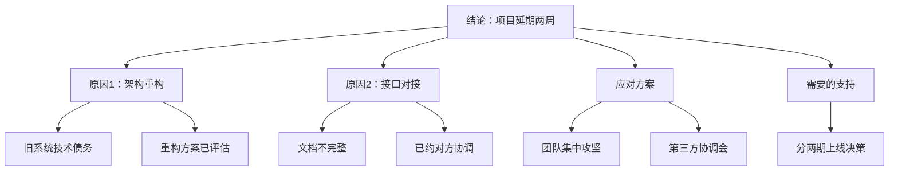
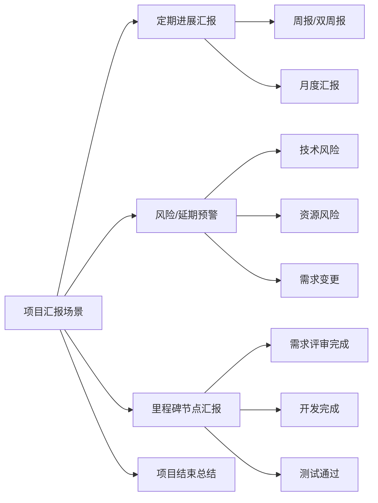

## 案例一：工作汇报——向领导汇报项目进展

工作汇报是职场中最高频、也最容易被低估的沟通场景。据哈佛商学院的一项调研，管理者平均每周花费 15-20 小时在各类汇报和会议上，其中项目进展汇报占据最大比重。然而，大多数人的汇报习惯是"从头讲到尾"，把结论埋在最后一段，让领导在信息噪音中自行提炼重点。这不仅浪费时间，更会损害你在上级心中的专业形象。

本案例以一个真实的项目延期场景为切入点，从理论原理到实操技巧，系统拆解"如何向领导汇报项目进展"这一核心能力。

---

### 一、场景还原

#### 1.1 背景设定

你是某互联网公司的项目经理，负责一个为期三个月的 App 改版开发项目。团队 8 人（含前端 3 人、后端 2 人、测试 1 人、设计 1 人、PM 1 人），项目预算 120 万元。

- **项目启动**：1 月 10 日
- **原定上线**：3 月 15 日（共 64 个工作日）
- **当前日期**：2 月 20 日（已消耗 30 个工作日，进度应达 47%）
- **实际进度**：约 35%，落后 12 个百分点

#### 1.2 当前问题清单

| 序号 | 问题 | 影响范围 | 严重程度 | 当前状态 |
|------|------|----------|----------|----------|
| 1 | 后端架构与旧系统不兼容，需要重构 | 后端全部模块 | 高 | 方案已出，待评审 |
| 2 | 第三方支付接口文档不完整，对接受阻 | 支付模块 | 中 | 已联系对方技术负责人 |
| 3 | 测试阶段发现 3 个需求变更 | 部分功能 | 中 | 需求评审中 |
| 4 | 前端 1 名核心开发请假一周 | 前端开发 | 低 | 已调整排期 |

#### 1.3 你需要传达的核心信息

1. 项目将延期两周（3月15日 → 3月29日）
2. 延期原因有明确的技术归因
3. 你已经有具体的应对方案
4. 需要领导决策：是否接受分两期上线

---

### 二、理论基础：为什么"结论先行"如此重要

#### 2.1 金字塔原理（The Pyramid Principle）

芭芭拉·明托（Barbara Minto）在麦肯锡工作期间提出金字塔原理，核心主张是：**任何沟通都应该从结论开始，然后逐层展开支撑论据。**

**为什么结论先行有效？**

人类大脑在接收信息时存在"首因效应"（Primacy Effect）——最先接收到的信息会占据最大的认知权重。当你把结论放在最后，领导在听前面大段背景时会产生焦虑："他到底想说什么？"这种焦虑会消耗认知资源，导致后面的结论反而被弱化。

神经科学研究也证实了这一点：大脑前额叶皮层在处理信息时，会优先对"框架性信息"建立预期模型。结论先行等于先给大脑一个框架，后续信息会自动归入这个框架中，理解和记忆效率提升 40% 以上。

#### 2.2 PREP 模型：四步结构化表达

PREP 是金字塔原理在口头汇报中的简化应用：

| 步骤 | 英文 | 含义 | 对应内容 |
|------|------|------|----------|
| P | Point | 观点/结论 | "项目预计延期两周" |
| R | Reason | 原因/依据 | "架构重构+接口对接" |
| E | Example | 证据/细节 | "具体数据和进度对比" |
| P | Point | 重申结论 | "因此建议分两期上线" |

PREP 模型的价值在于它的简洁性——四个步骤，每个步骤只需要一句话，30 秒就能完成核心信息传达。对于时间紧张的领导来说，这是最高效的沟通结构。

#### 2.3 SCQA 框架：复杂场景的叙事结构

当汇报内容比较复杂，需要铺垫背景时，可以使用麦肯锡的 SCQA 框架：

- **S（Situation）情境**：大家都知道的背景事实
- **C（Complication）冲突**：发生了什么变化/问题
- **Q（Question）问题**：由此引出的核心问题
- **A（Answer）答案**：你的结论和方案

**应用示例：**

> **S**：我们的 App 改版项目原定 3 月 15 日上线。
> **C**：但后端架构兼容性问题和第三方接口对接困难导致进度落后 12%。
> **Q**：如何在保证质量的前提下追回进度？
> **A**：建议将上线日期调整为 3 月 29 日，并采用分两期上线的策略。

SCQA 适合书面汇报和正式会议，PREP 适合口头快速汇报。两者的核心原则一致：**结论不要藏。**

#### 2.4 汇报的底层逻辑：降低领导的认知成本

很多人误以为汇报的目的是"把事情说清楚"，这只是表面目标。汇报的真正目的是：

1. **降低领导的决策成本**——你替他筛选了信息、整理了逻辑、给出了选项
2. **建立信任关系**——证明你有掌控力，遇到问题能主动应对
3. **获取资源支持**——让领导明确知道需要他做什么

理解这三个目的，你就明白为什么"问题导向"的汇报比"过程导向"的汇报更有效。领导不需要知道你每天做了什么，他需要知道：现在什么状况、有什么风险、你打算怎么办、需要我做什么。

---

### 三、错误示范与深度剖析

#### 3.1 反面案例

> "领导，我想跟您汇报一下项目的情况。这个项目我们上个月就开始做了，一开始还挺顺利的，但是后来遇到了一些技术问题，主要是后端架构方面的事情，我们的技术栈跟原来的不太兼容，然后需要做一些调整。后来我们又发现第三方接口也有问题，对接花了很长时间。现在进度有点落后，但是我跟团队说了要加班赶一赶……对了，上周测试那边也提了一些需求变更，所以我们还需要额外的时间……所以可能要延期两周左右。"

#### 3.2 逐句诊断

| 问题句 | 诊断 | 病因 |
|--------|------|------|
| "我想跟您汇报一下项目的情况" | 开场太随意，没有预告重点 | 缺乏"钩子"意识 |
| "这个项目我们上个月就开始做了" | 领导知道项目什么时候开始的 | 从已知信息开始，浪费时间 |
| "一开始还挺顺利的" | 主观感受，无信息量 | 用感受替代事实 |
| "主要是后端架构方面的事情" | 模糊，没说清到底是什么问题 | 缺乏技术深度的提炼 |
| "进度有点落后" | "有点"是多大？没有量化 | 回避具体数据 |
| "我跟团队说了要加班赶一赶" | 加班不是方案，是态度 | 用态度替代方案 |
| "所以可能要延期两周左右" | "可能""左右"都是模糊词 | 结论不坚定，传递焦虑 |

**核心问题总结：**

1. **结构混乱**：按时间顺序叙述，没有逻辑框架
2. **结论后置**：领导要听完一整段才知道要说什么
3. **数据缺失**：没有进度百分比、具体天数、影响范围
4. **方案空洞**："加班赶一赶"不是可执行的方案
5. **责任模糊**：没有明确需要领导做什么决策

#### 3.3 心理学视角：为什么人们倾向于这样汇报？

这种"从头讲起"的汇报方式源于人类天然的叙事本能。心理学研究表明，人在面对压力场景（向领导汇报坏消息）时，会不自觉地采用"铺垫-缓冲-结论"的策略，试图通过层层铺垫来降低坏消息的冲击。

但这恰恰适得其反。领导在听到铺垫时已经察觉到"有坏事"，焦虑感随着铺垫的拉长而持续累积，最终听到结论时的负面反应反而更大。**直接说出结论，然后提供原因和方案，才是真正降低焦虑的方式。**

---

### 四、正确示范与技法拆解

#### 4.1 正面案例

> "领导，项目进展汇报，有一个重要事项需要您知悉：**项目预计延期两周**，从原来的 3 月 15 日推迟到 3 月 29 日。
>
> 原因有两个：第一，后端架构需要调整，我们评估需要额外一周；第二，第三方接口对接比预期复杂，需要额外一周。
>
> 我的应对方案是：第一，团队从下周开始集中攻坚架构问题；第二，我已经跟第三方技术负责人约了明天的会议，协调加速接口对接。
>
> 需要您支持的是：如果 3 月 29 日仍然有风险，是否可以接受分两期上线，先上核心功能？请您指示。"

#### 4.2 逐句拆解

| 句子 | 技法 | 效果 |
|------|------|------|
| "项目进展汇报，有一个重要事项需要您知悉" | 钩子句，预告重要性 | 立刻抓住注意力 |
| "项目预计延期两周，从3月15日推迟到3月29日" | 结论先行+具体日期 | 30秒内传达核心信息 |
| "原因有两个" | 数字预告 | 告诉领导"只需要听两点" |
| "第一...第二..." | 并列结构 | 信息易消化 |
| "我的应对方案是" | 主动担当 | 不是推卸，而是掌控 |
| "需要您支持的是" | 明确请求 | 降低领导决策成本 |
| "请您指示" | 尊重决策权 | 维护上下级关系 |

#### 4.3 进阶版本：带数据支撑的汇报

当领导要求更详细的信息时，你可以准备一个扩展版本：

> "领导，App 改版项目进展汇报。核心结论：**项目预计延期两周**，从 3 月 15 日调整到 3 月 29 日。
>
> 当前整体进度 35%，原计划应为 47%，落后 12 个百分点。具体来看：
>
> **延期原因分析**——
>
> 原因一：后端架构兼容性问题。我们发现旧系统的数据库模型与新架构存在 3 处不兼容，重构涉及 6 个核心模块，评估需要额外 5 个工作日。技术方案已经出了，预计明天完成评审。
>
> 原因二：第三方支付接口对接受阻。对方提供的接口文档缺少 4 个关键字段的说明，我们已经提了工单，但对方响应较慢。我明天直接跟他们的技术负责人开会，争取本周内解决。
>
> **应对方案**——
>
> 第一，后端团队从下周一开始集中攻坚架构重构，我每天跟进进度。
>
> 第二，前端团队先跳过支付模块，优先完成其他 12 个页面的开发。
>
> 第三，测试团队本周完成已开发模块的测试，不等待支付模块。
>
> **需要您决策的事项**——
>
> 如果 3 月 29 日仍有风险，我建议分两期上线：一期上线核心功能（用户模块、内容模块、搜索模块），二期补上支付和数据统计模块。这样可以确保主业务不受影响。请您审批这个方案。"

---

### 五、不同汇报场景的应对策略

#### 5.1 场景分类与策略选择

项目进展汇报并非只有一种形态，不同场景需要不同的策略：

#### 5.2 定期进展汇报模板

定期汇报的核心是**量化进展 + 标记风险**，不要写成流水账。

**周报模板：**

【本周进展】
- 整体进度：XX%（上周 XX%，本周推进 X%）
- 关键里程碑：XXX 模块开发完成 / XXX 测试通过

【下周计划】
- 重点任务：XXX（负责人：XX，预计完成：X月X日）
- 里程碑节点：XXX

【风险与阻塞】
- 风险1：XXX（影响：XXX，应对：XXX）
- 需协调：XXX（需要 XX 部门支持）

【数据看板】
| 指标 | 计划值 | 实际值 | 偏差 |
|------|--------|--------|------|
| 进度 | XX% | XX% | +/-X% |
| Bug数 | XX | XX | +/-X |
| 需求变更 | X个 | X个 | +/-X |

#### 5.3 风险预警汇报模板

风险汇报的核心是**先说结论和影响，再给方案**。领导最怕的不是听到坏消息，而是听到坏消息时你没有方案。

**风险预警三要素：**

1. **风险描述**：用一句话说清是什么风险
2. **影响评估**：量化影响（延期几天、超预算多少、影响哪些功能）
3. **应对方案**：至少两个方案供选择，附上你的推荐

**示例：**

> "领导，有一个 P1 级别的风险需要您知悉。
>
> **风险**：第三方支付接口对接预计延期一周。
>
> **影响**：如果按原方案，整体上线日期将从 3 月 15 日推迟到 3 月 22 日。
>
> **应对方案**：
> - 方案 A（推荐）：接受延期一周，团队利用这一周加固测试，提升上线质量。
> - 方案 B：分两期上线，支付功能放到二期，3 月 15 日先上核心功能。
>
> 我倾向方案 A，因为延期一周的业务影响可控，且能提升整体质量。请您决策。"

#### 5.4 里程碑汇报模板

里程碑汇报的核心是**总结成果 + 展望下阶段**，是一个承上启下的节点。

**结构：**

1. 本阶段目标完成情况（对照计划）
2. 关键成果和亮点
3. 问题复盘（发生了什么、怎么解决的、学到什么）
4. 下阶段计划和风险预判

#### 5.5 项目总结汇报模板

项目结束时的汇报不仅是总结，更是个人品牌的展示机会。

**结构：**

1. 项目目标 vs 实际成果（数据对比）
2. 关键成果和业务价值（量化）
3. 过程中的挑战和应对（展示能力）
4. 经验教训和改进方向（展示成长）
5. 对后续项目的建议（展示格局）

---

### 六、向上汇报的进阶技巧

#### 6.1 了解你的领导：情境领导力的应用

不同风格的领导需要不同的汇报方式。根据赫塞-布兰查德的情境领导理论，可以把领导大致分为四类：

| 领导风格 | 特征 | 汇报策略 | 注意事项 |
|----------|------|----------|----------|
| 指令型 | 关注结果，时间紧迫 | 极简汇报，结论先行，方案二选一 | 不要啰嗦，不要解释太多背景 |
| 教练型 | 关注过程，愿意指导 | 适当展开方法论，请教意见 | 展示思考过程，但不要过于冗长 |
| 支持型 | 关注团队，重视感受 | 先说人的情况，再说事的情况 | 强调团队协作和士气 |
| 授权型 | 关注大局，充分信任 | 精简汇报，突出关键决策点 | 不要事无巨细，展示自主性 |

**判断领导风格的信号：**

- 指令型：经常说"直接说结论""我没时间听过程"
- 教练型：经常问"你为什么这样做""有没有考虑过其他方案"
- 支持型：经常问"团队怎么样""大家有没有困难"
- 授权型：经常说"你看着办""不用跟我汇报细节"

#### 6.2 汇报时机的选择

时机比内容更重要。同样一份汇报，在不同时间点传达，效果截然不同。

**最佳时机：**

- 领导刚到公司、处理完邮件后的 30 分钟窗口期
- 周一上午（建立一周预期）或周五下午（总结一周成果）
- 重要会议/决策之前（提供决策素材）

**最差时机：**

- 领导正在处理紧急事务时
- 领导刚开完一个糟糕的会议后
- 下班前最后 5 分钟（除非是紧急事项）
- 领导跟其他人争论时

**时机选择的原则：坏消息早报，好消息晚报。**

坏消息早报的原因：给领导更多反应和决策时间，也显示你没有隐瞒。好消息晚报的原因：让领导带着好心情结束一天。

#### 6.3 书面汇报 vs 口头汇报

| 维度 | 书面汇报 | 口头汇报 |
|------|----------|----------|
| 适用场景 | 正式记录、复杂信息、多人同步 | 快速同步、简单决策、关系维护 |
| 信息密度 | 高，可以详细展开 | 低，只传达核心信息 |
| 结构要求 | 完整的标题层级和数据表格 | 3-5 个要点，不超过 2 分钟 |
| 领导反应 | 可以回看、转发、留档 | 即时反馈，快速决策 |
| 风险 | 容易写太长，重点被淹没 | 容易遗漏关键信息 |

**最佳实践：口头先行，书面跟进。**

先用 2 分钟口头传达核心信息，确认领导已理解并做出决策，再发送书面版本作为记录和备忘。这样既有即时沟通的效率，又有书面记录的严谨。

#### 6.4 数据的力量：让汇报更有说服力

**用数据替代形容词：**

| 低效表达 | 高效表达 |
|----------|----------|
| 进度有点落后 | 进度落后 12%（35% vs 计划 47%） |
| Bug 比较多 | 本周新增 Bug 23 个，较上周增加 40% |
| 成本超了一些 | 预算超支 8 万元，占总预算 6.7% |
| 用户反馈还不错 | 用户满意度评分 4.2/5.0，较上版提升 0.3 |
| 需要更多时间 | 评估还需 10 个工作日（原计划剩余 15 天） |

**数据汇报的三个层次：**

1. **状态数据**：现在在哪里（进度百分比、完成数量）
2. **对比数据**：跟计划比怎么样（偏差值、趋势线）
3. **预测数据**：按照现在的情况会怎样（预计完成日期、风险概率）

#### 6.5 汇报中的权力语言学

语言不仅是信息载体，更是权力关系的映射。在向上汇报中，措辞的选择直接影响领导对你能力和态度的判断。

**低权力语言 vs 高权力语言：**

| 低权力语言 | 高权力语言 | 差异本质 |
|------------|------------|----------|
| 我觉得可能延期 | 评估结果显示将延期 | 主观感受 vs 客观判断 |
| 我们试试看能不能解决 | 我的方案是分三步执行 | 不确定 vs 有掌控 |
| 这个问题挺严重的 | 这是 P1 级风险，影响上线时间 | 情绪化 vs 标准化 |
| 我不知道怎么办 | 我需要您的决策支持 | 无能 vs 尊重边界 |
| 对不起出了这个问题 | 问题已定位，方案已就绪 | 内疚 vs 担当 |

---

### 七、常见误区与纠正

#### 误区一：把汇报当流水账

**症状**：按时间顺序罗列所有工作，"周一做了什么、周二做了什么"。

**病因**：混淆了"汇报"和"记录"。汇报是提炼信息用于决策，记录是存档备查。

**纠正**：用"成果+风险+计划"三段式替代时间线叙事。领导不需要知道你每天做了什么，只需要知道结果和下一步。

#### 误区二：只报喜不报忧

**症状**：只说进展顺利的部分，隐藏或淡化问题。

**病因**：害怕被批评，或者觉得"问题我自己能解决"。

**后果**：问题积累到无法掩盖时爆发，领导会质问"为什么现在才说"，信任崩塌。

**纠正**：建立"风险预警"意识。小问题及时同步，让领导有心理准备。记住：**领导宁愿早点知道坏消息，也不愿最后被惊喜。**

#### 误区三：问题导向而非方案导向

**症状**："这个问题解决不了""那个部门不配合""资源不够"。

**病因**：把汇报当成了诉苦的机会，或者下意识地在推卸责任。

**纠正**：每个问题后面必须跟方案。即使是"我解决不了"，也要说"我尝试了 A、B、C 三个方案，都因为 XX 原因不可行，建议请 XX 部门协调"。

#### 误区四：过度技术化

**症状**：用大量技术术语描述问题，领导听不懂。

**病因**：只从自己的角度出发，没有考虑听众的知识背景。

**纠正**：用业务语言翻译技术问题。"后端架构不兼容"翻译成"系统升级需要额外一周"；"第三方 API 限流"翻译成"跟合作方的数据对接需要更多时间"。

#### 误区五：没有明确的请求

**症状**：汇报了一堆信息，最后没有说"需要您做什么"。

**病因**：不知道该请求什么，或者害怕提要求。

**纠正**：每次汇报结束前，问自己"领导听完这些，需要他做什么？"如果是知悉型汇报，就明确说"请您知悉，不需要您做任何动作"。如果是决策型汇报，就给出 2-3 个选项让领导选择。

#### 误区六：把"加班"当方案

**症状**："我会加班赶进度的""让团队加把劲"。

**病因**：把态度当成了方案，以为表达了努力就够了。

**纠正**：加班是执行动作，不是方案。真正的方案应该是："通过调整任务优先级、增加人手、简化非核心功能等措施，在 X 天内追回 Y% 的进度。"

---

### 八、实战演练：三个进阶场景

#### 8.1 场景一：多重问题叠加的汇报

**情境**：项目同时遇到技术问题、人员变动和需求变更，需要一次性汇报。

**示范：**

> "领导，项目有三个风险需要同步，整体评估延期两周。
>
> **风险一（高）**：后端架构兼容性问题，预计影响一周。应对：技术方案已出，下周一启动重构。
>
> **风险二（中）**：前端核心开发小王因家庭原因请假一周。应对：已协调隔壁组的小李本周支援，影响可控。
>
> **风险三（低）**：测试阶段收到 3 个需求变更，涉及 2 个页面。应对：已做影响评估，建议将低优先级的 2 个变更放到二期。
>
> 综合评估：3 月 29 日上线有 85% 的把握。需要您决策的是：3 个需求变更中，哪个必须在一期上线？"

**要点**：多重问题要分级（高中低），每个问题配一个应对方案，最后聚焦一个需要领导决策的事项。

#### 8.2 场景二：好消息也需要汇报

**情境**：项目提前完成了一个关键里程碑，团队士气高涨。

**错误做法**：在群里发一句"大家辛苦了，这个阶段完成得很棒"，然后觉得不需要正式汇报。

**正确示范：**

> "领导，跟您同步一个好消息：App 改版项目的核心功能开发已提前 3 天完成，目前整体进度 52%，超过计划进度 5 个百分点。
>
> 关键成果：用户模块和内容模块已通过代码评审，测试覆盖率 87%，高于我们 80% 的目标。
>
> 下一步：后端团队本周开始接口联调，前端团队进入支付模块开发。按照当前节奏，3 月 15 日原定上线日期可以保住。
>
> 团队状态很好，士气高涨，感谢您上周批准的团建活动，效果很明显。"

**要点**：好消息也要量化，不要只说"挺好的"。同时预告下一步计划，展示持续的掌控力。

#### 8.3 场景三：领导追问细节时如何应对

**情境**：你按 PREP 结构汇报完，领导追问"具体是哪些技术问题？""为什么之前没发现？"

**原则**：准备好"第二层信息"。汇报是分层的，第一层是结论和关键数据，第二层是支撑细节，第三层是技术细节。

**示范：**

> 领导："具体是什么架构问题？"
>
> 你："主要是数据库模型不兼容。旧系统用的是关系型数据库的单表结构，新架构需要分布式存储，两边的数据格式对不上。涉及 6 个核心模块，其中用户数据和订单数据的迁移最复杂。
>
> 技术方案是分两步走：第一步先做数据适配层，保证新旧系统可以并行运行；第二步做数据迁移和切换。这个方案上周五已经出来了，明天技术评审，通过后立即启动。"

**要点**：领导追问细节时，不要慌，也不要甩技术术语。用"问题→影响→方案"的结构回答每一个追问。

---

### 九、汇报前的准备工作

#### 9.1 汇报准备清单

在向领导汇报之前，用以下清单自查：

| 检查项 | 标准 | 自查 |
|--------|------|------|
| 结论是否明确 | 一句话能说清 | □ |
| 数据是否充分 | 有量化指标支撑 | □ |
| 原因是否归因准确 | 区分主观和客观原因 | □ |
| 方案是否可执行 | 有具体步骤、负责人、时间节点 | □ |
| 请求是否明确 | 领导知道需要做什么 | □ |
| 时间是否可控 | 不超过 2 分钟口头汇报 | □ |
| 时机是否合适 | 领导有时间且状态良好 | □ |
| 材料是否备好 | 数据、图表、方案文档随时可调出 | □ |

#### 9.2 "电梯汇报"练习

"电梯汇报"（Elevator Pitch）是指在 30 秒内（大约一部电梯从 1 楼到 20 楼的时间）把核心信息传达清楚的练习。

**练习方法：**

1. 把汇报内容写下来，删到只剩 3 句话
2. 计时朗读，确保不超过 30 秒
3. 找同事模拟，看他能否复述你的核心信息
4. 如果同事复述不出来，继续精简

**30 秒结构：**

- 第 1 句（5 秒）：结论 + 关键数据
- 第 2 句（10 秒）：最核心的原因
- 第 3 句（10 秒）：方案 + 请求
- 留 5 秒给领导反应

---

### 十、长期能力构建

#### 10.1 建立个人汇报体系

不要把汇报当成一次性任务，而是建立一套持续运转的体系：

1. **日报/周报模板化**：固定格式，减少每次的思考成本
2. **数据看板常态化**：用工具自动采集项目数据，汇报时直接引用
3. **风险台账制度化**：维护一份风险清单，定期更新状态
4. **汇报复盘习惯化**：每次汇报后反思哪些地方做得好、哪些需要改进

#### 10.2 从汇报到影响力

汇报做得好，不只是"把事情说清楚"，更是积累影响力的过程。当你持续地提供结构清晰、数据扎实、方案可行的汇报时，领导会逐渐建立对你的信任，给你更大的自主权和更多的资源。

这就是沟通的复利效应：**每一次高质量的汇报，都是在为下一次沟通充值信任。**

#### 10.3 推荐阅读

- 《金字塔原理》——芭芭拉·明托：结构化思维的经典之作
- 《学会提问》——尼尔·布朗：批判性思维和有效提问
- 《关键对话》——科里·帕特森：高风险场景下的沟通技巧
- 《用数据讲故事》——科尔·努斯鲍默·纳福利克：数据可视化和叙事

---

### 本节要点回顾

| 维度 | 核心原则 | 行动要点 |
|------|----------|----------|
| 结构 | 结论先行，金字塔原理 | 第一句话说结论，不要铺垫 |
| 内容 | 数据说话，方案导向 | 用数字替代形容词，每个问题配方案 |
| 时机 | 坏消息早报，好消息晚报 | 选择领导状态好的时间窗口 |
| 风格 | 因人而异，匹配领导风格 | 观察领导偏好，调整汇报方式 |
| 请求 | 明确决策点，降低决策成本 | 告诉领导"需要您做什么" |
| 长期 | 建立信任复利 | 持续高质量汇报，积累影响力 |

记住：汇报不是目的，**推动事情进展**才是目的。每一次汇报都应该让项目向前迈进一步——无论是获取决策、争取资源，还是同步认知。
