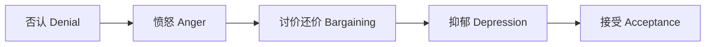
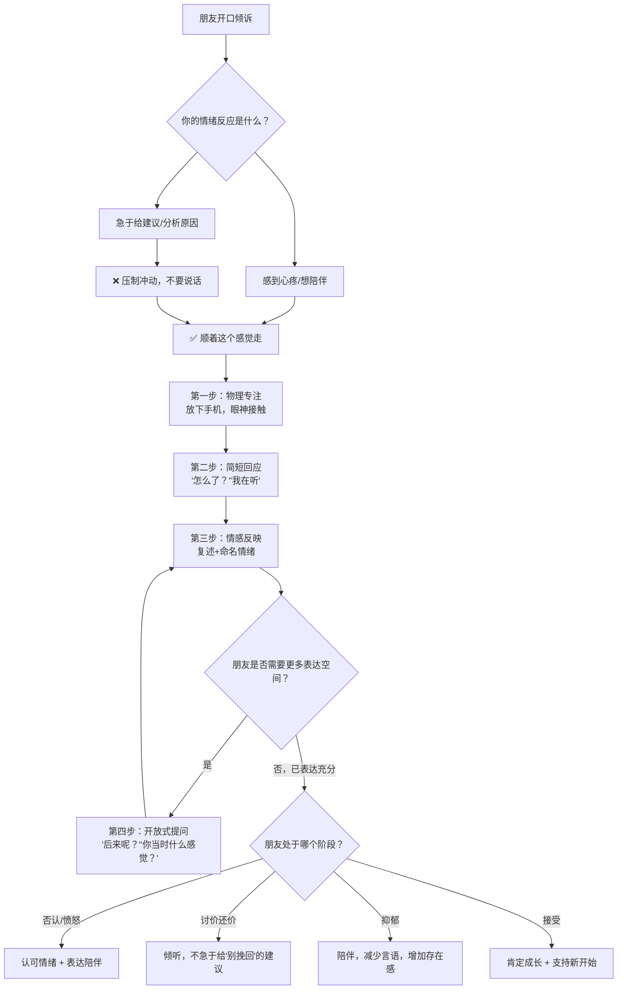
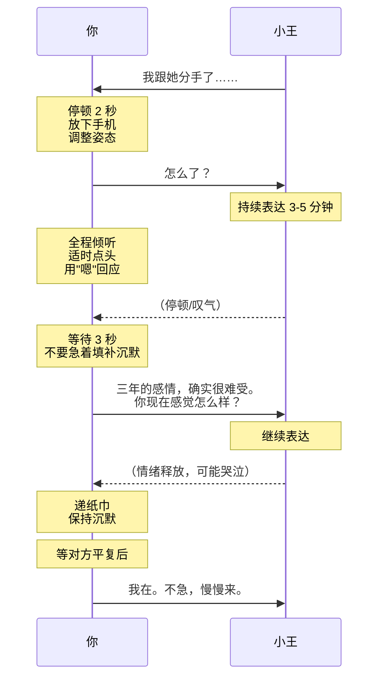
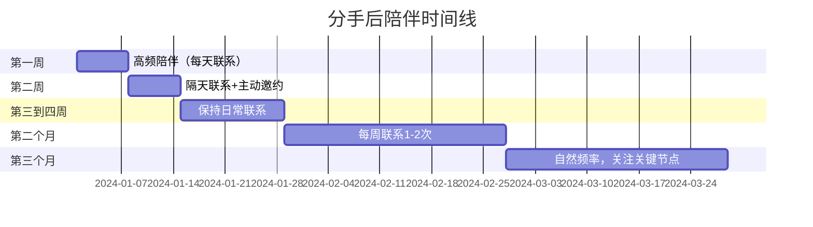

## 案例二：朋友聊天——安慰失恋的朋友

朋友失恋了来找你倾诉，这是人际沟通中最常见也最容易搞砸的场景之一。据美国心理学会（APA）的调查，超过 70% 的人在安慰他人时会本能地采取"解决问题"模式——给建议、讲道理、分享自己的经历——而恰恰是这种本能反应，让需要情感支持的朋友感到更加孤独。

安慰的本质不是"让对方好起来"，而是"让对方感到不孤单"。这个区分看似简单，却是绝大多数人跨不过去的认知门槛。本案例从心理学原理出发，系统拆解"如何安慰一个失恋的朋友"这一高频场景中的每一个沟通细节。

---

### 一、场景还原

#### 1.1 背景设定

你的大学好友小王，男，26 岁，与女朋友交往三年，从大四到工作两年。两人共同的朋友圈广泛，曾多次在社交媒体上公开秀恩爱。上周，女朋友突然提出分手，理由是"你不够关心我，我们之间没有感觉了"。

- **分手时间**：一周前
- **当前阶段**：震惊期刚过，进入否认与愤怒交织的阶段
- **求助信号**：主动约你出来吃饭，说"最近心情不好，想聊聊"
- **你们的关系**：大学室友，毕业后保持联系但见面频率下降

#### 1.2 你需要传达的核心态度

1. 我在这里，我愿意听
2. 你的感受是正常的、被理解的
3. 我不会评判你或你的前任
4. 我不会急着帮你"解决问题"

#### 1.3 心理学背景：分手后的五个心理阶段

根据库伯勒-罗丝（Elisabeth Kübler-Ross）的哀伤五阶段模型，失恋后的心理反应也遵循类似的轨迹。理解这些阶段，能帮助你判断朋友当前处于哪个状态，从而选择最合适的回应方式。

| 阶段 | 表现 | 朋友可能说的话 | 最需要的回应 |
|------|------|----------------|-------------|
| 否认 | 不相信分手是真的 | "她可能只是说气话""过几天就好了" | 不打破幻想，但也不强化，陪伴即可 |
| 愤怒 | 对前任或自己感到愤怒 | "她怎么能这样对我""我浪费了三年" | 认可愤怒的合理性，不劝"别生气" |
| 讨价还价 | 想挽回，反复纠结 | "我要不要去找她""如果我当时……" | 倾听，不急于给出"别去找她"的建议 |
| 抑郁 | 悲伤、空虚、无力 | "什么都不想做""觉得没意思" | 共情陪伴，不试图"拉他出来" |
| 接受 | 开始面对现实 | "算了，过去就过去了" | 肯定他的成长，支持新开始 |

> ⚠️ **重要提醒**：这五个阶段不是线性的，朋友可能在不同阶段之间反复跳转。今天的"愤怒"可能明天又变成"讨价还价"。你的角色不是推动他向前走，而是陪在他当前所在的地方。

---

### 二、理论基础：为什么"安慰"这么难

#### 2.1 共情的神经科学机制

当一个人倾诉痛苦时，倾听者的大脑会激活两套系统：

1. **共情网络（Empathy Network）**：包括前脑岛（anterior insula）和前扣带回皮层（ACC），负责"感受"对方的情绪——你听到朋友哭，自己也会感到胸口发紧。

2. **心智化网络（Mentalizing Network）**：包括内侧前额叶皮层（mPFC）和颞顶联合区（TPJ），负责"理解"对方的心理状态——你知道他在想什么、为什么难过。

这两套系统共同工作，但在实际沟通中，大多数人会跳过共情系统，直接启动**问题解决模式**——大脑的背外侧前额叶皮层（dlPFC）被激活，急于分析原因、寻找方案。这就是为什么人们在安慰别人时总是忍不住给建议：大脑在"修复"问题，而不是在"感受"痛苦。

**关键洞察**：失恋的朋友需要的是你的共情系统被激活（"我感受到你的痛苦"），而不是你的问题解决系统被激活（"让我告诉你该怎么做"）。

#### 2.2 情感验证理论（Emotional Validation）

心理学家 Marsha Linehan 在辩证行为疗法（DBT）中提出了情感验证的六个层次：

| 层次 | 名称 | 含义 | 示例 |
|------|------|------|------|
| 1 | 专注倾听 | 全身心关注对方 | 放下手机，看着对方的眼睛 |
| 2 | 准确反映 | 用自己的话复述对方的感受 | "听起来你真的很伤心" |
| 3 | 读出潜台词 | 说出对方没有直接表达的内容 | "你是不是还觉得很不甘心？" |
| 4 | 用经历验证 | 把对方的感受放在人生经历中理解 | "三年的感情突然结束，任何人在这个处境下都会很难受" |
| 5 | 用人性验证 | 将感受与普遍的人性需求联系 | "人需要被爱和被珍惜，你想要这些完全正常" |
| 6 | 真诚对待 | 平等、不居高临下地回应 | 不说"你会好的"，而是"这确实很难" |

大多数人在安慰朋友时只做到了第 1 层（而且经常做不到），而真正有效的安慰需要至少达到第 3-4 层。

#### 2.3 "建议陷阱"：为什么给建议反而帮倒忙

研究表明，当一个人处于情绪痛苦中时，大脑的杏仁核（amygdala）高度活跃，负责理性思考的前额叶皮层功能被抑制。这意味着：

1. **朋友现在听不进理性建议**——情绪风暴中，"你应该这样做"会被解读为"你连这都不会处理"。
2. **给建议隐含着评判**——"你应该放下"隐含的意思是"你还放不下是你的问题"。
3. **给建议打断了情绪释放**——朋友需要的是把情绪"倒出来"，你的建议相当于把出口堵住了。

心理学家 John Gottman 将这种现象称为"修复尝试失败"（Failed Repair Attempt）：当我们试图用建议来"修复"对方的情绪时，对方反而感到更不被理解，关系亲密度下降。

---

### 三、错误示范与深度剖析

#### 3.1 反面案例

> 小王："我跟她分手了……"
>
> 你："啊？为什么啊？"
>
> 小王："她说我不够关心她……"
>
> 你："那你就多关心她啊！女人嘛，哄一哄就好了。你要不要我帮你出出主意，怎么把她追回来？我跟你说，我之前也分手过，后来……"
>
> 小王：（沉默，不想继续说了）

#### 3.2 逐句诊断

| 问题句 | 诊断 | 病因 | 心理学解释 |
|--------|------|------|-----------|
| "啊？为什么啊？" | 第一反应是追问原因，而非关注情绪 | 理性驱动，急于获取信息来"分析问题" | 杏仁核信号被前额叶拦截，跳过共情直接进入分析模式 |
| "那你就多关心她啊！" | 急于给建议，而且是空洞的建议 | 认为"解决问题 = 帮助" | 忽视了情绪脑的优先级高于理性脑 |
| "女人嘛，哄一哄就好了" | 简化问题，隐含对女性的刻板印象 | 用笼统标签替代具体理解 | 认知偏差：用刻板印象替代对具体个体的理解 |
| "你要不要我帮你出出主意" | 主动要给方案，没有问对方需不需要 | "我能帮你"的优越感 | 修复尝试：试图消除不适感（自己的不适感） |
| "我之前也分手过，后来……" | 把话题转移到自己身上 | 想通过分享经历来建立连接 | 自我中心偏差：误以为"我也经历过" = "我理解你" |

**核心问题总结**：

1. **情绪雷达失灵**：没有识别到小王此刻需要的是情感支持，不是解决方案
2. **倾听缺失**：没有给小王充分表达的空间，每个回合都在"输出"
3. **共情断裂**：没有一句回应是在说"我感受到你的痛苦"
4. **话题转移**：把自己的经历拉进来，让朋友从"被倾听者"变成了"倾听者"
5. **节奏失控**：在朋友刚开口时就密集输出，打断了情绪释放的节奏

#### 3.3 更隐蔽的错误示范

有些安慰听起来"好像没问题"，但实际上同样在伤害朋友：

**错误示范 A：否定感受型**

> "别难过了，天涯何处无芳草。她不值得你这样。"
> "男人嘛，哭什么哭，振作起来。"

**诊断**：直接否定朋友的感受，传递的信息是"你的痛苦不合理"。"别难过了"三个字，相当于说"你的情绪是错的"。

**错误示范 B：比惨型**

> "你这算什么，我当年被劈腿才叫惨。你现在至少是和平分手。"

**诊断**：通过比较痛苦来贬低朋友的感受。痛苦不是比赛，每个人的痛苦都值得被尊重。

**错误示范 C：正能量绑架型**

> "往好的方面想，你现在自由了啊！可以好好搞事业了。每一段经历都是成长。"

**诊断**：在朋友最痛的时候强行灌鸡汤，等同于告诉对方"你不应该难过"。成长是以后的事，不是现在该谈的。

**错误示范 D：八卦型**

> "为什么分手啊？是不是她有别人了？你有没有查过她手机？"

**诊断**：满足自己的好奇心，而非关心朋友的感受。把朋友的痛苦当成八卦素材。

---

### 四、正确示范与技法拆解

#### 4.1 完整正面案例

> 小王："我跟她分手了……"
>
> 你：（放下手机，认真看着他）"怎么了？"
>
> 小王："她说我不够关心她，觉得我们之间没有感觉了。三年了，说分就分……"
>
> 你：（点头）"三年的感情，确实很难受。你现在感觉怎么样？"
>
> 小王："说不上来，就是觉得空落落的……"
>
> 你："嗯，这种感觉我能理解。分手之后那种空虚感真的很不好受。"
>
> 小王："是啊……其实我也反思了，可能我确实做得不够好。"
>
> 你："你能这样想说明你在成长。不过现在不用急着想这些，先让自己缓一缓。今晚咱们好好吃顿饭，想聊什么就聊什么。"
>
> 小王：（沉默了一会儿）"其实我也不知道该说什么，就是想找人待一会儿。"
>
> 你："那就待着。不一定要说什么，我在就行。"

#### 4.2 逐句技法拆解

| 你的回应 | 使用的技法 | 原理 | 效果 |
|----------|-----------|------|------|
| （放下手机，认真看着他） | 非言语专注 | 身体语言传递"你比手机重要" | 建立安全的倾诉环境 |
| "怎么了？" | 开放式邀请 | 不预设、不追问、不引导 | 让朋友用自己的节奏表达 |
| （点头）"三年的感情，确实很难受" | 情感反映 + 人生经历验证 | Linehan 验证层次 2-4：反映感受 + 用经历验证 | 让朋友感到"他懂我" |
| "你现在感觉怎么样？" | 情绪聚焦提问 | 引导朋友关注自己的感受而非事件本身 | 推动情绪释放，而非事实复盘 |
| "嗯，这种感觉我能理解" | 共情确认 | 表达理解而非同情（"理解"是平等的，"同情"是居高临下的） | 降低孤独感 |
| "你能这样想说明你在成长" | 积极肯定 | 在痛苦中识别出成长的萌芽并加以肯定 | 不否定痛苦，但也不沉溺于痛苦 |
| "先让自己缓一缓" | 节奏建议 | 不是"你应该怎么做"，而是"你不必现在就怎样" | 减轻自我施压 |
| "我在就行" | 存在性支持 | 最强大的安慰不是语言，而是"我在" | 消除孤独感的核心武器 |

#### 4.3 沟通流程全景图

---

### 五、安慰的完整工具箱

#### 5.1 万能回应公式：AER 模型

在朋友倾诉的任何时刻，如果你不知道说什么，用这个三步公式：

**A — Acknowledge（确认）**：表明你听到了
> "嗯。""是的。""我听到了。"

**E — Emotion（情感）**：命名对方的情绪
> "听起来你很难过/失望/愤怒/迷茫。"

**R — Reflect（反映）**：复述或总结对方的核心意思
> "你跟她在一起三年，突然分开，确实很难接受。"

**组合示例**：

> 朋友："我每天晚上都睡不着，一闭眼就想到她。"
>
> 你（A）："嗯。" + （E）"这种感觉一定很折磨人。" + （R）"三年的记忆不是说忘就能忘的，晚上是最难熬的时候。"

#### 5.2 不同情绪状态的回应话术库

| 朋友说的话 | 情绪信号 | 推荐回应 | 避免说的话 |
|-----------|---------|---------|-----------|
| "我跟她分手了" | 悲伤、震惊 | "我在听，怎么了？" | "为什么？""怎么搞的？" |
| "她说我不够关心她" | 委屈、自我怀疑 | "被这样评价，心里一定很不好受。" | "那你确实不够关心啊" |
| "三年了，说分就分" | 不甘心、愤怒 | "三年的感情，不是说放就放的。" | "分了就分了呗" |
| "我是不是真的不够好" | 自我否定 | "一段关系的结束不代表你不好。现在不用急着下结论。" | "你确实有些地方可以改进" |
| "我想去找她谈谈" | 讨价还价、纠结 | "你很想挽回，我能理解。你现在心里在想什么？" | "别去了，没用的""她不值得" |
| "我觉得我再也找不到人了" | 绝望、恐惧 | "现在有这种感觉很正常。但这种感觉会过去的。" | "不会的，你条件这么好" |
| "我不知道该说什么，就想找人待会儿" | 需要陪伴 | "那就待着，我在。" | "你总得说点什么吧" |
| "我想哭" | 悲伤释放 | "哭吧，我在这里。" | "别哭了""哭有什么用" |

#### 5.3 肢体语言清单

安慰不仅仅是语言，非言语信号往往传递更多信息：

**应该做的**：
- ✅ 放下手机，关掉屏幕（或翻面朝下）
- ✅ 保持眼神接触，但不要死盯着（自然地看）
- ✅ 身体微微前倾，表示关注
- ✅ 适时点头，表示"我在听"
- ✅ 对方哭泣时，递纸巾（不要拍背，除非你们关系很近）
- ✅ 如果关系亲近，可以握手或拥抱（先观察对方是否接受肢体接触）
- ✅ 保持沉默的空间，不要急于填满每一秒

**不应该做的**：
- ❌ 看手机、回消息
- ❌ 频繁看时间
- ❌ 双臂交叉抱胸（防御姿态）
- ❌ 身体后仰或转向别处
- ❌ 不停地叹气或摇头
- ❌ 在对方面前跟别人说笑

#### 5.4 聊天节奏控制

安慰不是连续输出，而是"说—停—听"的循环。

**关键节奏原则**：

1. **朋友说完后等 3 秒再回应**——这 3 秒是留给朋友补充的空间，也是给你组织语言的时间
2. **你的回应不超过 2-3 句话**——你说得越少，朋友说得越多，这是好事
3. **沉默不是尴尬，是力量**——两个人安静地坐着，本身就是一种支持
4. **不要急着把对话"推进"到下一步**——朋友想聊多久就聊多久

---

### 六、不同分手类型的应对策略

分手原因不同，朋友的核心痛苦点也不同，安慰的侧重点需要相应调整：

#### 6.1 被分手（被动型）

**核心痛苦**：被抛弃感、自我价值感崩塌

**朋友的心理**："是不是我不够好？""为什么她不要我了？"

**安慰重点**：
- 不急于论证"你很好"（现在说他听不进去）
- 先认可"被拒绝确实很痛"
- 避免任何暗示"你也有问题"的表达

**示范**：
> "被离开的感觉真的很痛，不管什么原因，'被选择不要'这件事本身就已经够难受了。你现在不需要分析原因，先允许自己难过。"

#### 6.2 主动分手（主动型）

**核心痛苦**：内疚感、"我是不是做错了"的自我怀疑

**朋友的心理**："我是不是太残忍了？""也许我应该再给一次机会？"

**安慰重点**：
- 不要说"你做得对"（除非你确定，且朋友明确需要认同）
- 不要说"你做得不对"（加重内疚）
- 帮朋友厘清感受："你是在为分手本身难过，还是在为她的难过而难过？"

#### 6.3 和平分手

**核心痛苦**：丧失感、对未来不确定性的恐惧

**朋友的心理**："我们没有吵架，就这样结束了？""接下来怎么办？"

**安慰重点**：
- 认可"和平分手不代表不痛"
- 帮朋友面对"没有戏剧性冲突的失落同样值得哀悼"
- 适当引导关注未来（但不是在第一次倾诉时）

#### 6.4 出轨/背叛分手

**核心痛苦**：信任崩塌、愤怒与屈辱

**朋友的心理**："我被欺骗了""我再也不相信任何人了"

**安慰重点**：
- 先处理愤怒，不要劝"算了"
- 不要说"也许有误会"（除非你真的知道有误会）
- 警惕朋友出现报复性行为，必要时温和提醒

**示范**：
> "你有权利愤怒。被信任的人背叛，是世界上最难消化的事情之一。你现在想骂就骂，我听着。"

---

### 七、安慰中的常见误区

#### 误区一：急于让朋友"好起来"

**症状**："你已经难过三天了，该振作了""别老想这些了，出去玩玩"

**病因**：你对朋友的痛苦感到不适，想尽快消除这种不适感——本质上是在缓解自己的焦虑，而非帮助朋友。

**纠正**：哀伤没有时间表。心理学研究表明，一段认真投入的感情结束后，完全走出来通常需要这段关系持续时间的 1/2 到 1/3。三年的感情，至少需要 3-6 个月。你的角色是陪伴这个过程，而不是加速它。

#### 误区二：充当情感分析师

**症状**："你们分手的根本原因是缺乏有效沟通""从依恋理论来看，你属于焦虑型依恋"

**病因**：把心理咨询师的角色代入朋友关系。你不是他的治疗师。

**纠正**：朋友之间不需要"分析"，需要"陪伴"。除非朋友明确说"你觉得我们为什么分手"，否则不要主动分析。如果他问了，也要先说"这只是我的看法，不一定对"。

#### 误区三：评判对方或前任

**症状**："她就是个渣女""你当初就不该跟她在一起""我早就看出来她不是好人"

**病因**：通过攻击前任来"帮"朋友出气。

**纠正**：你骂完前任，朋友可能明天就复合了，到时候你的位置会很尴尬。更深层的问题是：评判前任等于评判朋友的择偶眼光，会让朋友感到被双重否定。保持中立，除非朋友明确需要你站队。

#### 误区四：过早推动"向前看"

**症状**："我给你介绍个新的""你应该去健身/旅行/学新东西"

**病因**：用"下一步行动"来替代"当下感受"。

**纠正**：朋友还在为上一段关系哀悼时，你推他进入下一段，等同于要求他跳过悲伤。先陪他走过哀伤，再谈论"向前看"——这个顺序不能颠倒。

#### 误区五：分享过多自己的经历

**症状**："我之前失恋的时候……""我告诉你我怎么走出来的……"

**病因**：试图通过"我也有过类似经历"来建立连接，但不自觉地把话题焦点从朋友转移到了自己。

**纠正**：如果要分享自己的经历，控制在 1-2 句话，且必须落回朋友身上。例如："我以前也经历过分手，那种空落落的感觉我太懂了。你现在最难受的是什么？"——自己的经历是桥梁，不是目的地。

#### 误区六：把朋友的痛苦当成需要"修复"的故障

**症状**：反复问"你好点了吗""你今天感觉怎么样"，像在监测病情。

**病因**：把正常的情绪反应当作"问题"，把朋友当作"需要被修理的对象"。

**纠正**：痛苦不是故障，不需要被修复。反复问"好点了吗"会传递焦虑："你的状态让我担心，你能不能快点好？"改为自然地陪伴，让朋友自己决定什么时候聊、聊多少。

---

### 八、进阶场景应对

#### 8.1 场景一：朋友深夜打电话哭诉

**情境**：凌晨 1 点，朋友打电话来，泣不成声。

**原则**：深夜来电意味着情绪已经到了临界点，这时候任何"明天再说"都是拒绝。

**示范**：
> "我在，你慢慢说。"（即使你很困，也要让声音听起来是清醒的、温暖的）
>
> 如果朋友说不出话来："你不用说话，我就在这儿听着。想哭就哭。"
>
> 持续 10-15 分钟后，如果朋友情绪平复了一些："今天先到这里，你试着睡一会儿。明天中午我给你打电话，咱们再聊。"

**关键**：给一个明确的"明天会继续"的承诺——朋友最怕的是"倾诉完之后又回到一个人"。

#### 8.2 场景二：朋友反复倾诉同一件事

**情境**：朋友已经第三次跟你说同样的话了，"她怎么能这样对我""三年了说分就分"。

**原则**：反复倾诉是情绪处理的正常机制。心理学上称为"反刍"（rumination），是大脑在试图消化无法接受的现实。不要表现出不耐烦。

**示范**：
> "我听到了，这件事对你冲击很大。你每次想到这些，是什么感觉？"

**进阶**：如果反复倾诉持续超过 2-3 周且没有任何缓解迹象，可以温和地建议专业帮助：
> "我注意到这段时间你一直在想这些，我理解这对你来说很难。你有没有考虑过跟专业的心理咨询师聊聊？不是说你有什么问题，而是他们有一些方法能帮人更好地处理这种痛苦。"

#### 8.3 场景三：朋友问你"你觉得我应该怎么做"

**情境**：朋友说"你觉得我该不该去找她谈谈？""我应该怎么走出来？"

**原则**：不要直接给答案。但也不能说"你自己决定"——这会让他感到被抛弃。

**示范**：
> "你问这个问题，说明你心里其实已经有了一些想法。你想去找她谈谈，这个念头你是什么时候开始有的？你想象一下，如果去找她了，最好的结果和最坏的结果分别是什么？"

**原理**：用提问帮朋友自己理清思路，而不是替他做决定。这是心理咨询中"苏格拉底式提问"的简化应用。

#### 8.4 场景四：朋友表现出危险信号

**情境**：朋友说"活着没意思""我真想从楼上跳下去""没有她我活不下去"。

**原则**：**任何涉及自伤或自杀的表达都必须严肃对待，即使你认为他"只是说说"。**

**行动步骤**：

1. **不要恐慌**，但也不要忽视
2. **直接问**："你说'想跳下去'，你是在考虑自杀吗？"（直接问不会"给对方灵感"，反而会让对方感到被认真对待）
3. **倾听**，不要急于反驳"你不能这样想"
4. **评估严重程度**：是否有具体计划？是否有时间和方式？
5. **寻求专业帮助**：全国 24 小时心理援助热线 400-161-9995；北京心理危机研究与干预中心 010-82951332
6. **陪伴**：在专业帮助介入前，不要让朋友独处
7. **后续跟进**：危机干预后的持续陪伴同样重要

---

### 九、安慰能力的自我修炼

#### 9.1 为什么安慰别人这么难

安慰是一种需要修炼的能力，不是天生就会的。阻碍我们有效安慰的心理因素包括：

1. **镜像神经元过载**：朋友的痛苦激活了你自己的痛苦记忆，你急于"止痛"
2. **控制欲**：想要"帮到忙"的冲动本质上是控制需求
3. **认知负荷**：同时处理对方的情绪和自己的反应，消耗大量认知资源
4. **文化规训**：尤其在男性社交中，"情感表达 = 软弱"的隐性规训让人难以接受和表达情感

#### 9.2 日常练习方法

**练习一：情绪日记**

每天花 5 分钟写下自己当天的情绪变化。当你习惯了识别自己的情绪，识别他人的情绪也会变得更敏锐。

**练习二：倾听训练**

在日常对话中刻意练习"听完再说话"。具体方法：对方说完后，在心里默数 3 秒再开口。

**练习三：暂停练习**

当你感到"我应该说点什么"的冲动时，先暂停，问自己三个问题：
1. 他现在需要的是建议还是陪伴？
2. 我即将说的话是在帮助他还是在缓解我自己的不适？
3. 如果我什么都不说，只是安静地在这里，可以吗？

**练习四：复盘**

每次安慰朋友之后，花 5 分钟回忆：
- 我说的哪些话让朋友明显放松了？
- 我说的哪些话让朋友沉默了或转移话题了？
- 有哪些时刻我是在"帮自己"而不是"帮他"？

#### 9.3 长期陪伴的节奏

安慰不是一次性的事件，而是一个持续的过程。分手后的 1-3 个月是最关键的陪伴期。

**关键节点**（需要主动联系）：
- 分手后的第一个周末
- 节日（尤其是情人节、圣诞节等情侣节日）
- 前任生日
- 两人恋爱纪念日
- 朋友圈出现前任动态时

**主动联系的方式**：
- 不要每次都问"你最近怎么样"——这会让他每次都回到分手的语境
- 用日常话题切入："最近那个XX剧你看了吗""周末有个展要不要一起去"
- 自然地把朋友拉回到"正常生活"的节奏中

---

### 十、沟通模式对比总结

| 维度 | 错误模式 | 正确模式 |
|------|---------|---------|
| 第一反应 | "为什么？""怎么搞的？" | "我在听，怎么了？" |
| 核心驱动 | 解决问题 | 情感陪伴 |
| 语言特征 | 建议句式："你应该…" | 共情句式："你一定很…" |
| 节奏控制 | 密集输出，不让对方说话 | 70% 时间在听，30% 在回应 |
| 对沉默的态度 | 焦虑，急于填补 | 安然接受，沉默是陪伴的一部分 |
| 对方哭的时候 | "别哭了""哭有什么用" | "哭吧，我在这里。" |
| 对方反复倾诉 | 不耐烦："你说过了" | 再次倾听，用新角度回应 |
| 分享经历的目的 | 把焦点转到自己身上 | 用 1-2 句建立连接后回到朋友 |
| 结束对话 | "想开点""会好的" | "我一直在，随时找我" |
| 后续跟进 | 等朋友来找你 | 主动联系，用日常话题切入 |

---

### 十一、本案例的核心原则

安慰失恋的朋友，本质上是一次"共情倾听"的实战检验。回顾全文，核心原则可以用四句话概括：

1. **在场比说话重要**——你的存在本身就是最大的安慰
2. **感受比道理重要**——朋友需要的是被理解，不是被教育
3. **陪伴比建议重要**——你不是他的问题解决者，你是他的同行者
4. **节奏比内容重要**——说什么不重要，什么时候说、说多少才重要

最后记住一句话：**最好的安慰，是让对方感到"有人懂我的痛"——而不是"有人能帮我解决痛"。**

***
