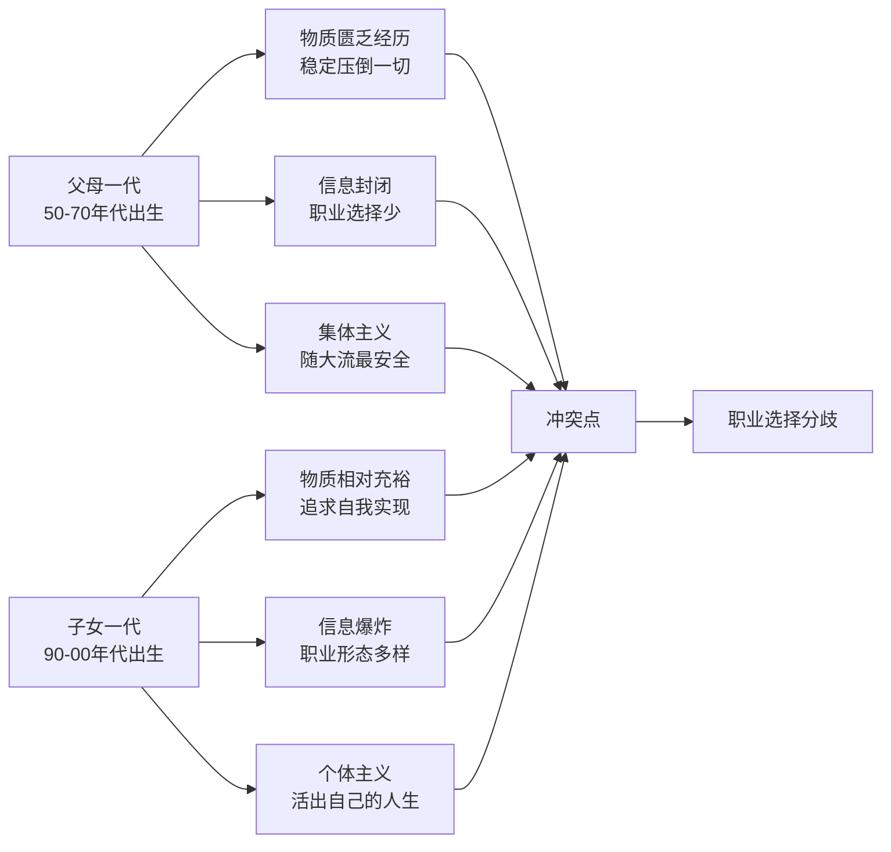
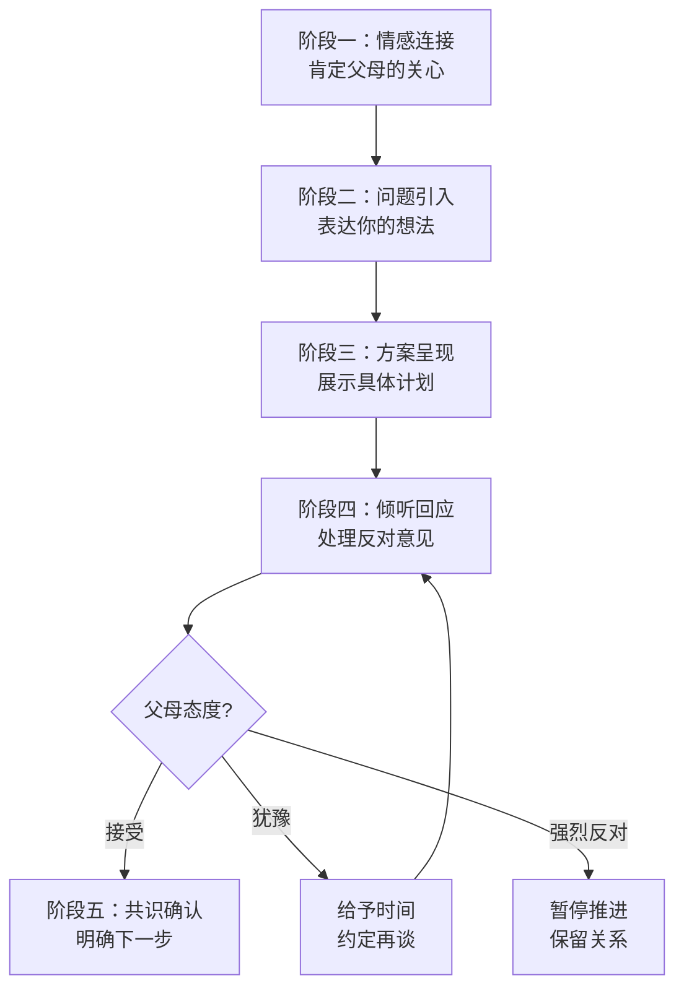
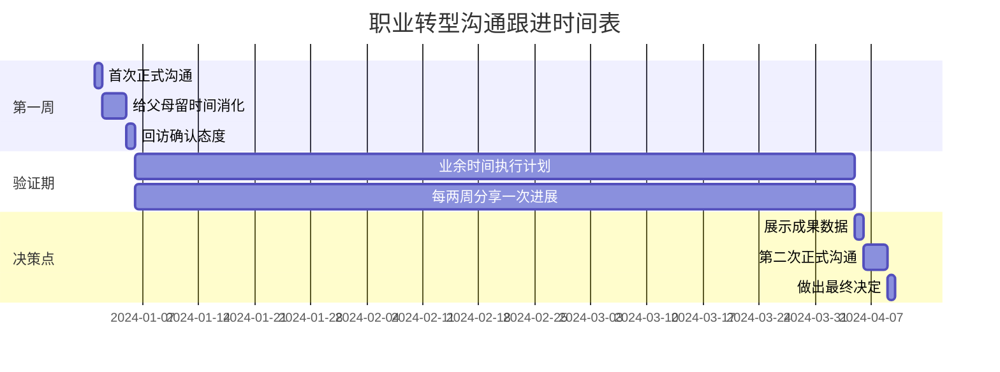
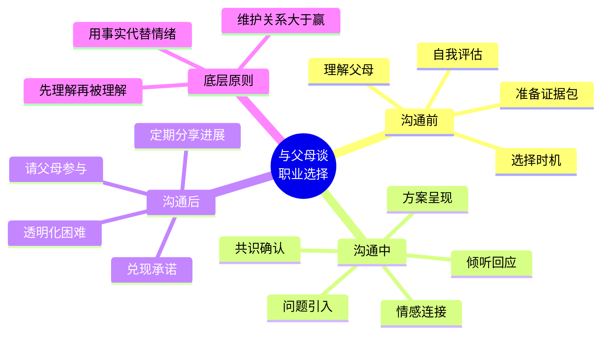

## 案例三：家人沟通——与父母讨论职业选择

与父母讨论职业转型，是中国家庭中最常见也最棘手的沟通场景之一。它牵涉代际价值观冲突、经济安全感、面子文化、控制与独立的博弈等多重因素。本案例从心理学原理出发，逐步拆解沟通的完整链路：从前期准备、现场对话、冲突应对到后续跟进，帮助你在尊重父母的前提下争取自己的职业选择权。

### 为什么这件事这么难？——代际职业冲突的心理根源

在动手沟通之前，先理解"为什么父母会反对"。这不是简单的"思想落后"，而是深层心理机制在起作用。

#### 父母反对的五层心理动因

| 层级 | 动因 | 表现 | 底层需求 |
|------|------|------|----------|
| 安全焦虑 | 对不确定性的恐惧 | "创业会饿死的" | 希望子女衣食无忧 |
| 沉没成本 | 对已有投入的执着 | "我们花了多少钱培养你" | 希望投入有回报 |
| 社会比较 | 面子和攀比心理 | "你表哥在银行多体面" | 希望在亲友中有面子 |
| 经验投射 | 用自己的时代经验套用 | "我们那会儿铁饭碗最重要" | 希望子女少走弯路 |
| 控制惯性 | 对子女决策权的不舍 | "你还小，不懂社会" | 习惯了替孩子做决定 |

理解这五层动因，你的沟通策略就不会停留在"说服"层面，而是能针对父母的真实需求给出回应。这是"先理解，再被理解"的核心原则。

#### 代际价值观差异的结构性原因

关键认知：父母的反对不是"不爱"，恰恰是因为"太爱"——只是他们表达爱的方式和你期望的不一样。带着这个认知去沟通，态度自然会从对抗变为合作。

### 沟通前的四项准备工作

准备工作做不好，现场沟通一定翻车。以下是必须在开口之前完成的四件事。

#### 第一项：自我评估——你真的准备好了吗？

在跟父母谈之前，先对自己做一次诚实的拷问。这不是为了说服父母，而是为了确认你自己的决策质量。

**职业转型自检清单：**

1. **动机检验**：你是"逃离痛苦"还是"奔向热爱"？如果只是受不了当前工作的无聊，换一份工作就能解决，不必冒创业风险。
2. **能力检验**：你是否已经在目标领域有可验证的成绩？比如自媒体账号粉丝数、单篇阅读量、变现记录。
3. **财务检验**：你有多少个月的生存储备金？没有收入的情况下能撑多久？（建议至少6个月）
4. **风险检验**：最坏的情况是什么？你能否承受？有没有退路？
5. **时间检验**：你计划用多长时间验证这个方向？如果验证失败，回归原来赛道的成本有多大？

如果你在自检中发现明显漏洞，先补漏洞再跟父母谈。带着一份千疮百孔的计划去沟通，只会给父母更多反对的理由。

#### 第二项：理解父母——做一次"用户调研"

把沟通当作一次产品推介，父母就是你的"用户"。你需要了解他们的"痛点"和"需求"。

**具体做法：**

- **回忆过往对话**：父母在什么情境下表达过对你职业的期望？他们最担心的具体是什么——是收入？是社会地位？是稳定性？还是你在亲友面前的"面子"？
- **观察参照对象**：他们经常提起谁家的孩子？那些孩子的情况为什么让他们满意？这能帮你精准定位父母的核心评判标准。
- **侧面试探**：在正式沟通前，可以先聊一些相关话题，比如"最近看到一个做自媒体的博主，一年赚了几百万"，观察父母的反应和评论，收集他们的态度信号。

#### 第三项：准备"证据包"

父母最怕的是"空口白话"。你需要准备一个具体的、可量化的、有退路的方案，就像给投资人做路演一样。

**证据包的核心组件：**

| 组件 | 内容 | 作用 |
|------|------|------|
| 市场数据 | 目标行业的规模、增长趋势、头部从业者收入 | 证明这不是"胡闹" |
| 个人成绩 | 你已经做出的具体成果（粉丝数、收入截图、作品链接） | 证明你有能力 |
| 详细计划 | 分阶段目标、时间表、关键里程碑 | 证明你有章法 |
| 财务方案 | 储备金、收入预期、成本预算、止损线 | 证明你不会饿死 |
| 退路方案 | 如果失败，你的Plan B是什么 | 降低父母的恐惧 |
| 风险对冲 | 可以先不辞职，业余时间先做，用结果说话 | 给父母安全感 |

#### 第四项：选择时机和场景

时机和场景对沟通结果的影响，可能比内容本身还大。

**好的时机：**
- 父母心情好、不疲惫的时候（比如周末饭后）
- 你自己也有好状态、情绪稳定的时候
- 没有其他家庭矛盾或压力的时候

**坏的时机：**
- 父母刚吵完架或工作不顺的时候
- 你自己刚受了委屈、情绪上头的时候
- 家里有亲戚在场的时候（面子压力会让对话变形）
- 逢年过节饭桌上（话题会被其他因素干扰）

**场景选择：**
- 一对一分别谈，比三个人一起谈更容易。先跟相对开明的那一方谈，争取"内部盟友"。
- 在家里谈，比在外面谈更放松。但如果家里氛围紧张，可以选择一个安静的咖啡馆。
- 面对面谈，不要用微信或电话。文字容易误读，电话缺少非语言信号。

### 沟通现场：完整对话脚本与分步拆解

下面是完整的沟通流程，分为五个阶段。每个阶段都有具体的话术示范和原理解释。

#### 阶段一：情感连接（3-5分钟）

目标：让父母感到被尊重、被理解，降低防御心理。

**示范话术：**

> "爸妈，我想跟你们聊聊我工作的事。这两年你们一直很支持我，我心里很感激。我知道你们希望我稳定、有保障，这都是为我好，我都明白。"

**原理解析：**
- 开门见山说明主题，不让父母猜来猜去增加焦虑
- 先表达感谢和理解，满足父母的"被尊重"需求
- 不是要"说服"他们，而是"邀请"他们进入一个共同的议题

**常见错误：**
- ❌ 一上来就抱怨现在的工作有多差（这会让父母觉得你是在发牢骚）
- ❌ 一上来就说"我要辞职"（跳过情感铺垫，直接引爆冲突）
- ❌ 用"你们不懂"开场（否定对方，立刻制造对立）

#### 阶段二：问题引入（2-3分钟）

目标：自然地引出你想讨论的议题，而不是突然"扔炸弹"。

**示范话术：**

> "我在国企这两年，工作上手之后，一直在思考自己真正想做什么。我发现我对内容创作特别有热情，也花了不少业余时间在研究和实践。现在取得了一些初步的成绩，想跟你们商量一下，看看你们觉得怎么样。"

**关键技巧：**
- 用"一直在思考"而不是"我突然想到"——前者显示深思熟虑，后者显示冲动
- 用"想跟你们商量"而不是"我决定"——前者是邀请参与，后者是单方面通知
- 提到"初步的成绩"——为后续证据展示埋下伏笔

#### 阶段三：方案呈现（10-15分钟）

目标：用具体的、可量化的、有退路的方案取代空洞的"我想做XX"。

**示范话术：**

> "我先给你们看看我这段时间做的东西。（拿出手机展示账号和数据）我做这个账号已经六个月了，现在有两万粉丝，上个月的广告收入是3200块。虽然不多，但趋势是在增长的。
>
> 我的计划是这样的：接下来三个月，我继续在国企上班，业余时间做内容。如果三个月后，月收入能稳定在8000以上，我就考虑全职做。如果达不到，我就不辞职，继续在国企好好干。
>
> 我算了一笔账：我现在的存款有六万块，加上三个月的工资，就算完全没有收入，我也能撑一年。但我的目标是半年内实现收支平衡。
>
> 我还做了一个详细的计划表，你们可以看看，帮我提提意见。"

**这个话术为什么有效：**

| 要素 | 作用 |
|------|------|
| 展示已有成绩 | 证明这不是"空想"，已经有了初步验证 |
| 设定明确门槛 | "月入8000"是一个可衡量的标准，不是"我觉得行就行" |
| 限定验证时间 | "三个月"给父母一个明确的等待期 |
| 给出退路 | "达不到就不辞职"消除父母最担心的"万一失败怎么办" |
| 展示财务准备 | "六万存款能撑一年"证明你不会饿死 |
| 邀请参与 | "帮我提提意见"让父母从"反对者"变成"参与者" |

#### 阶段四：倾听回应（时间不限）

目标：认真听父母的担忧，逐一回应，而不是急于反驳。

这是整个沟通中最关键的阶段。大部分人在前三步做得不错，到了第四步就崩了——因为父母一反对，情绪就上来了。

**父母常见的反对意见及回应策略：**

**反对一："自媒体不稳定，铁饭碗丢了就没了"**

> 回应："你们说得对，稳定性确实很重要。所以我没有冲动辞职，我的计划是先用业余时间验证。如果三个月内达不到目标，我就不动。而且国企的合同是可以续签的，我不会主动放弃这个保障。"

**反对二："你才工作两年，经验不够"**

> 回应："确实，我在职场上的经验还比较浅。但自媒体创业跟在公司上班不一样，它更看重内容能力和对用户需求的理解。这方面我已经做了六个月的实践，有一些自己的积累。当然，我也知道自己还有很多不足，所以才想跟你们商量，听取你们的意见。"

**反对三："你表哥在银行多好，你怎么不学学"**

> 回应："表哥确实很优秀。但每个人适合的路不一样。我在国企这两年，说实话并不是不开心，但也没有那种每天起来充满干劲的感觉。我想趁年轻试试自己真正热爱的事情，就算失败了，我也有退路。"

**反对四："我们花了那么多钱培养你，你就这么糟蹋？"**

> 回应："我从来没有忘记你们的付出。正因为如此，我才不想在一份自己没有热情的工作上混一辈子。我想用你们培养出来的能力，去做一件我真正全力以赴的事情。这不是糟蹋，这是不让你们的心血白费。"

**反对五："你还小，不懂社会"**

> 回应："你们说得对，我确实还有很多不懂的地方。所以我的计划里设置了很多安全阀——止损线、时间限制、收入门槛。我不会一头扎进去不管不顾。而且，我遇到拿不准的问题，一定会回来跟你们商量。"

**回应反对意见的核心原则：**

1. **先认同再回应**：每一条回应都以"你说得对""确实"开头，先满足对方被尊重的需求
2. **用事实说话**：不要争辩"你不懂"，而是用数据和计划来回应担忧
3. **承认不确定性**：不要说"肯定能成功"，而是说"我会设置安全阀"
4. **保持开放**：始终保留"我愿意继续讨论"的姿态

#### 阶段五：共识确认与后续跟进

**如果父母基本接受：**

> "谢谢爸妈的支持。那咱们说好了：接下来三个月我继续在国企上班，业余时间做内容。三个月后咱们再坐下来聊聊进展，如果达到了目标，我们就一起商量下一步怎么走。你们觉得这个节奏可以吗？"

**如果父母还在犹豫：**

> "我理解你们还需要时间考虑。这样吧，我把计划表留在家里，你们有空的时候看看。咱们下周这个时候再聊一次，你们有什么问题随时可以问我。"

**如果父母强烈反对：**

> "我理解你们的担心，今天先不急着做决定。我知道你们反对我也是因为爱我。我先继续现在的工作，但我想请你们给我一个机会，让我证明自己的想法。咱们先不说辞职的事，我先把业余时间的成绩做出来，到时候咱们再谈，好不好？"

### 不同父母类型的应对策略

父母的性格和沟通风格各不相同，需要针对性调整策略。

#### 控制型父母

**特征**：习惯为子女做决定，经常说"我吃的盐比你吃的米多""听我的没错"。

**应对策略：**
- 不要正面挑战他们的权威，而是用"请教"的姿态
- "爸/妈，你经验丰富，帮我看看这个方案有没有什么漏洞？"
- 给他们一个"审批者"的角色，而不是"被通知者"
- 如果他们提出合理的修改意见，采纳并表示感谢——这会增加他们对你整体方案的接受度

#### 焦虑型父母

**特征**：容易往最坏的方向想，经常说"万一怎么办""外面太危险了"。

**应对策略：**
- 用具体数字和退路方案降低他们的焦虑
- 强调"安全阀"：止损线、时间限制、Plan B
- 不要试图消除焦虑（那不可能），而是帮他们把焦虑"框定"在一个可控范围内
- 可以给他们一个小任务，比如"帮我留意一下这个行业的情况"——参与感能缓解焦虑

#### 面子型父母

**特征**：非常在意别人怎么看，经常说"你让我怎么跟亲戚说""别人家的孩子都..."。

**应对策略：**
- 找到他们在意的"面子"标准，用你的方案满足它
- 如果他们在意"别人家孩子"，就找一个做自媒体成功且受人尊敬的案例
- "爸妈，现在很多名校毕业生都在做自媒体，这是一个受人尊敬的行业"
- 如果可能，带他们见一个你认识的、做这行且"体面"的人

#### 放任型父母

**特征**：不太管你，或者口头说"随便你"但心里其实有想法。

**应对策略：**
- 不要因为他们说"随便你"就真的不沟通了
- 主动征求他们的意见，让他们感到被需要
- "虽然你们说随便我，但这件事对我来说很重要，我真的很想听听你们的想法"

### 沟通后的跟进工作

沟通不是一次性的事件，而是一个持续的过程。

#### 跟进时间表

#### 持续沟通的要点

1. **定期分享进展**：不要等到三个月后才汇报。每两周主动分享一次成绩（哪怕很小），让父母看到你在认真执行计划。
2. **透明化困难**：遇到挫折不要隐瞒，主动跟父母说"这周数据不太好，我分析了原因，调整了策略"。这比报喜不报忧更能建立信任。
3. **请父母帮忙**：如果父母有能力帮到你（比如转发你的内容、给你介绍潜在客户），主动请求他们的帮助。这会让他们从"旁观者"变成"参与者"，支持度会大幅提升。
4. **兑现承诺**：你承诺了"达不到目标就不辞职"，就必须真的做到。一次失信，未来的沟通成本会翻倍。

### 常见错误与纠正方法

| 错误 | 为什么错 | 正确做法 |
|------|----------|----------|
| 用微信发长文告知决定 | 文字缺少语气和表情，容易被误读为"通知" | 面对面沟通，先试探态度 |
| 一上来就说"我要辞职" | 跳过铺垫，直接引爆冲突 | 先聊职业思考，再引出具体想法 |
| 带着"我要说服你"的心态 | 制造对立关系，父母会更加防御 | 带着"我想和你商量"的心态 |
| 只谈理想不谈钱 | 父母最关心的往往是经济安全 | 把财务方案作为重点呈现 |
| 拿成功案例说"别人能做到我也能" | 幸存者偏差，父母会举反例反驳 | 用自己的数据和计划说话 |
| 父母一反对就急了 | 情绪化会破坏之前的所有铺垫 | 深呼吸，把反对当作"需要回应的提问" |
| 沟通完就不提了 | 父母会觉得你只是一时冲动 | 持续分享进展，建立长期信任 |
| 跟父母赌气"你们不支持我也要做" | 伤害亲子关系，而且未必能做到 | 给父母时间，用结果说话 |

### 进阶：当常规沟通无效时

如果你做了所有准备工作，用对了方法，父母依然坚决反对，怎么办？

#### 重新评估你的方案

在认为"父母太固执"之前，先检查你的方案是否有漏洞。也许父母的反对意见中包含你忽略的合理风险。请一个你信任的、有经验的第三方（比如你的导师、前辈）帮你评估方案。

#### 分步推进策略

不要试图一次性解决所有问题。把"全职做自媒体"这个大目标拆成小步骤：

1. **第一步**：获得父母同意，你可以在业余时间做（几乎不需要父母"同意"，但告知是尊重）
2. **第二步**：用3-6个月做出可验证的成绩
3. **第三步**：用成绩跟父母谈下一步（减少工作时间、兼职等过渡方案）
4. **第四步**：在持续获得成绩的基础上，再谈全职转型

每一步都是一个独立的"小沟通"，成功率远高于一次性要求"大跃进"。

#### 接受代际沟通的局限性

有些情况下，父母可能永远不会完全支持你的选择。这不是沟通技巧的问题，而是价值观差异的边界。在这种情况下：

- 你可以选择"先做再说"——用结果代替语言
- 但要保持对父母的情感连接，不要因为职业分歧伤害亲子关系
- 告诉他们："我知道你们不完全同意，但我希望你们知道，不管我做什么选择，你们永远是我最重要的人"

### 沟通自检清单

在正式跟父母谈之前，用这个清单做最后一次检查：

- [ ] 我已经完成了自我评估，确认自己的方案经得起推敲
- [ ] 我了解父母的核心担忧是什么（不只是猜测）
- [ ] 我准备了具体的数据、计划和退路方案
- [ ] 我选择了一个合适的时机和场景
- [ ] 我的情绪状态稳定，不会一被反对就失控
- [ ] 我的心态是"商量"而不是"说服"
- [ ] 我准备好了倾听父母的反对意见，而不是急于反驳
- [ ] 我有后续跟进的计划，不会沟通完就不管了
- [ ] 我已经做好了"父母可能不接受"的心理准备
- [ ] 我的核心目标是维护亲子关系，而不是"赢"这场对话

### 核心要点回顾

与父母讨论职业选择，本质上不是一场"辩论赛"，而是一次"家庭合作"。你的目标不是证明父母是错的，而是邀请他们一起参与到你的职业决策中来。当你把父母从"对手"变成"队友"，很多看似无解的分歧，都会找到出路。
