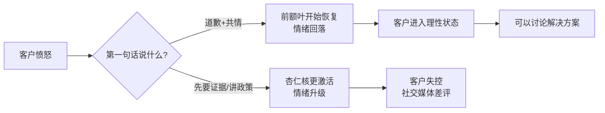
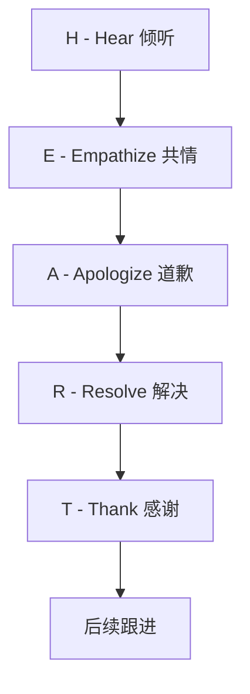
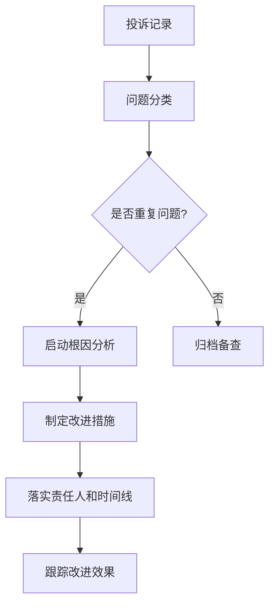
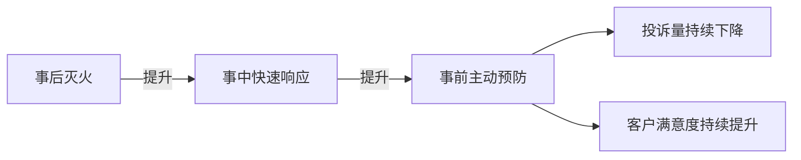

## 案例四：客户沟通——处理客户投诉

客户投诉是商业沟通中最具挑战性的场景之一。处理得当，投诉客户会变成最忠诚的品牌拥护者；处理失当，一个愤怒的客户可以摧毁数百万的营销投入。本案例从心理学原理出发，系统拆解客户投诉处理的完整方法论。

### 客户投诉的心理学基础

#### 投诉背后的真实需求

客户投诉时，表面上是在反馈产品或服务问题，实际上传递了三层信号：

| 层级 | 信号 | 客户内心独白 | 占比 |
|------|------|-------------|------|
| 表层 | 事实层——具体发生了什么 | "商品破损了" | 20% |
| 中层 | 情绪层——感受被忽视或欺骗 | "你们不在乎我的体验" | 50% |
| 深层 | 关系层——这段关系还值得继续吗 | "我要不要换一家" | 30% |

大多数客服人员只关注表层事实（"请问具体是什么问题？"），却忽略了客户50%的注意力放在情绪层——**他们需要先被听见、被理解，然后才愿意解决问题**。

#### 情绪脑优先原则

神经科学研究表明，人在愤怒时杏仁核高度激活，前额叶皮层（负责理性思考）活动被抑制。这意味着：

- 愤怒的客户**听不进道理**，直到情绪被安抚
- 先讲政策、先要证据 = 对着一个情绪脑在说话，信息被过滤掉
- 正确顺序：**先激活对方的前额叶（安抚情绪）→ 再传递理性信息（解决方案）**

#### 投诉处理的"峰终定律"

诺贝尔奖得主丹尼尔·卡尼曼提出的峰终定律指出，人对一段经历的记忆取决于**高峰时刻**和**结束时刻**的感受，而非整体平均值。应用到投诉处理：

- **高峰时刻**：第一次收到你的回应（必须足够真诚、有力）
- **结束时刻**：问题解决后的最后一句话（必须让客户感到被重视）

即使过程中有些波折，只要这两个时刻处理好，客户最终的满意度仍然会很高。

### HEART投诉处理模型

基于心理学原理，我们建立一个可复制的投诉处理框架：

#### 第一步：Hear——全身心倾听

**目标**：让客户把话说完，不打断、不辩解、不抢话。

**具体做法**：

1. **保持沉默**：客户发泄时，不要插入任何反驳。即使客户说错了事实，也不要立刻纠正。
2. **积极回应**：用简短的语言表示你在听——"我理解"、"您说得对"、"这确实不应该发生"。
3. **记录关键点**：客户提到的具体问题、时间线、诉求，一一记下。
4. **确认理解**：客户说完后，用自己的话复述一遍："我确认一下，您遇到的情况是……对吗？"

**常见错误**：

- ❌ 客户还没说完就急着解释："其实我们产品的设计是……"
- ❌ 反问质疑："您确定是正常使用坏的吗？"
- ❌ 打断："好的好的，我知道了，您直接说要怎么处理吧。"

#### 第二步：Empathize——深度共情

**目标**：让客户感觉到"这个人懂我"。

**共情公式**：感受 + 理解 + 正常化

| 组件 | 说明 | 示例 |
|------|------|------|
| 感受 | 说出客户的感受 | "我完全理解您的心情" |
| 理解 | 具体描述你理解了什么 | "花了钱买到有问题的商品，换谁都会生气" |
| 正常化 | 让客户觉得他的反应是正常的 | "您的反应完全可以理解，换了我也会这样" |

**关键原则**：

- 共情≠同意客户的所有说法。你可以理解他的感受，而不必认同他的判断。
- 用"我理解"而不是"我理解你的感受"——后者听起来像模板话术。
- 避免说"您冷静一下"——这句话的效果恰恰相反。

#### 第三步：Apologize——真诚道歉

**目标**：承担责任，不找借口。

**有效道歉的结构**：

承认事实 + 表达歉意 + 承认影响 + 表达重视

**示例对比**：

| 等级 | 道歉方式 | 效果 |
|------|---------|------|
| 无效 | "对不起给您带来不便" | 客户觉得在敷衍 |
| 及格 | "很抱歉商品出现了质量问题，给您带来了不好的体验" | 客户觉得在走流程 |
| 良好 | "张先生，真的很抱歉。您是我们的老客户了，收到有问题的商品，这种失望感我完全理解" | 客户开始感受到诚意 |
| 优秀 | "张先生，这件事完全是我们的责任。您选择相信我们，我们却没有做到，这比商品本身的问题更让我觉得抱歉" | 客户情绪明显缓和 |

**避雷**：

- ❌ "抱歉，但是……"——"但是"后面的内容会否定前面的道歉
- ❌ "我们也很为难"——把焦点从客户转到了自己身上
- ❌ "这不是我们的问题，是物流/厂家的错"——客户不关心谁的错，他找的是你

#### 第四步：Resolve——解决+超预期

**目标**：解决问题并提供超出预期的补偿。

**解决的三个层次**：

| 层次 | 做法 | 客户感受 |
|------|------|---------|
| 基本层 | 退换货/维修 | "这是应该的" |
| 满意层 | 快速处理+合理补偿 | "处理得还不错" |
| 超预期层 | 快速处理+超额补偿+后续关怀 | "这家真的在乎客户" |

**具体做法**：

1. **给出选择而非等待**："我给您准备了两个方案，您看哪个更方便？"——而不是"我们会尽快处理，请您等待。"
2. **时间承诺要保守**：能做到24小时内解决的，说48小时。超预期的惊喜远好过超预期的失望。
3. **补偿要超预期**：客户预期退换货，你额外给优惠券；客户预期等3天，你1天就寄到。
4. **首次联络解决率（FCR）**：尽量在第一次沟通中解决问题，避免让客户反复联系。

**超预期补偿的设计原则**：

- 补偿金额 ≈ 客户损失的 1.2-2 倍
- 补偿形式优于现金：专属优惠券、VIP升级、赠品 > 直接返现（因为优惠券能带来二次消费）
- 补偿要有"个性化感"：说"我专门为您申请的"比"这是我们标准流程"效果好10倍

#### 第五步：Thank——真诚致谢

**目标**：把投诉转化为正向关系资产。

**具体话术**：

- "感谢您花时间告诉我们这个问题，这帮助我们改进了产品/服务。"
- "感谢您的耐心和理解，有什么问题随时联系我，我叫小李，工号是XX。"
- "真的很感谢您给我们改进的机会。"

**为什么感谢很重要**：

大多数遇到问题的客户**直接走人，从不投诉**。根据美国消费者研究，每1个投诉的客户背后，有26个不满意的客户选择了沉默离开。愿意投诉的客户，实际上是在给你一次挽回的机会——值得感谢。

### 不同场景的处理策略

#### 场景一：质量投诉（商品损坏/功能异常）

**典型情况**：客户收到的商品有明显质量问题，要求退换。

**处理要点**：

1. 不要要求客户反复提供证据（照片一次即可，不要反复追问角度、光线等）
2. 立即给出方案（换货/退款），不要让客户等待审核
3. 如果需要寄回，安排上门取件而非客户自行寄送
4. 补偿方案：换货+小额优惠券，或退款+下次购买折扣

#### 场景二：服务态度投诉

**典型情况**：客户对某位员工的服务态度不满，要求投诉。

**处理要点**：

1. 绝对不要为同事辩解——"他可能是说话方式不太好，但本意是好的"这类话只会火上浇油
2. 道歉后明确表态："这是我们服务标准的问题，我们内部一定会严肃处理。"
3. 事后确实要内部跟进，但不需要向客户详细说明内部处分措施
4. 补偿方案：升级服务等级 + 专项优惠

#### 场景三：物流/配送投诉

**典型情况**：包裹延迟、错发、丢件。

**处理要点**：

1. 不要推给物流方——客户找的是你，不是快递公司
2. 立即查看物流状态，主动告知进展
3. 如果是丢件或严重延迟，直接补发，不要等物流方确认
4. 补偿方案：补发 + 物流延误补偿券

#### 场景四：价格/促销争议

**典型情况**：刚买完就降价，或优惠券没用上。

**处理要点**：

1. 不要说"活动规则写得很清楚"——即使是客户没看清规则，你的体验就输了
2. 在合理范围内主动补差价或发放等值优惠券
3. 对于老客户或高价值客户，可以灵活处理
4. 补偿方案：差价返还或等值积分 + 下次购买优先通知促销信息

#### 场景五：恶意投诉/职业索赔

**典型情况**：部分客户以投诉为手段索取不正当利益。

**识别信号**：

- 要求远超实际损失的赔偿金额
- 以"发到网上"、"找媒体"为威胁要挟
- 多次以不同理由投诉并要求赔偿
- 提供的"证据"存在明显疑点

**处理原则**：

1. 保持专业冷静，不被威胁激怒
2. 按公司政策合理处理，不因为威胁就无底线让步
3. 保留完整沟通记录（截图、录音）
4. 必要时升级至法务部门处理
5. 不要在公开场合与对方争论

### 不同沟通渠道的处理差异

| 渠道 | 优势 | 劣势 | 重点策略 |
|------|------|------|---------|
| 电话 | 可以感知语气，实时互动 | 客户可能情绪激动口不择言 | 语气平稳、语速适中、多用"我理解" |
| 微信/在线客服 | 有思考时间，可发送图文 | 文字容易被误解语气 | 多用语气词、发送解决方案截图、避免简短回复 |
| 社交媒体公开投诉 | 影响范围大，其他客户在看 | 无法私密沟通 | 先公开回复表示重视，再引导私聊解决 |
| 邮件 | 有完整记录，适合复杂问题 | 响应慢，客户焦虑 | 24小时内首次回复，抄送相关负责人 |

**微信/文字沟通的特殊注意事项**：

- 不要只回复"好的"、"收到"——客户会觉得你敷衍
- 每次回复包含实质内容：进展更新、方案说明、时间承诺
- 善用分段和编号，让信息结构清晰
- 适当使用emoji缓和气氛，但不要过度（在客户愤怒时不要用微笑表情）

### 对话剧本：从冲突到和解

#### 完整对话示例

**背景**：VIP客户收到有质量问题的商品，在微信上投诉。

> **客户**："你们卖的什么东西！质量太差了！我要退货退款！还要投诉你们！"

> **客服**："张先生，非常抱歉给您带来了这样的体验。您是我们的VIP老客户了，出了这样的问题，我比您更着急。您先消消气，我马上帮您处理。能麻烦您拍几张照片发给我吗？"

> **客户**：（发送照片）"你看，这里明显是破损的！这种东西怎么发出来的？"

> **客服**："确实不应该出现这种情况，这是我们的品控失误。张先生，我现在给您两个方案：第一，我立刻安排补发一件全新的，明天就能到；第二，全额退款，运费我们承担。不管您选哪个方案，我额外为您申请一张200元的优惠券，作为我们的一点心意。您看哪个方案更合适？"

> **客户**："那就换一个吧，希望新的别再出问题了。"

> **客服**："您放心，我会让仓库专门检查后再发出。我先帮您把优惠券充到账户里了，您下次购物可以直接用。如果后续有任何问题，随时联系我，我叫小李，工号8023，随时为您服务。再次感谢您的理解🙏"

#### 错误示范与对比

**错误版本**：

> **客服**："您好，我们的产品都是经过质检的。请问您能提供一下照片吗？另外，我们的退货政策是7天内……"
>
> **客户**："你的意思是我故意找茬？我要发到网上让大家评评理！"
>
> **客服**："我没有这个意思。但是按照规定，我们需要核实情况……"

**问题拆解**：

| 错误做法 | 客户感受 | 正确做法 |
|---------|---------|---------|
| "产品经过质检" | "他在质疑我说谎" | 不要先解释，先安抚 |
| "请问您能提供照片吗" | "你在找借口推卸" | 用"麻烦"而非"请问"，说明用途 |
| "退货政策是7天内" | "他还没听我说完就搬规定" | 先听完再提方案 |
| "按规矩需要核实" | "又要走流程了" | 主动给出方案，不要让客户等 |

### 处理后的跟进与复盘

投诉处理不是在"客户说OK"那一刻就结束了。后续跟进决定了客户是"被挽回"还是"被挽回后再次流失"。

#### 24小时跟进

- 发送确认消息：确认问题已解决，询问是否还有其他需要
- 如果是换货，告知物流信息和预计到达时间

#### 7天回访

- 确认新商品使用正常
- 询问整体体验是否满意
- 再次表达感谢

#### 内部复盘

每次投诉都应该进入内部复盘流程：

**复盘内容**：

- 投诉的根本原因是什么（产品、流程、人员、沟通？）
- 同类投诉是否频繁出现
- 处理过程中有没有可以优化的环节
- 客户最终满意度如何

### 常见误区与纠正

#### 误区一："客户永远是对的"

这句话的本意是"要尊重客户的感受"，不是说客户的每个诉求都要无条件满足。

**纠正**：客户的情绪是真实的，但诉求可以是有弹性的。你可以在情绪上100%共情，在方案上寻求双赢。

#### 误区二：道歉就是认输

很多人觉得道歉等于承认错误，会带来更多麻烦。

**纠正**：研究表明，及时道歉反而能降低法律风险。哈佛商学院的研究发现，医院中主动披露医疗事故的科室，被起诉的概率比隐瞒事故的科室低50%以上。

#### 误区三：用折扣代替真诚

有些客服习惯性地发放优惠券了事，从不真正倾听客户的问题。

**纠正**：补偿是锦上添花，不是雪中送炭。如果客户觉得你根本没听他说什么，再大的折扣也留不住他。

#### 误区四：投诉处理越快越好

速度确实重要，但"快速"不等于"草率"。

**纠正**：客户宁愿等30分钟得到一个周全的方案，也不愿等3分钟得到一个敷衍的回答。关键是**让客户知道你在处理**——"我正在帮您核实，请给我5分钟"比沉默等待好100倍。

#### 误区五：避免负面情绪

有些客服试图用积极语言掩盖问题："其实这个问题不影响使用哦~"

**纠正**：客户的问题是真实的，不要试图"降级"他的困扰。承认问题的严重性，客户反而更容易接受后续方案。

### 赋权一线：让客服能解决问题

投诉处理质量的70%取决于**一线客服是否有权限解决问题**。

| 授权层级 | 客服权限 | 效果 |
|---------|---------|------|
| 无授权 | "我需要请示领导" | 客户等待，情绪升级 |
| 部分授权 | 500元以内可直接处理 | 大部分问题即时解决 |
| 充分授权 | 2000元以内+特殊方案可直接决策 | 绝大多数投诉首次联络解决 |

**赋权建议**：

- 设定明确的授权范围和金额上限
- 超出权限的，提供快速升级通道（而非让客户等待）
- 定期复盘授权使用情况，优化规则
- 对于明显是公司责任的情况，给予更大的处理灵活性

### 数字化工具与效率提升

| 工具类型 | 功能 | 适用场景 |
|---------|------|---------|
| CRM系统 | 记录客户历史、投诉记录、偏好 | 每次沟通前快速了解客户背景 |
| 工单系统 | 投诉流转、进度跟踪、SLA监控 | 确保每个投诉都有跟进、不遗漏 |
| 知识库 | 常见问题解答、标准话术、解决方案模板 | 新客服快速上手，减少培训成本 |
| 舆情监测 | 社交媒体关键词监控 | 及时发现公开投诉，在发酵前处理 |
| 情绪分析工具 | 分析客户文字/语音中的情绪状态 | 高情绪值投诉自动升级优先级 |

### 进阶：从处理投诉到预防投诉

最高水平的投诉处理是**让投诉不发生**。

**预防策略**：

1. **主动告知**：物流延迟、系统故障等问题，不要等客户来问，主动发送通知和致歉
2. **首单关怀**：新客户首次购买后24小时内主动询问使用体验
3. **预警机制**：监控产品质量数据，批次问题在大规模投诉前就启动召回
4. **客户反馈闭环**：让投诉过的客户参与产品改进，让他们看到自己的声音被听见
5. **服务补救悖论**：研究发现，经历过问题但被完美解决的客户，满意度甚至高于从未遇到问题的客户——所以偶尔的小问题加上完美的补救，反而是建立忠诚度的机会

### 自检清单

每次处理完一个投诉，用这张清单自检：

- [ ] 我是否在客户说完之前保持了倾听？
- [ ] 我的第一句话是安抚情绪还是解释原因？
- [ ] 我是否表达了真诚的共情，而非模板化的话术？
- [ ] 我的道歉是否包含了"但是"？
- [ ] 我是否给出了解决方案而不仅是"我们会处理"？
- [ ] 解决方案是否超出了客户的预期？
- [ ] 我是否把选择权交给了客户？
- [ ] 最后一句话是否让客户感到被重视？
- [ ] 我是否安排了后续跟进？
- [ ] 这个投诉是否需要进入内部复盘流程？

***

**本节核心**：客户投诉的本质不是"出了问题"，而是"关系出现了裂痕"。处理投诉的目标不是"解决问题"，而是"修复并加强关系"。一个被完美处理的投诉，比一次顺利的购买更能建立客户忠诚度。先处理情绪，再处理问题——这个顺序永远不能颠倒。
