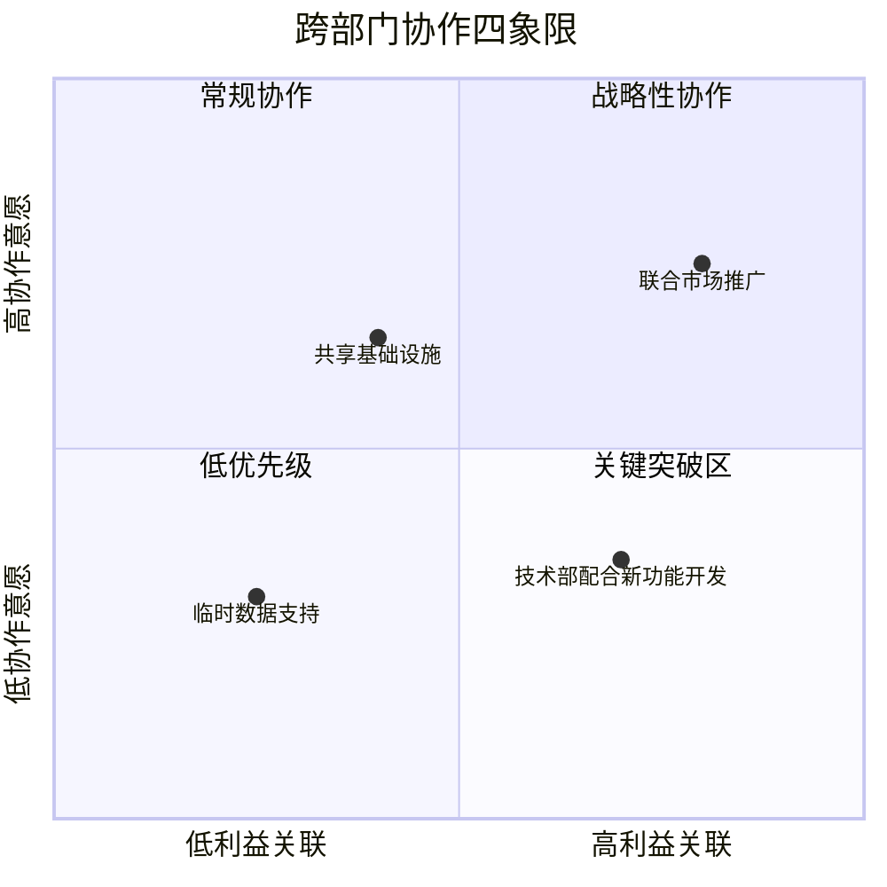
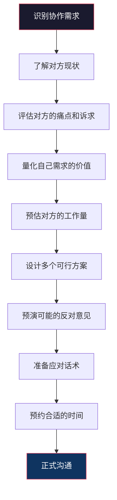
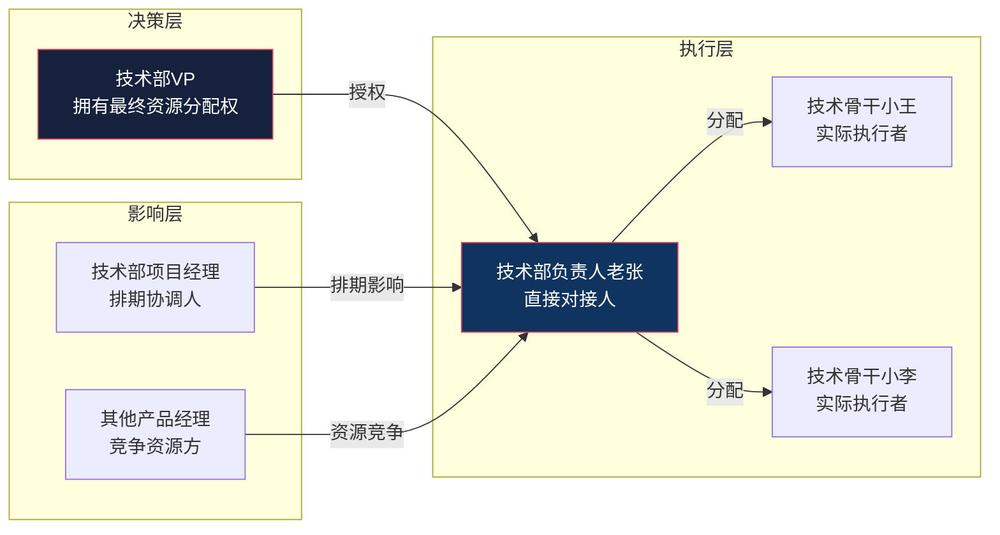
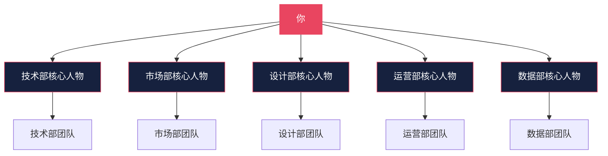

## 案例五：团队沟通——推动跨部门协作

跨部门协作是组织中最常见也最具挑战性的沟通场景。不同部门拥有不同的目标、节奏、语言体系和利益诉求，这些差异天然地制造了沟通壁垒。产品经理需要技术部配合，市场部需要产品部支持，运营部需要设计部资源——每一个跨部门需求都可能演变为一场"推皮球"的拉锯战。

本案例以产品经理推动技术部配合开发新功能为主线，系统拆解跨部门沟通的底层逻辑、方法论和实操技巧，帮助你在任何跨部门场景中都能高效推进协作。

---

### 一、为什么跨部门协作如此困难

#### 1.1 组织层面的结构性障碍

跨部门协作困难并非个人能力问题，而是组织结构的必然产物。哈佛商学院教授迈克尔·波特（Michael Porter）在价值链理论中指出，企业的价值活动被分配到不同部门，每个部门优化自身环节，但部门间的衔接处往往是效率最低的"灰色地带"。

| 障碍类型 | 具体表现 | 典型后果 |
|---------|---------|---------|
| 目标冲突 | 技术部追求系统稳定性，产品部追求快速迭代 | 优先级无法达成一致 |
| 信息不对称 | 各部门只了解自己的业务全貌 | 决策依据不一致 |
| 激励不匹配 | 跨部门项目成果难以归属到单一部门的KPI | 缺乏参与动力 |
| 语言壁垒 | 产品说"用户体验"，技术说"技术债务" | 沟通效率低下 |
| 权责模糊 | 跨部门项目没有明确的负责人 | 出了问题互相推诿 |

#### 1.2 心理层面的认知偏差

除了结构性障碍，心理学中的几个认知偏差也在暗中阻碍协作：

- **禀赋效应**：人们对已经拥有的资源（时间、人力、注意力）赋予过高价值，因此对"被借调资源"天然抵触。
- **损失厌恶**：接受跨部门任务意味着放弃当前任务的确定性收益，去追求不确定的协作收益。心理学研究表明，损失的痛苦是同等收益快乐的2-2.5倍。
- **群体内偏好**：人天然倾向于优先帮助"自己人"（同一部门），对外部门的需求给予更低的优先级。
- **归因偏差**：对方拒绝协作时，我们倾向于归因为"不配合"（内部归因），而非"确实有困难"（外部归因）。

理解这些底层机制，不是为了给对方找借口，而是为了找到更有效的沟通策略。

#### 1.3 跨部门沟通的四象限模型

根据**协作意愿**和**利益关联度**两个维度，可以将跨部门协作场景分为四个象限：

本案例属于**高利益关联、低协作意愿**的"关键突破区"——对方有能力但没有动力。这是最难的象限，也是最需要沟通技巧的象限。

---

### 二、错误示范：权威施压的连锁灾难

#### 2.1 完整对话还原

> **你**："这个功能老板已经批了，你们技术部必须在下个月之前做出来。"
>
> **技术部负责人老张**："我们手上已经有5个项目了，实在排不开。"
>
> **你**："那是你们的问题，这个功能很紧急，你们自己想办法。"
>
> **技术部负责人**："那你们产品部自己来写代码吧。"
>
> （关系破裂，项目搁浅。后续每次跨部门沟通，技术部都设置更高的配合门槛。）

#### 2.2 逐句拆解：每句话错在哪里

| 你说的话 | 表面意图 | 实际效果 | 底层问题 |
|---------|---------|---------|---------|
| "老板已经批了" | 借用权威增加说服力 | 对方感到被压服而非被说服 | 用权力代替道理 |
| "你们必须" | 表达紧迫性 | 激发对抗心理 | 命令式语气否定对方自主权 |
| "那是你们的问题" | 划清责任边界 | 将对方推到对立面 | 零和思维，缺乏共赢意识 |
| "你们自己想办法" | 表达自己的立场 | 对方感到不被尊重 | 单方面输出，缺乏倾听 |

#### 2.3 权威施压的三个致命后果

**后果一：短期有效，长期有毒。** 即使对方这次迫于压力配合了，下次他会提前准备好拒绝的理由，甚至主动减少与你的接触。一次"赢了面子"换来的是长期的协作壁垒。

**后果二：破坏信任基础。** 跨部门协作的核心资产是信任。信任的建立需要多次正向互动，但破坏只需要一次冲突。研究表明，负面互动对关系的影响是正面互动的5倍（Baumeister等人，2001年"坏比好更强"研究）。

**后果三：形成负面标签。** 一旦你被贴上"强势""不讲理"的标签，这个标签会在对方部门内部传播。你面对的不再是一个人的抵触，而是一个团队的集体防御。

---

### 三、正确示范：以共赢为核心的协作对话

#### 3.1 完整对话还原

> **你**（提前预约，选择对方不忙的时间段）：
> "老张，有个事情想跟你商量一下。占用你20分钟，方便吗？"
>
> **老张**："你说。"
>
> **你**："我们有一个新功能需求，老板很重视。我知道你们现在任务很重，所以想一起看看有没有办法协调。
>
> 这个功能的核心价值是提升用户留存率，根据我们的数据分析，预计能为公司带来每月30万的额外营收。技术实现上主要是前端交互优化和后端接口调整，工作量预估在200人时左右。
>
> 我想了三个方案供你参考：
> - **方案一**：如果你们能抽出两个人做两周，我们可以先做一个MVP版本，只覆盖核心功能，验证市场反馈后再迭代；
> - **方案二**：我列了你们手上项目的优先级清单，如果把XX项目的二期往后排两周，就能腾出足够的资源；
> - **方案三**：如果实在不行，我们也可以考虑外包一部分非核心模块，但需要你们提供技术指导。
>
> 你觉得哪个方案可行？或者你有更好的想法？"
>
> **老张**："方案一可以考虑，但两周做MVP有风险，能不能把验收标准放宽一些？"
>
> **你**："完全可以。我们先定一个最小验收标准，上线后再根据数据迭代。我现在就去更新需求文档，把MVP范围圈出来，明天给你过目？"

#### 3.2 逐句拆解：每句话好在哪里

| 你说的话 | 沟通策略 | 心理效应 |
|---------|---------|---------|
| "想跟你商量" | 铺垫平等对话的基调 | 降低对方防御心理 |
| "占用你20分钟" | 明确时间边界 | 尊重对方时间，降低参与成本 |
| "我知道你们任务很重" | 先承认对方的困难 | 被理解的感觉激发善意 |
| "核心价值是……30万营收" | 用数据说明价值 | 将感性需求转化为理性判断 |
| "工作量200人时" | 展示你做了功课 | 专业性增加可信度 |
| "三个方案" | 提供选择而非单一要求 | 赋予对方控制感和决策权 |
| "你觉得哪个可行" | 征求对方意见 | 尊重专业判断，激发参与感 |
| "明天给你过目" | 立即推进下一步 | 保持动量，减少拖延 |

#### 3.3 对话背后的准备工作

优秀的跨部门沟通，80%的功夫在对话之前。上述对话看似自然，实则背后有大量的准备工作：

**了解对方现状**：在沟通前，通过非正式渠道（午餐、茶歇、即时消息）了解技术部当前的项目情况、人员配置和压力点。不是为了找把柄，而是为了设计方案时能切合实际。

**量化需求价值**：不要说"这个功能很重要"，要说"这个功能预计提升留存率5%，对应每月30万营收"。模糊的重要性无法打动任何人，具体的数据才有说服力。

**预演反对意见**：提前想好对方可能提出的3-5个反对理由，并为每个理由准备回应。这不是为了"怼回去"，而是为了展示你认真考虑过对方的处境。

---

### 四、跨部门沟通的系统方法论

#### 4.1 SCARF模型：理解对方的心理需求

神经科学家大卫·洛克（David Rock）提出的SCARF模型，揭示了影响人类行为的五个社会性需求：

| 维度 | 含义 | 在跨部门沟通中的体现 | 应对策略 |
|------|------|---------------------|---------|
| **S**tatus（地位） | 感到被尊重和认可 | 对方是否感到自己的专业判断被尊重 | 征求意见而非下达指令 |
| **C**ertainty（确定性） | 对未来有清晰预期 | 对方是否清楚工作范围和时间线 | 提供明确的需求和时间表 |
| **A**utonomy（自主权） | 感到有选择和控制权 | 对方是否能参与方案决策 | 提供多个方案供选择 |
| **R**elatedness（归属感） | 感到是"自己人" | 对方是否感到你们是一个团队 | 使用"我们"而非"你们" |
| **F**airness（公平感） | 感到资源分配公平 | 对方是否觉得协作对双方都公平 | 确保双方都从协作中获益 |

在跨部门沟通中，每一个维度的缺失都可能导致对方的抵触。正确示范之所以有效，正是因为同时满足了这五个维度。

#### 4.2 利益相关者地图：识别所有影响协作的人

跨部门协作往往不只是两个人之间的事。在正式沟通前，需要绘制利益相关者地图：

对不同角色需要不同的沟通策略：
- **决策层**：汇报价值和ROI，争取高层支持
- **执行层**：尊重专业判断，提供清晰需求
- **影响层**：了解排期约束，寻找协调空间

#### 4.3 三步推进法

跨部门协作的推进可以分解为三个阶段：

**阶段一：建立共识（Align）**

目标是让对方理解"为什么这件事值得做"。

- 用数据说明需求的商业价值
- 将需求与公司战略目标关联
- 展示对方面临的机会成本（不做这件事会损失什么）
- 使用"如果……那么……"的假设句式，降低对方的承诺压力

关键话术：
> "如果我们能在这个季度上线这个功能，Q4的营收目标就有了保障。如果错过这个窗口，竞品可能会抢先。"

**阶段二：设计方案（Design）**

目标是和对方一起找到"怎么做"的路径。

- 提供2-3个方案供选择，每个方案都明确时间、资源和风险
- 主动提出可以简化的地方，展示灵活性
- 询问对方的建议，将方案从"我的方案"变成"我们的方案"
- 使用白板或文档实时记录讨论结果，形成共识

关键话术：
> "我准备了三个方案，各有优劣。你看看从技术角度哪个更可行？或者你有更好的想法？"

**阶段三：锁定承诺（Commit）**

目标是将口头共识转化为具体的行动计划。

- 明确下一步行动、负责人和截止时间
- 发送会议纪要，抄送双方上级
- 设置阶段性检查点，而非一次性交付
- 对方的每一个小进展都给予正向反馈

关键话术：
> "那我们确认一下：下周三之前我出MVP需求文档，你周四之前评估工作量，周五我们一起跟VP汇报？"

---

### 五、高阶技巧：处理常见的棘手场景

#### 5.1 对方说"我们没有资源"

这是最常见的拒绝理由，但往往不是真正的原因。"没有资源"可能是：
- 真的没有资源（人手不足）
- 有资源但优先级不够（你的需求不够重要）
- 有资源但不想给你（信任不足或关系问题）
- 有资源但需要上级授权（决策权不在他手上）

**应对策略**：

| 真实原因 | 识别信号 | 应对方法 |
|---------|---------|---------|
| 真的没有资源 | 对方详细说明了当前项目和人员分配 | 调整方案范围，或寻找外部资源支持 |
| 优先级不够 | 对方笼统说"很忙"但不给细节 | 用数据提升需求优先级，争取高层背书 |
| 信任不足 | 对方语气犹豫，回避具体讨论 | 先建立信任，从一个小的协作开始 |
| 需要上级授权 | 对方说"我做不了主" | 提议一起向上级汇报，分担决策压力 |

追问话术：
> "我理解资源紧张。能不能帮我了解一下，如果要排上这个需求，大概需要等多久？或者有哪些地方我可以帮忙降低工作量？"

#### 5.2 对方说"这个需求不合理"

当对方质疑需求本身时，不要急于辩护，先倾听对方的具体顾虑。

**应对策略**：
1. **确认具体异议**："你说的不合理是指哪个方面？是技术实现难度太大，还是觉得投入产出比不划算？"
2. **承认合理的部分**："你说得对，如果按当前方案确实有XX风险。"
3. **共同寻找替代方案**："那如果我们换一种实现方式，比如……你觉得可行吗？"
4. **引入第三方视角**："我们可以一起跟业务方确认一下，看看需求是否有调整空间。"

#### 5.3 对方表面答应，实际不执行

这是最隐蔽也最危险的情况。对方口头答应了，但迟迟没有行动。

**应对策略**：
- **书面确认**：每次沟通后发送会议纪要，明确行动项和截止时间
- **设置检查点**：不要等到最终截止日期才跟进，设置每周的进展同步
- **降低启动门槛**：主动提供对方需要的材料（需求文档、设计稿、数据报告），减少对方的启动成本
- **制造紧迫感**：用外部时间节点（季度末、竞品动态、市场窗口）推动进度
- **升级机制**：如果多次跟进无果，通过正式渠道（邮件抄送上级）推动

跟进话术：
> "老张，上次我们聊的那个MVP方案，你这边评估得怎么样了？我把需求文档更新了一版发你邮箱，有什么问题随时找我。"

#### 5.4 多部门协调会议中的沟通

当协作涉及三个以上部门时，沟通难度指数级上升。常见问题包括：议而不决、责任不清、会后无人跟进。

**高效多部门会议模板**：

| 环节 | 时间占比 | 具体内容 | 产出 |
|------|---------|---------|------|
| 开场定调 | 5% | 明确会议目标和预期产出 | 所有人对齐目标 |
| 现状同步 | 15% | 各部门简述当前状态和约束 | 信息透明 |
| 方案讨论 | 40% | 围绕具体方案展开讨论 | 候选方案清单 |
| 决策确认 | 20% | 对方案进行投票或达成共识 | 明确的决策结果 |
| 行动分配 | 15% | 明确每个行动项的负责人和截止时间 | 行动计划 |
| 总结确认 | 5% | 复述关键决定和下一步 | 书面纪要 |

---

### 六、跨部门沟通的工具箱

#### 6.1 沟通前的准备清单

在发起跨部门协作沟通前，逐一确认以下事项：

□ 我清楚地知道这个协作的商业价值（有数据支撑）
□ 我了解对方部门当前的工作状态和资源情况
□ 我准备了至少2个可行方案，每个方案都考虑了对方的约束
□ 我预想了对方可能的3-5个反对理由，并准备了回应
□ 我确定了合适的沟通时间和方式（正式会议 vs 非正式聊天）
□ 我准备好了相关材料（需求文档、数据报告、设计稿）
□ 我明确了自己需要对方提供的具体支持（人、时间、决策）
□ 我想好了如果对方拒绝的备选方案（Plan B）

#### 6.2 沟通后的跟进模板

主题：【会议纪要】XX功能跨部门协作方案确认

参会人：[列出所有参会人]

一、会议目标
[简述本次会议的目标]

二、讨论要点
1. [要点1及各方观点]
2. [要点2及各方观点]

三、达成共识
- 共识1：[具体内容]
- 共识2：[具体内容]

四、行动计划
| 行动项 | 负责人 | 截止时间 | 备注 |
|--------|--------|---------|------|
| [具体任务] | [姓名] | [日期] | [补充说明] |

五、下次同步时间
[日期和时间]

如有遗漏或理解偏差，请在24小时内回复确认。

#### 6.3 跨部门协作的沟通渠道选择

| 沟通渠道 | 适用场景 | 优势 | 劣势 |
|---------|---------|------|------|
| 面对面会议 | 复杂方案讨论、初次协商 | 信息丰富，即时反馈 | 时间成本高 |
| 视频会议 | 远程团队、常规进展同步 | 便捷，可录制 | 容易分心 |
| 即时消息 | 简单确认、快速问答 | 响应快 | 不适合复杂讨论 |
| 邮件 | 正式确认、书面记录 | 有据可查 | 响应慢 |
| 协作工具 | 文档共享、任务跟踪 | 信息透明，可追溯 | 需要学习成本 |

**最佳实践**：复杂问题先面聊达成共识，再用邮件/协作工具书面确认。不要试图用文字消息解决复杂分歧，也不要用会议替代本可以用消息解决的简单确认。

---

### 七、真实案例：从失败到成功的转变

#### 7.1 背景

某互联网公司的产品经理小陈需要推动技术部开发一个用户增长功能。技术部有8名工程师，当前正在同时推进3个项目（系统重构、性能优化、新版本迭代），资源确实紧张。

#### 7.2 第一次沟通（失败）

小陈直接找到技术部负责人老张，说：

> "增长是公司今年最重要的战略，这个功能必须下个月上线。你们能不能先停一下性能优化的项目？"

老张的反应：
> "性能优化是CTO亲自定的优先级，我没法停。而且你说的'最重要'，是你们产品部觉得最重要，还是公司层面确认的？"

结果：双方不欢而散，小陈回去跟老板投诉技术部不配合，老板给CTO打了个电话，CTO让老张"配合一下"。老张虽然答应了，但心里不痛快，后续配合度很低，需求评审时各种挑刺，开发排期一拖再拖。

#### 7.3 反思与调整

小陈复盘后意识到问题所在：
1. 没有做足功课就去找老张
2. 试图用上级压力代替沟通说服
3. 没有考虑技术部的实际约束

#### 7.4 第二次沟通（成功）

一周后，小陈重新找到老张，这次他做了充分准备：

> **小陈**："老张，上周的事情我反思了一下，我之前的沟通方式确实不太对。这次我重新整理了一下方案，想听听你的意见。
>
> 我分析了你们目前的三个项目：系统重构是长期收益，不能停；性能优化下个月就能收尾；新版本迭代已经进入测试阶段，主要是bug修复。
>
> 我的增长功能，如果做成MVP版本，核心就两个接口和一个前端页面，预估工作量是一个人两周。我想能不能等性能优化收尾后，让小王来做这个？这样不打乱你们现有的节奏。
>
> 作为交换，我可以帮你们跟老板争取下个季度多两个HC的名额，我已经准备好了数据支撑。"

老张听完后态度明显软化：

> "你说的方案倒是可以考虑。不过小王下个月要休假一周，时间上可能要调整一下。这样吧，我回去跟团队讨论一下，明天给你回复。"

第二天老张主动找到小陈，确认了方案，还额外提出了一个技术优化建议，最终项目提前两天上线。

#### 7.5 成功要素分析

| 对比维度 | 第一次（失败） | 第二次（成功） |
|---------|---------------|---------------|
| 准备程度 | 没做功课 | 深入了解对方项目和资源 |
| 沟通基调 | 命令式 | 商量式 |
| 方案设计 | 单一方案，要求对方妥协 | 多个方案，考虑对方约束 |
| 利益交换 | 没有 | 主动提出帮助对方争取资源 |
| 后续跟进 | 等对方行动 | 主动提供支持 |

---

### 八、跨部门沟通能力的进阶修炼

#### 8.1 从"推动协作"到"赋能协作"

初级阶段：你需要推动别人配合你。
中级阶段：别人主动愿意配合你。
高级阶段：你创造了一个让协作自然发生的环境。

达到高级阶段的关键是**建立长期的信任资产**：
- 每次协作都让对方有所收获（不只是你单方面获益）
- 主动帮助其他部门解决他们的问题
- 在公开场合认可其他部门的贡献
- 成为跨部门信息的枢纽，而非壁垒

#### 8.2 建立跨部门影响力网络

建立网络的方法：
- **定期非正式交流**：午餐、咖啡、团建活动中的闲聊
- **知识分享**：主动分享你所在领域的洞察和数据
- **互惠互助**：在对方需要帮助时主动伸出援手
- **信息桥梁**：成为不同部门之间信息流通的节点

#### 8.3 常见误区与纠正

| 误区 | 为什么是错的 | 正确做法 |
|------|-------------|---------|
| "我是对的，所以应该听我的" | 每个部门都认为自己是对的 | 用数据和逻辑说服，而非立场对抗 |
| "这是他们的职责" | 职责边界往往是模糊的 | 明确双方的权责，而非单方面要求 |
| "领导说了算" | 靠领导推动的协作不可持续 | 建立平等的协作关系，减少对权威的依赖 |
| "沟通就是说话" | 沟通=说+听+确认 | 先倾听对方的需求和约束，再表达自己的诉求 |
| "一次沟通就够了" | 复杂的协作需要多次沟通 | 设置阶段性沟通节点，持续跟进 |

#### 8.4 跨部门沟通能力自评量表

在每次跨部门协作后，用以下量表自评，持续提升：

1. 我在沟通前是否充分了解了对方的现状和约束？
   □ 完全不了解 □ 了解一部分 □ 基本了解 □ 非常了解

2. 我是否提供了多个方案供对方选择？
   □ 没有方案 □ 只有一个方案 □ 两个方案 □ 三个及以上方案

3. 我是否用数据支撑了需求的价值？
   □ 没有数据 □ 有定性描述 □ 有部分数据 □ 有完整的数据支撑

4. 我是否倾听了对方的意见和顾虑？
   □ 完全没听 □ 听了但没回应 □ 听了并部分回应 □ 充分倾听并回应

5. 我是否明确了下一步行动和责任人？
   □ 没有明确 □ 部分明确 □ 基本明确 □ 完全明确

6. 对方是否对这次沟通感到满意？
   □ 很不满意 □ 一般 □ 比较满意 □ 非常满意

7. 这次协作是否对双方都有价值？
   □ 只对我有价值 □ 主要对我有价值 □ 双方都有价值 □ 双方获益均等

---

### 九、总结：跨部门沟通的核心心法

跨部门协作的本质不是"说服别人做你想做的事"，而是"找到一条对双方都有价值的路径"。这个心法包含三层含义：

**第一层：尊重。** 对方的时间、精力和专业判断都值得尊重。你不是在"要求"对方配合，而是在"邀请"对方合作。

**第二层：共赢。** 每一次协作都应该让双方都有所收获。如果只有你获益，这种协作不可持续。如果对方也能从中得到他需要的（资源、认可、成长、减负），协作就会从"被动配合"变成"主动参与"。

**第三层：长期。** 跨部门沟通不是一次性交易，而是长期关系的经营。今天的一次成功协作为明天的十次协作铺路。今天的一次冲突可能需要十次正向互动来修复。

记住：在组织中，最有影响力的人不是最有权力的人，而是最能让不同的人愿意一起工作的人。
