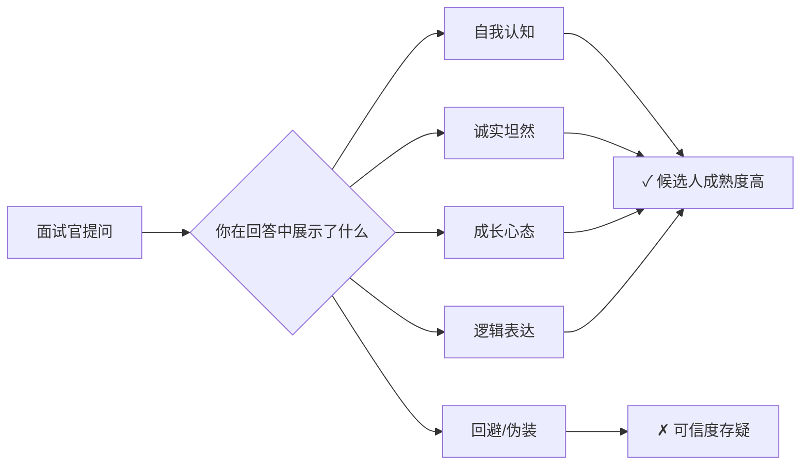
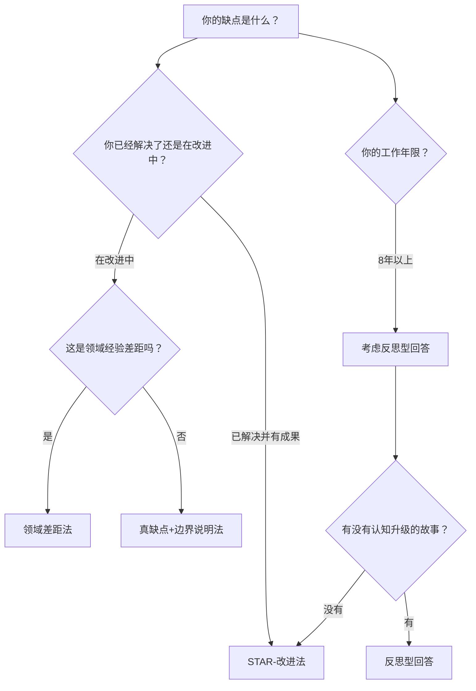
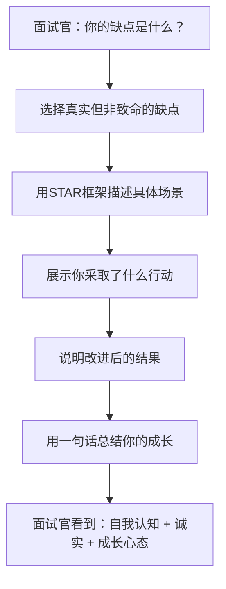

## 案例六：面试沟通——回答"你的缺点是什么"

### 场景描述

你正在参加一场重要的面试。前面的问题都回答得不错，气氛融洽。突然面试官话锋一转：

> "你觉得你最大的缺点是什么？"

空气安静了两秒。你知道这个问题是个陷阱，但又不确定该怎么回答。说得太轻，显得不真诚；说得太重，又怕直接被淘汰。

这是面试中出现频率最高、也最容易翻车的开放性问题之一。根据 LinkedIn 2024 年的调查数据，**78% 的面试官**会在行为面试环节提出这个问题或其变体（"你最大的失败是什么""同事怎么评价你的不足"）。它不是随口一问——面试官在用这个问题同时考察你的**自我认知能力、诚实度、成长心态和压力应对能力**。

这个问题之所以经久不衰，是因为它在短短两分钟的回答中，能同时暴露候选人多个维度的素质。其他问题可能只考察单一能力——技术题考专业、情景题考应变——但"你的缺点是什么"是一道综合测试，它要求你在坦诚与策略之间找到精确的平衡点。

---

### 面试官到底在考察什么

很多人以为这个问题是在找你的"毛病"，这是一个根本性的误解。面试官不是在收集你的黑料，而是在评估四个维度：

| 考察维度 | 面试官内心独白 | 你需要展示的信号 |
|---------|-------------|--------------|
| **自我认知** | "这个人了解自己吗？" | 能准确识别自身短板，不盲目自大 |
| **诚实度** | "他会不会说假话？" | 敢于暴露真实的不完美，而非精心包装 |
| **成长心态** | "遇到问题会怎么处理？" | 面对不足有行动、有改进、有反思 |
| **压力表现** | "被追问会慌吗？" | 面对敏感问题依然从容、有逻辑 |

理解了面试官的真实意图，你就知道：**回答这个问题的核心不是"藏缺点"，而是"展示你如何面对缺点"**。

#### 面试官的心理学视角：为什么这个问题如此有效

从组织行为学的角度，这个问题的设计基于三个心理学原理：

**1. 自我服务偏差（Self-Serving Bias）检测**

心理学家发现，人在描述自己时天然倾向于把成功归因于自身能力，把失败归因于外部环境。面试官通过"缺点问题"来检测你的自我服务偏差程度——偏差越大的人，越难在团队中接受反馈和改进。

**2. 达克效应（Dunning-Kruger Effect）筛查**

能力不足的人往往高估自己的能力。面试官想通过这个问题判断：你是否处于"知道自己不知道"的认知阶段。能够清晰描述自身短板的人，通常已经超越了达克效应的盲区。

**3. 心理安全感（Psychological Safety）预测**

Google 的 Project Aristotle 研究表明，高效团队的核心特征是心理安全感。一个能在面试中坦然面对缺点的候选人，更有可能在团队中营造开放、信任的氛围。

---

### 四种回答框架

#### 框架一：STAR-改进法（最推荐）

这是最结构化、最安全的回答框架，适用于大多数场景。核心逻辑是：**缺点 → 具体事件 → 意识到问题 → 采取行动 → 取得成果**。

Structure:
  Situation（情境）：在什么场景下暴露了这个缺点
  Task（影响）：这个缺点造成了什么具体后果
  Action（行动）：你做了哪些改变
  Result（成果）：改进后的效果如何

**范例回答：**

> "我在项目管理上曾经有一个明显短板——不善于向团队成员分配任务。原因是我习惯了自己动手，觉得交代别人还不如自己做来得快。
>
> 去年负责一个为期三个月的产品上线项目，中期时我发现自己成了瓶颈——所有的关键代码都只有我一个人经手，进度开始滞后两周。团队成员也因此感到被边缘化，积极性下降。
>
> 之后我做了两个改变：第一，学习了任务拆解的方法，把大任务按照模块拆分，明确每个人的职责边界；第二，设置了每周 15 分钟的一对一沟通，了解成员的进展和困难。
>
> 最后项目按时交付，团队成员也反馈说参与感明显提升了。这件事让我认识到，**授权不是放手不管，而是要在结构化拆解和持续跟进之间找到平衡**。"

这个回答之所以有效：有具体场景、有真实后果、有具体行动步骤、有量化结果、有深度反思。

**STAR-改进法的底层逻辑：** 这个框架之所以被面试官普遍认可，是因为它模拟了"问题解决"的完整闭环。在工作中，你遇到问题时的反应模式就是：识别问题 → 分析原因 → 采取行动 → 评估效果。用这个框架回答缺点问题，本质上是在向面试官展示：你把"自我改进"当作一个项目来管理。

#### 框架二：真缺点 + 边界说明法

适用于你尚未完全解决但已经在改进中的缺点。核心逻辑是：**坦诚承认 → 说明影响边界 → 展示正在进行的改进**。

**范例回答：**

> "我在公开演讲方面确实存在不足。在小范围的团队讨论中我表现得很活跃，但到了 50 人以上的场合，我就会比较紧张，表达不如平时流畅。
>
> 我知道这个短板不会影响日常的技术工作，但在需要做产品演示或者跨部门汇报时，确实会打折扣。所以我从今年开始参加公司的演讲俱乐部，每个月做一次主题分享，已经连续参加了四个月，能明显感觉到自己的紧张程度在降低。"

这个框架的关键：你不会假装已经解决了问题，但你在用行动证明你在面对它。

**边界说明法的精髓：** 这个框架的核心技巧在于"边界说明"——你不是在说"我有这个缺点所以我做不了"，而是在说"我有这个缺点，我知道它在什么场景下会成为问题，我也知道它在什么场景下不影响我的表现"。这种清晰的自我评估能力，本身就是一种高级能力。

#### 框架三：领域差距法

适用于转行者、跨领域求职者，或者申请比当前级别更高的职位。核心逻辑是：**承认在新领域的经验差距 → 说明你已有的可迁移能力 → 展示学习计划**。

**范例回答：**

> "我之前的工作经验主要集中在 B 端产品，对 C 端用户增长的实操经验确实不多。但我过去三年做的 B 端产品恰好涉及了大量的用户行为分析和留存策略，这些方法论在 C 端同样适用。我已经在系统学习增长黑客的方法论，最近也在用一个副业项目做实践验证。"

**领域差距法的适用场景扩展：** 这个框架不仅适用于转行，还适用于以下情况：

- **晋升面试**：从 IC（个人贡献者）转管理，可以说"带团队的经验还不够深，但我的技术判断力和项目协调经验可以迁移"
- **跨行业跳槽**：从传统行业到互联网，可以说"对互联网的快节奏工作方式还在适应，但我过去在复杂供应链管理中积累的系统思维是有价值的"
- **新岗位探索**：申请一个公司新设的岗位，可以说"这个岗位没有太多先例可参考，但我有从零搭建 XX 的经验"

#### 框架四：反思型回答

适用于资深候选人。面试官期待你有更深的自我洞察，而不是初级的"我有个缺点在改"。

**范例回答：**

> "从业十年，我最大的反思是——早期太执着于技术方案的完美，而忽视了商业价值的衡量。有两年时间我在一个性能优化项目上投入了大量精力，技术上确实做到了极致，但从业务指标看，ROI 并不高。
>
> 这个经历改变了我对'好工程师'的定义。现在评估一个技术方案时，我会先回答三个问题：**这个优化能带来多少业务价值？投入产出比是否合理？是否有更高杠杆的事情可以做？** 技术能力是基础，但真正优秀的工程师需要具备商业判断力。"

**反思型回答的高级之处：** 这个框架的精妙在于，它展示的不是"我在改一个缺点"，而是"我的认知经历了一次升级"。面试官听到的是一个有深度思考能力的人，一个能从经验中提炼出方法论的人。对于资深岗位，这种"元认知"能力比任何具体的技能改进都更有价值。

---

### 如何选择最适合你的框架

面对四种框架，如何快速做出选择？以下是决策路径：

**选择框架的三个判断标准：**

1. **你的缺点的"解决程度"**：已解决用 STAR，在改进中用边界说明
2. **你的职业阶段**：初级用 STAR/边界说明，资深用反思型
3. **你的求职类型**：转行用领域差距，同行业用其他三种

---

### 错误示范与深度剖析

#### 错误类型一：假缺点——"我太追求完美了"

> "我觉得我最大的缺点就是太追求完美了，有时候会花太多时间在细节上。"

**为什么这是最差回答：**

这是面试界的经典"送命题"。面试官每个月至少听到 10 次这个答案。它的问题不在于内容本身，而在于三个层面的失败：

1. **缺乏自我认知**：你把"追求完美"包装成了一个隐性的优点，面试官一眼就能看穿
2. **缺乏诚实度**：你选择了一个"安全"的答案，而不是真实的答案
3. **缺乏成长信号**：你没有展示任何改进的行动或反思

更关键的是，很多面试官会追问："那你能举一个具体的例子吗？"如果你举不出来，或者举出的例子恰好说明你很注重质量——恭喜，你刚刚证明了自己在说套话。

**面试官的真实反应：** 资深面试官听到"我太追求完美"时，内心的第一反应不是"这个人很注重质量"，而是"这个人没有认真思考过自己"。在面试评分表上，这类回答通常直接归入"自我认知不足"的扣分项。

#### 错误类型二：致命缺点——暴露能力底线

> "我对 Excel 不太熟练，基本的公式都不太会用。"（申请财务分析岗位）
> "我不太擅长跟陌生人沟通。"（申请销售岗位）

**问题分析：**

这不是在展示诚实，而是在主动淘汰自己。回答缺点问题有一条红线：**你提到的缺点不能是目标岗位的核心能力要求**。

判断标准很简单：如果这个缺点会导致你在入职后无法完成日常工作的 60% 以上，那就不要提。

**红线判断清单：**

在选择缺点之前，用这个清单做自我检查：

- ❌ 这个缺点是否直接对应岗位 JD 中的"必备技能"？
- ❌ 这个缺点是否会导致你无法完成日常核心任务？
- ❌ 这个缺点是否与岗位的底层能力模型冲突？
- ✅ 这个缺点是否属于"锦上添花"而非"雪中送炭"的能力？
- ✅ 这个缺点是否在其他岗位上可能成为优势？

#### 错误类型三：甩锅型回答

> "我之前的团队配合不太好，所以项目总是延期。"
> "我的前任领导不太支持我的想法，所以很多事情推不动。"

**问题分析：**

把问题归因于外部环境，面试官听到的潜台词是："这个人在遇到困难时习惯性推卸责任。"即使你说的是事实，在面试场景下，你需要展示的是：**面对不理想的环境，你做了什么努力来改善结果**。

**甩锅型回答的深层问题：** 这类回答暴露的不仅仅是"推卸责任"的习惯，更是一种"外控型人格"倾向——心理学家 Julian Rotter 的控制点理论指出，外控型的人倾向于认为事件由外部力量决定，而内控型的人倾向于认为自己能影响结果。在团队协作中，内控型的人更容易主动解决问题，而外控型的人更容易等待环境改变。面试官通过你的归因方式，判断你属于哪种类型。

#### 错误类型四：过度暴露

> "我有时候会情绪失控，在之前的公司跟领导吵过架。"
> "我有拖延症，经常拖到最后一刻才开始干活。"

**问题分析：**

坦诚不等于自毁。在面试中暴露严重的性格缺陷或职业素养问题，不会让人觉得你"真诚"，只会让人担心你的稳定性。面试官不是你的心理咨询师，他们需要的是"能胜任工作的人"，而不是"需要大量管理成本的人"。

**底线原则**：你可以说的缺点应该是**可改进的、非致命的、已在改善中的**。

**"坦诚"与"自毁"的分界线：**

| 维度 | 坦诚（加分） | 自毁（减分） |
|------|------------|------------|
| 性质 | 技能层面的不足 | 性格/态度层面的问题 |
| 影响 | 局部、可控 | 全面、不可控 |
| 改进 | 有明确的改进路径 | 改变成本极高 |
| 信号 | "我在学习" | "这是我的本性" |

---

### 不同岗位的回答策略

不同岗位的核心能力不同，选择缺点时需要针对性调整：

| 岗位类型 | 可以提的缺点方向 | 绝对不能提的缺点 |
|---------|-------------|--------------|
| **技术岗** | 业务思维、跨部门沟通、项目管理 | 编程基础薄弱、学习新技术慢 |
| **产品岗** | 技术深度、数据分析能力、视觉审美 | 用户同理心不足、需求分析能力弱 |
| **销售岗** | 行业知识深度、数据分析、战略思维 | 社交能力差、抗压能力弱 |
| **管理岗** | 某项专业技能、对新工具的熟悉度 | 团队协作能力、决策力、沟通能力 |
| **设计岗** | 数据分析、业务理解、项目管理 | 审美能力差、不关注用户体验 |

#### 各岗位的定制化回答示例

**技术岗（后端工程师）：**

> "我在系统设计的文档化方面做得不够好。之前做架构设计时，我的思路都在脑子里，口头跟团队沟通后就开始写代码了。后来有新成员加入，发现很难理解我的设计意图，导致了很多沟通成本。之后我开始使用 C4 模型做架构文档，现在每个技术方案都会输出分层的架构图和决策记录（ADR）。"

**产品岗（用户增长方向）：**

> "我对用户心理的把握还不够细腻。有一次做新用户引导流程，我基于数据优化了转化路径，但忽略了用户的情感体验——流程虽然高效，但用户反馈说'感觉被催促'。这件事让我认识到，增长不能只看数据，还需要理解用户在每个触点的情感状态。后来我开始系统学习行为设计学，也在产品评审中增加了'情感体验走查'环节。"

**销售岗（大客户销售）：**

> "我在客户关系的长期维护上投入不够。之前的习惯是签完单就转向下一个客户，对老客户的关注主要集中在续约期。后来有一个大客户在续约时提了竞品对比，我才发现自己对客户的业务变化了解不够及时。现在我会每季度主动做一次客户业务回顾，提前预判客户的需求变化。"

---

### 被追问时的应对策略

面试官经常会在你的回答后追问，这是考察你的应变能力和回答的真实性。

#### 追问一："能再举个具体的例子吗？"

**应对**：提前准备 2-3 个真实案例。回答时用 STAR 框架快速组织语言。如果一时想不到好例子，可以说"让我想一个最合适的例子"——停顿 3 秒远比胡编一个故事要好。

**追问背后的意图：** 面试官追问这个，通常有两种可能：一是你的第一个例子不够有说服力，他想验证你是否真的经历过；二是你的回答太流畅了，他想测试你的临场反应。无论是哪种，保持冷静、真实回答即可。

#### 追问二："你觉得这个缺点现在还存在吗？"

**应对**：诚实回答。如果已经解决了，说"这个方面现在已经有了很大改善"；如果还在改进中，说"比以前好了很多，但我认为还有提升空间，所以我正在做 X"。

**不要说"完全克服了"：** 即使你真的已经完全解决了这个缺点，也不要说"完全克服了"。这会让人觉得你在夸大。更好的表达是："现在已经不是我的瓶颈了，但我还是会保持警惕，避免回到老路上。"

#### 追问三："你的同事/领导怎么评价你这个缺点？"

**应对**：这个问题在验证你是否有外部视角。好的回答是："我的直属领导在上次绩效评估中也提到过这一点，他建议我可以尝试 X 方法，我后来确实采纳了。"

**外部视角的价值：** 这个追问的深层逻辑是——一个真正有自我认知的人，不会只依赖自己的判断，还会主动寻求外部反馈。如果你能引用同事或领导的真实评价，说明你有开放的反馈接收机制。

#### 追问四："除了这个，还有其他缺点吗？"

**应对**：说明你对自己有更全面的认识。可以说"还有一个是 X 方面"，但注意——如果你的第一个缺点回答得很好，面试官追问这个往往只是想看你的反应。简短回答即可，不必长篇大论。

**追问四的陷阱：** 这个追问最容易让人"说多了"。记住：第二个缺点只需要一句话带过，不需要展开案例。你的目标是展示"我有全面的自我认知"，而不是"我有一堆问题"。

#### 追问五："如果你入职后，你打算怎么改进这个缺点？"

**应对**：这是最积极的追问——面试官在暗示他对你感兴趣，想看你的改进计划是否可行。回答时给出具体的 30-60-90 天改进计划：

> "第一个月，我会主动请教团队中在这方面做得好的同事，学习他们的工作方式；第二个月，我会在实际项目中尝试应用，并请直属领导定期给我反馈；第三个月，我会做一次复盘，评估改进效果并调整方法。"

---

### 非语言层面的注意事项

你的回答内容只占面试官评估的 **55%**。根据 Albert Mehrabian 的沟通模型，**38% 来自语调，7% 来自肢体语言**。在回答缺点问题时，非语言信号尤其重要：

**应该做到的：**
- 保持眼神接触，不要回避面试官的目光
- 语速适中，不要因为紧张而加速
- 语气坦然，像是在分享一个学习经历，而不是在接受审讯
- 偶尔微笑，表明你对自己的成长有信心

**应该避免的：**
- 回答前长时间沉默（超过 5 秒会显得你在编故事）
- 低头、交叉双臂等防御性姿态
- 语调突然降低或变得不确定
- 搓手、摸鼻子等焦虑性小动作

#### 线上面试的特殊注意事项

远程面试时，非语言信号的传递会有损耗，需要额外注意：

| 注意事项 | 线下面试 | 线上面试 |
|---------|---------|---------|
| 眼神接触 | 看面试官的眼睛 | **看摄像头**，而不是屏幕上的面试官 |
| 手势 | 自然的肢体语言 | 手势幅度缩小，保持在摄像头画面内 |
| 表情 | 自然放松 | 微微夸张，因为视频会"压平"表情的感染力 |
| 背景 | 不适用 | 保持背景简洁、光线充足、无干扰元素 |

---

### 准备清单：面试前怎么做

在面试前花 30 分钟做以下准备，可以让你在面对这个问题时从容不迫：

**第一步：自我盘点（10 分钟）**

写下你的三个真实缺点。筛选标准：
- 这个缺点是真实的，同事/朋友也能认同
- 这个缺点不会直接命中目标岗位的核心要求
- 你对这个缺点有过真实的改进经历

**自我盘点的具体方法：**

1. **360度回忆法**：回忆过去一年中，同事、领导、下属给你的负面反馈（绩效评估、一对一沟通、项目复盘中提到的不足）
2. **项目复盘法**：回顾你参与过的项目，找出哪些环节你做得不够好，哪些决策事后证明是错误的
3. **能力模型对比法**：找到目标岗位的能力模型，逐项自评，找出你与"理想候选人"的差距

**第二步：准备案例（10 分钟）**

为每个缺点准备一个具体的 STAR 案例。确保：
- 场景真实可验证（不要编造）
- 有明确的行动步骤
- 有可感知的结果

**STAR 案例的黄金标准：**

一个好的 STAR 案例应该满足以下条件：

- **S（情境）**：有时间、地点、项目名称等具体信息，让人感觉"这是真实发生的事"
- **T（影响）**：有可量化的后果（延期X天、损失X万、影响X人）
- **A（行动）**：有具体的方法论或工具名称（不是"我努力改进了"，而是"我学习了XX方法并应用于XX场景"）
- **R（成果）**：有可验证的结果（数据变化、同事反馈、项目交付）

**第三步：预演追问（10 分钟）**

自己对着镜子或录音回答一遍，然后自己追问：
- "这个例子是真的吗？能说更多细节吗？"
- "你为什么选择这个缺点而不是别的？"
- "你觉得自己完全克服了吗？"

如果任何一个追问让你卡壳，说明你的准备还不够充分。

**预演的进阶方法：** 找一个朋友做模拟面试，让他只负责追问你的缺点回答。记录下每个让你停顿超过3秒的追问，这些就是你需要加强准备的地方。

---

### 高阶技巧：如何让缺点回答成为加分项

真正优秀的候选人，不是在"应付"这个问题，而是把它变成展示自己优势的机会。

**技巧一：缺点转能力**

在描述改进过程中，自然地展示你培养出的新能力。

> 缺点："我以前不善于做文档。"
> 改进过程：→ "后来我建立了一套文档模板体系，现在团队的新人都在用我的模板做知识沉淀。"

面试官听到的不是"你不写文档"，而是"你有体系化思维和团队影响力"。

**技巧二：缺点映射价值观**

选择一个能反映你职业价值观的缺点。

> "我有时候会对代码质量过于执着。有一次为了一个重构方案跟产品经理争论了很久，最后虽然技术上更优雅了，但确实影响了交付节奏。这件事之后我学会了在'技术理想'和'业务现实'之间找平衡。"

这个回答暗示：你重视技术品质，但也有商业意识。

**技巧三：展示元认知**

元认知（Metacognition）是指"对自己思维过程的认知"。高段位的回答会展示你如何"观察自己"。

> "我注意到自己有一个模式：在高压环境下，我会倾向于独立解决问题而不是及时求助。这看起来像效率高，但其实经常导致在错误的方向上浪费时间。意识到这个模式后，我现在会在项目开始时就设置'检查点'——如果某个问题超过两小时没有进展，就强制自己停下来同步给团队。"

这种回答展示的是你有**系统性反思**的能力，这是高级人才的标志。

**技巧四：用缺点展示你的学习方法论**

> "我的弱点是进入新领域时容易陷入'学习陷阱'——花太多时间在基础理论上，而不是快速实践。意识到这个问题后，我建立了'70-20-10'的学习规则：70% 的时间用来动手做，20% 用来向有经验的人请教，只有 10% 用来读理论。用这个方法，我在转行后的三个月内就独立交付了第一个项目。"

这个回答展示了：你不仅有自我认知，还有**自我管理的系统方法**。

---

### 不同面试风格的应对策略

不同风格的面试官提出这个问题时，意图和期望的回答风格有所不同：

| 面试官类型 | 特征表现 | 应对策略 |
|-----------|---------|---------|
| **友善型** | 语气轻松，像聊天 | 保持自然，用故事化的方式回答 |
| **压力型** | 持续追问，表情严肃 | 保持冷静，每句话都有逻辑支撑 |
| **技术型** | 关注具体方法和数据 | 用量化数据和具体工具名称回答 |
| **HR 型** | 关注价值观和文化匹配 | 强调成长心态和团队协作意识 |

**压力面试的特殊应对：** 如果面试官在你回答后不断追问"还有呢？""那你觉得这个问题严重吗？""你前任领导怎么看？"——不要慌。这是典型的压力面试技巧，目的是测试你在被持续追问时是否还能保持逻辑清晰。应对方式：每次回答都保持"承认+边界+改进"的结构，不要因为被追问就说出不该说的话。

---

### 远程面试与现场面试的差异

线上面试和现场面试在回答缺点问题时有一些微妙但重要的差异：

**远程面试的优势：**
- 可以在屏幕边缘贴小抄（关键词提示，不是逐字稿）
- 紧张时可以短暂看一眼笔记，面试官不会察觉
- 环境熟悉，心理压力相对较小

**远程面试的劣势：**
- 非语言信号传递受限，难以用肢体语言增强表达
- 网络延迟可能导致追问节奏变化，增加紧张感
- 面试官可能更关注你的"稳定性"（远程工作需要更强的自驱力）

**远程面试的加分技巧：** 在回答缺点时，如果涉及到"改进过程"，可以主动提到你在远程工作/异步协作中如何实践改进。比如："我现在会用 Notion 记录自己的改进计划，每周复盘一次进度。"这向面试官暗示：你有自律的远程工作习惯。

---

### 总结：回答缺点问题的核心公式

真实缺点（非核心能力）+ 具体场景 + 行动改进 + 成长反思 = 优质回答

记住：面试官不期待你完美无缺。他们期待的是一个**知道自己不完美、并且正在努力变得更好的人**。

最后一句话：**最好的缺点回答，不是让你"过关"的回答，而是让面试官觉得"这个人值得培养"的回答。** 关键不在于你的缺点有多小，而在于你面对缺点的态度有多成熟。

***
