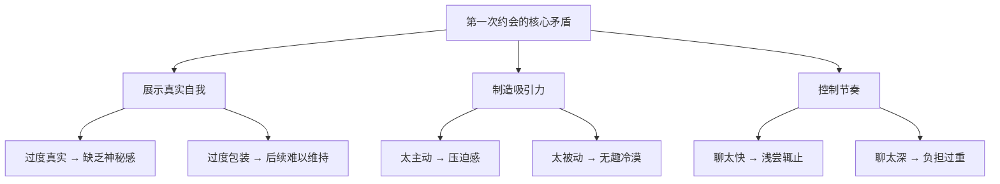
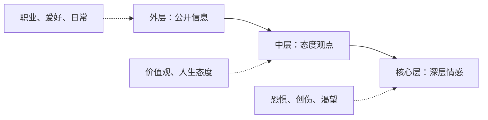
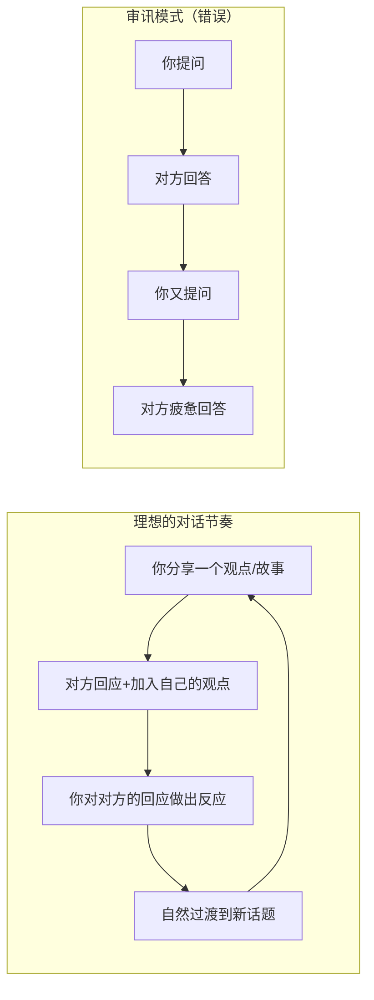
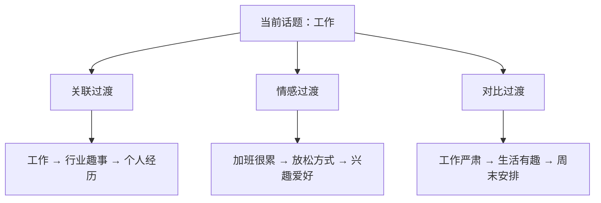
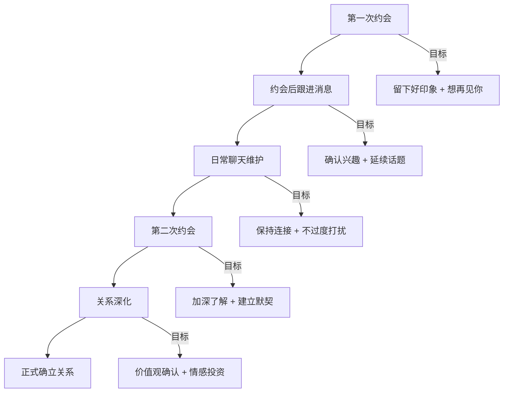

## 案例七：约会沟通——第一次约会聊天

第一次约会是所有社交场景中最微妙的沟通挑战之一。它兼具"陌生人间的破冰"和"潜在亲密关系的试探"双重属性——你既要展示真实的自己，又要在短时间内建立足够的吸引力和信任感。据《社会心理学杂志》的研究，人们在初次见面的前 7 秒就会形成对对方的"第一印象框架"，而第一次约会的前 15 分钟基本决定了是否有第二次约会的可能。

本案例从心理学原理出发，系统拆解第一次约会聊天的底层逻辑、常见雷区、核心技巧和进阶策略。

---

### 一、场景还原

#### 1.1 背景设定

你通过交友软件（如探探、Soul、Tinder）认识了一个人，线上聊了一周左右，彼此感觉不错，决定线下见面。约会地点选在一家安静的咖啡馆，时间是周六下午三点。

- **你的信息**：28 岁，男性，从事数据分析工作，性格偏内向但线上聊天表现不错
- **对方信息**：26 岁，女性，从事 UI 设计工作，线上聊天风格活泼，喜欢追剧和旅行
- **线上聊天基础**：聊过各自的工作、喜欢的电影、周末的安排，互动频率每天 2-3 轮
- **约会目标**：通过线下见面确认是否有继续发展的可能

#### 1.2 第一次约会的核心矛盾

这三个矛盾的本质是：**在有限时间内，找到真实与吸引力之间的最优平衡点。**

---

### 二、理论基础：为什么约会聊天如此特殊

#### 2.1 社会渗透理论（Social Penetration Theory）

心理学家阿尔特曼（Altman）和泰勒（Taylor）提出的社会渗透理论认为，人际关系的发展是一个**由浅入深的自我暴露过程**——从外层的公开信息（职业、爱好）逐步渗透到中层的态度观点（价值观、人生规划），最终到达核心层（内心恐惧、童年经历、深层情感需求）。

**第一次约会的正确渗透深度是：从中层开始，触碰但不深挖核心层。** 过于停留在外层会让人觉得无聊（"我们只是在交换简历"），直接跳入核心层会让人感到不适（"我们才第一次见面你就聊童年创伤？"）。

#### 2.2 吸引力的心理学构成

第一次约会中，吸引力不是单一维度的，而是由多个因素共同构成：

| 吸引力维度 | 权重（约会场景） | 如何在聊天中体现 |
|------------|------------------|------------------|
| 外在形象 | 30% | 穿着得体、干净整洁（聊天前的准备工作） |
| 幽默感 | 25% | 适度自嘲、轻松的玩笑、不刻意搞笑 |
| 共鸣感 | 20% | 找到共同点、表达理解和认同 |
| 神秘感 | 15% | 不一次性暴露所有信息、留有话题余量 |
| 安全感 | 10% | 尊重边界、不施压、不评判 |

**关键洞察**：很多人把注意力放在"说什么"上，但研究表明，**"怎么说"和"什么时候不说"比"说什么"重要得多。** 语气、节奏、表情、眼神接触、倾听的姿态，这些非语言信号在约会场景中的影响力是语言内容的 3-5 倍。

#### 2.3 对话的"乒乓球模型"

好的对话像打乒乓球——你来我往，节奏适中，双方都有参与感。坏的对话像两种极端：

- **单口相声模式**：一个人不停地说，另一个人只能点头附和
- **审讯模式**：一个人不停提问，另一个人只能被动回答

理想的对话中，**自我披露和提问的比例约为 6:4**——60% 的时间你在分享自己的故事、观点、感受，40% 的时间你在提问和倾听对方。

---

### 三、错误示范与深度剖析

#### 3.1 反面案例一：查户口式对话

> 你："你是做什么工作的？"
> 对方："我是设计师。"
> 你："哦，收入怎么样？"
> 对方："还行吧……"
> 你："你家里几口人？有房吗？有车吗？"
> 对方：（内心：这是面试还是约会？）

#### 3.2 逐句诊断

| 问题句 | 诊断 | 病因 |
|--------|------|------|
| "你是做什么工作的？" | 封闭式问题，答案只有一个词 | 把约会当面试，缺乏对话设计 |
| "收入怎么样？" | 涉及隐私，初次见面不适合 | 缺乏边界感，不懂社交距离 |
| "有房吗？有车吗？" | 连续的隐私性封闭式问题 | 只关注"筛选条件"，忽视"建立连接" |
| （全程没有自我分享） | 单向索取信息 | 对话是双向的，不是审讯 |

**核心问题总结：**

1. **提问方式错误**：全是封闭式问题，对方只能用一两个词回答，对话无法展开
2. **话题选择错误**：直接触碰隐私禁区（收入、房产），让对方感到被物化
3. **对话模式错误**：单向提问没有自我暴露，缺乏互动感和亲近感
4. **节奏把控错误**：连续追问形成压迫感，没有给对方喘息的空间

#### 3.3 反面案例二：过度表现模式

> 你："我跟你说，我去年升了主管，手下管着十几个人。我们公司是行业前三的，我负责的那个项目估值两个亿……"
> 对方："哇，好厉害……"
> 你："对了，我上个月刚买了辆车，宝马三系，落地三十五万。你平时出门怎么走？我可以开车接你……"
> 对方：（内心：他是在相亲还是在做路演？）

**诊断**：

| 问题 | 病因 | 后果 |
|------|------|------|
| 不停展示成就 | 缺乏安全感，试图用"条件"吸引对方 | 让人觉得你在炫耀，而非分享 |
| 单方面输出 | 没有关注对方的反应和感受 | 对方变成被动听众，失去参与感 |
| 过早释放"接你"信号 | 步伐太快，制造压力 | 让人觉得目的性太强 |

#### 3.4 反面案例三：过度紧张模式

> 你：（沉默了十秒）"那个……你……今天天气不错哈。"
> 对方："嗯，是挺好的。"
> 你：（又沉默了五秒）"你……你平时喜欢干什么？"
> 对方："我喜欢看电影。"
> 你："哦……我也是……"
> 对方：（内心：好尴尬，什么时候可以结束？）

**诊断**：

| 问题 | 病因 | 后果 |
|------|------|------|
| 频繁沉默 | 过度紧张，大脑空白 | 气氛尴尬，对方也跟着紧张 |
| 话题断裂 | 没有准备话题储备，也没有追问能力 | 对话像挤牙膏 |
| 缺乏情感投入 | 过于关注"不出错"而忽略了"有温度" | 给人冷漠、无趣的印象 |

---

### 四、正确示范与技法拆解

#### 4.1 正面案例：自然流畅的约会对话

**开场阶段（前 5 分钟）——破冰与建立舒适感**

> 你："嘿，你比照片上还好看啊，我是 XX，很高兴见到你。"
> 对方："哈哈，谢谢，你也是。"
> 你："你到得挺早的，等很久了吗？我刚才路上看到一家新开的花店，差点忍不住买一束带过来，后来想想第一次见面带花会不会太正式了。"（微笑）
> 对方："哈哈，你要是真带花来我会觉得很可爱的。"
> 你："那下次我记住了。你想喝点什么？我听说这家的燕麦拿铁不错。"

**技法拆解：**

| 句子 | 技法 | 效果 |
|------|------|------|
| "你比照片上还好看" | 真诚的赞美 + 自然的开场 | 让对方放松，建立好感 |
| "差点买花"的小故事 | 轻松的自我暴露 | 展示幽默感和贴心，同时化解"第一次见面"的紧张 |
| "你想喝点什么" | 关注对方需求 | 体现体贴和照顾 |

**深入阶段（5-30 分钟）——寻找共鸣与建立连接**

> 你："你做 UI 设计啊，我一直觉得设计师的审美特别好。我虽然是做数据分析的，但我特别佩服能把复杂的东西变简单的人。你平时设计的时候，灵感一般从哪来？"
>
> 对方："其实很多时候是从生活里来的，比如我上次在一个展览上看到一个装置艺术，就觉得那个配色特别好，后来就用到了一个项目里。"
>
> 你："你是说上个月那个新媒体艺术展吗？我也去了！就是那个用光影做互动的那个对吧？我当时就觉得，这个如果用在 App 界面里一定很酷。你看，咱俩居然在同一个地方有了类似的想法。"
>
> 对方："真的吗？你也去了？那你最喜欢哪个作品？"

**技法拆解：**

| 句子 | 技法 | 效果 |
|------|------|------|
| "能把复杂的东西变简单" | 对职业的深层理解和赞美 | 比"设计师很酷"更有深度 |
| "灵感从哪来" | 开放式问题 + 对专业的兴趣 | 让对方有发挥空间 |
| "我也去了那个展" | 找到共同经历 | 制造"缘分感"和共鸣 |
| "咱俩有了类似的想法" | 强调相似性 | 心理学证实，相似性是最强的吸引力因素之一 |

**升温阶段（30-60 分钟）——价值观试探与情感共鸣**

> 你："我有时候觉得，做数据最有意思的不是找到答案，而是发现'原来事情是这样的'那个瞬间。你做设计有没有类似的时刻？"
>
> 对方："有啊，就是当一个作品终于完成，然后用户反馈说'这个用起来好舒服'的时候，就觉得之前熬的夜都值了。"
>
> 你："我能理解那种感觉。其实我们做的事情本质是一样的——你让界面变得让人想用，我让数据变得让人能懂，都是在让复杂的世界变简单一点。"
>
> 对方："你这么一说，我突然觉得我们做的事情还挺像的。"

**技法拆解：**

| 句子 | 技法 | 效果 |
|------|------|------|
| "最有意思的不是...而是..." | 分享内在感受和价值观 | 从外层话题（工作）渗透到中层（什么让你有成就感） |
| "你有没有类似时刻" | 引导对方自我暴露 | 创造双向的情感交流 |
| "我们做的是同一件事" | 建立"我们"的框架 | 从"你和我"变成"我们"，暗示亲密关系的可能性 |

#### 4.2 话题转换的自然过渡技巧

话题转换是约会聊天中最容易出问题的环节。生硬的转换让人觉得"你在背台词"，流畅的转换让人觉得"跟你聊天好舒服"。

**三种自然过渡方式：**

| 过渡方式 | 原理 | 示例 |
|----------|------|------|
| 关联过渡 | 从当前话题中提取关键词，关联到新话题 | "你说你喜欢旅行→我上个月刚去了XX→你去过那里吗" |
| 情感过渡 | 从当前话题引发的情感出发，过渡到类似情感的新话题 | "你说加班很累→我也有过那种感觉→不过我发现XX能让人放松" |
| 对比过渡 | 从当前话题出发，用"但是/不过"引入相反或补充的观点 | "设计确实需要创意→不过我觉得最有创造力的其实是做饭→你会做饭吗" |

---

### 五、第一次约会的完整对话框架

#### 5.1 时间线与节奏规划

第一次约会建议控制在 1.5-2 小时。太短无法建立有效连接，太长容易疲劳和尴尬。

| 阶段 | 时间 | 核心任务 | 话题层级 |
|------|------|----------|----------|
| 破冰期 | 0-10 分钟 | 消除紧张，建立舒适感 | 外层：轻松闲聊 |
| 探索期 | 10-30 分钟 | 寻找共同点，建立共鸣 | 外层→中层：兴趣、经历 |
| 连接期 | 30-60 分钟 | 深入交流，价值观试探 | 中层：观点、态度、感受 |
| 升温期 | 60-90 分钟 | 情感共鸣，暗示未来 | 中层→核心层边缘 |
| 收尾期 | 最后 15 分钟 | 留下期待，为下次铺垫 | 回到轻松氛围 |

#### 5.2 每个阶段的话题储备

**破冰期话题（轻松、无压力）：**

- 到达路上的见闻（"我刚才在路上看到一只超可爱的狗"）
- 对约会地点的感受（"这家店你来过吗？装修挺有意思的"）
- 外在的观察（"你今天穿的这个颜色很好看"）

**探索期话题（寻找共同点）：**

- 工作中的趣事（不是问"你做什么工作"，而是"你工作中最有意思的事是什么"）
- 最近看的剧/电影/书（"最近有看什么好剧吗？我刚追完XX"）
- 周末通常怎么过（"你周末一般是宅着还是出去浪"）
- 美食偏好（"你是什么菜系都能吃还是有特别的偏好"）

**连接期话题（价值观试探）：**

- 旅行中印象最深的经历（"你去过的地方里，哪个让你最难忘"）
- 对某件事的看法（"你觉得 XX 这件事怎么样"——选择轻松的社会话题）
- 人生中一个小转折点（"你是怎么进入现在这个行业的"）
- 童年的一个有趣回忆

**升温期话题（情感共鸣）：**

- 最近让你开心的一件小事
- 你对未来的某个期待（不涉及两人关系）
- 一个只有你自己知道的小秘密（适度的自我暴露）
- "如果明天不用上班，你最想做什么"

#### 5.3 话题禁区清单

| 话题 | 风险等级 | 原因 |
|------|----------|------|
| 收入/房产/车 | 🔴 高 | 让人觉得你在"评估条件" |
| 前任/感情史 | 🔴 高 | 初次见面聊前任是社交灾难 |
| 政治/宗教争议 | 🔴 高 | 容易产生对立，破坏氛围 |
| 催婚/催生 | 🔴 高 | 目的性太强，让人想逃 |
| 连续的负能量吐槽 | 🟡 中 | 偶尔吐槽工作可以，但不要全程抱怨 |
| 过于专业的技术话题 | 🟡 中 | 对方听不懂会无聊 |
| 对方的体重/外貌缺陷 | 🔴 高 | 即使是"善意"的评论也会让人不适 |

---

### 六、核心技巧深度解析

#### 6.1 提问的艺术：开放式 vs 封闭式

封闭式问题用一个词就能回答，对话到此为止；开放式问题需要对方展开叙述，对话自然延伸。

| 封闭式提问（避免） | 开放式提问（推荐） | 为什么后者更好 |
|-------------------|-------------------|---------------|
| 你是做什么工作的？ | 你平时工作忙吗？最有意思的部分是什么？ | 引导对方分享感受和故事 |
| 你喜欢旅行吗？ | 你去过的地方里，哪个让你最想再去一次？ | 唤起具体的记忆和情感 |
| 你爱看电影吗？ | 最近有看什么让你印象深刻的电影吗？ | 不是问"是不是"，而是问"是什么" |
| 你周末干什么？ | 如果有一个完全自由的周末，你理想中的安排是什么？ | 引导对方展开想象 |

**追问技巧——"递进三连"：**

当对方给出一个回答时，不要急着跳到新话题，用"递进三连"深挖：

1. **感受层**："那你当时什么感觉？" / "听起来你挺开心的？"
2. **细节层**："具体是什么样的？" / "能给我讲讲吗？"
3. **意义层**："这件事对你影响大吗？" / "后来呢？"

**示例：**

> 对方："我去年去了日本，特别喜欢京都。"
>
> 你（感受层）："京都确实很特别，你最喜欢它什么地方？"（不是问"去了几天"这种事实性问题）
>
> 对方："我喜欢那种老城区的感觉，走在小巷子里特别安静。"
>
> 你（细节层）："你有去那些寺庙吗？我记得有个地方可以看到整个城市的全景。"
>
> 对方："去了清水寺！站在那个舞台上往下看的时候，真的有种时间静止的感觉。"
>
> 你（意义层）："那种感觉我也体验过。有时候旅行最珍贵的不是去了哪里，而是那个让你停下来发呆的瞬间。"

#### 6.2 赞美的黄金法则

赞美是约会中最强的社交货币，但错误的赞美比不赞美更糟糕。

**赞美的三个层次：**

| 层次 | 类型 | 示例 | 效果 |
|------|------|------|------|
| 表层 | 外在赞美 | "你今天穿得很好看" | 基础好感，但容易显得肤浅 |
| 中层 | 能力赞美 | "你的设计作品真的很有创意" | 显示你关注对方的能力和努力 |
| 核心 | 本质赞美 | "你刚才说的那个观点让我重新想了想" | 最高级的赞美，认同对方的思想和价值 |

**赞美的四个原则：**

1. **具体化**：不要说"你很好"，要说"你刚才解释那个设计思路的时候特别清晰，我一下就明白了"
2. **真诚化**：只赞美你真正欣赏的点，虚假的赞美比沉默更糟糕
3. **自然化**：赞美要融入对话流中，不要突然停下来郑重其事地赞美
4. **适度化**：第一次约会赞美 3-5 次就够了，过多会显得讨好

#### 6.3 倾听的信号：让对方感觉被听见

倾听不是沉默，而是用信号告诉对方"我在认真听你说"。

| 倾听信号 | 具体做法 | 效果 |
|----------|----------|------|
| 眼神接触 | 说话时看对方眼睛 60-70% 的时间 | 传递专注和尊重 |
| 点头 | 轻微、缓慢的点头 | 鼓励对方继续说 |
| 回应词 | "嗯""对""然后呢""真的吗" | 保持对话节奏 |
| 复述确认 | "你的意思是……？" | 证明你在理解，不只是在听 |
| 追问 | "后来呢？""你当时怎么想的？" | 证明你真的感兴趣 |

#### 6.4 自我暴露的节奏控制

自我暴露是建立亲密感的核心，但节奏很重要。

**自我暴露的"交换原则"**：当对方分享了一件事，你也分享一个同层级的事情。不要让任何一方的暴露程度远超另一方——如果对方只说了"我喜欢看电影"，你不要接"我前女友就是因为电影跟我分手的"。

**安全的自我暴露示例：**

| 层级 | 内容 | 时机 |
|------|------|------|
| 轻度 | "我有个奇怪的习惯，看电影一定要吃爆米花" | 破冰期 |
| 中度 | "我之前有一段时间特别迷茫，不知道自己想做什么" | 连接期 |
| 深度 | "我小时候其实特别内向，是后来慢慢锻炼出来的" | 升温期（对方也分享了类似深度的内容后） |

---

### 七、线上到线下的衔接策略

#### 7.1 线上聊天为线下约会做的铺垫

第一次约会的成败，很大程度上取决于线上聊天阶段的铺垫。

**线上阶段应该收集的信息（用于约会时的话题储备）：**

- 对方的兴趣爱好（约会时可以围绕这些展开）
- 对方最近在关注什么（追什么剧、想去哪里旅行）
- 对方的工作状态（忙不忙、开不开心）
- 对方的性格特点（内向还是外向、幽默还是严肃）

**线上阶段应该避免的行为：**

- 不要线上聊太深入的话题，留给线下
- 不要线上暴露所有个人信息，保持神秘感
- 不要线上形成"网友"模式太久，适时约线下见面

#### 7.2 见面后的"线上→线下"过渡

> 你："终于见到真人了，跟线上感觉一样亲切。"
> 对方："哈哈，你也是，比照片上更……（停顿）"
> 你："更什么？更矮？更胖？没关系你说实话。"（自嘲化解尴尬）
> 对方："不是啦，更精神！"

**过渡的关键**：用一句轻松的话把"线上关系"无缝衔接到"线下关系"，消除"第一次线下见面"的陌生感。

---

### 八、不同性格类型的应对策略

#### 8.1 对方是内向型

| 特征 | 应对策略 |
|------|----------|
| 话少，回答简短 | 不要急着填满沉默，给对方思考的时间 |
| 不善于主动找话题 | 你多准备一些话题，用开放式问题引导 |
| 喜欢深度而非广度 | 少切换话题，多深入一个话题 |
| 不喜欢被关注 | 少问"你觉得呢"这种直接点名式提问 |

**内向型友好的提问方式：**

> "你之前提到你喜欢看书，最近在看什么？"（延续已知信息，降低回答压力）
> 
> "我最近发现了一个特别有意思的……你有没有遇到过类似的事？"（先分享自己，再邀请对方）

#### 8.2 对方是外向型

| 特征 | 应对策略 |
|------|----------|
| 话多，精力旺盛 | 做一个好的倾听者，适时插入自己的观点 |
| 喜欢分享各种事情 | 用追问引导她深入，不要只是"嗯嗯嗯" |
| 容易跑题 | 在合适的节点把话题拉回来 |
| 喜欢互动和反馈 | 多用回应词、表情和肢体语言 |

#### 8.3 对方是理性分析型

这类人喜欢逻辑和条理，聊天时可以：
- 多用"因为……所以……"的逻辑结构
- 分享有深度的观点和见解
- 避免过于感性和情绪化的表达
- 可以适当聊一些有争议性的话题（但避免敏感话题）

#### 8.4 对方是感性直觉型

这类人更在意感受和氛围，聊天时可以：
- 多分享感受和故事，少讲道理和逻辑
- 用生动的描述唤起对方的想象
- 关注对方的情绪变化，及时回应
- 可以聊旅行、美食、艺术等感性话题

---

### 九、约会中的非语言沟通

#### 9.1 身体语言的信号解读

| 信号 | 含义 | 你的应对 |
|------|------|----------|
| 身体微微前倾 | 对你感兴趣 | 继续当前话题 |
| 身体后仰或侧转 | 感到无聊或不适 | 换话题或提议换个活动 |
| 频繁看手机 | 不耐烦或有急事 | 主动问"你是不是有事？" |
| 模仿你的动作（如同时端起杯子） | 潜意识的认同和亲近 | 好信号，继续 |
| 玩头发/摸耳朵 | 紧张或害羞 | 不要指出，保持轻松氛围 |
| 眼神躲闪 | 紧张或害羞（不一定是不感兴趣） | 给对方时间适应 |

#### 9.2 你自己的身体语言管理

- **坐姿**：微微前倾，表示关注；不要后仰靠在椅背上（显得傲慢或懒散）
- **手臂**：不要交叉抱胸（防御姿态），自然放在桌上或膝盖上
- **眼神**：说话时看对方眼睛，但不要一直盯着（每 5 秒左右移开一次）
- **微笑**：自然的微笑是最好的社交润滑剂
- **手势**：适度的手势可以让表达更生动，但不要太多太夸张

#### 9.3 声音的运用

| 声音要素 | 正确做法 | 错误做法 |
|----------|----------|----------|
| 语速 | 中等偏慢，让对方跟得上 | 像机关枪一样说个不停 |
| 音量 | 适中，对方能听清就行 | 太大声显得粗鲁，太小声显得没自信 |
| 语调 | 有起伏变化，传递情感 | 全程一个调，像念经 |
| 停顿 | 在重点处适当停顿，制造悬念 | 不停顿，一口气说完没有重点 |

---

### 十、常见误区与纠正

#### 误区一：把约会当面试

**症状**：连续提问，像在筛选条件。

**纠正**：把"面试模式"切换成"分享模式"。不要问"你是做什么的"，而是说"我猜你是做创意工作的，因为你穿搭特别有品味"——即使是猜测，也比直接提问更有趣。

#### 误区二：过度准备"话术"

**症状**：像背台词一样说话，不自然。

**纠正**：准备话题方向，而不是具体台词。记住 3-5 个你擅长聊的话题领域，确保在冷场时有东西可聊就够了。

#### 误区三：急于展示所有优点

**症状**：恨不得第一次见面就把自己的全部优势展示出来。

**纠正**：第一次约会的目标不是"让对方喜欢你"，而是"让对方想再见到你"。留有余地比一次性倾倒更有吸引力。

#### 误区四：忽视对方的舒适度

**症状**：只关注自己表现好不好，没有观察对方的状态。

**纠正**：每 10 分钟做一次"舒适度检查"——对方是否在笑？是否主动说话？身体是前倾还是后仰？如果对方表现出不适，及时调整。

#### 误区五：对"冷场"过度恐惧

**症状**：一出现沉默就慌张，拼命找话说。

**纠正**：短暂的沉默是正常的。不要把每一秒沉默都当成失败。有时候，两个人安静地喝一口咖啡，反而比尬聊更舒服。3-5 秒的沉默完全没问题，超过 10 秒再找话题。

#### 误区六：过早讨论"关系定义"

**症状**："你觉得我们合适吗？""你对我什么感觉？"

**纠正**：第一次约会的任务是"让彼此舒服"，不是"确认关系"。关系定义应该留给后续的互动自然发展。

#### 误区七：全程只聊自己

**症状**：因为紧张而不停说话，或者因为自恋而不停展示自己。

**纠正**：遵循"40/60 法则"——你说 40%，对方说 60%。好的对话者是引导者，不是独白者。

---

### 十一、进阶策略：从"不错的约会"到"令人难忘的约会"

#### 11.1 制造"峰值体验"

心理学的"峰终定律"（Peak-End Rule）表明，人们对一段经历的记忆主要取决于两个时刻：**峰值时刻**（最强烈的体验）和**结束时刻**。这意味着，一次约会中有一两个精彩瞬间，比全程都"还行"更让人印象深刻。

**制造峰值的方法：**

- 一个特别好笑的笑话或故事
- 一个意想不到的共同点
- 一个让人"哇"的巧合
- 一个真诚的、有深度的分享

#### 11.2 留下"未完待续"的感觉

最好的约会结尾是让对方觉得"还没聊够"，而不是"终于结束了"。

> 你："时间过得好快，感觉我们才刚开始聊就两个小时了。你刚才说的那个XX，我回去一定要去了解一下。"
> 对方："哈哈，对啊，我也没想到这么能聊。"
> 你："下次我们可以去你说的那家XX店试试，听你描述就很想去。"

**结尾三要素：**

1. **总结亮点**："刚才聊XX的时候特别开心"
2. **延续话题**："那个XX我回去看看"
3. **暗示下次**："下次我们可以……"

#### 11.3 约会后的跟进

约会结束后的 2-4 小时内发一条消息，不要等到第二天。

**好的跟进消息：**

> "今天聊得很开心，到家了吗？你推荐的那个XX我已经在看了，确实很有意思。"

**差的跟进消息：**

> "今天感觉怎么样？你对我什么印象？"（过于直接，让对方有压力）
> 
> "今天跟你在一起很开心，我觉得我们挺合适的，你觉得呢？"（第一次约会后就表白，太快了）

---

### 十二、实战演练：完整的第一次约会对话脚本

以下是一个完整的第一次约会对话示例，展示从开场到结尾的全流程：

**场景：周六下午，咖啡馆**

> **你**：（站起来迎接）"嘿，XX！终于见到真人了。你比照片上还好看。"
>
> **对方**："哈哈，谢谢，你也是。你到挺早的。"
>
> **你**："我提前了十分钟，想先看看菜单。你平时喝咖啡多吗？我是那种早上必须来一杯才能活过来的人。"
>
> **对方**："我也是！不过我不太懂咖啡，一般就喝拿铁。"
>
> **你**："拿铁是安全牌，不容易踩雷。我之前试过一次手冲，苦得我差点当场去世。"（笑）
>
> **对方**："哈哈哈，手冲确实要慢慢品。"
>
> **你**："对了，你上次说最近在追那个剧，看完了吗？我这周也开始了，刚看到第三集。"
>
> **对方**："看完了！后面剧情反转特别多，但我不剧透。你看到第三集的话，那个男主角的秘密你猜到了吗？"
>
> **你**："我猜他其实是……不对，我不猜了，你说不剧透的。那你平时追剧是那种一口气看完还是慢慢追？"
>
> **对方**："必须一口气！我有一次周末看剧看到凌晨三点。"
>
> **你**："我也是，那种'再看一集就睡'然后天亮了的感觉太真实了。不过第二天起来会后悔。你第二天一般怎么恢复？"
>
> **对方**："就……疯狂喝咖啡。"
>
> **你**："你看，咖啡果然是续命神器。对了，你上次说的那个展览，我查了一下，下周好像还有一场，你有兴趣吗？"
>
> **对方**："真的吗？我上次还没看够呢！"
>
> **你**："那到时候可以一起去。不过我得先恶补一下那个艺术家的背景，免得到时候你看得津津有味我在旁边一脸懵。"
>
> **对方**："哈哈，没关系，我可以给你讲解。"
>
> **你**："那就说定了，我负责买票，你负责当导览。"

**对话分析：**

| 段落 | 技法 | 效果 |
|------|------|------|
| 开场赞美 | 真诚、具体 | 建立好感 |
| 咖啡话题 | 轻松破冰，自嘲 | 展示幽默感 |
| 追剧话题 | 延续线上聊天内容 | 无缝衔接 |
| "一口气看完"的共鸣 | 找到共同习惯 | 制造亲近感 |
| 展览话题 | 制造下次约会机会 | 为未来铺垫 |
| "你当导览"的分工 | 轻松暗示下次约会 | 推进关系但不施压 |

---

### 十三、从第一次约会到长期关系的沟通进化

第一次约会只是起点，真正考验沟通能力的是后续的持续互动。

每次约会的沟通深度应该递进，而不是每次都在同一层级重复。第一次约会建立舒适感，第二次约会建立默契，第三次约会建立信任——这个节奏是最健康的。

---

### 十四、核心要点总结

| 维度 | 关键原则 | 具体行动 |
|------|----------|----------|
| 提问方式 | 开放式为主，封闭式为辅 | 用"什么感受""怎么想的"替代"是不是" |
| 话题选择 | 由浅入深，避免禁区 | 从兴趣爱好到价值观，不碰收入和前任 |
| 对话节奏 | 你来我往，6:4 分配 | 60% 分享 + 40% 提问倾听 |
| 赞美策略 | 具体、真诚、适度 | 每次约会 3-5 次，从表层到核心递进 |
| 非语言沟通 | 眼神、微笑、倾听信号 | 前倾坐姿、适度眼神接触、回应词 |
| 时间控制 | 1.5-2 小时，意犹未尽 | 在最精彩的时候收尾，留下期待 |
| 约会后跟进 | 2-4 小时内，轻松自然 | 延续约会话题，暗示下次见面 |

**最后记住**：第一次约会的终极目标不是"让对方喜欢你"，而是"让对方想要再见到你"。前者需要你表现完美，后者只需要你真实、有趣、让人舒服。

***
