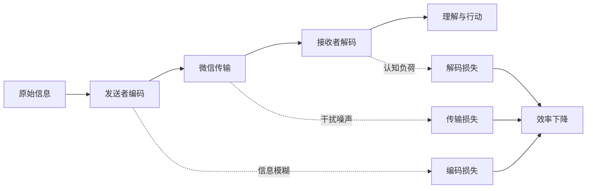
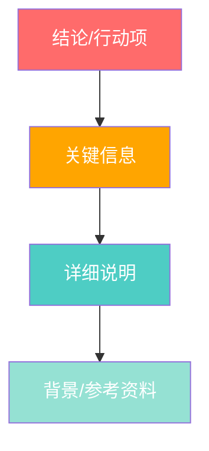

## 案例八：线上沟通——微信工作群的高效沟通

### 场景描述

你是项目组的负责人，需要在微信群里通知团队成员一个重要变更。群里有15个人。

### 错误示范

> "各位，有个事说一下，就是之前我们定的那个方案可能要改一改，因为客户那边有一些新的想法，具体我还在跟他们沟通，大概下周能确定，大家先按原计划推进吧，等我消息。"

**问题分析**：
- 信息模糊，"有个事"让人不知道是什么事
- "可能要改一改"缺乏确定性，让人焦虑
- "具体还在沟通"等于没有实质信息
- "先按原计划推进"跟前面说的"要改"矛盾
- 整体让人困惑，可能会引发一堆追问

### 正确示范

> 📢 **【重要通知】方案变更预告**
>
> 各位同事，关于XX项目方案，客户提出了新的需求，预计会涉及部分调整。
>
> **当前状态**：我正在与客户确认具体变更内容
> **预计时间**：下周五（3月15日）前给出最终方案
> **你们需要做的**：目前按原计划继续推进，不受影响
> **我会做的**：确认后第一时间在群里同步，并更新项目计划
>
> 有疑问可以随时@我。收到请回复"收到"。🙏

**分析**：
- 标题醒目，让人知道这是重要通知
- 信息分层，每个部分清晰明确
- 明确了"当前状态""预计时间""你们需要做的""我会做的"
- 减少不确定性，降低焦虑
- 要求确认回复，确保信息传达到位

### 关键技巧
- ✅ 信息结构化，层次分明
- ✅ 明确每个角色的行动项
- ✅ 减少不确定性
- ✅ 要求确认回复

***

### 微信工作群沟通的深层原理

#### 为什么群聊效率容易崩塌？

微信工作群的沟通效率问题，根源在于**信息密度与认知负荷的失衡**。当群里同时讨论多个话题、混杂闲聊与工作、缺乏结构时，信息密度急剧下降，而认知负荷急剧上升。

**信息密度**指单位时间内传递的有效信息量。一条结构化的工作通知，信息密度可能达到80%以上；而一条"有个事说一下"的开头，信息密度可能只有10%。

**认知负荷**指接收者理解信息所需的脑力。当信息模糊、缺乏上下文、需要猜测时，认知负荷会成倍增加。

**三个损失环节**：

1. **编码损失**：发送者没有把想法整理清楚就发出去
2. **传输损失**：群里的闲聊、表情包、无关讨论干扰了信息传递
3. **解码损失**：接收者需要花大量时间理解、猜测、追问

#### 群聊与私聊的本质区别

很多人把群聊当私聊用，这是效率崩塌的根源。

| 维度 | 私聊 | 群聊 |
|------|------|------|
| 参与者 | 2人 | N人（通常5-50人） |
| 信息流向 | 双向 | 多向 |
| 上下文 | 共享度高 | 共享度低 |
| 注意力 | 专属 | 分散 |
| 响应期望 | 即时 | 异步为主 |
| 信息损耗 | 低 | 高 |

**核心差异**：群聊中，每个人看到的信息都是"碎片化"的——他们可能错过了前面的讨论，可能不理解某个简称的含义，可能不知道这件事跟自己的关系。

因此，群聊信息必须做到**自包含**——任何人看到这条消息，都能独立理解，不需要追问上下文。

### 微信工作群的六大沟通类型

#### 1. 通知型沟通

**场景**：宣布决定、发布通知、传达要求

**核心原则**：一次说完，不给追问空间

**结构模板**：

📢 【通知类型】标题

各位，具体事项说明。

【背景】为什么发这个通知
【内容】具体是什么
【时间】什么时候生效/截止
【行动】你们需要做什么
【疑问】有问题找谁

收到请回复"收到"。

**示例对比**：

❌ 错误示范：
> "大家注意一下，下周的会议改时间了。"

✅ 正确示范：
> 📢 **【会议调整】产品评审会时间变更**
>
> 各位同事，原定于下周三（3月12日）下午2点的产品评审会，因客户临时有事，调整如下：
>
> 【新时间】下周四（3月13日）下午2点
> 【地点】不变，3楼会议室A
> 【议程】不变，仍为Q2产品方案评审
> 【需要做的】已预约周三会议室的同事，请取消预约
>
> 有冲突的同事请今天下班前@我。收到请回复"收到"。

#### 2. 讨论型沟通

**场景**：需要团队讨论、征求意见、头脑风暴

**核心原则**：明确讨论框架，避免发散

**结构模板**：

💬 【讨论】议题标题

各位，我们需要讨论以下问题：

【背景】为什么需要讨论
【选项】目前有哪些选择（A/B/C）
【我的倾向】我初步的想法是X，原因是...
【需要你们】希望大家从Y角度给出意见
【截止】今天下班前收集意见

请直接回复你的选择+理由。

**关键技巧**：

- **给选项而非开放问题**："大家怎么看？"不如"A方案和B方案，你们倾向哪个？"
- **限定讨论范围**：明确讨论什么、不讨论什么
- **设定截止时间**：避免讨论无限期拖延
- **引导而非主导**：先给出自己的倾向，但保持开放

**示例对比**：

❌ 错误示范：
> "新功能的技术方案，大家讨论一下吧。"

✅ 正确示范：
> 💬 **【讨论】用户登录模块技术选型**
>
> 各位，新功能需要重新设计登录模块，目前有两个技术方案：
>
> 【方案A】使用现有SSO系统
> - 优点：开发量小，1周可完成
> - 缺点：依赖外部服务，有单点风险
>
> 【方案B】自建OAuth2.0服务
> - 优点：完全可控，扩展性好
> - 缺点：开发量大，需要3周
>
> 【我的倾向】方案A，原因是项目时间紧，先快速上线，后续再优化
>
> 【需要你们】请从技术可行性、风险、工期三个角度给出意见
>
> 今天下班前收集意见，明天上午定方案。

#### 3. 状态同步型沟通

**场景**：汇报进度、同步信息、更新状态

**核心原则**：结构化、可扫描、有结论

**结构模板**：

📊 【状态同步】项目/事项名称

【进度】完成了什么，进度百分比
【问题】遇到了什么问题
【计划】下一步打算做什么
【风险】有什么潜在风险
【需要支持】需要谁帮忙做什么

**示例对比**：

❌ 错误示范：
> "登录功能做完了，支付模块还在搞，有个问题需要后端配合。"

✅ 正确示范：
> 📊 **【状态同步】XX项目开发进度（3月10日）**
>
> 【整体进度】65%
>
> 【已完成】
> - ✅ 用户登录模块（100%）
> - ✅ 用户信息页面（80%）
>
> 【进行中】
> - 🔄 支付模块（40%）
>   - 遇到问题：支付回调接口文档不清晰
>   - 需要@后端张三确认接口规范
>
> 【下一步】
> - 完成支付模块联调（预计3月12日）
> - 开始订单模块开发（预计3月13日）
>
> 【风险】
> - 支付回调问题如果不解决，会影响整体进度

#### 4. 求助型沟通

**场景**：需要他人帮助、遇到阻塞、请求资源

**核心原则**：说清楚问题、已尝试的方案、需要什么帮助

**结构模板**：

🆘 【求助】问题描述

【问题】具体遇到了什么问题
【影响】这个问题导致了什么后果
【已尝试】我已经试过哪些方案
【需要】希望得到什么帮助
【紧急度】有多紧急

**示例对比**：

❌ 错误示范：
> "有人能帮我看看这个接口吗？报错了。"

✅ 正确示范：
> 🆘 **【求助】支付接口调用失败**
>
> 【问题】调用支付宝支付接口返回"签名错误"
> 【影响】支付功能无法测试，阻塞整个支付模块
> 【已尝试】
> 1. 检查了密钥配置，确认正确
> 2. 参考了官方文档的签名算法示例
> 3. 用Postman手动测试，同样报错
>
> 【需要】希望有经验的同事帮忙排查一下，可能是签名算法实现有问题
>
> 【紧急度】高，今天需要解决，否则影响明天的演示

#### 5. 决策型沟通

**场景**：需要做出决定、确认方案、批准请求

**核心原则**：提供充分信息，明确决策者

**结构模板**：

✅ 【决策】决策事项

【背景】为什么需要做这个决策
【选项】有哪些选择
【利弊分析】每个选项的优缺点
【我的建议】我的倾向性建议
【需要谁决策】@决策者
【截止时间】什么时候需要决定

**示例对比**：

❌ 错误示范：
> "服务器要不要升级？大家觉得呢？"

✅ 正确示范：
> ✅ **【决策】生产服务器是否升级配置**
>
> 【背景】最近用户量增长30%，服务器CPU经常达到90%，影响用户体验
>
> 【选项】
> - A. 升级到8核16G（月费+2000元）
> - B. 优化代码减少CPU占用（需要2天开发时间）
> - C. 暂时不处理，观察一周
>
> 【利弊分析】
> | 选项 | 成本 | 效果 | 风险 |
> |------|------|------|------|
> | A | 月+2000元 | 立即解决 | 无 |
> | B | 2天人力 | 长期解决 | 可能不够 |
> | C | 无 | 无 | 用户流失 |
>
> 【我的建议】选项A，立即升级，同时安排B的优化工作
>
> 【需要谁决策】@李总
> 【截止时间】今天下班前

#### 6. 感谢/认可型沟通

**场景**：表扬同事、感谢帮助、认可成果

**核心原则**：具体、真诚、公开

**结构模板**：

👏 【感谢/表扬】对象

【做了什么】具体做了什么事情
【效果】产生了什么好的结果
【为什么值得表扬】体现了什么品质
【感谢】真诚的感谢

**示例对比**：

❌ 错误示范：
> "小王做得不错，大家学习一下。"

✅ 正确示范：
> 👏 **【表扬】前端组小王**
>
> 小王在昨天的紧急修复中表现突出：
>
> 【做了什么】主动加班到凌晨2点，修复了用户登录的严重Bug
> 【效果】避免了今天早上用户无法登录的问题，影响范围预估5000+用户
> 【品质】体现了高度的责任心和快速响应能力
>
> 感谢小王的付出！也提醒大家注意休息。🙏

### 微信工作群沟通的进阶技巧

#### 信息分层技术

当信息量大时，采用**金字塔结构**：先说结论，再说细节。

**示例**：

📢 【重要】明天演示取消

【结论】原定明天下午的产品演示取消
【原因】客户临时有事，无法参加
【影响】已预约会议室的同事请取消
【后续】重新安排的时间会在明天上午通知大家

#### 时间锚点技巧

模糊的时间表述会造成焦虑和误解。

| 模糊表述 | 清晰表述 |
|----------|----------|
| "尽快" | "今天下班前" |
| "过几天" | "本周五（3月14日）" |
| "晚点说" | "下午3点前同步" |
| "等通知" | "明天上午10点前通知" |

#### 角色明确技术

群聊中经常出现"这事谁负责？"的困惑。

**明确三类角色**：

1. **负责人**：最终决策者
2. **执行者**：具体做事的人
3. **知情者**：需要知道这件事的人

**示例**：

📋 【任务分配】用户调研

【负责人】@李经理（整体协调，最终报告审核）
【执行者】@张三（设计问卷）@王四（联系用户）@赵五（数据分析）
【知情者】@全体成员（结果会在下周同步）

【截止】3月20日前完成

#### 异步沟通的节奏控制

微信群是**异步沟通工具**，不要期望即时响应。

**正确节奏**：

1. **发出信息**：结构化、完整
2. **等待响应**：给合理时间（紧急1小时，普通4小时，不急24小时）
3. **跟进提醒**：如果超时未响应，私聊提醒关键人
4. **确认闭环**：确认信息被接收和理解

**错误节奏**：

1. 发出信息
2. 5分钟后追问"有人看到吗？"
3. 再过5分钟"@所有人"
4. 开始焦虑，私聊轰炸

#### @的正确使用

@是微信群中最重要的工具，但经常被滥用。

**应该@的情况**：

- 需要特定人响应
- 重要通知需要确认
- 分配任务给具体人
- 紧急事项需要快速响应

**不应该@的情况**：

- 一般性讨论
- 信息分享（不需要响应）
- 闲聊
- @所有人（只有真正重要的通知才用）

**@的格式**：

@张三 请确认一下这个方案，今天下班前给反馈。

@李四 @王五 这个任务需要你们配合，请查看上方的任务分配。

@所有人 明天上午10点全员会议，请准时参加。

### 常见错误与纠正

#### 错误1：信息碎片化

**现象**：

张三：登录功能有个问题
张三：就是那个验证码
张三：有时候收不到
张三：我查了一下日志
张三：发现是第三方服务的问题

**纠正**：一次性说完整

张三：【问题】登录验证码偶发性发送失败

【现象】用户反馈验证码有时收不到，概率约5%
【排查】查看日志发现是第三方短信服务返回"发送频率限制"
【原因】第三方服务限制每分钟发送量
【建议】需要联系服务商提升限额，或者加入重试机制

#### 错误2：缺乏上下文

**现象**：

李四：那个接口有问题
王五：哪个接口？
李四：就那个
王五：具体什么问题？
李四：返回的数据不对

**纠正**：自包含描述

李四：【问题】用户详情接口返回数据异常

【接口】GET /api/user/detail
【现象】返回的用户邮箱字段为空，但数据库里有值
【影响】用户个人页面显示不了邮箱
【已排查】确认数据库有值，可能是序列化问题

#### 错误3：情绪化表达

**现象**：

赵六：这个需求又改了？！第三次了！！
赵六：每次都要改，能不能一次说清楚？？
赵六：这样怎么开发？？？

**纠正**：表达事实和影响

赵六：【反馈】需求频繁变更的影响

各位，最近一周这个需求已经变更3次：
- 第一次：3月5日，修改字段
- 第二次：3月7日，增加功能
- 第三次：今天，调整流程

【影响】
1. 开发进度延迟2天
2. 已完成的代码需要重写
3. 测试用例需要更新

【建议】能否今天下午开个会，把所有需求一次性确认清楚？避免后续再变更。

#### 错误4：忽略已读确认

**现象**：发了重要通知，但不知道谁看到了。

**纠正**：要求明确回复

📢 【重要】明天系统维护，上午9-11点无法使用

【影响】所有系统功能暂停
【需要做的】提前保存工作，维护期间不要操作系统

请看到后回复"收到"，以便确认信息传达到位。

#### 错误5：讨论发散

**现象**：讨论开始后，话题逐渐偏离，最后不知道在讨论什么。

**纠正**：主持人引导

各位，我们先聚焦一下：

当前讨论的问题是：技术方案选型
目前的选项：A方案（SSO）和 B方案（自建OAuth）

请大家围绕以下维度发表意见：
1. 技术可行性
2. 开发成本
3. 长期维护

偏离这个范围的讨论，我们可以会后再聊。

### 微信群沟通的效率工具

#### 消息模板库

建立团队统一的消息模板，减少格式混乱。

**通知模板**：

📢 【通知类型】标题

【背景】为什么发这个通知
【内容】具体是什么
【时间】什么时候生效/截止
【行动】你们需要做什么
【疑问】有问题找谁

收到请回复"收到"。

**状态同步模板**：

📊 【状态同步】项目/事项名称

【进度】完成了什么，进度百分比
【问题】遇到了什么问题
【计划】下一步打算做什么
【风险】有什么潜在风险
【需要支持】需要谁帮忙做什么

**求助模板**：

🆘 【求助】问题描述

【问题】具体遇到了什么问题
【影响】这个问题导致了什么后果
【已尝试】我已经试过哪些方案
【需要】希望得到什么帮助
【紧急度】有多紧急

#### 群规则模板

建立群规，明确沟通规范。

📋 【群规】本群沟通规范

1. 工作信息请结构化发送，参考群公告模板
2. 重要通知请@相关人，确保信息传达到位
3. 讨论请聚焦主题，避免发散
4. 需要响应的消息，请在X小时内回复
5. 闲聊请移步其他群
6. 文件请用"文件"功能发送，不要发截图
7. 长讨论请建临时讨论组，避免刷屏

违反以上规范，管理员会提醒。

#### 信息归档技巧

微信群信息容易被刷屏淹没，重要信息需要归档。

**方法1：群公告**

重要通知、规则、文档链接放在群公告，新成员也能看到。

**方法2：置顶消息**

重要但临时的信息（如今天的会议时间）可以置顶。

**方法3：文件传输助手**

重要文件发到文件传输助手，随时可以找到。

**方法4：外部文档**

长篇内容、详细方案放在外部文档（腾讯文档、飞书文档等），群里只发链接和摘要。

### 特殊场景处理

#### 场景1：跨部门协作群

**挑战**：不同部门有不同的术语、流程、优先级。

**策略**：

1. **建立共同语言**：在群公告里解释专业术语
2. **明确接口人**：每个部门指定一个接口人
3. **统一汇报格式**：使用统一的状态同步模板
4. **定期同步**：每周固定时间同步进度

**示例**：

📋 【跨部门协作规范】

【各部门接口人】
- 产品部：@张三
- 技术部：@李四
- 设计部：@王五
- 运营部：@赵六

【汇报频率】每周五下午4点前，各部门接口人同步本周进展
【汇报格式】使用状态同步模板
【紧急问题】直接@对应接口人，2小时内响应

#### 场景2：远程团队协作

**挑战**：时区不同、沟通延迟、缺乏面对面交流。

**策略**：

1. **明确响应时间**：根据时区设定合理的响应期望
2. **异步优先**：默认异步沟通，紧急事项才同步
3. **详细记录**：所有决策和讨论都要有文字记录
4. **定期视频**：每周至少一次视频会议，增强团队连接

#### 场景3：项目危机处理

**挑战**：紧急问题需要快速响应，但群里可能很混乱。

**策略**：

1. **建立紧急通道**：单独建一个"紧急响应群"，只用于真正的紧急事项
2. **明确升级机制**：什么问题在哪个群讨论，什么情况需要升级
3. **指定指挥官**：危机时指定一个人统一指挥
4. **事后复盘**：危机结束后在主群复盘，避免下次再犯

**紧急响应群示例**：

🚨 【紧急】生产环境数据库连接异常

【时间】今天下午3:15发现
【现象】用户反馈无法登录，后台日志显示数据库连接超时
【影响】约30%用户受影响
【当前状态】@运维张三正在排查
【指挥官】@李经理
【下一步】5分钟后在群里同步排查进展

请无关人员不要发言，保持信息通道畅通。

#### 场景4：处理群内冲突

**挑战**：群内出现意见分歧，甚至争吵。

**策略**：

1. **及时介入**：主持人或负责人及时引导
2. **对事不对人**：强调讨论的是方案，不是人
3. **线下解决**：复杂分歧私下沟通，不要在群里争论
4. **总结共识**：讨论结束后总结达成的共识

**示例**：

各位，我看到大家对这个方案有不同意见，这很正常。

我建议：
1. 我们先总结一下双方的核心观点
2. 然后线下约个时间深入讨论
3. 讨论结果再同步到群里

群里的讨论容易发散，也容易产生误解。大家觉得这样可以吗？

### 微信群沟通的心理学原理

#### 1. 社会认同效应

当看到别人回复"收到"时，自己也更倾向于回复。利用这个效应：

- 重要通知发出后，可以先让几个核心成员回复
- 看到有人回复后，其他人会跟进

#### 2. 损失厌恶

人们更害怕失去，而非渴望获得。利用这个效应：

- ❌ "完成这个任务可以获得奖励"
- ✅ "如果不按时完成，会影响整个项目进度"

#### 3. 选择性注意

人们只能同时关注有限的信息。利用这个效应：

- 重要信息放在最前面
- 用emoji和加粗突出关键点
- 一条消息只说一件事

#### 4. 社交压力

在群里被@会产生社交压力。利用这个效应：

- 重要事项@具体的人
- 但不要滥用，否则会产生反效果

### 从新手到专家的成长路径

#### 新手阶段：遵循模板

- 使用固定模板发送信息
- 重要信息前先想清楚结构
- 遇到不确定的情况，先问再发

#### 进阶阶段：灵活运用

- 根据场景选择合适的模板
- 能够判断什么时候用群聊，什么时候用私聊
- 掌握信息分层技术

#### 专家阶段：建立规范

- 为团队建立统一的沟通规范
- 能够处理复杂的群聊场景
- 在群聊中建立影响力

### 案例总结

微信工作群的高效沟通，本质上是**信息管理**和**注意力管理**的结合。

**信息管理**：
- 结构化：让信息容易理解
- 完整性：一次说完，不给追问空间
- 可操作：明确每个人需要做什么

**注意力管理**：
- 突出重点：用emoji、加粗、@等方式
- 控制节奏：异步为主，同步为辅
- 减少干扰：避免刷屏、闲聊、情绪化表达

**最终目标**：
- 信息传达到位
- 行动明确清晰
- 团队高效协作

记住：**好的群聊信息，应该让接收者一眼就能知道：这是什么、跟我有什么关系、我需要做什么。**
