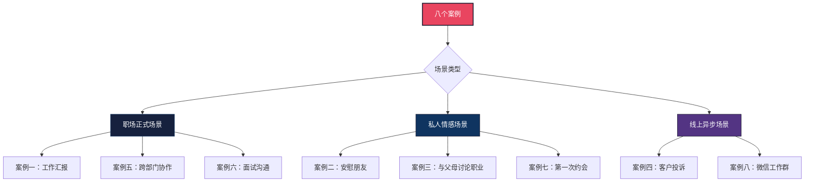
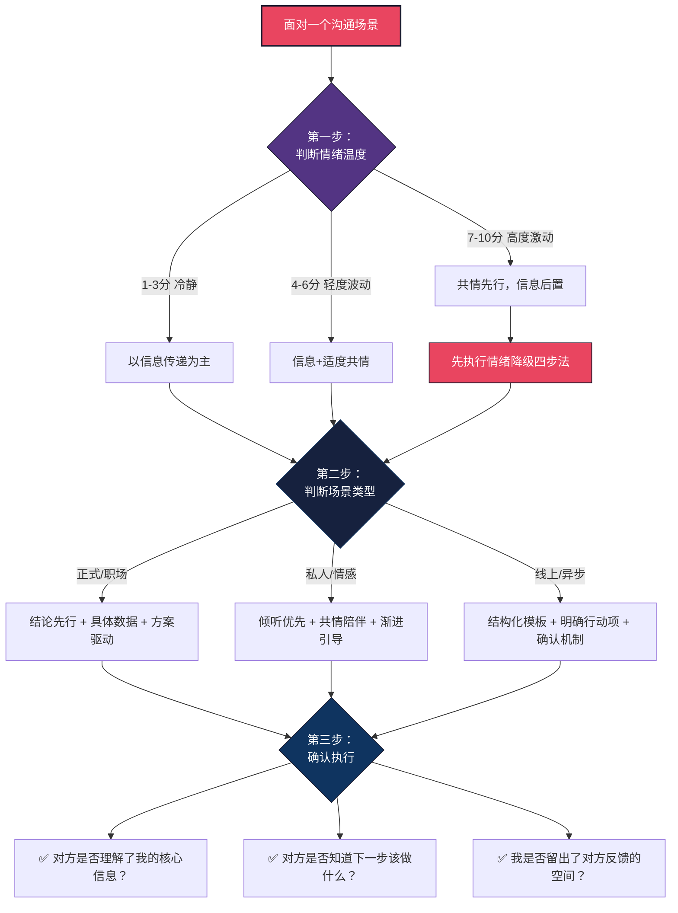

## 案例总结：八个场景背后的沟通操作系统

八个案例，八种场景——从会议室到咖啡馆，从家庭餐桌到微信工作群，从客户投诉热线到面试考场。表面上看，这些场景差异巨大：对象不同、目的不同、情绪基调不同、成功标准不同。但如果你退后一步，会发现它们共享同一套底层逻辑。

本节不是简单重复前面的内容，而是做三件事：

1. **提炼共性**——从八个案例中萃取跨场景通用的沟通法则
2. **构建框架**——建立一套可复用的「场景-策略-执行」三层决策系统
3. **提供工具**——给出可以直接带走的检查清单和自评量表

---

### 一、八个案例的全景回顾

在提炼规律之前，先用一张表快速回顾八个案例的核心信息。这不是简单的罗列，而是为了让你看到场景之间的结构性差异和共性。

| 案例 | 场景 | 对象关系 | 核心挑战 | 关键策略 | 情绪强度 |
|------|------|---------|---------|---------|---------|
| 一 | 工作汇报 | 上下级 | 结论先行 vs 叙事习惯 | PREP 结构 + 数据支撑 | 低-中 |
| 二 | 安慰朋友 | 平等亲密 | 解决问题 vs 共情陪伴 | 情感优先 + 陪伴技术 | 高 |
| 三 | 与父母谈职业 | 上对下（传统） | 代际价值观冲突 | 数据翻译 + 渐进说服 | 高 |
| 四 | 客户投诉 | 服务-被服务 | 情绪升级 vs 理性解决 | 情绪降级三步法 | 极高 |
| 五 | 跨部门协作 | 平行部门 | 利益冲突 vs 共同目标 | 利益绑定 + 降低对方成本 | 中 |
| 六 | 面试回答缺点 | 评估-被评估 | 坦诚 vs 自保 | 缺点翻转四步法 | 中-高 |
| 七 | 第一次约会 | 潜在亲密 | 展示 vs 试探 | 好奇心驱动 + 节奏控制 | 中 |
| 八 | 微信工作群 | 线上异步 | 信息噪音 vs 清晰传达 | 结构化模板 + 明确行动项 | 低 |

**观察**：情绪强度与信息密度往往成反比——情绪越高的场景，对方越听不进复杂信息，你的话术必须越简洁、越聚焦于情感连接。

---

### 二、跨场景的八条沟通法则

从八个案例中，可以提炼出八条经得住推敲的沟通法则。每条法则都有理论依据、适用边界和操作要点。

#### 法则一：先理解，再表达——倾听是表达的前置条件

**理论依据**：卡尔·罗杰斯（Carl Rogers）的「积极倾听」理论指出，人在感到被真正理解之前，不会对对方的建议或观点持开放态度。这不是礼貌问题，而是人类心理的硬性机制——大脑在未被「看见」之前会自动进入防御状态。

**案例验证**：

- 案例二（安慰朋友）：你不能一上来就说「别难过了，她不值得」。你得先让小王把痛苦说完，让他感到「你懂我」。
- 案例四（客户投诉）：客户说「你们的破产品害我损失了一万块」，你不能先解释退款流程——你得先说「我理解您现在的愤怒」。
- 案例三（与父母讨论）：父母说「创业会饿死的」，你不能直接反驳——你得先确认「你们是担心我的经济安全，对吗？」

**操作要点**：

1. **复述确认**：用自己的话重述对方的核心观点（「你的意思是……对吗？」）
2. **情感标注**：识别并命名对方的情绪（「听起来你很失望」「我能感受到你的焦虑」）
3. **延迟判断**：在对方表达完整之前，克制自己反驳或给建议的冲动

**适用边界**：这条法则在情绪强度高的场景中尤为重要（案例二、三、四）。在信息传递为主的场景中（案例八），倾听的比重会降低，但仍需确认接收方是否理解。

#### 法则二：结论先行——人类注意力是稀缺资源

**理论依据**：认知心理学中的「首因效应」（Primacy Effect）表明，人们对接收到的第一条信息印象最深、记忆最牢。同时，赫伯特·西蒙（Herbert Simon）的「有限理性」理论指出，决策者在信息过载时倾向于用最前面的信息做判断。

**案例验证**：

- 案例一（工作汇报）：「项目延期两周」必须是第一句话，不是第三段的第四句。领导需要在 10 秒内知道结论，然后决定是否继续听细节。
- 案例八（微信工作群）：「方案变更预告」是标题，不是最后一段的总结。群消息的注意力窗口更短——可能只有 3 秒。

**操作要点**：

1. **金字塔原则**：先说结论，再说原因，最后补充细节（麦肯锡的 Minto Pyramid）
2. **10 秒测试**：如果你的前 10 秒内容不能让对方知道核心信息，就需要重新组织
3. **标题化思维**：即使在口头沟通中，也要像写标题一样提炼核心信息

**适用边界**：在职场正式场景（案例一、五、六、八）中效果最强。在情感场景中（案例二、三、七），结论先行反而可能显得冷漠——你需要先建立情感连接，再传递理性信息。

#### 法则三：共情优先——情绪是理性对话的开关

**理论依据**：神经科学家安东尼奥·达马西奥（Antonio Damasio）的「躯体标记假说」证实，人类的决策过程本质上是情绪先行、理性后验。当杏仁核被强烈情绪激活时，前额叶皮层的理性功能会被抑制——这不是性格问题，而是大脑的生理机制。

**案例验证**：

- 案例二（安慰朋友）：小王在愤怒和否认交织的阶段，讲道理等于对牛弹琴。你只需要做到一件事：让他感到「我的痛苦是被看见的」。
- 案例四（客户投诉）：客户的杏仁核高度激活，他说的「我要投诉你们」本质上是「我很受伤，请你们在乎我」。
- 案例三（与父母讨论）：父母的反对表面是逻辑论证（「创业风险大」），底层是情绪（「我害怕失去你」）。

**操作要点**：

1. **情绪温度计**：先判断对方的情绪温度（1-10 分），7 分以上先处理情绪，7 分以下可以直接进入理性讨论
2. **情感同步**：用语气、表情、肢体语言与对方的情绪状态同步，而不是对抗
3. **情绪降级技术**：确认感受 → 命名情绪 → 表达理解 → 转入解决（四步法）

**适用边界**：高情绪场景（案例二、三、四）必须共情先行。低情绪场景（案例一、八）共情不是重点，但适度的人性化表达仍能提升效果。

#### 法则四：提供方案——带着答案来，而不是只带问题

**理论依据**：管理学中的「问题-方案」框架（Problem-Solution Framework）指出，提出问题的人如果同时提供至少两个备选方案，其可信度和被采纳率比单纯提问题的人高出 3 倍以上。这源于决策心理学中的「选择架构」——人们更倾向于在已有选项中做选择，而不是从零开始思考。

**案例验证**：

- 案例一（工作汇报）：「项目延期了」是问题。「我建议方案A：压缩测试周期，两周内追回；方案B：推迟上线一周，保证质量」是方案。
- 案例五（跨部门协作）：「你们部门必须配合」是要求。「我已拟好协作计划，需要你们部门每周 4 小时，我来协调资源」是方案。
- 案例三（与父母讨论）：「我要辞职创业」是惊吓。「我已存够 18 个月的生活费，有合伙人，先兼职试水」是方案。

**操作要点**：

1. **至少两个选项**：单一方案看起来像强制，两个方案看起来像讨论
2. **标注推荐**：明确说「我倾向方案A，因为……」而不是把决定权完全甩给对方
3. **承认风险**：每个方案都标注风险和应对措施，展示你的思考深度

#### 法则五：尊重对方——商量永远比命令有效

**理论依据**：社会心理学家罗伯特·恰尔迪尼（Robert Cialdini）的「互惠原则」和「尊重-服从」研究表明，当人感到被尊重时，配合意愿提升 40% 以上。反之，命令式语言会激活心理抗拒（Psychological Reactance）——人天生抵触被控制的感觉。

**案例验证**：

- 案例五（跨部门协作）：「你们部门必须配合」会引发抗拒。「能不能商量一下，看看怎么配合对你们部门也有利」会打开合作空间。
- 案例三（与父母讨论）：「我决定了，你们别管」会触发控制惯性。「我想听听你们的意见，然后一起看看怎么做最好」会降低防御。
- 案例八（微信工作群）：「收到请回复」比「所有人必须回复」更有效，因为它保留了对方的自主感。

**操作要点**：

1. **用「我们」代替「你」**：「我们怎么解决这个问题」vs「你必须解决这个问题」
2. **用提问代替指令**：「你觉得这个方案可行吗」vs「按这个方案执行」
3. **保留面子**：即使你有权力强制执行，也给对方一个台阶（「我知道你们也很忙」）

#### 法则六：具体化——模糊是信任的敌人

**理论依据**：沟通学中的「具体性效应」（Concreteness Effect）表明，具体的、可感知的信息比抽象信息更容易被理解、记住和信任。神经影像学研究证实，具体语言激活大脑的感觉运动皮层，而抽象语言只激活语言区——前者让信息「可触摸」，后者让信息「飘在空中」。

**案例验证**：

- 案例一（工作汇报）：「进度有点慢」是模糊。「进度落后 12 个百分点，已消耗 30 个工作日中完成了 35% 的工作量」是具体。
- 案例八（微信工作群）：「大概下周能确定」是模糊。「下周五（3月15日）前给出最终方案」是具体。
- 案例六（面试）：「我有时会过于追求完美」是空话。「我曾经因为反复修改一份报告的格式，导致迟交了两天，后来我学会了用时间盒来控制这个倾向」是具体。

**操作要点**：

1. **数据化**：用数字代替形容词（「提高了 30%」vs「提高了很多」）
2. **时间锚定**：用具体日期代替模糊时间（「周五下午 3 点」vs「最近」）
3. **行为化**：用可观察的行为代替抽象评价（「他连续三天迟到」vs「他态度不好」）

#### 法则七：确认理解——你以为的沟通完成，可能只是发送完成

**理论依据**：信息论创始人克劳德·香农（Claude Shannon）的通信模型揭示了一个残酷事实：信息从发送者到接收者的过程中，编码、传输、解码每一个环节都可能失真。沟通学者的研究表明，口头沟通的信息保真度平均只有 60-70%——也就是说，你说的每 10 句话，对方可能只准确理解了 6-7 句。

**案例验证**：

- 案例一（工作汇报）：领导说「我知道了」，你确定他知道的是你传达的那个版本吗？还是他自己脑补的版本？
- 案例八（微信工作群）：「收到请回复」是最低成本的确认方式，但它只确认收到了，不确认理解了。你需要追问「有没有不清楚的地方」。
- 案例五（跨部门协作）：技术部说「没问题」，但他们的「没问题」可能意味着「我们知道这件事了」，而不是「我们承诺按时完成」。

**操作要点**：

1. **回述确认**：请对方用自己的话复述关键信息（「你能说说你的理解吗？」）
2. **书面确认**：重要决策用文字记录并发送给所有相关方（会议纪要、确认邮件）
3. **里程碑检查**：长期任务设置中间检查点，而不是只在最后验收

#### 法则八：因人而异——没有放之四海而皆准的话术

**理论依据**：沟通适应理论（Communication Accommodation Theory, CAT）由霍华德·贾尔斯（Howard Giles）提出，指出有效的沟通者会根据对方的沟通风格、社会身份和关系动态调整自己的语言策略。这被称为「趋同策略」（Convergence）——不是模仿对方，而是在核心信息不变的前提下调整表达方式。

**案例验证**：

- 同样是「表达关心」：对失恋的朋友你需要沉默陪伴（案例二），对父母你需要展示计划（案例三），对约会对象你需要轻松幽默（案例七）。
- 同样是「说明问题」：对领导需要结论先行（案例一），对同事需要利益绑定（案例五），对客户需要情绪先行（案例四）。
- 同样是「请求配合」：对上级用请示（案例一），对平级用商量（案例五），对下级用授权（案例八的变体）。

**操作要点**：

1. **DISC 快速判断**：对方是 D（支配型，直接给结果）、I（影响型，先聊感情）、S（稳健型，给安全感）、C（谨慎型，给数据）？
2. **关系定位**：你和对方是上下级、平级、服务关系还是亲密关系？关系决定了话术的基调。
3. **文化敏感度**：中国语境下的面子文化、含蓄表达、长幼有序，与西方的直接沟通风格有本质差异。

---

### 三、场景决策框架：遇到任何沟通场景的三步判断法

八条法则很好，但现实中的沟通场景往往不是「只用一条法则」，而是需要多条法则组合使用。下面这个三步框架帮你快速做出决策。

#### 第一步：判断情绪温度

| 温度 | 对方状态 | 你的应对策略 | 对应法则 |
|------|---------|------------|---------|
| 1-3 分 | 冷静、理性、专注 | 直接进入信息传递 | 法则二（结论先行）、法则六（具体化） |
| 4-6 分 | 轻度焦虑、犹豫、不耐烦 | 先简短确认情绪，再进入正题 | 法则三（共情优先）的轻量版 |
| 7-10 分 | 愤怒、崩溃、极度焦虑 | 先执行情绪降级，情绪温度降到 5 分以下再谈正事 | 法则三（共情优先）的完整版 |

**情绪降级四步法**（适用于温度 7 分以上的场景）：

1. **确认感受**：「我能感受到你现在非常……」
2. **命名情绪**：「这种感觉是愤怒/失望/委屈/恐惧……」
3. **表达理解**：「换成我，我也会这样。」
4. **转入解决**：「现在我们一起来看看怎么解决。」（仅在情绪温度降到 5 分以下后执行）

#### 第二步：判断场景类型

**正式/职场场景**（案例一、五、六）：
- 核心策略：结论先行 + 数据驱动 + 方案导向
- 主要法则：法则二、四、六
- 注意事项：保持专业但不冷漠，适度人性化

**私人/情感场景**（案例二、三、七）：
- 核心策略：情感连接 + 倾听优先 + 渐进引导
- 主要法则：法则一、三、五
- 注意事项：不急于解决问题，先建立信任

**线上/异步场景**（案例四、八）：
- 核心策略：结构化表达 + 明确行动项 + 确认机制
- 主要法则：法则二、六、七
- 注意事项：线上缺乏非言语线索，需要更精确的语言

#### 第三步：确认执行

无论什么场景，沟通结束前都要完成三个确认：

1. **理解确认**：对方是否准确理解了你的核心信息？
2. **行动确认**：对方是否知道下一步该做什么？
3. **反馈确认**：你是否留出了对方表达疑虑的空间？

---

### 四、从案例中提炼的高频话术模板

理论和法则最终要落地到具体的话术。以下是从八个案例中萃取的高频场景话术模板，经过提炼和泛化处理，可以直接用于类似场景。

#### 4.1 汇报类话术（对应案例一、八）

**PREP 结构**：

观点（Point）：我想汇报一下XX项目的最新进展。
原因（Reason）：目前项目遇到了两个关键问题，可能影响上线时间。
例子（Example）：具体来说，接口对接延迟了5天，设计稿返工了2次。
重申（Point）：我建议调整上线时间到3月22日，同时采取两个追赶措施。

**问题+方案模板**：

现状：[一句话说明当前状态]
问题：[用数据说明问题]
影响：[说明不解决的后果]
建议：[至少两个方案，标注推荐]
下一步：[明确下一步行动和时间节点]

#### 4.2 安慰类话术（对应案例二）

**三阶段模板**：

阶段一（前15分钟）：只听不说
  - 「我在听，你慢慢说。」
  - 「嗯，然后呢？」
  - 「这确实很难受。」

阶段二（情绪缓和后）：轻量回应
  - 「你的感受完全可以理解。」
  - 「换谁遇到这种情况都会这样。」
  - 「你愿意说这些给我听，我很感谢你的信任。」

阶段三（对方主动问意见时）：谨慎建议
  - 「你问我的话，我觉得……但这只是我的看法。」
  - 「你最了解自己的情况，我支持你的决定。」

#### 4.3 说服类话术（对应案例三、五）

**利益翻译模板**：

对方的担忧 → 你的回应结构：
1. 确认担忧的合理性：「你说的对，这个风险确实存在。」
2. 提供数据对冲：「根据XX数据/我的调研，这个风险的概率是……」
3. 展示兜底方案：「即使最坏情况发生，我准备了……」
4. 降低对方成本：「我不需要你们……只需要你们……」

#### 4.4 情绪处理类话术（对应案例四）

**投诉处理模板**：

第一步：「非常抱歉给您带来了不好的体验。」（不辩解）
第二步：「我完全理解您现在的感受，换我也会很生气。」（共情）
第三步：「我来帮您解决这个问题。」（转入行动）
第四步：「我建议这样处理……您看可以吗？」（征求同意）
第五步：「我会在XX时间内给您反馈。」（承诺跟进）

---

### 五、常见错误模式：从反面强化正确认知

八个案例中都展示了「错误示范」。把这些错误抽象出来，可以看到六个反复出现的错误模式。

| 错误模式 | 典型表现 | 出现案例 | 正确做法 |
|---------|---------|---------|---------|
| 自说自话 | 不管对方状态，只顾自己表达 | 一、二、三、七 | 先观察对方状态，再决定说什么 |
| 解决问题优先 | 对方要的是情感支持，你给的是解决方案 | 二、三 | 先问「你需要建议还是只想聊聊？」 |
| 信息过载 | 一次性倾倒太多信息，对方无法消化 | 一、五、八 | 分层传递：核心 → 重要 → 补充 |
| 模糊表达 | 用「大概」「可能」「尽快」代替具体承诺 | 一、四、八 | 用数据和日期替换每一个模糊词 |
| 防御姿态 | 被质疑时本能辩解，而非倾听 | 三、四 | 先确认对方的合理部分，再表达自己的立场 |
| 忽略确认 | 以为说完了对方就理解了 | 一、五、八 | 主动询问「你对这个方案有什么疑问？」 |

**自我检测**：回顾你过去一周的沟通，是否出现过以上任何一种错误模式？如果出现了，是在什么场景下、对谁出现的？识别模式是改变的第一步。

---

### 六、沟通能力自评量表

学完八个案例，用下面这个量表评估自己的沟通能力。请诚实作答——这个量表只对你自己有意义。

**评分标准**：1=几乎做不到 2=偶尔能做到 3=经常能做到 4=稳定做到

| 序号 | 能力项 | 自评 |
|------|-------|------|
| 1 | 我能在开口前先理解对方的真实需求 | __ |
| 2 | 我能在正式场合做到结论先行 | __ |
| 3 | 我能在对方有情绪时先处理情绪 | __ |
| 4 | 我提出问题时会同时带解决方案 | __ |
| 5 | 我用商量的语气而不是命令的语气 | __ |
| 6 | 我用具体的数据和时间代替模糊表述 | __ |
| 7 | 我会在沟通结束后确认对方是否理解 | __ |
| 8 | 我能根据不同对象调整沟通方式 | __ |
| 9 | 我能在冲突中保持冷静和尊重 | __ |
| 10 | 我能识别对方的情绪并做出回应 | __ |

**解读**：

- **32-40 分**：你的沟通基础扎实，后续章节的进阶技巧会进一步提升你
- **24-31 分**：基础良好但有明显短板，建议重点强化得分最低的 2-3 项
- **16-23 分**：沟通基础需要系统提升，建议认真重读本章并完成练习
- **10-15 分**：沟通是你的关键短板，好消息是这完全可以通过练习提升

---

### 七、八个案例的法则映射总览

最后，用一张全景图展示每个案例用到的核心法则，帮助你看到法则在不同场景中的组合方式。

| 法则 | 案例一 | 案例二 | 案例三 | 案例四 | 案例五 | 案例六 | 案例七 | 案例八 |
|------|-------|-------|-------|-------|-------|-------|-------|-------|
| ①先理解再表达 | ○ | ● | ● | ● | ○ | ○ | ● | ○ |
| ②结论先行 | ● | ○ | ○ | ○ | ● | ● | ○ | ● |
| ③共情优先 | ○ | ● | ● | ● | ○ | ○ | ● | ○ |
| ④提供方案 | ● | ○ | ● | ● | ● | ○ | ○ | ○ |
| ⑤尊重对方 | ○ | ○ | ● | ○ | ● | ○ | ● | ● |
| ⑥具体化 | ● | ○ | ○ | ○ | ○ | ● | ○ | ● |
| ⑦确认理解 | ● | ○ | ○ | ○ | ● | ○ | ○ | ● |
| ⑧因人而异 | ○ | ○ | ● | ○ | ● | ● | ● | ○ |

> **● 核心法则**（该场景的主要成功因素）　　**○ 辅助法则**（该场景的锦上添花因素）

**模式发现**：

- **情绪型场景**（案例二、四）共情法则是核心，结论先行反而有害
- **信息型场景**（案例一、八）结论先行和具体化是核心，共情是辅助
- **关系型场景**（案例三、五、七）尊重和因人而异是核心，需要长期经营
- **评估型场景**（案例六）因人而异和具体化是核心，需要策略性展示

---

### 八、从「知道」到「做到」：刻意练习建议

知识不等于能力。你读完这八个案例、理解了八条法则，但这并不意味着你明天就能在真实场景中运用自如。从「知道」到「做到」需要刻意练习。

**练习一：场景复盘（每天 5 分钟）**

每天结束时，回想一次当天的沟通——可以是一次会议、一条微信、一次对话。问自己三个问题：

1. 当时对方的情绪温度是多少？
2. 我用了哪些法则？用对了吗？
3. 如果重来一次，我会怎么调整？

**练习二：话术预演（重要沟通前 10 分钟）**

在重要沟通之前（汇报、谈判、敏感对话），用纸笔写下：

1. 我的核心结论是什么？（一句话）
2. 对方最可能的反应是什么？
3. 我的第一句话是什么？

**练习三：录像回看（每周 1 次）**

如果条件允许，录下自己的一次沟通（需征得对方同意），然后回看。关注：

1. 我的语速是否合适？
2. 我是否给了对方足够的回应空间？
3. 我的表情和肢体语言是否与语言一致？

---

### 九、延伸思考：沟通的元认知

最后，分享一个更高层面的思考：**你不仅要会沟通，还要会思考「沟通」这件事本身。**

这就是元认知（Metacognition）——对自己思维过程的觉察和调控。在沟通中，元认知意味着：

- **觉察偏见**：我知道自己有「解决问题优先」的倾向吗？（这对案例二的场景是致命的）
- **识别模式**：我是否在重复同一种沟通错误？（比如每次和父母讨论都以吵架收场）
- **主动调整**：当我意识到当前策略不奏效时，我能实时切换吗？

八个案例提供的是「内容层面」的知识——在什么场景说什么话。但真正让你成为沟通高手的，是「过程层面」的能力——在沟通进行中实时觉察、评估和调整。

> 📌 **下一节预告**：了解了正确的做法之后，下一节我们来看看常见的沟通误区——那些我们经常犯但不自知的错误。如果说案例教的是「应该怎么做」，误区教的是「绝对不要怎么做」——两者结合，你的沟通能力才算完整。
