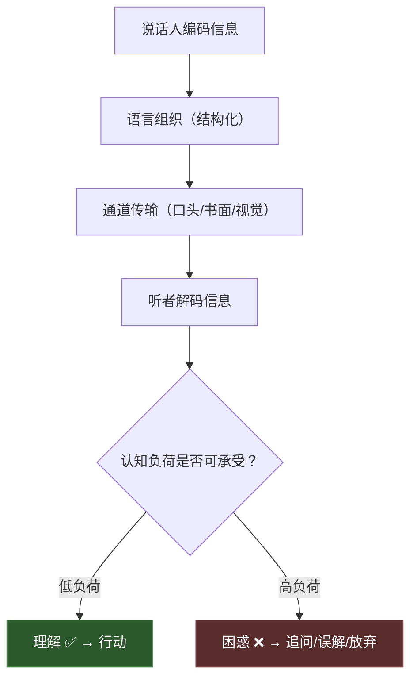
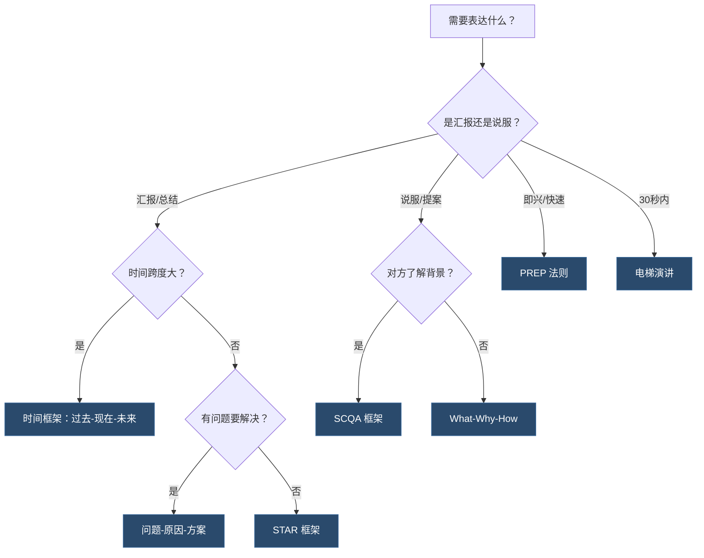

## 一、清晰表达的技巧

清晰表达是沟通的底层操作系统——不是锦上添花的高级技巧，而是决定一切沟通成败的基础设施。本节将从认知科学原理出发，逐步构建完整的清晰表达方法论：先理解"为什么清晰表达如此困难"，再掌握"怎样做到清晰表达"，最后通过刻意练习将方法内化为本能。

### 为什么清晰表达是一切沟通的基石

职场中约 70% 的沟通问题并非源于"态度不好"或"立场不同"，而是源于表达本身含混不清——听者花了大量认知资源去"猜"说话人的意思，猜对了算运气，猜错了就变成冲突。这个数据来自 Holmes Report 对 400 家企业的调研，其背后有坚实的认知科学解释。

#### 清晰表达的认知科学基础

人类工作记忆容量有限（Miller 的 7±2 法则，现代研究修正为 4±1），在接收信息时，大脑会自动进行"组块化"（chunking）处理。清晰表达的本质就是：**主动帮对方完成组块化，降低认知负荷**。

认知负荷理论（Cognitive Load Theory）将信息处理中的负荷分为三类：

| 负荷类型 | 含义 | 清晰表达的影响 |
|----------|------|----------------|
| 内在负荷（Intrinsic） | 信息本身的复杂度 | 无法消除，但可以分层传递 |
| 外在负荷（Extraneous） | 表达方式造成的额外负担 | **可以也必须消除**——这是清晰表达的主战场 |
| 相关负荷（Germane） | 帮助建立心智模型的有效负荷 | 应当增加——好的类比和框架在此发挥作用 |

清晰表达的核心策略是：**最小化外在负荷，优化内在负荷的递进节奏，最大化相关负荷**。

**核心洞察**：清晰表达不是让自己"说清楚"，而是让对方"听明白"。这两件事有本质区别——前者关注输出，后者关注接收效果。你以为自己说清楚了，不代表对方听明白了。中间隔着编码方式、通道损耗、解码能力三层过滤器。

#### 不清晰表达的典型代价

不清晰的表达不是"不太好"，而是有实实在在的代价。理解这些代价，才能真正重视清晰表达：

| 场景 | 不清晰的表达 | 实际后果 | 量化损失 |
|------|-------------|----------|----------|
| 工作汇报 | "项目进展还行，有些问题在处理" | 领导无法判断是否需要介入，失去信任 | 后续需要额外 2-3 次汇报来弥补信息缺口 |
| 需求传达 | "这个功能做得好用一点" | 开发理解偏差，返工 3-5 天 | 按人均日成本 2000 元算，返工损失 6000-10000 元 |
| 客户沟通 | "我们的方案性价比很高" | 客户无法对比竞品，决策延迟 | 平均延长销售周期 2-4 周 |
| 团队协作 | "你帮我处理一下那个事" | 同事不知道具体做什么、什么标准、何时完成 | 沟通往返 3-5 次才对齐，或执行错误 |
| 冲突解决 | "你总是这样" | 对方进入防御模式，沟通升级为争吵 | 关系损伤，修复成本远超一次清晰表达的投入 |
| 邮件沟通 | 写了 800 字邮件但结论在最后一段 | 收件人跳读或忽略，关键信息丢失 | 需要追加邮件或电话确认 |

**关键认知**：清晰表达的成本是一次性的（花 10 分钟想清楚再说），不清晰表达的成本是持续性的（反复解释、纠正、弥补）。前者的 ROI 远高于后者。

### 说话之前：先想清楚

很多人"说不清楚"的根源不在嘴上，而在脑子里——还没想清楚就开口了。清晰表达的第一步不是"怎么说"，而是"想什么"。

#### 三秒自检法

每次开口前，用三秒钟在脑中回答三个问题：

1. **一句话结论是什么？**（如果只能说一句，你说什么？）
2. **对方需要知道什么？**（不是"我想说什么"，而是"对方需要听什么"）
3. **对方听完会问什么？**（预判疑问，提前准备答案）

这个三秒自检看似简单，但它强制你从"我要输出什么"切换到"对方需要接收什么"——这正是清晰表达的核心思维转换。

#### 信息筛选矩阵

想清楚之后，还需要筛选信息。不是所有你知道的都需要说出来：

| | 对方需要知道 | 对方不需要知道 |
|---|---|---|
| **你知道** | ✅ 必须说（核心内容） | ⚠️ 备用（对方问了再说） |
| **你不知道** | ❌ 承认不知道，承诺跟进 | ➖ 不涉及 |

**实操要点**：大多数人的问题是把"你知道但对方不需要知道"的信息也说了出来——这就是冗余的来源。克制"把我知道的都说出来"的冲动，是清晰表达的重要修炼。

#### 思维外化工具

有些时候信息太复杂，光靠脑中组织不够。以下工具可以帮助你在开口前快速整理思路：

**工具1：便利贴法**
把所有想说的点写在便利贴上（每张一个点），然后分类排列。同类的放在一起，排好优先级，最后只讲最重要的那一组。适合准备重要汇报或提案。

**工具2：提纲速写法**
花 2 分钟写一个极简提纲：
结论：____
理由1：____
理由2：____
理由3：____
例子：____
行动：____
六个空填满，表达结构就出来了。

**工具3：反向检验法**
假设你是听众，看完自己的提纲后问："我能从中得到什么行动指令？"如果答不上来，说明结论不够清晰。

### 1.1 金字塔原理：先说结论

**核心思想**：先说最重要的结论，再说支撑的理由和细节。这一原则来自麦肯锡顾问 Barbara Minto 的《金字塔原理》，是全球咨询行业最核心的表达训练，至今仍是麦肯锡新员工入职培训的必修课。

#### 为什么"结论先行"有效

很多人说话习惯"铺垫"——先说背景、过程、细节，最后才说结论。这种方式在小说叙事中有效（制造悬念），但在信息传递中是反人类的。原因有三：

1. **注意力衰减曲线**：听者的注意力在前 30 秒最高，之后快速下降。心理学实验表明，听者对前 30 秒信息的记忆保留率约为 70%，而第 5 分钟之后的信息保留率降到 20% 以下。如果结论在最后，你最想传达的信息恰好落在注意力最弱的区间。

2. **认知锚定效应**：先听到结论的人，会自动用结论作为"框架"去理解后续信息，理解效率大幅提高。反过来，没有框架的听众在听细节时不知道"这些信息要说明什么"，容易迷失。这就是为什么听完别人 10 分钟铺垫后你常常问"所以你想说什么？"

3. **决策效率**：多数职场沟通的目的是推动决策。决策者需要先知道"你要我做什么"，再决定"我要不要听你的理由"。哈佛商学院的研究显示，结论先行的汇报平均决策时间比铺垫式汇报缩短 60%。

4. **容错性**：如果沟通被打断（电话响了、领导被叫走了），结论先行的表达至少保证了最重要的信息已经传递出去。铺垫式表达一旦被打断，什么都没传达。

#### 金字塔结构详解

结论（最重要的1句话）
├── 支撑理由1（对应一个论点）
│   ├── 事实/数据 1.1
│   └── 事实/数据 1.2
├── 支撑理由2
│   ├── 事实/数据 2.1
│   └── 事实/数据 2.2
└── 支撑理由3
    └── 事实/数据 3.1

**关键规则**：
- 每一层的内容必须是上一层的"为什么"或"怎么做"
- 同一层级的内容必须相互独立、完全穷尽（MECE 原则——Mutually Exclusive, Collectively Exhaustive）
- 每个论点最好有 2-3 个支撑，不要超过 5 个（超过 5 个时应归类合并）
- 最底层必须是可验证的事实或数据，不是观点
- 每个论点都能独立支撑结论——即使去掉其他论点，这一个也能让结论成立

**MECE 原则详解**：

MECE 是金字塔原理的核心约束。"相互独立"意味着各理由之间没有重叠，"完全穷尽"意味着所有理由加在一起能完整支撑结论。

| 原则 | 正确示例 | 违反示例 |
|------|----------|----------|
| 相互独立 | 理由按"成本、效果、风险"分类 | 理由是"成本低、价格便宜、花钱少"——三个理由说的是同一件事 |
| 完全穷尽 | 涵盖了所有关键维度 | 只说了"技术可行"和"成本可控"，漏掉了"团队能力"这个维度 |

#### 实操示例对比

**❌ 错误方式（铺垫式）：**
> "上周我调研了市场，发现竞品A出了新功能，然后我又分析了我们的数据，发现用户流失率在上升，另外我还跟几个客户聊了聊，他们反映了一些问题……所以我建议我们也应该开发新功能。"

问题分析：听者在前 60 秒不知道这段话的"目的"是什么，信息碎片化，结论被埋在最后。如果领导在第三句话时走神了，后面全部白说。

**✅ 正确方式（结论先行）：**
> "我建议我们开发新功能。原因有三个：第一，竞品A已经推出了类似功能，我们的功能差距在拉大；第二，我们的用户流失率在上升，从上月的 5% 升到 8%，新功能可以提升留存；第三，客户调研中 70% 的受访者明确表达了这个需求。"

**✅ 进阶版（结论+价值量化）：**
> "我建议投入两周开发XX功能，预计可以将用户留存率从 8% 降到 5%，相当于每月减少约 200 个用户流失，按 ARPU 50 元计算，月增收 1 万元。支撑依据有三个：竞品对比数据显示我们的功能缺口、流失率数据证实了紧迫性、客户调研验证了需求真实性。详情我准备了文档，需要的话会后再看。"

**进阶版好在哪里？** 它不仅结论先行，还做了三件事：量化了价值（让决策者看到回报）、预留了深度信息（文档）、给了决策者选择权（"需要的话会后再看"）——这才是专业级的汇报。

#### 金字塔原理的适用场景与变体

| 场景 | 变体 | 说明 |
|------|------|------|
| 正式汇报 | 标准金字塔 | 结论→理由→数据，逐层展开 |
| 即兴发言 | 简化版：结论+1个理由 | 不超过 30 秒，只给最硬的理由 |
| 说服决策者 | 结论+风险+应对 | 先说结论，主动预判反对意见并回应 |
| 书面报告 | 结论→执行摘要→正文→附录 | 决策者只看前两层，执行者看全文 |
| 坏消息 | 缓冲→结论→影响→补救措施 | 不能太直接，但结论仍然要在前半段出现 |
| 跨部门沟通 | 结论→共同利益→行动请求 | 强调"对我们双方的好处"，而非单方面诉求 |

#### 常见误区

- **误区1：认为结论先行"不礼貌"**。实际上，在正式场合绕圈子才不礼貌——你在浪费听者的时间。不同文化的接受度不同（详见后文"文化适配"），但在中国职场中，结论先行已经成为主流趋势，尤其在互联网和金融行业。

- **误区2：结论太模糊**。"我觉得这个方案还行"不是结论，"我建议采用方案B，因为它在成本和效果的平衡上最优"才是。结论必须包含**立场**（你建议什么）和**核心理由**（为什么）。

- **误区3：理由和结论不对应**。说了结论是"A"，给出的理由却在证明"B"，逻辑链条断裂。检验方法：在每个理由后面加"所以结论是……"，如果听起来别扭，说明逻辑链有问题。

- **误区4：理由太多**。超过 5 个理由不仅不会加强说服力，反而会稀释核心论点。人的工作记忆只能容纳 4±1 个信息块。把 10 个理由归类为 3 个大类，比罗列 10 个小点更有效。

- **误区5：把数据当结论**。"上月 DAU 下降了 20%"是数据，不是结论。结论是"因为XX原因导致 DAU 下降 20%，我建议采取XX措施"。数据是支撑结论的证据，不是结论本身。

### 1.2 PREP 法则：四步表达法

PREP 是最简洁的"万能表达公式"，适合 90% 的日常沟通场景。它比金字塔原理更轻量，更适合即兴场景。

#### 四步拆解

| 步骤 | 英文 | 含义 | 时间占比 |
|------|------|------|----------|
| P | Point | 先说你的核心观点 | 10-15% |
| R | Reason | 给出支撑的理由 | 25-30% |
| E | Example | 用具体案例或数据说明 | 40-50% |
| P | Point | 重申观点，推动行动 | 10-15% |

**为什么 Example 占比最高？** 因为人的大脑对故事和场景的记忆力是抽象概念的 22 倍（Stanford 研究）。一个好例子胜过十个论据。人类的镜像神经元系统在听到具体场景时会被激活——大脑会"代入"场景，这种代入感让信息变得难忘。

#### 完整示例

**场景：说服领导同意团队每周做复盘**

- **观点（P）**：我认为团队应该每周做一次复盘，时长控制在 30 分钟以内。
- **理由（R）**：因为定期复盘可以帮助我们及时发现问题、避免小问题积累成大危机。
- **举例（E）**：上个月我们做了一次项目复盘，发现了流程中的两个瓶颈——需求评审缺少 checklist 导致返工率高，测试环境部署手动操作导致每次浪费 2 小时。优化后，返工率从 15% 降到 5%，部署时间从 2 小时缩短到 15 分钟，整体效率提升了 30%。
- **重申（P）**：所以，每周花 30 分钟复盘，换来的效率提升远超这个投入。这周开始试行可以吗？

#### PREP 的变体

**变体1：PREP+Action（增加行动号召）**
在最后的 Point 之后加上明确的"下一步"：
> "所以我建议这周开始试行。具体做法是每周五下午 4 点，30 分钟，我来主持第一次，可以吗？"

这个变体的关键是行动必须具体——"我们以后多复盘"是空话，"每周五下午 4 点，30 分钟"才是可执行的行动。

**变体2：PREP+A（增加 Address Objection，预判反驳）**
在理由和举例之间加入对反对意见的回应：
> "可能有人觉得每周开会浪费时间。但实际上，30 分钟的复盘能节省后续至少 3 小时的救火时间。"

预判反驳是说服力的倍增器——你主动回应了对方的顾虑，就不需要等对方提出来再被动应对。

**变体3：PRES（用 Summary 替代最后的 Point）**
适用于信息量大的场景，最后用一句话总结全部要点：
> "总结一下：复盘频率每周一次，时长 30 分钟，上周的试点已经证明效果。"

#### PREP 的深度应用技巧

**技巧1：Example 选择的三个标准**
- **相关性**：例子必须直接支撑你的理由，不能是"有道理但关系不大"
- **具体性**：有时间、有数据、有结果，不是"有一次我们……效果不错"
- **共鸣性**：听者能代入，最好用听者熟悉的场景

**技巧2：Point 的"行动化"改造**
| 普通 Point | 行动化 Point |
|-----------|-------------|
| "复盘很重要" | "这周开始每周五做复盘" |
| "我们需要改进" | "下周启动XX改进计划" |
| "这个方案更好" | "我建议采用方案B，下周一启动" |

**技巧3：Reason 的"三层递进"**
不要只给一个理由，也不要给太多。三个理由按说服力排序：
1. 最硬的理由（数据支撑）
2. 次硬的理由（逻辑推导）
3. 补充的理由（类比或常识）

#### 何时使用 PREP

PREP 最适合以下场景：
- 会议发言、即兴表达
- 回答"你怎么看？""你觉得呢？"类问题
- 邮件开头的关键观点陈述
- 面试中的行为问题回答

PREP 不太适合的场景：
- 需要深入分析的复杂问题（用金字塔原理）
- 需要多方讨论的开放性议题（先发散再收敛）
- 需要情感共鸣的场景（先讲故事再讲道理）
- 需要说服高度抗拒的对象（用 SCQA 框架建立紧迫感）

### 1.3 KISS 原则：简洁为王

KISS = Keep It Short and Simple（保持简短和简单）。这个原则源于美国海军的设计哲学——在战场环境下，系统越简单越可靠。沟通也是如此：在信息过载的时代，简洁的表达存活率最高。

简洁不是"少说话"，而是**只说必要的话**。

#### 简洁的认知科学依据

- **注意力窗口**：成年人的持续注意力窗口约 8-20 分钟，之后需要"重置"。TED 演讲定在 18 分钟不是巧合——这是注意力窗口的上限。在 8 分钟内传达核心信息是最佳策略。

- **信息过载效应**：当信息量超过工作记忆容量时，人的反应不是"记住更多"，而是"全部放弃"——这就是为什么冗长的邮件会被跳读，超过 3 页的 PPT 让人走神。

- **选择悖论**（Barry Schwartz）：给对方太多选项（信息），对方反而更难做出决策。一个经典的果酱实验表明，面对 24 种果酱的消费者，购买率只有面对 6 种果酱时的 1/10。信息同理。

- **峰终定律**（Kahneman）：人们对一段经历的记忆取决于"峰值"和"结尾"。冗长的表达没有峰值（因为太平淡），结尾也被遗忘（因为注意力已耗尽）。简洁的表达更容易在峰值处留下印象。

#### 具体做法

**字词层面：**
- 一句话能说清的，不用两句话
- 用简单的词代替复杂的词："用"代替"使用"，"因为"代替"鉴于"，"所以"代替"综上所述"
- 去掉口头禅和填充词："嗯""那个""就是说""然后呢""基本上"
- 去掉冗余修饰："非常十分特别地好" → "很好"
- 去掉无意义的限定词："我个人认为我觉得" → 直接说观点

**句子层面：**
- 每句话只表达一个意思
- 主语和谓语尽量靠近，避免长定语从句
- 用主动语态代替被动语态："我们完成了目标" vs "目标被我们完成了"
- 长句拆短句：超过 30 字的句子考虑拆分
- 消灭"的的的"：连续三个"的"字通常意味着句子需要重组

**段落层面：**
- 每个段落只讲一个主题
- 段落之间有明确的逻辑连接（因果、递进、转折、并列）
- 口头表达时，每讲完一个要点，用一句话做"路标"过渡到下一个

**信息密度管理——"1-3-5 法则"：**
- 核心信息：1 个（必须传达成功）
- 重要信息：3 个（应该传达成功）
- 次要信息：5 个以内（传达了算赚到，没传达也无妨）
- 超过 5 个信息点？必须分批传递，或者写成文档

这个法则的依据是 Miller 的工作记忆容量理论（4±1 个组块）。1 个核心信息确保"绝对不会忘"，3 个重要信息在记忆容量内，5 个是上限——超过就溢出了。

#### 简洁 vs 简陋：关键区别

| 简洁（✅） | 简陋（❌） |
|-----------|-----------|
| 信息密度高，每句话都有价值 | 信息不足，听者需要反复追问 |
| 删除冗余后保留完整的逻辑链 | 删除了关键细节导致逻辑断裂 |
| 听者能根据表达采取行动 | 听者只得到模糊印象，无法行动 |
| "周三下午5点前提交报告" | "尽快交" |
| "方案A成本低但周期长，方案B反之" | "两个方案各有优缺点" |

**判断标准**：简洁到"对方不需要追问任何关键信息"就是最佳状态。如果对方还需要问"什么时候？""具体怎么做？""标准是什么？"，说明你删多了。简洁的最高境界是**字字有用，句句可执行**。

#### 书面表达的简洁技巧

口头表达的简洁和书面表达的简洁略有不同。书面表达有额外的空间来做简洁优化：

**邮件简洁三原则：**
1. 标题即结论："【需审批】Q3 市场预算增加 20 万" 优于 "关于市场预算的一些想法"
2. 正文第一句话就是核心请求或结论
3. 超过 5 行的邮件加粗关键信息，方便跳读

**即时消息简洁原则：**
1. 一条消息只说一件事
2. 把请求放在消息开头，不是结尾
3. 需要对方做什么，用明确的动词开头："请审批""请确认""请反馈"

### 1.4 使用具体的语言

抽象的语言让人困惑，具体的语言让人行动。这一条看似简单，却是大多数人表达中最频繁犯的错误。

#### 为什么抽象表达如此普遍

抽象表达的根源有三个：
1. **省力心理**：抽象词汇是"压缩包"，说话人觉得自己省了时间，但解压成本转嫁给了听者
2. **安全心理**：抽象表达模糊了立场，不容易出错——"还需要进一步研究"比"这个方案不行"安全得多
3. **知识诅咒**：你知道某个概念的完整含义，所以觉得一个词就够了，但听者没有你的知识背景

#### 抽象→具体的转换方法

| 抽象表达 | 具体表达 | 转换方法 |
|----------|----------|----------|
| "尽快完成" | "周三下午5点前完成" | 加上时间锚点 |
| "效果不错" | "转化率从 3% 提升到 4.5%" | 加上数据 |
| "注意形象" | "穿深色正装，带好名片和资料" | 加上动作指令 |
| "加强沟通" | "每天早上9点开15分钟站会" | 加上频率和形式 |
| "质量有问题" | "这批产品中有5%存在色差" | 加上具体缺陷描述 |
| "多关注用户" | "每周看10条用户评价，记录Top3问题" | 加上可执行动作 |
| "提升能力" | "本月完成XX课程，拿到认证" | 加上具体目标 |
| "优化流程" | "把审批环节从5个减到3个" | 加上量化指标 |
| "赋能业务" | "给销售团队提供客户画像看板" | 去掉抽象动词，换成具体动作 |
| "形成闭环" | "需求→开发→上线→数据验证→迭代" | 拆解抽象概念为具体步骤 |
| "深度协同" | "每周三和产品组开30分钟对齐会" | 用具体行为替换抽象概念 |

#### 让表达具体的五种工具

**工具1：数字**
> "我们的用户增长很快" → "我们的月活用户从 10 万增长到 25 万，增幅 150%"

数字是最高效的具体化工具。注意选择"有感知力"的数字——"增长 150%"比"增长 15 万"更直观（百分比体现变化幅度），但"每月多服务 15 万用户"比两个数字都更直观（体现实际影响）。

**选择数字的原则**：
- 对比选大的：如果绝对值大就用绝对值（"增长 1500 万"），如果百分比大就用百分比（"增长 150%"）
- 带上参照系：单独的数字没有意义，"月活 25 万"不如"月活 25 万，行业前三"
- 用可感知的类比："$100 万"不如"够买一套北京的房子"

**工具2：类比**
> "这个API的响应时间太长了" → "这个API的响应时间像高峰期打车——点一下要等3秒才出结果，用户早就跑了"

类比用对方已知的概念来解释未知的内容。选类比的原则是：对方一定能秒懂，不会产生歧义。好的类比还能揭示深层结构——"API 像菜单"不仅解释了 API 是什么，还暗示了"你不需要知道内部实现"这个关键特征。

**类比选择的三个层次**：
- 生活类比：用日常生活经验（适合非技术受众）
- 行业类比：用同行业已知概念（适合跨团队沟通）
- 模型类比：用数学或科学模型（适合技术讨论）

**工具3：场景还原**
> "用户体验不好" → "用户打开App后，需要点5次才能找到支付入口，期间会遇到2次加载等待"

把抽象评价还原成用户的具体行为路径，听者能"看见"问题。场景还原的关键是**用动作序列描述**，而不是用形容词评价。

**工具4：对比锚定**
> "我们的服务很好" → "行业平均响应时间是 24 小时，我们做到了 2 小时"

没有对比的数字是孤立的。给出参照系（行业平均、竞品水平、历史数据），让数字有"意义"。对比锚定的三种常用参照：
- 行业基准：与行业平均水平比
- 竞品对比：与直接竞争对手比
- 历史对比：与自己的过去比

**工具5：行动清单**
> "我们需要改善客户体验" → "三件事：第一，客服响应时间从 24 小时缩短到 2 小时；第二，退款流程从 5 步简化到 2 步；第三，差评 24 小时内必须回复"

把模糊的"改善"拆解成具体的、可执行的、可检查的动作。好的行动清单满足 SMART 原则：具体（Specific）、可衡量（Measurable）、可达成（Achievable）、相关（Relevant）、有时限（Time-bound）。

### 1.5 结构化表达的万能框架

掌握以下框架，可以在任何场景下快速组织语言。框架不是死板的模板，而是思维的脚手架——熟练之后可以灵活变形。

#### 框架1：时间框架——"过去……现在……未来……"

**适用场景**：总结汇报、规划展望、项目回顾、年终述职

**结构**：
- 过去：我们做了什么，得到了什么结果
- 现在：当前的状态、面临的问题
- 未来：接下来的计划、预期目标

**示例（项目汇报）**：
> "过去三个月，我们完成了核心功能开发和内测，Bug 率从 15% 降到 3%。现在正在做压力测试，发现了两个性能瓶颈。未来两周聚焦优化，目标是月底上线，预计首月 DAU 可达 5 万。"

**变体——"问题-原因-方案"**：
- 问题是什么（现状描述）
- 原因是什么（根因分析）
- 方案是什么（具体行动计划）

**示例（问题汇报）**：
> "问题：本月客户投诉量比上月增长 40%。原因：分析了 Top50 投诉，70% 源于发货延迟，延迟的根因是仓库系统升级期间流程混乱。方案：第一，本周内恢复旧系统并行运行；第二，增加临时打包人手；第三，给受影响客户发优惠券补偿。"

**使用要点**：时间框架的变体很多，"过去-现在-未来"适合正向汇报，"问题-原因-方案"适合负向汇报。选择哪种取决于你要传递的情绪基调——正向用时间线展示进展，负向用因果链展示掌控力。

#### 框架2：What-Why-How 框架

**适用场景**：解释概念、推行新方案、培训讲解、说服他人

**结构**：
- What：这件事是什么（定义和范围）
- Why：为什么重要（价值和紧迫性）
- How：怎么做（具体步骤）

**示例（推行代码评审）**：
> "What：从下周开始，所有合并到主分支的代码都需要经过至少1位同事的评审。Why：目前线上Bug中30%是低级编码错误，代码评审可以在合并前拦截这些问题，GitHub数据显示代码评审可以减少40-80%的缺陷。How：使用GitHub PR流程，每个PR至少1人Approve才能合并，评审重点放在逻辑正确性和边界条件上。"

**常见错误**：
- 只讲 What 和 Why，不讲 How → 听者知道要做，但不知道怎么做
- 只讲 How，不讲 Why → 听者不知道为什么要做，缺乏动力
- What 讲得太长 → 听者已经知道"是什么"，你在浪费时间
- Why 讲得太虚 → "很重要""很有价值"不是 Why，具体的数据和影响才是

#### 框架3：STAR 框架

**适用场景**：案例分享、行为面试回答、绩效评估、经验复盘

**结构**：
- Situation（情境）：在什么背景下
- Task（任务）：你需要完成什么
- Action（行动）：你具体做了什么
- Result（结果）：取得了什么成果

**示例（面试回答）**：
> "S：去年团队负责的一个核心服务突然出现性能问题，P99 延迟从 200ms 飙升到 3 秒。T：作为技术负责人，我需要在 24 小时内定位并解决问题。A：我先用火焰图定位到瓶颈在数据库查询，然后发现是索引失效导致的全表扫描，紧急添加了复合索引并优化了慢查询。R：P99 延迟降回到 150ms，比之前还低，同时把这个排查过程写成了 On-Call Runbook，后续类似问题平均定位时间从 4 小时缩短到 30 分钟。"

**STAR 使用要点**：
- Situation 不要超过 2 句话，快速进入正题
- Action 是重点，要讲"我做了什么"，不是"团队做了什么"
- Result 最好有量化数据，没有数据就讲具体的变化
- 总时长控制在 1-2 分钟
- 高级用法：在 Action 中体现你的思考过程，不只是执行动作

#### 框架4：SCQA 框架（情景-冲突-问题-答案）

**适用场景**：说服决策者、提案、商业演示、内容创作

**结构**：
- Situation（情景）：大家都认同的现状
- Complication（冲突）：打破现状的变化或挑战
- Question（问题）：由此产生的核心问题
- Answer（答案）：你的解决方案

**示例（产品提案）**：
> "S：我们的SaaS产品目前有 500 个付费客户，月收入 50 万。C：但过去 3 个月新客户增速放缓了 60%，同时获客成本上升了 30%，主要原因是市场竞争加剧。Q：如何在获客成本上升的情况下保持增长？A：我建议启动客户成功体系，通过提升续费率和扩展收入来驱动增长——具体方案是增加 2 名客户成功经理，预计 6 个月内续费率从 75% 提升到 90%，年增收 90 万。"

SCQA 的威力在于：它把你的方案变成"对一个紧迫问题的回答"，听者会自然地被引导到"接受你的答案"。这是 Barbara Minto 在《金字塔原理》中提出的叙事框架，广泛用于咨询报告和商业演示。

**SCQA 的高级变体**：
- **ASC（答案-情景-冲突）**：适合时间紧迫的场景，先亮答案再补充背景
- **CSA（冲突-情景-答案）**：适合危机沟通，先制造紧迫感再给方案
- **QSCA（问题-情景-冲突-答案）**：适合从用户痛点切入的提案

#### 框架5：电梯演讲框架（30 秒版）

**适用场景**：偶遇领导、电梯间聊天、社交场合自我介绍、投资人简短沟通

**结构**：
- 我/我们是做 [什么] 的
- 为 [谁] 解决 [什么问题]
- 通过 [什么方式] 实现 [什么效果]

**示例**：
> "我是XX团队的技术负责人。我们正在做的智能推荐系统，帮电商平台的用户更快找到想买的商品。上线三个月，用户的平均浏览到下单时间缩短了 40%，转化率提升了 15%。"

**要点**：30 秒约 100 字，只传达一个核心信息——"你创造了什么价值"。细节留到后续深聊。

**电梯演讲的三个致命错误**：
1. 说太多功能特性，不说价值
2. 用专业术语，听者听不懂
3. 没有一个"钩子"让对方想继续聊——最好以一个引人好奇的数据或问题结尾

#### 框架选择决策树

面对不同场景，如何快速选择合适的框架？

### 1.6 主动管理听众的认知负荷

清晰表达的最高境界不是"把话说清楚"，而是"管理对方的理解过程"。这意味着你要主动控制信息的节奏、密度和分层。

#### 信号词和路标句

在长表达中，需要频繁给听者"路标"，告诉他们"你现在在哪里，接下来要去哪里"。路标句的功能是帮助听者在信息流中保持方向感——就像高速公路上的路牌，你不会迷路是因为每隔一段就有标志。

| 功能 | 信号词/路标句 | 使用时机 |
|------|-------------|----------|
| 列举 | "第一……第二……第三" | 有多个并列要点时 |
| 转折 | "但是/然而/不过" | 要说反面信息时 |
| 递进 | "更重要的是/不仅如此" | 要加强语气时 |
| 总结 | "总结一下/一句话概括" | 长段落结束时 |
| 路标 | "接下来我要说的重点是……" | 开启新话题前 |
| 回顾 | "刚才我们说了XX，现在来说YY" | 话题切换时 |
| 暂停 | "我先说到这里，大家有什么问题吗？" | 信息量大时主动暂停 |
| 预告 | "我接下来会说三个点" | 开始长表达前给全景图 |

**关键原则**：路标句要简短。路标本身不应该成为信息负担——"接下来我要说的重点是用户体验的三个改进方向"就够了，不要在路标句里塞入太多内容。

#### 信息分层传递法

对于复杂信息，不要一次性倾倒，而是分层传递：

**核心原则**：每一层都是完整的。只听第一层的人也能理解核心意思；愿意听更多的人可以在任何一层停下来，获得的信息量是递增的，不是跳跃的。

**实操技巧**：
- 说完第一层后主动问："需要我展开讲吗？"——给对方选择权
- 书面文件用"执行摘要"实现分层：摘要就是第一层，正文是第二层，附件是第三层
- 口头汇报用"三个版本"准备：30 秒版、3 分钟版、15 分钟版

#### 听众适配

同一个事实，对不同听众的表达方式完全不同。听众适配不是"对不同人说不同的话"，而是"用对方的知识框架来组织信息"。

**场景：项目延期两周**

| 听众 | 表达重点 | 示例 |
|------|----------|------|
| CEO | 影响和应对 | "XX项目延期两周上线，对Q2营收影响约3%。应对方案是先上线核心功能，非核心功能顺延到下个迭代。" |
| 项目经理 | 原因和调整 | "延期两周，根因是第三方接口交付延迟。已调整排期，增加2名开发支持，确保核心功能按原计划上线。" |
| 开发团队 | 技术细节 | "第三方API还没好，先Mock跑联调，接口到了再切换真实调用。这两周先做其他模块。" |
| 客户 | 安抚和承诺 | "我们对交付时间做了调整，确保产品质量达到上线标准。核心功能不受影响，附加功能会在XX日期前交付。" |
| 合作伙伴 | 依赖关系和时间表 | "我们的交付节点调整到XX日，不影响你们的下游排期。如果你们的进度也有变化，请提前告知。" |

**听众适配的思考框架**：
1. 他最关心什么？（利益相关点）
2. 他能理解什么？（知识水平）
3. 他需要做什么？（行动需求）
4. 他会担心什么？（潜在顾虑）

#### 信息密度的动态调节

好的表达者不是全程保持同一密度，而是根据听众状态动态调节：

- **开场**：高密度——用最有冲击力的信息抓住注意力
- **中段**：适中密度——展开论述，穿插例子和类比
- **结尾**：高密度——回归核心结论，推动行动
- **听众走神时**：降低密度——用故事、问题或互动重新吸引注意
- **听众催促时**：压缩到最高密度——只说结论和行动项

### 1.7 数字时代的清晰表达

在文字消息、邮件、协作文档成为主要沟通载体的今天，清晰表达有了新的维度。数字沟通缺少语气、表情和肢体语言，更容易产生误解，因此对表达的清晰度要求更高。

#### 即时消息的清晰表达规则

即时消息（微信、钉钉、Slack）的特殊性在于：碎片化、异步、缺乏上下文。

**规则1：一条消息一件事**
把多个请求塞进一条长消息，是即时消息中最常见的错误。对方可能只回应了第一条就以为说完了。

❌ 错误：
> "对了帮我看看那个报告的数据对不对，还有下周的会议记得参加，另外上次说的那个需求文档你看了吗？"

✅ 正确：
> 消息1："帮我看一下报告数据有没有问题，文件在XX链接"
> 消息2："下周三下午2点的产品评审会，你能参加吗？"
> 消息3："上周发的需求文档你看了吗？有什么反馈？"

**规则2：请求放开头**
把行动请求放在消息的开头，不要埋在中间或结尾。

❌ "今天开会讨论了一下项目进度，大家都觉得有些延期的风险，主要是第三方接口的问题，另外测试资源也不太够……所以你能不能帮我协调一下测试资源？"

✅ "需要你帮协调 2 名测试资源。原因是项目有延期风险——第三方接口延迟加上测试人力不足。具体影响是……"

**规则3：标注紧急程度和回复期望**
数字消息的异步特性意味着对方可能几小时后才看到。明确标注：
- "不急，今天回复即可"
- "需要在下午3点前确认"
- "紧急，请看到后立即回复"

#### 邮件的清晰表达结构

邮件是职场最重要的书面沟通载体。一封好的邮件应该让收件人在 30 秒内理解核心信息并知道该做什么。

**邮件结构模板**：

标题：[动作词] + 核心内容 + 时间节点
  例：【需审批】Q3市场预算方案 - 请在6月30日前确认

正文：
  第1段：核心结论或请求（1-2句话）
  第2-3段：背景和理由（如果需要）
  第4段：下一步行动（明确谁、做什么、什么时候）

附件：详细文档（如果需要）

**邮件标题的公式**：
- 需要对方行动：【需审批/需确认/需反馈】+ 内容 + 截止时间
- 纯信息同步：【FYI/知悉】+ 内容
- 紧急事项：【紧急】+ 内容

#### 文档写作的清晰原则

长文档（方案、报告、设计文档）的清晰表达需要额外的结构化手段：

1. **目录即地图**：文档开头必须有目录，让读者知道全文结构
2. **执行摘要**：前 200 字概括全文核心结论，方便忙碌的决策者
3. **段首句即论点**：每段的第一句话就是该段的核心观点，后面才是展开
4. **视觉分层**：用标题、加粗、表格、图表创造视觉层次，方便跳读
5. **结论和行动项用特殊格式标注**：框线、高亮、单独成段

#### 异步沟通的"上下文补全"技巧

异步沟通的最大挑战是缺少共享上下文。以下技巧可以弥补：

- **引用原文**：回复时引用对方的原始消息，避免"这个""那个"指代不明
- **补充背景**：新加入讨论的人看不到之前的消息，主动用一两句话补全背景
- **标注时间**：所有时间用绝对时间（"6月30日下午3点"），不用相对时间（"下周三"——消息可能几天后才被看到）
- **链接而非截图**：截图信息不可搜索、不可更新，尽量用链接

### 1.8 文化与场景适配

清晰表达不是一套放之四海而皆准的公式，它需要根据文化背景和具体场景做调整。

#### 高语境 vs 低语境文化

人类学家 Edward Hall 提出的高语境/低语境理论对清晰表达有直接指导意义：

| 维度 | 低语境文化（美国、德国、北欧） | 高语境文化（中国、日本、韩国） |
|------|------|------|
| 表达风格 | 直接、明确、字面意思 | 含蓄、委婉、需要"听懂弦外之音" |
| 信息载体 | 主要在语言本身 | 大量信息在关系、场合、语气中 |
| 结论先行 | 非常适用 | 部分场景需要缓冲 |
| 冲突表达 | 直接说不同意见 | 先肯定再提异议（"三明治法"） |

**在中国职场的实操建议**：
- 对直属领导和熟悉同事：可以直接结论先行
- 对跨部门或不熟悉的同事：先用一句话建立共同立场，再说结论
- 对上级的上级：先说"基于XX数据/分析"，再给结论，展示专业性
- 对客户：先认可对方的关注点，再给出你的判断

#### 不同场景的表达策略

**场景1：向上汇报**
- 核心原则：结论先行 + 数据支撑 + 预判问题
- 时长控制：领导给你 10 分钟，用 7 分钟讲完，留 3 分钟讨论
- 信息密度：高——领导时间最稀缺

**场景2：平行协作**
- 核心原则：说清诉求 + 说明为什么对双方有利 + 给出具体请求
- 避免：只从自己角度出发，不考虑对方的工作量
- 关键技巧：把"我需要你帮忙"转化为"这件事对你的XX指标也有帮助"

**场景3：向下传达**
- 核心原则：说清 Why（不只是 What 和 How） + 给出明确标准 + 确认理解
- 避免：以为"我说了"就等于"他们理解了"
- 关键技巧：让对方用自己的话复述一遍

**场景4：冲突场景**
- 核心原则：描述事实而非评价 + 表达感受而非指责 + 提出请求而非命令
- 避免："你总是……""你从来不……"这类绝对化表达
- 关键技巧：把"你有问题"转化为"我们有分歧，我来说明我的看法"

### 1.9 常见误区与纠正

#### 误区1：以为"说得多 = 说清楚了"

**症状**：总觉得"我还没说完呢"，越说越多，听者越听越晕。

**根源**：把"信息完整"和"表达清晰"混为一谈。信息完整是内容层面的，表达清晰是结构层面的。你可以信息完整但表达混乱（说了很多但听不懂），也可以信息精简但表达清晰（说得少但句句到位）。

**纠正方法**：
- 每次开口前用 3 秒在脑中确定"这次沟通的 1 句话结论是什么"
- 强制自己先说结论，再说理由，说完理由主动问"需要我展开讲细节吗？"
- 练习"电梯测试"：能不能在 30 秒内把核心意思说明白？
- 录音回听自己的一次发言，数一数有多少"废话"

#### 误区2：只用抽象概念，不给具体例子

**症状**：满口"赋能""抓手""闭环""协同"，听者频频点头但事后什么都记不住。

**根源**：说话人对自己的意思有画面，但忘了听者没有这个画面。这是"知识诅咒"的典型表现——你越熟悉一个概念，越难想象别人不理解它。

**纠正方法**：
- 每一个抽象概念后面必须跟一个"比如说……"
- 用"能举个例子吗？"反向检验自己：如果你自己都举不出例子，说明这个概念还需要具体化
- 把"用户体验好"改成"用户能在 3 步内完成下单"，把"团队协同差"改成"同一个需求被两个团队重复开发了"
- 建立自己的"具体化词典"——把常用抽象词的具体版本记下来

#### 误区3：忽略听者的知识背景

**症状**：对技术小白讲技术细节，对专家讲基础概念，双方都不满意。

**根源**：以自己的知识水平为基准，而不是听者的。心理学称之为"自我中心偏差"——默认别人知道你知道的东西。

**纠正方法**：
- 开口前评估：听者对这个话题了解多少？专业术语他们懂吗？
- 使用"翻译层"：对非专业人士，每个术语后面加一句通俗解释
- 观察反馈：如果对方频繁皱眉、看手机、沉默不回应，可能已经"跟不上了"
- 准备"两个版本"：专业版和通俗版，根据现场反应切换

#### 误区4：逻辑链条断裂

**症状**：结论和理由之间缺乏必然联系，听者觉得"你说的有道理，但跟结论有什么关系？"

**根源**：想到了结论A和理由B，但中间的推理过程省略了——自己觉得"显而易见"，听者觉得"跳跃太大"。这叫"逻辑跳跃"，是最隐蔽的表达问题。

**纠正方法**：
- 用"所以"这个词检验：如果在理由后面加"所以结论是……"听起来别扭，说明逻辑链有问题
- 补充中间推理："竞品推出了功能 → 用户有对比 → 我们可能流失用户 → 所以要跟进"
- 让一个不了解背景的人听你的表达，问他"你觉得我说的有逻辑吗？"
- 练习"逻辑链显性化"——把隐含的推理步骤用"因为……所以……"补全

#### 误区5：过度使用专业术语（术语壁垒）

**症状**：每句话都夹带英文缩写、行业黑话、内部术语，听者一半精力在"翻译"。

**纠正方法**：
- 面对非本领域的人，假设对方是聪明但不懂行的人
- 第一次使用术语时给定义："SLA（服务等级协议，就是我们承诺给客户的可用性保障）"
- 用类比替代术语："API 就像餐厅的菜单——你不用知道厨房怎么做菜，只需要从菜单上点菜"
- 建立"术语替换清单"：把行话对应的通俗说法提前准备好

#### 误区6：把"铺垫"当"说服"

**症状**：想说服别人，但花 80% 的时间讲背景、讲过程、讲别人的看法，最后才小心翼翼地亮出观点。

**根源**：害怕直接说观点会被拒绝，所以用大量"铺垫"做心理缓冲。但铺垫不仅没有缓冲效果，反而消耗了听者的耐心和注意力——到你说结论时，对方已经不耐烦了。

**纠正方法**：
- 记住：铺垫不是说服，逻辑才是说服
- 直接说观点，然后用 2-3 个有力理由支撑
- 把"铺垫时间"换成"预判反驳"——主动回应对方可能的反对意见，比铺垫有效 10 倍

#### 误区7：忽略情绪信息的干扰

**症状**：内容逻辑清晰，但因为带着情绪表达，听者只接收到了情绪，忽略了内容。

**根源**：在焦虑、愤怒、兴奋等情绪下，人的表达会不自觉地变形——语速加快、音量升高、用词极端。听者的注意力会被情绪信号劫持，理性内容被过滤掉。

**纠正方法**：
- 意识到自己有情绪时，先暂停 3 秒再开口
- 把情绪和内容分开："我确实对这件事很着急（情绪），但我更想和你讨论的是解决方案（内容）"
- 重要沟通前做情绪检查：我现在的状态适合沟通吗？如果不是，推迟或找人代为沟通

### 1.10 刻意练习方案

清晰表达是技能，不是天赋。技能的特点是：可以通过正确的方法和足够的练习来提升。以下是系统化的练习路径，从初级到高级，每个阶段有明确的目标和检验标准。

#### 初级练习（第1-2周）：建立基础

**练习1：一句话总结**
每天读完一篇文章/看完一个视频后，用一句话（不超过 30 字）总结核心观点。发给朋友验证——如果朋友能准确复述，说明你表达清晰了。

检验标准：朋友能用你的话准确复述核心意思，不需要追问。

**练习2：PREP 日记**
每天写一段 PREP 结构的短文（100 字以内），主题不限。坚持两周，PREP 会变成你的本能反应。

检验标准：写完后检查——有没有明确的观点？有没有支撑理由？有没有具体例子？最后有没有重申？

**练习3：具体化训练**
收集自己和他人说过的抽象表达（"效率低""质量差""要改进"），逐一改写成具体表达。建立一个"具体化词典"，收录至少 50 个常见抽象词的具体版本。

检验标准：看到任何抽象表达，能在 10 秒内给出具体版本。

#### 中级练习（第3-4周）：框架应用

**练习4：框架即兴**
随机抽一个话题，随机选一个框架（STAR/SCQA/What-Why-How），计时 1 分钟组织语言并说出来。录音回听，检查结构是否清晰。

检验标准：能在 1 分钟内用指定框架完成一段结构化表达。

**练习5：电梯演讲**
准备 3 个不同场景的 30 秒电梯演讲（介绍自己、介绍项目、推荐方案），反复练习直到自然流畅。

检验标准：能在 30 秒内让完全不了解背景的人理解你的核心价值。

**练习6：反向训练**
找一篇写得不清晰的文章，诊断问题所在（结构混乱？术语过多？缺少例子？），然后重写。

检验标准：重写后的文章比原文信息量相当但长度减少 30% 以上，且无需追问。

**练习7：听众适配练习**
选一个你熟悉的技术概念，分别写三个版本：给领导的、给同事的、给外行朋友的。对比三个版本的差异。

检验标准：三个版本的用词、例子、深度明显不同，但核心信息一致。

#### 高级练习（持续）：实战精进

**练习8：向上汇报模拟**
模拟向不同层级的领导汇报同一件事（CEO/VP/直属领导），适配不同的信息密度和表达风格。

检验标准：CEO 版本不超过 30 秒，VP 版本不超过 2 分钟，直属领导版本不超过 5 分钟，每个版本都包含结论和关键数据。

**练习9：跨领域表达**
尝试用非本专业的语言解释专业概念。例如，给父母解释"什么是云计算"，给设计师解释"什么是数据库索引"。

检验标准：对方能用自己的话复述你的解释，并举出一个相关例子。

**练习10：30秒挑战**
同事给你一个复杂话题，你有 30 秒准备时间，然后用 1 分钟讲清楚。这是最高难度的清晰表达训练。

检验标准：在压力下仍能保持结构清晰、结论先行、有具体例子。

**练习11：录音复盘**
每周录一次自己的真实发言（会议、汇报、电话），回听并用本节的检查清单打分。重点关注：有没有废话？结构是否清晰？例子是否具体？

检验标准：连续 4 周分数稳步提升。

#### 练习效果自评量表

每两周用以下量表自评一次，跟踪进步：

| 维度 | 1分（起步） | 3分（合格） | 5分（优秀） |
|------|-----------|-----------|-----------|
| 结论先行 | 习惯铺垫，结论在最后 | 能做到大多数时候先说结论 | 看到任何话题能在3秒内确定核心结论 |
| 结构化 | 想到什么说什么 | 能用框架组织表达 | 框架已内化，灵活变形 |
| 具体化 | 大量使用抽象词 | 能主动给例子和数据 | 每个观点都有具体支撑 |
| 简洁 | 经常说"我还没说完" | 能控制信息量在1-3-5范围内 | 能在30秒内讲清任何事 |
| 听众适配 | 对所有人说同样的话 | 能根据听众调整用词 | 能实时观察反馈并调整 |
| 路标意识 | 没有信号词 | 有意识使用信号词 | 信号词已成为本能 |

### 1.11 工具与资源

#### 结构化表达检查清单

每次重要表达前，对照以下清单：

- [ ] 我的核心结论能在一句话内说清吗？
- [ ] 我的理由和结论有直接的逻辑关系吗？
- [ ] 我有没有至少一个具体例子或数据支撑？
- [ ] 我的信息量控制在 1-3-5 法则内吗？
- [ ] 我有没有使用听者能理解的语言（避免不必要的术语）？
- [ ] 我有没有预判听者可能的疑问或反对？
- [ ] 我的表达有没有清晰的开头、中间、结尾？
- [ ] 如果听者只记住一件事，那会是我的核心观点吗？
- [ ] 我有没有使用路标句帮助听者跟上节奏？
- [ ] 这个表达方式适合当前的场景和听众吗？

#### 日常训练工具

**工具1：手机录音**
每天录一段 1 分钟的发言，回听并打分。这是最简单但最有效的练习方式——大多数人第一次听到自己的录音时会惊讶于有多少口头禅和逻辑跳跃。

**工具2：写作练习**
每周写一篇 300 字的短文，用 PREP 或金字塔结构。写比说更容易控制结构，先在写作中建立结构化习惯，再迁移到口头表达。

**工具3：反馈伙伴**
找一个同事或朋友做"表达反馈伙伴"，每次重要表达后互相给反馈。重点关注：有没有废话？结构是否清晰？例子是否具体？

**工具4：框架卡片**
把常用的表达框架（PREP、STAR、SCQA 等）做成卡片随身携带。每次沟通前花 10 秒看一眼，选一个合适的框架。

#### 推荐阅读

| 书名 | 作者 | 核心价值 |
|------|------|----------|
| 《金字塔原理》 | Barbara Minto | 结构化思维和表达的鼻祖，咨询行业必读 |
| 《结构化思维》 | 李忠秋 | 本土化的结构化表达训练，案例贴近中国职场 |
| 《简洁的力量》 | 赫克特·麦克唐纳 | 如何用简洁语言传递复杂信息 |
| 《学会提问》 | Neil Browne | 批判性思维，识别逻辑漏洞 |
| 《非暴力沟通》 | Marshall Rosenberg | 在冲突场景下保持清晰和尊重 |
| 《认知天性》 | Peter Brown 等 | 刻意练习的科学方法论 |
| 《金字塔原理2》 | Barbara Minto | 金字塔原理的进阶应用 |
| 《用数据讲故事》 | Cole Nussbaumer | 数据可视化的清晰表达 |

#### 与后续章节的衔接

清晰表达是沟通技巧的第一个支柱。在后续章节中，你将学习：
- **有效倾听**：沟通的接收端——只有清晰表达了，才能期望对方清晰回应
- **反馈的艺术**：如何给出和接收反馈——反馈的质量取决于表达的清晰度
- **提问的力量**：如何用提问补全信息——好的提问本身就是清晰表达的体现

这四个技巧不是独立的，而是构成一个完整的沟通循环：你清晰表达 → 对方听懂并回应 → 你给予反馈 → 用提问补全信息 → 新一轮的清晰表达。掌握了清晰表达，后续三个技巧的学习效率会大幅提升。
