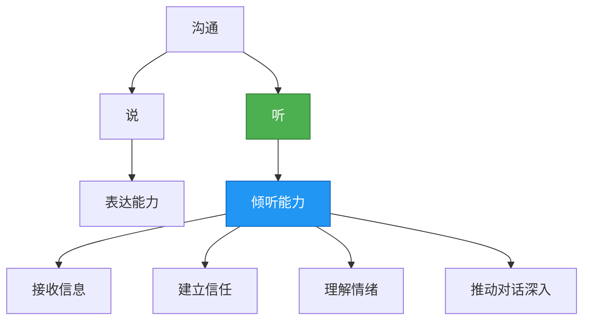
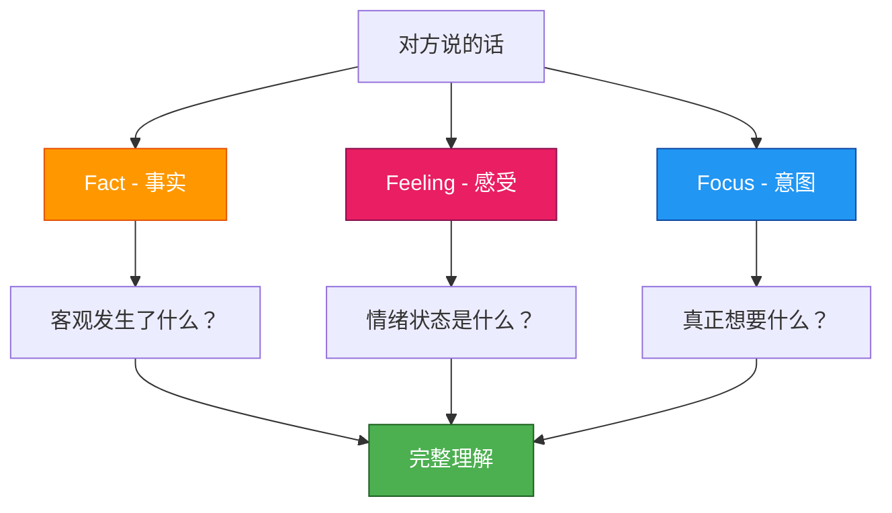

## 二、有效倾听的技巧

> "我们有两只耳朵，一张嘴，所以应该多听少说。" ——爱比克泰德

沟通不是"说"的艺术，更是"听"的艺术。有效倾听是沟通中最被低估的能力——大多数人认为沟通的核心在于"如何表达"，但研究表明，一个清醒的人每天约有60%的时间花在倾听上（Adler & Proctor, *Looking Out, Looking In*），而在商务沟通中，倾听占到了约45%的沟通时间。然而，大多数人只能记住所听到内容的25%-50%。

这意味着：**你"听"了，但大部分信息都流失了**。掌握有效倾听技巧，不仅能让你获取更多有价值的信息，还能让对方感到被尊重和理解，从而建立深层的信任关系。

### 2.1 为什么倾听是最难的沟通技能

#### 2.1.1 倾听的神经科学基础

倾听远不是"用耳朵接收声波"这么简单。从声音进入耳道到大脑做出意义解读，需要经过一个复杂的神经加工链：

1. **物理接收**：声波通过外耳道振动鼓膜，经听小骨放大后传递到耳蜗
2. **信号转换**：耳蜗中的毛细胞将机械振动转化为电信号
3. **初级处理**：听觉神经将信号传至大脑颞叶的初级听觉皮层
4. **意义解读**：韦尼克区（Wernicke's area）将声音信号解析为语言含义
5. **情感加工**：杏仁核同步评估信息的情感色彩
6. **前额叶整合**：前额叶皮层将语言含义、情感信号、上下文线索整合为"理解"

这个过程每秒都在发生，但当你走神、焦虑或处于多任务状态时，前额叶的整合功能会显著下降——你"听到"了声音，但没有"听进去"。

#### 2.1.2 大脑的"听说速度差"

人说话的平均速度约为每分钟125-175个词，但大脑处理语言的速度可以达到每分钟400-800个词。这意味着当别人说话时，你的大脑有大量的"空闲时间"。问题是，大多数人不会用这些空闲时间来深入理解，而是用来：

- 想自己接下来要说什么
- 评判对方说的内容
- 联想到自己的经历
- 走神去做白日梦

这就是倾听困难的根本原因：**大脑的处理速度远快于信息输入速度，而大多数人没有训练过如何善用这段"空闲"**。

#### 2.1.3 倾听的心理障碍

除了神经层面的挑战，心理因素也会严重干扰倾听：

| 障碍类型 | 具体表现 | 对倾听的影响 |
|----------|----------|------------|
| **自我中心** | "我知道你要说什么了" | 过早下结论，忽略后续信息 |
| **防御心理** | "这不是我的错" | 选择性过滤，只听不涉及自己的内容 |
| **情绪干扰** | "他说这话让我很生气" | 被情绪淹没，无法理性接收信息 |
| **刻板印象** | "他这种人我了解" | 用预设代替真正的倾听 |
| **知识傲慢** | "这个我比他懂" | 不愿意接受新信息或不同视角 |
| **焦虑预演** | "待会儿我该怎么回答" | 思维资源被预演占用，无法专注当下 |

### 2.2 倾听的五个层次

倾听不是简单的"听到声音"。根据投入程度和理解深度，倾听可以分为五个层次，每一层都有明确的行为特征和后果：

#### 层次一：忽视（Ignoring）

这是最低层次的倾听——你在物理上和心理上都不在场。

- 完全没有在听，玩手机、看电脑、想自己的事情
- 对方说什么完全不知道
- **典型信号**：对方问"你觉得呢？"时，你一脸茫然
- **后果**：对方感到被轻视，信任关系被破坏，可能再也不愿对你开口
- **常见场景**：家庭饭桌上各自刷手机、开会时偷偷回邮件

> ⚠️ **真实案例**：某公司CEO在一对一面谈时频繁看手机，员工花了一周时间鼓起勇气提的加薪请求被打发。三个月后该员工离职，离职面谈中提到"觉得在这里说什么都没人听"。

#### 层次二：假装倾听（Pretending）

表面上在听，实际上心不在焉。这种比忽视更危险，因为它制造了一种"我在听"的假象。

- 机械地点头、说"嗯嗯""是的"
- 给出模糊的回应，无法复述对方的核心内容
- **典型信号**：回应过于笼统，"嗯，挺好的"——但对方说的根本不是"好事"
- **后果**：比忽视更具欺骗性。一旦对方发现你"假装"，信任伤害比忽视更大
- **自我检测**：对话结束后，你能否用30秒复述对方的核心观点？

#### 层次三：选择性倾听（Selective Listening）

只听自己感兴趣或认为"有用"的部分，自动过滤掉其他信息。这是大多数人日常沟通的默认状态。

- 只关注事实和数据，忽略情感信号
- 只听结论，跳过推理过程
- 容易遗漏关键的前置条件和例外情况
- **典型信号**：对方说了一大段，你的回应只涉及其中一个点
- **后果**：信息不完整导致决策偏差；对方觉得你"断章取义"

**选择性倾听的认知根源**：人类大脑每天处理海量信息，为了节省认知资源，大脑会自动启用"鸡尾酒会效应"——只关注与自己相关或感兴趣的内容。这在进化上是有利的，但在深度沟通中会造成严重的理解偏差。

#### 层次四：专注倾听（Attentive Listening）

认真听对方说话，能够理解和记住主要内容，但可能缺少深度理解和情感共鸣。

- 保持眼神接触，注意力集中在对方身上
- 能够准确复述内容要点
- 会做笔记、提澄清性问题
- **局限**：偏重"内容层"，可能忽略了"情感层"和"意图层"
- **典型信号**：你记住了事实，但不知道对方说这些话时的感受
- **适用场景**：技术讨论、工作汇报、数据会议等信息密度高的场合

#### 层次五：共情倾听（Empathic Listening）

这是倾听的最高层次。你不仅听内容，还感受对方的情绪；不仅理解字面意思，还捕捉言外之意。

- 试图站在对方的角度理解，暂时搁置自己的框架
- 用整个身心去"听"——包括表情、语调、停顿、呼吸
- 让对方感到"被真正理解"，而不是"被听到了"
- **神经机制**：共情倾听激活大脑中的镜像神经元系统（mirror neuron system），使你能够"模拟"对方的情绪状态
- **典型信号**：对方说着说着开始流泪或长舒一口气——因为感到被理解
- **效果**：不仅解决问题，还修复关系

> 💡 **目标**：在重要的沟通中，尽量达到"共情倾听"的层次。这不需要在每一场对话中都做到，但在关键时刻——冲突、求助、脆弱时刻——共情倾听是最有力量的回应。

### 2.3 有效倾听的六步法

以下是经过心理学和沟通学研究验证的系统化倾听方法。每一步都有具体的可执行动作，按顺序实践可以显著提升倾听质量。

#### 第一步：保持专注

物理环境和心理状态的准备是一切倾听的基础。

**物理准备**：
- 放下手机，将屏幕翻面朝下或放入口袋
- 关掉电脑屏幕或将其转向一侧
- 如果在嘈杂环境，提议换到安静的地方
- 如果是视频通话，关闭其他标签页和通知

**心理准备**：
- 做一次深呼吸，将注意力从上一件事切换到当前对话
- 心里默念"现在最重要的是听他说"
- 暂时搁置自己的议程和待办事项

**身体语言**：
- 保持眼神接触（不是盯着看，而是自然地注视对方，每3-5秒短暂移开目光再回来）
- 身体微微前倾，表示关注
- 双手自然放置，不要抱胸（防御信号）
- 面部表情放松，保持开放

#### 第二步：不打断

这是最简单也最难做到的倾听原则。

**为什么不打断**：
- 打断传递的信息是"我的想法比你的更重要"
- 人在表达过程中会逐渐深入自己的思路，被打断意味着思维链断裂
- 很多最重要的信息出现在说话的后半段——人们倾向于先说铺垫，再说重点

**如何做到不打断**：
- 即使你不同意，也先听完
- 控制住"反驳"的冲动——你的观点不会消失，等对方说完再提
- 如果你有灵感，用笔记下来，但不要开口
- 如果对方说话冗长，可以用肢体语言（微微点头）暗示你还在跟

**唯一的例外**：当对方在重复相同内容时，可以温和地总结："我理解了你刚才说的XXX，你觉得还有什么要补充的吗？"这不是否定对方，而是帮助对话更高效。

#### 第三步：积极回应

倾听不是沉默的接受，而是活跃的参与。

**非言语回应**：
- 点头：表示"我在跟，请继续"
- 微笑：表示"我理解你的感受"
- 眼神交流：表示"我关注你"
- 身体前倾：表示"我对此感兴趣"

**简短言语回应**：
- "嗯"、"是的"、"我理解"——用于确认你在跟
- "后来呢？"、"具体是怎样的？"——用于鼓励深入
- "这个很重要"、"请继续说"——用于强调关注

**关键原则**：积极回应的频率要适中。太频繁会打断对方节奏，太少会让对方觉得你在走神。一般每15-30秒给出一次回应信号比较合适。

#### 第四步：确认理解

这一步是将"被动接收"转化为"主动验证"的关键。大多数人跳过这一步，直接进入回应或判断，导致大量误解。

**三种确认技术**：

1. **复述（Paraphrasing）**：用自己的话重述对方的核心意思
   - "你的意思是……对吗？"
   - "让我确认一下，你说的是不是……"
   - 复述不是鹦鹉学舌，而是用自己的框架重构，这会让对方知道你真的理解了

2. **总结（Summarizing）**：将长段内容压缩为几个关键点
   - "我理解你的想法有三点：第一……第二……第三……对吗？"
   - 总结是检验理解的最佳方式——如果你无法总结，说明你没有真正听懂

3. **澄清（Clarifying）**：对模糊的地方主动追问
   - "你说的XX具体是指什么？"
   - "你提到的'差不多完成了'是完成了80%还是95%？"
   - 不要怕问"愚蠢"的问题——模糊的理解比愚蠢的问题危险得多

#### 第五步：情感回应

内容可以被复述，但情感只能被"接住"。情感回应是倾听从"信息获取"升级为"关系建设"的关键一步。

**情感回应的三步法**：

1. **识别**：准确命名对方的情绪
   - "听起来你对这件事很失望。"
   - "我能感受到你现在很焦虑。"
   - 准确的情绪命名会让对方感到"被看见"

2. **验证**：告诉对方他的情绪是合理的
   - "换做是我，我也会这样想。"
   - "你有这种感觉是完全正常的。"
   - 验证不等于同意对方的行为，只是承认情绪的合理性

3. **陪伴**：不急于给建议，先让情绪得到回应
   - "这件事确实不容易。"
   - "你愿意多说一些吗？"
   - 很多时候，人们需要的不是解决方案，而是被理解

> ⚠️ **注意**：情感回应不等于"共情泛滥"。不要为了让对方感觉好而说出你不认同的话（"你完全没有错"），也不要因为对方的情绪强烈就慌张地急于解决问题。**接住情绪 ≠ 消灭情绪**。

#### 第六步：延迟判断

人脑天生喜欢快速判断——这是一种进化优势，但在倾听中是最大障碍。

**延迟判断的具体做法**：
- 听完之前不做评价，即使内心已经有结论
- 不要用"但是"来否定对方——"但是"之前的夸奖会被自动忽略
- 将"但是"替换为"同时"："你说的有道理，同时我也有一些想法想分享"
- 先理解，再回应——问自己"我理解了全部信息吗？"再决定是否表达观点

**为什么"延迟"比"立即"更有效**：
- 你在听完全部信息后做出的判断更准确
- 对方在表达完整后更容易接受不同意见
- 延迟判断传递了"尊重"——"我尊重你完整表达的权利"

### 2.4 3F倾听法——全面解读的框架

3F倾听法是一种高级倾听框架，帮助你从三个维度全面理解对方的信息。它解决的核心问题是：**大多数人只关注了其中一个维度，而忽略了另外两个**。

- **Fact（事实）**：对方陈述了哪些客观事实？剥离情绪和观点后，实际发生了什么？
- **Feeling（感受）**：对方的情绪是什么？开心、焦虑、愤怒、委屈、无助？情绪是通过什么方式表达的——直接说出、语气暗示、还是行为暗示？
- **Focus（意图）**：对方真正想表达什么？他想要什么结果？他说这些话的目的是倾诉、求助、还是征求意见？

**完整示例**：

对方说："这个项目我已经加班两周了，每天到10点，结果老板还在会上批评我们进度慢。"

三个维度的分析：

| 维度 | 解读 |
|------|------|
| **Fact** | 加班两周，每天工作到22:00，在会议上被老板公开批评进度慢 |
| **Feeling** | 委屈（付出了却不被认可）、不被尊重（公开批评而非私下沟通）、可能有些愤怒（"结果"一词暗示预期的正反馈落空） |
| **Focus** | 希望得到理解和情感支持；可能需要实际帮助来解决进度问题；可能在寻求"这样做值不值得"的判断 |

**3F倾听的实践技巧**：

1. **先听Fact，再感受Feeling**：不要因为对方的情绪而忽略事实，也不要因为关注事实而忽略情绪
2. **Feeling常被隐藏**：大多数人不会直接说"我很生气"，而是通过语气加快、音量升高、沉默、讽刺等方式表达。需要"听"言外之意
3. **Focus需要推断**：对方很少直接说出自己想要什么。"这个项目太累了"可能是倾诉，可能是求助，也可能是暗示想退出。你需要通过上下文和追问来确认
4. **三个维度可能矛盾**：对方口头上说"没关系"（Fact），语气却很冷淡（Feeling暗示不开心），意图可能是想看你是否注意到他的情绪（Focus）

### 2.5 四种倾听类型与适用场景

倾听不只是"听别人说话"这么单一的行为。根据目的不同，倾听可以分为四种类型，每种类型有不同的策略和技巧：

| 类型 | 目的 | 适用场景 | 核心策略 | 注意事项 |
|------|------|----------|----------|----------|
| **信息性倾听** | 获取准确信息 | 工作汇报、学习、会议 | 关注事实和逻辑，做笔记，及时澄清 | 不要加入情感解读，专注准确性 |
| **批判性倾听** | 评估和判断 | 谈判、商业提案、新闻分析 | 质疑信息来源，分析论证逻辑，识别偏见 | 不要急于下结论，收集充分证据 |
| **共情性倾听** | 理解和支持 | 朋友倾诉、心理咨询、冲突调解 | 关注情感，验证感受，不急于解决问题 | 不要试图"修复"对方，先接住情绪 |
| **欣赏性倾听** | 享受和审美 | 听音乐、听故事、听演讲 | 放下分析，开放感受，跟随节奏 | 不要过度分析，允许自己被感动 |

大多数人在所有场景中只使用一种倾听模式（通常是信息性倾听），这导致在需要共情时显得冷漠，在需要批判时显得盲从。**切换倾听类型的能力是高级沟通者的标志**。

### 2.6 倾听中的高级技巧

#### 2.6.1 SOLER框架

SOLER是心理咨询师Egan提出的倾听姿态框架，帮助你通过身体语言传递"我在认真听"的信号：

- **S（Squarely）**：正面朝向对方，不要侧身
- **O（Open）**：保持开放姿态，不要抱胸或交叉双腿
- **L（Lean）**：身体微微前倾，表示关注（但不要压迫性地贴近）
- **E（Eye Contact）**：保持自然的眼神接触
- **R（Relaxed）**：保持放松，紧张的姿态会让对方也紧张

这个框架看似简单，但在实际应用中非常有效——你的身体语言会直接影响对方的开放程度。

#### 2.6.2 善用沉默

沉默是倾听中最被低估的工具。大多数人害怕沉默，觉得尴尬，会急于填补空白。但研究表明：

- **对方停顿2-3秒不意味着他说完了**——人需要时间组织语言，尤其是讨论复杂或情感化的话题
- **你的沉默鼓励对方继续深入**——当对方感到不被打断时，往往会说出更深层的想法
- **沉默后的发言质量更高**——经过思考的回应比即兴反应更有价值

**沉默使用的具体时机**：
- 对方说完一段后，等3秒再回应——给对方补充的空间
- 对方表达强烈情绪后，保持沉默陪伴——语言有时是多余的
- 你不确定该怎么回应时，坦诚地说"让我想一下"——这比说废话好得多

#### 2.6.3 提问的艺术

好的提问能让对话深入，坏的提问会让对话中断或偏离。

**开放式问题 vs 封闭式问题**：

| 类型 | 示例 | 效果 |
|------|------|------|
| 封闭式 | "你是不是不开心？" | 限制回答范围，可能让对方觉得被审问 |
| 开放式 | "你现在感觉怎么样？" | 鼓励自由表达，传递尊重和好奇 |

**跟进式提问的层次**：
- 信息层："当时具体发生了什么？"
- 思考层："你是怎么想的？"
- 感受层："这件事让你感觉如何？"
- 需求层："你现在最需要的是什么？"

**避免的提问方式**：
- 引导性提问："你是不是觉得他做得不对？"——这不是提问，是在塞观点
- 追问式提问："为什么？为什么？为什么？"——让对方觉得自己被审判
- 假设性提问："如果当时你……会怎样？"——在对方还在倾诉时不适合问

#### 2.6.4 反映式倾听（Reflective Listening）

反映式倾听是Carl Rogers提出的技巧，核心理念是：**你的回应应该像一面镜子，让对方看到自己的想法和感受**。

具体做法：
1. **内容反映**：用自己的话复述对方表达的内容
   - 对方："我真的很累，每天都有做不完的事。"
   - 你："你觉得工作量太大，已经超出了你的承受范围。"

2. **情感反映**：准确命名对方表达的情绪
   - 对方："他说好会帮我，结果什么都没做。"
   - 你："你感到被辜负了，可能还有些失望。"

3. **含义反映**：说出对方没有直接表达但隐含的意思
   - 对方："算了，反正也没人在意。"
   - 你："我听到了一种无力感，你觉得自己的努力没有被看到。"

> 💡 **关键**：反映不是"重复"。重复是鹦鹉学舌（"你很累，每天做不完的事"），反映是用你的理解框架重新诠释，让对方感到"你说出了我想说但不知道怎么说的话"。

### 2.7 倾听中的常见错误与纠正

| 错误行为 | 为什么是错的 | 正确做法 | 深层原因 |
|----------|-------------|----------|----------|
| 打断对方 | 传递"我比你重要"的信号，中断对方思路 | 等对方说完再回应，用笔记暂存自己的想法 | 控制欲、注意力不集中 |
| 急于给建议 | 对方可能只需要倾诉，建议会让他觉得被否定 | 先问"你需要建议，还是想聊聊？" | 拯救者心态、不适感 |
| 转移到自己身上 | "我也是……"让焦点从对方移到你身上 | 让焦点始终在对方："然后呢？" | 自我中心、寻求认同 |
| 心不在焉 | 对方感受到的不是"分心"而是"不重要" | 放下手机，保持物理和心理的在场 | 注意力管理不足 |
| 评判对方 | 关闭对方的表达意愿，对话变成辩论 | 保持开放心态，用好奇代替评判 | 好为人师的本能 |
| 选择性倾听 | 遗漏关键信息，导致理解偏差 | 关注完整信息，特别是不喜欢听的部分 | 认知舒适区、确认偏误 |
| 过度同理 | 把对方的痛苦变成自己的，失去客观性 | 保持边界，"理解"不等于"感同身受" | 边界意识不足 |
| 给出廉价安慰 | "别想太多""会好的"——让对方觉得你没在听 | 承认困难："这件事确实不容易。" | 不安感、想要快速消除对方的不适 |

### 2.8 特定场景下的倾听策略

#### 2.8.1 冲突中的倾听

冲突是最考验倾听能力的场景。当对方愤怒或指责时，你的本能反应是防御和反击，但这会让冲突升级。

**HEAR四步法**：
1. **Halt（暂停）**：对方说完后，先停顿3秒，不要立即回应
2. **Empathize（共情）**：先回应情绪："我能感受到你现在很生气"
3. **Acknowledge（确认）**：确认对方的核心诉求："你希望我能提前告知"
4. **Respond（回应）**：在情绪被接住后，再表达自己的立场

**在冲突中一定要避免的话**：
- "你冷静一点"——这会让对方更不冷静
- "你反应过度了"——否定对方的情绪
- "这不是我的错"——在情绪阶段追究责任只会火上浇油
- "你每次都这样"——将具体事件升级为人身攻击

#### 2.8.2 远程/在线沟通中的倾听

远程沟通（视频会议、语音通话、甚至文字聊天）让倾听变得更加困难：

| 挑战 | 原因 | 应对策略 |
|------|------|----------|
| 无法看到肢体语言 | 镜头限制、摄像头关闭 | 更关注语调变化，主动问感受 |
| 网络延迟 | 打断增多，节奏混乱 | 发言前停顿1秒，确认对方说完了 |
| 多任务诱惑 | 屏幕上有其他窗口 | 全屏会议窗口，关闭所有通知 |
| 疲劳感 | "Zoom fatigue"——长时间视频消耗注意力 | 每30分钟休息5分钟，缩短单次会议时长 |
| 信息缺失 | 文字消息没有语气 | 使用表情符号辅助表达，复杂话题用语音 |

#### 2.8.3 向上倾听（听领导/上级说话）

向上倾听需要特别的策略，因为你不仅要理解内容，还要理解意图、优先级和期望：

- **听目标，不只是任务**：领导说"把这个报告做一下"，你需要理解背后的目的是什么——是决策需要、汇报需要、还是流程需要？
- **听优先级**：当领导列出多个任务时，注意语气和时间分配——排在前面、花更多时间描述的，通常优先级更高
- **听期望标准**："差不多就行"和"我要一份完美的"是完全不同的要求，但很多领导不会直接说标准
- **确认关键节点**：截止时间、输出格式、谁来审核、需要什么资源——这些一定要在倾听过程中确认

#### 2.8.4 倾听孩子/亲密关系中的倾听

亲密关系中的倾听与职场不同，核心区别在于：**对方往往不需要你解决问题，只需要你"在"**。

- **放下"教导者"身份**：孩子说"同学都不跟我玩"时，不要急着说"你主动去找他们啊"。先共情："你感到被孤立了，这一定很难受。"
- **允许情绪存在**：伴侣说"今天好累"时，不要说"大家都累"。回应情感："今天确实不容易，想聊聊吗？"
- **注意"隐含请求"**："你能不能把碗洗了"可能不只是关于碗，而是关于"你是否在乎这个家"

### 2.9 提升倾听能力的日常练习

倾听是一种可以通过训练持续提升的技能。以下是经过验证的有效练习：

#### 练习一：每日倾听复盘

每天选一段对话（5分钟以上），结束后问自己三个问题：
1. 对方的核心观点是什么？（内容）
2. 对方的感受是什么？（情感）
3. 对方真正想要什么？（意图）

如果你答不上来，说明那次倾听只停留在表面。

#### 练习二：30秒不打断挑战

在下一次对话中，刻意练习在对方停顿时等30秒再回应。你会发现：
- 对方往往会继续补充更多内容
- 你的沉默会让对方感到"被认真对待"
- 你自己的回应质量会显著提高

#### 练习三：复述练习

在重要对话中，每5-10分钟做一次总结性复述："让我确认一下我理解的对不对——你的核心观点是……"这个习惯能将你的倾听准确度提升50%以上。

#### 练习四：情绪日记

每天记录一个你"感受到"对方情绪的时刻，和一个你"错过了"对方情绪的时刻。分析差异的原因——是什么让你在那个时刻更敏锐或更迟钝？

#### 练习五：类型切换练习

有意在不同场景中练习不同的倾听类型：
- 开会时练习信息性倾听（记笔记、提问澄清）
- 朋友聊天时练习共情性倾听（回应情感、不给建议）
- 看新闻时练习批判性倾听（质疑来源、分析逻辑）
- 听音乐时练习欣赏性倾听（放下分析、全然感受）

### 2.10 倾听能力的自我评估

用以下清单评估你当前的倾听水平，每项1-5分（1=从不，5=总是）：

**基础层**：
- [ ] 我在对话中放下手机和其他干扰物
- [ ] 我能保持适当的眼神接触
- [ ] 我不在对方说话时想自己要说什么
- [ ] 我能忍住不打断对方

**进阶层**：
- [ ] 我能准确复述对方的核心观点
- [ ] 我会用开放式问题引导对方深入
- [ ] 我能识别对方的情绪并给予回应
- [ ] 我能在听完全部信息后再下判断

**高级层**：
- [ ] 我能根据场景切换倾听类型
- [ ] 我能捕捉对方的言外之意
- [ ] 我能在冲突中保持倾听而非防御
- [ ] 我能善用沉默推动对话深入

**评分标准**：
- 12-24分：倾听基础薄弱，建议从"不打断"和"放下手机"开始练习
- 25-44分：有一定倾听意识，重点练习"确认理解"和"情感回应"
- 45-54分：倾听能力扎实，可以开始练习"反映式倾听"和"类型切换"
- 55-60分：卓越的倾听者，可以将这些技巧教给别人

> 💡 **最后的提醒**：倾听不是一种"学会了就完了"的技能。即使是世界上最优秀的倾听者，也需要在每一次对话中有意识地实践。环境在变，对象在变，你的状态也在变——倾听是一个需要终身修炼的能力。正如Stephen Covey所说："大多数人倾听不是为了理解，而是为了回应。"从今天开始，试着在每一次对话中多理解一点。
