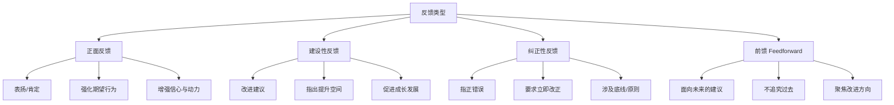
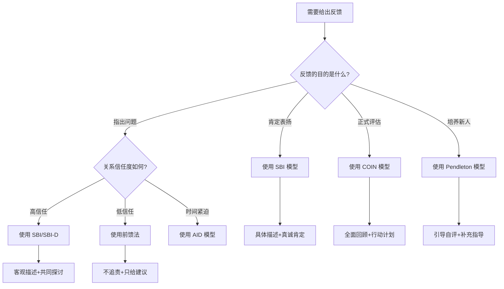
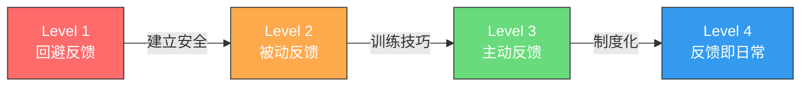
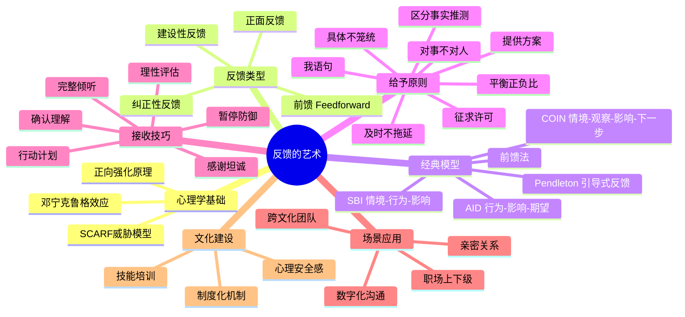

## 三、反馈的艺术

反馈是沟通闭环中的最后一块拼图。没有反馈的沟通是单向广播——信息发出后石沉大海，发送者不知道对方是否理解、接受或需要调整。心理学家约翰·惠特莫尔（John Whitmore）在《高绩效教练》中指出："反馈是人类学习和成长最基本的机制之一。"然而现实中，大多数人要么回避反馈（怕得罪人），要么粗暴地给出反馈（伤人不自知），导致反馈这个本应促进成长的工具，反而成为人际关系的破坏者。

本节将从反馈的心理学原理出发，系统讲解反馈的类型、经典模型、给予与接收的技巧，以及在不同场景中的应用策略，帮助你掌握这门"让人变好又不伤感情"的艺术。

---

### 3.1 反馈的心理学基础

在学习具体技巧之前，理解反馈背后的科学原理至关重要——它解释了为什么有些反馈让人感激涕零，有些让人暴跳如雷。

#### 3.1.1 大脑的威胁检测系统

神经科学家大卫·洛克（David Rock）提出的 SCARF 模型揭示了人类大脑对五种社会因素的高度敏感性：

| 因素 | 含义 | 反馈中的触发场景 |
|------|------|------------------|
| **S**tatus（地位） | 感知到自己在群体中的位置 | 当众批评让人感觉"被贬低" |
| **C**ertainty（确定性） | 对未来的可预测感 | 模糊反馈让人无所适从 |
| **A**utonomy（自主性） | 感知到的选择自由 | 强制要求改变引发抵触 |
| **R**elatedness（关联感） | 与他人的归属感 | 冷漠的反馈让人感觉被排斥 |
| **F**airness（公平感） | 感知到的公正对待 | 双标反馈引发愤怒 |

当反馈触发了威胁感知，大脑的杏仁核会启动"战斗或逃跑"反应——此时接收者的理性思考能力下降，防御机制启动。这解释了为什么即使你的反馈内容完全正确，如果方式不对，对方依然会抵触。

**启示**：给予反馈时，你的首要任务不是"把话说完"，而是"让对方的防御系统不启动"。

#### 3.1.2 正向强化与行为塑造

行为心理学家 B.F. 斯金纳（B.F. Skinner）的研究表明：

- **正向强化**（表扬期望行为）比**负向强化**（惩罚不期望行为）更有效地改变行为
- 间歇性的正向强化比持续强化更能维持长期行为改变
- 即时反馈的效果远强于延迟反馈

这意味着：如果你想让某人持续做对的事，表扬他做对的事，比批评他做错的事，效果好得多。

#### 3.1.3 邓宁-克鲁格效应与反馈盲区

心理学家邓宁和克鲁格发现：能力不足的人往往高估自己的能力，而能力出众的人反而低估自己。这导致一个反馈困境——最需要反馈的人往往最抗拒反馈，因为他们认为自己没有问题。

应对策略：通过提问引导对方自我评估，而非直接告知"你不行"。例如："你觉得这次汇报的效果如何？"比"你汇报得不好"更容易被接受。

---

### 3.2 反馈的完整类型体系

大多数教材将反馈简单分为"正面"和"负面"两类，这种二分法过于粗糙。实际上，反馈可以从多个维度进行分类，每种类型适用于不同场景。

#### 3.2.1 按内容性质分类

**正面反馈**——强化好的行为和表现，增强对方的信心和动力，建立积极的关系。适用于：日常肯定、阶段性总结、表彰优秀表现。

**建设性反馈**——指出需要改进的地方，提供具体的改进建议，帮助对方成长。适用于：常规辅导、绩效面谈、项目复盘。

**纠正性反馈**——指出错误和问题，要求立即改正，涉及底线或原则问题。适用于：严重失误、违规行为、重大偏差。需谨慎使用，因为纠正性反馈最容易触发对方的防御反应。

**前馈（Feedforward）**——这是马歇尔·戈德史密斯（Marshall Goldsmith）提出的概念：不回顾过去的错误，只提供面向未来的建议。例如，不说"你上次汇报逻辑混乱"，而说"下次汇报可以试试先列大纲再展开"。前馈的心理负担远小于传统反馈，因为它不涉及对过去行为的评判。

#### 3.2.2 按来源方向分类

| 方向 | 典型场景 | 挑战 | 关键策略 |
|------|----------|------|----------|
| 上级→下级 | 绩效面谈、日常辅导 | 权力差距导致接收方防御 | 以帮助者而非审判者的姿态 |
| 下级→上级 | 向上反馈、匿名建议 | 担心报复，不敢直言 | 用数据说话，聚焦行为而非人格 |
| 平级之间 | 同事互评、peer review | 关系敏感，怕伤和气 | 先征求许可，用前馈代替反馈 |
| 自我反馈 | 复盘、反思日志 | 自我盲区、自我欺骗 | 用结构化清单，参照客观标准 |
| 外部反馈 | 客户评价、360度评估 | 信息碎片化，情绪干扰 | 寻找规律，忽略极端值 |

#### 3.2.3 按时间特性分类

- **即时反馈**：行为发生后立刻给出，效果最强。适用于日常沟通中的小问题和正面肯定。
- **定期反馈**：按固定周期（周、月、季度）进行，适合系统性评估。适用于绩效管理、项目复盘。
- **事件驱动反馈**：在关键事件（重大失误、里程碑成就）后触发，需要更高的情绪管理能力。

---

### 3.3 经典反馈模型详解

仅有"好反馈"和"坏反馈"的认知不够，你需要掌握结构化的反馈方法论，才能在任何场景下给出专业、有效、不伤人的反馈。

#### 3.3.1 SBI 模型（情境-行为-影响）

SBI 是 Center for Creative Leadership（创新领导力中心）开发的经典反馈模型，是最广泛使用的结构化反馈框架。

**三个要素**：

- **S**ituation（情境）：明确指出"在什么时间、什么地点、什么场景下"
- **B**ehavior（行为）：客观描述"你做了什么"，只描述可观察的行为，不推测动机
- **I**mpact（影响）：说明"这个行为产生了什么影响"，包括对他人、团队、项目的影响

**正面反馈示例**：

> "在昨天的客户会议上（情境），你用数据图表来解释方案，而且每个图表都配了简短的解读（行为），客户当场就表示理解了我们的价值主张，还主动问了下一步合作细节（影响）。这种表达方式非常专业，值得在团队内推广。"

**建设性反馈示例**：

> "在今天的团队会议中（情境），你在小李汇报方案时直接打断了他，说'这个方案不行'（行为），他之后就没再发言，会后我看到他情绪比较低落（影响）。我知道你可能有不同的想法，下次可以等他说完再补充你的观点，你觉得怎么样？"

**SBI+ 模型**：在 SBI 基础上增加 **D**esired Behavior（期望行为），形成 SBI-D，让对方不仅知道问题在哪，还知道应该怎么做：

> "……下次遇到类似情况，你可以先用'我有一个补充的角度'开头，然后分享你的看法，这样既表达了不同意见，又不会让对方感到被否定。"

#### 3.3.2 COIN 模型（情境-观察-影响-下一步）

COIN 模型比 SBI 多了一个"N"（Next Steps），更强调行动导向：

- **C**ontext（情境/背景）：交代事件的背景信息
- **O**bservation（观察）：客观描述你观察到的行为
- **I**mpact（影响）：说明行为带来的后果
- **N**ext Steps（下一步）：共同制定改进方案

**适用场景**：绩效面谈、项目复盘、正式的一对一沟通。因为包含"下一步"，特别适合需要明确改进方向的场景。

**示例**：

> "这次产品上线后（C），我观察到你负责的测试覆盖率只有 60%，低于团队约定的 80% 标准（O），上线后出现了两个回归 bug，影响了用户体验，修复花了额外 4 小时（I）。接下来我们可以一起梳理一下测试用例的编写流程，你觉得这周找个时间讨论一下？（N）"

#### 3.3.3 Pendleton 模型（引导式反馈）

Pendleton 模型由 David Pendleton 提出，核心理念是：让接收者先自我评估，而非由给予者直接评判。这利用了"自我发现"比"被动接受"更容易内化的心理学原理。

**五个步骤**：

1. 让接收者先说**做得好的地方**（自我肯定）
2. 给予者**补充**做得好的地方（强化正面）
3. 让接收者说**可以改进的地方**（自我反思）
4. 给予者**补充**可以改进的地方（建设性指导）
5. **共同制定**改进计划

**适用场景**：教学辅导、新员工培养、教练式对话。当对方有自我反思能力时效果最佳。

#### 3.3.4 AID 模型（行为-影响-期望）

AID 是一个简洁实用的轻量级反馈模型：

- **A**ction（行为）：描述具体行为
- **I**mpact（影响）：说明产生的影响
- **D**esired Outcome（期望结果）：明确你期望的改变

**适用场景**：日常工作中的快速反馈、即时纠正。比 SBI 更简短，适合时间紧迫的场合。

#### 3.3.5 前馈法（Feedforward）

马歇尔·戈德史密斯提出的前馈法，彻底颠覆了传统反馈逻辑——不回顾过去，只面向未来。

**操作步骤**：

1. 描述你希望改进的一个行为（不涉及过去的错误）
2. 请对方给你一个"面向未来的建议"
3. 你只听，不评判，不说"但是"
4. 感谢对方，交换角色

**示例**：

> "我想提升自己在会议中引导讨论的能力。你能给我一个建议吗？"
> 对方："你可以试试在讨论偏离主题时，先把大家的观点总结一下，然后拉回到核心议题。"
> "谢谢，这个建议很实用。"

**优势**：没有评判、没有防御、没有尴尬。特别适合敏感场景和关系初期。

#### 3.3.6 模型选择决策指南

面对不同场景，选择合适的反馈模型：

---

### 3.4 给予反馈的八大原则

掌握了模型，还需要遵循核心原则，确保反馈真正有效而不伤人。

#### 原则一：对事不对人

这是反馈的**第一铁律**。一旦你的反馈从"行为"滑向"人格"，对方的防御系统就会立刻启动。

| 错误示范 | 正确示范 |
|----------|----------|
| "你这个人太粗心了。" | "这份报告中有三处数据错误，需要修正。" |
| "你就是不靠谱。" | "这次交付比约定时间晚了两天。" |
| "你情商太低了。" | "在客户面前直接否定对方的方案，可能会影响合作关系。" |

**语言信号**：注意你的用词中是否包含"总是""从来""你这个人"等绝对化、人格化的表述。一旦出现，立刻修正为具体行为描述。

#### 原则二：具体而非笼统

模糊的反馈等于没有反馈。对方听完后不知道该改什么、怎么改。

- ❌ "你的表达能力需要提升。"
- ✅ "你在汇报时，建议先说结论，再展开细节，这样听众更容易跟上你的思路。"

- ❌ "这个方案不够好。"
- ✅ "这个方案在成本测算部分缺少对人力成本的估算，建议补充进去。"

**判断标准**：你的反馈是否让对方知道"做什么"和"怎么做"？如果不能，说明还不够具体。

#### 原则三：及时而非拖延

反馈的时效性直接影响效果。行为发生后越早反馈，效果越好——因为双方对事件的记忆最清晰，反馈最具有情境关联性。

- **即时反馈窗口**：行为发生后 24 小时内是最佳反馈窗口
- **积累效应**：小问题不及时说，积累到一起爆发时，对方会感觉"你对我有意见"
- **但要选对时机**：对方刚被客户骂完、情绪激动时，不是好时机

**时机选择原则**：

| 场景 | 推荐时机 | 不推荐时机 |
|------|----------|------------|
| 正面肯定 | 当场、公开 | — |
| 小的改进建议 | 当天、私下 | 当众场合 |
| 严肃纠正 | 事后冷静后、私下 | 对方情绪激动时 |
| 系统性问题 | 一对一正式谈话 | 随口一提 |

#### 原则四：平衡正面与建设性

心理学中的"洛萨达比例"（Losada Ratio）表明：高绩效团队的正面互动与负面互动的比例约为 5.6:1。在反馈中，推荐的最低比例是 3:1——即每给出 1 条建设性反馈，至少先给出 3 条正面反馈。

但要注意：**不要为了凑比例而虚假表扬**。虚假的正面反馈比不反馈更糟糕——它会损害你的可信度。如果你实在找不到正面的地方，可以从"中性观察"开始："我注意到你在项目中投入了很多时间……"

#### 原则五：提供解决方案

只指出问题不给方案，等于给对方丢了一个炸弹就走。建设性反馈的核心是"建设性"——帮助对方看到改进的路径。

- "你觉得怎样做会更好？"（引导对方自主思考）
- "我之前遇到类似情况时，用 XX 方法效果不错。"（分享经验）
- "我可以在 XX 方面给你支持。"（提供资源）

#### 原则六：征求许可再反馈

在给出反馈前，先征求对方的同意："我有一个观察想和你分享，你现在方便吗？"

这个简单的步骤有三个作用：
1. 让对方有心理准备，降低防御反应
2. 尊重对方的自主性（SCARF 模型中的 A）
3. 如果对方说"现在不方便"，你可以选择更好的时机

#### 原则七：使用"我"语句而非"你"语句

"你"语句听起来像指责，"我"语句听起来像分享。

- ❌ "**你**说话太冲了。"（指责）
- ✅ "**我**感觉刚才的讨论有些激烈，**我**有点担心会影响团队氛围。"（分享感受）

"我"语句的结构：**"当（具体行为）发生时，我感到（情绪），因为（原因）。我希望（期望行为）。"**

示例："当会议中讨论被打断时，我感到有些焦虑，因为我担心重要的观点没有被充分表达。我希望我们能约定一个发言规则。"

#### 原则八：区分事实与推测

反馈中只能包含你**亲眼看到/听到的事实**，不能包含你对对方动机的**推测**。

- ❌ "你是故意不回复我消息的。"（推测动机）
- ✅ "我昨天发的消息到今天还没收到回复。"（陈述事实）
- ❌ "你就是想出风头。"（推测动机）
- ✅ "你在讨论中连续提出了 5 个反对意见，但没有提出替代方案。"（陈述事实）

---

### 3.5 接收反馈的高阶技巧

反馈不是单向的"给"——如何接收反馈，决定了你能否真正从反馈中获益。研究显示，高绩效者的一个共同特征是：他们善于接收和利用反馈。

#### 3.5.1 接收反馈的六步法

**第一步：暂停防御本能**

当听到批评时，你的大脑会在 0.2 秒内启动防御反应——心跳加速、肌肉紧绷、想要反驳。这是杏仁核的"战斗或逃跑"反应，完全正常。

应对技巧：
- 深呼吸 3 次（激活副交感神经，抑制杏仁核）
- 默念"这是一个学习的机会"
- 告诉自己"我不需要现在就回应"

**第二步：完整倾听**

不要打断、不要急于解释。让对方把话说完。打断只会传递一个信号："我不想听。"

**第三步：确认理解**

用自己的话复述对方的反馈："你的意思是，我在汇报时跳过了背景介绍，导致听众跟不上逻辑，对吗？"

这有两个作用：确保你理解正确，让对方感觉被认真对待。

**第四步：感谢坦诚**

无论反馈是否正确，都要感谢对方的坦诚。"谢谢你直接告诉我这些，这对我很有帮助。"感谢不是认同，而是感谢对方花时间和勇气给你反馈。

**第五步：理性评估**

收到反馈后，给自己一个"冷静期"（通常 24-48 小时），然后问自己：

- 这个反馈中有哪些事实是准确的？
- 如果换一个视角看，对方说的有没有道理？
- 这个反馈是否与我从其他人那里收到的反馈一致？
- 我愿意为改变做出多大的努力？

**第六步：制定行动计划**

如果反馈合理，制定具体的改进计划并告知对方："我打算在下周的汇报中先花 2 分钟介绍背景，看看效果如何。"然后真的去做——反馈的价值在于行动。

#### 3.5.2 接收反馈时的四大常见错误

| 错误类型 | 典型表现 | 为什么是错的 | 正确做法 |
|----------|----------|-------------|----------|
| 立刻辩解 | "不是这样的，你误会了……" | 关闭了信息通道，对方不会再给你反馈 | 先听完，再回应 |
| 否认问题 | "我没有这样做。" | 否认不等于没发生，而且显得缺乏自省 | "我回顾一下当时的情况。" |
| 转移责任 | "这是因为 XX 导致的。" | 即使有外部因素，你自己的部分也需要面对 | "先说说我可以改进的地方。" |
| 情绪化反应 | 愤怒、哭泣、自暴自弃 | 情绪化让对方不敢再说真话，也让你无法理性分析 | 给自己冷静时间，再做回应 |

#### 3.5.3 如何处理"不合理的"反馈

并非所有反馈都合理。有时反馈者的视角有偏差，有时他们的信息不完整，有时甚至带有个人偏见。面对你认为不合理的反馈：

1. **不要当场对抗**——对抗只会升级冲突
2. **追问具体细节**——"你能举个具体的例子吗？"让抽象的批评变成具体的事实讨论
3. **寻找合理内核**——即使 90% 不合理，那 10% 是否值得借鉴？
4. **寻求第三方验证**——问问其他人是否也有类似的观察
5. **如果确实不合理，礼貌地保留意见**——"我理解你的看法，我会认真考虑。"然后根据自己的判断决定是否采纳

---

### 3.6 不同场景中的反馈策略

反馈不是一招鲜吃遍天——不同的场景需要不同的策略。

#### 3.6.1 职场中的反馈

**上级给下级反馈**：

最常见的场景，也是最容易做错的场景。常见误区是"只在绩效面谈时才给反馈"——这等于把一年的问题压缩到一次谈话中，接收方会感觉"秋后算账"。

最佳实践：
- 建立**每周一对一**机制，让反馈成为日常
- 先问"这周有什么我可以帮你的？"再进入反馈
- 用 70% 时间讨论发展，30% 时间讨论问题
- 每次反馈后约定下次跟进时间

**向上反馈（下级给上级）**：

最困难的反馈方向。研究表明，超过 60% 的员工不敢给上级反馈，因为他们担心被"穿小鞋"。

策略：
- 选择一对一的私密场合
- 用"数据+影响"代替"感受+评判"
- 使用"我"语句："我在执行过程中遇到了一些困惑……"
- 提供解决方案而非只是问题："我建议我们可以尝试 XX 方案……"
- 如果实在不敢直接说，可以借助匿名反馈渠道或信任的中间人

**同事间的横向反馈**：

没有权力差距，但有关系敏感度。关键是维护关系的同时推动改进。

策略：
- 先征求许可："我有一个想法想和你交流，方便吗？"
- 用前馈代替反馈："下次如果能 XX 就更好了。"
- 聚焦共同目标："为了让项目更顺利，我觉得我们可以……"

#### 3.6.2 亲密关系中的反馈

在亲密关系中，反馈的难度比职场更高——因为情绪卷入更深，对"被评判"的敏感度更高。

**关键原则**：
- 用**请求**代替**批评**——"我希望你……"比"你总是不……"有效 10 倍
- 选择**心情好的时候**沟通，不要在吵架时翻旧账
- 一次只说**一件事**，不要"攒着一起说"
- 对方改进后，**及时肯定**——"你最近……做得很好，我很开心"

#### 3.6.3 数字化场景中的反馈

在 Slack、邮件、文档评论等文字场景中给出反馈，失去了语气、表情、肢体语言等非语言信号，误解的概率大幅增加。

**文字反馈的原则**：
- 用 emoji 或语气词缓和语气："这个方案整体不错👍，有一个小建议……"
- 复杂反馈**用语音或视频**，不要用文字——文字无法传递善意
- 在文档评论中，用**提问**代替**评判**："这里是否考虑了 XX 场景？"比"这里没有考虑 XX"更温和
- 发送前重新读一遍，想象自己是接收者——如果感觉会被误解，就修改措辞

#### 3.6.4 跨文化反馈

不同文化对反馈的期望差异巨大，全球化团队中这一点尤为重要。

| 文化背景 | 反馈风格 | 沟通方式 | 注意事项 |
|----------|----------|----------|----------|
| 美国/北欧 | 直接、明确 | 低语境沟通 | 不需要太多铺垫，直接说问题 |
| 日本/中国 | 间接、含蓄 | 高语境沟通 | 需要用暗示、类比，留面子 |
| 德国 | 注重事实和逻辑 | 问题导向 | 不要夹杂情感，聚焦数据 |
| 巴西/南欧 | 重视关系和情感 | 先建立关系 | 先聊感情，再谈问题 |

在跨文化团队中给出反馈前，先了解对方的文化背景和沟通偏好。

---

### 3.7 构建反馈文化

个人层面掌握反馈技巧只是起点，真正高效的团队需要建立系统性的反馈文化。

#### 3.7.1 反馈文化的四个层次

**Level 1 - 回避反馈**：团队中没有人给反馈，大家都"你好我好大家好"。问题被掩盖，直到爆发。这是最常见也最危险的状态。

**Level 2 - 被动反馈**：只有出了大问题才会给反馈，而且往往是通过"秋后算账"的方式。反馈与惩罚绑定，大家更害怕反馈。

**Level 3 - 主动反馈**：团队成员主动寻求和给予反馈，有固定的反馈机制（如每周一对一、项目复盘）。反馈被视为成长的工具。

**Level 4 - 反馈即日常**：反馈像呼吸一样自然——随时发生、双向流动、没有心理负担。这是高效团队的标志。

#### 3.7.2 从 Level 1 到 Level 4 的进化路径

**第一步：建立心理安全感**

谷歌的"亚里士多德项目"研究发现：高绩效团队的第一要素是心理安全感。人们只有在确信"给反馈不会被报复"时，才会愿意说真话。

具体做法：
- 领导者**带头示范**——主动邀请反馈："我最近有什么做得不够好的地方吗？"
- 对给予反馈的人**公开感谢**，而不是惩罚
- 区分"反馈"和"告状"——反馈是帮助成长，不是打小报告

**第二步：提供反馈技能培训**

不要假设大家天生会给反馈。投资培训：
- 教授 SBI/COIN 等结构化模型
- 角色扮演练习（用低风险的场景练习高难度对话）
- 建立反馈"话术库"——常见场景的标准表达

**第三步：制度化反馈机制**

- **每周一对一**：管理者与直接下属的固定反馈时间
- **项目复盘**：每个项目结束后，团队一起回顾做得好和可改进的地方
- **360 度反馈**：每季度/半年进行一次全方位的匿名反馈收集
- **即时反馈工具**：在团队协作工具中设置轻量级反馈通道（如 Slack 的 emoji reaction）

**第四步：衡量和持续改进**

建立反馈文化的 KPI：
- 团队成员是否愿意主动给出反馈？（匿名调查）
- 反馈后的行为改变率是多少？
- 员工对"收到有效反馈"的满意度如何？

---

### 3.8 反馈的高级进阶

#### 3.8.1 金发女孩效应（Goldilocks Feedback）

反馈不能太强也不能太弱——像金发女孩选粥一样，要"刚刚好"。

- **反馈太弱**：对方听不到、不在意、不改变
- **反馈太强**：对方被吓到、防御、关系受损
- **反馈刚好**：对方觉得被尊重、被帮助，愿意改变

如何找到"刚好"的强度？观察对方的反应——如果对方开始频繁解释、转移话题、表情紧绷，说明反馈过强了；如果对方毫无反应、不以为然，说明反馈太弱。

#### 3.8.2 "三明治"反馈法的争议

经典的"三明治法"（表扬-批评-表扬）曾被广泛推荐，但近年来受到越来越多的质疑：

**支持者认为**：
- 用正面反馈包裹负面反馈，降低防御反应
- 确保每次对话都有积极的部分

**反对者认为**：
- 长期使用后，对方听到表扬就会想"接下来要批评我了"——表扬失去信任
- 机械的三明治结构让反馈显得不真诚
- 把表扬和批评混在一起，稀释了两者的影响力

**更优的替代方案**：**分开给**。正面反馈单独给、真诚地给、及时地给。建设性反馈也单独给、私密地给。不要把两者搅在一起。

#### 3.8.3 反馈中的认知偏差

给出和接收反馈时，人类大脑存在系统性偏差，了解这些偏差能帮助你做出更准确的判断：

| 偏差类型 | 表现 | 应对策略 |
|----------|------|----------|
| **近因效应** | 只记得最近发生的事 | 定期记录，参考全周期表现 |
| **光环效应** | 因为某人某个优点就全面高估 | 聚焦具体行为，分开评估不同维度 |
| **确认偏差** | 只看到支持自己预设的证据 | 主动寻找反面证据 |
| **相似性偏差** | 偏爱与自己风格相似的人 | 用客观标准而非个人好恶 |
| **首因效应** | 第一印象长期影响判断 | 给人"重新开始"的机会 |

#### 3.8.4 将反馈转化为习惯

反馈能力的提升不是一次性学习，而是持续练习。以下是将反馈融入日常的实用方法：

**每日微反馈**：每天至少给一个人一个真诚的正面反馈。不需要结构化模型，一句"你今天会议上的那个类比特别好，一下就让大家理解了"就够了。

**反馈日志**：每周记录 2-3 条你收到的反馈，分析哪些是有价值的、哪些可以忽略、哪些你已经采取了行动。

**反馈伙伴**：找一个信任的同事互为"反馈伙伴"，定期互相分享观察。降低反馈的心理门槛。

**复盘文化**：项目结束后做结构化复盘，问三个问题：什么做得好？什么可以改进？下次怎么做？

---

### 3.9 常见误区与纠偏

| 误区 | 为什么是错的 | 正确做法 |
|------|-------------|----------|
| "好的反馈就是批评" | 忽略了正面反馈的价值，让反馈=痛苦 | 正面反馈至少占 3/4 |
| "我不说是怕伤害对方" | 沉默不等于善意——问题积累后伤害更大 | 及时、温和、具体地说 |
| "我给了反馈他就应该改" | 反馈是邀请，不是命令。改变需要时间和支持 | 给出反馈后持续跟进，提供支持 |
| "公开反馈效率高" | 当众批评触发羞耻感，效果适得其反 | 私下给建设性/纠正性反馈 |
| "反馈越多越好" | 过度反馈让人感觉被监视和控制 | 聚焦关键行为，不要事事都管 |
| "年轻人需要多批评" | 每个人都需要正面反馈，年轻人尤其需要信心建设 | 平衡给予，因人而异 |
| "对方没改说明反馈没用" | 行为改变需要时间，可能需要多次反馈+支持 | 至少给 2-3 次跟进机会 |

---

### 3.10 本节要点回顾

反馈的本质不是评判，而是连接。好的反馈让双方都变得更好——给予者练习了观察力和表达力，接收者获得了成长的方向。当你把反馈从"指出问题"重新定义为"帮助对方变得更好"，你会发现，给予反馈不再是苦差事，接收反馈也不再是威胁，而是一份珍贵的礼物。

下一节，我们将探讨沟通的另一个核心技巧——提问的力量。
