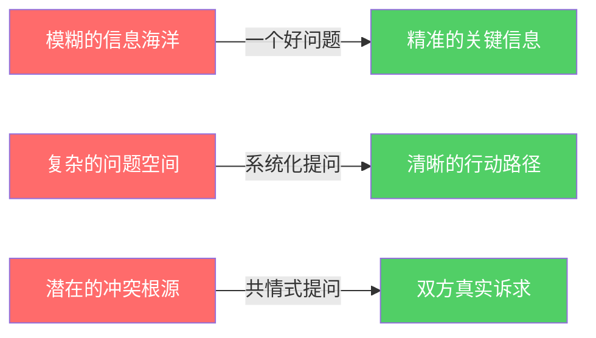
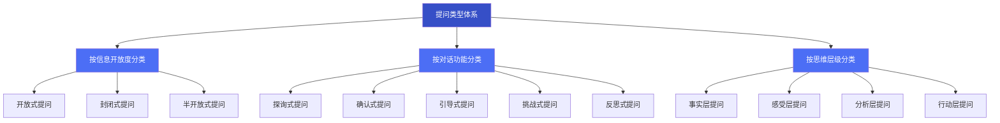
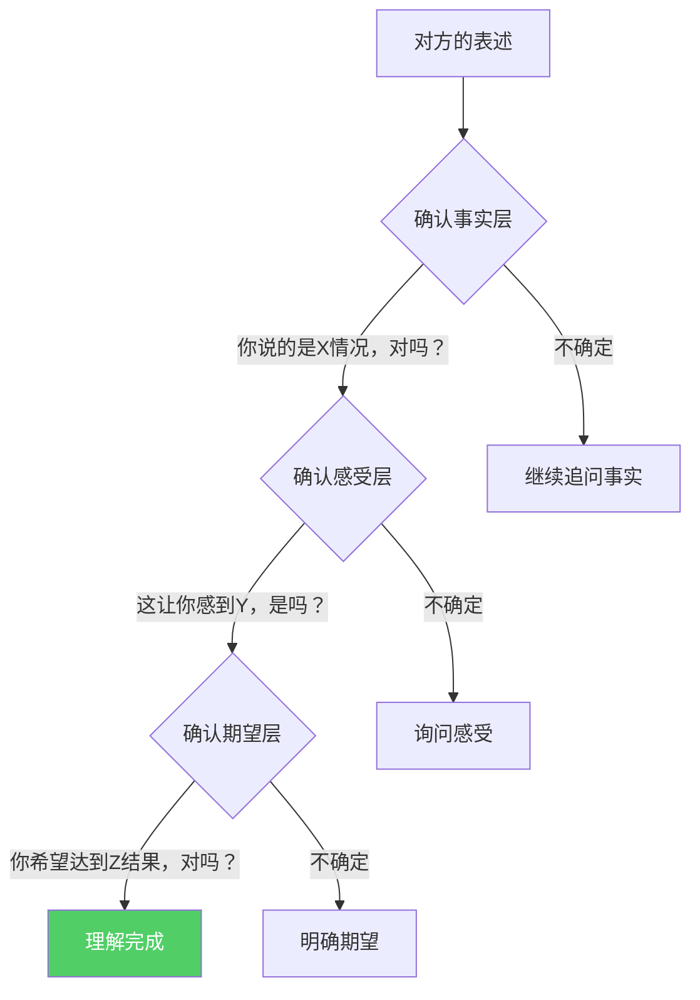
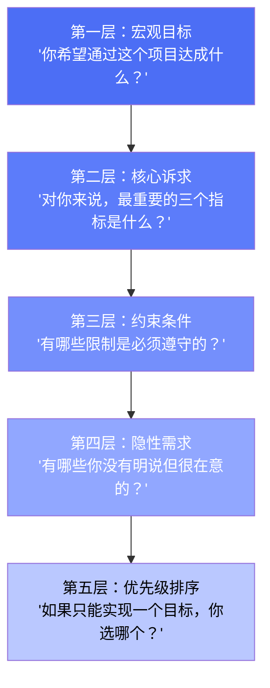
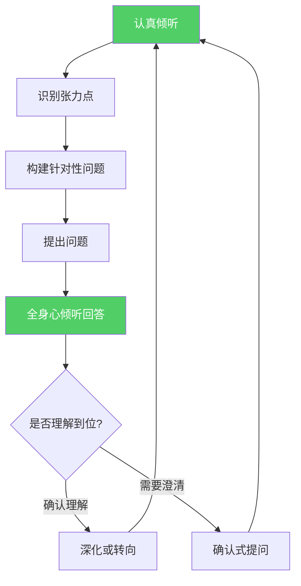
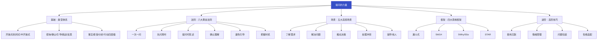

## 四、提问的力量

提问是沟通中最被低估却最具杠杆效应的技能。一个精准的问题，胜过一百句陈述。它不仅是一种信息获取手段，更是一种思维引导工具、关系建立方式和决策催化机制。在信息爆炸的时代，会提问的人能够穿透表象直达本质，而不会提问的人即使面对面交流，也难以触及真正有价值的内容。

本章将从提问的心理学原理出发，系统讲解提问的类型体系、黄金法则、场景策略和进阶技巧，帮助你从"会问问题"进化到"用提问改变对话走向"。

### 4.1 为什么提问如此强大——心理学与认知科学基础

提问的力量并非玄学，而是有坚实的科学基础支撑。理解这些原理，能让你在使用提问技巧时更加得心应手。

#### 4.1.1 认知聚焦效应

人类的注意力资源有限。当大脑接收到一个明确的问题时，会自动将注意力聚焦到与问题相关的领域。神经科学研究表明，提问能激活大脑的"定向反应"（orienting response），使接收者暂时放下无关思考，集中精力处理问题所指向的信息。

这就是为什么在会议中，一句"我们这个季度最大的风险是什么？"比"我们来讨论一下风险"更能引发深度思考。前者给大脑一个明确的搜索指令，后者则是一个模糊的指令，大脑不知道从何入手。

#### 4.1.2 生成效应（Generation Effect）

心理学中的"生成效应"指出：当人们自己生成答案（而非被动接收信息）时，对内容的记忆和理解程度会显著提高。提问正是触发生成效应的最佳方式。

比较两种沟通方式：
- 陈述式："我们的客户留存率在下降，需要加强售后跟进。"
- 提问式："你觉得客户流失的主要原因是什么？我们可以从哪些环节改善？"

第二种方式让对方主动思考、生成答案，因此对方对解决方案的理解更深、执行意愿更强。

#### 4.1.3 苏格拉底效应

古希腊哲学家苏格拉底通过连续提问引导对话者自行发现真理，这种方法被称为"产婆术"（Maieutics）。核心原理是：人们对自己"想通"的道理，比别人"告诉"的道理，接受度和执行力都高出数倍。

管理学大师彼得·德鲁克曾说："管理的本质不是告诉别人该做什么，而是通过提问帮助他们自己找到答案。"这种理念在教练（coaching）、心理咨询和领导力培养中被广泛应用。

#### 4.1.4 互惠原则与信任建立

提问在心理学上具有隐性的"尊重信号"。当你认真询问对方的意见、感受和经历时，传递的信息是："你的想法对我很重要。"这触发了互惠原则——对方感受到被重视，自然更愿意开放和合作。

哈佛商学院的研究表明，在谈判中主动提问的一方，达成满意协议的概率比主要陈述的一方高出42%。原因在于，提问帮助双方找到真正的利益交汇点，而不仅仅是立场交换。

#### 4.1.5 提问的认知杠杆

从信息论的角度，提问是一种高效的信息压缩工具。一个好问题能将海量信息压缩为一个清晰的焦点：

掌握提问技巧，本质上就是掌握了一种"以一当十"的沟通杠杆。

### 4.2 提问的类型体系

提问不是单一的动作，而是一个丰富的类型体系。不同类型的问题适用于不同的沟通目标，选对类型是有效提问的第一步。

#### 4.2.1 按信息开放度分类

**开放式提问**

开放式提问是信息收集和深度思考的利器。它不预设答案框架，给回答者充分的表达空间，是理解对方真实想法的首选方式。

核心特征：
- 不能用"是/否"或简短词语回答
- 以"什么""为什么""如何""怎样的"等词开头
- 鼓励对方展开详细描述
- 适合在对话初期、需要深度了解时使用

典型句式与使用场景：

| 句式 | 适用场景 | 示例 |
|------|----------|------|
| "你觉得……怎么样？" | 收集意见 | "你觉得这个方案怎么样？" |
| "能详细说说……吗？" | 深入了解 | "能详细说说你的顾虑吗？" |
| "……对你来说意味着什么？" | 探索价值观 | "成功对你来说意味着什么？" |
| "你是如何看待……的？" | 理解视角 | "你是看待远程办公这个趋势的？" |
| "在……的过程中，你经历了什么？" | 了解经历 | "在项目推进的过程中，你经历了什么？" |

使用开放式提问的关键在于：提出问题后，保持耐心，给对方足够的思考和表达时间。不要因为短暂的沉默就急于补充或重新提问。

**封闭式提问**

封闭式提问用于确认具体信息、推动决策或控制对话节奏。它高效、明确，但使用过多会让对话变得生硬和审问式。

核心特征：
- 可以用"是/否"或有限选项回答
- 以"是不是""有没有""对吗"或选择项开头
- 用于确认事实、缩小范围、推动行动
- 适合在需要明确结论或时间节点时使用

典型句式与使用场景：

| 句式 | 适用场景 | 示例 |
|------|----------|------|
| "……是/不是？" | 确认事实 | "这个功能下周能上线吗？" |
| "……还是……？" | 二选一决策 | "你更倾向于A方案还是B方案？" |
| "有没有……？" | 确认存在性 | "有没有其他需要补充的？" |
| "是否同意……？" | 获取承诺 | "你是否同意这个时间表？" |

封闭式提问的常见陷阱是"伪封闭"——问题看似是封闭式，但答案空间被过度压缩。例如"你不会反对吧？"表面上是封闭式提问，实际上带有强烈的暗示，对方很难表达真实异议。

**半开放式提问**

半开放式提问是开放式和封闭式的折中，它限定回答的大方向但留出表达空间。在实际沟通中，这是最常用的提问类型。

示例：
- "这次项目最大的收获是什么？"（限定"收获"，但回答是开放的）
- "如果只能改进一件事，你会选择什么？"（限制数量但不限制内容）
- "你认为我们面临的三个主要挑战是什么？"（限定了数量）

#### 4.2.2 按对话功能分类

**探询式提问**

探询式提问的核心目的是挖掘信息、发现未知。它不预设任何答案方向，真诚地向对方求教。

与开放式提问的区别在于，探询式提问更强调"求知"的姿态——你不是在收集已知信息的确认，而是在探索未知领域。

示例：
- "你是怎么做到在三个月内把转化率提升了30%的？"
- "这个行业的变化趋势，你有什么独到的观察？"
- "如果让你重新来过，你会做出哪些不同的选择？"

**确认式提问**

确认式提问用于验证你对对方意思的理解是否正确。它是避免沟通误解的第一道防线。

示例：
- "我理解你的意思是……对吗？"
- "你是说，主要的顾虑在于成本而非技术可行性，是这样吗？"
- "让我确认一下，你的建议是先做A再做B，对吧？"

确认式提问的价值在于：它不仅确保你理解正确，还让对方感受到你在认真倾听。心理学研究表明，被确认理解的感觉能显著提升对话满意度。

**引导式提问**

引导式提问通过精心设计的问题框架，引导对方朝特定方向思考。这是一种"温和的影响力"工具。

示例：
- "如果我们从客户的角度来看这个问题，你觉得他们会怎么想？"
- "假设我们不做任何改变，半年后会是什么样子？"
- "在你看来，除了降价之外，还有什么方式能提升竞争力？"

引导式提问的关键原则是：引导方向必须是合理且有益的，而不是操纵对方。提问者应当是对话的催化剂，而不是暗中操控者。

**挑战式提问**

挑战式提问敢于触碰核心矛盾，推动对方直面问题。它适用于需要打破舒适区、推动突破的场景。

示例：
- "你说这个方案很好，但为什么执行率只有40%？"
- "如果竞争对手今天就推出类似产品，我们的护城河在哪里？"
- "你提到了很多客观原因，有哪些是我们可以控制却没有控制的？"

挑战式提问需要极高的情商和信任基础。在关系尚浅或对方情绪脆弱时使用，可能适得其反。使用时的语气和表情管理至关重要——你的态度应该是"我想帮你看到盲点"，而不是"我在质疑你"。

**反思式提问**

反思式提问帮助对方回顾自己的思维过程和决策逻辑，促进自我觉察。

示例：
- "回顾这个决策，你觉得当时最重要的考虑因素是什么？"
- "如果现在的你给当时的自己一个建议，会是什么？"
- "在这件事中，你对自己有了什么新的认识？"

反思式提问在教练、辅导和复盘场景中尤其有效。它帮助对方建立"元认知"——对自己思维方式的觉察。

#### 4.2.3 按思维层级分类

根据提问触及的思维层级，可以将问题分为四个层次：

| 层级 | 目的 | 典型问题 | 适用时机 |
|------|------|----------|----------|
| 事实层 | 了解客观情况 | "发生了什么？""数据是多少？" | 信息收集阶段 |
| 感受层 | 探索情感和态度 | "你的感受是什么？""你对此有什么顾虑？" | 建立信任、处理冲突 |
| 分析层 | 促进深度思考 | "原因是什么？""有什么关联？" | 问题诊断、方案评估 |
| 行动层 | 推动决策执行 | "你打算怎么做？""下一步是什么？" | 推进行动、落地执行 |

大多数人在日常沟通中只停留在事实层和行动层，忽略了感受层和分析层。而真正有力的对话，往往发生在感受层和分析层。学会在不同层级之间灵活切换，是提问高手的核心能力。

### 4.3 提问的黄金法则

掌握类型只是第一步，如何在实际对话中用好提问，需要遵循以下法则。

#### 法则一：一次只问一个问题

这是最基本也最常被违反的法则。很多人习惯一次性抛出多个问题，认为这样效率更高，实际上适得其反。

错误示例：
> "你觉得这个方案怎么样？有什么建议？预算够不够？时间来得及吗？"

对方的大脑需要同时处理四个问题，结果往往是：回答了一个，忽略了其他；或者给出笼统的回应，什么都涉及但什么都不深入。

正确做法：
> "你觉得这个方案怎么样？"→ 等待回答 → "预算方面你觉得够吗？" → 等待回答 → ……

原因分析：认知心理学中的"工作记忆容量"理论指出，人类同时处理的信息量有限（通常为4±1个单元）。当一个问题中嵌套多个子问题时，对方的处理效率会显著下降。

#### 法则二：先问再听，听完再问

提出问题后，你需要做的是：闭嘴、倾听、等待。

具体操作：
1. 提出问题
2. 给对方5-10秒的思考时间（沉默是你的朋友）
3. 认真倾听回答，不做打断
4. 确认理解（"你的意思是……"）
5. 根据对方的回答调整后续提问

常见错误：
- 提问后不到2秒就自己补充说明
- 对方回答时，脑子里已经在想下一个问题
- 对方还没说完就插话或表示同意/反对

实用技巧：提问后在心里默数"1-2-3-4-5"，强制自己等待。这5秒的沉默，往往能等来对方最深层的真实想法。

#### 法则三：用提问代替陈述

当你的本能反应是告诉对方答案时，试着把它变成一个问题。

| 陈述式（效果差） | 提问式（效果好） |
|------------------|------------------|
| "你应该这样做。" | "你觉得怎样做会更好？" |
| "这个方案有问题。" | "你觉得这个方案有哪些风险点？" |
| "你必须按时完成。" | "你觉得在现有条件下，怎样确保按时完成？" |
| "这明显是A的原因。" | "你觉得导致这个结果的主要因素是什么？" |

为什么提问式更有效？因为陈述触发的是"接受/抗拒"反应——对方要么被动接受，要么本能抗拒。而提问触发的是"思考/参与"反应——对方主动参与思考，得出的结论更容易被认同和执行。

这也是教练技术（Coaching）的核心理念：不是给答案，而是通过提问帮助对方自己找到答案。

#### 法则四：用提问确认理解

沟通中最昂贵的错误之一是"以为自己理解了"。研究表明，即使是面对面的直接沟通，信息失真率也高达30%。而通过提问确认，可以将失真率降低到5%以下。

确认式提问的标准模板：
- "我理解你的意思是……对吗？"（重述后确认）
- "你能再具体说说XX部分吗？"（针对模糊点追问）
- "除了这个，还有其他的考虑吗？"（检查是否有遗漏）

进阶技巧——层次确认法：

#### 法则五：避免引导性提问

引导性提问是沟通中的"暗器"——它看似是提问，实则是强加观点。这不仅会导致信息失真，还会损害信任关系。

对比示例：

| 引导性提问（❌） | 中立提问（✅） |
|------------------|----------------|
| "你不会不同意吧？" | "你对这个方案有什么看法？" |
| "难道你不觉得这个更好吗？" | "这两个方案你分别怎么看？" |
| "你肯定也认为应该选A吧？" | "A和B各自的优劣是什么？" |
| "这么明显的问题你没注意到？" | "在测试过程中有哪些发现？" |

引导性提问的危害：
1. 对方即使有不同意见也不敢表达
2. 获得的信息带有严重偏差
3. 对方感受到被操纵，信任关系受损
4. 决策质量下降（因为关键信息被压制）

如何自检：问自己——"如果对方的答案和我预期相反，我的问题会让他感到轻松地表达吗？"如果不会，那就是引导性提问。

#### 法则六：提问的时机比内容更重要

同样一个问题，在不同的时机提出，效果可能天壤之别。

最佳提问时机：
- 对方刚分享完一个重要信息时（趁热追问）
- 讨论陷入僵局时（换个角度提问破局）
- 对方情绪波动时（先共情再提问）
- 对话即将结束前（用提问总结和确认）

最差提问时机：
- 对方正在表达中途中断提问（打断思路）
- 对方情绪激动时直接提问尖锐问题（火上浇油）
- 还没建立信任就问私密问题（越界冒犯）
- 对方已经给出明确答案后重复追问（不尊重）

### 4.4 不同场景的提问策略

提问不是"一招鲜"，需要根据不同场景灵活调整。以下是五大高频场景的具体提问策略和真实案例。

#### 4.4.1 了解需求——用提问绘制需求全景图

了解需求是所有项目和合作的起点。在这一阶段，提问的目标是：从模糊的需求中提炼出清晰、完整、可执行的需求规格。

提问策略：漏斗式挖掘

具体问题清单：
1. "你最关心的是什么？"（暴露核心诉求）
2. "理想的解决方案是什么样的？"（描绘理想状态）
3. "有哪些约束条件是不能突破的？"（划定边界）
4. "之前尝试过哪些方案？效果如何？"（了解历史）
5. "如果这个项目失败了，你觉得最可能的原因是什么？"（提前识别风险）
6. "成功的标准是什么？你怎么判断这件事做成了？"（明确验收标准）
7. "除了你之外，还有谁会参与决策？他们的关注点是什么？"（识别利益相关者）

真实案例：
> 一家SaaS公司的产品经理在需求访谈中只问了"你需要什么功能"，客户回答"报表功能"。开发团队花两周做了复杂的报表系统，结果客户实际想要的只是每天一封汇总邮件。如果产品经理当时多问一句"你要这个报表用来做什么决策？"，就能发现真实需求，节省两周开发时间。

#### 4.4.2 解决问题——用提问进行根因分析

解决问题不是急于给出方案，而是先通过提问厘清问题的本质。

提问策略：5Why递进法（丰田生产方式经典工具）

核心原理：表面的问题往往只是症状，真正的根因需要连续追问"为什么"才能暴露。

实操示例——项目延期的根因分析：

| 层级 | 提问 | 回答 |
|------|------|------|
| Why 1 | "为什么项目延期了？" | "因为测试阶段发现了大量bug。" |
| Why 2 | "为什么有大量bug？" | "因为开发时间不够，代码质量不高。" |
| Why 3 | "为什么开发时间不够？" | "因为需求中途变更了两次。" |
| Why 4 | "为什么需求会中途变更？" | "因为前期需求确认不充分，客户的真实需求没被识别。" |
| Why 5 | "为什么需求确认不充分？" | "因为缺少规范的需求评审流程，需求文档没有经过多方确认。" |

→ 根本原因：缺少需求评审流程。解决方案从表面的"加班赶进度"变成了"建立需求评审机制"。

5Why法的关键原则：
- 每一层的回答必须基于事实，不能基于推测
- 问到"可控因素"才能停止——如果第五个Why指向不可控的外部因素，需要换个方向继续问
- 不要变成"指责游戏"——5Why的目的是找到系统性原因，而不是找到"该怪谁"

#### 4.4.3 推动决策——用提问加速共识达成

决策场景中的提问目标是：让所有选项和利弊充分暴露，帮助决策者做出知情选择。

提问策略：决策矩阵式提问

| 决策阶段 | 核心问题 | 目的 |
|----------|----------|------|
| 选项收集 | "我们有哪些选择？还有没有我们没想到的选项？" | 避免遗漏 |
| 优劣分析 | "每个方案的优势和劣势分别是什么？" | 全面对比 |
| 风险评估 | "每个方案最大的风险是什么？我们能否承受？" | 识别隐患 |
| 优先排序 | "在速度、质量、成本中，你最看重哪个？" | 明确权重 |
| 最终确认 | "综合考虑，你倾向于哪个方案？还需要什么信息吗？" | 推动决策 |

进阶技巧——决策预演提问：
- "假设我们选了方案A，三个月后回顾这个决定，你觉得会怎么看？"
- "如果方案A失败了，最可能的原因是什么？我们有应对计划吗？"
- "如果我们的竞争对手面对同样的选择，他们会怎么选？为什么？"

#### 4.4.4 处理冲突——用提问化解对立

冲突场景是最考验提问功力的场合。此时提问的目标不是"赢得争论"，而是"理解对方的立场和感受"，找到双方都能接受的解决方案。

提问策略：共情-探索-求解三阶段

**第一阶段：共情——接纳情绪**

- "我理解你现在很沮丧，能说说你的感受吗？"
- "这件事对你来说意味着什么？"
- "你觉得自己的意见没有被重视，是吗？"

**第二阶段：探索——理解立场**

- "你能帮我理解一下你的完整想法吗？"
- "你觉得对方为什么会那样做/说？"
- "在你看来，问题的核心矛盾是什么？"

**第三阶段：求解——寻找出路**

- "你觉得理想的解决方式是什么样的？"
- "有没有什么方案是双方都能接受的？"
- "我们各退一步的话，底线在哪里？"

冲突提问的禁忌：
- ❌ "你为什么这么激动？"（否定情绪）
- ❌ "你怎么不早说？"（指责）
- ❌ "你觉得全是对方的问题吗？"（对立化）
- ❌ "你到底想要什么？"（逼迫式）

#### 4.4.5 辅导他人——用提问激发潜能

辅导场景的提问目标是：不直接给答案，而是通过提问帮助对方自己找到解决方案。

提问策略：GROW模型

GROW是教练技术中最经典的提问框架，包含四个阶段：

| 阶段 | 提问示例 | 目的 |
|------|----------|------|
| Goal | "你想达成的目标是什么？""三个月后你希望自己处于什么状态？" | 明确方向 |
| Reality | "现在的情况是怎样的？""你已经尝试了什么？""有哪些障碍？" | 了解现状 |
| Options | "你觉得有哪些可能的方案？""如果没有任何限制，你会怎么做？""还有什么我们没想到的？" | 拓宽思路 |
| Will | "你决定从哪个方案开始？""第一步是什么？什么时候开始？""你需要什么支持？" | 承诺行动 |

辅导提问的核心心法：
- 忍住给答案的冲动——你的答案未必适合对方的处境
- 相信对方有能力自己解决问题——你的角色是催化，不是替代
- 用提问帮助对方"看到"自己的盲点，而不是直接"指出"
- 对方的行动计划要比你的建议更具体——如果不够具体，继续提问

### 4.5 高质量提问的思维框架

除了场景策略，还有一些通用的思维框架，能帮助你在任何场景下快速构建有效问题。

#### 4.5.1 漏斗式提问法

从宽泛到具体，层层深入。适合信息收集和需求挖掘。

第一层（宏观）：  "你对这次合作的整体看法是什么？"
    ↓
第二层（聚焦）：  "你觉得最大的风险在哪个环节？"
    ↓
第三层（具体）：  "针对这个风险，现有的应对措施有哪些？"
    ↓
第四层（行动）：  "你建议我们先从哪一步开始？"

使用要点：
- 每一层的问题建立在上一层回答的基础上
- 从开放到封闭的自然过渡
- 如果某一层的回答超出预期，可以临时扩展该层再继续深入

#### 4.5.2 5W1H提问法

新闻学经典框架，适用于快速获取全面信息。

| 维度 | 核心问题 | 补充问题 |
|------|----------|----------|
| What | 发生了什么？目标是什么？ | 具体表现是什么？影响范围有多大？ |
| Why | 为什么？原因是什么？ | 根本原因还是表面原因？为什么是现在？ |
| Who | 谁？涉及哪些人？ | 谁负责？谁受影响？谁来决策？ |
| When | 什么时候？时间节点？ | 截止日期是？持续多久？优先级如何？ |
| Where | 在哪里？范围是什么？ | 影响到哪些区域/部门/系统？ |
| How | 怎么做？如何实现？ | 资源需求是什么？步骤是什么？ |

5W1H的进阶用法——交叉提问：

对同一个事件，同时从多个维度交叉提问，能获得更立体的认知：
- "谁在什么时间发现的这个问题？"（Who + When）
- "为什么在那个环节出现？之前的流程怎么没发现？"（Why + Where）
- "怎么确保这个问题不再发生？"（How + What）

#### 4.5.3 五个为什么法（5 Whys）

已在4.4.2节详细说明。这里补充一个进阶用法——5So法（前向推理）：

与5Why（向后追溯原因）相反，5So法是向前推演结果：
- "我们做了这个决定" → So? → "客户会这样反应" → So? → "市场份额会变化" → So? → "我们需要调整定价" → So? → "需要提前准备财务模型"

5Why和5So的组合使用，能帮你同时看清一个决策的"来路"和"去路"。

#### 4.5.4 STAR提问法

在面试、绩效评估和案例讨论中广泛使用，通过结构化提问获取完整信息。

| 维度 | 含义 | 提问示例 |
|------|------|----------|
| S - Situation | 情境 | "当时的背景是什么？" |
| T - Task | 任务 | "你的具体职责是什么？" |
| A - Action | 行动 | "你采取了哪些具体行动？" |
| R - Result | 结果 | "最终结果如何？有什么量化数据？" |

STAR法的核心价值在于：它迫使回答者用具体事实而非模糊评价来描述经历，从而获得可验证的信息。

### 4.6 提问的常见误区与纠正

即使了解了正确的提问方法，很多人仍会陷入以下误区。识别这些误区并主动避免，是提升提问质量的关键。

#### 误区一：连续追问变成"审问"

表现：像连珠炮一样不断提问，对方感受到压力和被审视感。

| 审问式（❌） | 对话式（✅） |
|-------------|-------------|
| "你为什么迟到？" | "今天的交通怎么样？" |
| "那你为什么不早点出门？" | "平时你大概什么时候出发？" |
| "你不知道今天有重要会议吗？" | "下次有什么我可以提前通知你的吗？" |

纠正方法：每问2-3个问题后，主动分享自己的信息或感受，形成双向对话。

#### 误区二：提问后不认真听

表现：提出问题后，注意力不在对方的回答上，而是准备下一个问题，或者对回答做出即时评判。

纠正方法：
- 提问后，将全部注意力放在对方的回答上
- 用点头、"嗯"等非语言信号表示你在听
- 对方说完后，先复述关键点确认理解，再提下一个问题
- 在心里问自己："他刚才说的里面，最值得深入的是什么？"

#### 误区三：提问带有隐含判断

表现：问题本身包含了价值判断，让对方感到被批评。

| 隐含判断（❌） | 中立提问（✅） |
|---------------|---------------|
| "你怎么会犯这种错误？" | "在那个环节发生了什么？" |
| "你为什么不早点告诉我？" | "下次遇到类似情况，你希望我什么时候知道？" |
| "难道你没考虑过这个风险吗？" | "当时在风险评估方面做了哪些工作？" |

纠正方法：提问前自检——"这个问题有没有隐含我的判断或假设？"如果有，去掉它。

#### 误区四：只会用一种类型的提问

表现：整个对话中反复使用同一种提问方式（比如只用开放式或只用封闭式），导致对话单调或低效。

纠正方法：有意识地在对话中切换提问类型。一个常用的节奏是：开放式探索 → 封闭式确认 → 追问式深入 → 反思式总结。

#### 误区五：忽视沉默的价值

表现：提问后对方还没回答，自己就急着补充、解释或重新表述，压缩了对方的思考空间。

纠正方法：把沉默视为提问的一部分，而非"冷场"。在提问后，默数5秒再决定是否需要补充。很多时候，最好的回答就出现在你差点开口的那一刻。

#### 误区六：问题太大或太抽象

表现：提出的问题过于宽泛，对方不知道从何说起。

| 太大（❌） | 拆解后（✅） |
|-----------|-------------|
| "你怎么看人工智能？" | "你觉得AI对你所在行业最大的影响是什么？" |
| "我们的战略是什么？" | "接下来六个月，你认为最重要的一个目标是什么？" |
| "这个项目怎么样了？" | "这个项目目前进度到哪了？有没有什么阻碍？" |

纠正方法：大问题拆成小问题，从具体切入。如果必须问大问题，先给对方一个回答框架："从时间、资源、风险三个角度来说，你觉得……"

### 4.7 提问与倾听的协同

提问不是孤立的技能，它必须与倾听深度结合才能发挥作用。提问是"挖井"，倾听是"接水"——井挖得再好，没有桶也白搭。

#### 4.7.1 倾听决定提问的质量

真正的倾听不是等待对方说完好轮到自己说话，而是全身心地理解对方表达的内容、情感和意图。

倾听的三个层次：

| 层次 | 描述 | 提问质量 |
|------|------|----------|
| 听到 | 注意到了对方的声音 | 提出无关痛痒的问题 |
| 听懂 | 理解了字面意思 | 提出相关但浅层的问题 |
| 听透 | 理解了背后的含义、情感和未说出口的话 | 提出直击核心的问题 |

如何做到"听透"：关注对方的语气变化、强调的词、回避的话题和情绪波动。这些"弦外之音"往往比字面内容更有价值。

#### 4.7.2 从倾听中生发提问

最好的问题不是提前准备好的，而是在倾听中自然生发的。

实践步骤：
1. 认真倾听对方的完整表述
2. 标记对方表述中的"张力点"——信息矛盾、情绪波动、含糊表达、关键转折
3. 针对张力点提出问题

示例：
> 对方说："项目进展还算顺利吧，就是团队那边有些……嗯，小问题。"

张力点分析：
- "还算顺利"中的"还算"暗示不确定
- "小问题"前的停顿暗示问题可能不小
- 回避了具体描述"小问题"是什么

基于此可以提出：
- "你说的'小问题'，具体是指什么？"
- "听起来你对项目的进展有些顾虑，能展开说说吗？"

#### 4.7.3 提问-倾听的循环模型

这个循环的每一个环节都依赖于倾听质量。如果倾听不到位，后面的问题就会偏离方向；如果倾听深入，后续的问题就会越来越精准。

### 4.8 提问的进阶技巧

当你掌握了基础的提问类型、法则和策略后，以下进阶技巧将帮助你达到更高的水平。

#### 4.8.1 善用沉默的力量

沉默是提问中最被低估的工具。在以下时刻刻意保持沉默：

1. **提问后的沉默**：给对方思考时间，往往能等到更深层的回答
2. **对方说到关键处时的沉默**：你的沉默暗示"我在听，继续说"，对方往往会补充更多
3. **对方回答完毕后的沉默**：短暂的沉默（2-3秒）让对方有机会补充或修正
4. **对方情绪激动时的沉默**：不急于提问或回应，给对方空间消化情绪

案例：
> 心理治疗师卡尔·罗杰斯的治疗录音分析显示，他在关键问题后平均等待12秒的沉默。正是这段看似尴尬的沉默，让来访者触及了最深层的感受和想法。

#### 4.8.2 提问的情绪管理

你的提问不仅是语言，还包含语气、表情和肢体语言。同一个问题，不同的"包装"会产生截然不同的效果。

| 情绪状态 | 同一个问题的效果 |
|----------|-----------------|
| 平和好奇 | 对方感到被关注，愿意分享 |
| 急躁不耐 | 对方感到被催促，回答敷衍 |
| 挑衅质疑 | 对方感到被攻击，产生防御 |
| 温暖关心 | 对方感到被理解，愿意深入 |

提问前的情绪校准方法：
1. 觉察自己当下的情绪状态
2. 如果情绪不佳，先调整再提问（深呼吸3次、喝口水）
3. 提问时保持好奇和开放的内心姿态
4. 用温和的语气和真诚的眼神"包装"你的问题

#### 4.8.3 问题的"包装"艺术

同一个核心问题，可以通过不同的"包装"适应不同的人和场景：

核心问题：了解对方对新方案的真实态度。

| 包装方式 | 表述 | 适用对象 |
|----------|------|----------|
| 直接式 | "你对这个新方案怎么看？" | 关系好、性格直爽的人 |
| 间接式 | "如果满分10分，你给这个方案打几分？" | 不愿直接表达反对意见的人 |
| 第三人称式 | "你觉得团队其他人会怎么看这个方案？" | 想了解但不想暴露个人立场的人 |
| 场景式 | "假设你是客户，看到这个方案会怎么想？" | 需要换位思考的人 |
| 极端式 | "你觉得这个方案有什么是绝对不能接受的？" | 需要识别底线的情况 |

#### 4.8.4 对不同性格类型的提问策略

不同性格的人对提问的反应不同，调整策略能显著提升效果：

| 性格类型 | 特征 | 提问策略 |
|----------|------|----------|
| 分析型 | 注重数据和逻辑 | 多问事实和分析类问题，提供数据支撑 |
| 表达型 | 喜欢分享和互动 | 多用开放式问题，给足表达空间 |
| 友善型 | 重视关系和和谐 | 先建立情感连接再提问，避免尖锐问题 |
| 控制型 | 注重效率和结果 | 问题直接、聚焦、行动导向 |

判断对方性格类型的小技巧：观察对方在对话中倾向于谈"事情"还是"人"，倾向于"快速结论"还是"充分讨论"。前者的组合指向分析型/控制型，后者的组合指向表达型/友善型。

#### 4.8.5 在书面沟通中使用提问

提问不仅适用于口头沟通，在书面沟通中同样有效。

邮件中的提问技巧：
- 开头用问题吸引注意力："你有没有遇到过这种情况——……"
- 正文用问题引导阅读方向："那么，核心问题是什么呢？"
- 结尾用问题推动行动："你觉得下一步应该怎么走？"

文档中的提问技巧：
- 在标题中使用问题形式："为什么我们的转化率在下降？"
- 在关键段落前设置引导问题
- 在章节末尾用问题作为过渡到下一章节的桥梁

### 4.9 实战练习：提问能力提升计划

理论知识需要通过刻意练习才能内化为能力。以下是为期四周的提问能力提升计划。

#### 第一周：觉察练习

每天的任务：记录自己在对话中提出的问题，晚上复盘。

- 今天问了多少个问题？
- 哪些是开放式的，哪些是封闭式的？
- 有没有犯"连问多个问题"的错误？
- 有没有"引导性提问"？
- 对方对你的问题反应如何？

#### 第二周：类型练习

每天有意识地使用一种提问类型，练习不同类型在实际对话中的效果。

| 日期 | 练习类型 | 练习任务 |
|------|----------|----------|
| 周一 | 开放式提问 | 在3次对话中只用开放式问题 |
| 周二 | 封闭式提问 | 用封闭式问题推进3个待决事项 |
| 周三 | 确认式提问 | 每次对话结束前做确认式总结 |
| 周四 | 引导式提问 | 在1次讨论中用提问引导方向 |
| 周五 | 挑战式提问 | 在安全关系中尝试1次挑战式提问 |

#### 第三周：场景练习

选择一个真实场景，运用本章的策略进行提问。

场景选择建议：
- 工作：与团队成员做一次需求访谈
- 生活：与家人进行一次深度对话
- 学习：就一个话题向专家请教

使用本章提供的问题清单作为起点，根据对方的回答灵活调整。

#### 第四周：整合练习

将提问与倾听结合，在对话中练习"倾听-提问"循环。

重点关注：
- 是否在认真倾听后才提出下一个问题
- 是否能从对方的回答中发现"张力点"并追问
- 是否在不同类型之间灵活切换
- 是否避免了本章提到的所有误区

### 4.10 本章小结

提问的力量源于一个简单的事实：好的问题能够激活思考、揭示真相、建立连接。它不是一种技巧，而是一种思维方式——一种始终保持好奇、开放和尊重的沟通姿态。

记住：每一个好的沟通者，都是一个优秀的提问者。提问不是对话的附属品，而是对话的发动机。从今天开始，用提问改变你的每一次对话。
