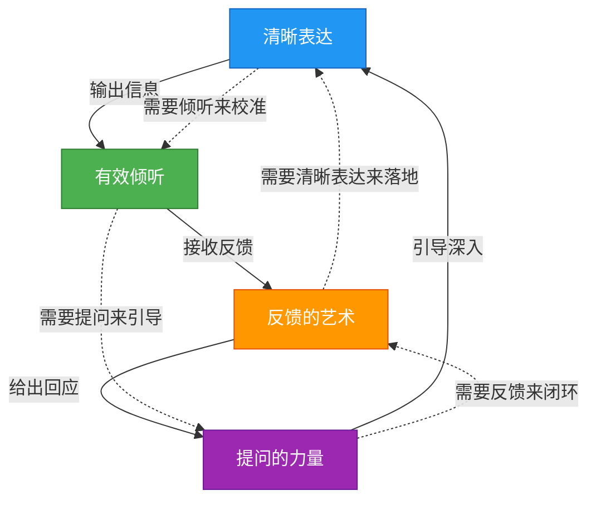

## 本节小结：四大核心技巧的融会贯通

本节系统讲解了沟通的四大核心技巧：清晰表达、有效倾听、反馈的艺术、提问的力量。这四项技能并非各自独立的"招式"，而是一个相互咬合的齿轮系统——表达需要倾听来校准，倾听需要提问来引导，提问需要反馈来闭环，反馈又需要清晰表达来落地。真正的沟通高手，不是精通其中一两项，而是能在真实对话中让四项技能无缝切换、协同运作。

### 四大技巧的核心要点回顾

#### 一、清晰表达：降低对方的认知负荷

清晰表达的本质不是"让自己说清楚"，而是"让对方听明白"。这两件事之间隔着编码方式、通道损耗、解码能力三层过滤器。

**关键认知框架：**

| 框架 | 核心逻辑 | 适用场景 |
|------|----------|----------|
| 金字塔原理 | 先说结论，再给论据，自上而下 | 汇报、提案、邮件 |
| PREP法则 | 观点→理由→案例→重申观点 | 说服、讨论、即兴发言 |
| 信息筛选矩阵 | 只说对方需要知道的 | 跨部门沟通、客户交流 |
| 三秒自检法 | 一句话结论？对方需要什么？对方会问什么？ | 所有开口前的准备 |

**核心方法论：** 想清楚再开口，用结构降低外在认知负荷，用类比增加相关认知负荷，用分层递进管理内在认知负荷。

#### 二、有效倾听：从"听到"到"听懂"的五层跃迁

倾听不是被动接收声波，而是一个涉及神经加工、情感共鸣、认知整合的主动过程。大脑处理语言的速度是说话速度的 3-6 倍，这段"空闲时间"决定了你是在深入理解还是在走神。

**倾听的五个层次：**

| 层次 | 行为特征 | 信息留存率 | 典型表现 |
|------|----------|-----------|----------|
| 忽视 | 完全不关注 | ≈0% | 玩手机、做其他事 |
| 假装倾听 | 表面回应，心不在焉 | <10% | "嗯嗯"但复述不出来 |
| 选择性倾听 | 只听自己感兴趣的部分 | 30-40% | 抓关键词忽略上下文 |
| 专注倾听 | 全神贯注理解内容 | 50-70% | 能复述主要观点 |
| 共情倾听 | 理解内容+感受意图 | 80-90% | 能说出对方没说出口的意思 |

**核心方法论：** 3F 倾听法——Fact（事实）、Feeling（感受）、Focus（意图），从表层信息穿透到深层需求。

#### 三、反馈的艺术：让人变好又不伤感情

反馈是沟通闭环的最后一块拼图，也是最容易出错的环节。大脑的威胁检测系统（SCARF 模型：地位、确定性、自主性、关联感、公平感）会在接收反馈时自动激活——如果触发了威胁感知，对方的理性思考能力下降，防御机制启动。

**反馈的核心模型：**

| 模型 | 结构 | 关键原则 |
|------|------|----------|
| SBI法 | 情境→行为→影响 | 对事不对人，具体可观察 |
| 三明治法 | 肯定→建议→鼓励 | 避免纯负面带来的防御 |
| 前馈法（Feedforward） | 不追究过去，只聚焦未来方向 | 降低抵触，提高接受度 |
| 正向强化法 | 表扬期望行为而非惩罚不期望行为 | 间歇强化效果最持久 |

**核心方法论：** 给反馈的首要任务不是"把话说完"，而是"让对方的防御系统不启动"。即时、具体、对事、平衡正负，是四条铁律。

#### 四、提问的力量：以一当十的沟通杠杆

一个精准的问题，胜过一百句陈述。提问能触发大脑的定向反应（聚焦注意力）、生成效应（自主生成答案记忆更深）、苏格拉底效应（自己想通的比别人告诉的接受度高数倍）。

**提问的类型体系：**

| 维度 | 类型 | 作用 | 典型句式 |
|------|------|------|----------|
| 信息开放度 | 开放式 | 拓宽思路，获取深度信息 | "你怎么看？""具体说说？" |
| 信息开放度 | 封闭式 | 确认事实，收敛结论 | "是还是不是？""哪一天？" |
| 对话功能 | 探询式 | 深挖根因 | "为什么会出现这种情况？" |
| 对话功能 | 引导式 | 引导对方自己得出结论 | "如果换个角度想呢？" |
| 思维层级 | 元认知式 | 让对方审视自己的思考过程 | "你是怎么得出这个结论的？" |

**核心方法论：** 哈佛商学院研究显示，谈判中主动提问的一方达成满意协议的概率高出 42%。提问不是审问，而是传递"你的想法对我很重要"的尊重信号。

### 四大技巧的协同关系

这四项技能在真实沟通中不是线性排列的，而是形成一个动态循环：

**协同运作的实际场景——一场高效的项目复盘会：**

1. **开场用清晰表达**：主持人用金字塔原理亮出复盘结论——"本次延期的核心原因是需求变更流程缺失，而非技术能力不足"
2. **讨论中用有效倾听**：开发负责人讲述延期过程时，项目经理运用共情倾听，不仅听事实，还感受到对方的压力和委屈
3. **深入用提问的力量**：项目经理问"如果重新来一次，在哪个节点做决策可以避免延期？"——引导团队自己找到改进方案
4. **收尾用反馈的艺术**：用 SBI 法肯定团队的快速响应能力（情境→行为→影响），同时用前馈法提出流程改进建议，不追究责任

这个流程之所以高效，正是因为四项技能各司其职又相互支撑：清晰表达设定框架，有效倾听获取真实信息，提问深入本质，反馈推动行动。

### 从知识到能力：刻意练习路线图

知道这四个技巧不等于能用好它们。认知科学的研究表明，从"知道"到"内化为本能"需要经过四个阶段：

**第一周：清晰表达**
- 每次开口前做三秒自检（一句话结论？对方需要什么？对方会问什么？）
- 写邮件/消息时用金字塔原理重组结构
- 每天记录一次"说不清楚"的场景，分析是没想清楚还是没组织好

**第二周：有效倾听**
- 每次对话中刻意压制"想自己说什么"的冲动，专注于理解对方
- 对话结束后练习复述："你刚才说的是……对吗？"
- 识别自己的倾听层次，目标是至少达到专注倾听

**第三周：反馈的艺术**
- 每天至少给一次正面反馈，用 SBI 法结构化
- 需要给建设性反馈时，先写下来检查是否触发了 SCARF 模型中的威胁因素
- 接收反馈时练习"先说谢谢"，不急于辩解

**第四周：提问的力量**
- 用开放式问题替代陈述句至少 3 次/天
- 练习"追问三层为什么"，深入表象之下的根因
- 在会议中用一个精准问题替代长篇发言

**第五周起：综合练习**
- 在真实对话中有意识地组合四项技能
- 每周复盘一次沟通场景，分析哪些技能用好了、哪些还能改进
- 逐步减少刻意感，让技巧内化为自然反应

### 常见误区与纠正

| 误区 | 为什么是错的 | 正确做法 |
|------|-------------|----------|
| "清晰表达就是多说细节" | 细节过多会增加认知负荷，适得其反 | 先给结论和框架，细节按需补充 |
| "倾听就是不说话" | 被动沉默不等于有效倾听 | 用复述、确认、追问展示你在听 |
| "反馈要当面直说才真诚" | 当众批评触发地位威胁，效果适得其反 | 私下反馈，用 SBI 法结构化 |
| "提问就是问为什么" | 连续问"为什么"会让人感觉被审问 | 变换问题类型，加入"怎么做""怎么看" |
| "这些技巧太刻意了" | 不练习才刻意，内化后就是本能 | 所有高手都是从刻意练习开始的 |
| "沟通靠天赋，学不来" | 沟通是技能，技能都可以通过练习提升 | 按路线图坚持 4-8 周，会有明显变化 |

### 本节关键公式

> **沟通效果 = 清晰表达（让信息准确传递） × 有效倾听（让信息完整接收） × 反馈质量（让信息形成闭环） × 提问精度（让信息深入本质）**

四项技能中任何一项为零，整体沟通效果就近乎为零。这就是为什么只练"说话"而不练"听话"的人，沟通能力始终有天花板。

> **下一节预告**：理论和技巧都了解了，下一节我们将通过 8 个真实的沟通案例，看看这些知识和技巧在实际场景中如何运用——从职场汇报到亲密关系，从冲突化解到跨文化沟通，用真实场景检验你的学习成果。
