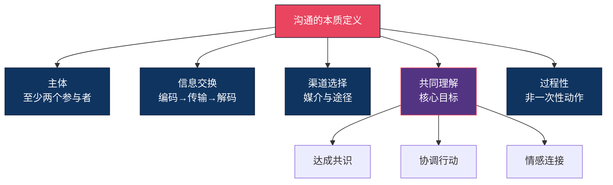
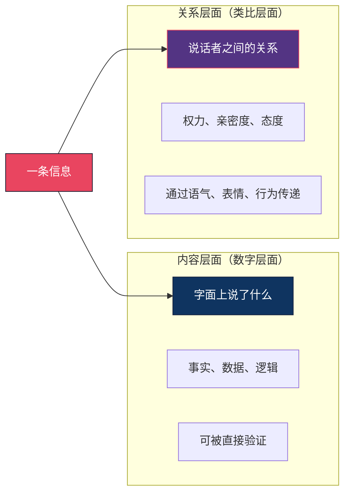

## 一、沟通的定义和本质

在学习任何技能之前，最被低估也最关键的一步是**搞清楚这个东西到底是什么**。如果你对"沟通"的定义是模糊的，那么你学的所有技巧都是在沙子上盖楼——看着像回事，一推就倒。

本节将从词源学、学术定义、本质特征三个层次，帮你建立对沟通的**精确理解**。

### 1.1 词源追溯："沟通"这个词从哪来

#### 西方词源：communicare

英语"communication"源自拉丁语"communicare"，词根"communis"意为"共同的"（common）。"communicare"的本义是"使某物成为共同的"——即**共享**（to share）。

这个词源揭示了一个关键信息：沟通的本质不是"我说了什么"，而是"我们之间是否建立了共同的理解"。如果你说了一句话，对方没有理解，那从词源学的角度来看，**沟通根本没有发生**。

#### 中文词源：沟而通之

中文"沟通"一词出自《左传·哀公九年》："吴城邗，沟通江淮。"原义是挖通沟渠，使水系相连。这个意象极其精妙：

- **沟**：在原本不相连的两个系统之间建立通道
- **通**：使信息、情感、意图像水一样在两个系统间流动

两个原本独立的人，通过沟通建立起信息流动的通道——这就是"沟通"二字的本义。

#### 词源给我们的启示

无论是西方的"共享"还是中国的"沟而通之"，都在强调同一个核心：**沟通不是单向的发射，而是双向的联通**。记住这个词源，你就能在后续学习中始终抓住正确的方向。

### 1.2 学术定义：学者们怎么说

"沟通"是传播学、心理学、管理学、社会学等多个学科的核心研究对象。不同学科的定义各有侧重，综合起来可以形成一个完整的理解。

#### 经典定义汇总

| 学者 | 定义核心 | 侧重点 |
|------|---------|--------|
| 香农与韦弗（Shannon & Weaver, 1949） | 信息从一个点传递到另一个点的过程 | 信息传输的技术层面 |
| 施拉姆（Wilbur Schramm, 1954） | 沟通是发送者与接收者之间协商意义的过程 | 意义的共同建构 |
| 巴恩伦德（Dean Barnlund, 1970） | 沟通是人们通过回应符号来解释意义的过程 | 意义产生于互动 |
| 罗杰斯（Everett Rogers, 1976） | 沟通是一个过程，通过这个过程，参与者创造并共享信息以达成相互理解 | 理解导向 |
| 德维托（Joseph DeVito, 2019） | 沟通是至少两个人之间通过信息交换来创造和回应意义的过程 | 交互性与意义建构 |

#### 综合定义

将上述定义提炼，我们可以给出一个实用的综合定义：

> **沟通是两个或多个主体之间，通过适当的渠道交换信息，以创造共同理解、达成共识或协调行动的过程。**

这个定义包含五个关键要素：

注意这里用的是"共同理解"而非"对方理解"。在现代沟通理论中，理解是双向的——你不仅要让对方理解你，你也要理解对方。这就是施拉姆所说的"协商意义"：意义不是某一方单方面创造的，而是参与者**共同建构**的。

### 1.3 沟通 vs 说话：一个必须厘清的根本区别

很多人把"沟通"和"说话"混为一谈。这个混淆是大多数沟通问题的根源。

#### 核心区别

| 维度 | 说话 | 沟通 |
|------|------|------|
| **目标** | 表达自己的想法 | 实现信息的共享与共同理解 |
| **方向** | 单向（我说→你听） | 双向或多向（我们交流） |
| **关注点** | "我要说什么" | "对方理解了什么" |
| **完成标准** | 说完了就算完成 | 对方理解了才算完成 |
| **包含内容** | 仅限言语表达 | 言语 + 非言语 + 情境 + 反馈 |
| **责任归属** | 说话者的责任 | 双方共同的责任 |
| **效果范围** | 信息发出 | 信息到达 + 理解一致 + 行动匹配 |

#### 三个对比场景

**场景一：工作布置**

- **说话版**："这个报告明天交。"
- **沟通版**："这个报告明天下午3点前交，格式参照上次的Q2模板，重点突出成本数据，如果有困难今天下班前找我。你理解的是什么，说一下？"

**场景二：亲密关系**

- **说话版**："我今天很累。"（然后等着对方来关心自己）
- **沟通版**："我今天项目出了问题，压力很大。我现在需要的是你听我说说，不用帮我解决问题，陪我一会儿就好。"

**场景三：客户沟通**

- **说话版**："这个产品功能很强。"
- **沟通版**："根据您刚才提到的需求，我们的产品可以在三个方面帮到您：第一，自动报表能帮您节省每周约5小时的手工操作；第二，实时预警能让您在问题发生前就收到通知；第三，这个方案王总那边的团队也在用，效果很好。您觉得哪方面最符合您当前的需求？"

#### 为什么这个区分如此重要

如果你把沟通等同于说话，你会把所有精力放在"怎么说"上——练习口才、学习话术、背诵金句。但沟通效果的**决定性因素**往往不在"怎么说"，而在：

1. **你在说什么**：内容是否有针对性，是否符合对方的需求
2. **你在对谁说**：是否理解对方的知识背景、情绪状态、利益关切
3. **你是否在听**：是否捕捉到对方的反馈并及时调整
4. **你是否在确认**：是否确认了对方的理解与你的意图一致

把"说话"等同于"沟通"，就像把"挥拍"等同于"打网球"。挥拍只是网球的一个动作，沟通中的说话也只是众多环节中的一个。

### 1.4 沟通的四大本质特征

理解沟通是什么，需要把握四个不可忽视的本质特征。每一个特征都有深刻的实践含义。

#### 特征一：沟通是不可逆的

一旦信息被发送出去，就无法真正"收回"。

**原理**：人类大脑处理信息时，会自动进行编码和存储。即使你道歉、解释、澄清，原始信息已经进入了对方的认知系统，形成了第一印象。心理学中的"首因效应"（primacy effect）表明，人们接收到的第一条信息会显著影响对后续信息的解读。

**实际例子**：你在会议上脱口而出"这个方案根本不行"，即使你随后补充"我的意思是还有优化空间"，听者的情绪已经被触发。研究表明，负面信息的"记忆粘性"是正面信息的3-5倍——你需要5次以上的正面互动才能抵消一次负面印象的影响。

**实践含义**：
- 重要沟通前先在脑中过一遍，问自己"这句话说出来能收回吗"
- 涉及情绪的沟通，宁可延迟也不要冲动
- 如果已经说错了，立即、直接、真诚地道歉，而不是试图"解释"或"淡化"

#### 特征二：沟通是连续的

沟通没有真正的"开始"和"结束"。每一次沟通都在之前沟通的基础上进行，也会成为未来沟通的背景。

**原理**：沟通学者Watzlawick提出"人不能不沟通"（One cannot not communicate）这一著名命题。即使你选择沉默、回避、不回复，你也在"沟通"——你在传递"我不想和你交流"或"这件事不重要"的信息。你的沉默会被对方解读，解读的结果会影响你们的下一次互动。

**实际例子**：你上周在会议上没有回应同事的提案（你当时在想别的事），同事的解读是"他对我的想法不重视"。这周你需要这个同事配合你的项目，对方的态度明显冷淡。你困惑"我没得罪他啊"——但你确实"得罪"了，只是你不知道。

**实践含义**：
- 不要认为"没说话"就是"没参与"——你的沉默、走神、不回复都在传递信息
- 关系中的每一次互动都在为下一次互动"定调"
- 修复关系需要持续的积极互动，不是一次性的"和好谈话"

#### 特征三：沟通是不可重复的

即使你用完全相同的词语、语气再说一遍，由于时间、情境、对方心态的变化，效果也会不同。

**原理**：沟通不是工业生产——不存在"标准化产品"。每次沟通都是一个独特的、情境化的事件。心理学中的"启动效应"（priming effect）表明，对方刚刚经历了什么、在想什么、情绪状态如何，都会影响他对同样一句话的解读。

**实际例子**：你第一次对伴侣说"你做的饭真好吃"，对方笑得很开心。第二顿饭你用同样的语气说了同样的话，对方可能觉得"你在敷衍我"。第三顿你又说同样的话，对方确信你根本没认真吃。

**实践含义**：
- 不要依赖"模板话术"——每次沟通都需要根据当下的情境做调整
- "复制粘贴"式的沟通（群发消息、模板邮件）是效率的敌人
- 关注当下的情境，而不是依赖过去的成功经验

#### 特征四：沟通同时传递内容和关系

每一条信息都包含两个层面，这是沟通学中最重要的概念之一（Watzlawick的"数字层面"与"类比层面"理论）：

**具体说明**：

| 信息 | 内容层面 | 关系层面 |
|------|---------|---------|
| "这个方案谁做的？" | 在询问方案的作者 | 暗示对方案质量的不满（如果语气尖锐） |
| "随便你吧" | 尊重对方的选择权 | 表达失望、不满或放弃 |
| "你做得很好" | 对工作成果的认可 | 建立积极的工作关系 |
| "这个我来吧" | 提供帮助 | 表达关心，或者暗示"你不靠谱" |
| "嗯" | 表示听到了 | 可能表示冷漠、敷衍或不认同 |

**为什么关系层面更重要**：根据沟通学者的研究，在涉及情感和态度的沟通中，关系层面的信息对沟通效果的影响远大于内容层面。这就是为什么"你说了什么"有时不如"你怎么说"和"你是谁"重要。

**实际例子**：你的领导对你说"这个报告写得不错啊"。
- 如果他平时对你很认可，面带微笑——你觉得是真诚的肯定
- 如果他平时总挑你毛病，表情耐人寻味——你觉得是在阴阳怪气
- 如果他在大老板面前说——你觉得是在展示自己的管理能力

同一句话，三个完全不同的解读，区别全在关系层面。

### 1.5 沟通不是什么：排除常见误解

要真正理解一个概念，不仅要知道它"是什么"，还要知道它"不是什么"。

| 常见误解 | 为什么是错的 | 正确理解 |
|---------|------------|---------|
| "沟通就是把话说清楚" | 把沟通简化为单向输出，忽略了接收者和反馈 | 沟通是双向的，"说清楚"只是第一步 |
| "沟通靠天赋，有人天生就会" | 把沟通能力神秘化，忽略了它是一套可学习的技能 | 沟通能力=知识+方法+练习，任何人都能提升 |
| "沟通越多越好" | 混淆了沟通的量和质，过度沟通反而制造噪音 | 沟通的质量远比数量重要，精准胜过冗余 |
| "不说话就不是沟通" | 忽略了沉默、表情、行为都在传递信息 | 沟通无处不在，沉默也是一种沟通 |
| "沟通是为了说服对方" | 把沟通等同于单向输出，忽略了理解对方的重要性 | 真正的沟通是双向理解，不是单方面说服 |
| "吵架是沟通的失败" | 把冲突等同于失败，忽略了冲突可能带来更深层的理解 | 冲突可以是沟通的一部分，关键在于如何处理 |

### 1.6 理解沟通本质的实践意义

你可能会问："搞清楚沟通的定义有什么用？我要学的是技巧。"

这个问题本身暴露了一个认知陷阱：**跳过原理直接学技巧**。这就像不学力学原理就去盖房子——你可以照着图纸建，但一旦遇到图纸上没有的情况，你就不知道怎么处理了。

理解沟通的本质，能给你带来三个核心能力：

#### 能力一：问题诊断力

当沟通出现问题时，你能快速定位问题出在哪个环节。是编码问题（我说的方式不对）？是渠道问题（不该用微信讨论这事）？是解码问题（对方理解偏差）？还是反馈问题（我根本没确认对方是否理解了）？

#### 能力二：情境适应力

理解了沟通的四大特征，你就能根据情境做出调整。看到同事沉默，你知道那也是沟通；发现效果不好，你知道不能简单重复"再说一遍"；面对不同的人，你知道不能用同一套话术。

#### 能力三：持续进化力

沟通的不可重复性意味着你永远不能"学完"沟通。每一次沟通都是新的，需要你实时观察、调整、优化。这种认知本身就是最重要的能力——它让你保持学习者心态，而不是"我已经很会沟通了"的自满心态。

### 1.7 自检清单：你对沟通的理解到哪一步了

用以下问题检测你对本节内容的理解程度。如果大部分回答为"是"，说明你已经建立了扎实的基础认知。

- [ ] 我能用自己的话解释"沟通"和"说话"的核心区别
- [ ] 我理解"沟通是不可逆的"这一特征，并在日常沟通中有所注意
- [ ] 我知道"沉默也是一种沟通"，并开始注意自己的非言语信号
- [ ] 我能区分一条信息的"内容层面"和"关系层面"
- [ ] 我意识到沟通效果应以"接收者的理解程度"来衡量，而非"我的表达意愿"
- [ ] 我理解沟通能力是可以后天培养的，而非天生固定的
- [ ] 我知道"说清楚了"不等于"沟通完成了"
- [ ] 我开始有意识地在沟通中关注对方的反馈

如果有超过3项回答为"否"，建议你重新阅读对应的部分，并结合自己的实际经历进行反思。

***
