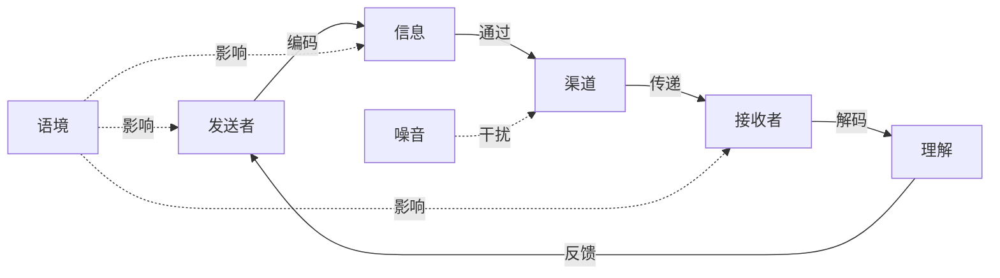
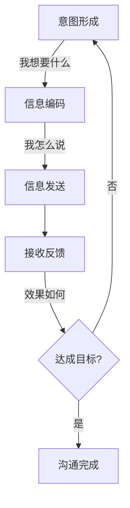
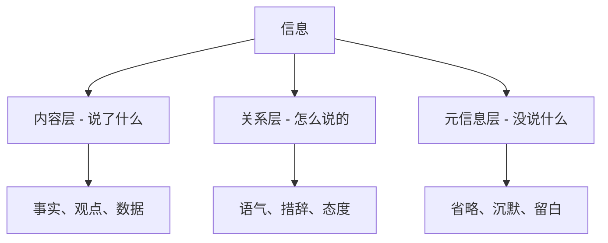
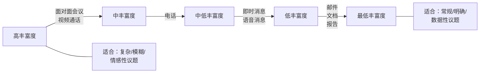
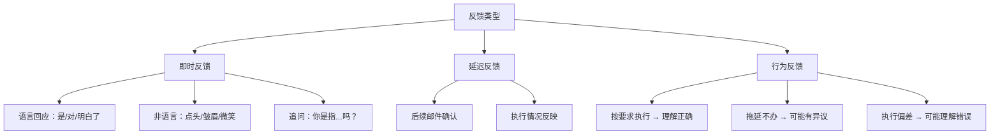
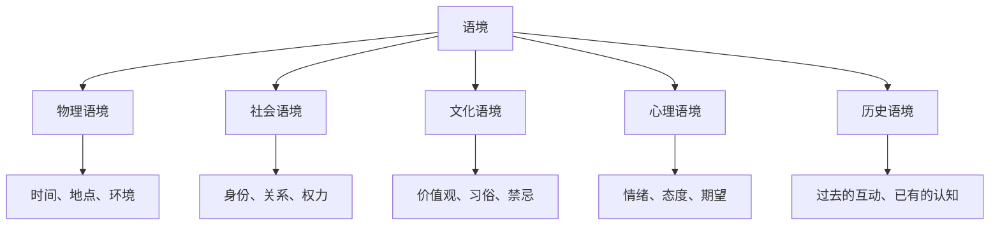

## 三、沟通的要素

上一节我们理解了沟通的定义和本质——"使某物成为共同的"。但光知道目标还不够，我们需要拆解沟通这个过程本身：它到底由哪些部分组成？每个部分如何运作？出了问题该找哪个环节？

本节将系统剖析沟通的七个核心要素，建立一个可以指导实践的**结构化认知框架**。

### 3.0 沟通模型：七要素的协作关系

在逐一讲解每个要素之前，先看它们如何组成一个完整的系统。经典的**香农-韦弗模型**（Shannon-Weaver Model, 1949）是理解沟通过程的起点，它最初用于描述电信信号的传输，后来被广泛应用于人类沟通领域。

这个模型揭示了一个关键事实：**沟通不是单向的信息投递，而是一个包含编码、传递、解码、反馈的循环系统**。任何一个环节出问题，整个系统就会失灵。

但香农-韦弗模型也有局限——它把沟通描述为线性的"发送-接收"过程。后来的学者提出了更贴近现实的模型：

| 模型 | 核心观点 | 局限 |
|------|----------|------|
| **香农-韦弗模型**（1949） | 沟通是信号传输过程，噪音是核心变量 | 过于机械，忽略人的主体性 |
| **施拉姆模型**（1954） | 强调反馈和共享经验，沟通是双向的 | 仍假设双方地位平等 |
| **交易模型**（Barnlund, 1970） | 沟通是同时发送和接收的动态过程 | 描述精确但操作性弱 |
| **建构主义模型**（Delia, 1977） | 沟通是社会现实的建构过程 | 过于学术化 |

> 💡 **实践意义**：你不需要记住每个模型的名字，但要理解一个核心演进——从"我说你听"到"我们一起构建理解"。现代沟通理论认为，**意义不是被传递的，而是被共同创造的**。你说了一句话，对方理解的那个意思，才是这次沟通中真正产生的"意义"。

下面逐一拆解七个要素。每个要素我会从**原理机制→实操方法→常见误区**三层展开。

---

### 3.1 发送者（Sender）

发送者是沟通的起点——决定说什么、怎么说、对谁说。但很多人把发送者理解为"说话的人"，这是一个危险的简化。

#### 3.1.1 发送者的三重身份

发送者在沟通过程中同时扮演三个角色：

1. **意图形成者**：决定沟通的目标——我要传达什么？我希望对方做出什么反应？
2. **信息编码者**：将内心的想法转化为可传递的符号系统——语言、文字、表情、手势
3. **效果评估者**：通过反馈判断信息是否被正确接收和理解

#### 3.1.2 编码：沟通中最被低估的技能

编码是将抽象的思想转化为具体符号的过程。这个过程看似简单，实际上是沟通失败的主要源头之一。

**编码失败的三层原因**：

| 层次 | 问题 | 典型表现 |
|------|------|----------|
| **词汇层** | 找不到准确的词 | "就是那种……嗯……你知道的" |
| **结构层** | 思路混乱，没有逻辑 | 说了五分钟，听者不知道重点是什么 |
| **受众层** | 不考虑对方的接受能力 | 对非技术人员大讲API架构 |

**提升编码能力的三个方法**：

**方法一：先想清楚再开口**

开口（或动笔）之前，用三秒钟回答三个问题：
- 这次沟通的**核心诉求**是什么？（一句话能说清吗？）
- 对方最**关心**什么？（他为什么要听我说？）
- 我希望对方听完后**做什么**？（具体的行动是什么？）

**方法二：匹配对方的认知语言**

同一个意思，对不同人要用不同的编码方式：

> 你要解释"数据库索引"：
> - 对程序员："B+树结构，时间复杂度O(log n)"
> - 对业务人员："就像书的目录，不用翻遍全书就能找到想要的内容"
> - 对老板："能让系统快10倍，但会多占一些存储空间"

**方法三：结构化表达**

人的短期记忆容量有限（米勒定律：7±2个信息块）。结构化表达能让信息更容易被接收和记忆。

常用的结构化框架：
- **PREP法**：Point（观点）→ Reason（理由）→ Example（例子）→ Point（重申观点）
- **时间线法**：先说发生了什么，再说为什么，最后说怎么办
- **金字塔原理**：先说结论，再说支撑论据，逐层展开

#### 3.1.3 发送者的常见误区

**误区一：信息过载**

很多人害怕遗漏信息，于是把所有细节一股脑倒出来。结果是：信息越多，接收者记住的越少。

> ❌ "这个项目涉及到前端的React重构，后端的微服务拆分，数据库的分库分表，还有CI/CD流水线的优化，另外安全审计那边也有几个问题需要处理，对了测试覆盖率也要提升……"
>
> ✅ "这个项目有三个优先级：第一，前端重构（影响用户体验）；第二，数据库优化（当前有性能瓶颈）；第三，安全审计（有合规要求）。其他事项后续排期。"

**误区二：以为"说了"就等于"沟通了"**

发送者最大的错觉是：我把信息发出去了，沟通就完成了。实际上，发送只是沟通的起点。如果你发了一封邮件，对方没看、没理解、没行动——这次沟通就没有发生。

**误区三：不管理自己的沟通形象**

发送者的可信度直接影响信息的接受度。亚里士多德在《修辞学》中提出的"信誉诉求"（Ethos）至今有效：听众会根据发送者的**专业性、可信赖性和亲和力**来判断信息的可信程度。

---

### 3.2 接收者（Receiver）

接收者不是被动的信息容器，而是沟通的**共同参与者**。现代沟通理论的核心突破之一，就是认识到接收者在"理解"这个环节拥有巨大的主动权。

#### 3.2.1 接收者的四个主动行为

**选择性注意**：人的注意力资源是有限的。在信息爆炸的时代，接收者会无意识地过滤掉大量信息。研究表明，人们只关注与自身**需求、兴趣、已有认知**相关的信息。

**选择性理解**：同一个信息，不同人会理解出不同的意思。这不是接收者"笨"，而是每个人都有独特的"认知滤镜"——由知识背景、生活经验、价值观念、当前情绪共同构成。

> 📌 **经典案例**：心理学家卡迈克尔（Carmichael, 1932）做了一个著名实验。给被试看同一个模糊图形，但配上不同的标签（"眼镜"vs"哑铃"），被试回忆时画出的图形会明显偏向标签所暗示的形状。语言标签直接塑造了人们对视觉信息的理解。

**选择性记忆**：人们倾向于记住与自己立场一致的信息，遗忘或歪曲与自己立场矛盾的信息。这就是心理学中的**确认偏误**（Confirmation Bias）。

**选择性反馈**：接收者会根据自己的理解、情绪和目的，选择如何回应——沉默、附和、提问、反驳、忽略，每种选择都是一种反馈。

#### 3.2.2 影响接收者解码的因素

| 因素 | 影响机制 | 应对策略 |
|------|----------|----------|
| **知识背景** | 专业知识决定理解深度 | 发送前了解对方的知识水平，调整用语 |
| **情绪状态** | 负面情绪会扭曲信息解读 | 重要沟通选择对方情绪平稳时进行 |
| **关系立场** | 对发送者的态度影响信息接受度 | 先建立信任，再传递关键信息 |
| **文化背景** | 文化差异导致对同一行为的不同解读 | 跨文化沟通时避免假设"这很显然" |
| **先入为主** | 已有的认知框架限制新信息的接受 | 先用对方能理解的方式打破旧框架 |
| **信息预判** | 根据标题/开头就预判了整段信息的意思 | 关键信息放在开头，避免被误判 |

#### 3.2.3 接收者的常见误区

**误区一：只听自己想听的**

确认偏误让人们自动过滤掉不符合预期的信息。在职场中，下属可能只记住领导说的"这个方案不错"，而忽略了后面的"但是有几个问题需要解决"。

**误区二：急于回应而非理解**

很多人在别人说话时，脑子里已经在组织自己的反驳了。这不是在"听"，而是在"等对方说完"。真正的倾听需要暂时放下自己的立场，先完整地接收对方的信息。

**误区三：忽视非言语信号**

研究表明，面对面沟通中，**语言只传递了约7%的信息**，38%来自语音语调，55%来自面部表情和肢体语言（Mehrabian, 1971）。当然，这个数据常被误用——它主要适用于情感态度的表达场景，不代表所有沟通都是这个比例。但核心启示是：**只听内容、不看表情和语气，你会漏掉大量信息**。

---

### 3.3 信息（Message）

信息是沟通的载体——承载发送者意图的具体内容。很多人以为"信息"就是"说的话"，但真正的信息远比语言丰富。

#### 3.3.1 信息的三层结构

**内容层**（Content Layer）：信息的字面意思。"这个报告需要修改"——事实层面，报告确实需要修改。

**关系层**（Relationship Layer）：信息传递的关系信号。同样这句话：
- 上级对下属说 → 指令
- 同事之间说 → 建议
- 下属对上级说 → 需要极大的勇气和技巧

**元信息层**（Meta-message Layer）：信息中没有说出来的部分。一个领导说"这个季度业绩不错"时**没说**的可能是"但是离目标还有差距"。听众会自动补全这些元信息，而且经常补错。

#### 3.3.2 信息设计的核心原则

**原则一：一条信息，一个核心**

人脑不擅长同时处理多个并行的复杂信息。一封邮件里塞了三件事，很可能每件都处理不好。

> ❌ "关于下周一的会议，我想讨论一下产品发布时间、技术方案选型、还有团队的OKR调整，另外王总问的那个客户案例我整理好了。"
>
> ✅ 拆成两封邮件：
> - 邮件A（周一会议）：议程：产品发布时间（30分钟）→ 技术方案选型（30分钟）→ OKR调整（15分钟）。请提前阅读附件方案。
> - 邮件B（客户案例）：王总要的案例已整理好，见附件。核心结论：客户满意度提升23%。

**原则二：用对方的语言，说对方关心的事**

沟通不是"我有什么"，而是"你需要什么"。同一个项目进展：
- 对老板："项目进度正常，预计下月15号上线，比原计划提前3天。"
- 对技术团队："核心模块已通过压力测试，并发能力达到5000 QPS，剩余工作是UI适配和灰度发布配置。"
- 对客户："您的需求已基本实现，下周可以安排内测。"

**原则三：信息要有"可操作性"**

模糊的信息导致模糊的行动。

> ❌ "你最近注意一下文档的质量。" → 什么叫"注意"？什么叫"质量"？
>
> ✅ "技术文档请确保：(1) 每个API有请求/响应示例；(2) 错误码有对应的排查建议；(3) 配图使用统一的Mermaid格式。下周五前更新完。"

#### 3.3.3 非言语信息的力量

非言语信息不是语言的附属品，它独立地传递着丰富的含义。

| 非言语类型 | 传递的信息 | 可能的误读风险 |
|-----------|-----------|---------------|
| **面部表情** | 情绪状态、态度倾向 | 微笑在不同文化中可能表示尴尬而非认同 |
| **眼神接触** | 专注度、诚意、权力关系 | 过度的眼神接触可能被视为威胁 |
| **肢体动作** | 开放/封闭、自信/紧张 | 交叉双臂可能是冷，不一定是防御 |
| **空间距离** | 亲密度、权力关系 | 不同文化对"舒适距离"差异巨大 |
| **触觉** | 亲密度、支持、控制 | 职场中的触觉信号尤其敏感 |
| **副语言** | 情感强度、真实度 | 语速快可能是紧张，也可能是兴奋 |

> ⚠️ **重要提醒**：非言语信号的解读高度依赖语境和文化背景。没有任何单一的非言语信号能"确定地"传递某个含义。解读非言语信息时，要关注**信号群**（多个信号的一致性），而非单一信号。

---

### 3.4 渠道（Channel）

渠道是信息从发送者到接收者的传输路径。在数字时代，渠道的选择变得空前复杂——不是因为选择太少，而是因为选择太多。

#### 3.4.1 渠道的"信息丰富度"理论

达夫特和伦格尔（Daft & Lengel, 1986）提出了**信息丰富度理论**（Information Richness Theory），将沟通渠道按其传递信息的能力分为高、中、低三个等级：

**高丰富度渠道**（面对面、视频）：
- 优势：同时传递语言、语调、表情、肢体信号；可即时反馈和澄清
- 适用：复杂谈判、冲突处理、敏感话题、团队头脑风暴
- 劣势：时间成本高，需要双方同时在场

**中丰富度渠道**（电话、语音消息）：
- 优势：传递语气和情感，即时性好
- 适用：需要快速确认的事务、远程一对一沟通
- 劣势：缺少视觉信号

**低丰富度渠道**（邮件、文档、消息）：
- 优势：可留底存档，信息可被反复查阅，不占用对方即时时间
- 适用：正式通知、数据汇报、流程规范、跨国跨时区沟通
- 劣势：缺少语气信息，容易被误读，反馈延迟

#### 3.4.2 渠道选择决策框架

不是所有沟通都适合同一个渠道。以下是基于**信息类型×紧急程度×敏感度**的决策框架：

| 场景特征 | 推荐渠道 | 原因 |
|---------|---------|------|
| 复杂 + 紧急 + 高敏感 | 面对面 | 需要即时反馈+完整信号 |
| 复杂 + 不紧急 + 低敏感 | 文档+邮件 | 需要详细论证+留底存档 |
| 简单 + 紧急 + 低敏感 | 即时消息 | 快速确认即可 |
| 简单 + 不紧急 + 低敏感 | 邮件或消息 | 不打扰对方 |
| 复杂 + 紧急 + 低敏感 | 电话/视频 | 需要快速讨论但不涉及情绪 |
| 任何类型 + 高敏感 | 面对面 > 电话 > 文字 | 敏感信息需要完整的信号传递 |

#### 3.4.3 数字时代的渠道陷阱

**陷阱一：用文字处理需要面对面的事**

> ❌ 在微信上跟同事讨论绩效评估结果。
> ❌ 在群聊里指出某人的工作失误。
> ❌ 用邮件进行需要即时来回讨论的决策。

**陷阱二：渠道过度依赖**

当一个团队习惯性地所有沟通都走即时消息（微信群、Slack），会产生"永远在线"的压力，打断深度工作。研究显示，被即时消息打断后，平均需要**23分钟**才能恢复到之前的专注状态（UC Irvine研究, Gloria Mark）。

**陷阱三：渠道不对称**

发送者用自己方便的渠道，而非接收者方便的渠道。领导习惯发语音消息，但下属在嘈杂的工厂车间根本听不清——这时候文字消息反而更有效。

---

### 3.5 反馈（Feedback）

反馈是沟通的"确认回执"——它告诉你信息是否到达、是否被正确理解、是否产生了预期的效果。**没有反馈的沟通，只是信息发布，不是真正的沟通。**

#### 3.5.1 反馈的类型和层次

**即时反馈**：沟通进行中的实时回应。包括语言回应（"明白了"、"等一下，你说的是……"）、非语言回应（点头、皱眉、身体前倾表示关注）、追问和确认。

**延迟反馈**：沟通结束后的回应。包括邮件确认、执行结果、后续行为。很多职场沟通失败，就是因为缺少延迟反馈——会议上都说"明白了"，事后执行完全走样。

**行为反馈**：最真实的反馈。一个人说什么不重要，做什么才是真正的反馈。领导说"我很重视团队建设"，但从不参加团建活动——行为反馈已经给出了真实答案。

#### 3.5.2 如何获取有效反馈

**技术一：开放式提问**

> ❌ "明白了吗？" → 对方几乎一定会说"明白了"（即使没明白）
>
> ✅ "你能用自己的话复述一下，我们接下来的行动计划是什么？" → 能真正检测理解程度
>
> ✅ "关于这个方案，你觉得最大的风险是什么？" → 开放式问题引出真实想法
>
> ✅ "如果执行中遇到问题，你预计会是什么问题？" → 提前暴露潜在障碍

**技术二：观察非言语信号**

语言可以说谎，但身体很难完全配合说谎。当对方说"没问题"但同时：
- 回避眼神 → 可能有顾虑没说
- 身体后仰/交叉双臂 → 可能有抵触情绪
- 频繁看手机/手表 → 可能急于结束对话

**技术三：创建安全的反馈环境**

很多人不敢给真实反馈，是因为担心后果。发送者需要主动创造安全感：

- "我想听听你真实的想法，哪怕是反对意见，对我都有帮助。"
- "这个方案你觉得有什么问题？我现在改比上线后改成本低多了。"
- 对有建设性的反馈给予公开认可，让人看到"说真话是安全的"。

#### 3.5.3 反馈的常见误区

**误区一：把"收到"当成"理解"**

> 领导："小王，下周三之前把这个报告给我。"
> 小王："好的。" ← 这只表示"我听到了"，不代表"我理解了你要什么样的报告"。

正确的做法：发送信息后，要求对方复述关键信息或确认具体细节。

**误区二：只关注正面反馈**

很多人只愿意听到"好的""没问题"，对质疑和反对意见产生防御心理。但恰恰是那些"不舒服的反馈"才是最有价值的——它指出了你没有意识到的问题。

**误区三：反馈不及时**

沟通结束后发现理解有误，但因为"不好意思"或"怕麻烦"而没有及时澄清。小误解在48小时后就会变成大问题。

---

### 3.6 噪音（Noise）

噪音是沟通过程中**任何干扰信息准确传递和理解的因素**。注意，"噪音"不一定是声音——任何降低沟通保真度的因素都算噪音。

#### 3.6.1 噪音的完整分类

| 噪音类型 | 具体表现 | 对沟通的影响 | 典型案例 |
|---------|---------|-------------|---------|
| **物理噪音** | 噪杂环境、信号不好、设备故障、网络延迟 | 信息无法完整到达接收者 | 视频会议卡顿导致关键信息丢失 |
| **生理噪音** | 疼痛、疲劳、饥饿、听力/视力问题、疾病 | 接收者注意力和理解力下降 | 加班到凌晨时讨论方案，第二天谁也记不清结论 |
| **心理噪音** | 偏见、焦虑、愤怒、走神、刻板印象、先入为主 | 信息被选择性接收或扭曲解读 | "他每次提的意见都是找茬" → 自动过滤对方的合理建议 |
| **语义噪音** | 专业术语、方言、歧义、双关语、隐喻 | 同一句话被不同人理解为不同意思 | 技术负责人说"这个方案需要refactor"，产品经理理解为"推倒重来" |
| **信息噪音** | 信息过载、无关信息干扰、多渠道信息冲突 | 重要信息被淹没在噪音中 | 微信群里999+条消息中有一条重要的@通知，被刷过去了 |
| **文化噪音** | 文化差异、价值观念冲突、社会规范不同 | 沟通信号在跨文化传递中变形 | 中国人的"我再考虑考虑"常被西方人误解为"有兴趣"，实际意思是"不太行" |

#### 3.6.2 噪音的量化影响

根据沟通研究的统计数据：
- 在典型的企业会议中，参会者**只记住了约25-50%**的讨论内容
- 48小时后，这个比例进一步下降到**10-25%**
- 在嘈杂环境中，语音信息的错误率可以达到**20-30%**
- 跨文化沟通中的误解率比同文化沟通高出**40-60%**

这些数据说明：**噪音不是"可能会发生"的问题，而是"一定会发生"的问题**。你的沟通策略必须内置噪音应对机制。

#### 3.6.3 系统性降噪策略

**策略一：环境降噪**

- 重要沟通选择安静、舒适、私密的环境
- 视频会议前检查设备、网络、灯光
- 关闭不必要的通知和干扰源
- 对于持续性噪音（如开放式办公室），建立"免打扰"信号

**策略二：编码降噪**

- 使用简洁、明确、无歧义的语言
- 关键信息用"先说结论+再给理由+最后重复结论"的结构
- 重要数字和日期同时用数字和文字表达（"下周五（6月27日）"）
- 专业术语首次出现时给出解释

**策略三：冗余降噪（Redundancy）**

信息论中的"冗余"概念：通过重复和多通道传递来对抗噪音。
- 重要决定通过**会议口头确认 + 会后邮件书面记录**双重渠道
- 关键指令用不同方式重复："我说一下，你复述一遍"
- 复杂方案提供文字版+图示版+口头讲解

**策略四：心理降噪**

- 发送前自检：我是否有偏见在影响我的信息？
- 接收前自检：我是否有情绪在干扰我的理解？
- 定期进行"认知脱钩"：暂时放下自己的立场，纯粹从对方角度理解信息

---

### 3.7 语境（Context）

语境是沟通发生的背景条件。如果说信息是沟通的"内容"，那语境就是沟通的"容器"——同样的内容放在不同的容器里，呈现出来的效果完全不同。

#### 3.7.1 语境的五个层次

**物理语境**：沟通发生的时间、地点和物理环境。

> 同样的反馈：
> - 在领导办公室关门谈 → 私密、严肃、重要
> - 在茶水间随口提 → 非正式、随意、可能不重要
> - 在全体会议上说 → 公开、有压力、必须认真对待

**社会语境**：双方的社会身份、关系和权力结构。

> "这个方案不太成熟"这句话：
> - 老师对学生 → 指导和鼓励
> - 面试官对候选人 → 可能是委婉的拒绝
> - 投资人对创业者 → 需要认真对待的警告

**文化语境**：双方共享或差异的文化背景。

中国文化中的"高语境"特征：很多信息不直接说出来，需要"听懂弦外之音"。而西方文化偏向"低语境"：说什么就是什么，不需要过度解读。

| 维度 | 高语境文化（中国、日本） | 低语境文化（美国、德国） |
|------|---------------------|---------------------|
| 信息表达 | 隐含、含蓄、间接 | 直接、明确、外显 |
| 依赖程度 | 高度依赖语境和关系 | 依赖语言本身的含义 |
| 拒绝方式 | "我再考虑考虑" | "不，谢谢" |
| 契约精神 | 关系比合同重要 | 合同比关系重要 |
| 时间观念 | 灵活、弹性 | 严格、准时 |

**心理语境**：双方当时的情绪状态、态度和期望。

> - 同事刚被领导批评后，你去提需求 → 对方可能带着防御和不满
> - 伴侣刚收到升职消息，你提一个请求 → 对方可能更愿意配合
> - 客户已经对产品有不满，你去推销新功能 → 需要先解决旧问题

**历史语境**：过去的互动记录对当前沟通的影响。

如果你和某人之前有过冲突，那么现在即使你说的是中性的话，对方也可能带着防御心态来接收。历史语境是隐形的，但影响力巨大。

#### 3.7.2 语境敏感度：高级沟通者的核心能力

语境敏感度是指在沟通中**快速识别和适应当前语境**的能力。这种能力包括三个层次：

**层次一：感知语境** — 能意识到"现在是什么情况"

> 走进会议室，发现大家面色凝重 → 意识到可能刚发生了什么事 → 调整自己原定的轻松开场

**层次二：解读语境** — 能理解语境对信息的影响

> 同事说"随便吧" → 结合他之前三小时都在加班、他的语气疲惫、他对这个方案的多次反馈 → 理解这不是"无所谓"，而是"我已经不想争论了"

**层次三：利用语境** — 能主动利用语境来优化沟通效果

> 选择在对方心情好的时候提加薪；在项目刚成功的时候讨论团队建设；在非正式场合预沟通，再在正式场合确认

---

### 3.8 七要素的协同：一个完整的沟通分析框架

理解了七个要素之后，真正的价值在于**用这个框架来分析和优化实际的沟通场景**。以下是两个完整的案例分析。

#### 案例一：跨部门项目推进困难

**场景**：产品经理小李需要技术团队在两周内完成一个功能开发，但技术负责人老张表示"排期满了，做不了"。

| 要素 | 分析 | 优化建议 |
|------|------|----------|
| **发送者** | 小李只从产品角度出发，未考虑技术约束 | 先了解技术团队当前的优先级和资源状况 |
| **接收者** | 老张可能有过"需求临时插入导致延期"的不良经历 | 理解老张的顾虑，用数据而非情绪说服 |
| **信息** | "两周内做完"——只有要求，没有理由和价值说明 | 说明为什么是两周：竞品动向、用户投诉量、商业影响 |
| **渠道** | 在微信群里直接@老张提需求，过于随意 | 先一对一沟通，了解可行性后再走正式流程 |
| **反馈** | 老张说"做不了"后，小李没有追问具体原因 | 追问："是人力不够还是技术复杂度高？有没有折中方案？" |
| **噪音** | 双方可能有"产品和技术天生对立"的心理噪音 | 聚焦共同目标（用户体验/业务增长），而非部门立场 |
| **语境** | 老张团队刚经历一次紧急故障修复，士气低落 | 先表达对技术团队辛苦的理解，再提新需求 |

#### 案例二：向上汇报被忽视

**场景**：工程师小王向领导汇报技术债务问题，领导回复"先做业务需求"。

| 要素 | 分析 | 优化建议 |
|------|------|----------|
| **发送者** | 小王用技术视角描述问题，领导不一定理解技术影响 | 将技术问题翻译为业务风险："如果不修复，系统可能在用户量翻倍时崩溃" |
| **接收者** | 领导关注业务指标，对"技术债务"没有紧迫感 | 用领导关心的语言：营收影响、用户流失、故障频率 |
| **信息** | "技术债务很多，需要时间重构"——太模糊 | 给出具体数据：代码覆盖率从80%降到45%，近3个月线上故障2次的根因 |
| **渠道** | 口头随口一提 | 写一份简短的分析报告，附带数据和方案选项 |
| **反馈** | 领导说"先做业务"后就结束了 | 追问："我理解业务优先级高。我能否做一个分批重构的计划，每周投入20%的时间？" |
| **噪音** | 领导可能以为"技术想偷懒不做业务" | 明确表达"不是不做业务，是想避免未来更大的故障损失" |
| **语境** | 公司正在冲刺季度目标，领导压力很大 | 选择Q1结束后、下一个冲刺开始前的窗口期提出 |

---

### 3.9 常见误区与纠正

| 误区 | 为什么错 | 正确做法 |
|------|----------|----------|
| "我说清楚了就是沟通清楚了" | 忽略了接收者的解码过程 | 以对方的理解为标准，而非自己的表达 |
| "渠道不重要，内容才重要" | 好的内容通过错误的渠道传递也会失败 | 根据信息特征匹配合适的渠道 |
| "非言语信号不可控" | 非言语信号可以通过刻意练习改善 | 录制自己的演示视频，观察并调整 |
| "反馈越多越好" | 无效反馈只会增加信息噪音 | 追求高质量反馈：具体、可操作、有建设性 |
| "噪音无法避免，只能接受" | 大部分噪音可以通过策略降低 | 主动设计降噪机制，而非被动承受 |
| "语境分析是过度解读" | 忽略语境是沟通失败的主要原因之一 | 养成"暂停三秒，评估语境"的习惯 |

---

### 3.10 实操清单：沟通要素自检

在任何重要沟通之前，用这个清单快速自检：

【发送前自检】
□ 我的核心诉求是什么？（一句话说清）
□ 对方最关心什么？（他的"为什么"）
□ 我希望对方听完做什么？（具体行动）
□ 我用的表达方式对方能理解吗？（匹配认知水平）
□ 我选的渠道合适吗？（复杂度×紧急度×敏感度）

【进行中自检】
□ 对方在认真听吗？（观察注意力信号）
□ 对方理解对了吗？（要求复述或举例）
□ 对方有顾虑没说出来吗？（观察非言语信号）
□ 环境有干扰因素吗？（物理噪音排查）

【沟通后自检】
□ 对方清楚接下来要做什么吗？（行动确认）
□ 我需要书面确认吗？（重要事项发邮件纪要）
□ 下次什么时候跟进？（设定反馈节点）

---

> 💡 **本节核心要点**：沟通不是一个简单的"说→听"过程，而是一个由发送者、接收者、信息、渠道、反馈、噪音、语境七个要素构成的动态系统。提升沟通能力的关键，不是只练"说话技巧"，而是**系统性地优化每一个要素，并理解它们之间的相互影响**。当你能把一次失败的沟通拆解为"哪个要素出了问题"时，你就找到了改进的方向。

