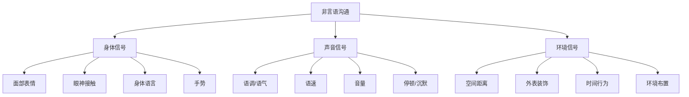
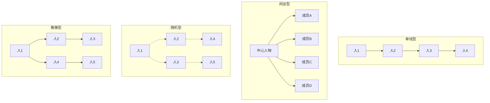
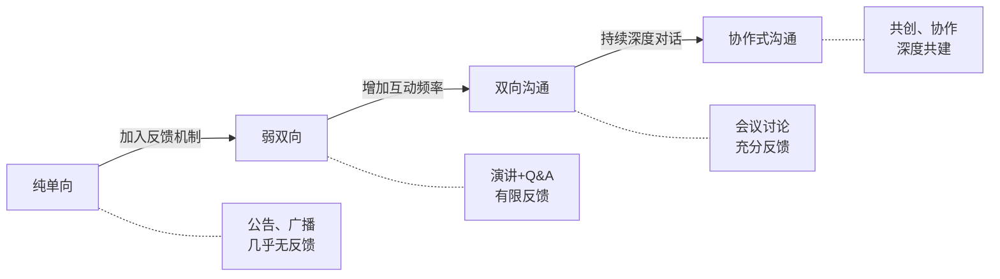
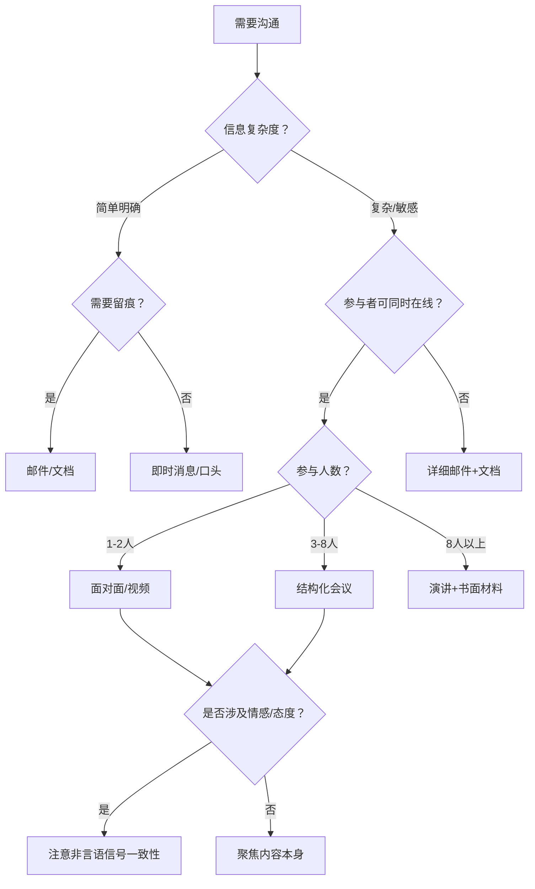

## 四、沟通的类型

上一节我们拆解了沟通的七个核心要素——发送者、编码、信息、渠道、接收者、解码、反馈，以及贯穿全程的语境和噪音。现在一个自然的问题是：这些要素的不同组合方式，会产生哪些不同类型的沟通？每种类型的运作机制有何差异？在特定场景下应该选择哪种类型？

对沟通类型的系统认知，不是学术分类的游戏，而是**选择沟通策略的基础**。就像医生需要了解不同病理类型才能对症下药，沟通者需要了解不同沟通类型才能因场景制宜。

### 4.1 按符号系统分类：言语沟通 vs 非言语沟通

这是最基础的分类维度——沟通依赖什么符号系统来传递信息？

#### 4.1.1 言语沟通（Verbal Communication）

言语沟通指通过语言符号（词汇、语法、句式）传递信息的方式。人类语言是一套高度发达的符号系统，具有**任意性**（词和事物之间没有天然联系）、**创造性**（有限的词汇和规则可以生成无限的句子）、**双重性**（既有语音层面又有意义层面）等特征。正是这些特征使言语沟通能够传递抽象概念、复杂逻辑和微妙情感。

言语沟通分为两大子类型：

**口头言语沟通**

口头沟通是人类最古老、最自然的沟通形式。它的核心优势在于**即时性**和**丰富性**——说话者可以根据听者的反应实时调整内容和方式，语调、语速、停顿等副语言特征为信息增添了文字无法承载的层次。

| 场景 | 特点 | 适用情境 | 注意事项 |
|------|------|----------|----------|
| 面对面交谈 | 信息最丰富，含全部非言语线索 | 深度讨论、敏感话题、建立关系 | 注意对方的微表情和身体语言 |
| 电话/语音通话 | 保留语调信息，缺少视觉线索 | 远程确认、快速沟通、紧急事务 | 语速适中，重要信息复述确认 |
| 会议发言 | 多人互动，结构化程度高 | 团队决策、信息同步、头脑风暴 | 控制时长，突出重点，留出讨论时间 |
| 演讲/汇报 | 单向为主，有明确的说服目标 | 公开演讲、项目汇报、培训 | 逻辑清晰，善用故事和数据 |
| 语音消息 | 异步但保留语调，可反复收听 | 非紧急但需要语气传达的信息 | 控制在60秒内，避免连续长语音 |

口头沟通的最大挑战是**即时性带来的不可逆性**——说出去的话无法撤回，容易因紧张、情绪或准备不足而说出不当内容。应对策略是：重要沟通前做准备（写下要点），不确定的话先想再说，学会用"让我想想"争取思考时间。

**书面言语沟通**

书面沟通的核心优势在于**精确性**和**持久性**——文字可以反复推敲、精确表达，形成可查阅、可追溯的记录。它的核心劣势是**缺少副语言信息**，容易因语气不明而被误解。

| 场景 | 特点 | 适用情境 | 注意事项 |
|------|------|----------|----------|
| 正式邮件 | 结构化、可存档、有法律效力 | 工作汇报、跨部门协调、正式通知 | 主题明确，结构清晰，CTA明确 |
| 即时消息（微信/钉钉） | 半正式，异步，碎片化 | 日常协调、快速确认、团队沟通 | 避免歧义，重要事项确认收到 |
| 报告/文档 | 高度结构化，面向多人 | 项目报告、方案文档、知识沉淀 | 数据准确，逻辑自洽，排版清晰 |
| 合同/协议 | 法律约束力，措辞严谨 | 商务合作、雇佣关系、交易确认 | 逐条审阅，必要时法律审核 |
| 备忘录/纪要 | 记录性，便于回溯 | 会议记录、决策留痕、任务分配 | 事实准确，责任到人，时间明确 |

书面沟通的关键技巧：**开头说结论**（不要让读者猜你要说什么），**分段分点**（大段文字是阅读障碍），**明确行动项**（谁在什么时间之前做什么），**检查语气**（发送前重读一遍，从接收者角度感受语气）。

#### 4.1.2 非言语沟通（Non-verbal Communication）

非言语沟通指不依赖语言文字，而是通过身体信号、空间使用、时间行为等方式传递信息。美国心理学家雷·伯德惠斯特尔（Ray Birdwhistell）的研究估计，在面对面沟通中，**大约65%的社会意义通过非言语方式传递**。

非言语沟通的重要性在于它往往是**无意识的、难以伪装的**。一个人可以说"我没生气"，但他紧握的拳头、紧绷的下颌、冷硬的语调，传递的是相反的信息。当言语和非言语信息矛盾时，人们更倾向于相信非言语信号——因为它更难被刻意操控。

以下是八大类非言语信号的系统分析：

| 类别 | 定义 | 典型信号 | 传递的信息 | 文化差异提示 |
|------|------|----------|------------|-------------|
| **面部表情** | 面部肌肉运动形成的情绪信号 | 微笑、皱眉、挑眉、抿嘴 | 基本情绪（喜怒哀惧惊厌恶） | 微笑的含义因文化而异：西方=友好，日本可能=尴尬 |
| **眼神接触** | 目光的方向、时长、频率 | 直视、回避、瞳孔放大、频繁眨眼 | 关注度、真诚度、权力关系、兴趣 | 东亚文化中长时间直视可能被视为冒犯 |
| **身体语言** | 姿态、动作、身体朝向 | 双臂交叉、身体前倾/后仰、翘腿 | 开放/防御、兴趣/无聊、自信/紧张 | 双臂交叉在某些文化中只是习惯，非防御 |
| **手势** | 手和手臂的有意识/无意识动作 | 竖大拇指、摆手、指点、搓手 | 强调、指示、情绪状态、文化身份 | OK手势在巴西是侮辱，在法国是"零" |
| **副语言** | 语言之外的声音特征 | 语调、语速、音量、停顿、叹息、笑声 | 情绪状态、强调重点、态度倾向 | 语速快=热情（西方）vs 不稳重（某些亚洲文化） |
| **空间距离** | 人际距离的使用 | 靠近/远离、座位选择、身体朝向 | 关系亲疏、权力地位、舒适度 | 北欧偏好较大距离，拉美/中东偏好较小距离 |
| **外表与装饰** | 穿着、发型、饰品、妆容 | 正装、休闲装、整洁程度、配饰 | 身份、态度、专业度、自我认同 | 着装规范因行业和文化差异极大 |
| **时间行为** | 对时间的使用和态度 | 准时/迟到、回复速度、对话时长 | 重视程度、权力关系、文化背景 | 德国/日本极重准时，某些文化中迟到是常态 |

**梅拉比安法则及其正确理解**：心理学家阿尔伯特·梅拉比安（Albert Mehrabian）1967年的研究表明，在涉及情感和态度的沟通中，言语内容占7%，语调占38%，面部表情占55%（即著名的7-38-55法则）。这个数据经常被误用——它**仅适用于言语内容与非言语信号矛盾的情境**（比如一个人用讽刺的语调说"我很高兴"），而非所有沟通场景。传递复杂技术信息时，言语内容的占比远高于7%。但这个研究的核心启示是成立的：**在涉及态度和情感的沟通中，"怎么说"往往比"说什么"更重要**。

**如何提升非言语沟通能力**：

1. **自我觉察**：录像回看自己的演讲或对话，观察自己的非言语习惯（很多人第一次看到自己的手势和表情会很惊讶）
2. **观察训练**：在公共场所观察陌生人的互动，尝试仅通过非言语信号判断他们的关系和情绪
3. **一致性检查**：确保你的言语和非言语信号一致——说"我很重视这个项目"时，确保你的眼神、语调和姿态也在传递同样的信息
4. **适应对方**：注意对方的非言语舒适区（距离、眼神接触频率），适度匹配可以建立亲近感

### 4.2 按组织维度分类：正式沟通 vs 非正式沟通

在组织和团队环境中，沟通沿着两条平行的路径流动：一条是组织架构设计的"官方通道"，另一条是人际关系自然形成的"民间通道"。理解这两种通道的特征和互补关系，是组织沟通能力的基础。

#### 4.2.1 正式沟通

正式沟通指遵循组织结构、规章制度和既定流程进行的信息传递。它的核心特征是**目的明确、结构规范、可追溯**。

正式沟通的四种流向：

| 流向 | 说明 | 示例 | 优势 | 风险 |
|------|------|------|------|------|
| **下行沟通** | 从上级到下级 | 政策通知、任务分配、绩效反馈 | 确保指令一致、权威性强 | 信息衰减（每经过一层约丢失20-30%） |
| **上行沟通** | 从下级到上级 | 工作汇报、建议提案、申诉 | 获取一线信息、增强员工参与感 | 过滤效应（下级倾向于报喜不报忧） |
| **平行沟通** | 同级之间 | 跨部门协调、项目协作、信息共享 | 提高效率、打破部门壁垒 | 权责不清、推诿扯皮 |
| **斜向沟通** | 不同层级、不同部门之间 | 矩阵式项目组、专家咨询 | 灵活高效、促进知识流动 | 越级风险、破坏指挥链 |

**正式沟通的典型形式**：

- **会议**：最昂贵的沟通形式（5人会议1小时=5人小时的成本），必须有议程、有结论、有行动项、有纪要
- **邮件**：组织沟通的"纸面证据"，适合需要留痕的决策、通知和跨时区协调
- **报告/文档**：高度结构化的信息载体，适合复杂信息的系统呈现和长期保存
- **公告/通知**：一对多的信息广播，适合政策变更、制度更新等需要统一传达的信息
- **合同/协议**：具有法律约束力的正式沟通，措辞必须精准无歧义

**正式沟通的常见问题**：

1. **层级过滤**：信息从基层到高层，每一层都会被"加工"——美化、简化、选择性传递。通用电气前CEO杰克·韦尔奇推行"群策群力"（Work-Out），部分原因就是要打破这种层级过滤。
2. **官僚化**：过度依赖正式渠道导致沟通僵化，简单的事情也要走冗长的流程。
3. **信息过载**：过多的会议、邮件和报告导致核心信息被淹没。

#### 4.2.2 非正式沟通

非正式沟通指不受组织结构和正式流程约束的、自然发生的沟通。它的核心特征是**自发性强、传递速度快、情感色彩浓**。

非正式沟通的典型形式：

- **茶歇/午餐聊天**：非正式场合的闲聊往往能传递正式渠道听不到的真实信息
- **即时消息群聊**：工作群中的非正式交流，快速同步、即时反馈
- **社交互动**：朋友圈点赞评论、线下聚会、兴趣小组
- **偶遇交流**：走廊、电梯、吸烟区的偶发对话

**非正式沟通网络——"葡萄藤"理论**：管理学家基思·戴维斯（Keith Davis）在1953年的研究中发现，组织中的非正式沟通网络（他称之为"葡萄藤"，Grapevine）有四种典型形态：

- **单线型**：信息沿固定链条逐一传递，每传一次就可能变形一次
- **闲谈型**：一个人（通常是社交活跃者）把信息传递给所有人
- **随机型**：每个人随机选择传递对象，覆盖范围不定
- **簇簇型**：信息在紧密的小圈子内快速传播，但不一定跨圈——这是最常见的形态

**管理非正式沟通的策略**：非正式沟通不能被消灭（试图消灭只会让它转入更隐蔽的状态），但可以被引导。有效的策略包括：让正式渠道更快更透明（减少"内幕消息"的价值），在关键人群中建立信息桥梁，利用非正式网络传递正向信息。

#### 4.2.3 正式与非正式沟通的互补

两种沟通不是对立的，而是互补的系统：

| 维度 | 正式沟通 | 非正式沟通 |
|------|----------|------------|
| 信息准确性 | 高（经过审核和确认） | 低（容易变形和添油加醋） |
| 传递速度 | 慢（需要走流程） | 快（口口相传，即时传播） |
| 情感传递 | 弱（格式化、去人格化） | 强（自然、真实、有温度） |
| 覆盖范围 | 可控（指定接收者） | 不可控（难以限制传播范围） |
| 可追溯性 | 强（有记录、有存档） | 弱（没有正式记录） |
| 信任建立 | 中（制度信任） | 高（人际信任） |

**实践建议**：优秀的沟通者会在两种模式之间灵活切换——用正式渠道确保决策的准确性和权威性，用非正式渠道建立关系、收集真实反馈、传递温度。许多重大决策，其实在正式会议之前的非正式交流中就已经基本形成了。

### 4.3 按信息流向分类：单向沟通 vs 双向沟通

信息在沟通参与者之间如何流动？是单方向投递，还是双向交互？这个维度直接影响沟通的效率和准确性。

#### 4.3.1 单向沟通（One-way Communication）

单向沟通中，信息从发送者到接收者的单一方向流动，没有或几乎没有即时反馈。

**典型场景**：

- 广播、电视新闻（一对多，无即时反馈）
- 公告、通知（一对多，书面形式）
- 演讲、讲座（一对多，口头形式但互动有限）
- 指令下达（一对一，军事或紧急场景）

**单向沟通的优势**：

1. **速度快**：不需要等待反馈和确认，信息可以快速传递给大量受众
2. **控制力强**：发送者完全掌控信息的内容和节奏
3. **效率高**：在信息简单、受众明确的场景下，单向沟通的单位时间信息量最大
4. **适合标准化**：同样的信息可以精确地传递给所有人

**单向沟通的局限**：

1. **准确性无法验证**：发送者不知道接收者是否正确理解了信息
2. **无法适应个体差异**：所有接收者得到同样的信息，无法因人而异
3. **容易产生误解**：接收者的疑问无法及时解答，错误理解无法及时纠正
4. **参与感低**：接收者被动接受，容易产生抵触或走神

#### 4.3.2 双向沟通（Two-way Communication）

双向沟通中，信息在参与者之间双向流动，每个参与者既是发送者也是接收者，通过持续的反馈和确认达成理解。

**典型场景**：

- 面对面讨论（一对一或一对多）
- 谈判、协商（多方互动）
- 头脑风暴（开放式讨论）
- 辅导、教练对话（引导式互动）
- 客户服务（需求确认和问题解决）

**双向沟通的优势**：

1. **准确性高**：通过反馈和确认，可以及时发现和纠正误解
2. **参与感强**：接收者被尊重和倾听，更愿意配合和投入
3. **适应性强**：可以根据对方的反应实时调整沟通策略
4. **关系建立**：互动过程本身就是建立信任和关系的过程

**双向沟通的局限**：

1. **耗时较长**：需要等待反馈、讨论和确认，决策速度较慢
2. **可能陷入争论**：不同观点的碰撞可能导致冲突升级
3. **对沟通者要求高**：需要同时具备表达和倾听能力
4. **成本较高**：尤其在多人场景中，时间成本显著增加

#### 4.3.3 选择策略

单向和双向沟通不是"好"与"坏"的关系，而是"适用场景不同"的关系。选择的关键变量有三个：

| 决策因素 | 倾向单向 | 倾向双向 |
|----------|----------|----------|
| 时间紧迫度 | 紧急，需要快速传达 | 有充足时间讨论 |
| 信息复杂度 | 简单、明确、标准化 | 复杂、需要解释和讨论 |
| 反馈需求 | 不需要确认理解 | 需要确认对方正确理解 |
| 关系重要度 | 一次性通知，关系影响小 | 长期合作，关系质量重要 |
| 共识需求 | 执行命令即可 | 需要对方认同和支持 |
| 受众规模 | 大规模（数百人以上） | 小规模（可互动的范围内） |

**关键洞察**：在实际沟通中，纯粹的单向和双向沟通都不多见。大多数沟通处于一个**连续体**上——演讲是偏单向的，但好的演讲者会通过观察听众反应（非言语反馈）来调整；邮件是偏单向的，但通过多轮往来可以变成双向讨论。真正重要的是：**在需要反馈的环节，你是否为双向沟通创造了条件？**

### 4.4 按参与人数分类：个体沟通 vs 群体沟通

参与沟通的人数不同，沟通的动态、挑战和策略也截然不同。

#### 4.4.1 个体沟通（Intrapersonal & Interpersonal）

**自我沟通（Intrapersonal Communication）**：与自己的内部对话。这是最容易被忽视但影响最深远的沟通类型——你的自我对话模式决定了你的自信水平、情绪状态和决策质量。

- **内省**：对自身想法、情感和行为的反思
- **自我暗示**："我做不到"vs"我可以试试"——内心的语言塑造外在的表现
- **心理预演**：重要沟通前在脑中模拟对话过程，预设可能的问题和应对

**人际沟通（Interpersonal Communication）**：两人之间的沟通。这是最基本、最高频的沟通形式，也是所有其他沟通形式的基础。

人际沟通的独特之处在于**高互动性和高情境依赖性**——每句话都在前面所有对话的语境中获得意义，关系的历史影响当下的解读。同样一句"你今天怎么迟到了"，从亲密朋友口中和从严厉上司口中说出，含义完全不同。

#### 4.4.2 群体沟通（Group Communication）

当沟通参与者超过两人，群体动力学开始发挥作用。

**小群体沟通（3-12人）**：团队会议、小组讨论、项目组协作。

群体沟通相比个体沟通的独特挑战：

1. **社会懈怠**：群体越大，个人越容易"搭便车"——因为自己的贡献不容易被识别
2. **群体思维**：高度凝聚的群体倾向于追求一致，压制不同意见（欧文·贾尼斯1972年提出）
3. **沟通轮次有限**：人越多，每人发言时间越少，沉默者越多
4. **子群体形成**：3人以上的群体会自然形成联盟和小圈子

**群体沟通的角色分布**：有效的群体沟通需要不同类型的角色——

| 角色类型 | 功能 | 示例行为 |
|----------|------|----------|
| 任务角色 | 推动群体完成目标 | 提议、总结、信息提供 |
| 关系角色 | 维护群体和谐 | 协调、鼓励、调解 |
| 个体角色 | 满足个人需求（通常有碍群体） | 攻击、退缩、主导、跑题 |

**大规模沟通（Mass Communication）**：一对多、面向大众的信息传播。它通过大众媒体（电视、广播、报纸、互联网）实现，具有传播范围广、受众异质性高、反馈延迟等特点。在数字时代，每个人都可能成为大规模沟通的主体——一条微博、一篇公众号文章，都可能触达数百万受众。

### 4.5 按组织方向分类：垂直、水平与斜向沟通

在组织环境中，沟通的方向决定了信息流动的路径、权力关系和潜在障碍。

#### 4.5.1 垂直沟通

垂直沟通包括**下行沟通**（从上到下）和**上行沟通**（从下到上）。

**下行沟通的常见形式和陷阱**：

| 形式 | 用途 | 常见陷阱 |
|------|------|----------|
| 指令/命令 | 任务分配 | 不解释"为什么"，下属被动执行 |
| 通知/公告 | 制度和政策传达 | 信息过载，关键信息被淹没 |
| 绩效反馈 | 评价和指导 | 只说问题不给方案，或只说好话不提改进 |
| 培训/辅导 | 能力提升 | 内容脱离实际，形式单向灌输 |

**上行沟通的障碍与突破**：

上行沟通天然面临**信息过滤**——下级倾向于向上级传递正面信息，隐藏或淡化负面信息。这不是个别人的品格问题，而是组织权力结构的系统性产物。突破方法包括：

- **匿名反馈机制**：360度评估、匿名问卷、意见箱
- **越级会议**：定期的"Skip Level Meeting"，高管直接与基层员工对话
- **走动管理**（MBWA）：管理者主动走到工作现场，观察和交谈
- **开放日/接待时间**：设立固定的开放时段，任何人都可以直接沟通
- **文化塑造**：对"敢于报忧"的行为给予正向激励，而非惩罚

#### 4.5.2 水平沟通

水平沟通指同一层级之间的信息流动——同事之间、同级部门之间。它的优势是**平等、直接、高效**，但也面临独特的挑战：

- **权力对等导致的僵局**：没有上级的裁决权，出现分歧时可能各执己见
- **竞争关系**：同级之间可能存在资源竞争、晋升竞争，影响信息共享意愿
- **部门壁垒**：不同部门有不同的目标、语言和优先级，"各说各话"
- **责任模糊**：跨部门事务容易出现"三不管"地带

**水平沟通的改善策略**：

1. 建立跨部门项目组，创造正式的协作渠道
2. 定期的跨部门同步会议，强制信息共享
3. 共享目标和KPI，将部门利益绑定
4. 非正式社交活动，建立人际信任基础

#### 4.5.3 斜向沟通与"葡萄藤"

斜向沟通指跨越层级和部门界限的沟通——比如一个基层工程师直接咨询另一个部门的专家。在矩阵式组织和敏捷团队中，斜向沟通越来越常见。它的优势是灵活高效，但需要明确的授权和边界，否则容易造成指挥混乱。

### 4.6 按沟通渠道分类：面对面、文字与数字渠道

渠道的选择直接影响沟通的效果。不同渠道的信息承载能力差异巨大。

#### 4.6.1 渠道丰富度理论

管理学家理查德·达夫特（Richard Daft）和罗伯特·伦格尔（Robert Lengel）在1986年提出的**媒体丰富度理论**（Media Richness Theory）认为，不同沟通渠道在传递信息的丰富程度上有显著差异：

**渠道选择的匹配原则**：

| 信息类型 | 最佳渠道 | 原因 |
|----------|----------|------|
| 模糊、复杂、高歧义 | 面对面 | 需要即时反馈和多种非言语线索 |
| 常规、中等复杂 | 电话/视频 | 平衡效率和信息丰富度 |
| 简单、明确、事实性 | 邮件/消息 | 效率优先，无需过多解释 |
| 需要留痕和回溯 | 邮件/文档 | 可记录、可搜索、可引用 |
| 紧急且重要 | 电话→面对面 | 确保即时送达和理解 |

**选择渠道的常见错误**：

1. **用邮件谈敏感话题**：绩效问题、人际冲突等高情绪内容用邮件传递，缺少非言语线索，极易误读
2. **用即时消息做决策**：碎片化的消息流不适合复杂讨论，容易遗漏关键信息
3. **所有事情都开会**：能用邮件解决的事情不要开会，会议是成本最高的沟通方式
4. **忽略渠道偏好差异**：有人偏好文字（便于思考和回溯），有人偏好口头（快速高效），好的沟通者会适应对方的偏好

### 4.7 按文化维度分类：高语境 vs 低语境沟通

人类学家爱德华·霍尔（Edward T. Hall）在1976年提出的**高语境/低语境**框架，是理解跨文化沟通差异的关键工具。

**高语境沟通**（中国、日本、韩国、阿拉伯国家等）：

- 信息大量存在于语境中（关系历史、场合、非言语信号），而非言语本身
- 含蓄、间接，重视"言外之意"
- "你看着办"可能意味着"我信任你的判断"，也可能意味着"方向已经暗示给你了"
- 面子文化：不直接拒绝，用模糊表达保全双方面子

**低语境沟通**（美国、德国、北欧、澳大利亚等）：

- 信息主要存在于言语本身，明确、直接
- 重视逻辑和事实，"说到做到"
- "是"就是"是"，"不"就是"不"
- 书面协议比口头承诺更重要

| 维度 | 高语境文化 | 低语境文化 |
|------|-----------|-----------|
| 信息编码 | 含蓄、隐含、依赖语境 | 明确、直接、自足 |
| 冲突处理 | 回避、间接、保全面子 | 直面、公开、就事论事 |
| 承诺方式 | 关系和面子比合同更重要 | 合同和书面协议是核心 |
| 反馈方式 | 委婉暗示、"不错"可能是"不够好" | 直接指出、具体的表扬和批评 |
| 时间观念 | 多线程、弹性、关系优先 | 单线程、严格、任务优先 |

**跨文化沟通的实用建议**：

1. 不要假设对方的沟通风格和你一样——高语境者觉得低语境者"粗鲁"，低语境者觉得高语境者"含糊"，这都是误读
2. 面对高语境沟通者，学会"听话听音"——注意停顿、犹豫、模糊用词
3. 面对低语境沟通者，学会"有话直说"——不要期待对方猜测你的暗示
4. 在混合文化团队中，建立明确的沟通规范——比如"会议中必须明确表态同意或不同意"

### 4.8 数字时代的新兴沟通类型

数字技术创造了全新的沟通形态，它们既不是传统的言语/非言语二分法能完全涵盖的，也不是传统的单向/双向框架能准确描述的。

#### 4.8.1 异步沟通

异步沟通指参与者不需要同时在线的沟通方式——你发一条消息，对方几小时后回复。

**核心优势**：

- 打破时区和日程限制
- 给予双方思考和组织语言的时间
- 自然形成文字记录

**核心挑战**：

- 反馈延迟可能导致焦虑和误解
- 缺少即时互动，难以建立关系
- 信息碎片化，容易丢失上下文

**异步沟通的最佳实践**：

1. **一次性说完整**：不要发"在吗？"等回复，直接说明事由、背景和期望
2. **结构化表达**：使用分点、编号、加粗，让对方快速抓取重点
3. **明确行动项**：标注"需要你做什么"和"截止时间"
4. **设定预期**：说明紧急程度和期望回复时间

#### 4.8.2 半同步沟通

半同步沟通介于同步和异步之间——群聊、频道讨论。参与者基本在线但不一定立即回复，对话在不同速度的参与者之间流动。

#### 4.8.3 多模态沟通

数字时代的一个显著特征是**多模态融合**——一条微信消息可能同时包含文字、图片、表情包、语音、链接和视频。每种模态传递不同层次的信息：

- **文字**：精确的事实和逻辑
- **表情包/emoji**：情绪和态度（弥补文字缺少的副语言信息）
- **图片/视频**：视觉证据和直观展示
- **语音**：语调和情感（比文字更亲近）
- **链接/文档**：引用和补充信息

### 4.9 沟通类型选择的实践框架

了解了各种沟通类型之后，如何在实际场景中做出正确的选择？以下是一个实用的决策框架：

**决策清单**——在选择沟通类型和渠道前，问自己这些问题：

1. **目的**：我要达成什么？通知、讨论、说服、建立关系、解决问题？
2. **受众**：对方是谁？数量多少？文化背景？沟通偏好？
3. **复杂度**：信息是否复杂？是否容易被误解？是否需要讨论？
4. **情感含量**：是否涉及敏感话题、情绪或人际关系？
5. **时间**：紧急程度如何？对方是否需要时间思考？
6. **留痕需求**：是否需要记录和回溯？
7. **反馈需求**：是否需要确认对方理解正确？

### 4.10 常见误区与纠正

**误区一："非言语信息可以忽略，重要的是内容本身"**

纠正：在涉及态度、情感和关系的沟通中，非言语信号的影响力远超言语内容。一个人嘴上说"我同意"，但双臂交叉、身体后仰、语调冷淡——接收者会本能地感到"他并不真的同意"。

**误区二："正式沟通比非正式沟通更重要"**

纠正：组织中大量的真实信息通过非正式渠道流动。许多关键决策在正式会议之前就已经通过非正式交流基本确定了。忽视非正式沟通，等于放弃了组织沟通的"半壁江山"。

**误区三："双向沟通一定比单向沟通好"**

纠正：双向沟通虽好，但不是万能的。通知全员放假安排，用公告（单向）比逐一确认（双向）高效一万倍。关键不是"哪个更好"，而是"在什么场景下用哪个"。

**误区四："选一个渠道就够了"**

纠正：重要信息往往需要通过多个渠道传递。口头通知后发邮件确认，会议结束后发纪要——这不是多余的，而是确保信息不丢失的必要冗余。

**误区五："沟通类型是固定的"**

纠正：沟通类型是动态的。一场会议可能从正式讨论（正式+双向）开始，进入非正式闲聊（非正式+双向），最后以一封总结邮件（正式+单向）结束。灵活切换是高级沟通能力的体现。

### 4.11 本节核心要点

| 分类维度 | 两极 | 选择关键 |
|----------|------|----------|
| 符号系统 | 言语 vs 非言语 | 涉及情感时非言语更重要 |
| 组织维度 | 正式 vs 非正式 | 两者互补，不可偏废 |
| 信息流向 | 单向 vs 双向 | 取决于信息复杂度和反馈需求 |
| 参与人数 | 个体 vs 群体 | 群体越大越需要结构化 |
| 组织方向 | 垂直/水平/斜向 | 每种方向有独特障碍 |
| 渠道丰富度 | 面对面→文档 | 复杂信息选丰富渠道 |
| 文化维度 | 高语境 vs 低语境 | 跨文化时主动适应对方风格 |
| 时间维度 | 同步 vs 异步 | 取决于紧急度和复杂度 |

沟通类型的分类不是为了记忆考试知识点，而是为了在真实的沟通场景中，能够快速做出**有意识的选择**——而不是凭习惯或本能反应。每一次沟通前花10秒钟想一想"这次沟通应该是什么类型、用什么渠道"，就能显著提升沟通的有效性。
