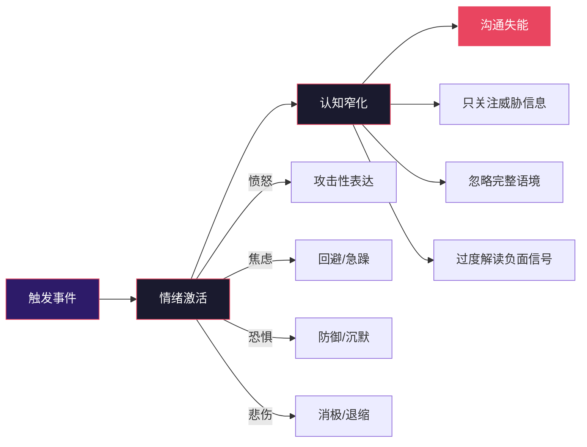
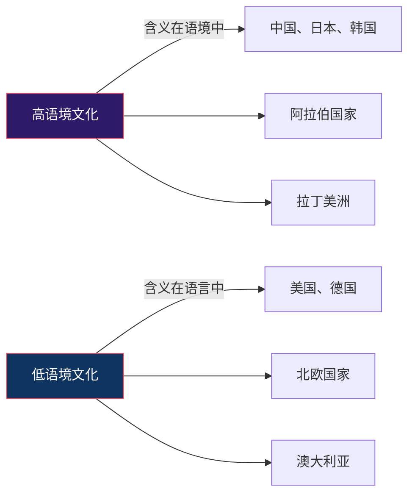
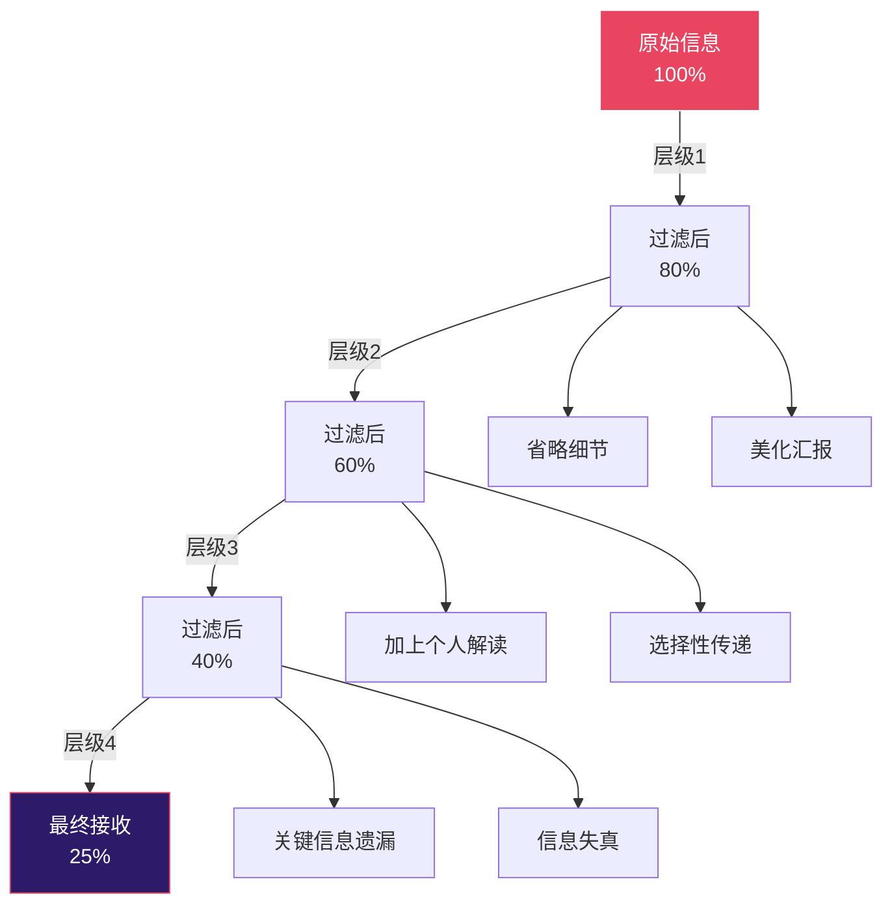
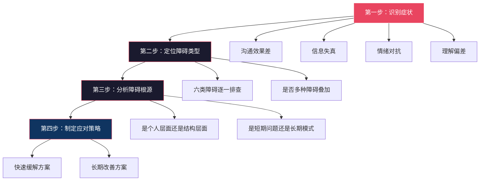

## 五、沟通障碍分析

沟通的本质是信息从发送者到接收者的传递与理解过程。然而，现实中这条信息通路远非畅通无阻——噪声、偏见、文化差异、组织结构、物理环境、认知偏差等障碍如同道路上的路障，时刻威胁着沟通的有效性。Shannon-Weaver 模型（1949）最早将"噪声"（noise）引入通信理论，指出信号在传输过程中必然受到干扰；沟通学者 Wilbur Schramm 进一步提出，沟通失败的根源往往不在"说了什么"，而在"对方理解了什么"。

系统性地识别、分析并克服沟通障碍，是提升沟通能力的底层功夫。本节将沟通障碍划分为六大类，逐一深入剖析其产生机制、典型表现、识别信号和应对策略。

```mermaid
graph TD
    A[沟通障碍] --> B[语言障碍]
    A --> C[心理障碍]
    A --> D[文化障碍]
    A --> E[组织障碍]
    A --> F[物理障碍]
    A --> G[认知障碍]

    B --> B1[术语壁垒]
    B --> B2[表达歧义]
    B --> B3[语速与口音]

    C --> C1[偏见与刻板印象]
    C --> C2[情绪干扰]
    C --> C3[防御心理]
    C --> C4[选择性倾听]

    D --> D1[高语境vs低语境]
    D --> D2[时间观念差异]
    D --> D3[价值观冲突]

    E --> E1[信息过滤]
    E --> E2[部门壁垒]
    E --> E3[层级压制]

    F --> F1[噪音干扰]
    F --> F2[距离与技术]
    F --> F3[环境不适]

    G --> G1[知识差距]
    G --> G2[信息过载]
    G --> G3[记忆偏差]

    style A fill:#1a1a2e,stroke:#e94560,color:#fff
    style B fill:#16213e,stroke:#0f3460,color:#fff
    style C fill:#16213e,stroke:#0f3460,color:#fff
    style D fill:#16213e,stroke:#0f3460,color:#fff
    style E fill:#16213e,stroke:#0f3460,color:#fff
    style F fill:#16213e,stroke:#0f3460,color:#fff
    style G fill:#16213e,stroke:#0f3460,color:#fff
```

### 5.1 语言障碍

语言是沟通最基本的载体，但也是最容易出问题的环节。语言障碍的本质是**编码与解码的不匹配**——发送者用自己的语言习惯编码信息，接收者用自己的语言习惯解码信息，两者之间的差异越大，误解的概率就越高。

#### 5.1.1 专业术语壁垒

每个行业、每个领域都有自己的"行话"（jargon）。在同行之间，行话是高效沟通的压缩工具——一个术语可以替代一大段解释。但在跨领域沟通中，行话反而成了理解的壁垒。

**典型场景：**

| 场景 | 发送者说的 | 接收者理解的 | 实际含义 |
|------|-----------|-------------|---------|
| 程序员对产品经理 | "这个接口需要做幂等处理" | 完全不懂，猜测是某种技术优化 | 同一请求重复发送不会产生重复结果 |
| 医生对患者 | "你有高血压，需要长期服用ACEI类药物" | 记住了"高血压"，其他信息丢失 | 需要长期服用血管紧张素转换酶抑制剂 |
| 律师对客户 | "本案适用无过错责任原则" | 以为是自己做错了什么 | 即使没有过错也需要承担法律责任 |
| 金融分析师对散户 | "这只股票的PE偏高，建议逢高减仓" | 听到"建议"就行动，不理解PE和减仓的具体含义 | 市盈率偏高，建议在价格上涨时逐步卖出 |

**为什么专业术语会成为障碍？**

从认知心理学的角度看，专业术语的障碍机制有三层：

1. **词汇层面**：接收者不认识这个词，信息直接中断
2. **概念层面**：接收者认识词汇但不理解背后的完整概念框架
3. **语境层面**：同一个术语在不同领域的含义不同（如"bug"在程序员和昆虫学家眼中的含义截然不同）

**应对策略：**

- **术语翻译法**：在使用专业术语后，立刻用通俗语言补充解释。例如："这个接口需要做幂等处理——简单说就是，用户不小心点了两次提交按钮，系统也只会处理一次。"
- **分层表达法**：先用通俗语言说结论，再用专业术语补充精确性。例如："这种药是帮助降低血压的，医学上叫血管紧张素转换酶抑制剂，简称ACEI。"
- **类比桥接法**：用对方熟悉领域的概念来类比。例如向非技术人员解释API："你可以把API想象成餐厅的服务员——你告诉服务员你要什么菜（发出请求），服务员去厨房传达（处理），然后把菜端给你（返回结果）。"
- **确认理解法**：在关键信息点主动询问"我这样表达清楚吗"或"你能用自己的话复述一下吗"。

#### 5.1.2 表达歧义

语言天然具有歧义性。语义学家 Geoffrey Leech 将语言意义分为七种类型，其中很多都容易产生歧义。日常沟通中最常见的歧义类型包括：

**语法歧义**：句子结构导致的多重解读
- "咬死了猎人的狗"——是狗咬死了猎人，还是猎人的狗被咬死了？
- "两个学校的老师"——两位老师来自同一所学校，还是两位老师分别来自两所学校？

**语义歧义**：词汇本身有多重含义
- "他在银行工作"——金融机构还是河岸？
- "这个方案需要再打磨一下"——是需要细化完善，还是需要简化？

**语用歧义**：脱离语境时无法确定说话者的真实意图
- "你真行啊"——是真诚的赞美还是讽刺？
- "随便"——是真正的无所谓，还是在表达不满？

**应对策略：**

- **补充具体信息**：用数字、日期、名称等明确信息替代模糊表述。"尽快完成"→"周三下午5点前完成"。
- **确认语境**：在关键信息点进行确认，"你说的打磨是指需要增加更多细节，还是需要精简内容？"
- **书面确认**：重要信息口头讨论后，用文字形式确认双方理解一致。
- **结构化表达**：使用"第一、第二、第三"或"首先、然后、最后"等结构词，减少理解上的混乱。

#### 5.1.3 语速与口音

语速过快会让接收者来不及处理信息——人类的语速处理能力有限，正常语速约为每分钟120-150个词（中文约200-250个字），超过这个范围，理解率就会显著下降。语速过慢则容易让接收者注意力分散，在信息片段之间"走神"。

口音和发音问题在跨地域、跨语言环境中尤为突出。普通话不标准、方言口音重、英语发音不清晰等，都可能导致关键信息被误听。

**应对策略：**

- **重要信息放慢、重复**：涉及数字、日期、人名等关键信息时，刻意放慢语速，并重复一次。
- **善用书面辅助**：涉及复杂信息时，同步提供文字版本（邮件、消息、文档）。
- **主动确认**：不确定对方是否听清时，主动询问"我刚才说的时间地点你记下了吗？"
- **录音回听**：对自己的语速和发音有疑虑时，可以录音回听，自我评估。

---

### 5.2 心理障碍

心理障碍是所有沟通障碍中最隐蔽、最难克服的一类。语言障碍可以靠学习弥补，物理障碍可以靠技术消除，但心理障碍根植于人的认知结构和情感状态，往往连当事人自己都没有意识到。

#### 5.2.1 偏见与刻板印象

心理学家 Daniel Kahneman 在《思考，快与慢》中指出，人类大脑有两套思维系统：系统1（快速、自动、直觉）和系统2（缓慢、努力、理性）。偏见和刻板印象就是系统1的产物——大脑为了节省认知资源，自动将人和事物归类，然后用"类别特征"代替"个体特征"。

**偏见在沟通中的具体表现：**

- **光环效应（Halo Effect）**：因为对方的某个特征（外貌、学历、职位），就对其沟通内容做出整体性判断。"他是名校毕业的，说的肯定有道理"或者"他才工作两年，能有什么高见"。
- **证实偏差（Confirmation Bias）**：只关注支持自己已有观点的信息，忽略或曲解相反的证据。在讨论中表现为"选择性倾听"——只听自己想听的。
- **群体偏见（In-group Bias）**：对属于自己群体（部门、学校、地域）的人天然更信任，对"外人"天然更怀疑。
- **近因效应（Recency Effect）**：被最近一次的沟通印象主导，忽略长期的整体表现。某人上次提了个糟糕的建议，这次他的好建议也被打折扣。

**识别信号：**
- 你在对方开口之前就已经"知道"他要说什么
- 你对某类人（如90后、文科生、某地人）有预设的沟通期望
- 你在听对方说话时，脑子里已经在准备反驳
- 你觉得"跟他解释也没用"

**应对策略：**

- **觉察先于改变**：第一步是意识到自己的偏见。每次发现自己在做"预判"时，暂停一下，问自己："如果换一个人说同样的话，我会怎么反应？"
- **就事论事原则**：强制自己将"人"和"观点"分开。评价一个观点时，不考虑是谁提出的，只看论据和逻辑。
- **主动寻求反面证据**：当你发现自己只听到支持自己的信息时，刻意去寻找反对意见。
- **延迟判断**：在听完对方的完整论述之前，不做评价。给自己设定一个规则："至少听完对方三个论点再回应。"

#### 5.2.2 情绪干扰

情绪对沟通的影响是全方位的。神经科学研究表明，当杏仁核（大脑的"情绪警报器"）被激活时，前额叶皮层（负责理性思考的区域）的活动会受到抑制——这就是为什么人在愤怒、恐惧或极度焦虑时，很难进行理性沟通。

**情绪干扰的四个阶段：**

**具体表现：**

- **愤怒状态**：提高音量，使用绝对化语言（"你总是""你从来"），人身攻击代替就事论事，急于做出冲动决定
- **焦虑状态**：语速加快，频繁打断对方，无法集中注意力，过度解释或反复强调
- **恐惧状态**：回避关键话题，使用模糊语言，过度顺从，不敢表达真实想法
- **悲伤/沮丧状态**：消极回应，对建议持否定态度（"说了也没用"），沟通意愿下降

**经典案例：**

一家互联网公司的产品评审会上，产品经理小李精心准备了一个月的方案被技术总监当场否决："这个方案技术上根本不可行，你连基本的技术约束都不了解。"小李感到愤怒和羞辱（情绪激活），立刻反击："你每次都这样，不看业务价值只看技术难度"（认知窄化，使用绝对化语言）。会议随后演变成两人之间的争吵，其他参会者被迫选边站，评审会完全偏离主题（沟通失能）。实际上，技术总监的本意是"方案需要调整技术实现路径"，但表达方式触发了小李的情绪防御，导致信息传递彻底失败。

**应对策略：**

- **6秒暂停法则**：情绪激动时，给自己6秒钟的暂停时间。神经科学研究表明，情绪的化学物质在体内持续约6秒，6秒后理性大脑可以重新接管。具体做法：深呼吸一次，在心里默数6个数。
- **"我"陈述法**：将"你总是打断我"改为"我感到没有被充分倾听，这让我不太舒服"。"我"陈述表达的是自己的感受，而非对对方的指责。
- **情绪标注**：心理学研究表明，给情绪"命名"可以降低其强度（affect labeling）。"我现在感到很沮丧"比任由沮丧情绪蔓延更有利于恢复理性。
- **物理暂停**：如果情绪实在无法控制，主动申请暂停。"这个话题对我很重要，我需要5分钟整理一下思路，我们稍后继续。"
- **事后复盘**：情绪平复后，回顾沟通中的情绪触发点，识别自己的"情绪按钮"——什么样的表达方式、什么样的场景容易触发你的情绪反应。

#### 5.2.3 防御心理

防御心理是一种自我保护机制——当人感到被批评、被否定或被威胁时，会本能地进入"战斗或逃跑"（fight-or-flight）模式。在沟通中，防御心理会导致：

- **否认**："这跟我没关系""不是我的问题"
- **合理化**："当时情况特殊""换谁都会这样做"
- **反击**："你自己不也一样吗""你有什么资格说我"
- **沉默退缩**：不再回应，关闭沟通通道

**防御心理的根源：**

防御心理的核心驱动力是**自我价值感的威胁**。当一个人的自我认同（"我是一个有能力的人""我是一个负责任的人"）受到挑战时，防御机制会自动启动。这解释了为什么同样的批评，对自信的人可能只是"一个建议"，对自我认同脆弱的人却可能是"毁灭性的打击"。

**应对策略：**

- **对事不对人**：批评行为而非人格。"这份报告的数据有几处错误"（指出具体行为）vs "你怎么这么粗心"（否定人格）。
- **先肯定再建议**：三明治反馈法——先说做得好的地方，再说需要改进的，最后再给予鼓励。注意：三明治法不能滥用，否则"好话"会变成"坏话的预警信号"。
- **邀请参与**：将批评转化为共同解决问题。"这份报告的数据有问题，我们一起看看怎么修正"比"你的报告有错误"更不容易触发防御。
- **创造安全感**：在反馈之前先说明意图。"我有一些想法想和你分享，目的是帮助方案更完善，不是要批评你。"

#### 5.2.4 选择性倾听

选择性倾听是大脑的一种信息过滤机制——在信息过载的环境中，大脑会自动筛选它认为"重要"或"相关"的信息，忽略其余部分。这种机制在日常生活中有保护作用（在嘈杂的餐厅中能听到有人叫你的名字），但在沟通中则可能导致严重的信息丢失。

**选择性倾听的三种模式：**

| 模式 | 表现 | 后果 |
|------|------|------|
| 兴趣过滤 | 只听自己感兴趣的部分 | 错过关键但"无聊"的细节 |
| 立场过滤 | 只听支持自己观点的部分 | 加剧确认偏差 |
| 情感过滤 | 只听语气和态度，忽略内容 | 将信息争论变成情绪对抗 |

**应对策略：**

- **主动倾听训练**：在对方说话时，刻意在心里复述对方的核心观点，强迫大脑处理完整信息。
- **笔记辅助**：在重要沟通中做笔记，不仅帮助记忆，还能强制自己保持注意力。
- **反馈确认**：在对方说完后，用自己的话复述一遍。"你的意思是……对吗？"这个动作既确认了理解，也暴露了选择性倾听导致的遗漏。
- **延迟回应**：在对方说完后，给自己3-5秒的处理时间再回应。这短暂的停顿可以让你从"准备反驳"模式切换到"理解吸收"模式。

---

### 5.3 文化障碍

在全球化和多元化的时代，文化障碍已经成为沟通中不可忽视的因素。文化不仅影响语言的使用方式，更深刻地塑造了人们对沟通本身的理解——什么该说、什么不该说、怎么说、什么时候说，这些"沟通的元规则"在不同文化中可能截然不同。

#### 5.3.1 高语境与低语境文化

人类学家 Edward T. Hall 提出的"高语境-低语境"理论，是理解文化沟通差异最经典的框架之一。

| 维度 | 高语境文化 | 低语境文化 |
|------|-----------|-----------|
| 信息传递 | 大量信息存在于物理环境或个人关系中，只有少量信息在编码清晰的语言中 | 大部分信息在明确的语言编码中 |
| 沟通风格 | 含蓄、委婉、暗示 | 直接、明确、具体 |
| "不"的表达 | "这个方案很有创意，我们再研究研究" = 不同意 | "I don't agree with this proposal" = 不同意 |
| 关系 vs 任务 | 先建立关系再谈事 | 先谈事，关系可以慢慢建立 |
| 非语言信号 | 极其重要，可能比语言本身更重要 | 辅助作用，不如语言精确 |
| 冲突处理 | 回避直接冲突，保全对方面子 | 直面冲突，认为坦诚是尊重 |

**典型冲突场景：**

一位美国经理和中国下属开会讨论项目延期问题。美国经理直接说："This project is behind schedule. I need to know why and what you're going to do about it."（这个项目延期了，我需要知道原因和你的解决方案。）中国下属听到的是"当众被质问"，感到丢面子，于是含蓄地回应："最近确实遇到一些困难，团队都在努力，相信很快能赶上进度。"美国经理将这个回答理解为"没有具体计划"，更加不满；中国下属则认为经理"不通人情"、"不会给面子"。双方都没有恶意，但高语境与低语境的碰撞导致了沟通失败。

**应对策略：**

- **了解对方的文化背景**：在跨文化沟通前，花时间了解对方的沟通偏好。
- **调整自己的表达方式**：与高语境文化的人沟通时，注意非语言信号和言外之意；与低语境文化的人沟通时，尽量明确直接。
- **确认理解**：跨文化沟通中，理解确认尤为重要。不要假设对方理解了你的意思。
- **尊重差异而非评判差异**：高语境不是"拐弯抹角"，低语境不是"不会做人"——它们是不同的沟通系统，各有优劣。

#### 5.3.2 时间观念差异

不同文化对时间的理解和使用方式差异巨大。人类学家将时间观念分为两类：

- **单线性时间观（Monochronic）**：时间是线性的、可分割的资源。一次做一件事，遵守时间表，准时是美德。代表文化：美国、德国、日本。
- **多线性时间观（Polychronic）**：时间是流动的、灵活的。可以同时处理多件事，关系比时间表更重要。代表文化：拉丁美洲、中东、南亚。

这些差异在实际沟通中的影响：德国人开会准时开始、准时结束，认为迟到是不尊重；巴西人对时间更灵活，迟到15分钟不算失礼，认为德国人"太死板"。两种观点都有其文化合理性，但如果不理解对方的时间观念，就会产生误解和冲突。

#### 5.3.3 价值观差异

更深层的文化障碍来自于价值观的差异。Geert Hofstede 的文化维度理论揭示了六个关键维度，每个维度都会影响沟通方式：

- **权力距离**：对权力不平等的接受程度。高权力距离文化（如中国、印度）中，下级不太可能公开反驳上级；低权力距离文化（如丹麦、以色列）中，扁平化沟通更常见。
- **个人主义 vs 集体主义**：个人主义文化强调个人观点和自我表达；集体主义文化强调群体和谐和共识。
- **不确定性规避**：对模糊和不确定的容忍程度。高规避文化（如日本）需要详细的计划和明确的规则；低规避文化（如美国）更能接受"先做再说"。
- **长期导向 vs 短期导向**：影响对承诺、关系投资和沟通耐心的态度。

**应对策略：**

- **文化智商（CQ）培养**：系统学习不同文化的价值观和沟通规范，而非仅凭直觉判断。
- **元沟通**：在跨文化合作初期，直接讨论"我们如何沟通"——约定沟通方式、决策方式、冲突解决方式。
- **文化中介者**：在重要的跨文化沟通中，引入熟悉双方文化的人作为桥梁。

---

### 5.4 组织障碍

组织障碍是沟通障碍中最具有结构性的一种——它不是某个人的问题，而是组织设计和制度安排本身造成的沟通困难。组织沟通学者 Karl Weick 指出，组织本身就是一个"信息处理系统"，组织结构决定了信息如何流动、谁有权获取信息、信息在传递中如何被过滤和变形。

#### 5.4.1 信息过滤与衰减

信息在组织的层级结构中逐层传递时，会发生系统性的过滤和变形。每一层的传递者都可能基于自己的理解、利益和判断，对信息进行"加工"——保留对自己有利的，淡化对自己不利的，省略自己认为不重要的。

**信息过滤的经典模型：**

**信息过滤的四种类型：**

| 过滤类型 | 表现 | 案例 |
|---------|------|------|
| 向上过滤 | 下属向上汇报时淡化问题 | "基本顺利"代替"有三个严重bug还没修" |
| 向下过滤 | 上级传达决策时省略背景 | "公司决定裁员"代替"因为市场萎缩，公司不得不调整战略" |
| 水平过滤 | 跨部门传递时增加个人立场 | "技术部说做不了"代替"技术部说需要额外两周排期" |
| 自我过滤 | 基于个人判断决定什么重要 | "这个细节领导不会关心"→省略了领导实际上很关心的细节 |

**应对策略：**

- **扁平化沟通渠道**：建立越级沟通机制（如CEO信箱、全员会议），减少信息传递层级。
- **多渠道验证**：重要信息不依赖单一渠道传递，通过邮件、会议、即时消息等多种方式确认。
- **直接沟通文化**：鼓励"直接找当事人谈"而非"通过中间人传话"。
- **信息透明化**：将关键信息放在共享平台上，让所有相关人员可以直接获取，减少中间环节。

#### 5.4.2 部门壁垒（谷仓效应）

组织中的部门壁垒（Silo Effect）是信息流动的最大结构性障碍之一。每个部门有自己的专业语言、工作节奏、绩效指标和利益诉求，这些差异使得跨部门沟通天然存在摩擦。

**部门壁垒的典型表现：**

- **目标冲突**：销售部门追求短期业绩（"客户要求下周上线"），研发部门追求技术质量（"这个时间点上线风险太大"），双方各有道理，但缺乏共同的决策框架。
- **信息不对称**：市场部掌握了大量客户需求信息，但没有机制传递给产品部；产品部制定了详细的技术规划，但没有机制同步给市场部。
- **语言不通**：技术部门用"接口""并发""QPS"沟通，市场部门用"转化率""ROI""用户画像"沟通，双方在讨论同一个项目时，说的像是两种语言。
- **优先级争夺**：每个部门都认为自己的需求最重要，缺乏全局视角的优先级排序机制。

**应对策略：**

- **跨部门项目组**：为重要项目组建跨部门团队，让不同部门的人在同一个信息场中工作。
- **共享目标体系**：建立跨部门的共享KPI，让各部门的利益产生交集。
- **轮岗制度**：让员工在不同部门轮岗，建立对其他部门工作的理解和同理心。
- **跨部门沟通会议**：定期举行跨部门信息同步会，打破信息壁垒。
- **统一信息平台**：使用共享的项目管理工具（如Jira、飞书、钉钉），让项目信息对所有相关方透明可见。

#### 5.4.3 层级压制

层级结构不仅影响信息的流动，还影响沟通的质量——下级在上级面前天然处于弱势地位，这会导致：

- **不敢说真话**：特别是在上级情绪不好或组织文化高压的环境中，下级倾向于报喜不报忧。
- **揣摩上意**：下级花大量精力猜测上级想要什么答案，而非提供真实信息。
- **附和效应**：在会议上，一旦领导表达了倾向，其他人立刻附和，即使心里有不同意见。
- **沉默的大多数**：真正有价值的信息往往来自一线员工，但他们最缺乏发声的渠道和动力。

**应对策略：**

- **匿名反馈机制**：建立匿名的建议和反馈渠道，降低表达风险。
- **上级主动邀请批评**：管理者在会议中主动询问"有什么我没想到的风险？""有没有人持不同意见？"
- **决策前的"红队测试"**：在重大决策前，专门组建一个小组来挑战和质疑方案，制度化地鼓励反对意见。
- **心理安全感建设**：Google 的"亚里士多德项目"研究发现，高效团队的首要特征是心理安全感——成员敢于承担风险、提出问题和犯错，而不会感到不安全。

---

### 5.5 物理障碍

物理障碍是最"直观"的一类沟通障碍——它们存在于物理环境中，相对容易识别和解决。但在远程办公和混合办公日益普及的今天，物理障碍的形式和影响也在发生变化。

#### 5.5.1 噪音干扰

噪音不仅指环境中的物理噪音（如施工声、交通噪音、开放办公室的交谈声），还包括信息噪音——同时接收过多信息源时产生的干扰。

**噪音对沟通的影响：**

- **理解准确率下降**：研究表明，在60分贝以上的噪音环境中（相当于正常交谈的音量），信息理解准确率下降约30%。
- **注意力分散**：噪音导致大脑需要额外的认知资源来过滤干扰，留给处理信息的资源减少。
- **重复和确认成本增加**：因为听不清或理解不准确，需要反复确认，浪费时间和精力。

**物理噪音的应对：**

- **环境选择**：重要沟通选择安静的封闭空间，而非嘈杂的开放区域。
- **降噪工具**：远程会议使用降噪耳机，选择有降噪功能的通讯软件。
- **备选方案**：噪音无法消除时，切换沟通方式——从语音改为文字，从视频改为文档。

**信息噪音的应对：**

- **减少同时进行的沟通渠道**：在进行重要沟通时，关闭无关的通知和消息渠道。
- **时间分块**：将沟通集中在特定时间段，避免全天候被打断。
- **沟通优先级管理**：并非所有沟通都同等紧急，建立沟通的优先级体系。

#### 5.5.2 距离与技术障碍

远程办公的普及使得物理距离不再是沟通的主要障碍，但技术障碍成为了新的挑战。

**常见的技术障碍：**

- **网络不稳定**：视频卡顿、声音断续，导致沟通信息碎片化。
- **平台差异**：不同团队使用不同的沟通工具（微信、飞书、Slack、Teams），信息分散在多个平台上。
- **设备问题**：麦克风不工作、摄像头画质差、屏幕共享不清晰。
- **时区差异**：跨时区团队的同步沟通窗口有限。

**应对策略：**

- **技术检查清单**：重要远程会议前，提前10分钟测试设备、网络和软件。
- **备用方案**：始终准备一个备用沟通方案（如主用视频会议，备用电话会议）。
- **异步沟通能力**：学会用文档、录制视频、留言等方式进行异步沟通，减少对实时同步的依赖。
- **统一沟通平台**：团队层面统一使用一套核心沟通工具，减少信息碎片化。

#### 5.5.3 环境不适

沟通环境的舒适度直接影响沟通者的心理状态和注意力。过冷或过热的房间、不舒适的座椅、过亮或过暗的灯光，都会让人无法专注于沟通本身。

**环境因素对沟通的影响：**

| 环境因素 | 影响 | 解决方案 |
|---------|------|---------|
| 温度过高（>28°C） | 烦躁、注意力下降、沟通耐心降低 | 开空调或通风 |
| 温度过低（<18°C） | 身体不适、注意力转移到寒冷上 | 提供暖风或热饮 |
| 座椅不舒适 | 坐立不安、急于结束沟通 | 选择舒适的会面地点 |
| 灯光过强 | 眼部疲劳、回避对视 | 调整灯光或更换位置 |
| 灯光过暗 | 困倦、注意力下降 | 增加照明 |
| 座位安排不当 | 面对面坐容易产生对抗感 | 重要对话采用L型或并排坐 |

---

### 5.6 认知障碍

认知障碍源于沟通双方在知识结构、信息处理能力和注意力资源上的差异。这类障碍的隐蔽性在于——沟通双方往往都没有意识到问题的存在，发送者以为自己说清楚了，接收者以为自己听明白了，但实际上双方对同一信息的理解可能完全不同。

#### 5.6.1 知识的诅咒（Curse of Knowledge）

认知心理学中最著名的概念之一。当一个人对某个主题非常熟悉时，他很难想象不知道这些知识是什么感觉。这导致专家在向新手解释时，不自觉地跳过"太显然"的步骤，使用"太基础"以至于不需解释的术语。

**典型场景：**

- 资深程序员向新人讲解系统架构，用了大量"显然""众所周知""基本就是"，新人全程懵。
- 医生向患者解释病情，直接进入病理机制的讨论，而患者连"良性"和"恶性"的区别都不太确定。
- 老板向团队描述战略愿景，用了很多抽象概念（"赋能""闭环""抓手"），每个词都认识，合在一起不知道在说什么。

**应对策略：**

- **假设对方不知道**：在解释复杂概念时，假设对方是完全的新手。宁可多说一些基础内容，也不要假设对方"应该知道"。
- **使用具体例子**：抽象概念配合具体例子说明。不只说"我们需要优化用户转化率"，而是说"比如现在100个访问网站的人只有3个下单，我们希望把它提高到5个"。
- **逐步构建**：像搭积木一样，从基础概念开始，一层一层往上搭建。
- **找一个"小白测试员"**：在重要沟通前，找一个不了解这个话题的人先试讲一遍，看对方能否跟上。

#### 5.6.2 信息过载

现代人每天接收的信息量远超大脑的处理能力。研究表明，人类大脑每秒能处理的信息约为110比特（bits），但每天通过各种渠道接收的信息量可达数GB。当信息量超过处理能力时，大脑会启动"信息筛选"模式——粗略浏览而非深入理解，这直接导致重要信息被淹没在信息洪流中。

**信息过载在沟通中的表现：**

- **会议效率低下**：一个会议中塞了太多议题，每个议题都浅尝辄止。
- **邮件/消息疲劳**：每天数百条消息，真正阅读的不到20%，重要信息容易遗漏。
- **报告冗长**：30页的报告中，关键数据可能只占3页，但读者可能在第5页就放弃了。
- **决策瘫痪**：信息过多反而无法做出决策，陷入"还需要再看看"的循环。

**应对策略：**

- **信息分级**：将信息分为"必须知道""应该知道""可以知道"三级，优先传递"必须知道"的内容。
- **摘要先行**：长文档或长邮件先给出摘要和结论，细节放在后面供需要时查阅。金字塔原则（Barbara Minto）的核心就是"结论先行"。
- **一页纸规则**：强制自己将核心信息浓缩到一页纸以内。如果一页纸写不下，说明你还没有想清楚。
- **分批传递**：复杂信息分多次传递，每次聚焦一个核心主题。
- **减少干扰源**：在接收重要信息时，关闭无关的通知和消息渠道。

#### 5.6.3 记忆偏差

人类的记忆不是录像机，不能精确回放过去发生的事情。记忆是一个**重构**（reconstructive）的过程——每次回忆时，大脑都会基于当前的知识、情感和语境重新"组装"信息。这意味着：

- **记忆会被时间扭曲**：事件发生后一周回忆和一个月后回忆，细节可能不同。
- **记忆会被后续信息修正**：如果事后获得了新的信息，可能会"无意识地"将新信息"植入"原始记忆中。
- **记忆会被情感着色**：情绪激动时的回忆往往比实际更极端——好的更好，坏的更坏。
- **记忆会选择性保留**：人们倾向于记住与自己信念一致的信息，遗忘不一致的。

**应对策略：**

- **及时记录**：重要沟通后立刻做笔记，不要依赖记忆。24小时后，人类平均会遗忘约70%的新信息（艾宾浩斯遗忘曲线）。
- **书面确认**：重要决定、承诺和行动项，用书面形式确认。"会后我会把今天的决定发一封邮件确认，请大家核实。"
- **多角度回忆**：当对某个事件的记忆有分歧时，不要争论"谁记错了"，而是通过查看会议记录、邮件、消息记录等客观证据来还原事实。
- **建立信息存档习惯**：使用笔记工具、项目管理工具记录关键信息和决策，减少对个人记忆的依赖。

---

### 5.7 沟通障碍的综合诊断框架

在实际沟通中，多种障碍往往同时出现、相互交织。一个低效的跨部门会议可能同时涉及语言障碍（术语不同）、心理障碍（部门间存在偏见）、组织障碍（层级压制导致不敢说真话）和认知障碍（信息过载）。因此，需要一个系统性的诊断框架来识别和应对。

**沟通障碍诊断四步法：**

**诊断检查清单：**

| 检查维度 | 自问问题 | 对应障碍类型 |
|---------|---------|-------------|
| 语言层面 | 双方是否使用相同的语言体系？是否存在术语壁垒或歧义？ | 语言障碍 |
| 心理层面 | 双方是否有预设立场？是否处于情绪激动状态？是否存在防御心理？ | 心理障碍 |
| 文化层面 | 双方的文化背景是否不同？是否存在沟通风格差异？ | 文化障碍 |
| 组织层面 | 信息是否经过了中间层级的过滤？部门之间是否存在壁垒？ | 组织障碍 |
| 物理层面 | 环境是否安静？技术设备是否正常？距离是否影响了沟通质量？ | 物理障碍 |
| 认知层面 | 双方的知识水平差异有多大？信息量是否超出了处理能力？ | 认知障碍 |

---

### 5.8 常见误区与纠正

**误区一：沟通障碍只是"表达不好"的问题**
很多人认为沟通障碍主要是因为"嘴笨"或"表达能力差"，但实际上，语言障碍只是六类障碍中的一类。大量沟通失败发生在"听"的环节（心理障碍、认知障碍），而非"说"的环节。

**误区二：只要足够理性就能克服心理障碍**
情绪和偏见是人类大脑的固有功能，不是靠"理性"就能完全压制的。正确的做法是建立机制和习惯来管理它们，而非试图消灭它们。

**误区三：文化障碍只存在于跨国沟通中**
同一国家内部，不同地域、不同行业、不同代际之间也存在文化差异。互联网行业的沟通风格和传统制造业的沟通风格可能差异巨大。

**误区四：物理障碍最容易解决，不值得重视**
虽然物理障碍"看起来"最容易解决，但它往往是最容易被忽视的。一个嘈杂的会议室、一个不稳定的网络连接，可能让一个精心准备的沟通彻底失败。

**误区五：只要信息量足够大，接收者就能理解**
信息过载恰恰是认知障碍的核心问题。真正的有效沟通不是"说得越多越好"，而是"让关键信息被理解和记住"。

---

### 5.9 从障碍到机会：进阶视角

沟通障碍不仅是需要克服的"问题"，也是理解沟通本质的"窗口"。每一次沟通障碍的出现，都暴露了沟通过程中的一个薄弱环节——它告诉你，信息在这里丢失了、变形了或被误解了。从这个角度看：

- **语言障碍**提示你需要关注"编码质量"——你说的和对方理解的是否一致？
- **心理障碍**提示你需要关注"接收状态"——对方是否有能力和意愿接收你的信息？
- **文化障碍**提示你需要关注"共享框架"——双方是否在同一个理解框架中沟通？
- **组织障碍**提示你需要关注"信息通道"——信息从A到B经过了哪些环节，每个环节如何变形？
- **物理障碍**提示你需要关注"传输介质"——承载信息的通道是否可靠？
- **认知障碍**提示你需要关注"处理能力"——对方能同时处理多少信息，能记住多少？

掌握这种"障碍诊断"的能力，你就能从被动的"沟通受害者"转变为主动的"沟通设计者"——不是等待沟通失败后再去弥补，而是在沟通发生之前就预见障碍、设计方案、优化通路。这才是沟通能力的高阶水平。
