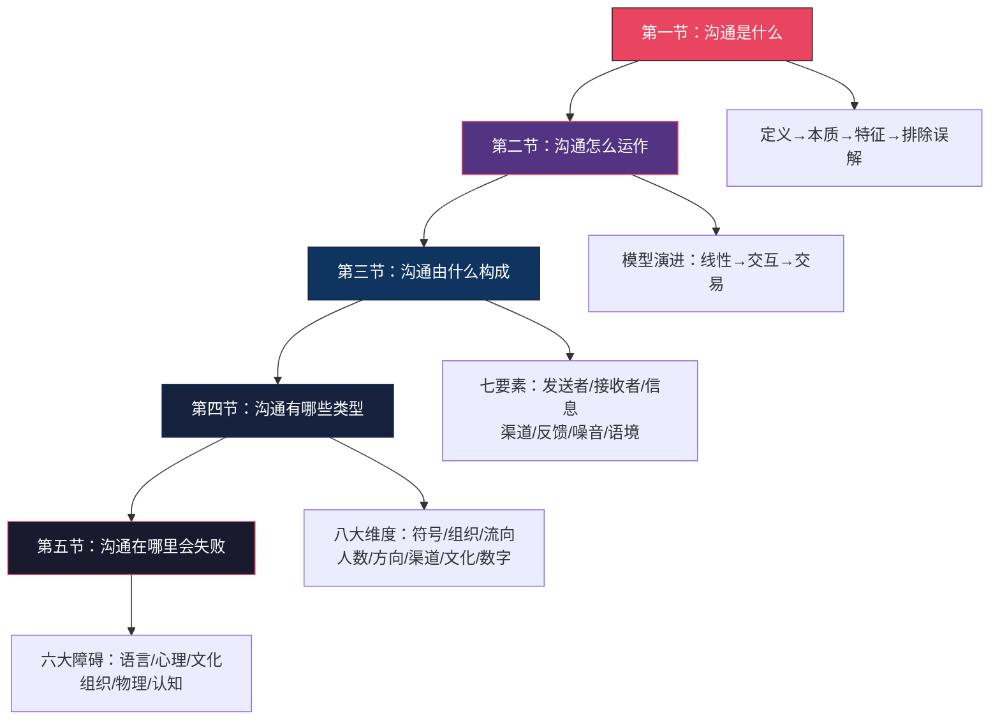
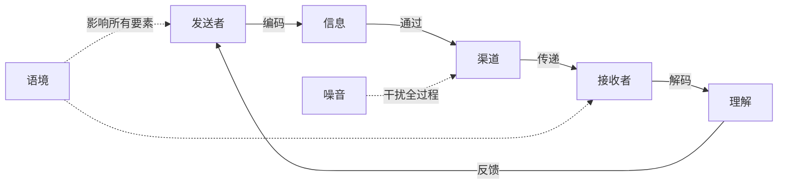

## 本节小结：理论基础全景回顾

恭喜你完成了"沟通的理论基础"全部内容的学习。在进入核心技巧和实战案例之前，本节将帮你完成三件事：**系统回顾**已学的理论框架，**查漏补缺**确认你没有遗漏关键知识点，**建立连接**将零散的概念串联成一张完整的认知地图。

理论不是用来"记住"的，而是用来"看穿"的——当你能用理论框架透视每一次沟通的底层结构时，你才真正拥有了沟通能力的地基。

---

### 一、五节内容的核心脉络

整个"理论基础"部分的逻辑链条如下：

这五节构成了一个完整的认知链条：**先知道它是什么（定义），再理解它如何运转（模型），然后拆解它的组成部分（要素），接着区分它的不同形态（类型），最后识别它在哪里会出问题（障碍）**。这个从"是什么"到"为什么失败"的递进，就是沟通理论的完整骨架。

---

### 二、十大核心要点提炼

以下十个要点是整个理论基础部分的核心精华。每个要点都附带"一句话记住它"和"为什么它重要"，帮助你在后续学习和实践中随时调用。

#### 要点一：沟通的本质是"共同理解"，不是"单向表达"

**一句话记住**：说了不等于沟通了，理解了才算。

**为什么重要**：这是所有沟通能力的起点。词源学告诉我们——西方的"communicare"意为"共享"，中国的"沟通"意为"沟而通之"。两个词源指向同一个核心：沟通是双向的联通，不是单向的发射。如果你把沟通等同于说话，你会把所有精力放在"怎么说"上，而忽略了"对方理解了什么"——后者才是沟通效果的真正决定因素。

#### 要点二：交易模型最准确地描述了现实中的沟通

**一句话记住**：沟通不是"我说→你听"，而是"我们在同一时刻同时发送和接收"。

**为什么重要**：从香农-韦弗的线性模型到施拉姆的交互模型，再到巴恩伦德的交易模型，沟通理论的演进方向是从"单向传输"走向"共同建构"。交易模型的核心洞察是：你在说话的同时也在接收对方的非言语信号，对方在听的同时也在用自己的方式解读——沟通是一个**同步、双向、受语境深度影响**的动态过程。

#### 要点三：沟通的四大本质特征不可忽视

**一句话记住**：不可逆、连续、不可重复、同时传递内容和关系。

**为什么重要**：

| 特征 | 实践含义 |
|------|----------|
| **不可逆** | 说出去的话无法真正收回，负面印象需要5次以上正面互动才能抵消 |
| **连续** | 沉默、走神、不回复都是沟通，每一次互动都在为下一次"定调" |
| **不可重复** | 不能依赖模板话术，同一句话在不同情境下效果完全不同 |
| **内容+关系** | 每条信息都有两层——字面意思和关系信号，后者往往更关键 |

这四个特征意味着：沟通不能像复制粘贴一样批量处理，每一次都需要根据当下情境做调整。

#### 要点四：沟通七要素构成一个动态系统

**一句话记住**：发送者、接收者、信息、渠道、反馈、噪音、语境——缺一不可。

**为什么重要**：七要素框架是分析和优化任何沟通场景的万能工具。当一次沟通失败时，不要笼统地归因为"沟通不好"，而是逐一排查：是编码问题（我说的方式不对）？是渠道问题（不该用微信讨论这事）？是解码问题（对方理解偏差）？是噪音干扰（环境太吵/情绪太激动）？还是反馈缺失（我根本没确认对方是否理解了）？能精准定位问题环节，才能精准解决问题。

**七要素协同工作原理**：

#### 要点五：编码能力是发送者的核心竞争力

**一句话记住**：不是"我知道什么"，而是"对方能听懂什么"。

**为什么重要**：编码失败是沟通失败的最大源头之一。提升编码能力的三个方法——先想清楚再开口（回答三个问题：核心诉求是什么？对方最关心什么？我希望对方做什么？）、匹配对方的认知语言（同一个概念对程序员、业务人员、老板有不同的说法）、结构化表达（PREP法、金字塔原理）——这些不是技巧层面的修饰，而是从根本上改变信息的"可接收性"。

#### 要点六：接收者不是被动容器，而是主动解读者

**一句话记住**：对方听到的，不一定是你说的。

**为什么重要**：接收者有四层主动行为——选择性注意、选择性理解、选择性记忆、选择性反馈。每个人的"认知滤镜"由知识背景、生活经验、价值观念和当前情绪共同构成。这意味着：你说的同样一句话，不同人会理解出不同的意思。这不是对方"笨"，而是人类认知的基本机制。理解这一点，你就会在发送信息前主动考虑"对方会怎么理解"，而不只是"我想说什么"。

#### 要点七：非言语沟通传递了大量信息

**一句话记住**：在涉及情感和态度的沟通中，"怎么说"往往比"说什么"更重要。

**为什么重要**：梅拉比安的7-38-55法则（言语7%、语调38%、表情55%）虽然常被误用——它仅适用于言语与非言语信号矛盾的情境——但核心启示成立：非言语信号（面部表情、眼神、身体语言、副语言、空间距离、外表、时间行为）独立地传递着丰富的含义，而且比语言更难伪装。当言语和非言语矛盾时，人们更倾向于相信非言语信号。提升非言语沟通能力的四个方向：自我觉察、观察训练、一致性检查、适应对方。

#### 要点八：渠道选择是"被严重低估的决策"

**一句话记住**：好的内容通过错误的渠道传递也会失败。

**为什么重要**：信息丰富度理论将渠道从高到低排列：面对面→视频→电话→即时消息→邮件→文档。渠道选择的决策框架基于三个变量：信息复杂度、紧急程度、敏感度。用文字处理需要面对面谈的事（绩效反馈、人际冲突），用即时消息做复杂决策，所有事情都开会——这些都是典型的渠道选择错误。更隐蔽的陷阱是"渠道过度依赖"——当团队习惯性地所有沟通走即时消息时，"永远在线"的压力会打断深度工作，研究表明被打断后平均需要23分钟才能恢复专注。

#### 要点九：沟通障碍有六大类，每类都有系统性应对策略

**一句话记住**：障碍不是"可能会发生"，而是"一定会发生"——你的策略必须内置应对机制。

**为什么重要**：

| 障碍类型 | 核心机制 | 最关键的应对策略 |
|----------|----------|-----------------|
| **语言障碍** | 编码与解码不匹配 | 术语翻译法、类比桥接法、确认理解法 |
| **心理障碍** | 偏见、情绪、防御心理 | 6秒暂停法、"我"陈述法、延迟判断 |
| **文化障碍** | 高语境vs低语境、价值观差异 | 了解对方文化背景、调整表达方式、元沟通 |
| **组织障碍** | 信息过滤、部门壁垒、层级压制 | 扁平化渠道、跨部门项目组、心理安全感建设 |
| **物理障碍** | 噪音、距离、环境不适 | 环境选择、降噪工具、异步沟通能力 |
| **认知障碍** | 知识诅咒、信息过载、记忆偏差 | 假设对方不知道、信息分级、书面确认 |

其中，心理障碍是最隐蔽也最难克服的一类——它根植于人的认知结构和情感状态，往往连当事人自己都没有意识到。Kahneman的双系统理论（系统1快速直觉、系统2缓慢理性）解释了为什么偏见和情绪会自动干扰沟通：它们是大脑节省认知资源的默认机制。

#### 要点十：沟通能力是可以后天培养的

**一句话记住**：沟通=知识+方法+练习，不是天赋。

**为什么重要**：这是最容易被忽视、却最重要的一个要点。很多人把"不会沟通"归因于"性格内向"或"天生不擅长"，这本身就是一个认知误区。沟通能力由三个层次构成：**知识层**（知道沟通是什么、有哪些要素、有什么规律——这是本节的内容）、**方法层**（知道在具体场景下应该怎么做——这是后续章节的内容）、**练习层**（通过反复实践将知识和方法内化为本能——这是贯穿全书的训练）。你现在完成的理论基础学习，就是在为方法层和练习层搭建地基。

---

### 三、核心概念速查表

在后续学习和实际应用中，你可能需要快速回顾某些概念。以下是理论基础部分所有核心概念的速查索引：

| 概念 | 所在节 | 一句话解释 |
|------|--------|-----------|
| communicare | 第一节 | 拉丁语词源，意为"使某物成为共同的"——沟通的本质是共享 |
| 沟而通之 | 第一节 | 中文词源，出自《左传》，意为挖通沟渠使水系相连 |
| 综合定义 | 第一节 | 两个或多个主体之间通过适当渠道交换信息以创造共同理解的过程 |
| 说话 vs 沟通 | 第一节 | 说话是单向表达，沟通是双向理解；说话关注"我要说什么"，沟通关注"对方理解了什么" |
| 沟通的不可逆性 | 第一节 | 信息一旦发出就无法真正收回，负面印象的记忆粘性是正面的3-5倍 |
| 沟通的连续性 | 第一节 | Watzlawick："人不能不沟通"——沉默和不回复也是沟通 |
| 内容层面 vs 关系层面 | 第一节 | 每条信息同时传递字面意思和关系信号（权力、亲密度、态度） |
| 香农-韦弗模型 | 第二/三节 | 1949年，线性模型，强调信号传输和噪音干扰 |
| 施拉姆模型 | 第三节 | 1954年，强调反馈和共享经验，沟通是双向的 |
| 交易模型 | 第三节 | Barnlund 1970年，沟通是同时发送和接收的动态过程 |
| 编码 | 第三节 | 将抽象思想转化为可传递符号的过程，沟通失败的主要源头之一 |
| 选择性注意/理解/记忆/反馈 | 第三节 | 接收者的四层主动行为，由认知滤镜驱动 |
| 信息丰富度理论 | 第三/四节 | Daft & Lengel 1986年，渠道按传递信息能力从高到低排列 |
| 梅拉比安法则 | 第三/四节 | 7-38-55，仅适用于言语与非言语矛盾的情境 |
| 高语境 vs 低语境 | 第四/五节 | Edward T. Hall 1976年，信息在语境中还是在语言中 |
| 正式 vs 非正式沟通 | 第四节 | 组织的"官方通道"与"民间通道"，互补而非对立 |
| 单向 vs 双向沟通 | 第四节 | 信息流向的单/双向，选择取决于复杂度、时间、反馈需求 |
| 知识的诅咒 | 第五节 | 专家难以想象不知道这些知识是什么感觉，导致解释跳步 |
| 确认偏误 | 第五节 | 只关注支持已有观点的信息，忽略相反证据 |
| 6秒暂停法则 | 第五节 | 情绪激动时暂停6秒，让理性大脑重新接管 |
| 心理安全感 | 第五节 | Google研究：高效团队的首要特征是成员敢于承担风险和犯错 |

---

### 四、知识体系全景图

将五节内容整合为一张完整的知识体系图，帮助你建立全局视野：

```mermaid
graph TD
    ROOT["沟通的理论基础"] --> DEF["沟通是什么"]
    ROOT --> MODEL["沟通怎么运作"]
    ROOT --> ELEM["沟通由什么构成"]
    ROOT --> TYPE["沟通有哪些类型"]
    ROOT --> BARR["沟通在哪里会失败"]
    
    DEF --> DEF1["词源：共享/沟而通之"]
    DEF --> DEF2["综合定义：共同理解"]
    DEF --> DEF3["四大特征：不可逆/连续<br/>不可重复/内容+关系"]
    DEF --> DEF4["排除误解：不是说话/不是天赋<br/>不是越多越好"]
    
    MODEL --> MODEL1["线性模型（Shannon-Weaver）"]
    MODEL --> MODEL2["交互模型（Schramm）"]
    MODEL --> MODEL3["交易模型（Barnlund）"]
    
    ELEM --> ELEM1["发送者：编码能力"]
    ELEM --> ELEM2["接收者：解码与主动行为"]
    ELEM --> ELEM3["信息：内容/关系/元信息"]
    ELEM --> ELEM4["渠道：丰富度匹配"]
    ELEM --> ELEM5["反馈：即时/延迟/行为"]
    ELEM --> ELEM6["噪音：六类系统性降噪"]
    ELEM --> ELEM7["语境：五层语境敏感度"]
    
    TYPE --> TYPE1["言语 vs 非言语"]
    TYPE --> TYPE2["正式 vs 非正式"]
    TYPE --> TYPE3["单向 vs 双向"]
    TYPE --> TYPE4["个体 vs 群体"]
    TYPE --> TYPE5["高语境 vs 低语境"]
    TYPE --> TYPE6["数字时代新类型"]
    
    BARR --> BARR1["语言障碍"]
    BARR --> BARR2["心理障碍"]
    BARR --> BARR3["文化障碍"]
    BARR --> BARR4["组织障碍"]
    BARR --> BARR5["物理障碍"]
    BARR --> BARR6["认知障碍"]
    
    style ROOT fill:#e94560,stroke:#1a1a2e,color:#fff
    style DEF fill:#533483,stroke:#e94560,color:#fff
    style MODEL fill:#0f3460,stroke:#16213e,color:#fff
    style ELEM fill:#16213e,stroke:#0f3460,color:#fff
    style TYPE fill:#2d1b69,stroke:#e94560,color:#fff
    style BARR fill:#1a1a2e,stroke:#e94560,color:#fff
```

---

### 五、理论到实践的桥梁

理论的价值在于指导实践。以下是理论基础部分的核心知识与后续"核心技巧"部分的对应关系——你可以看到，每一项理论都在后续的技巧学习中有具体的落地方法：

| 理论知识 | 对应的核心技巧 | 理论如何指导实践 |
|----------|--------------|----------------|
| 沟通是双向理解，不是单向表达 | 清晰表达 + 有效倾听 | 表达时以"对方能理解"为标准，而非"我想说什么" |
| 编码能力是发送者核心竞争力 | 清晰表达的技巧 | 结构化表达（PREP法、金字塔原理）、匹配受众认知语言 |
| 接收者有四层主动行为 | 有效倾听的技巧 | 主动倾听、延迟判断、反馈确认、笔记辅助 |
| 反馈是沟通的"确认回执" | 反馈的艺术 | 开放式提问、观察非言语信号、创建安全的反馈环境 |
| 非言语沟通传递大量信息 | 倾听中的非言语解读 | 观察信号群而非单一信号、一致性检查 |
| 沟通障碍有系统性应对策略 | 提问的力量 | 用好问题打破防御、穿透噪音、揭示真实需求 |
| 语境敏感度是高级能力 | 所有技巧的综合运用 | 感知语境→解读语境→利用语境 |

---

### 六、自检清单：你掌握了这些要点吗

用以下问题检测你对理论基础的理解深度。如果你能对大部分问题给出清晰、具体的回答，说明你已经建立了扎实的理论基础。

#### 基础理解层（能记住）

- [ ] 我能用自己的话解释"沟通"和"说话"的核心区别
- [ ] 我能说出沟通的四大本质特征，并各举一个实际例子
- [ ] 我能列出沟通的七个要素，并说明每个要素的作用
- [ ] 我能区分高语境文化和低语境文化的沟通差异
- [ ] 我能说出至少三种沟通障碍类型及其应对策略

#### 应用理解层（能运用）

- [ ] 当一次沟通失败时，我能用七要素框架快速定位问题出在哪个环节
- [ ] 我能根据信息复杂度、紧急程度和敏感度选择合适的沟通渠道
- [ ] 我能区分一条信息的"内容层面"和"关系层面"
- [ ] 我能在情绪激动时运用"6秒暂停法则"恢复理性
- [ ] 我能在跨领域沟通中主动翻译专业术语

#### 深度理解层（能反思）

- [ ] 我理解为什么"说了不等于沟通了"——并能在日常沟通中践行这一点
- [ ] 我理解"沉默也是一种沟通"——并开始注意自己的非言语信号
- [ ] 我理解接收者的"选择性"机制——并能在发送信息前考虑"对方会怎么理解"
- [ ] 我理解沟通能力是可培养的——并建立了持续提升的信心和方向
- [ ] 我能识别自己的"知识诅咒"——在解释复杂概念时主动降低认知门槛

如果超过5项回答为"否"，建议重新阅读对应的部分，并结合自己的实际经历进行反思。理论学习不是一次性的事——每次重读，你都会因为有了新的实践经验而获得更深的理解。

---

### 七、常见认知陷阱提醒

在从理论过渡到实践的过程中，有三个认知陷阱需要特别警惕：

**陷阱一："理论我都懂了，直接学技巧就行"**

理论和技巧不是"学完一个再学下一个"的关系，而是"地基和建筑"的关系。后续学习技巧时，你会反复用到本节的理论框架——比如学习"清晰表达"时，你需要调用"编码"和"结构化表达"的知识；学习"有效倾听"时，你需要调用"接收者的主动行为"和"非言语沟通"的知识。如果理论基础不牢，技巧学习就会变成"知其然不知其所以然"——你知道该这么做，但不知道为什么该这么做，遇到变化时就不会灵活调整。

**陷阱二："记住概念就够了"**

概念不是用来背诵的，而是用来使用的。"七要素"不是一个需要默写的清单，而是一个可以在30秒内帮你诊断沟通问题的思维工具。"信息丰富度理论"不是一个需要引用的学术名词，而是一个帮你快速判断"该当面谈还是发邮件"的决策框架。检验你是否真正理解一个概念的标准是：你能否在不翻书的情况下，用它来分析一个你遇到的实际沟通场景。

**陷阱三："沟通障碍是别人的问题"**

六大沟通障碍中，每一类都同时存在于发送者和接收者身上。你有偏见，对方也有偏见；你会情绪干扰，对方也会情绪干扰；你有知识诅咒，对方也有知识诅咒。真正有效的做法不是"等对方改"，而是"从自己这一端开始优化"——你能控制的只有自己的编码方式、渠道选择、反馈策略和情绪管理。先做好自己能控制的部分，沟通效果就会显著提升。

---

> 📌 **下一节预告**：理论基础为你建立了沟通的"认知地图"，下一节"核心技巧"将在这张地图上标注具体的"行动路线"——如何清晰表达、有效倾听、给予反馈和提出好问题。每一个技巧都植根于你已经学过的理论，你会发现：当你理解了原理，技巧的学习会变得自然而然。
