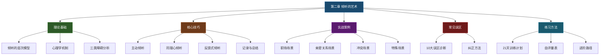

# 第二章 倾听的艺术

## 本章简介

在沟通的世界里，大多数人把注意力放在"如何说"上——怎样措辞更得体、怎样表达更有说服力、怎样讲故事更引人入胜。然而，真正决定沟通质量的，往往不是你说了什么，而是你听了什么。

想象一个场景：你的伴侣下班回家，看起来疲惫而沮丧，说了一句"今天真是糟糕的一天"。你有两种回应方式——

- **回应A**："那你明天早点把工作做完就好了。"
- **回应B**：放下手机，看着对方的眼睛，轻声说："听起来你今天过得很辛苦，愿意跟我说说吗？"

回应A给出了一个"合理"的建议，但对方可能会觉得你在敷衍，甚至觉得你在指责她效率低。回应B没有提供任何解决方案，却让对方感到被看见、被理解。这就是倾听与不倾听的区别——前者在解决问题，后者在连接人心。

### 倾听：被低估的沟通核心能力

倾听是沟通中最被低估却最为重要的能力。美国沟通学者Adler和Towne的研究表明，在日常沟通中，我们大约有45%的时间在倾听，25%的时间在说话，15%的时间在阅读，15%的时间在书写。也就是说，倾听占据了我们沟通时间的将近一半，但大多数人从未接受过任何倾听训练。我们花大量时间学习演讲、写作、说服，却几乎从未系统地学习如何倾听。

这种失衡带来了严重的后果：

- **职场代价**：根据HR Magazine的报道，企业中70%的沟通错误源于倾听不充分。一个项目经理因为"没听清楚"客户的需求，导致整个团队返工两周；一个主管因为"没听出"员工话里的求助信号，错失了挽留核心人才的机会。
- **家庭代价**：婚姻治疗师John Gottman的研究发现，在离婚夫妇中，最常见的抱怨不是"他/她说错了什么"，而是"他/她从来不听我说话"。"没有被听见"是亲密关系中最具破坏力的体验之一。
- **社交代价**：心理学家Carl Rogers指出，当一个人感到"真正被理解"时，他的防御心理会降低、开放性会提高、创造力会增强。反过来说，"感觉不被理解"是人际关系疏远的起点。
- **个人代价**：不善于倾听的人，往往也无法从他人那里获得真实的信息反馈，导致自我认知偏差，决策质量下降。

可以说，倾听能力的缺失，是大多数人际关系问题的根源之一。而好消息是，倾听是一种完全可以通过系统学习和刻意练习来提升的技能。

### 什么是真正的倾听

很多人以为倾听就是"安静地听对方说话"。这是一个危险的误解。真正的倾听（Active Listening）远不止于此。它是一个包含**接收、理解、评估、回应**四个阶段的完整认知过程，需要调动你的注意力、情绪管理能力和共情能力。

国际倾听协会（International Listening Association）对倾听的定义是："倾听是对口头和非口头信息进行接收、构建意义、做出反应的过程。"这个定义揭示了三个关键要素：

1. **接收**：不仅是听觉层面的"听到"，还包括对非语言信息（表情、姿态、语气）的感知
2. **构建意义**：将接收到的信息与自己的知识、经验进行整合，理解对方的真实意图
3. **做出反应**：通过语言或非语言方式，让对方知道你在倾听，且理解了对方

### 倾听的神经科学基础

现代脑科学研究为我们揭示了倾听的生理机制。当我们倾听他人说话时，大脑并非被动接收信息，而是高度活跃的：

- **听觉皮层**处理声音信号，将声波转化为可识别的语言单元
- **布洛卡区和韦尼克区**协作完成语言理解——前者处理语法结构，后者处理语义内容
- **前额叶皮层**负责工作记忆和注意力管理，帮助我们在纷杂的信息中保持聚焦
- **镜像神经元系统**让我们能够"感同身受"——当我们听到对方描述痛苦时，我们的大脑中负责感受痛苦的区域也会被激活
- **杏仁核**负责情绪识别和反应，帮助我们捕捉对方话语中的情绪信号

这意味着倾听不是一项单一技能，而是一个涉及听觉、语言、注意力、情绪、共情等多个脑区协同工作的复杂认知活动。这也解释了为什么倾听如此消耗精力——它确实在"烧脑"。

### 为什么倾听如此困难

既然倾听占据我们45%的沟通时间，为什么大多数人仍然不善于倾听？这源于多重障碍的叠加：

**生理层面的障碍**：人说话的速度大约是每分钟125-175个词，而大脑处理信息的速度可以达到每分钟400-800个词。这意味着在倾听时，我们的大脑有大量的"空闲时间"。大多数人会利用这些空闲时间走神——想想晚饭吃什么、回忆刚才看到的新闻、盘算接下来的安排。这种"思维速度差"是走神的根本生理原因。

**心理层面的障碍**：每个人都有自己的认知框架、价值体系和情感需求。当对方说的话与我们的框架冲突时，我们的第一反应往往是"反驳"而非"理解"；当对方在表达时触发了我们的某个情感按钮（比如被批评、被忽视），我们的情绪会立刻占据主导，理性倾听的能力急剧下降。

**习惯层面的障碍**：大多数人在成长过程中没有接受过倾听训练。我们的教育系统奖励"会说话"的人——谁能在课堂上积极发言、谁能在考试中写出正确答案，但几乎不评估"会不会听"。久而久之，"说"的能力得到了训练，"听"的能力原地踏步。

**环境层面的障碍**：在数字化时代，我们的倾听环境变得更加恶劣。手机通知、社交媒体、即时消息不断打断我们的注意力；线上会议中延迟的音频和模糊的画面进一步削弱了倾听效果。微软的一项调查显示，在线上会议中，人们的平均注意力集中时间只有8秒。

理解这些障碍不是为了给"不善于倾听"找借口，而是为了有的放矢——知道敌人在哪里，才能精准出击。

***

## 学习目标

通过本章的学习，你将能够：

### 认知层面：建立倾听的完整认知框架

1. **理解倾听的本质**：明确倾听不仅仅是"听到声音"，而是一个包含接收、理解、评估、回应四个阶段的完整认知过程。你将能够用清晰的语言向他人解释"什么是倾听"和"倾听与听到的区别"。
2. **认识倾听的层次模型**：能够区分听而不闻、虚应故事、选择性倾听、专注倾听和同理心倾听五个层次，并通过自我观察判断自己在不同场景中处于哪个层次。这个五层模型将贯穿全章，是后续所有技巧的理论基础。
3. **了解倾听的心理学机制**：理解工作记忆容量（Miller的7±2法则）、注意力分配（Kahneman的注意力资源理论）、认知偏见（确认偏误、首因效应等）如何系统性地影响倾听效果，从而理解"为什么我总是听不好"的深层原因。
4. **识别倾听的三类障碍**：能够准确觉察自己和他人在倾听过程中遇到的障碍，并将其归类为生理障碍（听觉损伤、思维速度差）、心理障碍（认知偏见、情绪干扰、自我中心）和环境障碍（噪音、干扰、多任务），为后续的针对性练习打下基础。

### 技能层面：掌握四大倾听核心技巧

5. **掌握主动倾听技巧**：学会使用眼神接触（何时看、看多久、看哪里）、肢体语言（身体朝向、点头节奏、手势回应）、适时回应（嗯、是的、然后呢）等技巧，让对方在视觉和听觉两个通道都感受到"你在认真倾听"。
6. **掌握同理心倾听技巧**：学会暂时搁置自己的判断、经验和情绪，运用"换位思考"的三层方法（认知换位→情感换位→存在换位），真正站在对方的角度理解其情感状态和深层需求。
7. **掌握反馈式倾听技巧**：学会通过复述（用自己的话重述对方的核心意思）、澄清（对模糊信息进行追问确认）、总结（在对话节点进行要点提炼）和情感反映（识别并命名对方的情绪）四种反馈方式，验证自己的理解并让对方感到被理解。
8. **掌握记录和总结技巧**：学会在会议、谈判、辅导等重要沟通场景中使用结构化记录法（如Cornell笔记法的沟通版），在不打断对方的前提下捕捉关键信息，并在沟通结束时进行准确、完整、有条理的总结。

### 应用层面：在真实场景中灵活运用

9. **应对至少8种倾听场景**：能够在朋友倾诉、领导指示、客户投诉、伴侣沟通、会议讨论、冲突调解、销售谈判、辅导教育等不同场景中，根据场景特点灵活调整倾听策略——你将掌握一套"场景识别→策略选择→技巧匹配→效果评估"的完整决策流程。
10. **避免10种常见倾听误区**：能够识别并改正急于给建议、打断对方、选择性倾听、虚假倾听、以自我为中心、过度同情、忽视非语言信号、过早下结论、防御性倾听、功利性倾听等常见误区。每种误区你都将学到其"为什么错"和"怎么改"。
11. **建立持续练习习惯**：能够按照本章提供的21天倾听训练计划，结合日常场景进行刻意练习，并通过自我评估量表追踪自己的进步。

***

## 章节路线图

本章共包含以下核心内容模块，按照"理论→方法→实操→反思"的逻辑顺序编排：

| 模块 | 核心内容 | 关键方法/工具 | 学习重点 |
|------|----------|---------------|----------|
| 理论基础 | 倾听的五层模型、心理学机制、障碍分类 | 五层模型自我定位法 | 理解"为什么我听不好" |
| 核心技巧 | 四大倾听技巧的原理与方法 | SOFTEN模型、复述四步法、Cornell沟通笔记法 | 掌握"怎么听"的具体方法 |
| 实战案例 | 8+种真实场景的倾听应用 | 场景-策略匹配矩阵 | 学会在不同场景中灵活变通 |
| 常见误区 | 10种倾听陷阱的诊断与纠正 | 误区自检清单 | 避免"以为自己在听"的假象 |
| 练习方法 | 21天训练计划与进阶路径 | 每日倾听日志、自评量表 | 将倾听从技能变成习惯 |

***

## 核心要点

在正式开始学习之前，先记住以下10个核心要点。这些要点贯穿本章始终，是理解所有内容的基础。建议你在学完本章后再回来重读一遍，你会发现每个要点都有了不同的分量。

### 要点一：倾听是一种主动行为

倾听不是被动地等待对方说完，而是一个需要全身心投入的主动过程。真正的倾听需要你调动注意力、管理情绪、抑制冲动、积极思考。它和说话一样，需要消耗精力和意志力。

为什么这个认知很重要？因为如果你把倾听当作"被动的等待"，你就不会为它分配精力。你会一边"听"一边刷手机，一边"听"一边想自己的事。但如果你认识到倾听是一项需要主动投入的认知活动，你就会像准备一场演讲一样，为倾听做好精力和注意力的准备。

神经科学研究证实了这一点：功能性磁共振成像（fMRI）显示，认真倾听时大脑的耗氧量与解数学题相当。倾听不是"休息"，是"工作"。

### 要点二：听到≠听懂

"听到"是生理层面的——声波进入耳朵，大脑识别出声音；"听懂"是认知和情感层面的——你不仅理解了对方话语的字面意思，还理解了背后的情感、需求和意图。从"听到"到"听懂"，需要跨越巨大的鸿沟。

举个例子：当你的同事说"这个方案还行吧"，你"听到"的是对方案的评价，但你可能没有"听懂"——这句话背后可能是"我觉得这个方案有问题但不好意思直说"，也可能是"我真的觉得还不错只是表达比较保守"。语境、语气、表情、你们的关系历史，都是理解真实含义的线索。

| 维度 | "听到" | "听懂" |
|------|--------|--------|
| 层面 | 生理/感知 | 认知/情感 |
| 关注点 | 声音和文字 | 含义和意图 |
| 所需能力 | 正常听力 | 注意力+共情力+推理力 |
| 信息来源 | 听觉单一通道 | 听觉+视觉+语境+关系 |
| 结果 | 知道对方说了什么 | 理解对方想表达什么、为什么这样说 |

### 要点三：倾听的目的是理解，不是回应

大多数人听别人说话时，脑子里想的是"等他说完我就要说什么"。这种"等待发言"的状态根本不是倾听。心理学家Carl Rogers将这种现象称为"评价性倾听"——你不是在理解对方，而是在评判对方，同时准备自己的反驳或补充。

真正的倾听，目的是充分理解对方。这个理解包括三个层次：
- **内容层**：对方在说什么事实？
- **情感层**：对方在表达什么情绪？
- **需求层**：对方真正需要的是什么？

当你把目标从"准备回应"切换到"寻求理解"，整个倾听的质量会发生质的飞跃。你会发现，很多对话并不需要你的回应——对方需要的只是被听见。

### 要点四：情绪先于内容

人们在表达时，往往先传递情绪，再传递信息。如果你只关注对方说了什么内容，而忽略了对方的情绪状态，你很可能"听懂了每个字，但完全没理解对方"。

哈佛大学心理学家Daniel Goleman在其情绪智力理论中指出，人类大脑中负责情绪处理的杏仁核，其反应速度比负责理性思考的前额叶皮层快约20毫秒。这意味着情绪信息总是"抢先一步"到达你的大脑。但问题在于，大多数人被教育要"理性"，于是主动忽略情绪信号，只关注"事实"。

倾听时，正确的顺序是：**先听情绪，再听内容**。当你识别到对方的情绪（比如焦虑、委屈、愤怒、期待），并用语言反映出来（"你听起来很焦虑"），对方会立刻感到被理解。此时，他才会放下情绪防御，跟你进行理性的内容层面的对话。

### 要点五：倾听需要搁置自我

当你在倾听时想着"我该怎么回应"、"我的经历更精彩"、"他说的不对"，你就已经不在倾听了。这些念头的本质是"自我"——你在用自己作为参照系来解读对方的话，而不是真正进入对方的世界。

心理学家将这种现象称为"自我中心倾听"（Egocentric Listening）。它的表现形式多样：
- **比较式**："你这算什么，我当年比你还惨……"
- **建议式**："你应该这样做……"
- **评判式**："你不应该这么想……"
- **抢话式**："我也遇到过！让我告诉你……"

真正的倾听要求你暂时把自己的观点、经历、判断放到一边，全心全意地进入对方的世界。这不意味着你要放弃自我，而是说在倾听的那个时刻，"对方"比"你"更重要。

### 要点六：沉默是有力量的

很多人害怕对话中的沉默，觉得冷场很尴尬，于是用"嗯嗯"、"对对"、"是是"来填补每一个空隙。但适当的沉默其实是最有力的倾听工具——它给对方思考的空间，给情绪流动的时间，也传递出"我在认真听，不着急"的信号。

心理咨询师都知道"黄金沉默"的价值：在来访者说完一段话后，保持3-5秒的沉默，往往能让对方说出更深层的想法。这3-5秒的沉默，比任何追问都有效。

日本有一个概念叫"间"（ma），指的是留白的力量——在音乐中是音符之间的停顿，在对话中是话语之间的沉默。好的倾听者懂得运用"间"的力量，让对话有呼吸感。

### 要点七：反馈是倾听的验证

你觉得自己听懂了，不代表你真的听懂了。人类的沟通充满了歧义、暗示、省略和潜台词。唯一的验证方法就是——反馈。

通过复述、澄清、总结等反馈方式来验证自己的理解，不是多余的步骤，而是负责任的倾听行为。它向对方传递了两层信息：
1. "我在认真听"——因为我能准确复述你说的内容
2. "我在确认理解"——因为我不想误解你

很多沟通冲突的根源是"我以为我听懂了"。一句简单的"你的意思是……对吗？"就能避免大量的误解和冲突。

### 要点八：身体比语言更诚实

美国心理学家Albert Mehrabian在1967年的研究中发现，在表达情感和态度时，信息的传递来源构成如下：55%来自面部表情和肢体语言，38%来自语调和语气，7%来自语言内容本身。

> **重要说明**：这个55/38/7的比例经常被误读。Mehrabian本人多次强调，这个数据**仅适用于情感态度的表达场景**（比如"我喜欢你"这句话的可信度），不适用于所有沟通情境（比如讨论技术方案时，语言内容的权重远高于7%）。但它传递的核心洞察是成立的：**当你只"听话"而不观察对方的表情、姿态、语气时，你确实会错过大量信息**。

### 要点九：倾听是一种可以训练的技能

倾听不是天赋，而是一种可以通过刻意练习不断提升的技能。认知心理学家Anders Ericsson的研究表明，在任何领域，从新手到专家都需要大约10000小时的刻意练习。倾听也是如此。

好消息是，你不需要10000小时。研究表明，仅仅3周的集中训练就能显著提升倾听效果。本章提供的21天训练计划，就是基于这一研究成果设计的。就像学开车一样，一开始需要刻意注意每个动作，但随着练习，良好的倾听习惯会变成你的本能。

### 要点十：好的倾听者是最好的沟通者

如果你能让每一个和你交谈的人都感到"被理解"、"被重视"，你不需要任何华丽的辞藻和高超的技巧，你就是所有人心目中最好的沟通者。

美国前总统林登·约翰逊有一句名言："如果你真的在听一个人说话，你就不需要问'你在说什么'。"这不是因为他有超能力，而是因为他的全部注意力都在对方身上。

在这个人人都急于表达的时代，一个愿意认真倾听的人，本身就是最珍贵的礼物。

***

## 读者自测：你目前的倾听水平如何？

在正式学习之前，先花2分钟做一个快速自测。这不是考试，而是帮助你建立起点认知，以便在学完本章后对比自己的进步。

请对以下10个陈述，从1（完全不符合）到5（完全符合）打分：

| 编号 | 陈述 | 评分(1-5) |
|------|------|-----------|
| 1 | 当别人说话时，我能在不看手机的情况下持续专注5分钟以上 | |
| 2 | 在对话中，我会先观察对方的情绪状态再关注内容 | |
| 3 | 我能准确复述对方刚说的核心意思（用我自己的话） | |
| 4 | 当我不同意对方时，我会先听完再表达自己的观点 | |
| 5 | 在对方说完后，我会停顿2-3秒再回应，而不是立刻接话 | |
| 6 | 我能觉察到对方话语中没有直接说出的隐含意思 | |
| 7 | 在重要对话中，我会做笔记记录关键信息 | |
| 8 | 我能区分对方是在寻求建议还是只是需要倾诉 | |
| 9 | 对方在表达情绪时，我会先回应情绪再讨论事情 | |
| 10 | 我的同事/伴侣/朋友曾主动说过"跟你聊天很舒服" | |

**评分说明**：
- **40-50分**：你的倾听基础很好，本章将帮助你从"好"到"卓越"
- **30-39分**：你有倾听意识，但执行还不够稳定，本章将帮你建立系统方法
- **20-29分**：你正在从"无意识的不好"向"有意识的不足"转变，这是进步的起点
- **10-19分**：好消息——你的提升空间最大，学完本章你会感受到质的变化

请记住你的分数。学完本章后再做一次，你会清楚地看到自己的成长。

***

## 关于Mehrabian法则的补充说明

在核心要点八中提到了Albert Mehrabian的55/38/7法则。鉴于这个法则在各类沟通书籍中被广泛引用（也广泛误用），这里做一个专门的说明，帮助你正确理解其含义和适用范围。

**原始研究背景**：Mehrabian在1967年进行了两个实验。实验一让受试者听同一个词以不同语调说出，判断说话者的情绪态度；实验二让受试者看照片和文字的组合，判断态度的可信度。结论是：当语言内容与语调/表情不一致时，受试者更倾向于相信非语言信息。

**正确的理解方式**：
- 这个比例**仅适用于情感态度表达的一致性研究**，不是所有沟通场景的通用法则
- 在讨论技术方案、传递数据信息、进行逻辑论证时，语言内容的权重远超7%
- Mehrabian本人在官网明确声明："除非讨论的是情感态度的传递，否则请不要引用这个公式"

**对倾听的真正启示**：
- 当对方在表达情绪（而非传递信息）时，非语言信号比语言内容更真实
- 倾听时，不要只听"话"，还要听"声"（语气、语速、音量）和"人"（表情、姿态、动作）
- 当语言内容与非语言信号矛盾时，优先相信非语言信号

***

> 💡 **阅读建议**：本章内容较多，建议分3-4次阅读。第一次通读章节概览和理论基础，建立认知框架；第二次学习核心技巧，边读边做笔记——建议准备一个专门的"倾听练习笔记本"；第三次研读实战案例，尝试代入场景思考，想象如果自己是案例中的倾听者会怎么做；第四次完成常见误区和练习方法的学习，制定自己的21天练习计划。每次阅读间隔建议不超过3天，以保持认知的连贯性。
