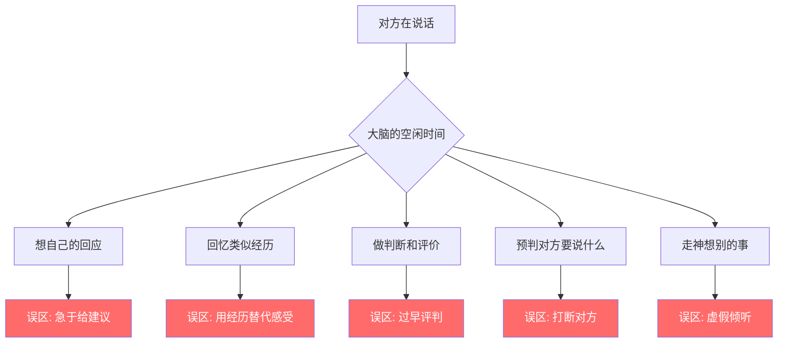
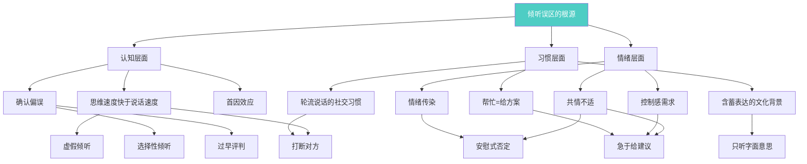

# 第四节 常见误区：为什么你学了技巧却仍然"听不好"

> "我们以为自己在倾听，但大多数时候，我们只是在等待发言的机会。"
> ——史蒂芬·柯维

即使学了倾听的理论和技巧，很多人在实际操作中仍然会掉入一些常见的"陷阱"。这些误区看起来很像真正的倾听，甚至有时候你觉得自己做得很好，但实际上它们不仅没有帮助，还可能伤害关系。

更隐蔽的是，这些误区往往不是"不会听"造成的，而恰恰是"太想听好"或者"太想帮忙"造成的——它们是善意的失败。正因如此，识别它们才格外困难。

本节将逐一揭示10个最常见的倾听误区，帮你识别并改正它们。每个误区都会从表现、心理机制、真实案例、正确做法四个维度展开，并在最后提供一套完整的自查与纠正体系。

---

## 为什么倾听如此容易陷入误区

在深入具体误区之前，先理解一个根本问题：为什么倾听这么难做好？

### 认知层面的根源

人类的思维速度远快于说话速度。正常语速约为每分钟120-150个词，但人类的思维速度可以达到每分钟400-800个词。这意味着当你在听别人说话时，你的大脑有大量"空闲时间"，这些时间会被自动填充——你在想自己的回应、回忆类似经历、做判断、走神，或者在"预判"对方接下来要说什么。

这种认知上的"时间差"是所有倾听误区的温床。

### 情绪层面的根源

当对方的叙述触发了你的情绪——焦虑、共鸣、不耐烦、想帮忙的冲动——你的注意力就会从"理解对方"转向"处理自己的情绪反应"。你以为你在倾听，实际上你在内部处理自己的情绪。

### 社交习惯层面的根源

大多数社交对话是"轮流说话"的模式，而不是"一方说、一方听"的模式。我们从小被训练的是"如何接话"、"如何表达"，而不是"如何持续地、专注地理解另一个人"。倾听是一种反本能的技能，需要刻意练习。

理解了这些根源，你就会明白：倾听误区不是"态度问题"，而是"认知模式问题"。改正它们不是靠"更努力地听"，而是靠改变大脑的默认处理方式。

---

## 误区一：急于给建议

### 表现

对方刚说出一个困扰，你立刻就说"你应该这样做……"、"我觉得你可以试试……"、"我建议你……"。你觉得你是在帮忙，但对方可能觉得你根本没有在听。

这种误区的触发速度极快——往往在对方说了不到三句话的时候，你脑中就已经形成了一个"解决方案"，并且迫不及待地想说出来。

### 心理机制

急于给建议背后有三层驱动力：

1. **控制感需求**：给出建议让你觉得自己"有用"、"能解决问题"，这满足了你的控制感需求。
2. **不适感逃避**：听到别人的痛苦和困扰会引发你的"共情不适"，给建议是一种快速终结这种不适的方式——"问题解决了，我就不难受了"。
3. **角色期待**：在很多文化中，特别是中国社会里，"帮忙"被等同于"给方案"。你觉得自己作为朋友/家人/同事，"应该"给出有用的建议，否则就是"不称职"。

### 为什么这是一个误区

- **大多数人倾诉时需要的是"被理解"而不是"被指导"。** 哈佛商学院的研究表明，当人们表达困扰时，他们最需要的回应是"我在听，我理解你的感受"，而不是"你应该怎么做"。过早给建议，等于告诉对方"你不需要再说了，我知道该怎么办"。
- **你的建议很可能基于不完整的信息。** 你刚听了开头就给建议，怎么可能了解全部情况？心理学中称为"锚定效应"——你根据最初获得的少量信息就做出了判断，后续信息即使与你的判断矛盾，你也会倾向于忽略。
- **即使你的建议是对的，如果对方没有感到被理解，他也不会接受。** 心理咨询中有一条基本原则：在对方感到被充分理解之前，任何建议都是无效的。人只有在感到安全和被理解的状态下，才愿意接受新的观点。
- **给建议会破坏对方自我探索的机会。** 很多时候，对方通过倾诉自己就能找到答案。你的建议剥夺了他这个自我发现的过程。

### 真实案例

> 朋友："我最近和同事关系处得不太好……"
>
> 你："你应该主动找他聊聊！沟通是最好的方式！"
>
> 朋友：（心想：我还没说完呢，你知道具体情况吗？你知道那个同事有多难搞吗？你知道我已经试过沟通了吗？）

> 妈妈："我最近腰有点疼……"
>
> 你："去做个理疗吧！我同事之前也是，做了两次就好了。"
>
> 妈妈：（心想：我其实是想让你关心我，不是让你给我开处方。）

### 正确做法

**第一步：先倾听，不给建议。** 让对方把话说完，用简短的回应表示你在听："嗯"、"然后呢"、"这确实不容易"。

**第二步：确认对方的需求。** 直接问："你需要我的建议吗？还是只是想有人听你说？"这个问题非常有力量——它把选择权交给了对方。

**第三步：如果对方需要建议，先总结你听到的。** "我听下来，情况是这样的……，你之前试过……，现在的主要困难是……，我理解对了吗？"确认你真的理解了之后，再给建议。

**第四步：给建议时用"探索式"而非"指令式"。** 不要说"你应该……"，而是说"有个思路你可以考虑……"或者"如果是我的话，我可能会……你觉得呢？"

> 💡 **一个实用的口诀：** 对方说完后，在心里默数3秒再开口。这3秒足够让你从"给建议模式"切换到"理解模式"。

---

## 误区二：打断对方

### 表现

对方话还没说完，你就插嘴表达自己的看法。有时候是因为你太激动了（"我也是！我也有过这样的经历！"），有时候是因为你不同意（"不对，你听我说……"），有时候是因为你觉得你已经知道他要说什么了。

打断有多种形式，有些很明显，有些很隐蔽：

| 打断类型 | 表现形式 | 隐蔽程度 |
|---------|---------|---------|
| 直接打断 | 对方说到一半直接插话 | 低 |
| 抢话 | 对方刚停顿0.5秒就接话 | 中 |
| 接话尾 | 对方还没说完最后一个词就替他说完 | 中 |
| 转移话题 | 对方说完一件事，你立刻跳到另一个话题 | 高 |
| 非语言打断 | 叹气、翻白眼、看手机等暗示"快点说" | 高 |

### 心理机制

打断的根本原因是**"输出优先于输入"的本能**。人类大脑在接收到信息后会产生强烈的表达冲动——你有一个想法、一个反对意见、一个类似经历，它们在你的脑中排队等待输出。当这个冲动足够强烈时，它会压过"继续听"的理性判断。

另外，打断也可能是**焦虑的表现**——你害怕沉默，害怕对话"冷场"，所以急于填补每一个停顿。

### 为什么这是一个误区

- **打断传递的信号是"我的话比你的重要"或"我已经知道了，你不用再说了"。** 即使你的本意不是如此，对方接收到的就是这个信息。
- **你打断的那一刻，对方还没说完的话可能正是最重要的部分。** 很多人在表达复杂想法时，会先铺垫背景，最后才说核心观点。你如果在铺垫阶段就打断，就永远听不到核心。
- **频繁被打断会形成"习得性沉默"。** 对方会觉得"反正说了也会被打断"，逐渐失去表达的欲望，以后就不愿意再和你说了。这种沉默一旦形成，很难逆转。
- **打断会影响你自己的理解。** 你基于不完整的信息做出的回应，很可能是错误的或偏颇的。

### 真实案例

> 同事："我觉得这个方案可以优化一下，主要是……"
>
> 你："我知道你要说什么，是成本的问题对吧？"
>
> 同事："……（其实他想说的是用户体验问题）好吧，你说得对。"（放弃表达）

> 朋友："我最近在考虑要不要换工作……"
>
> 你："换！赶紧换！你那公司太坑了！"
>
> 朋友：（心想：我还没说完呢，我想说的是我在考虑要不要换是因为我可能要升职了……）

### 正确做法

**忍住插嘴的冲动。** 如果你觉得你知道对方要说什么，先等他说完——你很可能是错的。

**如果你确实有话想说，先记在心里或纸上。** 等对方说完后再表达。这个"记下来"的动作本身就能缓解你的表达焦虑。

**如果实在忍不住，用"征询式插话"。** 说"我能插一句吗？"或"我想确认一下我的理解"，征得对方同意后再插嘴。

**对于"接话尾"的习惯，刻意练习。** 当你想替对方说完那句话时，强迫自己停下来，让对方自己说完。你会发现，对方要说的和你想的经常不一样。

> 💡 **一个有用的思维转换：** 把每一次"忍住不打断"视为一次对对方的尊重投资。你付出的是几秒钟的等待，收获的是对方的信任和更完整的信息。

---

## 误区三：选择性倾听

### 表现

你只听自己感兴趣或认同的部分，自动过滤掉其他信息。比如，对方说了10个要点，你只记住了和你观点一致的那2个。或者你只关注事实信息，忽略了对方的情感表达。

选择性倾听有几种常见的"过滤模式"：

- **认同过滤**：只听和自己观点一致的内容，自动忽略不一致的。
- **兴趣过滤**：只听自己感兴趣的话题，对不感兴趣的部分心不在焉。
- **能力过滤**：只听自己能理解的部分，对超出自己知识范围的内容直接跳过。
- **情感过滤**：只听事实，忽略情感表达；或者只听情感，忽略事实。
- **结论过滤**：只听结论，忽略推理过程和前提条件。

### 心理机制

选择性倾听的本质是**确认偏误（Confirmation Bias）**在倾听场景中的表现。人脑天然倾向于寻找和接受与已有信念一致的信息，忽略或排斥不一致的信息。这不是态度问题，而是大脑的节能机制——处理一致的信息比处理矛盾的信息消耗更少的认知资源。

### 为什么这是一个误区

- **选择性倾听导致信息遗漏，是工作失误的重要来源。** 在职场中，领导说"这个项目要加快进度，但是质量不能下降"，你只记住了"加快进度"，忽略了"质量不能下降"，结果做出来的东西被退回。
- **只听认同的部分，你就永远无法真正理解对方的完整观点。** 你和对方之间会形成"虚假共识"——你以为你们达成了一致，实际上你们说的是完全不同的东西。
- **忽略情感表达会让对方觉得你"冷冰冰的"。** 对方说"这个项目我真的很用心在做，结果还是出了问题"，你只关注"出了什么问题"，忽略了"真的很用心"和背后的失落感，对方会觉得你只关心事情不关心人。
- **选择性倾听会形成恶性循环。** 你越只听认同的部分，你的信息茧房就越厚，你就越难接受不同的声音。

### 真实案例

> 老婆："今天带孩子去公园，孩子特别开心，玩了一下午。不过回来的路上堵车堵了两个小时，累死了。对了，晚上我想吃火锅。"
>
> 老公：（只记住了"吃火锅"）"行，我订个位。"
>
> 老婆：（心想：我说了那么多你就听到吃火锅？孩子的开心你不关心，我的辛苦你不心疼？）

> 领导："这个方案整体不错，但有几个地方需要调整。第一，预算要控制在50万以内；第二，时间要提前两周；第三，客户那边的关系维护要加强。"
>
> 你：（只记住了"整体不错"）"好的，那我开始推进了。"
>
> 领导：（心想：我说的三个调整你一个都没听到？）

### 正确做法

**有意识地关注对方话语的每一个层面——事实、情感、需求。** 听完一段话后，问自己三个问题：
1. 他说了什么事实/信息？
2. 他表达了什么情感/感受？
3. 他有什么需求/期待？

**如果你发现自己在选择性倾听，暂停一下，问自己"我是不是漏掉了什么？"** 尤其是当你觉得"这段话和我无关"或者"我已经知道了"的时候，恰恰是你最可能遗漏信息的时候。

**在回应时，确保你回应了对方表达的多个方面。** 不要只回应你感兴趣的那一个。比如上面老婆的案例，正确的回应应该是："孩子玩得开心就好，堵两个小时确实辛苦了，晚上吃火锅犒劳一下你。"——同时回应了孩子、她的辛苦、和吃火锅三个点。

> 💡 **一个练习方法：** 在下次重要对话中，故意去关注你"不感兴趣"的那部分内容，听完后复述给对方。这能帮你打破选择性倾听的惯性。

---

## 误区四：虚假倾听

### 表现

你表面上在听，做出点头、"嗯嗯"等回应，但你的脑子在想别的事情。你不是真的在听，只是在表演"在听"。直到对方突然问你"你觉得呢？"，你才慌了——因为你完全不知道对方刚才说了什么。

虚假倾听是所有误区中最"阴险"的一种，因为它看起来和真正的倾听一模一样。你的眼神、姿态、回应节奏都可以是完美的，但你的注意力根本不在这里。

### 心理机制

虚假倾听通常发生在以下几种情况：

1. **认知超载**：你太累了、压力太大了、脑子里装了太多事情，没有多余的注意力分配给倾听。
2. **话题脱钩**：对方说的内容你完全不感兴趣或完全听不懂，你的大脑自动"下线"了。
3. **关系疲惫**：你和对方的关系让你感到疲惫（比如长期倾听一个"情感吸血鬼"的抱怨），你的保护机制让你"关闭"了倾听通道。
4. **设备干扰**：手机通知、电脑弹窗、周围噪音等分散了你的注意力。

### 为什么这是一个误区

- **虚假倾听比不听更糟糕。** 不听至少是诚实的，虚假倾听是欺骗。你给了对方"我在听"的信号，但这个信号是假的。
- **被识破的代价极高。** 一旦被对方识破（通常通过你答非所问、回应不恰当、或表情空洞），对方会感到被欺骗和羞辱。"原来你一直在装"这种感觉比"你没在听"更伤人。
- **长期的虚假倾听会严重损害信任。** 对方会逐渐意识到你不可靠，不再愿意和你分享重要的事情。这种信任的流失是渐进的，等你意识到的时候，关系可能已经无法修复。
- **虚假倾听对你自己也有害。** 你错过了重要的信息，可能做出错误的判断和决策。

### 真实案例

> 对方："……所以我觉得这件事最好的处理方式是先暂停，等条件成熟了再启动。你觉得呢？"
>
> 你：（完全没有在听）"嗯嗯，你说得对。"
>
> 对方："……那你同意我的暂停方案了？具体你打算怎么执行？"
>
> 你："啊？什么暂停方案？"

> 妈妈打电话给你，说了十五分钟家里的事情。
>
> 你：（一边看手机一边）"嗯，嗯，好的，知道了。"
>
> 妈妈："那你刚才说的那个事呢？"
>
> 你："什么事？"
>
> 妈妈：（沉默了很久）"……算了，不说了。"

### 正确做法

**如果你确实无法集中注意力，坦诚地告诉对方。** "我现在状态不太好，怕听不仔细。我们能换个时间再聊吗？"这比虚假倾听要好得多。坦诚不仅不会伤害关系，反而会增进信任——因为它说明你尊重对方，不想用敷衍来对待他。

**消除干扰源。** 把手机翻面朝下，关掉电脑通知，找一个安静的环境。物理上的专注是心理专注的前提。

**用"互动式回应"保持注意力。** 不只是"嗯嗯"，而是用实质性的回应来证明你在听："你刚才说的XX，我理解是……对吗？"这种回应需要你真的在听才能说出来，它既是检验也是自我约束。

**设置"注意力检查点"。** 每隔一两分钟，有意识地问自己："我刚才听到了什么？"如果你答不上来，说明你已经走神了，赶紧把注意力拉回来。

> 💡 **坦诚的力量：** 很多人害怕说"我没在听"会伤害对方，但事实恰恰相反。坦诚说"我现在状态不好"比被拆穿"你一直在装"要好一百倍。前者是尊重，后者是欺骗。

---

## 误区五：用自己的经历替代对方的感受

### 表现

对方刚说完自己的经历，你立刻说"我也遇到过！我当时……"，然后开始讲你自己的故事。你觉得你是在"共情"，但实际上你是在"抢话筒"。

这种误区的隐蔽之处在于：它看起来很像共情。"我也经历过"这句话似乎是建立连接的方式，但如果处理不当，它会把对话从"关注对方"变成"关注自己"。

### 心理机制

当你听到对方的经历时，大脑会自动搜索你自己的记忆库，寻找类似的经历。这是人类理解新信息的基本方式——通过与已有经验的类比来理解。问题在于，这个"搜索-匹配"的过程是自动的，而"要不要把匹配结果说出来"是需要克制的。

另外，分享自己的经历也满足了社交需求——你希望对方觉得"我理解你"、"我们有共同点"。这种需求本身没有问题，问题在于表达方式和时机。

### 为什么这是一个误区

- **每个人的经历和感受都是独特的。** 你的"类似经历"可能和对方的完全不同。你以为你在共情，实际上你在用自己的经验"覆盖"对方的独特体验。
- **当你说"我也是"的那一刻，对话的焦点就从对方转移到了你身上。** 对方原本是倾诉者，现在变成了你的听众。
- **比惨式的分享更伤人。** "你这算什么，我更惨"——即使你的本意是"我理解你的痛苦"，对方接收到的是"你在否定我的感受"。
- **过度分享会让对方觉得你只在乎自己。** 每次他开口，你都把话题拉到自己身上，久而久之他就不想跟你说了。

### 真实案例

> 朋友："我最近工作压力特别大，每天加班到10点……"
>
> 你："你这算什么？我之前在XX公司的时候，连续加班三个月！每天12点才走！"
>
> 朋友：（心想：我在说我的痛苦，你在跟我比谁更惨？）

> 同事："我刚买了房，月供压力挺大的……"
>
> 你："是啊！我也是！我每个月房贷8000，而且我买的还是期房，到现在都没交房……"（开始长篇大论讲自己的买房经历）
>
> 同事：（心想：我还没说完呢……）

### 正确做法

**先充分回应对方的感受和经历。** "每天加班到10点确实很累，身体和心理都扛着很大的压力。"——先让对方感到被理解。

**如果想分享自己的经历，用"许可式"表达。** "我之前也经历过类似的，如果你有兴趣我可以聊聊我的经验"——把选择权交给对方。

**分享时保持简短，然后把话题拉回对方。** "我之前也是这样，后来我尝试了XX方法，有些帮助。你目前有想过怎么调整吗？"——你的经历是"参考"，不是"主角"。

**绝对避免比惨。** 不管你的经历有多"惨"，都不要说出来和对方比较。痛苦不是用来比赛的。

> 💡 **一个判断标准：** 在你说完自己的经历后，如果你发现自己还在继续讲自己，说明你已经"抢话筒"了。真正好的分享应该是：简短分享 → 拉回对方 → 深入了解他的独特情况。

---

## 误区六：过早评判

### 表现

对方还没说完，你就在心里做出了"对错"、"好坏"、"合理不合理"的判断。一旦你做出了评判，你的倾听通道就关闭了——你不再是在接收信息，而是在寻找支持你判断的证据。

过早评判和"急于给建议"不同。给建议是"我觉得你应该怎么做"，过早评判是"我觉得你是对的/错的"。前者是行动导向，后者是评价导向。

### 心理机制

过早评判源于**大脑的快速分类机制**。人类大脑需要快速判断环境中的信息是"安全的"还是"危险的"、"好的"还是"坏的"，这是进化的产物。在倾听场景中，这种机制会把对方的话快速归类为"同意/不同意"、"合理/不合理"，然后你就带着这个"标签"去听后面的内容。

这在心理学中被称为**首因效应（Primacy Effect）**——你根据最初获得的信息形成了判断，后续的信息都被这个判断"染色"了。

### 为什么这是一个误区

- **过早评判会让你错过重要的信息和视角。** 当你已经在心里"判了对方"，你就不会再去认真听他的解释和理由。
- **确认偏误会强化你的判断。** 一旦你做出了"这个人不对"的判断，你就会自动寻找支持这个判断的证据，忽略反驳的证据。你不是在倾听，而是在"搜集证据"。
- **评判会通过非语言信号泄露。** 你可能觉得自己藏得很好，但你的微表情、语气变化、身体姿态都会不自觉地传递"我不认同"的信号。对方能感受到。
- **过早评判会阻止你理解对方的逻辑。** 每个人做决定都有自己的逻辑链，即使最终结论你觉得"不合理"，但如果理解了他的逻辑链，你可能会发现"在他的情况下，这么想是可以理解的"。

### 真实案例

> 朋友："我想辞职去创业。"
>
> 你心里立刻想："疯了吧？现在经济这么差，创业不是找死吗？"
>
> 之后不管朋友说什么创业计划，你都带着"这不行"的滤镜在听。他说市场调研做了半年，你觉得"调研有什么用"；他说有合伙人了，你觉得"合伙人最容易闹翻"；他说有投资意向了，你觉得"投资人都是骗子"。

> 同事："我觉得我们应该放弃A方案，改用B方案。"
>
> 你心里想："A方案是我提的，你这不是在否定我吗？"
>
> 之后你根本没在听B方案的优势，满脑子都在想怎么反驳。

### 正确做法

**练习"延迟评判"——在对方完整表达之前，不做任何判断。** 把评判权暂时"冻结"，等信息充分了再解冻。

**用好奇心替代评判心。** 当你感到自己在评判时，立刻切换到提问模式：
- "他为什么会这么想？"
- "他的依据是什么？"
- "他的考虑有哪些是我没想到的？"
- "在他的处境下，这个想法合理吗？"

**区分"理解"和"认同"。** 你可以理解对方的想法但不认同，这没有矛盾。"我理解你为什么这么想"不等于"我认为你是对的"。先理解，再决定是否认同。

**觉察自己的"评判触发点"。** 每个人都有特定的话题会触发快速评判——政治、金钱、教育方式、生活方式等。了解自己的触发点，在这些话题上格外注意延迟评判。

> 💡 **一个实用技巧：** 当你感到自己在评判时，对自己说"暂停，我先听完"。这三个字可以打断评判的自动化流程，给你一个重新选择的机会。

---

## 误区七：只听字面意思

### 表现

你只关注对方话语的表面含义，没有去理解背后的真正意图和情感。对方说"没事"你就真的以为没事；对方说"随便"你就真的随便了；对方说"你忙吧"你就真的去忙了。

这是所有误区中最容易"踩雷"的一种，尤其在亲密关系中。

### 心理机制

只听字面意思的人，通常有两种情况：

1. **字面思维模式**：你的大脑习惯于处理明确的、逻辑化的信息，对隐含的、情绪化的信息不敏感。这在理工科背景的人中更常见。
2. **逃避复杂性**：解读话外之音需要消耗额外的认知资源，而且有"解读错误"的风险。只听字面意思更安全——"你说了什么我就信什么，出了问题不是我的错"。

### 为什么这是一个误区

- **语言是很不可靠的信息载体。** 心理学家阿尔伯特·梅拉比安（Albert Mehrabian）的研究表明，在情感性沟通中，语言内容只占7%，语气语调占38%，肢体语言占55%。只听字面意思，你只获得了7%的信息。
- **中国文化中的含蓄表达。** 在中国文化中，直接表达需求被认为是"不好意思"的，人们更倾向于用暗示、迂回的方式表达真实意图。只听字面意思在中国社交场景中尤其危险。
- **话外之音往往是真正的需求。** "没事"往往是"很有事但我不想说"；"随便"往往是"我有想法但你不问我就算了"；"你忙吧"往往是"我希望你能为我腾出时间"。
- **只听字面意思的人，会经常觉得"他不是说没事吗？怎么又生气了？"** 这不是对方的问题，是你解读能力的问题。

### 真实案例

> 老婆："你今天晚上有安排吗？"
>
> 老公："有个同事聚餐。"
>
> 老婆："哦，那你去吧，我没事。"
>
> 老公："好的。"（然后去聚餐了）
>
> 老婆：（生气了）他真的去了！
>
> 老公：（困惑）你不是说没事吗？

> 下属："领导，这个任务我可能需要多一点时间……"
>
> 领导："行，你看着办吧。"
>
> 下属：（理解为"随便你多久都行"）
>
> 领导：（三天后）"怎么还没做完？"（其实"你看着办吧"的意思是"你自己把握，但别拖太久"）

### 正确做法

**学会听"话外之音"。** 当对方说"没事"、"随便"、"你忙吧"这类模糊回应时，多问一句："真的没事吗？我感觉你好像有些想法。"

**注意非语言信号。** 语气、表情、肢体语言往往比语言本身更真实。对方说"没事"的时候，如果语气低沉、眼神回避、身体转向一边，那大概率不是"没事"。

**建立"信号词"意识。** 以下词汇在很多场景下是"反话"或"话外之音"的信号：

| 字面表达 | 常见真实含义 | 场景 |
|---------|-----------|-----|
| 没事/没关系 | 有事，但不想直接说 | 情感场景 |
| 随便/都行 | 有偏好，但希望你主动问 | 决策场景 |
| 你忙吧 | 希望你为我腾出时间 | 关系场景 |
| 好吧 | 不太同意，但不想争论 | 意见分歧 |
| 再说吧 | 不想做/不想去，但不想直接拒绝 | 邀约场景 |
| 你觉得呢 | 我有想法，想先听你的 | 试探场景 |
| 还行吧 | 不太满意，但不好意思说 | 评价场景 |

**但也要注意：不是所有"没事"都是反话。** 要结合具体场景、对方的性格、和你们的关系来判断。如果对方是一个直来直去的人，他说"没事"可能真的就是没事。过度解读和不解读一样有害。

> 💡 **一个平衡原则：** 不解读 ≠ 不关心，过度解读 ≠ 更关心。最好的方式是：注意到对方可能有话外之音 → 温和地追问一句 → 根据对方的回应决定是否深入。给对方一个"说真话"的安全空间。

---

## 误区八：安慰式否定

### 表现

当对方表达负面情绪时，你出于好意说"别难过了"、"想开点"、"没什么大不了的"、"一切都会好的"。你觉得你在安慰，但实际上你在否定对方的情绪。

这是所有误区中"善意含量最高"的一个——你的出发点完全是对的，但效果完全相反。

### 心理机制

安慰式否定源于两种心理：

1. **"修好"冲动**：看到对方难过，你本能地想要"修好"他的情绪，就像修好一个坏掉的东西一样。"别难过了"就是你的"修好"工具。
2. **情绪传染的不适**：对方的负面情绪会传染给你，让你也不舒服。"想开点"表面上是在安慰对方，实际上是在缓解你自己的不适——"你快别难过了，你难过我也不舒服"。

### 为什么这是一个误区

- **"别难过了"等于说"你的难过是不应该的"。** 但情绪没有对错之分，它只是存在。一个人在特定的处境下感到难过，是完全正常的、合理的反应。
- **当一个人的情绪被否定时，他会觉得"你不懂我"。** 这不仅没有安慰到他，反而让他更孤独——"连我最亲近的人都不理解我的感受"。
- **过度简化的安慰在对方听来可能是敷衍。** "一切都会好的"——你怎么知道？你凭什么这么笃定？这种空洞的安慰会让对方觉得你根本不在乎。
- **情绪需要被"看见"才能流动。** 当情绪被否定时，它不会消失，而是被压抑。被压抑的情绪会以其他方式表现出来——身体症状、莫名的烦躁、对你的疏远。

### 真实案例

> 朋友："我这次考试又没考好，我真的觉得自己很没用……"
>
> 你："别这么想！你很棒的！下次一定能考好！"
>
> 朋友：（心想：你根本不了解我的处境。我已经考了三次了，每次都说"下次"。这种安慰太空洞了。）

> 同事："我被裁员了……"
>
> 你："别担心！以你的能力，肯定很快就能找到新工作！"
>
> 同事：（心想：你不知道就业市场有多差，你不知道我还有房贷，你不知道我有多害怕……）

### 正确做法

**不要急着"修好"对方的情绪。先接纳它。**

接纳情绪的核心公式：**命名情绪 + 承认合理性 + 表达陪伴**

- "没考好确实很沮丧，特别是你已经很努力了。我能理解你现在的感受。"
- "被裁员真的很让人不安，换谁都会这样。你现在有什么打算？我在这里。"
- "失去亲人真的很难受，这种悲伤是正常的。不用忍着，想哭就哭。"

**允许沉默。** 有时候，你不需要说什么，只是静静地陪在旁边，就比任何言语都有力量。

**如果对方反复陷入负面情绪，可以温和地引导。** 但前提是先充分接纳——"我理解你现在很难过，这个情绪是正常的。等你准备好了，我们可以一起想想接下来怎么办。"

> 💡 **情绪接纳的层次：**
> 1. 初级：不说"别难过"（避免否定）
> 2. 中级：说"我理解你的感受"（表达理解）
> 3. 高级：准确命名对方的情绪 + 说出情绪的原因（"你很失望，因为你付出了很多努力但结果不如预期"）
>
> 层次越高，对方越感到被理解。

---

## 误区九：用提问代替倾听

### 表现

你不停地问问题，但不给对方足够的时间回答。或者你的问题不是为了理解对方，而是为了满足自己的好奇心或主导对话。

这种误区很容易被误认为是"好的倾听者"——毕竟，"会提问"是倾听技巧的核心之一。但关键区别在于：好的提问是基于倾听的，而"提问代替倾听"是用提问来替代倾听。

### 心理机制

提问代替倾听通常源于以下几种情况：

1. **掌控欲**：通过提问来引导对话方向，让对话按照你的节奏进行。
2. **好奇心过剩**：你对某个话题太感兴趣了，问题一个接一个，忽略了对方的回答。
3. **不知道怎么回应**：你不知道对方说完后该说什么，所以用提问来"续命"。
4. **焦虑性提问**：你觉得沉默很尴尬，所以用问题来填充空白。

### 为什么这是一个误区

- **连续提问会让对方感到被审问，而不是被倾听。** 没有人喜欢被"查户口"。
- **如果你的问题不是基于对方的回答，对方会觉得你并不真的在乎他说了什么。** 他刚回答了一个问题，你连回应都没有就直接抛出下一个问题，这传递的信号是"你的回答不重要，我的问题才重要"。
- **有些问题可能让对方感到不舒服或被侵犯隐私。** 过度追问细节会让对方觉得你在"挖料"而不是在关心他。
- **提问代替倾听会让对话变成"单向输出"。** 名义上是对方在说，实际上是你在主导。

### 真实案例

> 你："你最近怎么样？"
>
> 朋友："还行吧，工作挺忙的。"
>
> 你："忙什么项目？"
>
> 朋友："一个新产品上线。"
>
> 你："什么产品？"
>
> 朋友："一个APP。"
>
> 你："什么APP？赚钱吗？"
>
> 朋友：（越来越不想说了……感觉在被审问）

> 你："你去旅游了？去了哪里？"
>
> 朋友："去了云南。"
>
> 你："去了几天？去了哪些地方？住的什么酒店？花了多少钱？"
>
> 朋友：（心想：你是在做旅游攻略还是在和我聊天？）

### 正确做法

**问了问题之后，认真听对方的回答，并基于回答做出回应。** 不要把对话变成"快问快答"。

**问题之间要有回应和停顿。** 每问一个问题，先回应对方的回答，再问下一个。让对方感受到你是在"对话"而不是在"采访"。

**控制提问的频率。** 如果你发现自己连续问了三个问题而没有做出任何实质性回应，说明你已经陷入了"提问代替倾听"的模式。

**区分"开放式问题"和"封闭式问题"。** 封闭式问题（"去了几天？""花了多少钱？"）只能得到简短的回答，容易让对话变成审问。开放式问题（"这次旅行最让你印象深刻的是什么？"）能引导对方展开叙述，更有助于倾听。

**好的提问模式：回应 → 提问。**

> 错误："你去了哪里？" → "住了几天？" → "花了多少钱？"
>
> 正确："你去了哪里？" → "云南！那是个好地方，你去了哪些地方？" → （听完回答后）"听起来你很喜欢大理，那里最吸引你的是什么？"

> 💡 **一个比例原则：** 在一段对话中，你的"回应"应该多于你的"提问"。如果你发现自己一直在问而很少回应，说明你把提问当成了倾听的替代品。

---

## 误区十：倾听"只有形式没有温度"

### 表现

你学了很多倾听技巧——复述、总结、提问、情感反映——你每一步都做得很标准，但对方总觉得哪里不对。你的倾听像一个标准化流程，而不是一个真诚的人际互动。

你甚至可能被对方说"你说话怎么像心理咨询师"——这通常不是赞美。

### 心理机制

这种误区通常发生在"认真学过倾听技巧"的人身上。你太想"做对"了，以至于把技巧变成了流程。每一个回应都是"按照教科书"来的，缺少了自然的、人性的、即兴的温度。

本质上，这是**"外在动机"和"内在动机"的冲突**。你倾听是因为"我应该倾听"（外在动机），而不是因为"我真的想了解你"（内在动机）。前者是执行流程，后者是建立连接。

### 为什么这是一个误区

- **倾听技巧是工具，不是目的。** 如果技巧的使用没有真诚和关心作为基础，它就变成了"话术"。
- **对方能感受到你的技巧是出于真心还是出于"义务"。** 人类对"真诚"和"表演"的辨别能力远超你的想象。即使你的每一句话都"对"，对方仍然能感觉到"哪里不对"。
- **机械的倾听比不听更让人不舒服。** 不听至少是自然的，机械的倾听让对方觉得自己是一个"练习对象"。
- **过度使用技巧会打断自然的对话节奏。** 你说完一句话就要"复述"一下，对方讲完一段就要"总结"一下——这种节奏会让对话变得生硬、不自然。

### 真实案例

> 朋友："我最近心情很不好……"
>
> 你：（机械地运用技巧）"你说你心情不好，能具体说说是什么事让你心情不好吗？"（**澄清**）
>
> 朋友："工作上出了点问题。"
>
> 你："你的意思是工作上遇到了困难，这导致你心情不好，是这样吗？"（**复述**）
>
> 朋友："嗯……是的。"
>
> 你："你现在感到沮丧和焦虑，因为你担心这个问题会影响你的职业发展，对吗？"（**情感反映**）
>
> 朋友：（感觉在和一个心理咨询机器人说话，而不是在和朋友聊天）

### 正确做法

**技巧要内化为自然的反应，而不是机械的流程。** 学开车的时候，你每个动作都是刻意的——看镜子、打转向灯、踩离合。但开了几年车之后，这些动作变成了自动化的，你甚至不需要想。倾听技巧也是一样——刚学的时候是刻意的，熟练之后应该是自然的。

**先培养真诚关心他人的态度，技巧会自然融入。** 当你真正关心一个人的时候，你的倾听自然就会带有温度——你的眼神会更专注，你的回应会更走心，你的情感反映会更准确。与其刻意运用每一个技巧，不如先问自己："我真的在乎这个人吗？"

**允许不完美。** 不是每一次倾听都需要"完美执行"所有技巧。有时候一个简单的"操，这也太难了"比一个标准的"我能理解你现在的心情"更有温度。真诚的粗糙胜过精致的虚假。

**技巧使用要有节奏感。** 不是每一句话都需要复述，不是每一段都需要总结。选择关键的、重要的节点来使用技巧，其他时候就自然地回应。

> 💡 **检验标准：** 对完话后问自己——"我刚才是在执行流程，还是在和这个人建立连接？"如果是前者，说明你已经陷入了"形式化倾听"的误区。

---

## 十大误区速查表

| 误区 | 核心问题 | 触发心理 | 一句话正确做法 |
|------|---------|---------|--------------|
| 急于给建议 | 跳过了理解，直接给方案 | 控制感需求、不适感逃避 | 先问"你需要建议还是需要有人听？" |
| 打断对方 | 没等对方说完就插嘴 | 输出优先于输入的本能 | 忍住，等对方说完再表达 |
| 选择性倾听 | 只听自己想听的 | 确认偏误、认知节能 | 有意识地关注事实、情感、需求三个层面 |
| 虚假倾听 | 表面在听，实际走神 | 认知超载、话题脱钩 | 要么认真听，要么坦诚说换个时间 |
| 用经历替代感受 | 抢话筒，把焦点转到自己身上 | 大脑自动搜索类似经历 | 先回应对方，分享经历要征得同意 |
| 过早评判 | 还没听完就下了结论 | 快速分类机制、首因效应 | 用好奇心替代评判心，区分理解和认同 |
| 只听字面意思 | 不理解话外之音 | 字面思维、逃避复杂性 | 注意语气、表情等非语言信号，温和追问 |
| 安慰式否定 | 否定了对方的情绪 | "修好"冲动、情绪传染不适 | 先接纳情绪，不要急着"修好" |
| 提问代替倾听 | 审问式对话，没有回应 | 掌控欲、焦虑性提问 | 问了就要听，回应多于提问 |
| 只有形式没有温度 | 机械运用技巧，缺少真诚 | 外在动机驱动 | 先培养关心，技巧自然融入 |

---

## 自查与纠正体系

### 自查清单

在一次重要对话结束后，用以下清单回顾自己的表现。不需要每次都完美，关键是逐渐提高觉察力。

对话结束后自查清单：
□ 1. 我有没有在对方还没说完时就给出建议？
□ 2. 我有没有打断过对方？（包括抢话、接话尾）
□ 3. 我有没有只关注自己感兴趣的部分？
□ 4. 我有没有走神？如果有，持续了多久？
□ 5. 我有没有把话题拉到自己身上？
□ 6. 我有没有在心里过早评判对方？
□ 7. 我有没有忽略对方的话外之音？
□ 8. 我有没有否定对方的情绪？（"别难过""想开点"）
□ 9. 我有没有连续提问而没有回应？
□ 10. 我的倾听是真诚的还是机械的？

### 误区的进阶理解：误区之间的关联

这10个误区不是孤立的，它们之间存在深层关联。理解这些关联，能帮你更系统地改正。

### 改正路径：从觉察到自动化

改正倾听误区不是一蹴而就的事。它需要经历四个阶段：

- **第一阶段（无意识的错误）**：你不知道自己有这些问题。→ 阅读本节，建立认知。
- **第二阶段（有意识的错误）**：你知道这些问题，但在对话中还是会犯。→ 这是正常的，不要自责。觉察本身就是进步。
- **第三阶段（有意识的正确）**：你能在对话中有意识地避免这些误区，但需要刻意努力。→ 通过持续练习来巩固。
- **第四阶段（无意识的正确）**：正确的倾听方式已经变成了你的本能反应，不需要刻意努力。

大多数人在学习了倾听技巧后，会处于第二阶段——知道自己有问题，但经常犯。这是最"痛苦"的阶段，因为你既看到了问题，又控制不住自己。但请相信，这个阶段是通往第三和第四阶段的必经之路。

### 每周精进计划

不要试图一次改正所有误区。以下是一个四周的渐进式改进计划：

| 周次 | 重点攻克 | 每日练习 |
|-----|---------|---------|
| 第1周 | 误区1（急于给建议）+ 误区2（打断） | 每次对话中默数3秒再开口；忍住至少一次不打断 |
| 第2周 | 误区3（选择性倾听）+ 误区4（虚假倾听） | 每次对话后回忆对方说了哪3个要点；放下手机再对话 |
| 第3周 | 误区7（只听字面）+ 误区8（安慰式否定） | 注意对方的语气和表情；用"命名情绪"替代"别难过" |
| 第4周 | 误区5/6/9/10 综合练习 | 完整的对话结束后做自查清单 |

每周结束后，回顾这一周的对话，看看自己的进步。如果某个误区特别顽固，不要着急，把下一周的练习重点调整为这个误区。

---

> 💡 **自查方法**：下次重要对话结束后，对照自查清单回顾一下，看看自己有没有犯这些误区。如果犯了，不要自责——觉察本身就是进步的开始。真正危险的不是"犯了误区"，而是"犯了误区却不知道"。
