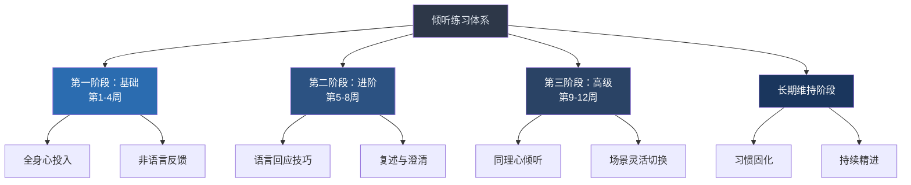

# 第五节 练习方法

> "我们重复做什么，就会成为什么。因此，卓越不是一种行为，而是一种习惯。"——亚里士多德

了解了倾听的理论、技巧、案例和误区之后，最关键的一步就是——**练习**。就像学游泳不能只看书、学钢琴不能只听曲一样，倾听能力的提升必须通过持续、有结构的实际操作来实现。

本节提供一套基于行为科学的完整练习体系，从水平诊断到12周系统训练，再到长期维持。按照这套方法练习，你将在3个月内经历从"刻意模仿"到"自然而然"的转变。

***

## 一、练习的科学基础

在开始练习之前，先理解为什么"每天练习一点点"比"集中突击"有效得多。这不是鸡汤，而是有坚实的科学依据。

### 1.1 刻意练习理论

心理学家安德斯·埃里克森（Anders Ericsson）通过对小提琴手、国际象棋大师、运动员等顶尖高手的研究，提出了**刻意练习（Deliberate Practice）**理论。核心发现是：卓越表现不是天赋决定的，而是由高质量的练习积累而成。

刻意练习有四个关键要素：

| 要素 | 含义 | 在倾听练习中的体现 |
|------|------|-------------------|
| **明确目标** | 每次练习聚焦一个具体技能 | 本周只练"复述"，不贪多 |
| **即时反馈** | 练习后立刻知道自己哪里做得好/不好 | 对方告诉你"你听懂了"或"你说偏了" |
| **舒适区边缘** | 难度比当前水平稍高一点 | 不是练最难的同理心倾听，而是练"比昨天多坚持1分钟不插嘴" |
| **高度专注** | 练习时全神贯注，而非无意识重复 | 每次对话有意识地运用一个技巧，而非心不在焉地"听" |

倾听练习的设计严格遵循这四个要素。每周的练习都有明确聚焦点，每个任务都设计了反馈机制，难度循序渐进。

### 1.2 神经可塑性与习惯回路

神经科学研究表明，大脑具有**可塑性（Neuroplasticity）**——重复的行为会强化相应的神经通路。当你反复练习"克制插嘴冲动"时，前额叶皮层（负责冲动控制）和颞叶（负责语言理解）之间的神经连接会变得更高效。

习惯的形成遵循"提示→行为→奖赏"的回路：

- **提示**：对方开始说话
- **行为**：你放下手机、看着对方、保持倾听
- **奖赏**：对方表情放松、对话更深入、关系更亲密

当你持续重复这个回路，倾听行为会逐渐自动化——从"我要刻意做"变成"我自然就这样做"。研究表明，一个中等复杂度的新习惯平均需要**66天**才能自动化（伦敦大学学院Phillippa Lally研究），这正是12周计划的科学依据。

### 1.3 为什么"知道"不等于"做到"

心理学上有一个概念叫**"知识的诅咒"（The Curse of Knowledge）**：当你学会一个概念后，很难想象不会它是什么感觉。读完前几节，你可能觉得"倾听不就是不打断、给回应嘛，我懂了"。但在实际对话中，你很可能会回到旧模式——因为旧的神经通路更强大。

改变行为需要的不是更多的知识，而是**反复的、有意识的练习**，直到新的神经通路比旧的更强。

***

## 二、练习的五条原则

### 原则一：一次只练一个技巧

不要试图同时练习所有技巧。认知心理学中的**"注意力资源有限理论"**告诉我们，同时关注太多目标会导致每个目标都做不好。

**正确做法**：每周选择1-2个技巧作为重点。比如这周只练"3分钟不插嘴"，等它变成自然习惯后（通常需要2周），再练习"眼神接触"。

**错误做法**：同时练习"不插嘴+眼神接触+复述+情感反映"——你会手忙脚乱，最后哪个都练不好，还会产生挫败感。

### 原则二：从安全的关系开始

**不要一开始就挑战高难度场景**。先从你最信任、最放松的关系开始练习——伴侣、好友、家人。原因有二：

1. **犯错成本低**：在安全关系中，即使你做得不够好，对方也更容易包容
2. **反馈更真实**：亲密的人更愿意告诉你"你刚才走神了"，而同事或客户不会

**练习关系的推荐顺序**：
1. 伴侣或最亲密的朋友（最安全）
2. 家人（较安全，但可能有历史包袱）
3. 普通朋友（中等难度）
4. 同事（中高难度）
5. 领导/客户/陌生人（最高难度）

### 原则三：小步迭代，比昨天好一点

每次练习后，花1-2分钟回顾："我今天哪个地方做得好？哪个地方可以改进？"不需要追求完美，只要**比昨天好一点**就够了。

行为科学家BJ Fogg提出的"微习惯"理论指出：最容易坚持的习惯是那些**小到不可能失败**的行为。与其设定"每天都要做到完美倾听"这种宏大目标，不如设定"今天至少有1次对话全程放下手机"这样的微小目标。

### 原则四：接受并拥抱不适感

改变习惯一定会带来不适感。当你克制自己不插嘴时，你会觉得很难受；当你尝试同理心倾听时，你可能会觉得"这太刻意了、太假了"。**这是完全正常的**。

就像健身时肌肉会酸痛一样，不适感说明你的"倾听肌肉"在生长。研究表明，不适感通常在4-6周后显著减轻——当新的行为模式开始自动化时。

### 原则五：主动寻求并善用反馈

**不要等到别人主动给你反馈**——大多数人不会。你要主动问：

- "你觉得我今天有没有在认真听你说话？"
- "有没有什么地方让你觉得不舒服？"
- "如果满分10分，你给我的倾听打几分？为什么？"

真实的人际反馈是最好的改进指南。它比自我评估更客观，因为它来自你倾听的对象。

***

## 三、自我评估：你的倾听水平在哪里？

在开始系统练习之前，先做一个自我诊断，了解自己的起点在哪里。这能帮助你选择合适的练习难度，也有利于后续评估进步。

### 3.1 倾听水平自测问卷

请对以下15个陈述进行评分（1=完全不符合，5=完全符合）：

**基础层（专注力）**：
1. 对方说话时，我能保持3分钟以上不想别的事情
2. 对方说话时，我不会去看手机
3. 我能在对话中保持眼神接触
4. 对方说完后，我能大致复述对方说了什么
5. 我能注意到自己什么时候走神了

**进阶层（回应力）**：
6. 我会用"嗯""然后呢"等回应鼓励对方继续说
7. 我会复述对方的关键观点来确认理解
8. 我会在不确定时主动提问澄清
9. 我能区分对方说的"事实"和"感受"
10. 我的回应能让对方感觉到"被听到了"

**高级层（共情力）**：
11. 我能准确识别对方当下的情绪
12. 我能在回应中反映对方的情绪
13. 我能在不同意对方观点时仍然不评判地倾听
14. 我能在对方情绪激动时保持冷静和专注
15. 对方经常主动找我倾诉或寻求建议

**评分解读**：

| 总分区间 | 水平 | 建议起步阶段 |
|---------|------|------------|
| 15-30分 | 入门 | 从第一阶段（基础）开始，放慢节奏 |
| 31-45分 | 初级 | 从第一阶段开始，正常节奏 |
| 46-55分 | 中级 | 可以从第二阶段（进阶）开始 |
| 56-65分 | 中高级 | 可以从第三阶段（高级）开始 |
| 66-75分 | 高级 | 直接进入综合运用和长期维持 |

### 3.2 定位自己的薄弱环节

除了总分，更关键的是看每个层面的得分分布：

- **基础层得分低于15分**：你的核心问题是专注力。从"放下手机""不插嘴"开始练起
- **进阶层得分低于15分**：你的核心问题是回应技巧。重点练复述、澄清和情感回应
- **高级层得分低于15分**：你的核心问题是共情能力。重点练情绪识别和搁置评判
- **如果三个层面得分都低**：从基础层开始，不要跳级

### 3.3 12周后的复测

在第12周结束时，重新做一次自测问卷，对比前后分数。这是最直观的进步衡量方式。

***

## 四、每日练习任务

每日练习设计为每天10-15分钟，融入日常对话即可完成。每两周为一个练习单元，聚焦一个核心技巧。

### 4.1 第一阶段：基础能力（第1-4周）

这一阶段的核心目标是**训练注意力**——让你能够在对话中真正"在场"。

#### 第1-2周：全身心投入

**核心练习**：

**任务A：放下手机练习**
- 每天至少有1次面对面的对话，全程将手机放入口袋或翻面朝下
- 不看一眼，包括"我就瞄一眼时间"也不行
- 目标：从物理上消除最大的注意力干扰源
- 达标标准：连续3天做到"每次对话都放下手机"即为过关

**任务B：3分钟不插嘴练习**
- 每天至少有1次对话，对方说话时保持3分钟不插嘴
- 允许使用的回应：点头、"嗯"、"我明白了"、"继续说"
- 不允许：提出建议、分享自己的类似经历、纠正对方
- 进阶：从3分钟逐步延长到5分钟、10分钟
- 达标标准：能自然地做到5分钟不插嘴即为过关

**任务C：对话后即时回忆**
- 每次对话结束后，在心里默想：对方刚才说了哪些要点？
- 如果发现想不起来，说明你走神了——下次对话时更加注意
- 这个练习不需要额外时间，对话结束后30秒即可完成

**具体场景示例**：

| 场景 | 怎么练 | 预期困难 | 应对策略 |
|------|--------|---------|---------|
| 同事午饭闲聊 | 放下手机，全程看着对方，只用"嗯""然后呢"回应 | 对方说的无聊想插嘴转移话题 | 提醒自己"现在在练3分钟不插嘴" |
| 伴侣晚上聊天 | 放下手机，坐近一点，用点头和"嗯"鼓励对方 | 忍不住想给建议 | 提醒自己"现在只听，不解决" |
| 朋友电话倾诉 | 找个安静地方，关掉电脑/电视，只听 | 觉得话题和自己无关想走神 | 在心里默默复述对方的话 |

#### 第3-4周：眼神与肢体

**核心练习**：

**任务A：眼神接触练习**
- 每天至少有1次对话，保持60%-70%的时间看着对方的眼睛
- 使用"三角区轮换法"：在对方的左眼、右眼、嘴巴之间自然轮换，避免死盯
- 每隔5-7秒自然移开视线1-2秒（看向斜下方，不要看天花板或门外——这会传递"我想离开"的信号）
- 达标标准：能自然地保持60%以上的眼神接触，且不会让对方觉得你在"盯着看"

**任务B：身体语言练习**
- **前倾**：在对方说重要话题时，让身体微微前倾（约10-15度），传递"我在认真听"
- **开放姿态**：双臂不要交叉（交叉传递防御和封闭信号），双手自然放在桌上或腿上
- **镜像效应**：适度模仿对方的身体姿态（对方靠椅背你也靠，对方前倾你也前倾），这会潜意识传递"我跟你同步"
- 达标标准：能在对话中自然地保持开放姿态，且不再有意识地去"想该怎么做"

**任务C：表情匹配练习**
- 在对方表达情感时，有意识地让自己的表情与对方的情绪匹配
- 对方开心时微笑，对方难过时表情凝重，对方惊讶时也露出惊讶
- 不要夸张——自然的、适度的表情匹配即可
- 达标标准：对方说到开心的事情时，你能自然地微笑，而不是面无表情

**这一阶段常见的"不自然感"**：

刚开始练习眼神接触时，你可能会觉得"我在盯着人家看"或者"我该看哪里"。这是完全正常的。就像学开车时觉得"同时看后视镜和前方好难"，熟练后就自然了。给自己2周时间，不适感会逐渐消失。

***

### 4.2 第二阶段：进阶回应（第5-8周）

这一阶段的核心目标是**训练回应能力**——让你从"沉默的听众"变成"让对方愿意继续说的听众"。

#### 第5-6周：适时回应

**核心练习**：

**任务A：鼓励性回应练习**
在对话中，有意识地使用以下回应来鼓励对方继续说：

| 回应类型 | 示例 | 适用时机 |
|---------|------|---------|
| 简短确认 | "嗯""对""没错" | 对方在讲述一个长故事时，每30-60秒用一次 |
| 追问深入 | "然后呢？""后来怎么样了？" | 对方停顿但似乎还有话要说时 |
| 表达兴趣 | "真的吗？""这太有意思了" | 对方分享了意想不到的信息时 |
| 简单重复 | 对方："那天下了好大的雨" 你："好大的雨……" | 对方在描述一个场景时，重复关键词鼓励展开 |

**任务B：情感性回应练习**
每天至少有1次对话，使用情感性回应：

- "那确实不容易"
- "我能理解你的感受"
- "换做是我可能也会这样"
- "听起来你当时一定很（沮丧/开心/紧张）"

**情感性回应 vs 逻辑性回应的对比**：

| 对方说的话 | ❌ 逻辑性回应 | ✅ 情感性回应 |
|-----------|-------------|-------------|
| "加班到凌晨三点才回家" | "那你工作效率是不是可以提高一下？" | "三点才回家，真的太辛苦了" |
| "跟男朋友吵架了" | "因为什么吵的？" | "吵架的时候一定很难受" |
| "考试又没过" | "你是不是复习方法不对？" | "考了又没过，我能理解你的心情" |

**关键原则**：先回应情感，再处理事情。大多数时候，对方需要的不是解决方案，而是"被理解"。

**任务C：回应效果记录**
每天记录1-2次使用回应的情况：
- 我用了什么回应？
- 对方的反应是什么？（继续说了/沉默了/情绪变好了/情绪变差了）
- 这个回应效果好还是不好？为什么？

#### 第7-8周：复述与澄清

**核心练习**：

**任务A：复述练习**
每天至少使用1次复述技巧。复述的公式是：

**复述公式**："你的意思是____，对吗？"

或更简洁的版本：
- "所以你觉得____"
- "也就是说，____"
- "你是说____是吧？"

**复述的层次**：

| 层次 | 示例 | 效果 |
|------|------|------|
| 表面复述（照搬原话） | "你说你加班到凌晨三点" | 最基础，只能确认你听到了 |
| 概括复述（提炼要点） | "你最近工作压力很大" | 更好，说明你理解了核心意思 |
| 深层复述（理解意图） | "你希望领导能体谅一下你的付出" | 最好，说明你理解了对方真正想表达的 |

练习时从表面复述开始，逐步过渡到概括复述和深层复述。

**任务B：澄清练习**
每天至少使用1次澄清技巧。常用的澄清句式：

- "你说的____，具体是指什么？"
- "你提到的____，能举个例子吗？"
- "我想确认一下，你说的____和____是一回事吗？"
- "你刚才说的这部分我没太听明白，能再说一遍吗？"

**什么时候需要澄清**：
1. 对方使用了模糊的词（"他太过分了"——具体怎么过分？）
2. 对方的话有两种以上的理解方式
3. 对方的逻辑跳跃太大，你跟不上
4. 对方提到了你不知道的人、事、概念

**任务C：复述/澄清效果追踪**
记录每次复述/澄清的结果：
- 对方是确认了你的理解，还是纠正了？
- 如果纠正了，你的偏差在哪里？
- 这次澄清帮你理解了什么之前没理解的东西？

***

### 4.3 第三阶段：高级能力（第9-12周）

这一阶段的核心目标是**训练共情能力**——让你不仅听到对方说了什么，还能理解对方的感受和需要。

#### 第9-10周：同理心倾听

**核心练习**：

**任务A：情绪识别练习**
每天至少有1次对话，在心里进行"情绪扫描"：

- 观察对方的**面部表情**：眉头紧锁可能是焦虑或愤怒，嘴角下垂可能是悲伤
- 注意对方的**语调变化**：语速加快可能是紧张或兴奋，声音变低可能是沮丧或疲惫
- 留意对方的**用词选择**：用"没办法""算了"可能是无力感，用"凭什么""太不公平了"可能是愤怒
- 在心里默默标记："他现在应该是____的情绪"

**常见情绪的识别线索表**：

| 情绪 | 面部表情 | 语调特征 | 典型用词 |
|------|---------|---------|---------|
| 焦虑 | 眉头微皱、眼神闪烁 | 语速偏快、音调偏高 | "怎么办""万一""可是" |
| 沮丧 | 嘴角下垂、目光低沉 | 语速偏慢、音量偏低 | "算了""无所谓""没意思" |
| 愤怒 | 眉头紧皱、咬紧牙关 | 语速加快、音量增大 | "凭什么""太过分了""受不了" |
| 开心 | 眼角有笑纹、嘴角上扬 | 语调轻快、有起伏 | "真的太好了""哈哈" |
| 无助 | 目光呆滞、肩膀下垂 | 语气平淡、缺少变化 | "不知道""我也不知道该怎么办" |

**任务B：情感反映练习**
每天至少有1次对话，用语言回应对方的情绪。情感反映的公式是：

**情感反映公式**："你现在感到____，因为____"

或变体：
- "听起来你挺（委屈/生气/失望）的"
- "这件事让你觉得____"
- "我能感受到你对这件事的____"

**关键注意事项**：
- 如果你不确定对方的情绪，可以用试探性语气："你是不是有点____？"
- 猜错情绪没关系——对方会纠正你，而这个纠正过程本身就是深化理解
- 不要一次回应太多情绪，每次聚焦1-2个核心情绪

**任务C：搁置评判练习**
当你发现自己在对对方的话做评判时（"他怎么能这样想""这也太傻了""我不同意"），立刻暂停，转而问自己：

- "他为什么会这样想？"
- "他经历了什么让他有这样的想法？"
- "如果我是他，我会怎么想？"

这个练习的核心不是让你同意对方，而是**先理解，再评判**——大多数时候，当你真正理解了对方之后，评判自然就消失了。

#### 第11-12周：综合运用与场景切换

**核心练习**：

**任务A：完整倾听流程练习**
每天至少有1次对话，完整运用整个倾听流程：

**任务B：不同场景的倾听策略切换练习**
刻意在不同场景中练习，感受不同场景下倾听策略的差异：

| 场景 | 核心策略 | 注意事项 |
|------|---------|---------|
| 伴侣倾诉情绪 | 重情感回应、轻解决方案 | 绝对不要说"你不要想太多" |
| 领导布置任务 | 重复述确认、记录要点 | 确认deadline和优先级 |
| 同事抱怨工作 | 先共情、再分析 | 不要传话，保持中立 |
| 朋友分享好消息 | 兴奋匹配、追问细节 | 不要急着转到自己的事 |
| 客户表达不满 | 先道歉、再澄清、后解决 | 不要急于辩解 |
| 孩子讲述学校的事 | 蹲下来平视、不评判、追问细节 | 不要急着给教育建议 |

**任务C：每日倾听日记**
每天花5分钟写一段倾听日记。不是流水账，而是聚焦于以下问题：

- 今天最有价值的一次倾听经历是什么？
- 我在那次倾听中用了哪些技巧？
- 对方的反应是什么？
- 我发现了什么新的倾听心得？
- 明天想尝试什么改进？

***

## 五、每周练习任务

每周任务设计为每周1-2次，每次30-60分钟，比每日任务更深入，需要更多的时间和精力投入。

### 任务一：倾听复盘（每周一次）

**时间**：每周日晚上，30分钟

**操作步骤**：
1. 回顾本周的所有重要对话（翻看聊天记录、日程表帮助回忆）
2. 选出最有价值的2-3次对话（好的和不好的各选一些）
3. 对每次对话进行深度分析：
   - 我当时处于哪个倾听层次？（听到/听懂/听到心声）
   - 我用了哪些技巧？效果如何？
   - 我有没有犯常见误区？（插嘴/急着给建议/评判）
   - 对方的反应如何？（继续说了/沉默了/感谢了/生气了）
   - 如果重来一次，我会怎么做？
4. 写下下周的改进重点（只写1-2个，不贪多）

**复盘模板**：

## 本周倾听复盘

### 对话一
- 时间：周____，____:____
- 对象：____
- 场景：____（工作/家庭/社交）
- 对方主要说了什么：____
- 我的倾听层次：□听到 □听懂 □听到心声
- 运用的技巧：____
- 犯的误区：□插嘴 □急着给建议 □评判 □走神 □其他：____
- 对方的反应：____
- 如果重来一次：____

### 对话二
（同上格式）

### 对话三
（同上格式）

### 本周总结
- 做得最好的地方：____
- 最需要改进的地方：____
- 下周练习重点：____（只写1-2个）

### 任务二：深度对话练习（每周一次）

**时间**：每周找一个合适的时间段，和伴侣/好友/家人进行一次30-45分钟的深度对话

**操作方法**：
1. 提前和对方商量好时间和主题（比如"我们这周六下午聊聊最近各自的感受"）
2. 轮流做倾听者和表达者，每人15-20分钟
3. 倾听者全程练习本章学习的技巧
4. 对话结束后，表达者给倾听者具体反馈

**深度对话的评分维度**：

| 维度 | 1-3分（待提升） | 4-6分（基本合格） | 7-10分（优秀） |
|------|---------------|-----------------|---------------|
| 专注度 | 频繁走神，看手机或发呆 | 偶尔走神但能拉回来 | 全程专注，眼神始终在对方身上 |
| 回应质量 | 敷衍回应或完全无关 | 基本准确但缺乏深度 | 准确、及时且能深化表达 |
| 情感共鸣 | 没有回应对方的情感 | 偶尔回应情感但不够准确 | 准确识别并回应情感 |
| 提问质量 | 没有提问或提问不当 | 有提问但不够深入 | 提问帮助对方更深入地表达 |
| 复述/澄清 | 完全没有 | 偶尔使用 | 自然且有效地使用 |
| 整体感受 | 不觉得被听到了 | 基本觉得被听到了 | 感到深深被理解 |

**反馈话术建议**（给扮演表达者的人参考）：
- "你做得最好的一点是____，因为这让我觉得____"
- "如果有一个建议的话，我希望你下次可以____"
- "今天这次对话，我的整体感受是____"

### 任务三：情境模拟练习（每周一次）

**时间**：每周选一个场景，花15-20分钟进行模拟练习

**操作方法**：
1. 从下面的场景库中选择一个场景
2. 找一个伙伴练习（如果没有伙伴，对着镜子自己模拟双方对话）
3. 分别扮演说话者和倾听者
4. 模拟结束后，讨论感受和改进方向
5. 交换角色再进行一次

**场景库（建议轮换使用）**：

**日常情感类**：
- 伴侣下班回来抱怨工作中的不公
- 朋友深夜打电话倾诉感情问题
- 父母反复唠叨同一件事（催婚/催生/生活习惯）

**工作沟通类**：
- 领导布置了一个你觉得不合理的任务
- 客户对产品提出了强烈的投诉
- 同事在会议上提出了和你截然相反的意见
- 下属向你汇报一个项目出了严重问题

**敏感话题类**：
- 朋友告诉你他被诊断了某种疾病
- 孩子告诉你他在学校被欺负了
- 伴侣说"我们需要谈谈"

**模拟练习的评估清单**：
- [ ] 我有没有全程放下手机？
- [ ] 我有没有保持眼神接触？
- [ ] 我有没有在3分钟内不插嘴？
- [ ] 我有没有使用至少2种回应方式？
- [ ] 我有没有尝试复述对方的关键观点？
- [ ] 我有没有识别对方的情绪并做出回应？
- [ ] 对方（模拟者）觉得被理解了吗？

### 任务四：观察学习（每周一次）

**时间**：利用日常机会，每次10-15分钟

**操作方法**：
- 在会议、聚餐、公共场合中，观察别人是怎么倾听（或不倾听）的
- 重点关注2-3个人，记录以下内容：

**观察记录模板**：

## 倾听观察记录

- 日期：____
- 场景：____
- 观察对象（可以用化名）：____

### 好的倾听行为
- 行为：____
- 效果：____
- 我可以学习的地方：____

### 不好的倾听行为
- 行为：____
- 效果：____
- 我要避免的地方：____

### 对我的启发
____

### 任务五：复述挑战（每周一次）

**时间**：每周选一个对话，花5分钟进行复述挑战

**操作方法**：
1. 和对方对话结束后，立刻尝试用3句话概括对方的核心观点
2. 然后向对方确认："我理解的是____，对吗？"
3. 记录对方的反馈：完全正确/部分正确/理解偏了

这个练习能快速提升你的"抓取关键信息"能力。

***

## 六、独处练习——不需要对话场景的练习

不是所有练习都需要社交场景。以下练习可以单独完成，适合社交机会较少的日子。

### 6.1 正念冥想——训练注意力的稳定性

正念冥想能有效提升注意力的稳定性和情绪觉察能力，这是倾听的两大底层能力。

**入门练习：5分钟呼吸冥想**
1. 找一个安静的地方坐下，闭上眼睛
2. 将注意力集中在呼吸上——感受空气进入鼻腔、胸腔起伏、空气呼出
3. 当注意力走开时（它一定会走开），温和地把它拉回到呼吸上
4. 每次"走开→拉回"都是一次注意力肌肉的训练
5. 每天5分钟，逐步延长到10分钟、15分钟

**进阶练习：身体扫描**
1. 躺下或坐下，从脚趾开始，逐步将注意力移到头顶
2. 在每个部位停留10-20秒，感受那里有什么感觉
3. 如果某个部位有紧张感，想象呼吸到达那里，让它放松
4. 整个过程约15-20分钟

**为什么这对倾听有帮助**：正念冥想训练的是"元注意力"——觉察自己注意力状态的能力。当你在对话中走神时，能更快地意识到并拉回来。

### 6.2 播客/有声书精听

选择一个30分钟的播客或有声书章节，进行"结构化精听"：

**第一遍：完整听**
- 不做笔记，不做别的事情，专注地听
- 听完后闭上眼睛，回忆主要内容

**第二遍：分析性听**
- 边听边记录：核心观点是什么？用了哪些论据？逻辑链是什么？
- 说话者的语气变化在哪里？为什么会有这些变化？
- 你同意哪些观点？不同意哪些？为什么？

**第三遍：评估性听**
- 总结出3个核心观点
- 识别说话者的情绪变化和表达技巧
- 提出2个你想进一步了解的问题

这个练习可以单独完成，不受社交场景限制，而且可以直接提升你在对话中的"信息抓取"能力。

### 6.3 情绪词汇扩展

情绪词汇越丰富，你在倾听时就越能准确识别和回应对方的情绪。如果你只能分辨"高兴/生气/难过"三种情绪，那你的共情能力也会被限制在这个水平。

**每天学习3-5个新的情绪词汇**，可以从以下分类入手：

**愤怒类**（由轻到重）：
- 不悦→恼火→气愤→愤慨→暴怒
- 窝火→憋屈→不忿→义愤填膺→怒不可遏

**悲伤类**（由轻到重）：
- 低落→惆怅→落寞→心酸→凄凉
- 哀伤→悲恸→撕心裂肺→肝肠寸断→万念俱灰

**恐惧类**（由轻到重）：
- 不安→忐忑→发慌→胆怯→惊恐
- 忧虑→惶恐→战战兢兢→心惊胆战→魂飞魄散

**快乐类**（由轻到重）：
- 舒心→欣喜→欣慰→满足→畅快
- 喜悦→欢欣鼓舞→心花怒放→欣喜若狂→喜极而泣

**复杂情绪**（混合型）：
- 五味杂陈、哭笑不得、又爱又恨、爱恨交织
- 如释重负、百感交集、啼笑皆非、喜忧参半

**练习方法**：
1. 每天从上面的分类中选5个词
2. 回忆一个自己或他人经历这种情绪的场景
3. 尝试用这个词描述那个场景中的人的感受
4. 在下次对话中有意识地使用这些词

### 6.4 倾听日记（无对话日版本）

如果你今天没有合适的对话场景，可以用以下方式代替：

## 倾听练习日记（无对话日）

### 今天看到/听到的一次倾听
- 场景：____（电视节目、地铁上、办公室、家庭聚餐等）
- 好的倾听表现：____
- 不好的倾听表现：____
- 我可以学习的地方：____

### 今天的情绪觉察
- 我今天主要的情绪是：____
- 触发这个情绪的事件：____
- 我当时是怎么回应自己情绪的：____
- 如果倾听别人遇到类似情绪，我会怎么回应：____

***

## 七、月度挑战——加速成长的催化剂

除了日常练习，每个月安排1次"月度挑战"——一个比日常练习难度更高的特殊练习。

### 月度挑战一：24小时"只听不说"

选一个周末的白天（约8小时），告诉你的家人/伴侣："今天我主要听你说，除非你问我的意见，否则我不主动给建议。"

**目标**：体验"纯倾听"是什么感觉，观察不给建议时对话会发生什么变化。

**预期发现**：
- 大多数时候，对方其实不需要你的建议
- 当你不急着给建议时，对方反而会说得更深入
- 你会更清楚地感知到对方的情绪

### 月度挑战二：记录"倾听改变对话走向"的时刻

在一个月内，记录3次你因为"认真倾听"而改变了对话走向的经历。

**记录要素**：
- 如果我没有认真听，对话可能会怎样？
- 因为我认真听了，实际发生了什么？
- 这让我对倾听有了什么新的理解？

### 月度挑战三：教别人倾听

"教是最好的学"。在这个月里，找一个机会把你学到的倾听技巧教给别人——可以是朋友、家人、同事。

在教的过程中，你会发现自己对哪些技巧理解得最深，哪些还有模糊的地方。

### 月度挑战四：录音回听（高阶）

如果你有足够的勇气，录下一段自己参与的对话（需征得对方同意），然后回听：

- 我打断了对方几次？
- 我有多少次回应是"嗯""啊"的敷衍？
- 我有没有在对方还没说完时就急着回应？
- 我的语气是怎样的？有没有显得不耐烦？

回听自己的对话录音是最直接、最残酷、也是最有效的自我评估方式。

***

## 八、克服练习中的常见困难

### 困难一：觉得太刻意、不自然

**原因分析**：任何新技能在开始阶段都会觉得刻意。就像学开车时"手忙脚乱、全身僵硬"，熟练后就变成了"不用想就知道怎么做"。这在心理学上叫做**"意识无能→意识有能→无意识有能"**的学习阶段。

**应对策略**：
1. **接纳不适**：告诉自己"刻意是通往自然的必经之路"
2. **降低强度**：如果全天练习让你觉得太累，就只在1-2次对话中刻意练习
3. **给自己时间**：大多数人在4-6周后会明显感觉"不那么刻意了"
4. **回顾进步**：每周回顾练习日记，看到自己的进步会增强信心

### 困难二：忍不住插嘴

**原因分析**：插嘴是一个长期形成的习惯，而且往往是出于热情（"我也想分享！"）或焦虑（"如果不说就忘了"），而非不尊重。

**应对策略**：

| 方法 | 操作 | 原理 |
|------|------|------|
| "听"字提醒 | 在手心写一个"听"字，想插嘴时看一眼 | 视觉提醒打断冲动 |
| 3秒规则 | 想插嘴时，在心里默数1-2-3，3秒后再决定 | 给冲动一个"冷却期" |
| 备忘录法 | 把想说的话快速记在手机备忘录里，等对方说完再看 | 外化记忆，减轻"怕忘了"的焦虑 |
| 呼吸法 | 想插嘴时，深吸一口气，缓缓呼出，再决定是否要说 | 生理层面降低冲动强度 |
| 角色反转 | 想象你是对方，正在倾诉时被打断——你什么感受？ | 激发同理心抑制冲动 |

**进阶提示**：当你能做到"想插嘴但忍住了"时，恭喜你——你的前额叶皮层正在变强。

### 困难三：对方觉得你"变了"

**原因分析**：当你突然开始使用倾听技巧时，熟悉你的人可能会觉得"你今天怎么怪怪的""你是不是有什么事瞒着我"。这是因为他们习惯了你以前的沟通模式。

**应对策略**：
1. 不需要大张旗鼓地宣布"我在学倾听"——这反而会让对方觉得你在"表演"
2. 如果对方问起，可以坦然说"我在学做一个更好的倾听者"
3. 通常2-3周后，对方就会适应你新的沟通方式
4. 如果对方明确表示不喜欢，可以适当减少练习强度，但不要完全放弃

### 困难四：练习后觉得很累

**原因分析**：倾听确实需要消耗注意力和精力，尤其是同理心倾听。这在心理学上叫做**"共情疲劳"（Compassion Fatigue）**——长期高强度的共情会消耗心理资源。

**应对策略**：
1. **分级投入**：不是每次对话都要"全力以赴"。日常闲聊用50%的精力，重要的深度对话用100%
2. **及时充电**：练习后给自己一些独处时间——散步、听音乐、冥想
3. **设置边界**：每天的深度倾听不超过2-3次，避免过度消耗
4. **等待自动化**：随着技巧的熟练，消耗的精力会显著减少——就像学骑自行车，刚开始很费力，后来就不用想了

### 困难五：感觉没有进步

**原因分析**：倾听能力的提升是渐进的，不会像"学了一首新歌"那样立竿见影。这在心理学上叫做**"渐进线效应"**——前期进步快，后期进步越来越慢但仍在发生。

**应对策略**：
1. **坚持记录**：回顾练习日记时，你会发现"两周前我还在纠结3分钟不插嘴，现在已经能自然保持10分钟了"
2. **寻求外部反馈**：有时候别人比你更容易察觉你的变化。主动问对方"和一个月前相比，你觉得我们的对话有什么不同？"
3. **做前后对比**：在第12周结束时重新做自测问卷，对比分数
4. **关注微小变化**：不是只有"大的飞跃"才叫进步——"这次我比上次少插嘴了一次"也是进步

### 困难六：倒退和平台期

**原因分析**：在习惯养成过程中，进步不是线性的。你会经历"进步→平台期→再进步→倒退→再进步"的螺旋上升过程。这是正常的。

**应对策略**：

- **平台期**：不要焦虑，继续练习。平台期往往是大脑在"巩固"之前的练习
- **倒退期**：在压力大、睡眠不足、情绪低落时，倾听能力会暂时下降——这是正常的，不要因此否定之前的进步
- **突破期**：突破往往发生在你"不再刻意去想技巧"的时刻——这说明新的行为模式已经开始自动化

***

## 九、进度跟踪系统

### 9.1 12周总进度表

| 周次 | 日期范围 | 练习重点 | 每日任务完成（7天） | 每周任务完成 | 自评分数 |
|------|---------|---------|------------------|------------|---------|
| 第1周 | ____/____~____/____ | 全身心投入 | □□□□□□□ | □□ | ____/10 |
| 第2周 | ____/____~____/____ | 全身心投入 | □□□□□□□ | □□ | ____/10 |
| 第3周 | ____/____~____/____ | 眼神与肢体 | □□□□□□□ | □□ | ____/10 |
| 第4周 | ____/____~____/____ | 眼神与肢体 | □□□□□□□ | □□ | ____/10 |
| 第5周 | ____/____~____/____ | 适时回应 | □□□□□□□ | □□ | ____/10 |
| 第6周 | ____/____~____/____ | 适时回应 | □□□□□□□ | □□ | ____/10 |
| 第7周 | ____/____~____/____ | 复述与澄清 | □□□□□□□ | □□ | ____/10 |
| 第8周 | ____/____~____/____ | 复述与澄清 | □□□□□□□ | □□ | ____/10 |
| 第9周 | ____/____~____/____ | 同理心倾听 | □□□□□□□ | □□ | ____/10 |
| 第10周 | ____/____~____/____ | 同理心倾听 | □□□□□□□ | □□ | ____/10 |
| 第11周 | ____/____~____/____ | 综合运用 | □□□□□□□ | □□ | ____/10 |
| 第12周 | ____/____~____/____ | 综合运用 | □□□□□□□ | □□ | ____/10 |

### 9.2 每日记录模板

# 倾听练习日记

## 日期：____年____月____日（星期____）

### 今日练习重点：____

### 练习记录

#### 对话一
- 时间：____
- 对象：____
- 场景：____
- 我练习了什么技巧：____
- 对方的反应：____
- 自评（1-10分）：____

#### 对话二
- 时间：____
- 对象：____
- 场景：____
- 我练习了什么技巧：____
- 对方的反应：____
- 自评（1-10分）：____

### 今日反思
- 今天做得最好的一次倾听：____
- 今天最需要改进的地方：____
- 明天想尝试的改进：____

### 9.3 阶段性评估标准

**基础阶段（第1-4周）达标标准**：
- [ ] 能在对话中放下手机，不看一眼（连续5天做到）
- [ ] 能保持5分钟不打断对方
- [ ] 能在走神后30秒内意识到并拉回注意力
- [ ] 能保持60%以上的眼神接触
- [ ] 对方反馈"感觉你在认真听"

**进阶阶段（第5-8周）达标标准**：
- [ ] 能在对话中自然地使用3种以上回应方式
- [ ] 能每天至少使用1次复述技巧
- [ ] 能每天至少使用1次澄清技巧
- [ ] 能区分事实和感受
- [ ] 对方反馈"你真的听懂了我说的"

**高级阶段（第9-12周）达标标准**：
- [ ] 能在对话中准确识别对方的情绪（连续10次识别正确7次以上）
- [ ] 能自然地使用情感反映
- [ ] 能在冲动时搁置评判（至少能做到5秒延迟）
- [ ] 能在不同场景中灵活切换倾听策略
- [ ] 对方反馈"和你聊天感觉被理解了"

### 9.4 长期追踪指标

12周系统训练结束后，进入长期维持阶段。每月进行一次自我评估：

| 指标 | 衡量方法 | 目标值 |
|------|---------|-------|
| 对话中的走神频率 | 每次对话后自我统计 | 每次对话≤1次 |
| 主动使用倾听技巧的次数 | 每日记录 | 每天≥3次 |
| 他人主动倾诉的频率 | 观察记录 | 比练习前增加50%以上 |
| 复述准确率 | 记录对方确认vs纠正的比例 | 确认率≥70% |
| 情绪识别准确率 | 记录自己判断vs对方确认 | 准确率≥60% |

***

## 十、长期维持——12周之后怎么办

12周系统训练结束后，你已经建立了基本的倾听习惯。但习惯需要维护，否则会逐渐退化。以下是长期维持的策略。

### 10.1 从刻意练习到日常习惯

当倾听技巧开始自动化后，你不再需要每天做"练习"——它已经融入了你的日常沟通中。但仍需要定期"体检"：

- **每周**：花5分钟回顾本周的倾听表现，有没有退化的地方
- **每月**：做一次完整的倾听复盘（用前面的复盘模板）
- **每季度**：重新做一次自测问卷，对比分数

### 10.2 应对退化信号

当你发现自己出现以下信号时，说明倾听习惯在退化，需要重新加强练习：

- 对话中走神的频率增加了
- 又开始频繁插嘴
- 对方又开始说"你没有在听我说"
- 你又开始急着给建议而不是先理解
- 你又开始评判对方而不是先共情

**退化应对方案**：回到第一阶段的基础练习（放下手机、3分钟不插嘴），练习1-2周即可恢复。

### 10.3 持续精进的方向

当你已经是一个不错的倾听者后，可以探索以下进阶方向：

1. **跨文化倾听**：不同文化背景下，倾听的表达方式不同。有些文化中沉默是尊重，有些文化中沉默是尴尬
2. **高冲突场景倾听**：在激烈争论中保持倾听能力——这是最高难度的倾听
3. **群体倾听**：在多人会议中同时追踪多个发言者的观点
4. **远程倾听**：电话/视频会议中的倾听技巧，缺少视觉线索时如何捕捉情绪
5. **自我倾听**：学会倾听自己的内心——识别自己的情绪、需求和边界

***

## 十一、推荐的辅助资源

### 11.1 书籍

| 书名 | 作者 | 推荐理由 |
|------|------|---------|
| 《非暴力沟通》 | 马歇尔·卢森堡 | 倾听的底层逻辑——同理心和不评判 |
| 《关键对话》 | 科里·帕特森等 | 高风险对话中的倾听策略 |
| 《倾听的力量》 | 马克·郭士顿 | 专门讲倾听技巧的实用指南 |
| 《习惯的力量》 | 查尔斯·杜希格 | 理解习惯回路，帮助你坚持练习 |
| 《被讨厌的勇气》 | 岸见一郎 | 理解"课题分离"，帮助搁置评判 |

### 11.2 应用工具

| 工具 | 用途 | 推荐选项 |
|------|------|---------|
| 日记应用 | 记录每日练习 | Day One、Daylio、备忘录 |
| 冥想应用 | 正念练习 | 潮汐、小睡眠、Headspace |
| 计时器 | 3分钟不插嘴练习 | 手机自带计时器 |
| 录音工具 | 录音回听练习 | 手机自带录音机（需征得对方同意） |

### 11.3 播客推荐

选择以下类型的播客进行精听练习：
- 访谈类播客：观察主持人如何引导和倾听嘉宾
- 心理类播客：学习情绪表达和共情的方式
- 故事类播客：训练"不打断地听完一个完整故事"的能力

***

## 本节小结

本节提供了一套完整的倾听练习体系，涵盖从入门到精通的全部路径：

1. **科学基础**：刻意练习理论、神经可塑性、习惯回路——理解"为什么这样做有效"
2. **五条原则**：一次一个技巧、安全关系起步、小步迭代、接受不适、寻求反馈
3. **自我评估**：15道自测问卷帮你定位起点和薄弱环节
4. **每日练习**：12周循序渐进，从基础的"全身心投入"到高级的"综合运用"
5. **每周练习**：倾听复盘、深度对话、情境模拟、观察学习、复述挑战
6. **独处练习**：正念冥想、播客精听、情绪词汇扩展
7. **月度挑战**：24小时只听不说、录音回听、教别人倾听
8. **困难应对**：针对6种常见困难提供了具体对策
9. **进度跟踪**：总进度表、每日模板、阶段评估、长期追踪指标
10. **长期维持**：退化信号识别、持续精进方向

> 🎯 **行动号召**：不要等到"准备好了"再开始。就从今天的下一次对话开始——放下手机，看着对方的眼睛，认真听他说的每一句话。这就是你成为优秀倾听者的第一步。现在就做自测问卷，找到你的起点，然后开始第一周的练习。
