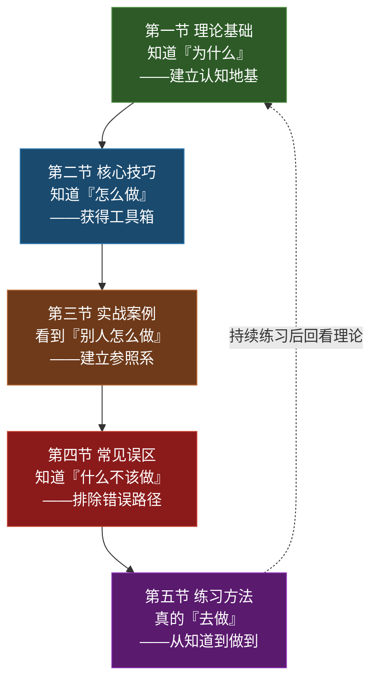

# 第六节 本章小结

> "当你真正学会倾听，你会发现世界比你想象的更丰富，人心比你以为的更柔软。"

本节不是对前五节的简单重复，而是一次**系统性的知识整合**。我们将把分散在各节中的理论、技巧、案例、误区和练习方法编织成一张完整的知识网络，帮你建立对"倾听"这个能力的全景认知，并提供可直接使用的速查工具。

---

## 一、知识全景图：五节内容如何构成一个完整体系

本章五节内容并非并列关系，而是一个层层递进的能力构建体系。理解这个结构，比记住每个知识点更重要。

**为什么要先学理论？** 因为没有理论支撑的技巧是空中楼阁。当你理解了工作记忆的容量限制（7±2个信息块），你才会真正重视"一次只练一个技巧"这条原则；当你理解了注意力的波动周期（约15-20分钟一个周期），你才会在长对话中主动安排"倾听休息"。

**为什么要看案例？** 因为技巧是抽象的，案例是具体的。"复述"这个技巧在教科书上只是一句话，但在"伴侣争吵"的案例中，你看到的是"当对方愤怒时，复述的语气、节奏、措辞都需要调整"——这种情境化的知识，只有案例能给你。

**为什么要学误区？** 因为**避开误区比学习技巧更紧迫**。你学会了100个技巧，但犯了一个致命误区（比如在对方最脆弱时给建议），之前的努力就全白费了。行为科学的研究表明：人类对"损失"的敏感度是"收益"的2倍（Kahneman前景理论），同理，一个错误的倾听行为造成的伤害，需要至少五次正确的倾听才能修复。

---

## 二、核心概念速查表

以下是本章所有关键概念的一张表，可作为日常练习的速查卡。

### 2.1 倾听的五个层次

| 层次 | 名称 | 典型表现 | 对方感受 | 适用场景 |
|------|------|----------|----------|----------|
| 第一层 | 听而不闻 | 完全心不在焉，眼神游离 | "我像空气一样" | ——（应完全避免） |
| 第二层 | 虚应故事 | 嘴上"嗯嗯啊啊"，脑子在别处 | "他在敷衍我" | ——（应完全避免） |
| 第三层 | 选择性倾听 | 只听自己感兴趣的部分 | "他只听他想听的" | 信息筛选（如新闻浏览） |
| 第四层 | 专注倾听 | 全神贯注，不遗漏内容 | "他在认真听我说" | 工作汇报、指令接收 |
| 第五层 | 同理心倾听 | 不仅听内容，更感知情感 | "他真的理解我" | 深度沟通、亲密关系 |

**核心判断标准**：你在对话中处于哪个层次，不是由你自己定义的，而是由对方的感受定义的。问自己："如果我是对方，我会觉得自己被认真倾听了 吗？"

### 2.2 四大类核心技巧

| 类别 | 核心目标 | 关键技巧 | 一句话总结 |
|------|----------|----------|-----------|
| 主动倾听技巧 | 让对方"感到被听" | 眼神接触、肢体语言、适时回应、保持沉默、管理干扰 | 身体在场，注意力在场 |
| 同理心倾听技巧 | 让对方"感到被理解" | 区分事实与情感、识别情绪标签、搁置评判、进入对方视角、回应情感需求 | 先听心，再听事 |
| 反馈式倾听技巧 | 验证理解的准确性 | 复述、澄清、总结、提问、情感反映 | 确认"我听到的"等于"你想说的" |
| 记录与总结技巧 | 保存和整理关键信息 | 结构化笔记、关键词提取、事后整理 | 记住该记的，忘掉该忘的 |

### 2.3 十大误区速查

| 编号 | 误区名称 | 一句话危害 | 纠正口诀 |
|------|----------|-----------|----------|
| 1 | 急于给建议 | 对方要的是理解，不是方案 | "先问'你需要建议还是倾听'" |
| 2 | 打断对方 | 传递"我的话比你的重要" | "等3秒再开口" |
| 3 | 选择性倾听 | 对方觉得你只关心部分信息 | "听到不舒服的也要听完" |
| 4 | 虚假倾听 | 伪装的关注比不听更伤人 | "要么真听，要么诚实说现在听不了" |
| 5 | 用经历替代感受 | 把对方的痛苦变成你的故事 | "先回应他的感受，再分享你的经历" |
| 6 | 过早评判 | 关闭了对方继续表达的安全感 | "听完再判断，判断也别说出口" |
| 7 | 只听字面意思 | 错过真正的诉求和情感 | "听'话外之音'" |
| 8 | 安慰式否定 | "别难过了"= 你的感受不重要 | "允许对方难过，陪伴比安慰有力" |
| 9 | 提问代替倾听 | 连珠炮式提问像审讯 | "少问多听，等对方主动展开" |
| 10 | 只有形式没有温暖 | 技巧正确但感觉冰冷 | "真诚是技巧的灵魂" |

---

## 三、各节核心收获深度整合

### 3.1 理论基础的核心收获

**一句话总结**：倾听不是天赋，而是一种可以通过理解其机制来刻意提升的能力。

本节建立的三个核心认知：

1. **"听到"≠"倾听"**：听到是生理活动（声波→神经信号），倾听是包含接收、理解、评估、回应四个阶段的完整心理过程。这个区分看似简单，却是一切后续学习的起点——因为大多数人以为自己"会听"，其实只是"会听到"。

2. **倾听有层次之分**：从"听而不闻"到"同理心倾听"，五个层次代表五种不同的能力水平。大多数人日常停留在第二到第三层之间，而高质量的沟通需要至少第四层。认识到自己当前在哪一层，是提升的第一步。

3. **倾听失败有系统性原因**：工作记忆的容量限制（7±2个信息块）、注意力的选择性与波动性、认知偏见的干扰、情绪的调节作用、自我中心的本能倾向——这些不是"态度不端正"，而是人类认知系统的固有特征。理解这些，你才能设计出"顺应大脑"的倾听策略，而不是单纯靠意志力硬撑。

### 3.2 核心技巧的核心收获

**一句话总结**：技巧是工具，真诚是灵魂。所有技巧都建立在"我真的想理解你"这个基础之上。

本节建立的能力框架：

- **感知层**（主动倾听）：通过眼神接触、肢体语言、适时回应让对方"感到被听"。这是最低门槛的技巧，也是最容易被忽视的——很多人以为"我心里在听就行了"，但沟通是双通道的，你的身体语言传递的信息量占总信息量的55%（Mehrabian法则）。

- **理解层**（同理心倾听）：通过区分事实与情感、识别情绪标签、搁置评判让对方"感到被理解"。这是最核心也最难的技巧，因为搁置评判需要对抗人类"快速分类、快速判断"的本能。

- **验证层**（反馈式倾听）：通过复述、澄清、总结确认理解的准确性。这一层的作用是"校准"——你以为你听懂了，但只有说出来让对方确认，你才知道是不是真的听懂了。

- **记录层**（记录与总结）：在重要对话中保存关键信息。这一层容易被忽略，但在职场沟通中，"记住对方说过什么"本身就是一种强有力的倾听信号。

### 3.3 实战案例的核心收获

**一句话总结**：不同的场景需要不同的倾听策略，但有一条共同原则——先理解，再回应；先处理情绪，再处理事情。

八个场景揭示的关键规律：

| 场景 | 核心挑战 | 倾听策略重心 |
|------|----------|-------------|
| 朋友深夜倾诉 | 对方需要的是陪伴，不是解决方案 | 同理心倾听 > 一切 |
| 领导布置任务 | 信息密度高，容错率低 | 专注倾听 + 结构化记录 |
| 客户投诉 | 情绪激烈，需要先降级情绪 | 情绪接纳 + 复述确认 |
| 伴侣争吵 | 双方情绪都在高点 | 情感反映 + 搁置评判 |
| 同事会议发言 | 需要在理解基础上给出建设性反馈 | 倾听 + 有质量的回应 |
| 父母唠叨 | 背后是关心，但表达方式让人抗拒 | 听"话外之音" |
| 销售谈判 | 对方在试探、在隐藏、在博弈 | 深度提问 + 沉默 |
| 孩子犯错 | 需要在倾听中教育，而非训斥 | 先听孩子的视角 |

**最通用的两条原则**：
1. **先处理情绪，再处理事情**——适用于所有涉及情感的场景
2. **先理解，再回应**——适用于所有需要决策的场景

### 3.4 常见误区的核心收获

**一句话总结**：避开误区比学习技巧更紧迫。先做到"不犯错"，再追求"做得好"。

十大误区的共同根因：**认知时间差**。人类的思维速度（每分钟400-800个词）远快于说话速度（每分钟120-150个词），这段"空闲"会被自动填充——想回应、做判断、回忆类似经历、走神。所有误区都是大脑在"空闲时间"自动运行的结果。

**最致命的三个误区**（优先改正）：
1. **急于给建议**——出现频率最高，伤害最隐蔽
2. **安慰式否定**——"别难过了"看似温暖，实则否定了对方感受的正当性
3. **用经历替代感受**——"我也有过……"把话题从对方转向了自己

### 3.5 练习方法的核心收获

**一句话总结**：知道和做到之间，隔着1000次练习。

12周练习体系的设计逻辑：

| 阶段 | 周数 | 核心任务 | 训练目标 |
|------|------|----------|----------|
| 第一阶段（基础） | 第1-4周 | 全身心投入 + 非语言反馈 | 建立"在场感"，让对方感到被听 |
| 第二阶段（进阶） | 第5-8周 | 语言回应技巧 + 复述与澄清 | 建立"理解感"，让对方感到被懂 |
| 第三阶段（高级） | 第9-12周 | 同理心倾听 + 场景灵活切换 | 建立"连接感"，在任何场景灵活运用 |
| 长期维持 | 第13周起 | 习惯固化 + 持续精进 | 让倾听成为本能 |

**每天投入**：10-15分钟有意识的练习。不要等到"准备好了"再开始，就从今天的下一次对话开始。

---

## 四、倾听能力自评清单

在进入第三章之前，用以下清单评估自己当前的倾听水平。诚实回答每个问题（1-5分，1=从不，5=总是）。

### 4.1 基础感知能力

| 编号 | 自评问题 | 得分 |
|------|----------|------|
| 1 | 别人说话时，我能放下手机/停止手头的事 | ___/5 |
| 2 | 我能保持适当的眼神接触（不盯着看，也不回避） | ___/5 |
| 3 | 我的肢体语言传递出"我在听"的信号（点头、前倾等） | ___/5 |
| 4 | 我能在对话中保持至少30秒不插嘴 | ___/5 |
| 5 | 我能在对话中保持至少2分钟不插嘴 | ___/5 |

### 4.2 理解与反馈能力

| 编号 | 自评问题 | 得分 |
|------|----------|------|
| 6 | 我能区分对方话语中的"事实"和"情感" | ___/5 |
| 7 | 我会用复述来确认自己的理解（"你是说……对吗？"） | ___/5 |
| 8 | 我能在对方说完后总结关键信息 | ___/5 |
| 9 | 我能识别对方没有直接说出口的感受 | ___/5 |
| 10 | 我的提问是为了理解，而不是为了引导 | ___/5 |

### 4.3 同理心与态度

| 编号 | 自评问题 | 得分 |
|------|----------|------|
| 11 | 即使不同意对方的观点，我也能听完再回应 | ___/5 |
| 12 | 我能在情绪激动的对话中保持冷静倾听 | ___/5 |
| 13 | 我不会因为对方的表达方式（啰嗦、混乱）而失去耐心 | ___/5 |
| 14 | 我不会用自己的经历来"覆盖"对方的感受 | ___/5 |
| 15 | 我真的"想"理解对方，而不只是"不得不听" | ___/5 |

**评分解读**：

| 总分区间 | 水平定位 | 建议行动 |
|----------|----------|----------|
| 15-30分 | 初学者 | 从第一阶段（第1-4周）开始，重点练习"在场感" |
| 31-45分 | 进阶者 | 从第二阶段（第5-8周）开始，重点练习复述和情感反映 |
| 46-60分 | 熟练者 | 从第三阶段（第9-12周）开始，重点练习同理心和场景切换 |
| 61-75分 | 高手 | 进入长期维持阶段，挑战更复杂的倾听场景 |

---

## 五、全章核心公式

将本章的知识浓缩为三个核心公式，便于记忆和应用：

### 公式一：倾听质量公式

**倾听质量 = 在场度 × 理解度 × 回应度**

- **在场度**（身体和注意力是否在场）——由主动倾听技巧决定
- **理解度**（是否真正理解了对方的意思和情感）——由同理心倾听和反馈式倾听决定
- **回应度**（回应是否让对方感到被理解）——由所有技巧共同决定

三个因素是乘法关系，任何一项为零，整体为零。你的眼神再温柔（在场度高），但如果不理解对方在说什么（理解度为零），对方也不会觉得你真的在听。

### 公式二：倾听失误公式

**倾听失误 = 认知空闲 × 本能冲动**

- 认知空闲 = 思维速度 - 说话速度（大约有3倍的"空闲"时间）
- 本能冲动 = 想表达、想评判、想帮忙、想保护自己

减少失误的两条路径：**减少空闲**（用复述、记录填充空闲时间）和**抑制冲动**（建立"等3秒"的反应延迟）。

### 公式三：倾听成长公式

**倾听能力 = 正确的理论认知 × 有效的技巧 × 持续的刻意练习**

三个因素仍然是乘法关系。只有理论没有练习是纸上谈兵；只有练习没有理论是盲目重复；只有技巧没有真诚是话术表演。

---

## 六、关键术语表

| 术语 | 英文 | 定义 | 出现章节 |
|------|------|------|----------|
| 主动倾听 | Active Listening | 有意识地关注、理解并回应对方的完整过程 | 第一节 |
| 同理心倾听 | Empathic Listening | 不仅理解对方的话语内容，更感知对方的情感状态 | 第一、二节 |
| 工作记忆 | Working Memory | 短暂存储和处理信息的认知系统，容量约7±2个信息块 | 第一节 |
| 认知偏见 | Cognitive Bias | 影响信息处理的系统性思维偏差 | 第一节 |
| Mehrabian法则 | Mehrabian's Rule | 情感沟通中55%信息通过肢体、38%通过语调、7%通过文字传递 | 第二节 |
| 情绪标签 | Emotion Label | 用具体的词语命名对方的情绪状态 | 第二节 |
| 情感反映 | Reflection of Feeling | 将对方的情感用自己的语言表达出来，以确认理解 | 第二节 |
| 复述 | Paraphrasing | 用自己的话重述对方表达的内容 | 第二节 |
| 澄清 | Clarifying | 通过提问确认模糊或不确定的信息 | 第二节 |
| 刻意练习 | Deliberate Practice | 有明确目标、即时反馈、舒适区边缘、高度专注的练习方式 | 第五节 |
| 神经可塑性 | Neuroplasticity | 大脑通过重复行为强化相应神经通路的能力 | 第五节 |

---

## 七、常见问题解答

### Q1：我已经知道这些技巧了，但实际对话中总是忘，怎么办？

**正常现象。** 这不是记忆力问题，而是旧的神经通路比新的更强。解决方案：一次只练一个技巧，连续练一周，直到它开始"自动化"。同时，可以在手机上设置每天的提醒："今天的对话中，专注练习'复述'这一个技巧。"66天后（伦敦大学学院研究的平均习惯形成周期），它就会变成你的默认行为。

### Q2：同理心倾听是不是意味着我要认同对方的所有观点？

**不是。** 同理心倾听的目标是"理解"，不是"认同"。你可以说"我理解你为什么这么想，虽然我的看法不完全一样"。关键区别在于：认同是"你说得对"，同理是"我懂你为什么这么想"。搁置评判不等于放弃立场，而是把判断推迟到理解完成之后。

### Q3：在职场中，对方一直在说废话，我也要"同理心倾听"吗？

**不必。** 倾听策略需要根据场景调整。职场沟通的核心是效率，此时应该使用"结构化倾听"——用"我理解你的核心观点是……对吗？"来引导对方聚焦，同时保持尊重。同理心倾听更适合情感浓度高的场景（倾诉、争吵、求助），不适合纯信息传递的场景。

### Q4：练习倾听时，如果对方发现我在"刻意"听，会不会觉得假？

**取决于你的方式。** 如果你像机器人一样僵硬地执行"点头、复述、眼神接触"的流程，确实会显得假。诀窍是：不要"表演倾听"，而是"真正想理解对方"。当你内心真的好奇"他在想什么？他为什么这么感受？"时，你的技巧就会自然地服务于真诚，而不是反过来。技巧是骨骼，真诚是血肉。

### Q5：沉默要保持多久才合适？太长会不会尴尬？

**沉默的"合适时长"因场景而异：**
- 日常对话：2-3秒的沉默足够传递"我在认真想你说的话"
- 深度倾诉：5-10秒的沉默可以给对方安全的空间去感受和组织语言
- 情绪激烈时：3-5秒的沉默可以给对方情绪降温的时间
- 商务谈判：适时的沉默可以制造压力，让对方主动补充信息

如果担心尴尬，可以用非语言信号（点头、目光柔和、身体前倾）填充沉默，让对方知道"我还在，我在想你说的话"。

### Q6：我在倾听时，内心总是忍不住评判对方，怎么克服？

**评判是人类大脑的本能，不可能完全消除。** 你需要做的不是"消灭评判"，而是"推迟评判"。方法：当内心出现评判念头时，在心里对自己说"这个想法我先记下，等他说完再想"。把评判当作一个可以稍后处理的"待办事项"，而不是必须立即执行的指令。随着练习次数增加，这个"推迟"的能力会越来越强。

---

## 八、全章金句集锦

以下是本章最有力量的10句话，建议收藏，在练习过程中反复回顾：

1. **"倾听不是被动地等待对方说完，而是一个需要全身心投入的主动过程。"** ——提醒你：倾听是一项技能，需要主动付出努力。

2. **"'听到'是生理层面的，'听懂'是认知和情感层面的。"** ——提醒你：不要把"听到了"等同于"听懂了"。

3. **"倾听的目的是理解，不是回应。"** ——提醒你：在对方说完之前，你的任务是理解，不是准备回应。

4. **"情绪先于内容——先听感受，再听事实。"** ——提醒你：人在情绪激动时，无法接收任何理性信息。

5. **"沉默是最有力的倾听工具之一。"** ——提醒你：有时候，什么都不说比说什么都有力。

6. **"身体比语言更诚实——55%的信息通过肢体传递。"** ——提醒你：你的身体语言暴露了你是否真的在听。

7. **"在回应之前，先问自己：我是真的在理解对方，还是在急于表达自己？"** ——提醒你：90%的倾听失败，都是从这里开始的。

8. **"好的倾听者是最好的沟通者。"** ——提醒你：沟通能力的根基不在"说"，而在"听"。

9. **"先处理情绪，再处理事情。"** ——提醒你：这条原则适用于所有沟通场景。

10. **"知道和做到之间，隔着1000次练习。"** ——提醒你：不要等到"准备好了"再开始，就从现在开始。

---

## 九、推荐延伸阅读

如果你想在"倾听"这个主题上继续深入，以下资源值得一读：

| 书名 | 作者 | 核心价值 | 推荐理由 |
|------|------|----------|----------|
| 《非暴力沟通》 | Marshall B. Rosenberg | 倾听感受和需求 | 同理心倾听的"圣经"级著作 |
| 《倾听的力量》 | Bernard T. Ferrari | 职场中的战略性倾听 | 用医生的诊断思维来倾听 |
| 《关键对话》 | Patterson 等 | 高压场景下的倾听策略 | 对话风险越高，倾听越重要 |
| 《高难度谈话》 | Douglas Stone 等 | 困难对话中的三层倾听 | 帮你穿透情绪看到真实诉求 |
| 《你就是孩子最好的玩具》 | Kim John Payne | 亲子场景的倾听方法 | 用倾听替代说教和惩罚 |

---

## 十、下一章预告

在下一章——**第三章：表达的艺术**中，我们将从"听"转向"说"。

如果说倾听是沟通的"输入"，那么表达就是沟通的"输出"。你可能有过这样的经历：心里明明想得很清楚，但说出来就变了味；明明是好意，但说出来就伤了人；明明准备得很充分，但一开口就紧张得语无伦次。

第三章将帮你解决这些问题。我们将学习：

- **如何清晰表达**：让你的话一听就懂，不用猜
- **如何有逻辑地表达**：让你的表达有条理、有层次、有说服力
- **如何得体表达**：让你在不同场合说合适的话
- **如何有感染力地表达**：让你的话打动人心

你会学到金字塔原理、PREP表达法、STAR法则等实用工具，以及在演讲、汇报、谈判、社交等不同场景中的表达策略。

如果说第二章让你成为了一个"好的倾听者"，那么第三章将让你成为一个"好的表达者"。两者结合，你的沟通能力将实现质的飞跃。

> 💡 **学习建议**：在进入第三章之前，建议你花至少一周的时间来练习本章的倾听技巧。因为在学习表达之前，先建立良好的倾听习惯，会让你在学习表达时更加游刃有余——因为好的表达者，首先是一个好的倾听者。用本节第四部分的自评清单给自己打分，确定你的练习起点，然后按照第五节的12周计划开始行动。

---

*第二章完*
