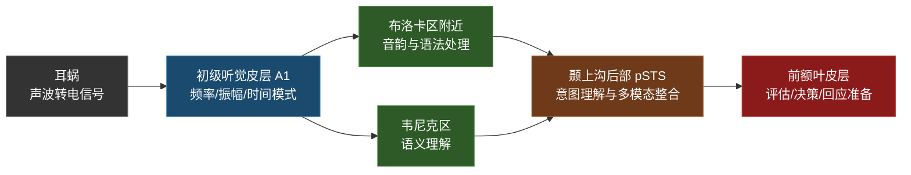
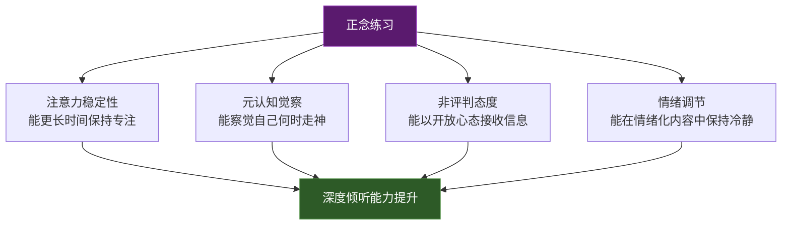
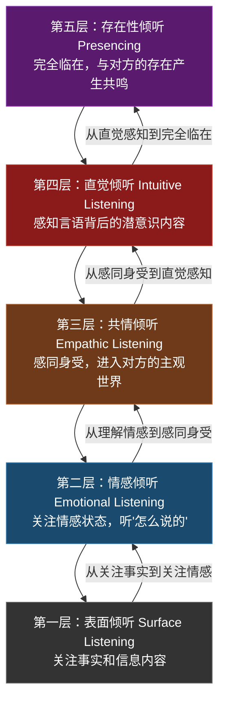
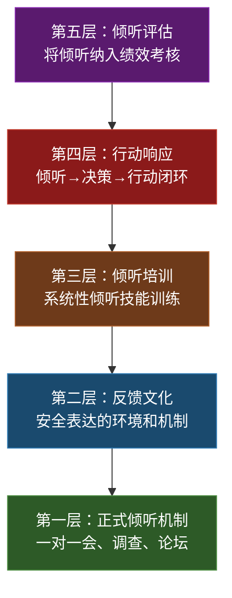
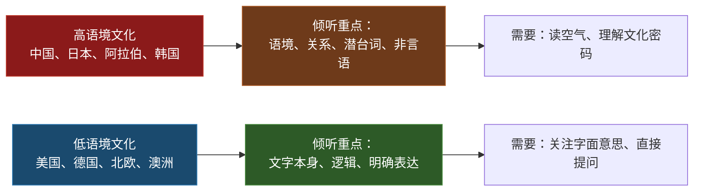
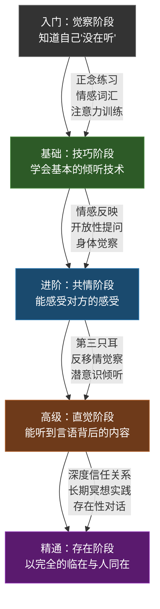

# 倾听的艺术：深度拓展

## 引言

倾听看似被动，实则是沟通中最为主动、最为复杂的行为之一。前面的章节已经为你搭建了倾听的基本框架——理论基础、核心技巧、实战案例、常见误区和练习方法。本章的任务是将这个框架推向纵深：从神经科学的微观机制到跨文化的宏观视野，从临床心理学的专业技术到数字时代的全新挑战，从领导力的战略高度到亲密关系的日常实践，全方位、多层次地解构倾听的本质。

这些前沿领域的研究成果，不仅揭示了倾听的深层机制，也为我们提升倾听能力提供了科学依据和实践方法。读完本章，你将拥有一张完整的"倾听知识地图"，能够根据自身需求找到最适合的提升路径。

```mermaid
graph TD
    A["本章知识地图"] --> B["神经科学基础<br/>——理解倾听的生理机制"]
    A --> C["冥想与倾听<br/>——训练内在觉察力"]
    A --> D["临床倾听技术<br/>——专业治疗中的倾听"]
    A --> E["同理心倾听层次<br/>——从表层到存在性倾听"]
    A --> F["领导力中的倾听<br/>——组织中的倾听策略"]
    A --> G["跨文化倾听<br/>——文化差异与适应"]
    A --> H["数字时代挑战<br/>——技术环境中的倾听"]
    A --> I["教育与医疗倾听<br/>——专业场景的倾听"]
    A --> J["倾听能力评估<br/>——自我诊断与行动计划"]

    style A fill:#1a4a6e,stroke:#2d7ab3,color:#fff
    style B fill:#2d5a27,stroke:#4a8c3f,color:#fff
    style C fill:#2d5a27,stroke:#4a8c3f,color:#fff
    style D fill:#6e3a1a,stroke:#b3622d,color:#fff
    style E fill:#6e3a1a,stroke:#b3622d,color:#fff
    style F fill:#5a1a6e,stroke:#8c2db3,color:#fff
    style G fill:#5a1a6e,stroke:#8c2db3,color:#fff
    style H fill:#8b1a1a,stroke:#c0392b,color:#fff
    style I fill:#8b1a1a,stroke:#c0392b,color:#fff
    style J fill:#1a4a6e,stroke:#2d7ab3,color:#fff
```

---

## 一、主动倾听的神经科学基础

理解倾听的神经机制，不是为了让你成为神经科学家，而是为了让你明白：倾听时大脑里真正在发生什么？为什么某些倾听行为特别有效，而另一些总是失败？科学解释能让你对自己的倾听习惯产生全新的认识，从而更有针对性地改进。

### 1.1 倾听时的大脑活动模式

当我们真正倾听他人说话时，大脑并不是简单地接收声波信号，而是在进行一系列复杂的神经处理。神经影像学研究揭示了倾听过程中大脑的多重活动模式。

**听觉皮层的层级处理**

听觉信息从耳蜗传入大脑后，首先在初级听觉皮层（A1）进行基本的声音特征分析，包括频率、振幅和时间模式。随后，信息被传递到更高级的听觉区域进行更复杂的处理：

- **布洛卡区附近区域**：负责语音的音韵分析和语法处理。当你听到一句话能自动识别语法结构，就是这个区域在工作。
- **韦尼克区**：负责语义理解和语言意义的提取。这是你"听懂意思"的核心区域。
- **颞上沟后部（pSTS）**：整合听觉和视觉信息，特别是在理解说话者的意图时。这也是为什么视频通话中你总觉得"哪里不对"——pSTS接收到的视觉信息不完整。

**"鸡尾酒会效应"的神经机制**

在嘈杂的环境中，我们仍然能够集中注意力倾听某个特定的说话者，这种现象被称为"鸡尾酒会效应"（Cherry, 1953）。研究表明，这种选择性注意涉及前额叶皮层对听觉皮层的自上而下的调控。当我们选择关注某个声音时，前额叶皮层会增强与目标声音相关的神经活动，同时抑制与背景噪音相关的活动。

**实际意义**：这就是为什么在嘈杂的咖啡馆里你能跟上对面人的对话，但如果你同时在手机上刷社交媒体，前额叶的调控资源被分流，你就会"听而不闻"。鸡尾酒会效应有上限——当认知资源被多任务消耗殆尽时，选择性注意就会崩溃。

### 1.2 倾听中的神经同步

**脑间同步（Neural Synchrony）**

近年来的研究发现了一个令人兴奋的现象：当两个人进行有效沟通时，他们的大脑活动会趋于同步。这种"脑间同步"（inter-brain synchrony）或"神经耦合"（neural coupling）现象表明，有效的倾听不仅仅是接收信息，更是与说话者的大脑活动产生共振。

普林斯顿大学的尤里·哈森（Uri Hasson）教授的研究团队通过功能性磁共振成像（fMRI）发现了以下规律：

1. **时间领先效应**：说话者的大脑活动模式可以在时间上"领先"于倾听者的大脑活动约1-3秒。说话者先在大脑中组织信息，然后才通过语言传递出去。
2. **同步追赶**：有效的倾听者的大脑活动会逐渐"追上"说话者的模式，实现时间上的同步。这种追赶速度越快，说明倾听者的理解能力越强。
3. **同步程度与理解度正相关**：这种同步程度越高，倾听者对说话者信息的理解程度越好。当倾听者走神或心不在焉时，这种同步会立即瓦解。
4. **区域特异性**：不同类型的信息（感觉信息、情感信息、语义信息）在不同脑区实现同步。情感信息的同步区域与语义信息不同，这解释了为什么你可能"听懂了字面意思"但完全"没听懂对方的感受"。

**实践启示**：脑间同步研究证实了一个直觉经验——当你真正"在"的时候，对方能感觉到。反过来，当你心不在焉时，即使你在点头说"嗯嗯"，对方的大脑也能"检测"到同步断裂。这不是玄学，是有神经科学证据的。

**催产素与倾听质量**

催产素（oxytocin）是一种与社会联结和信任相关的神经激素。研究表明，催产素水平的提高可以增强个体的倾听能力和共情反应。在亲密的对话中，催产素的释放可以促进双方的神经同步，从而提升沟通的质量和深度。

催产素的释放受到以下因素的影响：

| 促进催产素释放的因素 | 抑制催产素释放的因素 |
|---|---|
| 眼神接触 | 压力和焦虑 |
| 安全的环境 | 被评判的感觉 |
| 肢体接触（如握手、拥抱） | 时间压力 |
| 温和的语调 | 对抗性氛围 |
| 共同的经历 | 陌生环境 |
| 被理解的感受 | 信任缺失 |

这意味着，创造一个安全、温暖的对话环境不仅仅是一种"礼仪"，它有直接的神经化学基础——你创造的环境越安全，双方大脑释放的催产素越多，倾听质量就越高。

### 1.3 镜像神经系统在倾听中的作用

**运动模拟与语言理解**

当我们倾听他人说话时，我们大脑中的运动相关区域也会激活——即使我们自己并没有在说话。这种现象表明，我们在倾听时会"默默地模拟"说话者的发音动作，这有助于我们更准确地理解语音。这解释了为什么在电话里听不太清楚时，你会不自觉地做嘴型——你的镜像神经元在试图"帮助"你理解。

**情感镜像**

在倾听带有情感色彩的内容时，镜像神经系统不仅帮助我们理解说话者说了什么，还帮助我们"感受"到说话者的情感状态。当我们听到朋友描述悲伤的经历时，我们大脑中与悲伤相关的区域也会部分激活，这种神经层面的"共鸣"是共情倾听的基础。

**镜像神经元的两面性**：镜像神经元是共情的神经基础，但它也有副作用。当你看到一个人打哈欠时，你也会想打哈欠——这就是镜像神经元的自动模仿效应。在倾听中，这意味着如果你长期倾听一个焦虑的人说话，你的身体也会开始产生焦虑反应（情绪感染）。这就是为什么帮助性职业的从业者需要学习"有界限的共情"。

### 1.4 倾听障碍的神经基础

理解倾听障碍的神经基础，不是为了给任何人贴标签，而是为了理解：有些倾听困难不是"态度问题"或"不够努力"，而是有生理基础的。这种理解能帮助我们对他人多一分耐心，对自己多一分慈悲。

**听觉处理障碍（APD）**

有些人虽然听力正常，但在处理听觉信息时存在困难，这种情况被称为听觉处理障碍（Auditory Processing Disorder, APD）。APD的核心特征是：耳朵听到了声音，但大脑在"翻译"这些声音时出了问题。具体表现包括：

- 在嘈杂环境中无法有效分离目标声音和背景噪音
- 难以跟随快速的语音，特别是在电话里
- 对相似的音素（如"ba"和"da"）辨别困难
- 难以记住听到的信息，尤其是长序列的信息
- 对声音方向的定位能力差

APD影响约5%-7%的儿童和2%-3%的成人。如果你发现自己在嘈杂环境中总是"听不清"别人说什么，但安静环境中完全正常，可能值得做一次APD评估。

**注意力缺陷与倾听**

注意力缺陷多动障碍（ADHD）常常影响个体的倾听能力。研究表明，ADHD患者在选择性注意和持续注意方面存在困难，这使得他们在长时间的对话中难以保持专注的倾听状态。ADHD的倾听困难不是因为"不想听"，而是因为大脑的执行功能系统（负责维持注意力、过滤干扰的系统）运作方式不同。

ADHD影响倾听的三个核心机制：

1. **注意力切换过快**：大脑自动被更新鲜的刺激吸引，导致对话中的注意力像"跳蚤"一样四处跳跃
2. **工作记忆容量受限**：刚听到的信息很快被新的信息"挤出"工作记忆，导致听到后面忘了前面
3. **情绪调节困难**：强烈的即时反应（如不同意、兴奋、无聊）会立刻打断倾听过程

**实用策略**：如果你或你的对话伙伴有ADHD，以下策略可以改善倾听质量——用手写笔记辅助工作记忆；对话时间控制在20分钟以内，中间休息；用视觉辅助（白板、图表）补充听觉通道；选择安静、少干扰的环境进行重要对话。

**自闭症谱系与倾听**

自闭症谱系障碍（ASD）个体在社交倾听方面面临独特挑战。研究表明，ASD个体在理解他人的语调变化、识别讽刺和反语、以及理解非字面意义的语言方面存在困难。这些困难并非源于听觉处理本身，而是源于社交认知和心理理论能力的差异。

需要强调的是，ASD个体的倾听困难是"不同"而非"更差"——他们可能非常擅长捕捉细节和逻辑一致性，但在解读社交潜台词方面需要更多明确的信息。在与ASD个体沟通时，更直接、更明确的表达方式比暗示和隐喻更有效。

---

## 二、倾听与冥想的关系

冥想和倾听看似是两个不同的领域，但它们共享同一个核心：注意力的管理。冥想训练你掌控注意力的能力，而倾听的质量直接取决于你对注意力的掌控程度。理解这种联系，你就找到了一条系统性提升倾听能力的路径。

### 2.1 正念冥想与倾听品质

**正念的基本概念**

正念（mindfulness）是一种以非判断、不反应的态度，将注意力有意识地集中于当下体验的心理状态。这个概念由乔·卡巴金（Jon Kabat-Zinn）引入西方医学界，并被大量实证研究证实对注意力、情绪调节和人际关系有显著的改善效果。

**正念如何改善倾听**

正念对倾听的改善是多层面的，涉及注意力、元认知、态度和情绪四个维度：

1. **注意力稳定性**：正念练习增强了我们维持注意力的能力，使我们能够在对话中更长时间地保持专注的倾听状态。威斯康星大学的研究发现，8周正念训练后，参与者的持续注意力测试成绩提升了约14%。在倾听中的直接体现是：你能更长时间地"待在"对方的话语中，而不是每隔30秒就飘走。

2. **元认知觉察**：正念培养了我们对自身思维过程的觉察能力。在倾听中，这意味着我们能够更及时地发现自己走神、评判或急于回应的倾向，并将注意力重新带回说话者身上。这种"发现自己走神"的能力，比"不走神"更重要——因为没有人能完全不走神，关键是你能否快速觉察并拉回来。

3. **非评判态度**：正念的核心之一是非评判的态度。在倾听中，这意味着我们能够以更开放的心态接收信息，而不是过早地进行评判或分类。当你听到一个与你观点不同的意见时，非评判的态度让你能够先完整地接收和理解它，再决定是否同意。

4. **情绪调节**：正念练习提升了我们调节情绪的能力，使我们在倾听情绪化的内容时能够保持冷静和开放。当你听到让你不舒服的话时，正念让你能在"听到"和"反应"之间创造一个空间——在这个空间里，你可以选择如何回应，而不是被情绪劫持。

### 2.2 聆听冥想的实践方法

**慈悲聆听冥想（完整版）**

慈悲聆听冥想（Compassionate Listening）是一种专门为提升倾听能力而设计的冥想练习。以下是完整的20分钟练习流程：

**准备阶段（3分钟）**：以舒适的姿势坐下，双脚平放地面，双手自然放在膝盖上。闭上眼睛，通过三次深呼吸让身心平静下来。第一次呼气时释放身体的紧张，第二次呼气时释放心中的杂念，第三次呼气时让自己完全安住在当下。

**开放感官阶段（3分钟）**：有意识地打开听觉，开始接收周围环境中的各种声音——远处的车声、近处的空调声、风声、鸟鸣——而不加任何评判或分析。不要试图"听什么"，只是让声音自然地来到你耳边。注意声音的远近、高低、持续或间断，但不要给它们贴标签。

**专注人声阶段（5分钟）**：如果有人在说话（可以使用音频素材），将注意力集中到说话者的声音上。注意声音的节奏、语调、音色和情感色彩。注意声音中的呼吸间隙，注意说话者在哪些词语上加重语气，在哪些地方放慢速度。尝试"听"到文字背后的情感——这个声音是疲惫的、兴奋的、焦虑的还是平静的？

**放下评判阶段（5分钟）**：当评判性的想法出现时（如"我不同意"、"这不对"、"他怎么这么说"），温和地承认这些想法的存在，然后像看着云朵飘过天空一样，让它们自然地离开，将注意力重新带回到说话者的声音上。关键不是"不产生评判"，而是"不跟随评判"。

**身体觉察阶段（2分钟）**：将注意力从声音转向身体，注意倾听时身体的感受——是否有紧张、不舒服或共鸣的感觉？你的肩膀是放松的还是紧绷的？你的呼吸是平稳的还是急促的？不加判断地观察这些感受，它们是身体在告诉你倾听过程中的真实反应。

**扩展慈悲阶段（2分钟）**：想象从自己的心轮向说话者发送慈悲和理解的能量。你不需要同意对方说的一切，但你可以理解对方是一个和你一样有着恐惧、渴望、痛苦和喜悦的人。带着这种理解睁开眼睛。

**深度聆听练习**

深度聆听（Deep Listening）是由作曲家保罗·奥利弗罗斯（Pauline Oliveros）于1970年代发展出的一种聆听实践，强调对声音的全方位觉察。与普通的"听"不同，深度聆听要求你同时关注声音的物理属性、情感色彩和存在意义。其核心练习包括：

- **全球冥想（Sonic Meditation）**：想象自己的耳朵像卫星接收器一样，能够接收来自世界各地的声音。从近处开始（自己的呼吸声），逐渐扩展到房间、建筑、街道、城市、国家、地球。这个练习训练你扩展听觉的"焦距"——大多数时候，我们的听觉"镜头"对准了很小的范围，深度聆听要求你能够自由调节这个焦距。

- **深度聆听散步**：在自然环境中散步，专注于倾听所有层次的声音。不是"听到鸟叫"就结束了，而是去分辨有几种不同的鸟叫？它们的位置在哪里？声音的节奏是什么？它们之间有没有"对话"？这种练习培养你对声音细节的敏感度。

- **声音日记**：每天记录自己听到的最吸引人的声音，包括：这个声音是什么？它让你产生了什么感受？它唤起了什么记忆或联想？这个练习培养你对声音的反思习惯，让你从被动的"听到"转变为主动的"倾听"。

### 2.3 禅宗传统中的倾听智慧

**"初心"（Beginner's Mind）**

禅宗大师铃木俊隆在《禅者的初心》中提出的"初心"概念对倾听有着深刻的启示。初心意味着以初学者的心态去面对每一个倾听情境，放下已有的知识和偏见，以开放和好奇的态度去接收新的信息。

在实际的倾听中，我们常常会遇到这样的情况：当我们认为自己已经了解了某个话题时，我们就会停止真正的倾听，开始准备自己的回应。这种现象在心理学中被称为"知识的诅咒"（Curse of Knowledge）——一旦你知道了某件事，你就很难想象不知道它是什么感觉。初心的练习提醒我们，每一个说话者都可能带来我们未曾想到的视角和信息。

**"只管听"（Just Listening）**

类似于禅宗"只管打坐"（shikantaza）的修行，"只管听"强调的是一种不带目的、不求结果的倾听状态。在这种状态中，我们不是为了获取信息、做出判断或准备回应而倾听，而是纯粹地、完全地倾听。

这种倾听方式在日常生活中很难做到，因为我们习惯于"功能性"的倾听——听是为了回应、决策或行动。但练习"只管听"哪怕几分钟，可以让你体验到一种不同的倾听品质：你不再是一个"信息处理器"，而是一个"存在空间"——对方的话语在这个空间里得到完全的容纳。这种倾听状态往往能带来最深刻的理解和联结。

---

## 三、临床倾听技术

临床心理学和心理治疗领域发展出了世界上最精密的倾听技术。这些技术不仅适用于治疗情境，也可以被任何希望提升倾听能力的人所借鉴。本节将从多个治疗流派的视角，揭示"专业级倾听"的内在逻辑。

### 3.1 心理治疗中的倾听

**卡尔·罗杰斯的积极倾听**

人本主义心理学创始人卡尔·罗杰斯（Carl Rogers）认为，治疗师的倾听能力是治疗关系中最关键的因素之一。他提出了积极倾听（Active Listening）的核心要素：

1. **无条件积极关注**（Unconditional Positive Regard）：无条件地接纳和尊重来访者，不对其思想、情感或行为进行评判。这不是说你"同意"对方的一切，而是说你在"人"的层面上完全接纳对方。在日常倾听中，这意味着即使你不同意朋友的决定，你仍然尊重他作为一个人做出那个决定的权利。

2. **共情性理解**（Empathic Understanding）：努力从来访者的角度理解其体验，而不仅仅是从外部观察。罗杰斯区分了两种共情：初级共情（理解对方表达的内容和情感）和高级共情（理解对方表达中未明确说出但隐含的意义）。

3. **真诚一致**（Congruence）：治疗师在倾听时保持真诚，不伪装或掩饰自己的反应。这意味着如果你不理解，就说"我不太确定我理解了，能再解释一下吗？"而不是假装理解。

罗杰斯的研究表明，当治疗师展现出这些品质时，来访者更愿意开放地分享自己的感受和想法，治疗效果也会显著改善。他的经典名言精确地概括了这一发现："当一个人感到被真正理解时，他的眼睛会湿润——那是因为他第一次在另一个人身上看到了自己。"

**精神分析中的"均匀悬浮注意"**

弗洛伊德提出了"均匀悬浮注意"（gleichschwebende Aufmerksamkeit）的概念，描述了一种理想的治疗性倾听状态。在这种状态中，治疗师以均匀的方式关注来访者所说的一切内容，不预先选择关注什么或忽略什么。

这种倾听方式需要高度的训练，因为我们的大脑天生倾向于"选择性注意"——自动过滤掉它认为不重要的信息。弗洛伊德认为，那些看似"不重要"的细节——一个口误、一个突然的话题转换、一个不合逻辑的表述——往往藏着潜意识的关键线索。均匀悬浮注意要求你暂时悬置你的"重要性过滤器"，让一切信息以平等的权重进入你的意识。

**格式塔治疗中的觉察倾听**

格式塔治疗强调当下的觉察体验。在格式塔治疗的倾听中，治疗师不仅关注来访者所说的内容，还关注四个层面的信息：

- **言语内容**：对方说了什么？用了哪些具体的词语？
- **非言语信号**：对方的身体语言、微表情、手势、姿势在传达什么？
- **言语之外的信息**：对方没有说什么？哪些话题被回避了？哪些问题被忽略了？沉默中藏着什么？
- **治疗师自身的内在反应**：倾听时你自己的身体感受、情绪波动、联想和冲动是什么？这些是理解来访者的重要"数据"。

格式塔治疗师将第四层称为"身体反移情"——你的身体是理解对方的精密仪器。当你在倾听中突然感到胃部紧缩、肩膀紧张或想打哈欠，这些都是有意义的数据，值得探索。

### 3.2 危机干预中的倾听

**危机倾听的特殊要求**

在危机干预情境中，倾听具有特殊的重要性。处于危机状态的人往往感到极度的孤独和无助，而有效的倾听可以成为他们感受到支持和联结的关键途径。在许多自杀干预的案例中，挽救生命的不是什么"正确的话"，而是有人真正在听。

危机倾听的要点包括：

1. **安全性优先**：首先确保物理和情感的安全环境。如果对方处于危险中，倾听的首要目标是评估和确保安全，而不是"理解"。
2. **稳定化倾听**：使用平静、稳定的语调和节奏，帮助危机中的人稳定情绪。你自己的呼吸节奏和语速会直接影响对方的神经系统——这是镜像神经元的工作原理。
3. **不急于解决**：在危机初期，重点是倾听和陪伴，而不是急于提供解决方案。危机中的人首先需要的是"被听见"，而不是"被告知该怎么做"。
4. **验证感受**：充分验证和确认危机中的人所表达的情感，让他们感到被理解和接纳。说"你有这样的感受是可以理解的"比"别这么想"有效一万倍。
5. **评估风险**：在倾听过程中，专业人员需要评估自伤或伤人的风险。对于非专业人员，最重要的一点是：如果对方表达了自杀的想法，直接问"你是不是在想伤害自己？"——直接提问不会"植入"自杀的念头，反而会让对方感到被认真对待。

### 3.3 跨学科的临床倾听模型

**叙事治疗中的倾听**

叙事治疗（Narrative Therapy）将倾听视为帮助来访者重新构建生命故事的过程。叙事治疗师相信，人不是被"问题"定义的，而是被"故事"塑造的。在叙事治疗中，治疗师通过倾听来：

- **识别"独特结果"（Unique Outcomes）**：在来访者被问题主导的故事中，找到那些与问题叙事不一致的例外时刻。例如，一个说"我总是搞砸一切"的人，在讲述中提到了一次成功的经历——这就是独特结果。
- **发现被边缘化的替代故事**：每个人的生命中都有多个故事在同时发生，但通常只有一个"主流故事"被反复讲述和强化。治疗师通过倾听来发现那些被忽视的、替代性的故事线索。
- **帮助来访者发展更丰富的生命叙事**：通过外化对话（"焦虑什么时候控制了你？"而非"你为什么这么焦虑？"），帮助来访者与问题之间建立新的关系。

**认知行为治疗中的倾听**

在认知行为治疗（CBT）中，倾听不仅是建立治疗关系的手段，也是评估和干预的工具。治疗师通过仔细倾听来访者的叙述来：

- **识别自动化思维**：注意来访者语言中的"热点"词汇（如"总是"、"从不"、"必须"、"应该"），这些往往暴露了自动化思维和核心信念。
- **发现认知扭曲的模式**：全或非思维、灾难化、读心术、个人化——这些认知扭曲会在日常叙述中反复出现，治疗师需要在倾听中敏锐地捕捉。
- **评估情绪-认知-行为三角关系**：CBT的核心模型是"情境→想法→情绪→行为"的循环。治疗师通过倾听来访者的叙述来绘制这个循环，找到干预的切入点。
- **了解来访者的个人历史**：核心信念通常形成于童年，治疗师需要通过倾听来理解来访者的成长经历和早期经验。

**动机式访谈中的倾听**

动机式访谈（Motivational Interviewing, MI）是一种专门用于激发行为改变的沟通方法，其核心就是倾听。MI创始人William Miller和Stephen Rollnick提出了"OARS"倾听技术：

- **开放式提问（Open Questions）**：用"什么"、"如何"、"能否描述"来提问，而不是用"是不是"来封闭对话。
- **肯定（Affirmations）**：真诚地认可对方的努力、优势和价值——不是廉价的"你很棒"，而是具体地指出你观察到的品质。
- **反映式倾听（Reflective Listening）**：用你自己的语言重述对方表达的内容和情感，让对方感到被理解。
- **总结（Summarizing）**：在对话的节点处，将对方表达的主要内容串联起来，确认你的理解是否准确。

MI的实践证据表明，治疗师的倾听质量（以反映式倾听的使用频率和质量衡量）是预测来访者行为改变程度的最强因素之一。

---

## 四、同理心倾听的层次模型

同理心倾听不是一个"有或无"的状态，而是一个有层次的能力谱系。理解这些层次可以帮助你诊断自己目前的倾听水平，并找到下一步的提升方向。

### 4.1 同理心倾听的层级结构

**第一层：表面倾听（Surface Listening）**

在这一层级，倾听者主要关注说话者传达的事实和信息内容。关键词是"什么"——说了什么、发生了什么、结果是什么。这种倾听虽然能获取基本信息，但往往忽略了说话者的情感需求和深层意图。

表面倾听的典型表现：
- 听完后只记得事实，不记得对方的感受
- 回应方式是提供信息或建议
- 对话结束后对方可能觉得"他/她没真正听我说"

**第二层：情感倾听（Emotional Listening）**

在这一层级，倾听者开始关注说话者的情感状态。他们不仅听"说了什么"，还听"怎么说的"——注意语调、语速、音量的变化，以及非语言信号所传达的情感信息。关键词是"感受"。

情感倾听的典型表现：
- 能够识别对方的主要情绪
- 回应中包含对情感的反映（"听起来你很失望"）
- 对方开始感到"至少我的感受被注意到了"

**第三层：共情倾听（Empathic Listening）**

共情倾听要求倾听者不仅理解说话者的情感，还要能够"感同身受"——在某种程度上体验到说话者的感受。这种倾听需要倾听者放下自己的参照框架，进入说话者的主观世界。关键词是"我在你的位置上也能感受到"。

共情倾听的典型表现：
- 身体会产生与对方情感共振的反应（如对方焦虑时你也感到胸口发紧）
- 回应不是"我理解你的感受"（这仍然是旁观者视角），而是"如果我是你，我也会这样"
- 对方开始感到"这个人真的懂我"

**第四层：直觉倾听（Intuitive Listening）**

在这一层级，倾听者能够感知到说话者自己可能都没有意识到的内容——潜意识的动机、未表达的需求、隐藏的恐惧或渴望。这种倾听更多地依赖于直觉和身体感知，而非理性分析。关键词是"言语背后"。

直觉倾听的典型表现：
- 能够听到"话中有话"——对方没有直接说出来但暗示了的东西
- 能够感知到对方叙述中的不一致和矛盾
- 能够在对方的叙述中发现对方自己都没有注意到的模式

**第五层：存在性倾听（Presencing）**

这是最高层次的倾听，倾听者以完全开放和临在的状态与说话者在一起。在这种状态下，倾听者不仅是在听对方说话，更是在与对方的存在本身产生共鸣。关键词是"我在"。

存在性倾听的特征：
- 没有预设的议程，没有要解决的问题，没有要达成的目标
- 时间感改变——既不急也不拖，完全与对方的节奏同步
- 双方都感到一种深刻的联结和被理解
- 这种倾听往往发生在深度信任的关系中，能够带来深刻的转化体验

存在性倾听听起来很"玄"，但大多数人都体验过——在与最亲密的人的一次深夜长谈中，在生命重要时刻（生死、离别、重大决定）的对话中。它是人类最高质量的连接形式。

### 4.2 发展同理心倾听能力

**培养情感词汇**

丰富的内在情感词汇是发展同理心倾听的基础。当我们能够准确地识别和命名自己的情感时，我们也能更准确地识别和理解他人的情感。研究表明，能够区分50种以上情绪状态的人，在同理心测试中的得分显著高于只能区分5-10种的人。

**情感词汇扩展练习**：每天选择一个"基础情绪"（如悲伤、愤怒、恐惧、快乐、惊讶、厌恶），然后写出至少5个不同程度和类型的变体。例如：

| 基础情绪 | 微妙变体 |
|---|---|
| 悲伤 | 怅然、惆怅、哀伤、悲恸、心酸、落寞、黯然、凄凉、惋惜、失落 |
| 愤怒 | 恼怒、愤慨、烦躁、怨恨、暴怒、不满、气恼、激愤、窝火、憋屈 |
| 恐惧 | 不安、焦虑、紧张、惊慌、恐惧、畏惧、惶恐、心慌、胆怯、发怵 |
| 快乐 | 欣喜、愉悦、满足、欣慰、兴奋、舒畅、欢喜、畅快、惬意、陶醉 |

**练习"情感反映"**

情感反映（Reflection of Feelings）是一种基本的同理心倾听技术。其基本形式是用自己的语言重新表达说话者的情感。情感反映有三个层次：

- **初级反映**：直接命名情感。"听起来你感到失望。"
- **中级反映**：命名情感并加入原因。"因为项目被取消了，你感到很失望。"
- **高级反映**：命名复杂情感并捕捉矛盾。"你对这个结果似乎既有些释然，又带着一丝不甘——一方面你知道这是对的决定，另一方面你投入了那么多心血。"

**错误示范**：
- "你不应该这么想"（否定对方的情感）
- "我完全理解你的感受"（你不能完全理解，这种声称反而让对方感到不被理解）
- "别难过了"（情感是不能被"命令"消失的）
- "我也有过类似的经历"（把焦点转移到自己身上）

**发展身体觉察**

我们的身体往往是情感的第一反应场所。通过培养对身体感受的觉察能力，我们可以更敏锐地感知到自己在倾听过程中产生的情感共鸣。具体练习：

1. **身体扫描倾听**：在倾听他人时，每隔几分钟扫描一下自己的身体——肩膀是否紧绷？胃部是否收缩？呼吸是否变浅？这些身体反应是你的"情感天线"在告诉你正在接收什么。
2. **追踪身体反应**：当你注意到某个身体反应时，追溯它——"我什么时候开始感到胃部紧缩的？对方说到哪个话题时发生的？"这个练习帮你建立"身体-情感-对话内容"之间的连接。
3. **区分自己的和对方的情感**：长期练习后，你需要学会区分——这个情感是我自己的（因为我有过类似的经历），还是我在共情对方？这需要对自我有深入的了解。

**练习"第三只耳"**

精神分析师西奥多·赖克（Theodore Reik）提出了"第三只耳"（listening with the third ear）的概念，指的是倾听言语背后潜意识内容的能力。这是一种高级倾听技能，需要长期的训练和自我反思。培养这种能力需要：

- 学习基本的心理动力学知识——了解常见的防御机制（否认、投射、合理化、反向形成等）
- 关注说话者的防御模式——当对方突然变得理智化、转移话题、开玩笑或贬低某事时，这可能是防御机制在起作用
- 注意自己的反移情反应——你在倾听中突然感到无聊、愤怒、想拯救对方或想逃跑，这些"不合比例"的反应可能反映了对方无意识中在你身上"激活"的东西
- 对言语中的矛盾和不一致保持敏感——"我完全不生气"这句话说的时候咬牙切齿，这个不一致本身就是重要信息

### 4.3 同理心倾听的边界

**同理心疲劳**

长期进行深度同理心倾听可能导致同理心疲劳（empathic fatigue），特别是在帮助性职业中。同理心疲劳不同于普通的工作疲劳，它是一种特殊的"灵魂疲惫"——你感到自己被掏空了，好像你的情感资源已经耗尽。

识别同理心疲劳的信号：

| 阶段 | 信号 | 严重程度 |
|---|---|---|
| 早期 | 倾听后感到比以前更累 | 轻微 |
| 早期 | 开始对工作中的故事感到"麻木" | 轻微 |
| 中期 | 回家后不想跟任何人说话 | 中等 |
| 中期 | 开始回避需要深度倾听的场景 | 中等 |
| 中期 | 睡眠质量下降，容易做噩梦 | 中等 |
| 严重 | 情感完全麻木，对任何人的痛苦都没有反应 | 严重 |
| 严重 | 愤世嫉俗，觉得"没有人是真正值得帮助的" | 严重 |
| 严重 | 身体症状：慢性头痛、胃肠问题、免疫力下降 | 严重 |

**防止情绪感染**

同理心倾听需要区分"共情"和"情绪感染"：

- **共情**是理解他人的情感但保持自我的清晰边界。你像站在岸边看着水中的人——你能看到他、理解他的处境、知道水有多冷，但你没有跳进水里。
- **情绪感染**是被他人的情绪所淹没，失去自我与他人之间的界限。你跳进了水里，和他一起挣扎——这时你既帮不了他，也害了自己。

防止情绪感染的具体技术：

1. **脚踏大地**：倾听时感受双脚踩在地上的感觉，这是一种"接地"技术，帮你维持与现实的连接。
2. **呼吸锚定**：保持对自身呼吸的觉察——如果发现自己的呼吸开始跟随对方的节奏（变得急促或浅薄），有意地将自己的呼吸调整回平稳状态。
3. **设定心理界限**：在倾听前默念"我在这里是为了理解和支持，但我不是来替你承受这些的"。
4. **倾听后的清理仪式**：结束一段深度倾听后，做几次深呼吸，想象将不属于自己的情感能量"归还"给宇宙。这不是玄学，是一种帮助你切换状态的心理暗示。

**自我照顾策略**

为了维持可持续的深度倾听能力，需要建立系统性的自我照顾策略：

- **定期自我反思**：每周花15分钟回顾——这一周我倾听了哪些重要对话？倾听后我的感受是什么？我是否感到被消耗？
- **支持性同伴关系**：建立一个可以"互相倾听"的关系网络——你也需要被倾听。
- **身体维护**：运动、睡眠、饮食——这些看似与倾听无关，但它们直接决定了你的认知资源和情绪调节能力。
- **精力管理**：把深度倾听安排在你精力最充沛的时间段，避免在疲惫时进行重要对话。
- **定期充电**：独处、自然、艺术、音乐——找到那些能"重新填满你"的活动。

---

## 五、倾听在领导力中的作用

领导力的核心不是"说话"，而是"听"。这不是一句空洞的格言，而是有大量组织行为学研究支撑的结论。本节将从理论到实践，系统剖析倾听在领导力中的角色。

### 5.1 仆人式领导与倾听

**罗伯特·格林利夫的仆人式领导理论**

罗伯特·格林利夫（Robert K. Greenleaf）提出的仆人式领导（Servant Leadership）理论将倾听置于领导力的核心位置。仆人式领导者首先是一个仆人，他们的领导始于服务他人的愿望。而有效的服务始于深度的倾听。

仆人式领导中的倾听具有以下特征：

1. **优先倾听**：仆人式领导者将倾听置于说话之前，他们首先努力理解团队成员的需求、关切和想法。每次会议开始时，他们会花时间听团队成员的声音，而不是直接宣布议程。
2. **反思性倾听**：他们不仅倾听他人，还反思自己的倾听行为，不断改进自己的倾听品质。"我今天的倾听质量如何？"是他们经常自问的问题。
3. **包容性倾听**：他们有意识地倾听那些通常被忽视的声音——内向者、初级员工、少数群体——确保每个人的观点都被考虑到。
4. **前瞻性倾听**：他们倾听的不仅是当下的需求，还有未来的趋势和可能性。他们能在团队成员的困惑中看到创新的种子，在客户的抱怨中发现市场的机会。

### 5.2 变革型领导中的倾听

**变革型领导的四个维度与倾听**

詹姆斯·麦格雷戈·伯恩斯（James MacGregor Burns）和伯纳德·巴斯（Bernard Bass）提出的变革型领导理论包含四个维度，每个维度都与倾听密切相关：

| 维度 | 倾听的作用 | 实际表现 |
|---|---|---|
| 理想化影响 | 通过倾听了解追随者的价值观和理想，建立共鸣 | "你的理想是什么？什么对你来说最重要？" |
| 鼓舞性激励 | 通过倾听了解什么能够激励团队成员 | 识别每个人的核心驱动力（金钱、成长、认可、使命） |
| 智力激发 | 通过倾听了解团队成员的思考方式和创新想法 | 在看似"不成熟"的想法中发现闪光点 |
| 个性化关怀 | 通过倾听了解每个团队成员的独特需求和发展方向 | "你现在面临的最大挑战是什么？" |

### 5.3 沉默的力量

**战略性沉默**

在领导力中，沉默（Silence）是一种强大但常被忽视的倾听工具。大多数领导者说的太多、听的太少。战略性沉默可以在多种情境中发挥作用：

- **给予思考空间**：在问出重要问题后，保持沉默5-10秒可以给团队成员足够的思考时间，从而获得更有深度的回答。很多领导者在提问后立刻自己回答了——这不是提问，是自言自语。
- **传递尊重**：在他人分享时保持沉默（而不是立刻插话、评价或补充），传递出"你的观点很重要，我在认真听"的信号。
- **促进深度思考**：沉默可以帮助自己和他人进入更深层次的反思状态。Google的"沉默会议"实践表明，会议开始时的2分钟沉默可以显著提升讨论质量。
- **管理冲突**：在冲突情境中，适时的沉默可以降低紧张气氛，为理性对话创造空间。当双方都在气头上时，沉默比任何"冷静下来"的话语都有效。

**领导者倾听的四大障碍**

研究表明，领导者在倾听方面面临一些独特的挑战，每一种都有其神经科学和组织行为学的解释：

| 障碍 | 机制 | 应对策略 |
|---|---|---|
| 地位效应 | 权力增加导致前额叶对他人意见的处理降低（Boksem等, 2006） | 刻意安排"倾听日"，使用匿名反馈渠道 |
| 信息过滤 | 下属自动过滤掉"领导不想听"的信息 | 创造安全表达环境，主动询问"有没有我不知道的事" |
| 过度自信 | 成功经验导致"我什么都知道"的认知偏误 | 定期与行业外的人交流，保持初学者心态 |
| 时间压力 | 多重任务导致"没时间听" | 区分"紧急"和"重要"的对话，为重要对话预留专用时间 |

### 5.4 组织倾听文化

**建设倾听型组织**

一个真正重视倾听的组织会建立相应的制度和文化。以下是组织倾听文化的五个层次：

1. **正式倾听机制**：包括定期的一对一会议、员工调查、开放论坛、意见箱等。关键不只是"有"这些机制，而是员工真的在使用它们，并且看到了使用的结果。
2. **反馈文化**：鼓励自下而上的反馈，创造一个员工可以安全表达意见的环境。衡量标准是：一个初级员工提出与高管不同的意见，结果是被奖励还是被惩罚？
3. **倾听培训**：为管理者和员工提供系统性的倾听技能培训，而不只是"沟通技巧"中附带提到。
4. **倾听评估**：将倾听能力纳入领导力评估体系——360度反馈中，"善于倾听"应该是一个独立的评估维度。
5. **行动响应**：确保通过倾听获得的信息能够转化为实际行动，避免"只听不做"。"领导说会听我们的意见，然后什么都没变"比"领导根本不问"更具破坏力——前者不仅没有解决问题，还摧毁了信任。

**案例：Netflix的"360度倾听"实践**

Netflix建立了独特的组织倾听文化。他们的"360度反馈"不是年度事件，而是持续的过程。每位员工可以随时向任何同事（包括CEO）提供书面反馈，使用"开始做/停止做/继续做"的框架。领导者被要求对收到的反馈做出公开回应——不是辩解，而是认真考虑并说明会如何改变。这种制度化的倾听实践创造了一种"每个人的声音都重要"的文化。

---

## 六、跨文化倾听差异

在全球化的今天，跨文化倾听能力已经不再是"加分项"，而是"必需品"。理解文化如何塑造倾听行为，是避免误解、建立信任的前提。

### 6.1 文化对倾听行为的影响

**直接文化与间接文化**

在直接沟通文化（如德国、荷兰、以色列）中，人们期望倾听者能够直接回应，表达自己的观点。在这些文化中，过于含蓄的回应可能被理解为不诚实或缺乏兴趣。一个德国同事对你说"这个方案不行"，这不是无礼——这是他尊重你的方式（他认为你值得听到真话）。

在间接沟通文化（如日本、中国、泰国）中，倾听者通常会以更加含蓄、委婉的方式回应。在这些文化中，过多的直接反馈可能被视为不礼貌或具有攻击性。一个日本同事说"这个方案很有意思，我们可以再研究研究"，这可能意味着"这个方案不行，但我不想让你丢面子"。

**沉默的文化意义**

沉默在不同文化中有着截然不同的含义：

| 文化 | 沉默的含义 | 倾听者的预期反应 |
|---|---|---|
| 日本 | 智慧、深思、尊重 | 耐心等待，不要急于填补 |
| 美国 | 尴尬、不感兴趣、困惑 | 用语言或提问打破沉默 |
| 芬兰 | 正常、自然、不必填满 | 完全可以接受长时间的沉默 |
| 中国 | 思考、不便直说、保留意见 | 给对方空间，之后私下再问 |
| 中东 | 需要时间思考关系和语境 | 用非语言信号（微笑、点头）维持连接 |
| 原住民文化 | 尊重、深思熟虑的表现 | 说话前经过充分思考是基本礼仪 |

### 6.2 高语境与低语境文化中的倾听

**爱德华·霍尔的理论框架**

爱德华·霍尔（Edward T. Hall）提出的高语境文化与低语境文化的区分，对理解跨文化倾听差异具有重要意义。

在**高语境文化**中（如中国、日本、阿拉伯国家）：
- 大量信息通过语境、非语言信号和隐含意义传递
- 倾听者需要关注说话者没有直接说出的内容
- 理解需要依赖于共享的文化知识和社交经验
- 倾听者需要"读空气"（空気を読む）——理解对话中的氛围、关系动态和未言明的规则
- 一个"嗯"可能意味着"我不同意但不想直说"
- 沉默可能比语言传达更多的信息

在**低语境文化**中（如美国、德国、斯堪的纳维亚）：
- 信息主要通过明确的语言表达传递
- 倾听者主要关注说话者的字面意思
- 沟通的责任主要在说话者身上——如果你没说清楚，那是你的问题
- 倾听者期望清晰、直接的表达
- "没有消息就是好消息"——沉默不会被自动解读为负面信号

**跨文化倾听的常见陷阱**：

- 用自己文化的"倾听规则"来评判其他文化的行为——"他不看我的眼睛，一定是在隐瞒什么"（在某些亚洲文化中，回避眼神接触是尊重的表现）
- 将高语境文化中的含蓄解读为"不坦诚"，将低语境文化中的直接解读为"无礼"
- 忽视文化差异导致的"共同知识假设"——你假设对方和你共享某些背景知识，但实际上他们不共享

### 6.3 跨文化倾听能力的培养

**文化谦逊**

文化谦逊（Cultural Humility）是跨文化倾听的基础态度。它不同于"文化能力"——文化能力暗示你可以"掌握"一种文化，而文化谦逊承认你永远无法完全理解另一种文化的经验。它意味着：

- 承认自己的文化偏见和局限性——你的"正常"不是所有人的"正常"
- 对其他文化保持开放和好奇的态度
- 愿意向他人学习，而不是假设自己已经知道
- 将每一次跨文化对话视为学习机会

**元沟通能力**

元沟通（Metacommunication）是指关于沟通本身的沟通。在跨文化情境中，元沟通能力特别重要。当不确定对方的沟通习惯时，可以直接询问：

- "在您的文化/习惯中，人们通常如何表达不同意见？"
- "当我有疑问时，直接提问是否合适？"
- "您更希望我怎样回应您的分享？需要我直接反馈还是先听完整个故事？"
- "我们在这个话题上的沟通方式是否让您感到舒适？"

元沟通看起来"奇怪"，但它实际上是在建立一个双方都能理解的沟通框架——这比在错误的框架里沟通有效得多。

**非评判性倾听**

在跨文化倾听中，非评判性态度尤为重要。不同文化中的沟通方式没有优劣之分，只是不同的方式适应了不同的社会环境和文化价值观。以好奇和尊重的态度去理解不同的沟通方式，是跨文化倾听的关键。

一个实用的练习：下次当你听到一种让你不舒服的沟通方式时（太直接了、太含蓄了、太快了、太慢了），暂停一下，问自己："这在对方的文化/成长背景中意味着什么？"而不是"这个人怎么这么说话？"

---

## 七、数字时代的倾听挑战

我们正生活在一个倾听能力被系统性侵蚀的时代。数字技术带来了前所未有的连接便利，同时也制造了前所未有的倾听障碍。理解这些挑战，是保护和培养深度倾听能力的前提。

### 7.1 数字通信对倾听的影响

**注意力碎片化**

数字时代的最大挑战之一是注意力的碎片化。智能手机、社交媒体和即时通讯工具的普及使人们习惯了快速切换注意力，这严重影响了深度倾听的能力。

研究表明，智能手机的存在（即使没有在使用、甚至关机状态）就会降低人们在面对面交流中的倾听质量和关系满意度。这种现象被称为"手机在场效应"（iPhone Effect，Ward等, 2014）。德克萨斯大学的研究发现，仅仅是手机放在桌上（没有在使用），参与者的认知测试成绩就下降了约10%。

这不是意志力的问题——智能手机的设计本身就是为了让它成为你注意力的焦点。通知声、震动、屏幕亮起，每一个都在争夺你大脑的注意力资源。在与人面对面交流时，你的大脑同时在处理两个"频道"——面前的人和口袋里的手机。结果是两个频道都接收不完整。

**异步沟通与倾听**

与面对面的实时对话不同，数字通信往往是异步的——我们发送消息后不需要立即得到回复。这种异步性改变了倾听的性质：

| 维度 | 优势 | 挑战 |
|---|---|---|
| 思考时间 | 有更多时间思考和组织回应 | 过度编辑可能导致"不真实"的回应 |
| 非语言信号 | 可以在发送前多次审阅对方的信息 | 缺乏实时的语调、表情和身体语言 |
| 情感处理 | 可以在情绪平静后再回应 | 延迟的回应可能导致关系的疏远 |
| 信息深度 | 可以选择更精准的词语 | 文字的简洁可能导致信息丢失 |

**信息过载**

数字时代的信息过载对倾听能力提出了严峻挑战。当人们同时处理多个信息来源时，很难在任何一个信息源上保持深度倾听的状态。研究表明，多任务处理会显著降低倾听的深度和理解的准确性——斯坦福大学的研究发现，自认为擅长多任务处理的人，实际上在所有任务上的表现都更差。

### 7.2 社交媒体时代的"选择性倾听"

**信息茧房与回声室**

社交媒体的算法推荐系统倾向于向用户展示他们已经认同的观点和信息，这导致了"信息茧房"（Information Cocoons，凯斯·桑斯坦提出）和"回声室"（Echo Chambers）的形成。在这种环境下，人们越来越倾向于"倾听"与自己观点一致的声音，而忽略或屏蔽不同的声音。

信息茧房对倾听能力的损害是双重的：

1. **技能退化**：当你只听与自己观点一致的声音时，你的"倾听不同意见"的肌肉就会萎缩。你不再需要管理不同意的冲动、保持开放的心态、尝试理解对方的逻辑——因为你听到的一切都在确认你已有的观点。
2. **认知固化**：长期处于回声室中，你会越来越确信自己的观点是"唯一正确的"，越来越难以接受任何不同的声音。这直接摧毁了倾听的基础——开放性。

**社交倾听 vs. 深度倾听**

社交媒体鼓励的是一种"社交倾听"——快速浏览、点赞、简短评论。这种倾听模式与深度倾听形成了鲜明对比：

| 维度 | 社交倾听 | 深度倾听 |
|---|---|---|
| 注意力 | 分散的、快速切换 | 集中的、持续的 |
| 目标 | 获取信息、社交参与 | 理解、共情、联结 |
| 时间 | 快速、即时（3-10秒/条） | 耐心、缓慢（10分钟+） |
| 情感投入 | 浅层（emoji反应） | 深层（情感共振） |
| 记忆效果 | 短暂（几小时内遗忘） | 持久（可以清楚回忆） |
| 回应质量 | 模板化（"加油！"、"太棒了！"） | 个性化（针对具体内容） |
| 关系影响 | 维持弱连接 | 建立强连接 |

问题在于：社交媒体上的"社交倾听"模式正在渗透到我们的线下生活中。越来越多的人开始用刷朋友圈的方式来"倾听"伴侣说话——快速扫描、给一个表面的回应、然后回到自己的事情上。

### 7.3 视频会议中的倾听

**视频会议疲劳**

"Zoom疲劳"（Zoom Fatigue）是疫情期间广为讨论的现象，斯坦福大学Jeremy Bailenson的研究指出，视频会议比面对面交流更消耗认知资源，主要原因有四个：

1. **过度的自我关注**：在视频会议中，人们可以看到自己的画面——想象一下你参加一个面对面会议，面前放着一面镜子，你不得不一直看着自己。研究表明，长时间看到自己的画面会增加自我批评和焦虑。
2. **非自然的眼神接触**：视频会议中的眼神接触时间远超面对面交流的自然水平。在面对面交流中，人们大约30%-60%的时间在进行眼神接触；在视频会议中，这个比例接近100%——因为每个人都在"看"着你。
3. **减少了非语言线索**：视频画面限制了肢体语言和空间信息的传递。你只能看到对方的头部和肩膀，大量的身体语言信息丢失了。你的大脑需要更努力地工作来"补全"缺失的信息。
4. **多任务的诱惑**：在自己的电脑上开会，邮件、微信、网页都在一个屏幕上。研究表明，约65%的视频会议参与者在会议中做其他事情。

**改善视频会议中的倾听**

| 策略 | 具体做法 | 原理 |
|---|---|---|
| 隐藏自我画面 | 在Zoom中右键自己的画面→"隐藏自身画面" | 减少自我关注的认知负担 |
| 使用耳机 | 戴上耳机可以提高音频质量和注意力集中 | 声道隔离减少环境噪音干扰 |
| 物理移动 | 每20分钟站起来活动一下 | 打破"屏幕冻结"状态，恢复身体觉察 |
| 定期总结 | 每15分钟做一次口头总结："我理解到目前为止是..." | 确认理解准确性，弥补非语言信号缺失 |
| 无会议日 | 每周至少一天不安排视频会议 | 给大脑恢复"面对面倾听"的能力 |
| 画廊视图 | 使用画廊视图而非演讲者视图 | 能看到所有人的非语言反应 |

### 7.4 即时通讯中的倾听

**文字沟通中的倾听挑战**

在即时通讯（如微信、WhatsApp）中，倾听面临独特的挑战：

- **语调缺失**：文字不携带语调信息。"好的"可以是同意、不耐烦、生气或敷衍——你无法从两个字中判断。研究表明，人们在解读文字消息的情感语调时，准确率只有约56%——接近随机猜测。
- **速度压力**：即时通讯的"即时"特性制造了快速回复的压力。你可能在还没有真正"听完"（读完）对方的完整信息时就开始回复了。
- **信息碎片化**：对方的消息可能分成5-10条短消息发送，你需要在脑海中将它们拼接成一个完整的"叙述"——这比听一段完整的语音需要更多的认知资源。
- **表情符号的歧义**：🙂可以是真诚的微笑，也可以是讽刺。不同年龄段和文化背景的人对同一个表情符号的理解可能完全不同。

**改善即时通讯中的倾听**

1. **完整阅读后再回复**：不要在对方还在打字时就开始回复。等对方的消息发送完毕（注意"正在输入"的状态），完整阅读后再回应。
2. **用复述确认理解**："我理解你的意思是……，对吗？"这在文字沟通中比面对面交流更重要，因为缺少了非语言校准的渠道。
3. **重要话题切换媒介**：对于重要或敏感的话题，建议转为电话或面对面沟通。文字不是所有对话的合适载体。
4. **延迟回应的勇气**：如果感到情绪激动，等30分钟再回复。你的手机有一个"稍后发送"的功能——你的大脑也需要一个。
5. **善用语音消息**：语音消息保留了语调信息，比纯文字更有利于倾听。在表达情感或解释复杂事情时，优先选择语音。

### 7.5 未来趋势：AI辅助倾听

**AI在倾听中的应用**

人工智能技术正在被开发用于辅助和增强人类的倾听能力：

- **情感分析工具**：可以分析文本和语音中的情感色彩，帮助人们更好地理解他人的感受。例如，Gmail的"智能撰写"会根据邮件内容的情感语调建议不同的回复。
- **实时字幕和翻译**：帮助跨语言、跨文化的沟通更加顺畅。Zoom和Teams已经内置了实时字幕功能。
- **会议总结工具**：自动提取会议要点、识别行动项、标记关键决策，减少参会者的认知负担。Otter.ai、Fireflies等工具正在改变会议倾听的方式。
- **沟通分析工具**：分析沟通模式（说话时间比例、打断频率、提问类型），提供关于倾听和沟通行为的反馈。

**AI辅助倾听的伦理边界**

然而，我们需要认识到技术辅助的局限性和伦理风险：

- **共情替代的风险**：AI可以分析情感，但不能替代人类的共情。如果你依赖AI来告诉你"对方在说什么情感"，你自己的共情肌肉就会萎缩。
- **隐私问题**：情感分析工具需要"看到"对话内容才能工作。谁拥有这些数据？它们会被如何使用？
- **算法偏见**：AI的情感分析可能带有训练数据的偏见——对某些文化、性别或年龄群体的情感识别准确率可能更低。
- **过度依赖**：如果每一次对话都需要AI辅助，你可能永远学不会独立倾听。AI应该作为训练工具（帮你看到自己忽视的东西），而不是拐杖（替你做倾听的工作）。

### 7.6 屏幕时间与倾听能力的关系

**数字排毒与倾听恢复**

"数字排毒"（Digital Detox）不是反对技术，而是有意识地管理你与技术的关系，为深度倾听创造空间。以下是经过验证的实践：

- **无手机用餐**：用餐时间是家庭和朋友间最重要的倾听场景之一。研究表明，餐桌上放着手机的家庭，其成员报告的"被倾听感"比无手机家庭低约40%。
- **步行对话**：与朋友或伴侣一起散步时，双方都不带手机。肩并肩的行走姿态天然降低了对话的压力感，同时移除了手机这个注意力竞争对手。
- **"第一小时"和"最后一小时"规则**：起床后第一个小时和睡前最后一个小时不使用手机。这些时间段是大脑最适合深度倾听的状态（刚醒时大脑处于Alpha波状态，睡前处于放松状态）。
- **定期"模拟日"**：每月选择一天完全不使用智能设备，回归面对面的交流方式。你会发现这一天的对话质量远远高于平时。

---

## 八、倾听在教育与医疗中的应用

除了领导力和亲密关系，教育和医疗是两个对倾听质量要求极高、且有大量实践研究支撑的专业领域。

### 8.1 教育中的倾听

**教师倾听与学生学习效果**

教育研究一致表明，教师的倾听质量与学生的学习效果之间存在显著的正相关关系。当学生感到"老师在听我说"时，他们的学习动机、课堂参与度和学业成绩都会提升。

芬兰教育系统的成功在很大程度上归功于其对教师倾听能力的重视。芬兰的教师培训课程中，"倾听学生"是一个独立的、必修的模块，其训练时长甚至超过了"如何讲课"。芬兰教育者相信：一个优秀的教师，首先是一个优秀的倾听者。

**苏格拉底式倾听**

苏格拉底式教学法的核心不是"教你什么"，而是"通过提问和倾听来引导你自己发现"。苏格拉底式倾听的特征：

- **不急于纠正**：当学生说出"错误"的答案时，教师不立刻纠正，而是追问"你是怎么想到这个的？"——错误的答案往往包含有价值的学习线索。
- **关注思维过程**：不仅听学生的"答案"，更听他们的"思考路径"——他们是如何从A推理到B的？哪个环节出了问题？
- **等待的耐心**：研究表明，教师平均在提问后只等待1.5秒就开始说话或叫下一个学生。如果将等待时间延长到3-5秒，学生的回答质量会显著提高。

**倾听式课堂管理**

传统课堂管理依赖"说"（规则、命令、警告），而倾听式课堂管理依赖"听"：

- 倾听行为问题背后的未满足需求（一个在课堂上捣乱的学生可能是在说"我感到无聊/困惑/孤独"）
- 通过班级会议让学生表达对课堂环境的感受和建议
- 建立"倾听伙伴"制度，让学生之间练习相互倾听

### 8.2 医疗中的倾听

**医生倾听与患者预后**

医疗领域对倾听的研究揭示了一些令人震惊的发现：

- 医生平均在患者开始说话后的**11秒**就会打断患者（Beckman & Frankel, 1984）。后续研究（2018年更新）显示这个数字略有改善，但仍只有约23秒。
- 当医生不打断患者时，患者通常只需要额外60-90秒就能完整地描述自己的问题。
- 医生的倾听质量直接影响患者的依从性（是否遵医嘱）、满意度和健康结果。一项对糖尿病患者的研究发现，感到"被医生倾听"的患者，其血糖控制水平显著优于未感到被倾听的患者。

**叙事医学**

哥伦比亚大学的丽塔·卡伦（Rita Charon）提出的叙事医学（Narrative Medicine）强调，医生不仅需要"听症状"，还需要"听故事"。每个患者带来的不仅是一组症状，更是一个生命故事。叙事医学训练医生：

- 关注患者叙述中的时间线和因果关系
- 识别患者故事中的情感基调和隐含意义
- 注意自己在倾听患者故事时的内在反应（感动、厌恶、想逃离——这些反应是重要的临床数据）
- 在书写病历时保留患者的声音和故事，而不仅仅是检查数据

**知情同意中的倾听**

真正的知情同意不只是"医生说，患者听"，而是一个双向的倾听过程：

- 医生需要倾听患者对疾病和治疗的理解、恐惧和期望
- 医生需要倾听患者的价值观和偏好——对于同一个治疗方案，不同患者可能基于不同的价值观做出不同的选择
- 医生需要倾听患者提出的问题——那些"不敢问"的问题往往反映了患者最深的恐惧

---

## 九、亲密关系中的深度倾听

亲密关系是倾听能力最被需要、也最容易被忽视的领域。大多数人会在工作中展现专业倾听能力，回到家后却用最差的方式"听"最亲近的人说话。

### 9.1 伴侣倾听的特殊挑战

**情绪化的升级**

在伴侣对话中，情绪升级是倾听最大的敌人。当一方感到不被理解时，会本能地提高音量、加快语速、增加表达的强度——试图"让对方听到"。但这种做法适得其反：更高的情绪强度让对方的防御系统激活，防御系统会关闭倾听能力。结果是一个恶性循环：越不被理解→越激动→对方越防御→越不被理解。

**约翰·戈特曼的"末日四骑士"**

婚姻研究大师约翰·戈特曼（John Gottman）的研究发现，以下四种沟通模式（他称之为"末日四骑士"）会摧毁伴侣间的倾听：

1. **批评**（Criticism）：不是对行为的不满，而是对人格的攻击。"你总是迟到" vs. "你这个人就是不靠谱"——后者会让对方关闭倾听。
2. **蔑视**（Contempt）：翻白眼、嘲笑、讽刺——蔑视是关系破裂的最强预测因素，比任何其他行为都强。
3. **防御**（Defensiveness）：当一方感到被攻击时，会本能地为自己辩护，而不是倾听对方在说什么。
4. **石墙**（Stonewalling）：完全关闭——不回应、不说话、不看对方。这是最极端的"不倾听"。

**戈特曼的修复尝试**：戈特曼发现，成功的伴侣和不成功的伴侣的区别不在于他们是否会冲突（所有伴侣都会），而在于他们在冲突中的"修复尝试"是否有效。修复尝试的核心就是倾听——"我能理解你为什么这么生气"、"我需要暂停一下，但我承诺我们会回来谈这个"。

### 9.2 亲密关系中的倾听框架

**情绪确认的三步法**

当伴侣带着强烈情绪来找你时，不要急着解决问题。按照以下三步进行：

1. **命名情绪**："你现在看起来很（生气/伤心/焦虑/失望）。"——让对方知道你看到了他们的感受。
2. **确认合理性**："你有这样的感受是完全合理的。"——让对方知道他们的感受是被接纳的。
3. **邀请深入**："你愿意多跟我说说吗？"——给对方选择是否继续的权力。

**36问的启示**

心理学家Arthur Aron的"36个问题"实验证明，通过逐步深入的相互倾听，两个陌生人可以在45分钟内建立亲密关系。这个实验的启示是：亲密感不是"自然产生"的，而是通过逐步加深的倾听和分享"构建"出来的。

关键的不是那36个具体问题，而是问题背后的递进逻辑：

| 层次 | 问题类型 | 示例 |
|---|---|---|
| 第一层 | 表面事实 | "你在哪里长大的？" |
| 第二层 | 个人偏好 | "你最喜欢的记忆是什么？" |
| 第三层 | 内心感受 | "你上次在别人面前哭是什么时候？" |
| 第四层 | 深层恐惧 | "你最害怕什么？" |
| 第五层 | 存在性问题 | "你人生中最感激的是什么？" |

每一层都需要更深的倾听——不仅是听内容，更是听情感、听脆弱、听真实。

---

## 十、倾听能力自我评估与行动计划

知识的价值在于转化为行动。本节提供一套完整的自我评估工具和个性化行动计划框架，帮你把前面所有内容落实为可执行的改变。

### 10.1 倾听能力自评量表

以下是一个简化的倾听能力自评工具，覆盖本章讨论的各个维度。对每个项目进行1-5分评分（1=从不，5=总是）：

**注意力维度**
1. 在对话中，我能连续5分钟以上不分心地倾听 [ ]
2. 当对方说话时，我不会同时想自己的回应 [ ]
3. 我能把手机放在一边，专注于面对面的对话 [ ]

**情感维度**
4. 我能准确识别对方的主要情绪 [ ]
5. 我能区分对方表达的情感和自己的情感反应 [ ]
6. 在情绪化的对话中，我能保持冷静和开放 [ ]

**认知维度**
7. 我能理解与自己观点不同的立场的内在逻辑 [ ]
8. 我能注意到对方叙述中的不一致或矛盾 [ ]
9. 我能区分对方说的"事实"和"观点" [ ]

**回应维度**
10. 我的回应反映的是对方想表达的意思，而不是我想说的 [ ]
11. 我能在回应前暂停，而不急于做出反应 [ ]
12. 我能在不确定时提问澄清，而不是假设 [ ]

**跨文化/数字维度**
13. 我能适应不同文化背景的人的沟通方式 [ ]
14. 在文字沟通中，我会确认自己的理解是否正确 [ ]
15. 我有意识地管理自己的屏幕时间，为深度对话留出空间 [ ]

**评分解读**：
- 60-75分：你的倾听能力处于较高水平，重点关注进阶的同理心和跨文化维度
- 45-59分：你有良好的倾听基础，需要在注意力管理和情感觉察方面加强
- 30-44分：你的倾听能力有很大的提升空间，建议从基础的正念练习和情感反映技术开始
- 15-29分：倾听可能是你人际关系中最大的瓶颈，建议从冥想和基础倾听技术开始系统训练

### 10.2 个性化行动计划模板

根据自评结果，制定一个30天的倾听能力提升计划：

**第1周：觉察**

| 天数 | 练习内容 | 时长 |
|---|---|---|
| Day 1-2 | 5分钟正念呼吸练习（注意力基线训练） | 5分钟/天 |
| Day 3-4 | 声音日记：记录每天听到的3个印象深刻的声音 | 10分钟/天 |
| Day 5-7 | 对话后反思：每次重要对话后花2分钟回顾自己的倾听质量 | 2分钟/次 |

**第2周：基本功**

| 天数 | 练习内容 | 时长 |
|---|---|---|
| Day 8-10 | 情感反映练习：在每次对话中至少做一次情感反映 | 每次对话 |
| Day 11-12 | 20分钟慈悲聆听冥想 | 20分钟/天 |
| Day 13-14 | "不打断"练习：全天对话中不打断任何人 | 全天 |

**第3周：深度**

| 天数 | 练习内容 | 时长 |
|---|---|---|
| Day 15-17 | 练习开放式提问：用"什么"、"如何"替代"是不是" | 每次对话 |
| Day 18-19 | 练习"暂停3秒"：在回应前默数3秒 | 每次对话 |
| Day 20-21 | 进行一次"深度对话"：选择一个重要的人，进行20分钟以上的专注对话 | 20分钟 |

**第4周：整合**

| 天数 | 练习内容 | 时长 |
|---|---|---|
| Day 22-24 | 数字排毒用餐：每餐放下手机，与身边的人面对面交流 | 每餐 |
| Day 25-26 | 跨文化/跨风格练习：尝试理解一个与你观点完全不同的人 | 15分钟 |
| Day 27-28 | "存在性倾听"练习：与亲密的人进行一次不带目的的深度对话 | 30分钟 |
| Day 29-30 | 重新进行自评量表，对比Day 1的结果 | 15分钟 |

### 10.3 倾听能力进阶路径

从入门到精通的完整学习路径：

---

## 本章小结

通过以上九个维度的深度探索，我们可以得出关于倾听的几个核心结论：

1. **倾听有神经科学基础**：脑间同步、镜像神经元、催产素——这些机制证明倾听不是"软技能"，而是有硬科学支撑的核心能力。
2. **倾听能力可以通过系统训练来提升**：正念冥想、慈悲聆听、深度聆听等方法有实证支持，关键在于持续练习。
3. **同理心倾听是一个有层次的能力谱系**：从表面的事实关注到深层的存在性临在，每个层次都为沟通带来不同的价值，你可以在任意一个层次上开始提升。
4. **临床倾听技术可以被普通人借鉴**：罗杰斯的无条件积极关注、弗洛伊德的均匀悬浮注意、动机式访谈的OARS——这些专业工具经过简化后可以显著改善日常倾听。
5. **领导力的核心是倾听**：从仆人式领导到变革型领导，所有有效的领导理论都将倾听放在核心位置。
6. **文化因素深刻影响倾听行为**：高语境/低语境、直接/间接、沉默的不同含义——理解差异是有效跨文化倾听的前提。
7. **数字时代系统性地侵蚀倾听能力**：注意力碎片化、信息茧房、视频会议疲劳——你需要有意识地保护深度倾听的能力。
8. **教育和医疗领域的倾听直接影响人生结果**：教师的倾听影响学习，医生的倾听影响健康。
9. **亲密关系是最需要倾听也最容易忽视倾听的领域**：在工作中展现专业倾听能力，回到家后用最差的方式"听"最亲近的人——这是最常见的倾听悖论。

倾听不仅是一种沟通技能，更是一种生活态度和存在方式。通过持续的练习和反思，我们都可以成为更好的倾听者，从而建立更深层次的人际关系，创造更有意义的沟通体验。

***

## 延伸阅读

### 经典著作
1. Rogers, C.《论人的成长》（On Becoming a Person）——人本主义倾听理论的经典之作，任何希望理解"什么是真正的倾听"的人都应该读这本书
2. Covey, S.《高效能人的七个习惯》（The 7 Habits of Highly Effective People）——第五个习惯"知彼解己"深入探讨了同理心倾听
3. Nichols, M.《倾听的失落艺术》（The Lost Art of Listening）——关于倾听障碍与修复的深入分析，特别适合在亲密关系中遇到倾听困难的人
4. Oliveros, P.《深度聆听》（Deep Listening: A Composer's Sound Practice）——聆听艺术的哲学与实践
5. Turkle, S.《重新找回对话》（Reclaiming Conversation: The Power of Talk in a Digital Age）——数字时代的沟通挑战，系统性地分析了技术如何影响我们的倾听

### 神经科学
6. Hasson, U. et al. "Brain-to-Brain Coupling: A Mechanism for Creating and Sharing a Social World"（Trends in Cognitive Sciences, 2012）——脑间同步研究的奠基性论文
7. Ward, A. et al. "Can You Hear Me Now? The Effect of Cell Phone Presence on Social Connection"（Journal of Social and Personal Relationships, 2014）——手机在场效应的实证研究

### 临床心理学
8. Charon, R.《叙事医学》（Narrative Medicine: Honoring the Stories of Illness）——医学中的倾听革命
9. Miller, W. & Rollnick, S.《动机式访谈》（Motivational Interviewing）——帮助人们改变的倾听方法

### 领导力
10. Greenleaf, R.《仆人式领导》（Servant Leadership）——将倾听置于领导力核心的经典之作
11. Gottman, J.《爱的七原则》（The Seven Principles for Making Marriage Work）——基于实证研究的伴侣倾听指南

### 跨文化沟通
12. Hall, E. T.《超越文化》（Beyond Culture）——高语境与低语境文化的奠基之作
13. Meyer, E.《文化地图》（The Culture Map）——跨文化沟通的现代指南，包含大量倾听场景分析
