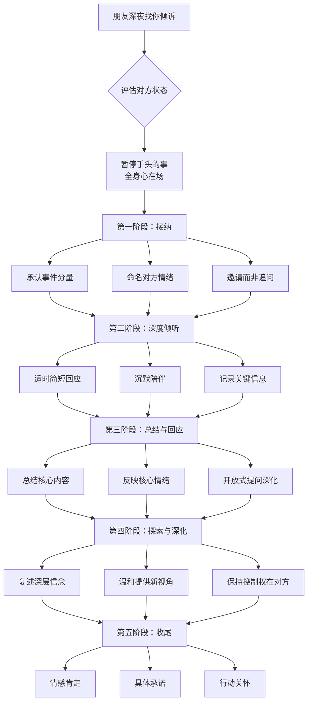

## 案例一：朋友深夜倾诉——倾听中的同理心

深夜是人最脆弱的时刻。白天的忙碌停歇下来，情绪的闸门会突然打开。当一个朋友选择在深夜找你倾诉，这本身就意味着两件事：第一，他信任你；第二，他已经撑到了极限。如何回应这种信任，是对倾听能力最真实的检验。

本案例将以一个朋友深夜倾诉分手的场景为核心，从错误示范、正确示范、心理机制、实操框架四个维度，完整拆解同理心倾听的每一个关键动作。

---

### 场景描述

你的朋友小李深夜11点给你发消息："在吗？想和你聊聊。"电话接通后，他的声音听起来很低沉，语速比平时慢很多。

他说：

> "我今天和女朋友分手了。其实也不是突然的，这段时间我们一直吵，但真正走到这一步，还是很难受。三年了，说分就分了。我现在一个人坐在阳台上，不知道该怎么办。"

**场景要素分析**：

| 要素 | 具体内容 | 倾听意义 |
|------|---------|---------|
| 时间 | 深夜11点 | 情绪低谷期，白天的防御机制减弱 |
| 方式 | 先发消息试探，再打电话 | 内心犹豫，需要确认你愿意倾听 |
| 内容 | 三年感情结束 | 深层丧失感，涉及身份认同和未来规划 |
| 状态 | 独自在阳台 | 物理空间的孤立反映心理状态 |
| 关键词 | "不知道该怎么办" | 核心情感需求：被理解和被陪伴 |

在开口回应之前，你需要在脑中快速完成这些判断。小李此刻不是在寻求解决方案，他是在寻求情感上的连接。

---

### 错误示范：六种常见的"好心办坏事"

#### 错误类型一：急于给建议型

> "别难过了，分了就分了呗。你看你条件也不差，再找一个就是了。我跟你说，我之前分手的时候也特别难受，后来认识了现在的老婆，比前任好太多了。你别在阳台上坐着了，明天我给你介绍一个。"

**逐句拆解**：

- **"别难过了"**：三个字直接否定了对方当下的情绪。对方正在经历真实的痛苦，这句话等于说"你的痛苦是不必要的"。
- **"分了就分了呗"**：轻描淡写地抹杀了三年感情的分量。对于当事人来说，这三年包含了多少共同经历、情感投入和未来期望，用一个"呗"字全部带过，是对这段关系的不尊重。
- **"再找一个就是了"**：把一段深度情感关系简化为可替换的物品。对方需要的不是"下一个"，而是有人理解"这一个"对他有多重要。
- **"我之前分手的时候"**：把话题引向自己，抢夺了对方的表达空间。此刻聚光灯应该在小李身上，而不是在你的经验上。
- **"比前任好太多了"**：暗示对方的感情不值得惋惜，这是一种隐性的评判。
- **"明天我给你介绍一个"**：用行动建议跳过了情感处理。对方还没消化完丧失的痛苦，你就已经在安排"下一步"了。

**心理学根源**：这种回应模式源于"建议冲动"——当看到别人痛苦时，我们的大脑会产生强烈的"修复"欲望，想要快速消除对方的不适感。但这种冲动往往是我们自己无法忍受对方痛苦的投射，而不是对方真正需要的。

#### 错误类型二：评判型

> "你们不是经常吵吗？分了也好，总比天天吵架强。你当初就不应该和她在一起，我早就看出来你们不合适了。"

**问题分析**：

- **"分了也好"**：在对方心碎的时候说"也好"，是对他此刻痛苦的无视。
- **"当初就不应该"**：事后诸葛亮式的评价，潜台词是"你当初做了一个愚蠢的决定"。
- **"我早就看出来了"**：这句话让对方觉得自己被看笑话，而且暗示他自己的判断力很差。
- 整体问题在于：对方需要的是理解，不是复盘。感情的结束已经够让人自我怀疑了，评判只会加重这种自我否定。

#### 错误类型三：情感抢夺型

> "我完全理解你的感受。我上次分手的时候哭了整整一个星期，连饭都吃不下，瘦了十斤。后来花了大半年才走出来。你现在还好，至少比我当时强。"

**问题分析**：

- 把对方的经历变成了自己经历的参照物，焦点从"你"变成了"我"。
- "我完全理解"是一个危险的断言——没有人能完全理解另一个人的感受，即使经历相似。
- "至少比我当时强"是在比较痛苦的"程度"，仿佛痛苦是可以排名的。每个人的痛苦都是独特的，不存在"你的比我的轻"这种比较。

#### 错误类型四：理性分析型

> "你冷静想一想，你们的问题到底出在哪？是不是沟通方式有问题？我建议你列一个清单，把你们之间的问题都写下来，看看哪些是可以改进的。如果你还想挽回，我可以帮你分析分析。"

**问题分析**：

- 在对方情绪崩溃的时候要求"冷静"，这是对情绪过程的不尊重。情绪需要先被接纳，才能自然消退。
- "列清单"式的理性分析完全忽略了情感层面的需求。
- "帮你分析分析"再次把关系变成了需要解决的"问题"，而不是需要哀悼的"丧失"。
- 心理学研究表明，在情绪激动时，人的前额叶皮层（负责理性思考）活动会降低，此时进行理性分析不仅无效，还会让对方感到被误解。

#### 错误类型五：正能量绑架型

> "往好处想嘛！你现在单身了，终于可以自由了。想干嘛干嘛，不用再看别人脸色了。而且你才28岁，正是最好的年纪，机会多的是。人生就是这样，每一次结束都是新的开始。"

**问题分析**：

- 强迫对方看到"积极面"，本质上是在否定他的悲伤权利。
- "往好处想嘛"用一个"嘛"字把对方的痛苦轻量化了。
- "每一次结束都是新的开始"——道理没错，但时机完全错误。在伤口还在流血的时候讲人生哲理，只会让人觉得你根本没在听。
- 这种回应模式被称为"有毒的积极性"（toxic positivity），它用表面的乐观掩盖了对真实痛苦的回避。

#### 错误类型六：沉默回避型

> "……呃……那个……你想开点吧……要不早点休息？"

**问题分析**：

- 对方鼓起勇气打来电话，收到的回应是敷衍和催促结束对话。
- "早点休息"可能是关心，但在这种语境下更像"我不想继续这个话题了"。
- 这种回应往往不是因为不关心，而是因为不知道说什么。但对当事人来说，效果和冷漠是一样的。

---

### 正确示范：分阶段的同理心倾听

下面是经过精心设计的回应示范，分为五个阶段。每个阶段都有明确的目标和核心动作。

#### 第一阶段：接纳与在场（0-30秒）

> **"三年的感情，走到这一步真的很不容易。（停顿两秒）你现在一定很难受。你愿意说说是怎么回事吗？我就在这儿听你说。"**

**动作拆解**：

| 话语 | 核心动作 | 心理效果 |
|------|---------|---------|
| "三年的感情，走到这一步真的很不容易" | 承认事件的分量 | 对方感到自己的痛苦被看见 |
| （停顿两秒） | 给对方空间 | 传递"我不急，你可以慢慢来" |
| "你现在一定很难受" | 情感反映 | 命名情绪，降低情绪强度 |
| "你愿意说说是怎么回事吗" | 开放式邀请 | 赋予对方控制权，而非强制追问 |
| "我就在这儿听你说" | 承诺陪伴 | 建立安全感 |

**关键细节**：注意用的是"你愿意说说吗"而不是"你跟我说说"。前者给对方选择权，后者带有轻微的压力。在深夜倾诉的场景中，让对方感到"我可以选择说或不说"比"你必须告诉我"更能建立安全感。

#### 第二阶段：深度倾听（1-5分钟）

**（小李继续说了一些细节……）**

在这个阶段，你的主要任务是：**听**。不是思考下一句该说什么，不是在脑中组织建议，而是真正在听。

**具体动作**：

- **适时回应**：用"嗯"、"我在听"、"然后呢"等简短回应，让对方知道你在跟随他的叙述。
- **沉默陪伴**：当对方哽咽或停顿时，不要急于填补沉默。沉默不是尴尬，是对方在处理情绪。
- **非语言信号**（如果是面对面）：点头、身体微微前倾、保持眼神接触，这些都在传递"我在"。
- **记录关键点**（在心里）：对方提到了哪些人、哪些事件、哪些情绪词，这些是你后续回应的素材。

#### 第三阶段：总结与情感回应（5-8分钟）

> **"听你说起来，这段时间你们都很努力了，但最终还是走到了这一步。这种无力感确实很折磨人。你现在最难受的是什么？"**

**动作拆解**：

- **"这段时间你们都很努力了"**：内容总结，同时肯定了双方的付出，避免了"都是对方的错"或"都是你的错"的单方面归因。
- **"但最终还是走到了这一步"**：承认现实，不回避也不美化。
- **"这种无力感确实很折磨人"**：情感回应——从对方的叙述中提取核心情绪（无力感），并给予验证。
- **"你现在最难受的是什么"**：开放式问题，引导对方继续深入表达。这个问题比"你还好吗"好一百倍，因为它直接邀请对方说出最核心的痛点。

#### 第四阶段：探索与深化（8-15分钟）

**（小李说最难受的是觉得自己不够好……）**

> **"你觉得如果自己做得更好，也许结果就不一样了。这种自责的感觉让人特别痛苦。（停顿）但我想说，感情是两个人的事，走到这一步不是你一个人的责任。你今晚愿意的话，可以多说说，我陪着你。"**

**动作拆解**：

- **"你觉得如果自己做得更好，也许结果就不一样了"**：准确复述对方的核心信念，让对方感到"你真的听懂了"。这不是简单的重复，而是对深层认知模式的捕捉。
- **"这种自责的感觉让人特别痛苦"**：情感反映，同时用"特别"一词增强了回应的力度。
- **（停顿）**：给对方消化的空间。
- **"感情是两个人的事，走到这一步不是你一个人的责任"**：温和地提供另一个视角。注意：这不是在反驳对方，而是在他的自责叙事中插入一个平衡点。时机很重要——必须在充分倾听和情感验证之后才能给出。
- **"你今晚愿意的话，可以多说说"**：再次把控制权交给对方。

#### 第五阶段：收尾与延续（对话结束时）

> **"今晚说了这么多，你心里可能会好受一点。不管怎样，你不是一个人。如果这几天还是难受，随时给我打电话，多晚都行。明天中午我给你带份饭，你别忘了吃东西。"**

**动作拆解**：

- **"你心里可能会好受一点"**：温和地表达希望，但用"可能"而非"一定"，避免过度承诺效果。
- **"你不是一个人"**：直接回应对方"不知道该怎么办"背后的核心恐惧——孤立感。
- **"随时给我打电话，多晚都行"**：具体的承诺比"有事找我"更有力量。"多晚都行"直接回应了"深夜"这个场景，让对方知道你不会因为时间而拒绝他。
- **"明天中午我给你带份饭"**：从情感支持延伸到实际行动关怀。深夜倾诉的人往往忽略了基本的生理需求，一个具体的行动比一百句"照顾好自己"更有用。

---

### 同理心倾听的完整流程

---

### 技巧深度分析：为什么这些动作有效

#### 技巧一：情感反映（Affect Labeling）

**是什么**：用语言准确命名对方正在经历的情绪。

**为什么有效**：UCLA的Matthew Lieberman团队通过fMRI研究发现，当人们用语言命名自己的情绪时，大脑杏仁核（负责情绪反应的区域）的活动会显著降低。这个过程被称为"affect labeling"——仅仅是给情绪"贴标签"这个动作本身，就能降低情绪的强度。

**实际操作**：
- 初级：识别大类情绪。"你很难过"、"你很生气"。
- 中级：识别具体情绪。"你感到无力"、"你有些自责"、"你可能还有一种被抛弃的感觉"。
- 高级：识别混合情绪。"你既难过又有点解脱，这两种感觉混在一起，让你很矛盾。"

**在本案例中的应用**：小李说"不知道该怎么办"，这句话背后的情绪不是"不知道"（认知层面），而是"无力感"和"迷茫"（情感层面）。正确示范中准确捕捉了这一点。

#### 技巧二：适时沉默

**是什么**：在对方说完一段话后，不急于回应，而是保持2-5秒的沉默。

**为什么有效**：
- 给对方时间整理思绪，往往会说出更深层的感受
- 传递"我不急于评判或建议，我在认真消化你说的话"的信号
- 避免打断对方尚未表达完的内容——很多人在停顿后会继续说下去，而那部分往往是最核心的

**常见误区**：很多人害怕沉默，觉得沉默等于"我不知道说什么"或"对话冷场了"。但在深度倾诉中，沉默是最有力的陪伴方式之一。

**实际操作**：
- 对方停顿时，在心里默数3秒再回应
- 如果对方似乎在酝酿，可以说"不着急，你慢慢想"
- 避免用"嗯嗯嗯"连续填充沉默——这反而会让对方觉得你在催促

#### 技巧三：开放式提问

**是什么**：用"什么"、"怎么"、"愿意说说吗"等开头的问题，引导对方展开叙述，而不是用"是不是"、"对不对"等封闭式问题限制对方的回答。

**为什么有效**：开放式问题把控制权交给对方，让他选择说什么、说多少、怎么说。这在情感倾诉中尤其重要——对方需要感到自己是在主动倾诉，而不是在接受审问。

**实际操作**：

| 倾向封闭式（避免） | 倾向开放式（推荐） |
|------------------|------------------|
| "你是不是很难过？" | "你现在是什么感觉？" |
| "你们是因为吵架分的吗？" | "你愿意说说是怎么回事吗？" |
| "你还想挽回吗？" | "你现在最难受的是什么？" |
| "你有没有想过以后怎么办？" | "你心里是怎么想的？" |

#### 技巧四：搁置评判

**是什么**：在倾听过程中，有意识地暂停对对方经历、选择、感受的评价。

**为什么有效**：评判是同理心的最大敌人。当你的大脑进入"评价模式"时，你就从"理解模式"切换了出来。心理学家Carl Rogers指出，无条件积极关注（Unconditional Positive Regard）是有效倾听和心理咨询的基石——不是同意对方的一切，而是在理解之前不评判。

**实际操作**：
- 当脑中出现"他不应该……"的想法时，觉察它，然后搁置它
- 用好奇心替代评判："他为什么会这样感受？"而不是"他不应该这样感受"
- 区分"理解"和"认同"——你可以说"我理解你为什么会这样想"，即使你不完全同意

#### 技巧五：回应情感需求而非表面内容

**是什么**：在对方的话语中识别出深层的情感需求，并优先回应这个需求。

**为什么有效**：每个人在表达时都有一个潜在的情感需求。如果你只回应了字面意思而忽略了情感需求，对方会感到"你没听懂"。

**本案例中的需求层次**：

| 对方说的话 | 表面内容 | 情感需求 | 正确回应方向 |
|-----------|---------|---------|------------|
| "我和女朋友分手了" | 陈述事实 | 需要有人承接这个消息 | 承认事件的分量 |
| "三年了，说分就分了" | 时间跨度 | 失去的沉没成本感 | 承认三年感情的价值 |
| "不知道该怎么办" | 寻求建议 | 深层的无力感和恐惧 | 情感反映+陪伴承诺 |
| "一个人坐在阳台上" | 描述状态 | 孤独感 | "你不是一个人" |

---

### 进阶内容：同理心倾听中的微妙之处

#### 何时提供视角，何时只听不说

正确示范中第四阶段有一句"感情是两个人的事，走到这一步不是你一个人的责任"。这是一个"提供新视角"的动作，时机非常关键。

**判断何时可以提供新视角的标准**：

1. **对方的情绪已经得到充分验证**——你已经命名了他的情绪、确认了他的感受，他感到被理解了
2. **对方的叙述中出现了自我攻击的模式**——比如反复说"都是我的错"
3. **对方的语气从激动转向低落**——说明情绪的峰值已经过去
4. **你提供的视角是补充而非反驳**——"不是你一个人的责任"是平衡，不是推翻

**何时绝对不要提供新视角**：

- 对方还在情绪的高峰期（哭泣、愤怒、激动）
- 对方刚说了第一句话
- 你还没有充分倾听
- 你的"新视角"本质上是在为对方的前任说话（"也许她也有道理"）

#### 不同性格类型的倾听调整

同样的场景，面对不同性格的朋友，倾听的节奏和方式需要微调：

| 性格特征 | 倾听调整 | 注意事项 |
|---------|---------|---------|
| 外向型 | 对方可能说很多，适当引导聚焦 | 不要打断，但可以在适当时机做总结 |
| 内向型 | 对方可能说很少，需要更多耐心和等待 | 不要追问太多，给足沉默空间 |
| 理性型 | 对方可能试图用逻辑分析感情 | 不急于纠正"感情不能用逻辑分析"，先听他分析完 |
| 感性型 | 对方情绪可能很强烈 | 做好情绪传染的心理准备，保持自己的稳定 |
| 回避型 | 对方可能说"没事"然后沉默 | 温和但持续地表达"我在这里"，不强迫 |

#### 深夜倾听的特殊考量

深夜倾诉与白天倾诉有本质的不同：

**生理层面**：
- 深夜人的皮质醇（压力激素）水平较高，情绪调节能力下降
- 睡眠不足会放大负面情绪，让人更容易陷入灾难化思维
- 深夜的安静环境会让人更敏感，更容易触碰到平时压抑的情绪

**心理层面**：
- 深夜选择找你，说明对方已经在内心挣扎了很久
- 深夜的对话往往比白天更真实、更深入
- 对方可能在白天试图维持"正常"，深夜才允许自己脆弱

**应对策略**：
- 不要说"早点休息"——在对方没有表达完之前，这句话等于"我不想听了"
- 不要表现出困倦或不耐烦——如果你真的很累，可以说"我今天有点累，但你说的对我很重要，我很想听你说完"
- 注意对方的安全状态——如果对方提到了自伤或自杀的念头，需要认真对待，必要时建议寻求专业帮助

#### 倾听后的跟进

很多人忽略了一个关键环节：**倾听不是在挂电话那一刻结束的**。

**24小时内**：
- 发一条简短的消息："昨晚聊了那么多，你今天感觉怎么样？"不需要长篇大论，只需要让对方知道你还在关心。

**一周内**：
- 找一个自然的理由联系对方——约吃饭、分享一个有趣的视频、问一个无关的问题。这种"非刻意"的联系比"你还好吗？"更不会给对方压力。

**关键原则**：跟进不是为了"监控"对方的状态，而是为了传递一个信号——"昨晚的倾诉不会改变我们的关系，你不需要为展露脆弱感到尴尬"。

---

### 自我保护：倾听者的情绪管理

同理心倾听不是没有代价的。当你深度承接另一个人的痛苦时，你也会受到影响。这被称为"共情疲劳"（compassion fatigue）或"替代性创伤"（vicarious trauma）。

**倾听者需要做的**：

1. **觉察自己的情绪反应**：在倾听过程中，注意自己是否也开始感到焦虑、悲伤或愤怒。适度的情绪共振是正常的，但如果对方的情绪开始主导你的情绪状态，你需要后退一步。

2. **区分"他的痛苦"和"我的痛苦"**：听完后，问自己"这个情绪是我的，还是他传递给我的？"这种区分本身就是一种保护。

3. **倾听后的自我调节**：
   - 做几次深呼吸
   - 起来走动几分钟
   - 喝一杯水
   - 如果情绪受到影响，找另一个人聊聊（注意保护小李的隐私）

4. **设定边界**：你可以同时做一个好朋友和一个有边界的人。如果小李连续多天深夜倾诉，而你自己的状态也在下降，你可以温和地说："我很想继续陪你，但我这两天也需要休息一下。白天我们可以继续聊，或者你觉得找一个专业的咨询师聊聊怎么样？"

5. **识别需要专业介入的信号**：

| 信号 | 应对 |
|------|------|
| 对方提到不想活了 | 认真对待，询问具体想法，建议拨打心理援助热线 |
| 对方连续两周以上处于严重低落状态 | 建议寻求专业心理咨询 |
| 对方的倾诉开始影响你的日常生活和睡眠 | 你需要设定边界，必要时也寻求支持 |
| 对方只找你一个人倾诉，拒绝所有其他支持 | 你承受了过大的压力，需要鼓励对方扩大支持网络 |

---

### 对照总结：错误回应与正确回应的全维度对比

| 维度 | 错误回应 | 正确回应 | 底层差异 |
|------|---------|---------|---------|
| 关注焦点 | 自己的经验/建议 | 对方的感受和需求 | "我"vs"你" |
| 时间导向 | "以后怎么办" | "现在是什么感觉" | 未来导向vs当下导向 |
| 情绪处理 | 否定/跳过/压制 | 命名/接纳/陪伴 | 回避vs面对 |
| 信息获取 | 封闭式问题 | 开放式问题 | 控制vs赋权 |
| 沉默反应 | 用废话填充 | 用沉默陪伴 | 不安vs安定 |
| 关系定位 | 问题解决者 | 情感容器 | 修复者vs陪伴者 |
| 语言模式 | "你应该……" | "你愿意……" | 指令vs邀请 |
| 核心动作 | 给建议 | 听和回应 | 行动导向vs存在导向 |

---

### 举一反三：从一个案例到一类场景

本案例的核心技巧不仅适用于"朋友深夜倾诉分手"这一个场景，而是适用于所有需要同理心倾听的情境：

- **朋友遭遇职场不公**：同样的接纳→倾听→情感回应→适度视角的流程
- **家人经历丧失（亲人去世）**：同样的"不急于安慰，先让对方充分表达"的原则
- **伴侣表达不满**：同样的"回应情感需求而非表面内容"的技巧
- **孩子在学校受委屈**：同样的"给控制权，用开放式问题"的方法

万变不离其宗：**当一个人选择向你展露脆弱时，他需要的不是你的智慧、你的经验或你的解决方案——他需要的是你的在场、你的理解和你对他此刻痛苦的尊重。**

***
