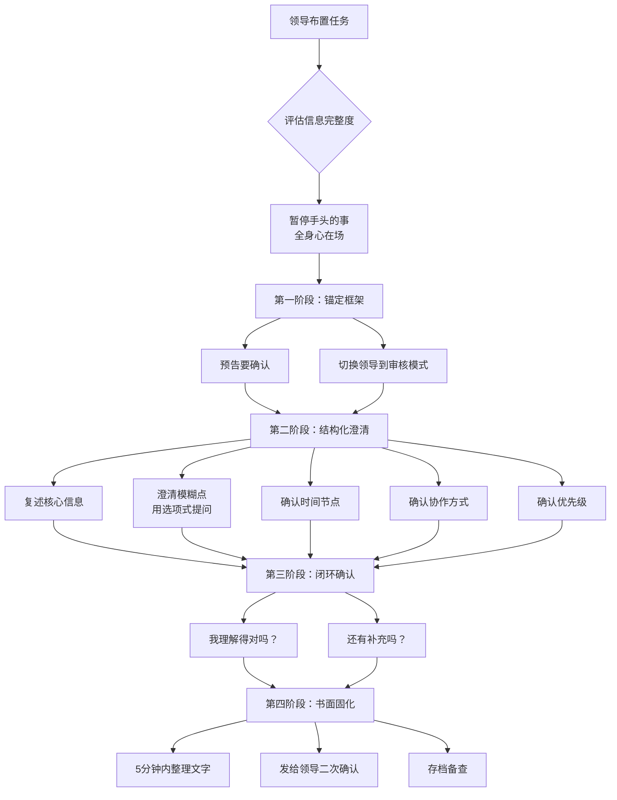

## 案例二：领导布置任务——倾听中的精准捕获

职场中，领导布置任务的场景几乎每天都在发生。但你有没有注意到一个现象：同样听领导说了一段话，有的人回去就能精准执行，有的人却反复返工、频频确认，甚至做出来的东西和领导的预期南辕北辙？

差距不在于谁更聪明，而在于谁在"听"的时候做了更多的事。

普通人的听是被动接收——领导说一句，我记一句。高手的听是主动捕获——领导说一段话，我要在脑中完成信息解码、模糊澄清、优先级排序、风险预判这一整套动作。本案例将以一个真实的任务布置场景为核心，从错误示范、正确示范、认知机制、实操框架四个维度，完整拆解"任务倾听"的每一个关键动作。

---

### 场景描述

周一早上，领导把你叫到办公室说：

> "小王，上周五的客户反馈你看了吧？客户对我们新版本的产品不太满意，特别是用户体验那块。你这周把这个问题处理一下。另外，下周三之前你把改进方案发给我看看。对了，市场部的张总那边也在关注这个事情，你注意和他保持沟通。这个事情挺紧急的，你抓紧。"

**场景要素分析**：

| 要素 | 具体内容 | 倾听意义 |
|------|---------|---------|
| 时间 | 周一早上 | 一周的开始，领导在做本周工作规划，任务具有周级别的优先级 |
| 信息源 | "上周五的客户反馈" | 已有书面材料，需要回去查阅原文，而非仅凭领导口头转述 |
| 问题范围 | "用户体验那块" | 高度模糊——"用户体验"是一个庞大的领域，需要具体化 |
| 交付物1 | "这周把这个问题处理一下" | "处理"是什么意思？修复bug？优化流程？出分析报告？ |
| 交付物2 | "下周三之前把改进方案发给我" | 有明确截止日期，但"改进方案"的格式、深度、范围未定义 |
| 利益相关方 | "市场部的张总也在关注" | 跨部门协作，需要了解张总的关注点和期望 |
| 紧急程度 | "挺紧急的，你抓紧" | 需要确认：是否需要暂停当前工作？优先级高于哪些任务？ |
| 领导语气 | 随意、口语化 | 领导可能没有事先整理好需求，信息中可能存在遗漏或模糊 |

这段话不到100个字，但其中包含了至少8个需要澄清的信息点。如果只是"好的领导，我知道了"然后转身离开，你带走的可能只有"处理客户反馈"这一个模糊的概念，其余7个信息点全部丢失。

---

### 错误示范：六种常见的"任务倾听失败模式"

#### 错误类型一：点头答应型

> "好的领导，我知道了。"（然后转身离开）

**逐句拆解**：

- **"好的"**：表示接受，但没有表示理解。接受和理解是两件完全不同的事。
- **"我知道了"**：你知道了什么？你知道"用户体验"具体指什么了吗？你知道"处理"是什么意思了吗？你知道和张总沟通什么了吗？这句话只是一种社交性的回应，不是真正的理解确认。
- **转身离开**：错过了最后的澄清窗口。领导刚刚说完，信息还在他的工作记忆中，此刻提问成本最低。一旦你走出办公室，领导就会切换到下一件事，再想澄清就要重新约时间。

**后果**：回去之后面对一堆模糊信息，要么自己猜测着做（大概率猜错），要么反复打电话确认（让领导觉得你没在听），要么拖延到截止日期才开始动手（因为不知道从哪里下手）。

**心理学根源**：这种行为源于"社交顺从本能"——在权威面前，人倾向于用快速答应来结束面对面的压力情境。"好的我知道了"不是认知层面的回应，而是情绪层面的逃避——你在逃避"承认自己没完全听懂"带来的不适感。

#### 错误类型二：只记关键词型

> （在笔记本上写下"客户反馈-用户体验-本周-方案周三-张总-紧急"）

**问题分析**：

- 你记下了关键词，但没有记下关键词之间的逻辑关系。"客户反馈"和"用户体验"之间是什么关系？"本周"要完成什么？"方案周三"是周三交还是周三之前交？
- 关键词笔记是"存储"，不是"理解"。你把领导的话切碎了装进了笔记本，但没有在脑中重新组装成一个可执行的任务结构。
- 更危险的是，关键词笔记会给你一种"我已经记下来了"的虚假安全感。回去翻开笔记本，看到六个孤立的词，依然不知道从何下手。

**根本问题**：笔记记的是"领导说了什么"，而不是"我需要做什么"。两者的差距就是"返工"和"一次做对"的差距。

#### 错误类型三：急于表态型

> "领导放心，这个事情我一定处理好！我今天就开始搞，保证下周三之前把方案交给您！"

**问题分析**：

- **"一定处理好"**：在你还不知道"好"的标准是什么的时候就承诺"好"，是一种没有根基的保证。
- **"今天就开始搞"**：你连问题是什么都没搞清楚，就开始搞什么？这种表态看似积极，实际上是在用态度上的勤快掩盖思考上的懒惰。
- **"保证"**：用情绪化的承诺替代了理性的确认。领导需要的不是你的保证，而是你的理解。

**潜台词**：这种回应模式往往是为了在领导面前展示"积极主动"的形象，但效果适得其反。一个成熟的职场人会让领导看到"我理解了你的需求"，而不是"我会拼命干"。领导更信任前者。

#### 错误类型四：细节追问型

> "领导，您说的用户体验是指页面加载速度还是交互设计？是首页还是详情页？是所有用户还是特定用户群？改进方案要多少页？用PPT还是Word？要不要附数据？张总的电话号码是多少？我什么时候找他比较好？"

**问题分析**：

- 一口气抛出9个问题，领导会立刻失去耐心。这不是"认真倾听"，这是"信息轰炸"。
- 有些问题你自己就能解决（比如看客户反馈原文就能知道是哪些页面的问题），不需要占用领导的时间。
- 追问的顺序有问题——应该先确认大方向（这个问题的性质和范围），再确认细节（具体哪些页面、哪些指标）。

**核心问题**：好的倾听不是"把所有问题都丢给领导"，而是"只问领导才能回答的问题"。凡是能通过自己查资料、看文档、问同事来解决的问题，都不应该在任务布置的对话中提出。

#### 错误类型五：假设填充型

> （领导说完后，自己脑补：用户体验=页面加载慢，处理=优化代码，方案=PPT文档，和张总沟通=发邮件同步进展）

**问题分析**：

- 人脑有一种强大的"自动补全"功能——面对模糊信息时，会不自觉地用自己最熟悉的内容去填充空白。这种填充往往是错的。
- "用户体验"可能是界面设计问题、操作流程问题、功能缺失问题、性能问题，甚至可能是文档说明不清楚的问题。你用"页面加载慢"去填充，是因为你最擅长前端优化，而不是因为客户反馈的就是这个问题。
- 假设填充最大的危险在于：你不会意识到自己在假设。你觉得自己"理解了"，但你理解的其实是你自己编的故事。

**认知机制**：心理学中称之为"锚定效应"——你过去的经验会成为理解新信息的"锚点"，让你不自觉地把新任务往旧框架里套。克服这个偏差的唯一方法是：**把你的假设说出来，让领导确认或纠正。**

#### 错误类型六：事后补救型

> （回到工位后开始干活，干到一半发现不对，打电话问领导："领导，您刚才说的用户体验是指……"领导："我刚才不是说过了吗？"）

**问题分析**：

- "我刚才不是说过了吗"——这句话意味着领导认为你没有认真听。不管你实际上有多认真，这个印象一旦形成就很难改变。
- 事后补救的成本远高于当场确认。领导已经切换到其他工作状态了，重新回忆和解释之前的任务需要额外的认知成本。
- 频繁的事后确认会让领导对你的能力产生怀疑：如果连任务都听不明白，执行能做好吗？

**核心教训**：在领导办公室多花5分钟确认，能省去后面5天的返工。这不是浪费领导的时间，而是对领导时间的最大尊重——因为你不会带着错误的理解去做错误的事，然后交出一个需要推翻重来的方案。

---

### 正确示范：分阶段的任务倾听框架

下面的回应经过精心设计，分为四个阶段。每个阶段都有明确的目标和核心动作。

#### 第一阶段：锚定框架（10秒内）

> **"好的领导，我来确认一下，确保我理解准确。"**

**动作拆解**：

| 话语 | 核心动作 | 心理效果 |
|------|---------|---------|
| "好的" | 接受任务 | 让领导知道你愿意承担 |
| "我来确认一下" | 预告你要做总结 | 让领导切换到"审核模式"，准备纠正 |
| "确保我理解准确" | 表明目的 | 不是质疑领导，而是对自己的要求 |

**关键细节**：这句话看似简单，实际上完成了一个重要的角色切换——从"被动接收者"变成"主动确认者"。领导听到这句话，会自动调整自己的注意力，准备好审核你的理解是否正确。如果没有这句预告就直接开始提问，领导可能会觉得你在质疑他。

#### 第二阶段：结构化总结与精准澄清（60-90秒）

> **"第一，关于客户反馈的问题：客户主要不满的是新版本的用户体验方面。您说的'用户体验那块'，具体是指界面设计、操作流程，还是响应速度？我回去先看一下客户反馈的原文，再给您一个初步判断。"**
>
> **"第二，关于时间安排：我这周需要排查问题并制定改进方案，下周三之前把方案发给您审核，对吗？"**
>
> **"第三，关于和张总的沟通：您希望我主动找张总同步进展情况，还是等方案出来后再和他对接？"**
>
> **"第四，这个事情的优先级：我手上还有XX项目也在推进，您觉得这两个怎么排优先级？"**

**逐条拆解**：

**第一条——澄清问题范围**：

- "客户主要不满的是新版本的用户体验方面"：先用一句话复述领导的核心信息，证明你在听，同时帮领导确认你说的和他想的是同一件事。
- "具体是指界面设计、操作流程，还是响应速度？"：给出选项而非开放式提问。选项式提问有两个好处：一是降低领导的回答成本（只需要说"操作流程那块"），二是展示你对问题域的理解（你知道"用户体验"包含这些子领域）。
- "我回去先看一下客户反馈的原文，再给您一个初步判断"：表明你不会只依赖领导的口头描述，你会回到原始数据去验证。这既展示了专业性，也给了自己一个后续补充确认的窗口。

**第二条——确认时间节点**：

- "我这周需要排查问题并制定改进方案"：把领导模糊的"处理一下"翻译成了具体的动作——"排查"和"制定方案"。
- "下周三之前把方案发给您审核"：确认了两个关键信息——截止时间（周三之前）和交付物形式（方案文档）。
- "对吗？"：用封闭式问题做最终确认。这里用封闭式是正确的，因为你需要的是一个明确的"是"或"不是"，而不是更多的信息。

**第三条——澄清协作方式**：

- "主动找张总同步进展"vs"等方案出来后再对接"：这是两种完全不同的工作模式。前者需要你在过程中持续与张总保持沟通，后者只需要在方案完成后一次性汇报。这两种模式的工作量和节奏完全不同，必须在开始之前就确定。
- 注意：你没有问"张总的电话号码是多少"这种自己能查到的信息，只问了"领导期望的协作模式是什么"这种只有领导才能定义的问题。

**第四条——确认优先级**：

- "我手上还有XX项目也在推进"：明确告诉领导你当前的工作负载，而不是默默承受。
- "您觉得这两个怎么排优先级？"：把优先级的决策权交还给领导。这不是推卸责任，而是尊重组织的权责结构——优先级是领导的决策域，不是你的。

#### 第三阶段：总结闭环（15秒）

> **"我理解得对吗？还有需要补充的吗？"**

**动作拆解**：

- **"我理解得对吗？"**：给领导最后一次纠正的机会。如果前面的总结有任何偏差，这句话是最后的安全网。
- **"还有需要补充的吗？"**：领导在布置任务时，经常会遗漏一些信息（因为他已经在脑中思考过无数遍了，会觉得某些东西"不言自明"）。这个问题能激活领导的补充记忆。

**为什么必须有这一步**：研究表明，人在接收信息后的即时复述，能将信息保留率从25%提升到60%以上。而经过复述+确认的信息，保留率可以达到80%以上。这一步不仅是对领导的交代，也是对你自己记忆的巩固。

#### 第四阶段：书面固化（离开办公室后5分钟内）

> 回到工位后，立刻把刚才确认的内容整理成一段文字，通过微信或邮件发给领导。格式如下：
>
> ---
>
> 领导，刚才和您确认的任务，我整理如下：
>
> 1. **任务背景**：客户对新版本产品（特别是用户体验方面）不满意，需要排查和改进
> 2. **本周工作**：排查问题根因，制定改进方案
> 3. **交付时间**：下周三（X月X日）之前提交改进方案
> 4. **协作安排**：与市场部张总保持沟通（已确认为：在方案初稿完成后主动同步）
> 5. **优先级**：本任务优先于XX项目
>
> 如有偏差请指正。
>
> ---

**这一步为什么至关重要**：

- **文字化 = 可追溯**：口头确认的内容可能双方都有记忆偏差，文字记录是唯一的真相。
- **异步确认**：领导可能在你确认时随口说"对"，但看到文字版后会发现"哦这个我忘了说了"。文字化给了领导一个二次审核的机会。
- **自我保护**：如果后续领导说"我当时不是这么说的"，你有据可查。这不是为了甩锅，而是为了建立清晰的工作边界。

---

### 任务倾听的完整流程

---

### 技巧深度分析：为什么这些动作有效

#### 技巧一：结构化总结（Chunking + Sequencing）

**是什么**：把领导的一段连续口述信息，拆解成编号的条目，按逻辑顺序排列后复述。

**为什么有效**：认知心理学中的"组块理论"（Chunking Theory，George Miller, 1956）指出，人的工作记忆容量有限——大约只能同时处理7±2个信息单元。领导一段口述可能包含十几个信息点，如果不做结构化处理，这些信息会在工作记忆中互相干扰、模糊、丢失。而通过"第一、第二、第三"的编号方式，你把散乱的信息流组织成了离散的信息块，每一块都可以被独立理解和确认。

**层级进阶**：

- 初级：用编号列出领导说了哪些事（"第一……第二……"）
- 中级：按逻辑关系分组（"关于问题本身……关于时间……关于协作……"）
- 高级：在编号之间建立因果和优先级关系（"首先确认问题范围，因为范围决定了后续的工作量和时间安排"）

#### 技巧二：选项式澄清（Option-Based Clarification）

**是什么**：面对模糊信息时，不问"这是什么意思？"（开放式），而是给出几个选项让领导选择"是A、B还是C？"（封闭式）。

**为什么有效**：

- **降低回答成本**：领导不需要从零开始解释，只需要在你提供的选项中选择或修正。这比"你跟我说说什么是用户体验"高效得多。
- **展示专业性**：你能给出选项，说明你对这个领域有基本认知。领导会因此信任你的判断力。
- **暴露隐藏维度**：有时候领导自己也没有想清楚，你的选项会帮他理清思路。"界面设计、操作流程还是响应速度？"可能会让领导意识到"哦对，主要是操作流程的问题"。

**什么时候用开放式**：当你对问题域完全没有概念时，用开放式更安全。"您能具体说说客户不满意的是哪方面吗？"——这比给出三个错误选项要好。

#### 技巧三：复述-确认循环（Paraphrase-Confirm Loop）

**是什么**：在每一段总结之后，用"对吗？"或"是这个意思吗？"来触发领导的确认。

**为什么有效**：这个技巧利用了一个心理学现象——"确认偏误"的反面。人在听到别人复述自己说过的话时，会自动进入"比对模式"——将对方的复述与自己脑中的原意进行比较。如果一致，会说"对"；如果不一致，会本能地纠正。这个比对过程是自动发生的，不需要领导额外努力。

**关键注意**：复述不是逐字重复领导的话，而是用自己的语言重新组织。逐字重复只会让领导觉得你在录音，用自己的话复述才能证明你理解了。

#### 技巧四：隐性信息显性化（Making Implicit Explicit）

**是什么**：领导在口述任务时，往往会省略一些他认为"不言自明"的信息。好的倾听者能把这些隐性信息提取出来，变成显性的确认点。

**案例中的隐性信息**：

| 领导说了什么 | 隐含但未明说的信息 | 正确示范中的处理 |
|-------------|-------------------|----------------|
| "处理一下" | 处理到什么程度算"处理好了"？ | 确认交付物是"改进方案"而非"已修复" |
| "保持沟通" | 沟通的频率、方式、内容是什么？ | 确认是"主动同步"还是"方案完成后再对接" |
| "挺紧急的" | 紧急到什么程度？需要暂停其他工作吗？ | 确认与当前任务的优先级排序 |
| "你看了吧" | 你是否真的看了？是否需要重新看？ | 表示会"回去看一下原文" |

**为什么领导会省略这些信息**：因为在领导的认知中，这些信息已经"存在"了——他已经思考过这个问题的方方面面，但只说出了他认为你需要知道的部分。问题是，他判断"你需要知道什么"是基于他自己的认知框架，而不是基于你的。所以你需要主动把他的框架中"他认为你已经知道"的部分拉出来确认。

#### 技巧五：决策权归位（Decision-Right Mapping）

**是什么**：在确认任务时，区分哪些决策是领导做的、哪些是你可以自己做的，然后把领导的决策权明确交还。

**案例中的决策权分析**：

| 决策内容 | 决策权归属 | 正确示范中的处理 |
|---------|-----------|----------------|
| 问题的范围和定义 | 领导（或需领导确认） | "具体是指界面设计、操作流程，还是响应速度？" |
| 截止时间 | 领导 | "下周三之前把方案发给您审核，对吗？" |
| 协作模式 | 领导 | "主动找张总同步还是等方案出来后再对接？" |
| 优先级排序 | 领导 | "您觉得这两个怎么排优先级？" |
| 具体排查方法 | 你自己 | 不问领导，自己决定 |
| 方案的格式和模板 | 你自己（或参考公司惯例） | 不问领导，自己决定 |

**为什么重要**：很多职场新人犯的一个错误是"要么什么都问领导（显得没主见），要么什么都不问（显得没脑子）"。正确的方式是：**只问决策权在领导那边的问题，决策权在自己这边的问题自己解决。** 这个区分能力本身就是职场成熟度的标志。

---

### 进阶内容：不同场景下的任务倾听策略

#### 不同领导类型的倾听调整

| 领导类型 | 特征 | 倾听策略 | 注意事项 |
|---------|------|---------|---------|
| 表达清晰型 | 条理分明，信息完整 | 认真记录，确认细节即可 | 不要过度追问，会让领导觉得你没在听 |
| 思维跳跃型 | 话题频繁切换，逻辑不连贯 | 用结构化总结帮他梳理，在确认时按逻辑重新排列 | 不要打断他的思路，等他说完再总结 |
| 高度模糊型 | "你看着办吧"、"差不多就行" | 主动提出你的理解和计划，请他确认方向 | 用选择题而非问答题："我打算这样做，您看可以吗？" |
| 微观管理型 | 每个细节都要过问 | 主动汇报细节，减少他追问的需要 | 不要觉得被管太多，这是他的管理风格 |
| 结果导向型 | 只关心结果，不关心过程 | 确认好交付标准和截止时间即可 | 不要花太多时间解释你的方法论 |
| 关系导向型 | 注重团队感受和氛围 | 确认任务时也关注他对团队协作的期望 | 不要只谈任务本身，也要谈人的配合 |

#### 不同任务类型的倾听重点

| 任务类型 | 倾听重点 | 需要额外确认的 |
|---------|---------|--------------|
| 紧急修复 | 问题现象、影响范围、截止时间 | 是否需要暂停当前工作？是否需要协调其他资源？ |
| 项目规划 | 目标、范围、资源、时间节点 | 预算多少？有哪些利益相关方？成功的标准是什么？ |
| 报告撰写 | 主题、受众、格式、深度 | 给谁看？重点突出什么？有没有参考模板？ |
| 跨部门协作 | 各方职责、沟通机制、决策流程 | 谁是主要对接人？出现分歧时谁拍板？ |
| 客户对接 | 客户需求、底线、公司立场 | 哪些可以承诺？哪些需要回来请示？ |
| 调研任务 | 调研目的、范围、时间、输出形式 | 调研结果是给谁用的？需要多详细？ |

#### 当领导说的话互相矛盾时

有时候领导布置任务会出现前后矛盾的情况，比如：

> "这个方案要创新，要突破常规思维。但也不要太冒险，最好参考一下行业成熟的做法。"

**处理策略**：

1. **不要假装没听到矛盾**：矛盾不会因为你忽略它而消失，它只会在执行阶段爆发。
2. **用"既要……又要……"的框架确认**："领导，我理解这个方案既要创新突破，又要控制风险。您心里有没有一个平衡点的参考？比如70%成熟方案+30%创新尝试？"
3. **如果领导也无法给出明确平衡**：你主动提出一个具体的平衡方案，请领导确认。"我计划先做一个保守版本和一个创新版本，分别标注风险点，您来选择最终方向。这样可以吗？"

#### 当领导布置的任务超出你的能力时

**错误做法**：硬着头皮答应，然后在执行中暴露能力不足。

**正确做法**：

> "领导，这个任务我理解了。关于XX部分，我之前的经验主要在YY领域，对这块还不够深入。我有两个想法：一是我这周先学习一下，下周给您方案；二是我可以和XX同事一起做，他在这方面比较有经验。您觉得哪种方式更合适？"

**关键原则**：坦诚能力边界不是示弱，而是对任务质量的负责。领导更希望你提前说出来，而不是在截止日期前才发现你搞不定。

#### 当领导布置任务时你在忙别的事

**错误做法**：一边处理手头的工作一边"嗯嗯嗯"地敷衍。

**正确做法**：

> "领导，我手头这个东西正在处理一个关键步骤，大概还需要10分钟。您看我是现在停一下先听您说，还是10分钟后我来找您？"

**为什么这比直接停下来更好**：如果你正在处理一个需要专注的工作（比如写代码、审合同），突然切换到倾听模式会导致两件事都做不好。坦诚告知并给出时间选项，既尊重了领导，也尊重了手头的工作。

---

### 常见误区与纠正

#### 误区一：确认=质疑领导

**错误认知**："我确认领导说的话，会不会让领导觉得我不信任他？"

**事实**：恰恰相反。一个能准确复述和确认任务的下属，会让领导觉得"这个人听进去了"。领导最怕的不是你多问一句，而是你什么都不问然后做错了。在绝大多数领导眼中，主动确认=认真负责，沉默离开=敷衍了事。

#### 误区二：记笔记=好听众

**错误认知**："我每次都在认真记笔记，领导应该知道我在认真听。"

**事实**：埋头记笔记的人往往错过了领导的语气、表情和非语言信号。更重要的是，笔记记的是"信息"，而任务倾听还需要捕捉"意图"——领导为什么布置这个任务？他真正关心的是什么？这些不会出现在他的原话中，但会出现在他的语气和重音里。

**建议**：记笔记的同时保持眼神接触，用简短的"嗯"、"明白"来保持互动。笔记记关键点和你的疑问，而不是逐字记录。

#### 误区三：问太多问题=不专业

**错误认知**："问太多问题会让领导觉得我能力不行。"

**事实**：关键不在于问了多少问题，而在于问了什么问题。问"这个方案用PPT还是Word？"确实是不专业的（你自己能决定）。但问"您说的用户体验具体是指哪方面？"是专业的（这直接影响工作方向）。**好的问题展示的是思考深度，不是能力不足。**

#### 误区四：确认一次就够了

**错误认知**："领导确认了'对'，我就完全理解了。"

**事实**：领导的"对"可能只是对你大方向的认可，不代表每个细节都对。更重要的是，领导在你说的时候可能没有完全集中注意力（他在想别的事）。书面固化（第四阶段）就是为了弥补这个缺口——给领导一个异步的、可以仔细审核的确认机会。

#### 误区五：只在复杂任务时才需要确认

**错误认知**："简单的任务不需要确认，领导说的很清楚了。"

**事实**：越是"简单"的任务，越容易因为想当然而犯错。"帮我打印一下这份文件"——打印几份？单面还是双面？彩色还是黑白？装订还是不装订？送到哪里？这些"简单"任务中的隐性信息，往往比复杂任务更容易被忽略。

---

### 任务倾听的CHECKLIST模板

在每次领导布置任务时，在脑中快速过一遍这个清单：

| 检查项 | 问题 | 是否确认 |
|-------|------|---------|
| WHAT | 这个任务具体要做什么？交付物是什么？ | □ |
| WHY | 为什么要做这个？领导的核心关切是什么？ | □ |
| WHEN | 截止时间是什么？有没有中间节点？ | □ |
| WHO | 除了我还有谁参与？需要和谁协作？向谁汇报？ | □ |
| WHERE | 信息源在哪里？参考材料在哪里？ | □ |
| HOW | 有没有参考标准或模板？做到什么程度算完成？ | □ |
| PRIORITY | 优先级如何？和当前其他任务怎么排序？ | □ |
| CONSTRAINT | 有没有预算、资源、权限上的限制？ | □ |

**使用方式**：不需要每次把8个问题全问一遍（那就成了"错误四：细节追问型"）。在脑中快速扫描一遍，只问那些领导说了但你没听懂的，以及领导没说但你必须知道的。

---

### 对照总结：错误回应与正确回应的全维度对比

| 维度 | 错误回应 | 正确回应 | 底层差异 |
|------|---------|---------|---------|
| 信息处理 | 被动接收 | 主动解码 | 消费者vs处理者 |
| 模糊信息 | 自己脑补 | 用选项澄清 | 假设vs验证 |
| 时间节点 | 模糊记忆 | 精确确认 | 约数vs确数 |
| 优先级 | 默默承受 | 主动确认 | 被动vs主动 |
| 协作关系 | 不关心 | 明确确认 | 个体vs系统 |
| 确认方式 | 口头说"知道了" | 结构化复述+书面固化 | 单次vs双重 |
| 信息记录 | 关键词碎片 | 逻辑化清单 | 存储vs理解 |
| 后续跟进 | 等出问题再问 | 离开前确认完毕 | 事后补救vs事前预防 |
| 风险管理 | 做到一半才发现偏差 | 当场识别模糊点 | 被动纠错vs主动预防 |
| 领导印象 | "这人没在听" | "这人很靠谱" | 能力怀疑vs信任建立 |

---

### 举一反三：从一个案例到一类场景

本案例的核心技巧不仅适用于"领导布置任务"这一个场景，而是适用于所有需要精准捕获信息的情境：

- **客户需求沟通**：客户说"我想要一个好用的系统"——"好用"具体指什么？同样的选项式澄清技巧。
- **会议决议确认**：会议讨论了30分钟得出结论——用结构化总结确认"我们刚才达成了三点共识"。
- **项目交接**：前任同事跟你说"这个项目大概是这样的"——用CHECKLIST逐项确认，避免接了一个坑。
- **跨部门协调**：其他部门说"你们配合一下"——确认"配合"的具体内容、时间和交付标准。
- **甲方需求对接**：甲方说"我要五彩斑斓的黑"——用选项式提问把模糊需求翻译成可执行的技术规格。

**万变不离其宗**：当一个人向你布置任务、提出需求、传达信息时，你要做的不是"听到了"，而是"听懂了"。听到了是耳朵的工作，听懂了是大脑的工作。而确认和书面固化，是确保你的"听懂"和对方的"想说"是同一件事的最后一道防线。

***

