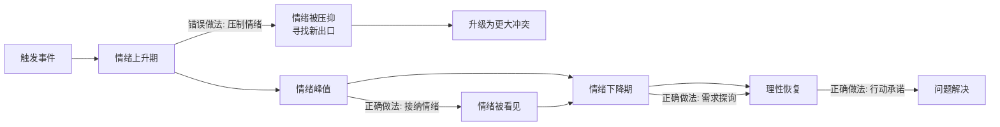

## 案例三：客户投诉——倾听中的情绪管理

客户投诉是所有倾听场景中对情绪管理要求最高的一种。与朋友倾诉不同，投诉场景中的对方带着强烈的负面情绪、明确的经济损失预期、以及随时升级为冲突的潜在威胁。你不仅要"听懂"，还要在倾听的过程中完成情绪降级、信任重建、问题定位三重任务。

本案例将从心理学机制、错误模式拆解、分阶段正确示范、进阶策略四个维度，完整呈现"客户投诉倾听"的每一个关键动作。

---

### 场景描述

你是客服主管，接到一个客户电话。客户开口就是：

> "你们公司到底怎么回事？！系统又崩了！这个月第三次了！你们知不知道每次崩了我损失多少钱？！我要投诉你们！再这样下去我要换供应商了！"

**场景要素分析**：

| 要素 | 具体内容 | 倾听意义 |
|------|---------|---------|
| 情绪状态 | 愤怒、失控感 | 客户处于"杏仁核劫持"状态，理性脑暂时下线，任何道理都听不进去 |
| 问题性质 | 系统反复崩溃（第三次） | 不是单次事故，而是信任累积崩塌——客户的容忍度已经耗尽 |
| 经济损失 | "每次崩了我损失多少钱" | 有真实的利益损失，情绪有事实基础，不能简单视为"发脾气" |
| 威胁信号 | "要换供应商" | 客户已经在考虑终止关系，这是最后通牒级别的投诉 |
| 隐含需求 | 不只是修复系统 | 客户需要的是：被重视、被理解、看到系统性改进的承诺、获得损失补偿 |
| 沟通渠道 | 电话 | 无法看到表情和肢体语言，只能通过语调、语速、停顿来判断情绪变化 |

这段话不到80个字，但背后包含了至少6层信息：事实层（系统崩溃）、情绪层（愤怒）、经济层（损失）、关系层（信任崩塌）、行为层（威胁离开）、需求层（需要被重视）。如果只听到了"系统崩溃"这一层，你就丢掉了客户真正想说的80%。

---

### 错误示范：六种致命的投诉回应方式

#### 错误类型一：火上浇油型——"请您冷静一下"

> "先生您好，请您冷静一下。这次系统故障是因为我们的服务器正在进行升级维护，我们已经在处理了，预计两小时内恢复。之前的两次故障我们也都有处理方案……"

**逐句拆解**：

- **"请您冷静一下"**：这是投诉场景中排名第一的禁忌语。心理学研究表明，当一个人处于高唤醒情绪状态时，被告知"冷静"会产生两种反应：一是感到被否定（"我的情绪是不合理的"），二是感到被控制（"你在命令我"）。两种反应都会让愤怒升级而非降级。正确做法是先接纳情绪，情绪自然会降温。
- **"服务器正在进行升级维护"**：在客户最愤怒的时候解释技术原因，会被理解为"找借口"。客户此刻要的不是原因分析，而是情绪被看见。
- **"预计两小时内恢复"**：没有确认客户当前最紧急的需求是什么。也许他现在需要的不是系统恢复，而是一份损失证明去跟他的老板交代。
- **"之前的两次故障我们也都有处理方案"**：这句话的潜台词是"我们之前处理得挺好的"，但客户正在投诉的恰恰是"处理得不好"。这是否定客户的感受。

**心理学根源**：这种回应犯了一个经典错误——在对方的情绪需求未被满足之前就试图解决事实问题。哈佛谈判项目的研究表明，人在情绪激动时，大脑的前额叶皮层（负责理性思考）活动降低，杏仁核（负责情绪反应）活动增强。这意味着客户在愤怒峰值时，物理上无法处理你的技术解释。

#### 错误类型二：推卸责任型——"可能是您的操作问题"

> "先生，系统崩溃可能也和您的操作有关。您有按照我们的使用规范来操作吗？另外我们的服务协议里写得很清楚，系统维护期间的数据损失我们不承担责任。"

**逐句拆解**：

- **"可能也和您的操作有关"**：在客户已经愤怒的情况下暗示是他的错，这不是在解决问题，而是在制造敌人。即使真的有操作问题，也必须在情绪被接纳之后、以极其委婉的方式提出。
- **"您有按照使用规范来操作吗？"**：这是一个审问式的提问，把客户放在了被审判的位置上。
- **"服务协议里写得很清楚"**：搬出合同条款在法律上可能无懈可击，但在关系上等于直接宣判了这段客户关系的死刑。客户不会因为合同条款而平息怒火，反而会觉得"你们不仅不解决问题，还拿合同压我"。

**后果**：这种回应模式会导致客户从"投诉"升级为"对抗"——他会开始录音、找律师、在社交媒体上发帖、向消费者协会举报。你把一个可以通过倾听解决的问题，变成了一个需要公关危机处理的问题。

#### 错误类型三：机械流程型——"请提供您的工单号"

> "先生，请您提供一下您的工单号，我帮您查一下系统记录。请问您的账户名是什么？您用的是哪个版本的系统？最后一次正常登录是什么时候？"

**问题分析**：

- 客户正在宣泄情绪，你却在收集技术信息。这就像一个人着火了跑来找你，你却问他"请问您叫什么名字？填一下表格？"
- 流程化的问题会让客户觉得你是一个没有感情的机器人，他面对的不是一个人，而是一个系统。
- 正确的做法是：先用30秒接纳情绪，再进入流程化的信息收集。顺序不能颠倒。

#### 错误类型四：过度道歉型——"非常抱歉非常抱歉"

> "先生，非常抱歉给您带来了不好的体验，真的非常抱歉。我们公司对这个问题非常重视，我代表公司向您道歉。对不起对不起。"

**问题分析**：

- 道歉如果没有实质内容支撑，就会变成空洞的噪音。连续说五遍"对不起"不会让客户觉得你更有诚意，只会让他觉得你在敷衍。
- 没有任何具体行动承诺的道歉，本质上是"用态度代替解决方案"。客户要的不是你的歉意，而是你的行动。
- "代表公司道歉"——你代表得了吗？客户会觉得"你一个客服能做什么？"反而降低了信任感。

**关键原则**：道歉必须与行动绑定。"我很抱歉"后面必须跟着"我现在就……"，否则道歉就是废话。

#### 错误类型五：急于升级型——"我帮您转接上级"

> "先生，这个问题比较严重，我帮您转接我们的经理，让他来处理好吗？"

**问题分析**：

- 这句话的潜台词是"我搞不定"。客户会想："连你们自己的人都搞不定，你们的系统得多烂？"
- 转接意味着客户要重新描述一遍问题，重新建立一次沟通关系，这对已经愤怒的客户来说是二次伤害。
- 更糟糕的是，转接经常发生"电话转丢了"的情况，客户在等待中被挂断或无限等待，怒火会呈指数级增长。

**什么时候才需要升级**：只有当客户明确要求"叫你们领导来"，或者问题确实超出你的权限范围（如需要法务介入的大额赔偿）时，才考虑升级。升级前必须做好铺垫："我已经把您的情况完整记录下来了，包括……，我接下来帮您转接张经理，我会把记录同步给他，您不需要再重复一遍。"

#### 错误类型六：对抗反击型——"您这样说就不对了"

> "先生，您这样说就不对了。我们系统正常运行时间达到了99.5%，这个月只有三次短暂故障，每次都在两小时内恢复了。您说的'又崩了'有点夸大了。"

**问题分析**：

- 用数据反驳客户的情绪表达，是在告诉客户"你的感受是错的"。客户会觉得你在跟他辩论，而不是在帮他解决问题。
- "99.5%的正常运行时间"——对客户来说，那0.5%就是100%的糟糕体验。你不能用你的统计口径否定他的用户体验。
- "有点夸大了"——直接指责客户不诚实，这是在把投诉变成人身攻击。

---

### 正确示范：分阶段的投诉倾听框架

下面的回应经过精心设计，分为五个阶段。每个阶段都有明确的目标和心理学依据。

#### 第一阶段：情绪接纳（前30秒）

> "张先生，我完全理解您的愤怒。一个月内系统崩溃三次，每次都会给您造成经济损失，这种事情放在谁身上都会非常生气。"

**动作拆解**：

| 话语 | 核心动作 | 心理学依据 |
|------|---------|----------|
| "张先生" | 用姓名称呼而非"先生" | 个性化服务让客户感到被当作个体而非工单号对待 |
| "我完全理解您的愤怒" | 直接命名客户的情绪 | "情感标注"（Affect Labeling）效应：当情绪被准确命名时，杏仁核活动降低，情绪强度下降 |
| "一个月内系统崩溃三次" | 复述事实，证明你在听 | 让客户确认"他听到了"，满足被倾听的基本需求 |
| "每次都会给您造成经济损失" | 承认损失的真实性 | 不否定客户的感受，不争论损失大小 |
| "放在谁身上都会非常生气" | 换位思考 + 普遍化 | "普遍化"技巧：暗示"你的反应是正常的、合理的"，消除客户可能的自我防御 |

**为什么不解释原因**：在这个阶段，客户的理性脑几乎处于离线状态。任何技术解释都会被过滤掉，甚至会被曲解为"借口"。你需要先让情绪脑"降温"，理性脑才能重新上线。研究表明，当一个人的情绪被准确回应后，愤怒的生理唤醒水平会在60-90秒内显著下降。

#### 第二阶段：需求探询（30-90秒）

> "我想先确认一下，您现在最紧急需要解决的是什么问题？是系统尽快恢复，还是需要我们出具什么证明来处理您这边的损失？"

**动作拆解**：

- **"最紧急需要解决的"**：把客户从情绪宣泄模式引导到问题解决模式。这不是压抑情绪（那是"请您冷静"做的事），而是在情绪被接纳之后，自然地过渡到"接下来怎么办"。
- **给出选项而非开放式提问**："是系统恢复还是损失证明"——选项式提问降低了客户的回答成本，同时也展示了你对客户需求的理解深度。
- **把主动权交给客户**：让客户定义"什么是最重要的"，而不是你替他决定。

**关键细节**：这个问题的设计暗含了一个假设——客户的损失是真实的、需要被处理的。这个假设本身就是一种接纳。如果你问"您确定有损失吗？"，那就是在质疑客户。

#### 第三阶段：行动承诺（90-120秒）

> （客户回答后）
>
> "好的，我记录下来了。我现在马上安排技术团队处理您的问题。另外，关于这次事件给您造成的经济损失，我会在24小时内给您一份书面的处理方案。"

**动作拆解**：

- **"我记录下来了"**：用"记录"这个词而非"我知道了"，传递的信息是"你的需求被写下来了，不会被遗忘"。
- **"马上安排技术团队"**：具体的行动 + 具体的执行者。不是"我会处理的"（模糊），而是"安排技术团队"（具体）。
- **"24小时内给书面方案"**：时间承诺 + 书面形式。时间承诺让客户有了确定性预期，书面形式让承诺变得可追踪。
- **"经济损失"这个词的使用**：主动使用客户用过的词，表明你认同他的损失是真实的。

**为什么必须有时间承诺**：不确定感是愤怒的燃料。当客户不知道"什么时候能解决"、"会怎么处理"时，焦虑和愤怒会持续发酵。一个明确的时间节点，哪怕稍长一些（24小时），也比"尽快"好一万倍——因为"尽快"意味着"可能永远不"。

#### 第四阶段：系统性改进探询（120-180秒）

> "张先生，我能不能再了解一下，前两次故障后，我们的处理结果您满意吗？有哪些地方我们做得不够好？"

**动作拆解**：

- **主动询问历史问题**：这传递了一个关键信号——"我不仅在解决眼前的问题，我还在思考如何防止问题再次发生"。
- **"您满意吗"**：把评价权交给客户。这比"我们之前处理得还行吧？"好得多。
- **"有哪些地方做得不够好"**：主动暴露自己的不足，是一种强大的信任建立手段。客户会觉得"这家公司有自我反思的能力"。

**为什么这一步至关重要**：客户投诉的深层恐惧不是"这次出了问题"，而是"下次还会出问题"。通过询问历史处理情况并承诺系统性改进，你直接回应了这个深层恐惧。

#### 第五阶段：闭环与专属感（180-240秒）

> "我把刚才的内容整理一下发给您，确保我们理解一致。我的直线电话是XXXX，后续有任何问题您可以直接找我。"

**动作拆解**：

- **"整理一下发给您"**：书面确认，让客户有了"证据"。这同时也是一种承诺——白纸黑字写下来的东西，比口头承诺更有约束力。
- **"确保我们理解一致"**：这句话的主语是"我们"，暗示双方是合作关系，而非对抗关系。
- **"直线电话"**：提供专属联系方式，让客户觉得自己不是在面对一个匿名客服系统，而是有一个具体的人在为他负责。

---

### 技巧深度分析：为什么这些动作有效

#### 技巧一：情感标注（Affect Labeling）

**原理**：UCLA的Matthew Lieberman教授通过fMRI脑扫描研究发现，当人用语言准确地命名自己的情绪时（如"我现在很愤怒"），杏仁核的活动会显著降低。这个效应被称为"情感标注"——把模糊的情绪体验转化为明确的语言标签，能够降低情绪的强度。

**在投诉倾听中的应用**：

- 当你说"我完全理解您的愤怒"时，你在帮客户完成情感标注。客户的情绪从"一团混乱的负面感受"变成了"被命名的愤怒"，强度自然下降。
- 进阶技巧：不要只用一个标签。客户的情绪可能是愤怒+失望+焦虑的混合体。如果你能说"这件事肯定让您既生气又担心后面的业务"，多维度的情感标注效果更强。

**常见的情绪标签在投诉场景中的对应**：

| 客户表面行为 | 可能的深层情绪 | 有效的情感标注 |
|------------|-------------|-------------|
| 大声斥责、威胁 | 愤怒 + 无力感 | "这件事让您非常生气，而且感觉不受控制" |
| 反复强调损失 | 焦虑 + 恐惧 | "您一定很担心后续的业务会受到影响" |
| 冷漠、讽刺 | 失望 + 不信任 | "看得出来，您对我们已经很失望了" |
| 急促、语无伦次 | 恐慌 + 紧迫感 | "您现在一定很着急，我们马上处理" |
| 沉默、叹气 | 无助 + 放弃感 | "您是不是觉得之前反映过但没什么改善？" |

#### 技巧二：情绪降级曲线（De-escalation Curve）

**原理**：客户投诉时的情绪并非恒定不变，而是遵循一个可预测的曲线——上升、峰值、下降。倾听者的任务不是"阻止情绪上升"（这不可能），而是在峰值阶段提供支撑，让情绪自然回落。

**关键时机**：

- **上升期**（客户刚开始发火）：不要做任何试图"解决问题"的动作，只做情绪接纳。
- **峰值期**（情绪最激烈的时候）：保持沉默和在场，不要打断。简短的"嗯"、"我理解"就够了。
- **下降期**（语速开始放缓、音量开始降低）：这是介入需求探询的最佳时机。
- **理性恢复期**（客户开始正常说话）：进入行动承诺和问题解决。

**如何判断客户处于哪个阶段**：

| 阶段 | 语速 | 音量 | 用词 | 停顿 |
|------|------|------|------|------|
| 上升期 | 加快 | 提高 | 开始使用绝对化词语（"每次"、"总是"、"永远"） | 几乎无停顿 |
| 峰值期 | 最快 | 最高 | 威胁性词语（"投诉"、"换供应商"、"找律师"） | 偶尔停顿换气 |
| 下降期 | 放缓 | 降低 | 开始出现疑问（"你们到底能不能解决？"） | 出现明显停顿 |
| 理性恢复 | 正常 | 正常 | 开始描述具体问题（"系统报的错是……"） | 正常节奏 |

#### 技巧三：不否定原则（Non-Denial Principle）

**原理**：在投诉场景中，客户的情绪和感受对他来说就是"事实"。即使你认为他的判断有偏差，也不能在情绪阶段直接否定。否定客户的感受等于否定他这个人，这会触发"自我防御机制"，让对话从"解决问题"变成"证明谁对谁错"。

**"不否定"不等于"同意"**：

| ❌ 否定式回应 | ✅ 接纳式回应 | 区别 |
|-------------|------------|------|
| "没有每次，这个月才两次" | "一个月内反复出问题" | 接纳客户的感受，不争论次数 |
| "损失没那么大吧" | "每次都会造成经济损失" | 承认损失存在，不争论金额 |
| "我们系统整体还是很稳定的" | "对您来说，影响到业务就是大问题" | 从客户视角定义问题严重性 |
| "您这样说有点夸张了" | "我完全理解您的感受" | 接纳情绪而非评判情绪 |

**核心原则**：先接纳，后澄清。当客户的情绪降到理性水平后，你可以用温和的方式补充事实信息："张先生，关于这次故障的详细情况，技术团队排查后我会给您一份完整的报告。"——这不是在反驳客户的说法，而是在用更完整的事实来补充对话。

#### 技巧四：服务补救悖论（Service Recovery Paradox）

**原理**：服务管理学中有一个反直觉的发现——如果一个服务失败被完美地补救，客户的满意度和忠诚度反而会高于从未发生过失败的情况。这被称为"服务补救悖论"（Service Recovery Paradox）。

**为什么投诉倾听是一个机会**：

- 一个从未投诉过的客户，你不知道他是否满意。一个投诉的客户，至少还在给你机会。
- 研究数据表明：96%的不满意客户不会投诉，他们只是默默地离开了。会投诉的4%，是还愿意给你机会的客户。
- 一次完美的投诉处理，可以将客户推荐率提高到比从未出问题更高的水平。

**"完美补救"的五个要素**（按重要性排序）：

| 要素 | 说明 | 在本案例中的体现 |
|------|------|---------------|
| 速度 | 响应越快越好 | "我现在马上安排" |
| 道歉 | 真诚的、不找借口的道歉 | "我完全理解您的愤怒" |
| 移情 | 让客户感到被理解 | "放在谁身上都会非常生气" |
| 赔偿 | 与损失匹配的补偿 | "24小时内给书面处理方案" |
| 跟进 | 主动确认问题是否解决 | "我的直线电话，后续直接找我" |

#### 技巧五：语言镜像（Language Mirroring）

**原理**：心理学中的"变色龙效应"（Chameleon Effect）表明，当一个人的语言、语调、肢体动作与对方匹配时，对方会产生更强的信任感和亲近感。在电话沟通中，你能镜像的只有语言。

**具体做法**：

- **用客户用过的词**：客户说"崩溃"，你就说"崩溃"，不要说"系统异常"或"服务中断"——那些都是你在用公司话术替换客户的表达。
- **匹配客户的紧迫感**：客户说"现在"，你就说"马上"，不要说"我们尽快处理"。
- **避免公司黑话**：客户不说"工单"、"SLA"、"优先级P0"，你也不要对客户说这些。

---

### 进阶内容：不同类型的客户投诉应对策略

#### 不同愤怒类型的倾听调整

| 愤怒类型 | 特征表现 | 深层需求 | 倾听策略 |
|---------|---------|---------|---------|
| 爆发型 | 开场就爆发，声音很大 | 需要被看见、被重视 | 不要被吓到，平静地接纳，不要音量对音量 |
| 冷漠型 | 讽刺、冷嘲热讽 | 积累了很多失望，已经不信任了 | 需要更长的情绪接纳期，用行动而非语言重建信任 |
| 威胁型 | "找律师"、"投诉到消协"、"发微博" | 需要感受到对方的恐惧和重视 | 不要被威胁吓到做出过度承诺，但要展示重视程度 |
| 反复型 | "我之前就反映过了" | 需要被听到，对重复投诉感到疲惫 | 主动提及历史记录，展示你在认真对待而非敷衍 |
| 理性型 | 虽然生气但条理清晰 | 需要专业的回应和实质性的解决方案 | 可以更快进入问题解决阶段，但情绪接纳不能跳过 |

#### 不同投诉渠道的倾听差异

| 渠道 | 核心挑战 | 倾听要点 |
|------|---------|---------|
| 电话 | 看不到表情，只有声音 | 更依赖语调、语速、停顿来判断情绪；用语言镜像补偿视觉缺失 |
| 在线客服 | 文字缺乏情感温度 | 适当使用感叹号表达重视；回复速度本身就是一种倾听信号 |
| 面对面 | 情绪传染风险更高 | 注意自己的表情和肢体语言；适度的目光接触表示在场 |
| 社交媒体 | 公开场景，有围观者 | 先公开回应表明态度，再私信深入沟通 |
| 邮件 | 客户有充分时间措辞，往往措辞更激烈 | 回复时逐条回应客户的每一点，不要遗漏 |

#### 高风险投诉的额外处理步骤

当投诉涉及以下情况时，需要在标准流程之外增加额外步骤：

- **法律风险**（客户提到律师、消费者协会）：记录客户原话，不承诺超出权限的赔偿，告知"我会把您的诉求完整记录并转交法务团队，24小时内给您正式回复"。
- **媒体风险**（客户提到发微博、找记者）：不要恐慌，不要过度承诺。回应"我理解您的不满，我们希望在正式渠道内为您解决问题，能否给我24小时的时间？"
- **重复投诉**（客户反映这是第N次）：首先道歉于"之前的处理没有让您满意"，然后说"这次我会亲自跟进，确保问题从根本上解决"。
- **大额损失**（客户声称有重大经济损失）：认真对待每一个数字。"您说的损失金额我记录下来了，我会和相关部门核实后给您一个正式的处理方案。"

---

### 案例延伸：一个完整的投诉处理通话脚本

将五个阶段串联起来，以下是一个完整的投诉电话处理脚本，标注了每个动作的时间节点和心理意图：

[0:00-0:05] 客户：你们公司到底怎么回事？！系统又崩了！……

[0:05-0:35] 客服（情绪接纳）：
    "张先生，我完全理解您的愤怒。一个月内系统崩溃三次，
     每次都会给您造成经济损失，这种事情放在谁身上都会
     非常生气。"
     
    [心理意图：情感标注 + 换位思考 + 普遍化，
     让客户的杏仁核活动降低]

[0:35-0:45] 客户：（情绪仍在高位，继续表达不满）
    "你们每次都说在处理了，结果呢？！"

[0:45-0:55] 客服（继续接纳 + 轻度引导）：
    "是的，反复出现同样的问题，您的失望完全可以理解。
     我想先确认一下——"
     
    [心理意图：不反驳"每次都"，接纳"失望"这个情绪标签]

[0:55-1:10] 客服（需求探询）：
    "您现在最紧急需要解决的是什么？是系统尽快恢复，
     还是需要我们出具什么证明来处理您这边的损失？"
     
    [心理意图：从情绪模式引导到问题解决模式，
     用选项式提问降低回答成本]

[1:10-1:20] 客户（开始切换到问题解决模式）：
    "系统先恢复！我这边客户的订单全卡住了！"
    
    [观察：语速放缓、开始描述具体问题 = 进入下降期]

[1:20-1:40] 客服（行动承诺）：
    "好的，我记录下来了。我现在马上安排技术团队优先
     处理您的系统恢复。技术同事会在15分钟内联系您确认
     具体情况。另外，关于这次事件给您造成的经济损失，
     我会在24小时内给您一份书面的处理方案。"
     
    [心理意图：具体行动 + 具体时间 + 书面承诺]

[1:40-1:50] 客服（系统性改进）：
    "张先生，我能不能再了解一下，前两次故障后我们的
     处理结果您满意吗？有哪些地方我们做得不够好？"
     
    [心理意图：展示系统性反思能力，回应"会不会再发生"
     的深层恐惧]

[1:50-2:10] 客户（开始理性表达）：
    "第一次还行，第二次等了三个小时才恢复，而且事后
     也没给个说法……"
    
    [观察：开始有序描述 = 进入理性恢复期]

[2:10-2:30] 客服（闭环）：
    "明白了，这些我都会记录下来。我把今天沟通的内容
     整理一下发到您的邮箱，确保我们理解一致。我的直线
     电话是XXXX，后续有任何问题您可以直接找我，不用
     再走客服热线。"
     
    [心理意图：书面固化 + 专属服务感 + 跳过热线的特权]

[2:30] 客户：行，那你尽快吧。
    [观察：语气缓和、不再威胁 = 情绪基本降级完成]

---

### 常见误区与纠正

#### 误区一：先解释原因就是在解决问题

**错误认知**："客户投诉了，我得赶紧告诉他原因，让他知道我们在处理。"

**事实**：在情绪阶段，原因=借口。客户听到原因的反应不会是"哦原来是这样"，而是"别跟我解释这些，我就想知道你们怎么赔"。原因解释应该放在情绪接纳之后，最好是书面形式提供。

#### 误区二：道歉越多越有诚意

**错误认知**："我多说几遍对不起，客户就会觉得我态度好。"

**事实**：道歉是货币，说多了就贬值了。一句真诚的"我很抱歉"加上一个具体的行动承诺，胜过十句空洞的"对不起"。道歉的质量取决于后面跟了什么，而不是道歉本身的数量。

#### 误区三：客户发火时我也要强硬

**错误认知**："如果我一直退让，客户会觉得我好欺负，会得寸进尺。"

**事实**：接纳情绪≠放弃立场。你可以在情绪层面完全接纳客户（"我理解您的愤怒"），同时在事实层面保持专业（"关于赔偿金额，我会根据公司政策和您的实际损失来评估"）。柔软的态度和坚定的原则可以并存。

#### 误区四：解决了技术问题就解决了投诉

**错误认知**："系统恢复了，问题就解决了。"

**事实**：技术故障只是投诉的触发点，客户投诉的真正原因是"信任被破坏了"。系统恢复只是止血，信任重建需要后续的跟进、改进计划的沟通、以及持续的优质服务。很多客户在"问题解决"后依然流失，就是因为服务方以为修好系统就够了。

#### 误区五：投诉是坏事，越少越好

**错误认知**："零投诉才是好服务。"

**事实**：零投诉可能意味着客户已经放弃你了，连投诉的动力都没有。研究表明，不投诉的不满意客户中，91%会直接离开。投诉的客户是还愿意给你机会的客户。真正危险的不是投诉，而是沉默。

---

### 对照总结：错误回应与正确回应的全维度对比

| 维度 | 错误回应 | 正确回应 | 底层差异 |
|------|---------|---------|---------|
| 情绪处理 | 压制/否定（"请冷静"） | 接纳/命名（"我理解您的愤怒"） | 控制vs共情 |
| 信息顺序 | 先说技术原因 | 先处理情绪，后处理事实 | 事本位vs人本位 |
| 时间承诺 | "尽快"、"我们会处理" | "24小时内书面方案" | 模糊vs确定 |
| 客户视角 | 从公司立场出发 | 从客户损失出发 | 内部视角vs外部视角 |
| 道歉方式 | 空洞反复 | 一句真诚+行动绑定 | 态度表演vs实质承诺 |
| 后续跟进 | 等客户再来找 | 主动提供联系方式并跟进 | 被动vs主动 |
| 历史问题 | 不提及 | 主动询问前次处理满意度 | 只看当下vs系统改进 |
| 语言风格 | 公司话术（"工单"、"SLA"） | 客户语言（"崩溃"、"损失"） | 系统感vs人情味 |
| 客户感受 | "又一个机器人" | "终于遇到一个认真听的人" | 服务体验的根本差异 |

---

### 举一反三：从投诉倾听看情绪管理的通用法则

本案例的核心技巧不仅适用于客户投诉，而是适用于所有需要在情绪风暴中保持有效沟通的情境：

- **伴侣争吵**：对方说"你总是这样！"——同样的不否定原则、情感标注、需求探询。
- **员工离职面谈**：员工说"我受够了"——同样的接纳情绪、了解深层需求、系统性改进。
- **供应商纠纷**：对方说"你们的条件太苛刻了"——同样的不急于辩解、探询真实诉求。
- **邻居投诉**：对方说"你们太吵了"——同样的情绪接纳在先、解决方案在后。

**万变不离其宗**：在任何情绪激烈的对话中，倾听的第一任务不是"听清楚对方说了什么"，而是"让对方感觉到被听见了"。前者是信息处理，后者是情感连接。当情感连接建立起来之后，信息处理的效率会呈指数级提升。反过来，如果情感连接断裂了，再准确的信息处理也救不回来。

***
