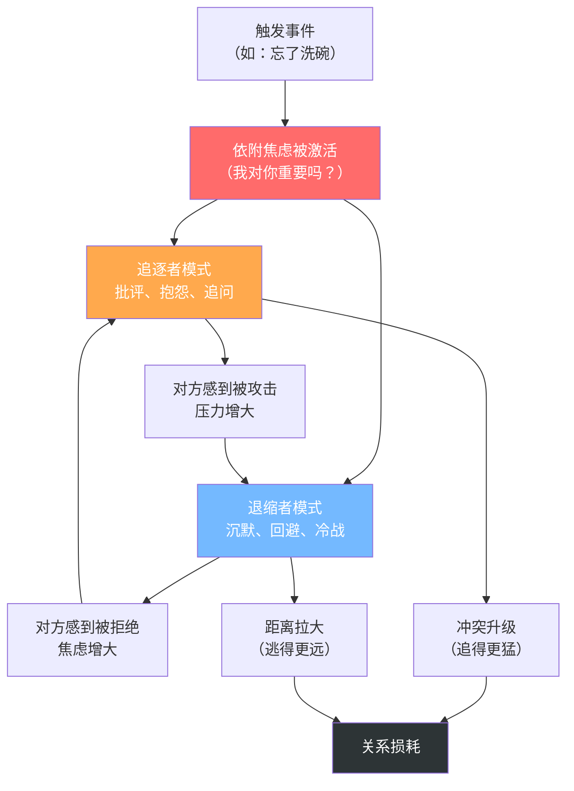

## 案例四：伴侣争吵——倾听中的情绪降级

伴侣争吵是所有倾听场景中最特殊的一种。它不同于客户投诉（有明确的服务补救路径）、朋友倾诉（有情感距离的缓冲）、或职场沟通（有专业角色的约束）。亲密关系中的争吵发生在最脆弱的人之间，涉及最深层的情感需求，也最容易造成不可逆的伤害。

本案例将从亲密关系的心理学机制、争吵升级的动力学模型、六种致命错误回应、分阶段正确示范、以及争吵后的修复对话五个维度，完整呈现"伴侣争吵倾听"的每一个关键动作。

---

### 场景描述

你和伴侣因为家务分配的问题发生了争吵。对方说：

> "你每次都这样！说好了你洗碗，结果每次都要我来催！你根本不把这个家当回事！你眼里只有你的工作！"

**场景要素分析**：

| 要素 | 具体内容 | 倾听意义 |
|------|---------|---------|
| 表面议题 | 洗碗、家务分配 | 这是一个可以协商解决的具体问题，但此刻它不是重点 |
| 情绪状态 | 愤怒、委屈、失望的混合体 | 对方正处于高唤醒情绪状态，理性脑暂时下线 |
| 绝对化用词 | "每次"、"根本"、"只有" | 这些词不是在描述事实，而是在表达情绪的强度——越绝对，情绪越强烈 |
| 关系信号 | "不把这个家当回事" | 对方在质疑的不是你的行为，而是你对这段关系的投入程度 |
| 隐含需求 | "我觉得不被重视" | 表面抱怨洗碗，深层诉求是"在这段关系中，我是否是你的优先级？" |
| 沟通场景 | 面对面、情绪高峰 | 双方都在场，情绪传染风险最高，但也最容易通过非语言信号传递关心 |

这段话不到60个字，但背后包含了至少五层信息：行为层（没洗碗）、情绪层（愤怒和委屈）、关系层（不被重视）、价值层（家庭vs工作的优先级排序）、依附层（我对你重要吗？）。如果只听到了"洗碗"这一层，你就丢掉了伴侣真正想说的80%。

---

### 为什么伴侣争吵特别难倾听

伴侣争吵之所以是倾听的"地狱模式"，有三个深层原因：

#### 原因一：依附系统的激活

**理论基础**：英国精神分析学家约翰·鲍尔比（John Bowlby）的依附理论（Attachment Theory）指出，人类在亲密关系中会激活一套古老的"依附系统"。当一个人感到与依附对象（伴侣）的连接受到威胁时，会产生强烈的焦虑和愤怒——这和婴儿找不到妈妈时的反应是同一套神经回路。

**在争吵中的表现**：

- 伴侣说"你根本不把这个家当回事"，表面上是在批评你的行为，但依附系统的解读是"你不在乎我""我对你不重要""我们的连接在断裂"。
- 这就是为什么伴侣争吵中的愤怒往往不成比例——你只是忘了洗碗，但对方的反应像是你犯了背叛。因为在依附系统的语境中，"被忽视"和"被抛弃"共享同一组神经警报。
- 依附理论研究者苏·约翰逊（Sue Johnson）将伴侣争吵中的核心模式概括为"追-逃循环"（Pursue-Withdraw Cycle）：一方越追（批评、抱怨），另一方越逃（沉默、回避），追的一方因为得不到回应而追得更猛，逃的一方因为压力太大而逃得更远——直到关系崩溃。

#### 原因二：情绪洪水（Emotional Flooding）

**生理机制**：心理学家约翰·戈特曼（John Gottman）的研究发现，当人在争吵中心率超过100次/分钟（约比静息心率高20%）时，会进入"情绪洪水"状态。此时：

- 大脑的前额叶皮层（负责理性思考、冲动控制、共情能力）活动显著降低
- 杏仁核（负责威胁检测和战斗-逃跑反应）接管大脑
- 身体进入应激状态：肾上腺素和皮质醇大量分泌
- 听力理解能力下降约40%——你听到的不是对方说了什么，而是对方的"攻击性"
- 记忆变得选择性——更容易记住负面信息，忽略正面信息

**这意味着什么**：当你的伴侣处于情绪洪水状态时，他在物理上无法"讲道理"。此时任何逻辑论证、事实澄清、合理建议都会被他的大脑过滤为"你在反驳我"或"你不在乎我的感受"。你必须先帮助双方的情绪脑降温，理性脑才能重新上线。

**如何判断对方是否处于情绪洪水**：

| 信号 | 具体表现 | 你该怎么做 |
|------|---------|-----------|
| 语速突然加快 | 像连珠炮一样不停地说 | 不要打断，让情绪流出来 |
| 音量明显提高 | 从正常说话变成喊叫 | 降低自己的音量（不要以声压声） |
| 开始翻旧账 | "上次你也是这样！" | 不要纠正"上次"的事实版本 |
| 绝对化表达 | "你总是！""你从来！""你永远！" | 不要纠缠字眼，听情绪不听措辞 |
| 身体信号 | 脸红、握拳、呼吸急促 | 暂停对话，给彼此冷静的时间 |
| 眼泪 | 哭泣 | 比愤怒更深层的信号，需要更大的温柔 |

#### 原因三：戈特曼的"末日四骑士"

戈特曼通过对3000多对夫妻的纵向研究，发现了四种最具破坏力的沟通模式，他称之为"末日四骑士"（The Four Horsemen of the Apocalypse）。这四种模式如果长期存在，能以93.6%的准确率预测关系破裂：

| 骑士 | 定义 | 在争吵中的表现 | 杀伤力 |
|------|------|--------------|--------|
| 批评（Criticism） | 对伴侣的人格或性格进行攻击 | "你这个人就是自私" | 将行为问题上升为人格问题 |
| 蔑视（Contempt） | 从道德优越感出发贬低伴侣 | 翻白眼、冷笑、"你也就这点出息" | 对关系最具破坏力，与免疫系统下降相关 |
| 防御（Defensiveness） | 拒绝承认任何责任 | "我怎么了？你不也一样吗？" | 本质上是一种变相的指责 |
| 石墙（Stonewalling） | 完全关闭沟通 | 沉默、转身离开、冷暴力 | 让对方感到被彻底抛弃 |

**关键发现**：在这四骑士中，蔑视是关系的头号杀手。批评可以被修复，防御可以被理解，石墙可以通过耐心打破——但蔑视意味着尊重的丧失，而尊重是一切亲密关系的地基。这就是为什么在伴侣争吵中，倾听的底线是：**你可以不同意对方的观点，但绝不能蔑视对方这个人**。

---

### 错误示范：六种致命的争吵回应方式

#### 错误类型一：反驳型——纠缠字眼

> "什么叫'每次'？我上周不就洗了吗？你怎么总是把事情说得那么夸张？再说我工作忙怎么了？我不工作谁赚钱养家？"

**逐句拆解**：

- **"什么叫'每次'？我上周不就洗了吗？"**：你在和伴侣辩论一个统计学问题——"每次"到底是100%还是80%。但伴侣说"每次"的时候，他不是在做数据分析，而是在表达"我积累了很多次失望"。纠缠字眼的本质是回避真正的情感话题。
- **"你怎么总是把事情说得那么夸张？"**：这是对伴侣表达方式的批评。你在说"你表达感受的方式是错的"。伴侣会觉得"我不但没被听到，还被评判了"。
- **"再说我工作忙怎么了？我不工作谁赚钱养家？"**：这是一个反问式的防御——你把自己放在了受害者的位置上。在伴侣的眼中，这等于"我为这个家付出那么多，你还不满意？"——这会让争吵从"家务分配"升级为"谁付出更多"的全面战争。

**心理学根源**：这种回应犯了两个经典错误。第一，用事实反驳情绪——"上周洗了"是事实，但"每次都要我催"是感受，两者不在同一个层面上对话。第二，触发了"批评→防御→反击"的升级螺旋——戈特曼的研究表明，一场争吵的前3分钟决定了整场争吵的走向。如果开场就是反驳，后面99%的概率会升级。

#### 错误类型二：冷战型——石墙回应

> （沉默，黑着脸，摔门进了房间）

**逐句拆解**：

- **沉默**：在伴侣已经感到"不被重视"的时候，沉默等于确认了这个判断——"你看，他连解释都懒得给我"。
- **黑着脸**：你的表情在传递"我很烦你""我不想和你说话"。这是一种非语言的蔑视。
- **摔门进了房间**：物理上的离开在依附系统的语境中等于"我在离开这段关系"。即使你知道你只是需要冷静一下，但伴侣接收到的信号是"他不在乎我"。

**为什么冷暴力比争吵更伤**：戈特曼的研究发现，"石墙"是男性在亲密关系争吵中最常见的模式（约85%的石墙者是男性），其破坏力仅次于蔑视。原因是：冷暴力让对方陷入"双重束缚"——他有话要说但找不到听众，有情绪要表达但没有接收者，有需求要提出但没有对话对象。这种无力感会逐渐转化为绝望，最终导致"情感退出"——不是分手，而是"虽然还在一起，但我已经不在乎了"。

**石墙者的内心真相**：大多数石墙者并非真的不在乎，而是因为情绪洪水导致他们的生理应激反应太强烈（心率飙升、肌肉紧张），选择关闭是为了"自我保护"。但问题在于，你在保护自己的时候，把所有的痛苦都留给了对方。正确做法是：告诉对方"我现在情绪太激动了，我需要20分钟冷静一下，然后我们再谈"——这不是冷暴力，而是"有承诺的暂停"。

#### 错误类型三：反攻型——你也不怎么样

> "你还有脸说我？你自己呢？上次你答应去接孩子结果呢？还不是我赶过去的？你有什么资格说我？"

**逐句拆解**：

- **"你还有脸说我？"**：直接将对话从"解决问题"切换为"互相攻击"模式。
- **"你自己呢？上次你……"**：翻旧账是争吵升级的催化剂。每一次翻旧账都是在告诉对方"我一直在记你的账"，这会让伴侣觉得自己在这段关系中永远处于"被审判"的位置。
- **"你有什么资格说我？"**：这是否定对方提出问题的权利。在伴侣看来，"我连表达不满的资格都没有了？"

**后果**：这种回应会将一场关于洗碗的小争执，升级为"清算总账"的全面战争。双方开始翻出过去几个月甚至几年的旧账，每一笔账都带着未消解的委屈。争吵的议题从一个具体的家务问题，爆炸式扩散为对整段关系的全面质疑。

#### 错误类型四：说教型——理性碾压

> "你听我说，我们都是成年人了，有话好好说。你这样情绪化解决不了问题。你先冷静下来，我们理性地讨论一下家务分配方案，我可以做一张表格，把每天的任务分配清楚。"

**逐句拆解**：

- **"你听我说"**：这四个字的潜台词是"你没在听道理，我来教你"。是一种居高临下的姿态。
- **"我们都是成年人了"**：在暗示"你现在的行为不像成年人"。这是对伴侣情绪表达的贬低。
- **"你这样情绪化解决不了问题"**：你在告诉伴侣"你的情绪是问题的一部分，而不是需要被回应的信号"。
- **"做一张表格"**：在伴侣最需要情感连接的时候，你提供了一个Excel解决方案。这就像一个人在哭的时候，你递给他一张纸巾，然后说"别哭了，哭解决不了问题"。

**核心错误**：在对方的情感需求未被满足之前提供理性解决方案，等于在说"你的感受不重要，我们来谈谈事实吧"。戈特曼的研究表明，在亲密关系中，情感连接的需求远高于问题解决的需求——伴侣可以忍受"问题没解决"，但无法忍受"感受不被看见"。

#### 错误类型五：讨好型——无原则退让

> "好好好，都是我的错，我以后天天洗碗行了吧？你别生气了，你一生气我就特别难受。"

**逐句拆解**：

- **"都是我的错"**：这不是承担责任，而是放弃对话。你在用认输来终止争吵，但争吵背后的真正问题（"我觉得不被重视"）完全没有被触及。
- **"我以后天天洗碗行了吧？"**：这是一个不切实际的承诺，而且带有明显的被动攻击色彩——"行了吧"三个字传递的不是诚意，而是不耐烦。
- **"你一生气我就特别难受"**：你在把伴侣的情绪表达变成你的负担。潜台词是"你生气会伤害我，所以请你不要生气"——这实际上是在要求伴侣压抑自己的情绪来保护你的感受。

**为什么讨好不是倾听**：讨好看似温柔，实际上是一种回避——你在回避真正的情感对话。长期的讨好模式会导致两个后果：一是你内心积累越来越多的委屈和不满，最终以更大的方式爆发；二是你的伴侣会感到"他根本没有在听，他只是在应付我"。

#### 错误类型六：转移型——顾左右而言他

> "哎呀别说了，你看今天天气不错，我们出去走走吧。对了，你妈昨天打电话来了，说周末让我们过去吃饭。"

**逐句拆解**：

- **"哎呀别说了"**：你在否定争吵这件事本身存在的合理性。
- **转移话题**：用一个无关的话题来"替换"未解决的冲突。这在短期内可能有效（争吵暂停了），但问题并没有消失——它只是被压到了地毯下面，下次会以更大的力度冒出来。
- **提及第三方**：引入"你妈"这个话题可能触发更多的关系议题，让局面更加复杂。

**根本问题**：转移型回应传递的信号是"这个问题不值得讨论"。但对你的伴侣来说，他鼓起勇气表达不满，本身就是一种冒险——他冒着被拒绝、被反驳的风险说出了自己的感受。你的转移话题等于在说"你的冒险不值得我的认真对待"。

---

### 正确示范：分阶段的争吵倾听框架

下面的回应经过精心设计，分为六个阶段。每个阶段都有明确的目标和心理学依据。

#### 第一阶段：自我暂停（前10秒）

在回应之前，先做一个内在动作：

> （深呼吸一次。在心里对自己说："他现在很受伤。他在说的不是洗碗，而是'我觉得不被重视'。我的任务不是辩解，而是让他感到被听见。"）

**为什么这一步至关重要**：你自己的情绪也需要管理。如果你带着防御心态进入对话，无论你说什么都会带有"反驳"的味道。10秒的自我暂停可以让你的应激反应降低一个等级——研究表明，一次缓慢的深呼吸可以将心率降低5-10次/分钟，帮助你避免情绪洪水。

**内在对白的作用**：提前在心里翻译对方的话——从"他在攻击我"转译为"他在表达受伤"——这个认知重构（Cognitive Reframing）可以从根本上改变你回应的基调。

#### 第二阶段：情绪接纳（10-30秒）

> "我听到了。（停顿）你很生气，也很委屈。你觉得我经常忘记洗碗，需要你来提醒，这让你承担了更多的家务压力。"

**动作拆解**：

| 话语 | 核心动作 | 心理学依据 |
|------|---------|----------|
| "我听到了" | 用最简单的三个字确认接收 | 这是回应的"握手信号"——告诉对方"我在线" |
| 停顿 | 不急于接话，给对方一个缓冲 | 避免打断对方的情绪流，同时传递"我在认真对待" |
| "你很生气，也很委屈" | 情感标注：命名对方的情绪 | UCLA的Lieberman教授发现，情绪被命名时杏仁核活动降低，情绪强度下降 |
| "觉得我经常忘记洗碗" | 内容复述：证明你听到了具体事实 | 让对方确认"他听到了我说的话"，满足被倾听的基本需求 |
| "承担了更多的家务压力" | 情感反映：把表面话题翻译成核心感受 | 从"洗碗"上升到"不公平感"——你在听他真正想说的话 |

**为什么不反驳"每次"**：当你说"我听到了，你觉得我经常忘记洗碗"时，你用"经常"替换了"每次"——这不是在纠正对方的措辞，而是在用一个更温和的词来表达同样的意思。你既没有否定对方的感受（"经常忘记"确实是真的），也没有纠缠于统计学准确性（"每次"是否精确到100%）。这是一种"软化"技术——你在帮对方把攻击性的语言翻译成可以被讨论的语言。

#### 第三阶段：承认责任（30-60秒）

> "你说得对，我确实在洗碗这件事上做得不够好。我好几次答应了但没有做到，这对你不公平，这一点我承认。"

**动作拆解**：

- **"你说得对"**：直接确认对方的判断有效。在争吵中，被确认是比被同意更深层的需求——对方要的不是你马上去洗碗，而是你承认"他说的有道理"。
- **"我确实做得不够好"**：不找借口，不加"但是"。"但是"后面的内容会抹杀前面的承认。
- **"好几次答应了但没有做到"**：用具体行为来承认，而非笼统的"我错了"。笼统的认错缺乏可信度，具体的行为描述让对方觉得你真的在反思。
- **"这对你不公平"**：承认不公平感——这正是对方的核心感受。

**"承认"与"讨好"的区别**：

| 维度 | 承认 | 讨好 |
|------|------|------|
| 内在状态 | 经过反思，真诚认识到问题 | 为了终止争吵而认输 |
| 措辞 | "我做得不够好"（具体） | "都是我的错"（笼统） |
| 后续 | 会提出改进方案 | 不会改变任何行为 |
| 对方感受 | "他真的理解了" | "他在敷衍我" |
| 长期效果 | 建立信任 | 积累更多不满 |

#### 第四阶段：深层探询（60-120秒）

> "你说'眼里只有工作'，我想认真了解一下——除了洗碗，还有哪些事情让你觉得我把工作放在了家庭前面？你是从什么时候开始有这种感觉的？"

**动作拆解**：

- **引用原话**：直接引用对方说过的"眼里只有工作"，表明你记住了他的原话，这本身就是一种深度倾听。
- **"认真了解"**：用"认真"这个词强调你的态度——这不是随便问问，而是一个郑重的邀请。
- **"除了洗碗，还有哪些"**：开放式问题，邀请对方展开更深层的话题。你在告诉对方"我愿意听更多"。
- **"从什么时候开始"**：时间维度的问题帮助你理解问题的演变过程——这是一个长期积累的问题还是最近才出现的？

**为什么这个阶段至关重要**：

很多伴侣争吵之所以反复发生，是因为双方只停留在表面议题（洗碗），从未触及深层议题（"我觉得不被重要"）。通过深层探询，你有可能将一场破坏性的争吵转化为一次建设性的对话——对方可能会说出"上个月你加班到很晚，我生日那天你也是最后一个到的"这样的具体内容，这才是真正需要被解决的问题。

**提问的注意事项**：

- 用好奇而非审问的语气——你是在邀请他分享，不是在审讯
- 不要一次问太多问题——给对方时间思考和表达
- 如果对方不想回答，不要追问——"你不想说也没关系，等你准备好了我们再聊"
- 认真听回答，不要在听的过程中准备反驳

#### 第五阶段：表达意愿与共同解决（120-180秒）

> "我希望我能更好地平衡工作和家庭。你对我来说比工作重要得多，但我之前的行动没有体现出这一点，这是我的问题。（**表达意愿 + 承认差距**）
>
> 我们能不能一起想个办法？比如我设一个每天晚上8点的闹钟提醒自己洗碗，或者我们重新分配一下家务——你更不喜欢做哪些，我来接手？或者我们每周花15分钟对一下家务分工？（**共同解决 + 提供具体方案**）"

**动作拆解**：

- **"你比工作重要"**：直接回应对方最核心的依附需求——"我对你重要吗？"答案是明确的"重要"。
- **"行动没有体现"**：不是空口承诺，而是承认行为和价值观之间的差距——这比"我以后会改"有说服力得多。
- **"一起想个办法"**：把"你对我错"的对抗模式转化为"我们一起面对问题"的合作模式。"一起"这个词是亲密关系中最有力量的词之一。
- **提供多个具体方案**：不是空洞的"我会改"，而是可执行的、可验证的方案（闹钟、重新分工、每周对齐）。这让对方看到你不是在说好话，而是在认真思考解决方案。
- **"你更不喜欢做哪些，我来接手"**：把选择权交给对方，同时表达"我愿意承担更多"的态度。

**为什么不直接给方案而要"一起想"**：如果你说"我以后每天8点洗碗"，这是一个单方面的决定——对方没有参与感，也可能觉得这个方案不靠谱（"你上次也是这么说的"）。"一起想"邀请对方参与解决方案的设计，他会对方案有更多的认同感和信心。

#### 第六阶段：修复与连接（180秒+）

> （说完后，如果你感觉到气氛缓和了，可以轻轻握住对方的手，或者靠近一些）
>
> "谢谢你告诉我这些。我知道说出来不容易，我以后会认真听的。"

**动作拆解**：

- **"谢谢你告诉我"**：把对方的抱怨重新定义为"分享"和"沟通"——这是一种认知重构。你在告诉对方"你的表达是被珍视的"，这会鼓励他以后继续用沟通而非压抑来处理不满。
- **"我知道说出来不容易"**：承认对方表达不满也需要勇气——在亲密关系中，说出"你让我不满意"是需要冒着被反驳、被拒绝的风险的。你在认可他的勇气。
- **"我以后会认真听"**：承诺不仅仅是关于洗碗，而是关于"倾听"本身——这回应了更深的需求。

---

### 技巧深度分析：为什么这些动作有效

#### 技巧一：从"洗碗"到"不被重视"——议题翻译

**原理**：伴侣争吵中的表面议题（家务、花钱、作息、社交）几乎从来不是真正的议题。真正的问题通常是以下几种深层需求之一：

| 表面抱怨 | 深层需求 | 核心问题 |
|---------|---------|---------|
| "你总是不做家务" | "我需要公平感" | 我们的付出是否对等？ |
| "你又乱花钱" | "我需要安全感" | 我们的未来是可预期的吗？ |
| "你怎么又加班" | "我需要被优先" | 在你的排序中，我排第几？ |
| "你怎么不回我消息" | "我需要确认连接" | 你还在乎我吗？ |
| "你怎么跟你妈说我们的事" | "我需要边界感" | 我们的关系是独立的吗？ |

**倾听的任务**：在对方说出"洗碗"的时候，你的大脑需要同时运行两个频道——频道A接收表面信息（洗碗没洗），频道B翻译深层信息（不被重视）。大多数争吵中的错误回应，都是因为只听到了频道A而忽略了频道B。

**如何训练这种翻译能力**：

1. 当对方使用绝对化词语（"每次""总是""从来"）时，自动翻译为"我积累了很多失望"
2. 当对方质疑你的动机（"你就是不在乎"）时，自动翻译为"我需要确认我在乎"
3. 当对方翻旧账时，自动翻译为"那件事到现在还让我疼"
4. 当对方说出"你根本不……"时，自动翻译为"我感到不被……"

#### 技巧二：情感标注在亲密关系中的特殊应用

**原理**：情感标注（Affect Labeling）——用语言准确命名情绪——在伴侣争吵中有特殊的力量。因为亲密关系中的人对彼此的情绪信号最为敏感，一个准确的情感标注会让对方产生"他真的懂我"的深刻体验。

**三层次情感标注法**：

| 层次 | 做法 | 示例 | 效果 |
|------|------|------|------|
| 第一层：命名情绪 | 说出对方的情绪 | "你很生气" | 对方感到"情绪被看见了" |
| 第二层：理解原因 | 说出情绪的来源 | "因为我总是忘记洗碗" | 对方感到"原因被理解了" |
| 第三层：触及核心 | 说出情绪背后的深层感受 | "这让你觉得自己不被重视" | 对方感到"真正的我被理解了" |

大多数人在争吵中只能做到第一层（"你别生气了"），能做到第二层的已经很少（"我知道你因为我没洗碗生气"），能做到第三层的是真正的倾听高手（"你觉得不被重视"）。第三层之所以有力量，是因为它触及了对方自己可能都没有清楚意识到的深层感受——当对方听到你说出"不被重视"三个字时，他的反应往往不是"对"，而是一阵沉默，甚至眼泪——因为你说出了他心里一直有但说不出的东西。

#### 技巧三：Gottman的"修复尝试"（Repair Attempt）

**原理**：戈特曼的研究发现，决定一段关系能否持久的关键因素不是"双方是否会争吵"（所有伴侣都会争吵），而是"争吵中是否有人做出修复尝试"以及"对方是否接受修复尝试"。

**什么是修复尝试**：修复尝试是任何能够阻止负面情绪升级的言行。它可以是一句话、一个表情、一个动作、甚至一个玩笑。

**修复尝试的示例**：

| 类型 | 示例 | 适用时机 |
|------|------|---------|
| 幽默 | "等一下，我们是不是在为一个碗吵架？" | 双方情绪开始下降时 |
| 触碰 | 轻轻握住对方的手 | 对方哭泣或沉默时 |
| 认错 | "对不起，我刚才说话语气太重了" | 你意识到自己也有问题时 |
| 暂停 | "我们能不能暂停10分钟？我需要冷静一下" | 你感到自己要情绪洪水时 |
| 共同立场 | "我们都不想这样吵下去对不对？" | 争吵陷入僵局时 |
| 自嘲 | "我刚才的样子一定很蠢" | 气氛略有缓和时 |
| 情感暴露 | "其实我害怕你真的觉得我不在乎" | 想要深化对话时 |

**修复尝试成功的关键**：不是修复尝试本身有多巧妙，而是双方是否已经建立了"接受修复尝试"的意愿。如果你的伴侣过去多次做出修复尝试而你都忽略了，他最终会放弃尝试——这才是关系真正危险的时刻。

#### 技巧四：情绪降级的时间窗口

**原理**：情绪洪水的生理恢复需要至少20分钟。这意味着如果你或伴侣的心率已经超过100次/分钟，你们需要至少20分钟的冷静时间才能恢复理性对话能力。

**两种暂停方式**：

| 方式 | 做法 | 效果 |
|------|------|------|
| ❌ 冷战式暂停 | 摔门离开，不告知回来时间 | 对方感到被抛弃，焦虑加倍 |
| ✅ 有承诺的暂停 | "我现在情绪太激动了，给我20分钟冷静一下，然后我们继续谈" | 对方知道你不会消失，有了确定性预期 |

**暂停期间做什么**（不是用来准备反驳论据的）：

- 做深呼吸或肌肉放松练习
- 散步或做轻度运动（帮助代谢应激激素）
- 问自己："他真正想说的是什么？"
- 回忆一下你们最近一次愉快的互动
- 准备一个修复尝试的开场白

---

### 更多实战场景：不同类型的伴侣争吵

#### 场景二：金钱分歧

**对方说**：

> "你又买了一双鞋？你上个月不是刚买了吗？你知道这个月的房贷还差多少吗？你从来不考虑这些！"

**错误回应**：

> "我花自己赚的钱怎么了？你管得也太宽了吧。你自己的化妆品不也一堆一堆地买？"

**正确回应**：

> "我听到了，你在担心我们的财务状况。（**情绪接纳**）你觉得我花钱太大手大脚，没有考虑到我们共同的经济压力。（**内容反映**）你说得对，房贷确实是大事，我应该在消费前多想想。（**承认**）你是不是最近在财务上压力比较大？能不能告诉我你现在最担心的是什么？（**深层探询**）我们一起看一下这个月的账单，商量一个我们都觉得合理的消费计划好不好？（**共同解决**）"

#### 场景三：社交冲突

**对方说**：

> "你又跟你朋友出去？一周出去三次了！我约你看个电影你都说没时间！你那些朋友比我重要是吧？"

**错误回应**：

> "我就出去跟朋友吃个饭怎么了？你能不能别这么粘人？我也需要自己的社交空间吧？"

**正确回应**：

> "你觉得我把朋友排在你前面了。（**情感反映**）你约我看电影我没答应，这让你很失望。（**情绪命名**）你说得对，最近确实陪你太少了。（**承认**）你是不是觉得我们在一起的时间不够？你理想中我们一周大概能有多少相处的时间？（**深层探询**）下周我们把周三和周六晚上定成我们的约会时间怎么样？（**共同解决**）"

#### 场景四：育儿分歧

**对方说**：

> "你怎么又给孩子看手机？说了多少次了！你就是图省事！孩子的眼睛坏了你负责吗？"

**错误回应**：

> "就看一会儿怎么了？你带孩子的时候不也给他看？你有什么资格说我？"

**正确回应**：

> "你在担心孩子的视力和习惯养成。（**内容反映**）我确实有时候为了省事就让孩子看手机，这一点我做得不好。（**承认**）你觉得我们对孩子使用电子设备的标准是不是不太一致？你理想的规则是什么样的？（**深层探询**）我们一起定一个家规吧，两个人都遵守。（**共同解决**）"

---

### 争吵后的修复对话

大多数伴侣争吵不会在当场完全解决。争吵结束后，如果处理得当，反而可以成为加深理解的机会。但前提是：你需要在冷静之后主动发起一次"修复对话"。

#### 修复对话的五步框架

**第一步：选择时机（争吵后2-24小时内）**

- 不要在情绪还没消退时就发起修复（可能再次吵起来）
- 不要拖太久（超过24小时，对方会觉得你已经忘了或者不在乎）
- 不要在公共场合或有他人在场时发起
- 最好的时机是两个人都相对放松的时刻（如睡前、饭后散步）

**第二步：以脆弱开头，而非以道理开头**

> ❌ "我后来想了一下，你说的那些其实不太准确……"
>
> ✅ "今天吵架的时候，你说了那句'你根本不把这个家当回事'，我一直在想这句话。我意识到你可能已经忍了很久了，而我一直没注意到。"

**第三步：分享你在争吵中的内在体验**

> "我承认我刚才反驳你的时候，是因为我觉得自己被攻击了。但后来冷静下来想想，你说的不是在攻击我，而是在告诉我你很受伤。我的防御反而让你更受伤了，对不起。"

**第四步：共同回顾核心议题**

> "你提到的'眼里只有工作'——我想认真和你聊一下这个问题。你觉得从什么时候开始有这种感觉的？具体是哪些时刻让你最失望？"

**第五步：制定具体的行动计划**

> "我以后每天晚上8点设个闹钟洗碗。另外我想每周三晚上和周六下午留出来专门陪你，不看手机，不做工作。你觉得这样可以吗？还有没有其他你希望我改变的？"

**行动承诺的SMART原则**：

| 要素 | 要求 | 示例 |
|------|------|------|
| Specific（具体） | 不是"我会多做家务" | "我每天晚上8点洗碗" |
| Measurable（可衡量） | 有明确的执行标准 | "每周三和周六下午不看手机" |
| Achievable（可实现） | 不做不切实际的承诺 | 不是"我以后永远不加班" |
| Relevant（相关） | 直接回应争吵的核心议题 | 承诺与"不被重视"直接相关 |
| Time-bound（有时限） | 说明从何时开始 | "从明天开始" |

---

### 常见误区与纠正

#### 误区一：伴侣不应该吵架

**错误认知**："好的感情不应该有争吵，吵架说明不合适。"

**事实**：戈特曼的研究表明，69%的伴侣冲突是永久性的——它们源于双方性格、价值观、成长背景的差异，无法被"解决"，只能被"管理"。幸福的伴侣和不幸福的伴侣之间，区别不在于是否有冲突，而在于冲突发生时如何处理。幸福的伴侣在争吵中保持5:1的正面-负面互动比例——即每1次负面互动（批评、反驳）搭配5次正面互动（认可、幽默、修复尝试）。

#### 误区二：道歉就是认输

**错误认知**："我先道歉就说明我理亏了，以后他说什么我都得听。"

**事实**：在亲密关系中，道歉不是法律上的认罪书，而是情感上的桥梁。道歉的本质是"我在乎你的感受超过我在乎我的面子"。愿意道歉的人不是弱者，而是在关系中有足够安全感的人——他知道道歉不会被用来攻击他。

#### 误区三：道理讲赢了就赢了

**错误认知**："我说的都是对的，他应该接受。"

**事实**：在伴侣争吵中，"对"和"赢"是两件不同的事。你可以在道理上完全正确，同时在关系上彻底失败。如果你的"正确"让伴侣感到不被尊重、不被理解、不被重视，那这个"正确"就是关系的毒药。亲密关系的目标不是"谁对谁错"，而是"我们都感到被爱"。

#### 误区四：翻旧账是合理的

**错误认知**："上次的事情你没给我一个说法，我当然要提。"

**事实**：翻旧账之所以破坏力巨大，是因为它传递的信号是"你的每一次错误都会被永久记录"。这会让伴侣感到无论怎么做都无法被原谅，最终导致"反正我怎么做你都要翻旧账，那我干脆什么都不做了"。如果旧账中有未解决的问题，应该在双方都冷静的时候单独拿出来谈，而不是在新争吵中作为武器使用。

#### 误区五：沉默是金

**错误认知**："我不说话就不会吵起来，忍一忍就过去了。"

**事实**：不说话不等于不表达。你的沉默、叹气、翻白眼、摔门——每一个动作都在"说话"，而且比语言更伤人。更重要的是，忍耐是有容量的——每次忍耐都会填满一点，直到溢出的那一天，爆发的力度与忍耐的时间成正比。正确做法不是忍耐，而是找到合适的时机和方式表达。

#### 误区六：倾听意味着全盘接受

**错误认知**："如果我倾听他的抱怨，是不是就等于承认他说的都对？"

**事实**：倾听和同意是两件事。你可以说"我理解你觉得家务分配不公平"而不必承认"我从来不做家务"。倾听的意义是让对方感到被听见、被理解、被尊重——而不是让你放弃自己的立场。事实上，当对方的情绪被充分接纳之后，他反而更容易听进你的观点和感受。

---

### 进阶：从争吵到深度连接

伴侣争吵中隐藏着一个反直觉的真相——**每一次争吵都是一次连接的机会**。之所以争吵，是因为对方还在乎、还有需求、还愿意表达。真正危险的不是争吵，而是沉默——当你的伴侣连吵都懒得和你吵了，说明他已经从"追逐者"变成了"放弃者"。

#### 戈特曼的"梦想中的对话"技术

当伴侣反复因为同一个话题争吵时（比如家务、金钱、社交），戈特曼建议进行一次"梦想中的对话"——不是讨论表面问题，而是探索这个问题对双方各自意味着什么。

**操作步骤**：

1. **设定规则**：每个人有10分钟不被打断的说话时间，另一个人只听不反驳
2. **探索梦想**：轮流回答以下问题：
   - "这个问题对你来说为什么重要？"
   - "它和你小时候的经历有关吗？"
   - "你理想中的状态是什么样的？"
   - "如果这个问题解决了，你会有什么感觉？"
3. **寻找共同点**：听完对方后，一起找出双方在这个问题上的共同价值观
4. **不求解决**：这轮对话的目标不是达成解决方案，而是理解彼此

**为什么有效**：大多数伴侣争吵是因为双方只看到了对方的"立场"（"我不要洗碗""你要洗碗"），而没有看到对方立场背后的"需求"（"我需要被尊重""我需要公平感"）。当你理解了对方的需求，你会发现你们的需求往往是相容的——只是实现方式不同。

#### 建立"日常倾听"的习惯

最好的争吵预防不是"学会怎么吵"，而是"在不吵的时候就充分倾听"。日常的倾听积累可以显著降低争吵的频率和强度。

**每日倾听练习**：

| 练习 | 做法 | 时间投入 |
|------|------|---------|
| 每日减压对话 | 每天各用15分钟分享今天发生的事和感受，另一方只听、只回应情感、不给建议 | 30分钟/天 |
| 每周"状态检查" | 花20分钟问对方"这周我们的关系怎么样？有什么我可以做得更好的？" | 20分钟/周 |
| 六秒亲吻 | 每天出门前和回家后的亲吻持续至少6秒（戈特曼研究所的建议） | 12秒/天 |
| 感恩表达 | 每天说出一件你感谢对方的事——具体的，不是笼统的"谢谢你" | 1分钟/天 |
| 好奇心提问 | 每周问一个你不知道答案的问题："你小时候最怕什么？""你最近有什么想尝试的事？" | 5分钟/周 |

戈特曼研究所的数据显示，坚持这些日常练习的伴侣，争吵频率平均降低40%，争吵后修复时间平均缩短60%。

---

### 对照总结：错误回应与正确回应的全维度对比

| 维度 | 错误回应 | 正确回应 | 底层差异 |
|------|---------|---------|---------|
| 情绪处理 | 压制/否定/反驳 | 接纳/命名/反映 | 控制 vs 共情 |
| 信息顺序 | 先说自己的道理 | 先听对方的感受 | 自我中心 vs 对方中心 |
| 字眼处理 | 纠缠"每次""从来" | 纠缠字眼→听情绪 | 事实思维 vs 情感思维 |
| 责任态度 | 推卸/反击/找借口 | 先承认自己的问题 | 防御 vs 成长 |
| 对话模式 | "你对我错"的对抗 | "我们一起面对"的合作 | 对抗 vs 合作 |
| 解决方式 | 单方面宣布方案 | 共同讨论出方案 | 控制 vs 共同参与 |
| 后续跟进 | 吵完就忘 | 修复对话 + 行动承诺 | 短期止痛 vs 长期建设 |
| 语言风格 | 攻击性/防御性措辞 | 温和、具体、邀请性措辞 | 武器 vs 桥梁 |
| 伴侣感受 | "他根本不在乎我" | "他真的在听我说" | 亲密关系的根本差异 |

***

