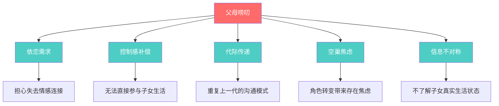
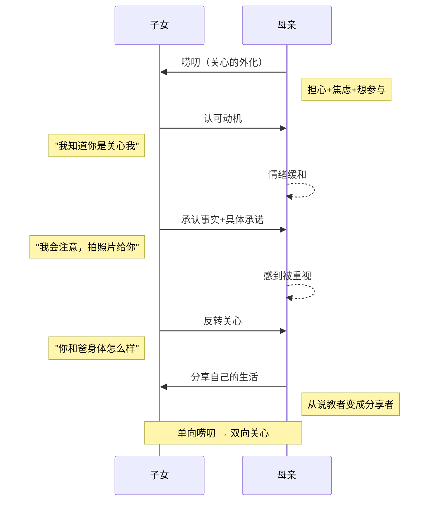
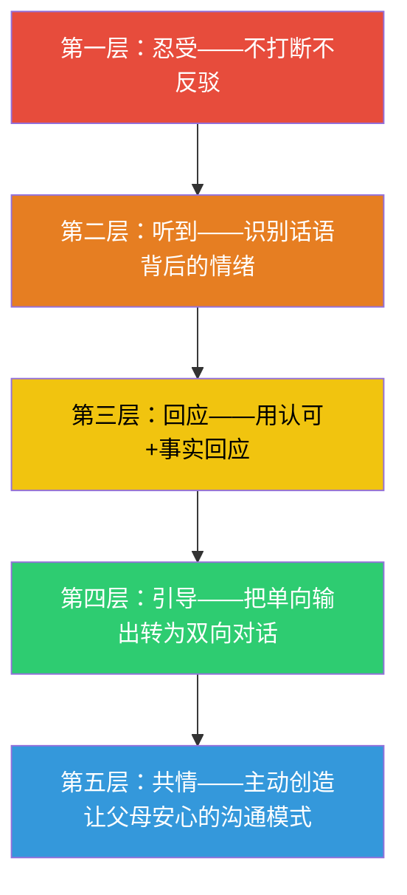

## 案例六：父母唠叨——倾听中的代际理解

父母的唠叨是每个人成长过程中最常见、最容易被忽视、也最容易引发冲突的沟通场景。表面上看，唠叨是"重复说同一件事"；深层来看，唠叨是父母在子女逐渐独立后，试图维持情感连接的一种方式。掌握倾听唠叨的能力，不仅是沟通技巧的体现，更是理解代际关系、修复情感裂痕的关键能力。

### 唠叨的心理机制：为什么父母会唠叨

要真正学会倾听唠叨，首先要理解唠叨背后的心理动因。唠叨不是父母的"坏习惯"，而是多重心理需求交织的外在表现。

#### 依恋理论视角

英国心理学家约翰·鲍尔比（John Bowlby）的依恋理论指出，人类天生具有与重要他人保持情感连接的需求。当子女离家独立后，父母面临"依恋对象远距离化"的挑战。唠叨本质上是父母试图通过语言重复来维持情感纽带的行为——他们不确定你是否真的听进去了，所以会反复说。

#### 控制感丧失的补偿

子女成长独立意味着父母逐渐失去对子女生活的直接影响力。对于习惯了十几年"我说你听"模式的父母来说，这种控制感的丧失会引发焦虑。唠叨是他们在有限的语言空间里重新建立影响力的方式——既然不能替你做决定，至少要反复提醒你。

#### 代际创伤的传递

很多父母自己的成长过程中，也经历了被上一代唠叨的体验。唠叨可能是一种代际传递的沟通模式——他们不知道还有别的方式表达关心，因为他们的父母就是这样做的。

#### 空巢焦虑的外化

当子女离开家庭，父母的日常角色发生根本性转变。从"照顾者"变成了"旁观者"，这种角色转换带来的存在焦虑，常常通过唠叨来释放。每一次叮嘱"多穿衣服""按时吃饭"，都是在说"我仍然需要被你需要"。

### 核心场景：周末电话中的唠叨轰炸

#### 场景描述

你已经工作了，独自在外地生活。周末给父母打电话，妈妈又开始唠叨："你怎么又瘦了？是不是没有好好吃饭？我跟你说多少次了要按时吃饭！你那个外卖少吃点，不健康！还有，你看你表哥，人家去年就结婚了，你呢？你也老大不小了，该找个对象了。上次我跟你说的那个姑娘……"

这段话看似杂乱，实际上包含了三个层次的信息：

| 层次 | 内容 | 真实含义 |
|------|------|----------|
| 表层信息 | 吃饭、外卖、结婚 | 具体生活建议 |
| 情感层 | "你怎么又瘦了" | 我在关注你的变化，我在担心你 |
| 关系层 | "我跟你说多少次了" | 我希望我说的话对你有影响 |

#### 错误示范与逐句分析

> "妈！你能不能别唠叨了！我都多大了还用你说这些？我的事我自己会处理！你别老拿我和表哥比行不行？烦死了！"

这段回应犯了五个沟通错误：

| 你说的话 | 背后的意思 | 造成的伤害 |
|----------|-----------|-----------|
| "你能不能别唠叨了" | 你的表达方式有问题 | 否定了母亲的表达权 |
| "我都多大了" | 我已经不需要你管了 | 否定了母亲的角色价值 |
| "我的事我自己会处理" | 你参与不了我的生活 | 切断了母亲的参与感 |
| "别老拿我和表哥比" | 你在贬低我 | 让母亲觉得自己的关心被曲解 |
| "烦死了" | 和你说话让我痛苦 | 直接伤害了亲子关系 |

**长期后果**：每一次这样的对话都会在亲子之间筑起一道墙。母亲会逐渐减少主动联系的频率，表面上"清净了"，实际上是情感连接在断裂。很多人在若干年后会后悔——"当初不该那样和妈妈说话"。

#### 正确示范与技巧拆解

> "妈，我知道你是关心我。(**第一层：认可动机**)你说得对，我最近确实吃饭不太规律，有时候忙起来就随便对付了。(**第二层：承认事实**)
>
> 你放心，我会注意的。我这周开始尽量自己做饭，给你拍照片看好不好？(**第三层：具体承诺**)
>
> 关于找对象的事，我也在考虑了。(**第四层：不拒绝话题**)你上次说的那个姑娘是什么情况来着？我听听。(**第五层：表达兴趣**)
>
> 对了妈，你和爸最近身体怎么样？上次你说膝盖有点疼，去看了没？(**第六层：反转关心**)"

**逐层拆解**：

**第一层——认可动机**。"我知道你是关心我"这句话的威力在于，它把唠叨从"烦人的重复"重新定义为"爱的表达"。当母亲听到这句话时，她的内心会松一口气——"他理解我了"。这为后续的对话奠定了温暖的基调。

**第二层——承认事实**。不否认自己吃饭不规律，避免了无意义的事实争论。很多人的本能反应是"我哪有瘦""我吃得挺好的"，但这种辩解只会让母亲觉得你在敷衍。承认事实不等于认错，而是表示"我听到了你的观察"。

**第三层——具体承诺**。"拍照片给你看"不是随口敷衍，而是一个可验证的行动承诺。它的精妙之处在于：既回应了母亲的关心，又给了她一个参与你生活的新渠道。母亲收到照片后，会感到自己的关心被认真对待了。

**第四层——不拒绝话题**。关于找对象的事，很多人会本能地回避或敷衍。"我也在考虑了"既不虚假承诺，也不直接拒绝，而是保持了话题的开放性。

**第五层——表达兴趣**。"你上次说的那个姑娘是什么情况"是一个高级技巧——把母亲从"说教者"变成"信息提供者"。当母亲开始介绍情况时，她的角色从单向输出变成了双向互动。

**第六层——反转关心**。"你和爸最近身体怎么样"是最关键的一步。它把对话从"父母关心子女"的单向模式，转换成"互相关心"的双向模式。这才是健康的亲子沟通应有的样子。

### 变体场景与应对策略

父母的唠叨不是只有一种模式。不同类型的唠叨需要不同的倾听和回应策略。

#### 变体一：比较型唠叨——"你看人家谁谁谁"

**典型话术**："你看你表哥，人家去年就升职了""隔壁小王都买房了，你呢""你同学小李孩子都会打酱油了"

**心理机制**：父母并不真的觉得你不如别人。他们使用比较，是因为在他们的认知框架里，"别人家的孩子"是一个现成的参照系。他们想表达的是"我希望你过得好"，但不知道怎么直接说。

**回应策略**：

> "妈，我知道你是希望我过得好。表哥确实挺厉害的。不过我也有自己的节奏，我现在的方向是……（简要分享自己的规划）。你觉得呢？"

**关键点**：不反驳比较，不贬低自己，而是把话题从"你不如别人"转换到"我在走自己的路"。最后一句"你觉得呢"让母亲从评判者变成参与者。

#### 变体二：焦虑型唠叨——反复叮嘱同一件事

**典型话术**："出门记得带伞""路上小心""到了给我打个电话""东西带齐了吗"——同一件事能在一通电话里说三遍。

**心理机制**：这种重复不是因为母亲健忘，而是因为她的焦虑没有得到足够的确认。她需要听到你不仅听到了，而且真的会执行。

**回应策略**：

> "妈，我记住了，伞已经装包里了。你放心，到了我就给你发消息。对了，今天你那边天气怎么样？"

**关键点**：用具体行动描述（"已经装包里了"）代替抽象确认（"知道了"），让母亲的焦虑得到实质性的缓解。然后自然地转换话题，避免在同一个焦虑点上循环。

#### 变体三：催婚催生型唠叨

**典型话术**："你也老大不小了""你看人家都结婚了""什么时候给我抱孙子""趁我们还年轻能帮你带"

**心理机制**：催婚催生的唠叨通常来自三重焦虑——对子女未来生活的担忧、来自亲戚朋友的社会压力、以及自己作为父母的"任务完成感"。在中国文化语境中，子女的婚姻状态直接影响父母的社交面子。

**回应策略**：

> "妈，我理解你的心情。你也是希望我身边有个人照顾。说实话，我也想找到合适的人。不过我不想为了结婚而结婚，那样反而不幸福。我现在的计划是……（分享具体的社交或恋爱进展，哪怕很小）。你也别太着急，有进展我第一时间告诉你。"

**关键点**：既承认母亲的焦虑有其合理性，也清晰地表达自己的立场。关键是给出"我有在行动"的信号——母亲最怕的不是你暂时没对象，而是你完全不想找。

#### 变体四：健康焦虑型唠叨

**典型话术**："你怎么又感冒了""少熬夜""多喝水""去医院看看吧""我跟你说这个偏方特别好用"

**心理机制**：当子女生病或身体不好时，父母的无力感会被放大。他们无法像小时候那样直接照顾你，只能通过语言来弥补这种无力感。

**回应策略**：

> "妈，我已经好很多了。同事陪我去医院看过了，医生说是普通感冒，开了药在吃。你放心，我会照顾好自己的。对了，你上次说的那个养生茶是什么配方来着？我也试试。"

**关键点**：给出具体的恢复信息（"看过了""在吃药"），比"没事"更有说服力。最后一句主动请教母亲的养生知识，既让她感到被需要，也把她的焦虑转化成了有价值的分享。

#### 变体五：翻旧账型唠叨

**典型话术**："你小时候就是这样""上次你就……""我说过多少次了你就是不听""你从小就不让人省心"

**心理机制**：翻旧账的本质是当前的无力感回溯。当父母觉得现在说不动你时，会调用过去的记忆来证明"我一直是对的"。这不是恶意，而是一种防御机制。

**回应策略**：

> "妈，你说得对，小时候我确实让你操了不少心。现在长大了，很多事情我自己也想明白了。你看我现在……（举一个自己成长的例子），其实也有你的功劳。"

**关键点**：先承认过去的事实，然后展示自己的成长，最后把成长归功于母亲。这三步完成了一个完美的叙事转换——从"你不听话"变成"你长大了，我的教育没白费"。

### 倾听唠叨的五层能力模型

**第一层——忍受**（入门）：能做到不打断、不反驳、不翻白眼。这是最低要求，但对于很多和父母一说话就吵架的人来说，已经是一个进步。

**第二层——听到**（进阶）：能识别父母话语背后的真实情绪。"你怎么又瘦了"不是在质疑你的体重，而是在表达"我担心你"。"你看看人家"不是在贬低你，而是在说"我希望你过得好"。

**第三层——回应**（熟练）：能用"认可动机+承认事实"的方式回应。不辩解、不逃避、不敷衍，让父母感到被听到了。

**第四层——引导**（精通）：能主动把单向的唠叨转换成双向的对话。通过提问、分享、反转关心，让父母从"说教者"变成"对话者"。

**第五层——共情**（大师）：能主动创造让父母安心的沟通模式。不需要等到父母唠叨才回应，而是主动分享生活、主动请教、主动关心，从源头减少唠叨的触发。

### 常见误区与纠正

#### 误区一：用"嗯""哦""知道了"敷衍

**为什么是误区**：这种回应看似没有冲突，实际上是一种"软性拒绝"。父母能感觉到你的心不在焉，但又无法明确指责你——因为你确实"回应"了。这种模糊的拒绝比直接的冲突更伤人，因为它让父母感到无力。

**纠正方法**：哪怕只多说一句话，效果就完全不同。把"知道了"改成"知道了，我这周就开始注意"——多了具体的行动承诺，父母的焦虑就能大幅缓解。

#### 误区二：试图用道理说服父母

**为什么是误区**：你可能觉得"我已经解释过我的职业规划了，她为什么还要唠叨"。但唠叨的驱动力不是信息缺失，而是情感焦虑。用道理回应情感需求，就像用创可贴治骨折——方向不对。

**纠正方法**：先回应情感（"我知道你担心"），再补充信息（"我现在的方向是……"）。顺序不能反。

#### 误区三：承诺自己做不到的事

**为什么是误区**：为了快速结束唠叨，很多人会随口承诺"好好好，我这周就去相亲"。但做不到的承诺会严重损害信任——下次你说什么，父母都不会信了。

**纠正方法**：只承诺自己真的会做的事。如果实在没有行动可承诺，可以给一个方向性的回应："我有在考虑了，有进展告诉你。"

#### 误区四：在唠叨高峰期试图改变父母

**为什么是误区**：当父母正在情绪上头时，任何"你能不能别这样说话"的建议都会被听成"你在批评我"。改变沟通模式需要在平时、在双方都平静的时候进行。

**纠正方法**：在非冲突时刻，用"我感受"句式表达："妈，我发现有时候你说好几遍同样的话，我能感觉到你很担心我。其实你只要说一次我就记住了。"这种方式不指责，只是表达感受。

#### 误区五：把唠叨和控制混为一谈

**为什么是误区**：唠叨和控制有本质区别。唠叨是"我反复说，但决定权在你"；控制是"你必须按我说的做"。大多数父母的唠叨属于前者。如果你把唠叨当成控制来对抗，就会过度反应。

**纠正方法**：区分"建议的重复"和"意志的强加"。如果父母只是反复建议但不干涉你的决定，那就是唠叨而非控制，值得用更温柔的方式回应。

### 文化语境：中国式唠叨的特殊性

在中国文化背景下，父母的唠叨有一些独特的文化维度，理解这些维度有助于更精准地倾听。

#### "孝"文化的隐性压力

中国传统孝道文化让很多子女对父母的唠叨产生矛盾心理——理智上知道应该耐心听，情感上又觉得被侵犯了边界。这种矛盾本身就会消耗大量心理能量，让回应变得更加困难。

**应对思路**：把"听唠叨"从"孝道义务"重新定义为"情感投资"。你不是在尽义务，而是在维护一段对你自己也有价值的关系。

#### "报喜不报忧"的反噬

很多在外打拼的年轻人习惯对父母"报喜不报忧"，觉得这是不让父母担心。但这种策略的反噬是——父母因为信息不足而更加焦虑，唠叨反而变多了。他们不知道你的真实状态，只能通过反复叮嘱来弥补信息真空。

**应对思路**：适度分享真实的困难（不是所有困难，而是你能处理但需要父母知道的那些）。当父母对你的生活有了足够的信息，他们的焦虑会自然降低，唠叨也会减少。

#### 代际价值观的真实冲突

有些唠叨背后确实存在价值观冲突——比如婚恋观、职业选择观、生活方式的代际差异。这些冲突不能简单地用"理解父母"来化解，需要更深入的对话。

**应对思路**：在承认差异的前提下寻找共识。"妈，我知道你希望我稳定，我也想要稳定。只是我理解的稳定可能和你不太一样——我觉得在互联网行业持续学习也是一种稳定。"这种方式不否认母亲的价值观，只是展示了另一种可能性。

### 进阶技巧：从被动倾听转变为主动经营

真正的高手不只是会应对唠叨，而是能主动减少唠叨的发生频率。以下是几个经过验证的策略：

#### 定期信息同步

每周固定时间给父母打电话或发消息，主动分享本周的生活——工作进展、饮食情况、社交活动。当父母的信息需求被主动满足时，他们不需要通过唠叨来获取信息。

#### 建立"可验证的承诺"机制

"我会注意身体"是一句空话。"我每周三去健身房，给你发打卡截图"是一个可验证的承诺。后者能让父母的焦虑实质性降低，因为他们有了一个可以观察的指标。

#### 创造父母的"新角色"

唠叨的根源之一是父母的角色萎缩——从"照顾者"变成了"旁观者"。你可以主动赋予他们新角色："妈，你做的那个红烧肉特别好吃，能不能教教我？"——让她从"唠叨者"变成"导师"。"爸，我想买个理财产品，你帮我看看？"——让他从"旁观者"变成"顾问"。

#### 学会"提前回应"

如果你知道某个话题一定会被唠叨（比如过年回家一定会被催婚），提前准备回应比临场发挥要好得多。提前想好"关于结婚的事，我现在的想法是……"，比现场被问到时支支吾吾要强一百倍。

### 自检清单

在和父母通话后，可以用以下清单自检：

| 检查项 | 是 | 否 |
|--------|:--:|:--:|
| 我是否识别了唠叨背后的真实情绪 | □ | □ |
| 我是否认可了父母的关心动机 | □ | □ |
| 我是否给出了具体可验证的回应 | □ | □ |
| 我是否把对话从单向转成了双向 | □ | □ |
| 我是否主动关心了父母的近况 | □ | □ |
| 我是否避免了敷衍性的回应 | □ | □ |
| 我是否承诺了自己能做到的事 | □ | □ |
| 通话结束时双方的情绪是否正面 | □ | □ |

### 本案例的核心启示

父母的唠叨是世界上最容易被忽视的爱的表达。它不完美、不优雅、有时候甚至让人烦躁，但它的本质是——"我还关心你，我还想参与你的生活，我还需要被你需要。"

学会倾听唠叨，不是要你无条件忍受，而是要你看见唠叨背后的那个人——她可能正在厨房里一边做饭一边想着你过得好不好，他可能在客厅里看着电视却心不在焉地想着你什么时候回家。

你能做的最有力的回应，不是"别唠叨了"，而是"妈，我过得挺好的，你呢？"

***
